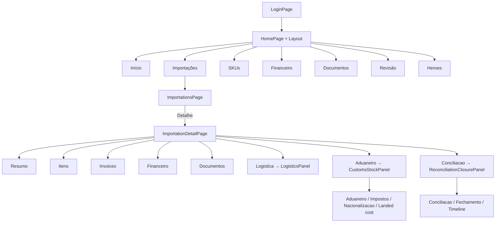

# Guia completo do MVP — Epic Importações

**Versão:** 1.0 · **Data:** 2026-06-20  
**Objetivo:** documento único para repasse — implementação backend, testes, UI (cores, layout, navegação) e APIs consumidas.

**Path do projeto:** `C:\Users\ricar\Desktop\projetos\EPIC\Controle`

---

## 1. Visão geral

Sistema web local para controle de importações: pedidos, invoices, financeiro, documentos, logística, aduana, nacionalização/estoque, landed cost versionado, conciliação e fechamento/reabertura.

| Camada | Tecnologia |
|--------|------------|
| Backend | Python 3.10+, FastAPI, SQLAlchemy, Alembic, Pydantic |
| Banco | PostgreSQL local (porta **5433** neste PC) |
| Frontend | React 18 + TypeScript + Vite |
| Auth | Cookie httpOnly `epic_session` |
| Testes | pytest (81 testes) |
| Deploy local | Uvicorn serve API + build estático do frontend na **mesma porta** |

**Credenciais seed (dev):** `admin@epic.com.br` / `admin123`

**Massa demo:** `POST /api/demo/seed` → 16 cenários `DEMO-01-OCEAN` … `DEMO-16-STOCK`

---

## 2. Estrutura do repositório

```
Controle/
├── app/                    # Backend FastAPI
│   ├── api/                # Rotas REST (/api/*)
│   ├── core/               # enums, permissions, security
│   ├── services/           # Regras de negócio
│   ├── models.py           # SQLAlchemy ORM
│   └── main.py             # App + SPA fallback
├── alembic/versions/       # Migrações 001–005
├── frontend/
│   └── src/
│       ├── index.css       # ÚNICO arquivo de estilos globais
│       ├── api.ts          # Cliente HTTP + tipos TypeScript
│       ├── App.tsx         # Auth gate
│       ├── HomePage.tsx    # Router interno (state, sem react-router)
│       ├── Layout.tsx      # Topbar + menu
│       ├── LoginPage.tsx
│       └── pages/          # Telas e painéis
├── tests/                  # 81 testes pytest
├── scripts/                # start, backup, restore
├── data/attachments/       # Anexos no disco
└── backups/                # DB + anexos
```

---

## 3. Backend implementado

### 3.1 Migrações Alembic

| Rev | Arquivo | Conteúdo |
|-----|---------|----------|
| 001 | `initial_schema` | users, roles, audit_log, reason_codes, sessions |
| 002 | `importation_finance` | suppliers, products, importations, invoices, payments, credits, expenses |
| 003 | `documents_logistics` | attachments, heroes staging, shipments, modal changes |
| 004 | `customs_stock_landed_cost` | customs_documents, taxes, nationalization, stock, landed cost |
| 005 | `reconciliation_closure` | reconciliations, importation_closures, reopened_at |

### 3.2 APIs REST (prefixo `/api`)

| Router | Endpoints principais |
|--------|---------------------|
| `/health` | GET health check |
| `/auth` | login, logout, me |
| `/users` | CRUD admin (cancel soft) |
| `/suppliers`, `/products` | CRUD |
| `/importations` | CRUD, items, transition status |
| `/invoices` | CRUD invoices por importação |
| `/finance` | payments, discounts, credits, expenses, summary |
| `/documents` | upload, list, versionamento |
| `/imports` | heroes upload, staging approve, review-queue |
| `/shipments` | embarques, change-modal, quantity-summary |
| `/customs` | DI/DUIMP, impostos |
| `/stock` | nacionalização, entradas estoque, quantity-chain |
| `/landed-cost` | versões LC + rateio SKU |
| `/reconciliation` | list, run, approve |
| `/closure` | checklist, close, reopen, history, timeline |
| `/demo` | POST seed 16 cenários |

### 3.3 Regras de negócio críticas (backend)

- Campo vazio **nunca** vira zero (`app/core/parse.py`)
- Soft delete global (`SoftDeleteMixin`: `is_active`, `cancelled_at`, …)
- Imposto exige documento aduaneiro + anexo fonte
- Despesa despachante exige evidência
- Nacionalização exige DI/DUIMP OFFICIAL
- Estoque ≤ nacionalizado (ou reason_code)
- Landed cost versionado — versão anterior preservada
- Mudança de modal gera LC REVISED (hook parcial; FX/expense/tax pendente)
- Conciliação: 10+ pares (INVOICE_PAYMENT, QTY_CHAIN, LC_PRELIM_FINAL, …)
- Fechamento bloqueante com checklist; reabertura exige `reason_code`
- Importação CLOSED → APIs de escrita retornam 403

### 3.4 Papéis e permissões

Roles seed: `admin`, `gestor`, `financeiro`, `operador`, `comprador`, `logistica`.

Permissões granulares em `app/core/permissions.py` (ex.: `importation:close`, `logistics:change_modal`).

**UI atual:** não oculta menus por permissão — todas as abas visíveis para admin; operador bloqueado só na API (403).

---

## 4. Testes automatizados (81 passed)

```powershell
cd C:\Users\ricar\Desktop\projetos\EPIC\Controle
.\.venv\Scripts\pytest tests/ -v
```

| Arquivo | Qtd | Cobertura |
|---------|-----|-----------|
| `test_auth.py` | 5 | login cookie, me, logout, credenciais inválidas |
| `test_permissions.py` | 4 | operador bloqueado, audit, reason codes |
| `test_health.py` | 1 | health check |
| `test_importations_finance.py` | 16 | invoices, ANTECIPO, pagamentos, câmbio, créditos, saldos |
| `test_documents_logistics.py` | 17 | upload, heroes, staging, embarques, modal change |
| `test_customs_stock_landed.py` | 15 | DI/DUIMP, impostos, nacionalização, estoque, LC, rateio |
| `test_reconciliation_closure.py` | 13 | conciliação, fechamento, reabertura, demo seed |
| `test_mvp_final.py` | 9 | smoke MVP, permissões, backup anexos |

**Nota:** testes usam `Base.metadata.create_all` em DB de teste (`epic_importacao_test`). Ambiente dev usa Alembic — validar sempre `alembic downgrade base && alembic upgrade head` antes de demo.

---

## 5. Design system da UI (referência para redesign)

> **Arquivo único de CSS:** `frontend/src/index.css`  
> **Sem** Tailwind, MUI, styled-components ou design tokens externos.  
> **Sem** react-router — navegação 100% por `useState` no React.

### 5.1 Paleta de cores

| Token / uso | Hex | Onde aparece |
|-------------|-----|--------------|
| Texto principal | `#1a1a2e` | `:root color`, headings |
| Texto secundário (meta) | `#475569` | `.meta`, subtítulos |
| Fundo página | `#f4f6fb` | `:root background`, body |
| Card branco | `#ffffff` | `.card background` |
| Sombra card | `rgba(26, 26, 46, 0.08)` | `.card box-shadow` |
| Botão primário | `#2563eb` (bg) + `#fff` (text) | `button`, `.nav-active` |
| Botão secundário | `#64748b` | `button.secondary`, "Voltar", "Sair" |
| Nav inativo | `#e2e8f0` (bg) + `#1e293b` (text) | `.nav-link` |
| Nav ativo | `#2563eb` (bg) + `#fff` | `.nav-active` |
| Badge status | `#dbeafe` (bg) + `#1d4ed8` (text) | `.badge` — status PO, modal |
| Erro | `#b91c1c` | `.error` |
| Borda input/tabela | `#ccd3e0` / `#e2e8f0` | inputs, `.data-table` |

### 5.2 Tipografia e espaçamento

- **Fonte:** `"Segoe UI", system-ui, sans-serif`
- **Line-height:** 1.5
- **H1:** 1.75rem, margin-top 0
- **H2 (sections):** 1.1rem
- **Card padding:** 2rem
- **Border-radius:** card 12px, inputs/botões 8px, badge pill 999px
- **App shell:** max-width **960px** (login) / **1100px** (`.app-shell.wide` logado)

### 5.3 Classes CSS disponíveis

| Classe | Função |
|--------|--------|
| `.app-shell` / `.wide` | Container centralizado |
| `.card` | Painel branco com sombra |
| `.topbar` | Header flex (logo + nav) |
| `.nav` | Flex wrap de botões menu |
| `.nav-link` / `.nav-active` | Item menu inativo/ativo |
| `.tabs` | Fileira de abas (mesmas classes nav) |
| `.data-table` | Tabela full-width, borda inferior nas células |
| `.inline-form` | Form horizontal flex wrap |
| `.badge` | Pill de status |
| `.error` | Mensagem vermelha |
| `.meta` | Texto cinza auxiliar |
| `.actions` | Flex gap botões (pouco usado) |

### 5.4 Padrões de componentes

- **Botões:** todos `<button>` nativos; primário azul, secundário cinza
- **Forms:** `<input>`, `<select>`, labels com `font-weight: 600`
- **Tabs:** reutilizam `.nav-link` / `.nav-active` (visual idêntico ao menu principal)
- **Tabelas:** `.data-table` sem zebra striping, sem hover
- **Estados loading:** texto "Carregando..." ou botão disabled "Entrando..."
- **Inline styles mínimos:** login card `maxWidth: 420, margin: "4rem auto"`

---

## 6. Arquitetura de navegação (frontend)

### 6.1 Fluxo de autenticação

```
App.tsx
  ├─ loading → card "Carregando..."
  ├─ !user   → LoginPage
  └─ user    → HomePage
```

`LoginPage` chama `POST /api/auth/login` → cookie → `authApi.me()`.

### 6.2 Router interno (sem URL)

`HomePage.tsx` controla tudo com state:

```typescript
type Page = "home" | "importations" | "products" | "finance" | "documents" | "review" | "heroes";
const [page, setPage] = useState<Page>("home");
const [detailId, setDetailId] = useState<number | null>(null);
```

**Importante para redesign:** trocar de aba no menu **zera** `detailId`. Detalhe da importação só existe quando `page === "importations" && detailId !== null`.

### 6.2 Diagrama de navegação



### 6.3 Menu principal (`Layout.tsx`)

| Botão | `page` id | Componente |
|-------|-----------|------------|
| Início | `home` | Card boas-vindas + health |
| Importações | `importations` | `ImportationsPage` ou detalhe |
| SKUs | `products` | `ProductsPage` |
| Financeiro | `finance` | `FinancePage` |
| Documentos | `documents` | `DocumentsPage` |
| Revisão | `review` | `ReviewQueuePage` |
| Heroes | `heroes` | `HeroesUploadPage` |
| Sair | — | `authApi.logout()` (secondary) |

Header: **"Epic Importações — {user.name}"**

---

## 7. Telas — detalhamento para UI

### 7.1 LoginPage (`LoginPage.tsx`)

| Elemento | Detalhe |
|----------|---------|
| Layout | `.app-shell` > `.card` centralizado (420px) |
| Campos | E-mail, Senha (defaults preenchidos em dev) |
| Botão | "Entrar" / "Entrando..." disabled |
| Erro | `.error` abaixo do subtítulo |
| API | `POST /api/auth/login` |

### 7.2 Início (`HomePage` default)

| Elemento | Detalhe |
|----------|---------|
| Título | "Epic Importações" |
| Subtítulo | "MVP — Fases 5 e 6 (documentos + logística)" *(texto desatualizado — MVP já inclui fases 7–12)* |
| Badge | role do usuário (ex. `admin`) |
| Health | `GET /api/health` → "ok / DB: ok" |

### 7.3 Importações — lista (`ImportationsPage.tsx`)

| Elemento | Detalhe |
|----------|---------|
| Form criar | PO (input) + Fornecedor (select) + "Nova importação" |
| Tabela | PO · Status (badge) · Moeda · botão "Detalhe" |
| Defaults create | currency USD, incoterm FOB |
| API | `GET /importations`, `GET /suppliers`, `POST /importations` |

### 7.4 Importações — detalhe (`ImportationDetailPage.tsx`)

**Header:** botão secondary "← Voltar" · H1 `{po_number}` · badge `{current_status}` · moeda/incoterm

**8 abas** (classe `.tabs`, labels capitalizados via JS):

| Aba | id | Conteúdo |
|-----|-----|----------|
| Resumo | `resumo` | Total estimado; botão "Receber proforma" → transition PROFORMA_RECEIVED |
| Itens | `itens` | Tabela qtd / preço unit. |
| Invoices | `invoices` | Form tipo ANTECIPO/PROFORMA/SALDO + tabela invoices |
| Financeiro | `financeiro` | Summary consolidado + tabela por invoice |
| Documentos | `documentos` | Tabela anexos da importação |
| Logistica | `logistica` | `LogisticsPanel` |
| Aduaneiro | `aduaneiro` | `CustomsStockPanel` |
| Conciliacao | `conciliacao` | `ReconciliationClosurePanel` |

### 7.5 LogisticsPanel (`LogisticsPanel.tsx`)

- Form: nº embarque, modal OCEAN/AIR/OTHER, "Novo embarque"
- Tabela: número, modal (badge), modal anterior, BL/AWB
- Ações por linha: "Histórico", "→ AIR" (se OCEAN)
- Seção histórico modal (tabela De/Para/Comentário)
- APIs: `/shipments`, `/change-modal`, `/modal-history`

### 7.6 CustomsStockPanel (`CustomsStockPanel.tsx`)

**4 sub-abas:**

| Sub-aba | Form | Tabela |
|---------|------|--------|
| Aduaneiro | DI/DUIMP + número → "Registrar e aprovar" | docs: tipo, número, status, bruto vs oficial |
| Impostos | II/IPI/PIS/COFINS/ICMS/OTHER + valor | tipo, valor, moeda |
| Nacionalizacao | qtd nacionalizada | chain: pedido, embarcado, nacionalizado, estoque |
| Landed cost | método VALUE/QUANTITY/EQUAL → "Calcular versão" | v#, tipo, total, atual, trigger |

### 7.7 ReconciliationClosurePanel (`ReconciliationClosurePanel.tsx`)

**3 sub-abas:**

| Sub-aba | Conteúdo |
|---------|----------|
| Conciliacao | Botão "Executar conciliações" + tabela tipo/descrição/status/variância |
| Fechamento | Checklist ✓/✗ (lista `<ul>`), "Fechar importação", "Reabrir" (secondary), histórico fechamentos |
| Timeline | Lista `<ul>` eventos audit + status |

Checklist items (API): invoices, saldo financeiro, DI/DUIMP, proforma, LC final, nacionalização, conciliações.

### 7.8 FinancePage (`FinancePage.tsx`)

- **Pagamentos:** select importação → select invoice → valor USD → "Registrar pagamento"
- **Créditos Heroes:** "Novo crédito (demo)" + tabela ID/total/disponível/status
- Hardcoded em demo: exchange_rate 5.25, receipt_reference "UI-TEST"

### 7.9 DocumentsPage (`DocumentsPage.tsx`)

- Select importação + input file upload
- Tabela: arquivo, entidade, tipo, versão, hash truncado

### 7.10 ReviewQueuePage (`ReviewQueuePage.tsx`)

- Tabela: linha, motivo, prioridade, PO, SKU (staging heroes)
- Empty state: "Nenhum item pendente."

### 7.11 HeroesUploadPage (`HeroesUploadPage.tsx`)

- Input file `.csv`
- Texto help: colunas PO, SKU, Description, Qty, UnitPrice, Supplier

### 7.12 ProductsPage (`ProductsPage.tsx`)

- Form SKU + descrição → "Cadastrar SKU"
- Tabela: SKU, descrição, NCM

---

## 8. Cliente API (`frontend/src/api.ts`)

- Todas as chamadas usam `fetch` com `credentials: "include"`
- Erros: `body.detail` ou `Erro HTTP {status}`
- Upload: `FormData` sem Content-Type JSON
- **Único ponto de integração** — ao redesenhar UI, manter ou estender este arquivo

Principais exports: `authApi`, `importationsApi`, `invoicesApi`, `financeApi`, `documentsApi`, `importsApi`, `shipmentsApi`, `customsApi`, `stockApi`, `landedCostApi`, `reconciliationApi`, `closureApi`

---

## 9. Mapa arquivo → responsabilidade UI

| Arquivo | Responsabilidade |
|---------|------------------|
| `App.tsx` | Gate auth |
| `HomePage.tsx` | Router pages + detalhe importação |
| `Layout.tsx` | Shell + menu global |
| `LoginPage.tsx` | Tela login |
| `pages/ImportationsPage.tsx` | Lista PO |
| `pages/ImportationDetailPage.tsx` | Detalhe + 8 abas |
| `pages/LogisticsPanel.tsx` | Sub-UI logística |
| `pages/CustomsStockPanel.tsx` | Sub-UI aduaneiro/LC |
| `pages/ReconciliationClosurePanel.tsx` | Sub-UI conciliação/fechamento |
| `pages/FinancePage.tsx` | Pagamentos/créditos globais |
| `pages/DocumentsPage.tsx` | Upload/listagem docs |
| `pages/ReviewQueuePage.tsx` | Fila heroes |
| `pages/HeroesUploadPage.tsx` | Upload CSV |
| `pages/ProductsPage.tsx` | CRUD SKUs |
| `index.css` | **Todo** visual |
| `api.ts` | **Toda** comunicação backend |

---

## 10. Lacunas e oportunidades de melhoria na UI

Itens úteis para quem for alterar o frontend:

| Área | Estado atual | Sugestão |
|------|--------------|----------|
| Routing | Sem URL/deep-link | react-router ou URL hash para abas |
| Design system | CSS plano, 1 arquivo | tokens, componentes Button/Table/Tab |
| Permissões | Menu igual para todos | esconder abas por `user.permissions` |
| Responsivo | max-width fixo | breakpoints mobile |
| Home subtitle | Texto "Fases 5 e 6" | Atualizar copy |
| Detalhe importação | 8 abas horizontais | overflow scroll ou menu lateral |
| Checklist fechamento | ✓/✗ texto simples | ícones coloridos, links para pendências |
| Fechamento UI | Sem modal reason | form reason_code antes de reabrir |
| Conciliação | Sem approve na UI | botão aprovar divergência |
| Upload | input file nativo | drag-drop, progress |
| Tabelas | Sem paginação/filtro | necessário com 16+ demos |
| Loading | Texto estático | skeleton/spinner |
| Toast/feedback | `meta` inline | sistema de notificações |
| i18n | Labels mistos PT/EN | padronizar (ANTECIPO vs "Adicionar invoice") |
| Admin users | Só API | tela CRUD usuários |
| Demo seed | Só API | botão admin "Carregar massa demo" |

**Backend pronto; UI funcional mas minimalista** — foco em provar fluxos, não polish visual.

---

## 11. Comandos para rodar e validar

```powershell
cd C:\Users\ricar\Desktop\projetos\EPIC\Controle
.\.venv\Scripts\activate

# Banco do zero
.\.venv\Scripts\alembic downgrade base
.\.venv\Scripts\alembic upgrade head

# Testes
.\.venv\Scripts\pytest tests/ -v

# Build UI
cd frontend
npm install
npm run build
cd ..

# Servidor (API + UI)
.\.venv\Scripts\python -m uvicorn app.main:app --host 0.0.0.0 --port 8082

# Massa demo (com cookie admin ou via browser logado)
# POST http://localhost:8082/api/demo/seed

# Backup
powershell -File scripts\backup-db.ps1
powershell -File scripts\backup-attachments.ps1
powershell -File scripts\test-restore.ps1
```

**URL local:** http://localhost:8082  
**Health:** http://localhost:8082/api/health

---

## 12. Cenários demo (seed)

| PO | Cenário |
|----|---------|
| DEMO-01-OCEAN | Marítima simples |
| DEMO-02-AIR | Aérea simples |
| DEMO-03-MODAL | Mudança modal |
| DEMO-04-3INV | 3 invoices + ANTECIPO |
| DEMO-05-MULTI | 5+ invoices |
| DEMO-06-PARTIAL | Pagamento parcial |
| DEMO-07-FX | Diferença câmbio |
| DEMO-08-DISCOUNT | Desconto |
| DEMO-09-CREDIT | Crédito Heroes |
| DEMO-10-BRAZIL | Conta corrente BR |
| DEMO-11-QTY | Divergência quantidade |
| DEMO-12-COST | Divergência custo |
| DEMO-13-CLOSE | Pronto fechamento limpo |
| DEMO-14-VARIANCE | Fechamento c/ divergência aprovada |
| DEMO-15-REOPEN | Candidato reabertura |
| DEMO-16-STOCK | Entrada estoque |

---

## 13. Referências cruzadas

| Documento | Conteúdo |
|-----------|----------|
| `CHECKLIST_MVP_IMPORTACAO_EPIC.md` | Checklist vivo DONE/PARTIAL/TODO |
| `RELATORIO_IMPLEMENTACAO_E_TESTES.md` | Relatório técnico anterior |
| `CURSOR_RULES_IMPORTACAO_EPIC.md` | Regras de negócio detalhadas |

---

## 14. Checklist rápido para quem vai redesenhar a UI

- [ ] Ler `index.css` — paleta e classes existentes
- [ ] Manter estrutura `Layout` + `HomePage` router ou migrar para react-router
- [ ] Preservar contratos em `api.ts` (paths e payloads)
- [ ] Testar login → lista → detalhe → cada aba com demo seed
- [ ] Validar abas Aduaneiro (4 sub) e Conciliacao (3 sub)
- [ ] Rodar `npm run build` + servir via FastAPI
- [ ] Confirmar `pytest tests/` verde após mudanças que toquem API

---

*Documento gerado para repasse de redesign UI — Epic Importações MVP.*
