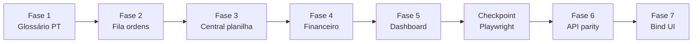
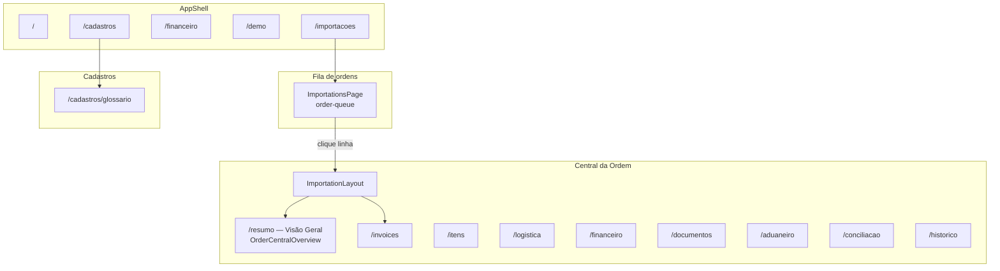

# Entrega — Central da Ordem estilo planilha (pós-MVP 4)

Documento de referência da entrega **Central da Ordem**: reformulação da UI do Epic Importações para operação estilo planilha, com glossário PT, fila de ordens, visão agregada por ordem, financeiro global unificado, endpoints de paridade de dados e bind final da interface.

> **Contexto:** evolução do redesign v2 ([`docs/ENTREGA-REDESIGN-FRONTEND-V2.md`](./ENTREGA-REDESIGN-FRONTEND-V2.md)) e da UX operacional pós-MVP 3 (checklist v1.9).

**Mock visual canônico:** [`docs/mock-central-ordem.html`](./mock-central-ordem.html)  
**Checklist vivo:** [`CHECKLIST_MVP_IMPORTACAO_EPIC.md`](../CHECKLIST_MVP_IMPORTACAO_EPIC.md) — seção *Fase pós-MVP 4* (v2.0)

---

## 1. Resumo executivo

| Item | Valor |
|------|-------|
| **Veredito** | **PASS** |
| **Data** | 2026-06-21 |
| **Escopo** | Fases 1–7 do plano *Central da Ordem estilo planilha* |
| **Fases 1–5** | Somente frontend (+ checklist + mock em `docs/`) |
| **Fases 6–7** | Backend controlado (`order-central`, `order-queue`) + bind UI |
| **pytest** | **107 passed** (piso anterior: 99) |
| **npm run build** | OK |
| **Playwright E2E** | **18 testes** (4 smoke + 5 UX pós-MVP 3 + 9 checkpoint) |

### O que mudou em uma frase

A lista `/importacoes` virou **fila operacional de ordens**; o detalhe virou **Central da Ordem** com grades estilo planilha (Bloco A: faturas × raquete; Bloco B: DA SPEDIRE); labels técnicos em inglês sumiram da UI; `/financeiro` global virou **fila de contas a pagar**; a API expôs agregados `order-queue` e `order-central` para eliminar N+1 e preencher campos antes marcados como `dado-pendente`.

---

## 2. Objetivos e regras invioláveis

### Objetivos

1. Operador Epic trabalha em **português operacional** (não enums crus na tela).
2. **Fila de ordens** responde “o que está aberto e precisa de ação”.
3. **Central da Ordem** concentra visão financeira + quantidades + pendências num layout de planilha.
4. Dados **honestos**: célula sem dado real → `—`; nunca inventar número do mock.
5. **Paridade API**: expor no backend o que já existia no banco, consumir na UI.

### Regras seguidas

| Regra | Como foi respeitada |
|-------|---------------------|
| Campo vazio nunca vira zero | `emptyDash()` + `null` na API |
| Enums internos intactos | `Badge status={code}` usa código; texto usa `glossario.ts` |
| Dado oficial não deleta | Sem alteração de soft delete |
| Fases 1–5 sem `app/` | Backend só na Fase 6+ |
| Mock não vira dado fake | Valores `447.500`, etc. ausentes da UI (E2E) |

---

## 3. Mapa de fases (plano → entrega)



| Fase | Nome | Entregável principal | `app/` tocado? |
|------|------|----------------------|----------------|
| 1 | Glossário PT | `frontend/src/i18n/glossario.ts` + página `/cadastros/glossario` | Não |
| 2 | Fila de ordens | `ImportationsPage.tsx` refatorada | Não |
| 3 | Central da Ordem | `ImportationLayout`, `OrderCentralOverview`, abas PT | Não |
| 4 | Financeiro | `FinancePage` global + banners em `FinancePanels` | Não |
| 5 | Dashboard | “O que resolver hoje?”, link Demo Epic | Não |
| CP | Checkpoint | `e2e/central-ordem-checkpoint.spec.ts` | Não |
| 6 | API Data Parity | `order_central.py`, schemas, endpoints | **Sim** |
| 7 | Bind final | `api.ts`, consumo real na UI | Frontend |

---

## 4. Fase 1 — Glossário operacional PT

### 4.1 Módulo `glossario.ts`

**Arquivo:** `frontend/src/i18n/glossario.ts`

Módulo puro (sem React). Fallback seguro: `map[code] ?? code`.

| Helper | Mapa | Uso |
|--------|------|-----|
| `statusLabel()` | `STATUS_LABELS` | Status da ordem (`PO_CREATED` → “Pedido criado”, etc.) |
| `payStatusLabel()` | `PAY_STATUS_LABELS` | Tipo/status de pagamento |
| `invoiceTypeLabel()` | `INVOICE_TYPE_LABELS` | ANTECIPO, PROFORMA, SALDO, … |
| `shipmentStatusLabel()` | `SHIPMENT_STATUS_LABELS` | Status de embarque |
| `modalLabel()` | `MODAL_LABELS` | AIR → Aéreo, OCEAN → Marítimo |
| `fieldLabel()` | `FIELD_LABELS` | Termos de tela (Invoice → Fatura, Importations → Ordens) |
| `emptyDash()` | — | `null` / vazio → `—` |
| `glossarySections()` | — | Lista para a página de glossário |

### 4.2 Onde o glossário foi aplicado

| Área | Arquivo(s) |
|------|------------|
| Fila de ordens | `ImportationsPage.tsx` |
| Central da ordem (header, régua) | `ImportationLayout.tsx` |
| Visão geral planilha | `OrderCentralOverview.tsx` |
| Abas / formulários | `ImportationSectionPage.tsx` |
| Financeiro global | `FinancePage.tsx` |
| Financeiro da ordem | `FinancePanels.tsx` |
| Logística | `LogisticsPanel.tsx` |
| Topbar | `AppShell.tsx` — “Importações” → **Ordens** |
| Dashboard | `DashboardPage.tsx` — copy PT |

**Preservado:** componente `Badge` continua recebendo o **código enum** para definir tom (`Badge.tsx`); só o **texto filho** usa o helper PT.

### 4.3 Página Glossário operacional

| Item | Detalhe |
|------|---------|
| Rota | `/cadastros/glossario` |
| Componente | `frontend/src/pages/GlossaryPage.tsx` |
| Entrada | Card em `CadastrosPage.tsx` |
| Router | Rota filha em `frontend/src/router.tsx` |

Renderiza tabelas a partir de `glossarySections()` — referência para operadores e treinamento.

### 4.4 Mock visual

- Origem: `mock-central-ordem.html` (raiz)
- Cópia canônica: **`docs/mock-central-ordem.html`**
- Uso: referência de layout Bloco A/B, cores de coluna (acconto, crédito, acumulado), flags IT

---

## 5. Fase 2 — Fila de ordens (`/importacoes`)

### 5.1 Comportamento

**Arquivo:** `frontend/src/pages/ImportationsPage.tsx`

A página deixou de ser uma lista simples e passou a ser **fila operacional estilo planilha**:

| Coluna | Fonte de dados |
|--------|----------------|
| Ordem | `po_number` |
| Ano | `created_at` (primeiros 4 chars) |
| Fornecedor | `supplier_name` |
| Status | `status` → `statusLabel()` |
| Valor faturado | `total_invoiced` (order-queue) |
| Pago | `total_paid` |
| Saldo a pagar | `consolidated_balance` |
| A despachar | `to_dispatch` |
| Pendências | `pending_actions_count` |
| Atualização | `updated_at` ou `created_at` |

### 5.2 Funcionalidades

- **Linha clicável** → `/importacoes/:id/resumo` (Central da Ordem)
- **Busca** por ordem ou fornecedor
- **Filtros rápidos:** Tudo, Com saldo, A despachar, Com pendência, Pronto para fechamento
- **Ordenação** por coluna (ordem, fornecedor, status, saldo, atualização)
- **Export CSV** client-side (sem nova dependência)
- **Nova ordem** inline (formulário existente preservado)

### 5.3 Fonte de dados e resiliência

**Primário (Fase 7):** `GET /api/importations/order-queue?limit=200`

**Fallback:** se `order-queue` falhar, usa `dashboardApi.importations(200)` mapeando para o shape `OrderQueueRow` (campos financeiros detalhados podem ficar `null` no fallback).

### 5.4 CSS

Classes em `frontend/src/index.css`:

- `.order-queue__filters`, `.order-queue__filter`, `.order-queue__row`
- Cabeçalho visível **durante loading** (melhor UX e E2E)

---

## 6. Fase 3 — Central da Ordem (`/importacoes/:id`)

### 6.1 Layout e header

**Arquivo:** `frontend/src/pages/importation/ImportationLayout.tsx`

| Elemento | Descrição |
|----------|-----------|
| Título | **Central da Ordem {po_number}** + `Badge` com status PT |
| Meta | Fornecedor, ano, moeda, incoterm |
| Ações rápidas | Fatura, Pagamento, Despacho, Anexar, Conciliar/fechar → navegam para aba/hash |
| Régua horizontal | Pedido → Faturado → Acconto → A despachar → Em trânsito → Aduana → Estoque → Fechado |
| KPIs | *(substituído em jun/2026 — ver abaixo)* |
| Alertas acionáveis | Pagamento vencido/a vencer, sem comprovante, a despachar, DI/DUIMP, landed cost, divergência, fechamento |

#### Header operacional v2 (jun/2026)

- **Fonte única:** `GET /api/importations/{id}/order-central` → `operational_header` + `status_rail` (sem `financeApi.summary` no topo).
- **Painel 3 colunas:** `OrderCentralOperationalHeader.tsx` — Pagamentos (EUR it-IT + BRL pt-BR), Logística (ETA/ETD/modal), Prazos (vencimentos/atrasos).
- **Contexto compartilhado:** `OrderCentralContext` — um fetch para Layout + Visão Geral.
- **Régua compacta:** `.order-central__rail--compact` com `subtitle` por estágio (ex.: `2/3 faturas`, `ETA 15/08`).

A régua deriva de `current_status` mapeado em `RAIL_STAGES` (estados `done` / `now` / `todo`).

### 6.2 Visão Geral — planilha (Bloco A + B)

**Arquivo:** `frontend/src/pages/importation/OrderCentralOverview.tsx`  
**Rota:** `/importacoes/:id/resumo` (aba **Visão Geral**)

Consome **`GET /api/importations/{id}/order-central`** (Fase 7).

#### Bloco A — Faturas · acconto · crédito por raquete

Grade agrupada por fatura. Colunas:

| Coluna | Dado real | Observação |
|--------|-----------|------------|
| Data | `invoice_date` | |
| Nº fatura | `invoice_number` | Flag **IT** (origem Itália, bloqueado visual) |
| Qtd | `InvoiceItem.quantity` | Por item quando API retorna items |
| Raquete/Produto | SKU / descrição | |
| Acconto | `paid_total` | |
| Acconto rimasto | `balance` | |
| Crédito/raquete | — | **P1** — sem vínculo invoice-item na modelagem |
| Crédito acumulado | — | **P1** |
| Status | derivado de saldo | |
| Docs | placeholder | |

Destaque visual para faturas **ANTECIPO**; rodapé com totais; legenda de cores (acconto / crédito / acumulado).

#### Bloco B — Por modelo · DA SPEDIRE

| Coluna | Dado real | Observação |
|--------|-----------|------------|
| Modelo | `model_label` / SKU | |
| A despachar | `to_dispatch` | |
| Pedida | `quantity_ordered` | quantity-chain |
| Faturada | parcial | quando exposto |
| Despachada / Nacionalizada / Recebida | quantity-chain | |
| Restante a receber | derivado | |
| Progresso | barra % | |
| Preço listino | — | **P1** |
| Preço fattura | `unit_price_foreign` | |
| Sconto | descontos por item | quando disponível |

Itens com saldo a despachar recebem classe `.sheet-row--dispatch`.

### 6.3 Abas repaginadas (sidebar)

**Arquivo:** `frontend/src/pages/importation/types.ts`

| Antes (exemplos) | Depois |
|------------------|--------|
| Resumo | **Visão Geral** |
| Invoices | **Faturas e pagamentos** |
| Financeiro | **Crédito / conta corrente** |
| Aduaneiro | **Aduana e custos BR** |
| Conciliação | **Conciliação e fechamento** |
| — | **Histórico** (nova aba) |

**Histórico:** `HistoricoSection` em `ImportationSectionPage.tsx` — timeline via `closureApi.timeline()` + `formatTimelineEvent`.

`CHECKLIST_ROUTE_MAP` e `ACTION_ROUTE_MAP` **preservados** para widgets e alertas.

### 6.4 CSS planilha

Em `frontend/src/index.css`:

- `.order-central__*` — header, régua, KPIs, alertas
- `.sheet`, `.sheet-table`, `.sheet-head`, `.sheet-legend`
- Colunas `.c-acconto`, `.c-credito`, `.c-accum`
- `.sheet-cell--locked`, `.sheet-flag-it`

---

## 7. Fase 4 — Financeiro unificado

### 7.1 Financeiro global (`/financeiro`)

**Arquivo:** `frontend/src/pages/FinancePage.tsx`

Transformado em **fila de contas a pagar**:

- Carrega `listPayments()` + `invoicesApi.list()` + `importationsApi.list()` + `suppliersApi.list()`
- Monta linhas com: vencimento, fatura, ordem (link), fornecedor, valor EUR, câmbio, valor BRL, status PT, aprovação (`—`), comprovante
- **Banners didáticos:**
  - Planejado não reduz saldo · Liquidado reduz
  - Crédito ≠ desconto
  - Vencimento ≠ data real de pagamento
- **Filtros:** Todas, Vencidas, Vencendo 7d, Planejadas, Liquidadas, Pagas sem comprovante

### 7.2 Financeiro da ordem

**Arquivos:** `ImportationFinanceSection.tsx` → `FinancePanels.tsx`

- Banners didáticos no painel de pagamentos
- Select de tipos de fatura **completo:** ANTECIPO, PROFORMA, SALDO, COMPLEMENTAR, AJUSTE, CREDITO, OUTRA
- Tabela de pagamentos com `payStatusLabel()` e coluna Status (Planejado / Liquidado / Pendente)
- Abas preservadas: Pagamentos, Descontos, Créditos Heroes, Conta corrente BR, Despesas Brasil

---

## 8. Fase 5 — Dashboard e topbar

### 8.1 Dashboard

**Arquivo:** `frontend/src/pages/DashboardPage.tsx`

- Seção **“O que resolver hoje?”** acima da grid de widgets
- Copy PT (“ordens em andamento”)
- **Loading:** título “Painel de controle” visível enquanto métricas carregam
- Widgets existentes (pós-MVP 3) reutilizados — cada item navega para ordem/bloco

### 8.2 Topbar

**Arquivo:** `frontend/src/layouts/AppShell.tsx`

| Antes | Depois |
|-------|--------|
| Importações | **Ordens** |
| — | **Demo Epic** → `/demo` |

Itens: Painel · Ordens · Financeiro · Demo Epic · Cadastros

---

## 9. Checkpoint pós-Fase 5

**Arquivo:** `frontend/e2e/central-ordem-checkpoint.spec.ts`

| # | Teste | O que valida |
|---|-------|--------------|
| 1 | topbar | Ordens, Financeiro, Demo Epic |
| 2 | glossário PT | Ausência de labels técnicos (regex word-boundary) |
| 3 | honestidade | Sem números fake do mock |
| 4 | fila → central | Lista carrega, clique abre Central da Ordem |
| 5 | Bloco A/B | Textos “Faturas…raquete” e “DA SPEDIRE” |
| 6 | Demo Epic | Navega para `/demo` |
| 7 | financeiro global | Fila de contas a pagar |
| 8 | glossário cadastros | `/cadastros/glossario` |
| 9 | order-queue API | Endpoint responde com itens |

**Gate:** checkpoint **PASS** antes de iniciar Fase 6 (backend).

Specs legados atualizados: `smoke.spec.ts`, `ux-postmvp3.spec.ts` (novos títulos PT, Visão Geral, fila financeira).

---

## 10. Fase 6 — Backend / API Data Parity

### 10.1 Novos arquivos backend

| Arquivo | Função |
|---------|--------|
| `app/schemas_order_central.py` | Pydantic: `OrderCentralResponse`, `OrderQueueResponse`, KPIs, invoices+items, models, payments estendidos |
| `app/services/order_central.py` | `build_order_central()`, `build_order_queue()` |
| `tests/test_order_central.py` | 8 testes de paridade |

### 10.2 Endpoints

| Método | Rota | Descrição |
|--------|------|-----------|
| `GET` | `/api/importations/order-queue?limit=` | Fila operacional agregada |
| `GET` | `/api/importations/{id}/order-central` | Payload completo da Central da Ordem |

Registrados em `app/api/importations.py`. Rota `order-queue` declarada **antes** de `/{id}` para evitar conflito de roteamento (testado).

### 10.3 `build_order_central()` — conteúdo agregado

Retorna:

- `order` — ordem + `updated_at`
- `supplier_name`
- `kpis` — totais por moeda, saldo, `to_dispatch`
- `invoices[]` — com `items[]` (InvoiceItem + produto)
- `models[]` — quantity-chain por item (pedida, despachada, nacionalizada, estoque)
- `payments_planned` / `payments_settled` — inclui campos estendidos (`exchange_contract_number`, `approved_without_receipt`, etc.)
- `discounts`, `supplier_credits`, `brazil_accounts`, `shipments` (ETD/ETA)
- `pending_actions` — mesma lógica do dashboard

**Regra:** totais **nunca somam moedas diferentes** em um único campo (`totals_by_currency` quando multi-moeda).

### 10.4 `build_order_queue()` — fila operacional

Por ordem aberta (não fechada):

- Identificação, fornecedor, status, moeda
- `total_invoiced`, `total_paid`, `consolidated_balance`
- `to_dispatch`, `pending_actions_count`
- `updated_at`, `created_at`

### 10.5 Extensões em schemas existentes

| Arquivo | Campo(s) adicionado(s) |
|---------|------------------------|
| `app/schemas_import.py` | `ImportationResponse.updated_at`; campos extras em `PaymentResponse` |
| `app/schemas_docs.py` | ETD/ETA em shipment quando aplicável |

### 10.6 Testes backend (`test_order_central.py`)

| Teste | Garante |
|-------|---------|
| `test_order_central_returns_invoices_with_items` | Items na fatura |
| `test_order_central_quantities_per_model` | Quantity-chain no payload |
| `test_order_central_acconto_and_balance` | Acconto e saldo coerentes |
| `test_order_queue_returns_faturado_pago_saldo` | Colunas financeiras na fila |
| `test_order_central_empty_field_not_zero` | Vazio ≠ zero |
| `test_multi_currency_not_summed_in_single_field` | Multi-moeda separada |
| `test_order_queue_route_before_id_route` | Roteamento FastAPI |
| `test_importation_response_includes_updated_at` | `updated_at` exposto |

---

## 11. Fase 7 — Bind final da UI

### 11.1 `frontend/src/api.ts`

Novos tipos e métodos:

```typescript
importationsApi.orderQueue(limit)
importationsApi.orderCentral(id)
invoicesApi.items(invoiceId)  // consumo do endpoint já existente
```

Tipos: `OrderQueueRow`, `OrderQueueResponse`, `OrderCentralResponse`, `OrderCentralInvoice`, `OrderCentralModel`, `InvoiceItem`, etc.

Campos estendidos em `Payment`, `Invoice` (`invoice_date`, …) alinhados ao backend.

### 11.2 Bind na UI

| Componente | API |
|------------|-----|
| `ImportationsPage` | `orderQueue()` (+ fallback dashboard) |
| `OrderCentralOverview` | `orderCentral()` |

---

## 12. Matriz de paridade — dado real vs `—`

| Campo UI | Status | Notas |
|----------|--------|-------|
| Valor faturado / pago / saldo (fila) | **Real** | `order-queue` |
| Qtd / raquete por fatura (Bloco A) | **Real** | `InvoiceItem` via order-central |
| Acconto por fatura | **Real** | `paid_total`, `balance` |
| Crédito por raquete | **P1** | `—` + `// dado-pendente` |
| Crédito acumulado por item | **P1** | idem |
| Preço listino | **P1** | não modelado |
| Acconto / crédito rimasto por modelo | **P1** | idem |
| Aprovação (financeiro global) | **P1** | coluna sempre `—` |
| Responsável da ordem | **P1** | sem campo owner |
| Edição inline campos BR | **Bloqueado** | sem PATCH seguro; UI preparada |
| Última atualização (fila) | **Real** | `updated_at` via order-queue |

---

## 13. Navegação atualizada



---

## 14. Inventário de arquivos alterados

### Frontend (criados ou reescritos)

| Arquivo | Papel |
|---------|-------|
| `src/i18n/glossario.ts` | Glossário PT |
| `src/pages/GlossaryPage.tsx` | Página glossário |
| `src/pages/ImportationsPage.tsx` | Fila de ordens |
| `src/pages/importation/OrderCentralOverview.tsx` | Blocos A/B planilha |
| `src/pages/importation/ImportationLayout.tsx` | Header, régua, KPIs, alertas |
| `src/pages/importation/ImportationSectionPage.tsx` | Abas + Histórico |
| `src/pages/importation/types.ts` | Sidebar PT |
| `src/pages/FinancePage.tsx` | Fila contas a pagar |
| `src/pages/finance/FinancePanels.tsx` | Banners + labels PT |
| `src/pages/DashboardPage.tsx` | “O que resolver hoje?” |
| `src/pages/LogisticsPanel.tsx` | modalLabel |
| `src/pages/CadastrosPage.tsx` | Card glossário |
| `src/layouts/AppShell.tsx` | Ordens + Demo Epic |
| `src/router.tsx` | Rotas glossário + histórico |
| `src/api.ts` | Tipos e métodos order-* |
| `src/index.css` | Estilos planilha e fila |
| `e2e/central-ordem-checkpoint.spec.ts` | Checkpoint (novo) |
| `e2e/smoke.spec.ts` | Atualizado |
| `e2e/ux-postmvp3.spec.ts` | Atualizado |
| `playwright.config.ts` | timeout 60s, retries |

### Backend (Fase 6)

| Arquivo | Papel |
|---------|-------|
| `app/schemas_order_central.py` | Schemas agregados |
| `app/services/order_central.py` | Lógica de agregação |
| `app/api/importations.py` | Endpoints |
| `app/schemas_import.py` | Campos estendidos |
| `app/schemas_docs.py` | Shipment ETD/ETA |
| `tests/test_order_central.py` | Testes |

### Documentação

| Arquivo | Papel |
|---------|-------|
| `docs/mock-central-ordem.html` | Mock visual |
| `docs/ENTREGA-CENTRAL-DA-ORDEM.md` | Este documento |
| `CHECKLIST_MVP_IMPORTACAO_EPIC.md` | v2.0 — evidências pós-MVP 4 |

---

## 15. Validação e como reproduzir

### Build frontend

```powershell
cd frontend
npm run build
```

### Testes backend

```powershell
.\.venv\Scripts\pytest tests/ -q
# Esperado: 107 passed
```

### Servidor local

```powershell
.\.venv\Scripts\python -m uvicorn app.main:app --host 0.0.0.0 --port 8082
```

Abrir: `http://127.0.0.1:8082`

### Massa demo

```powershell
# Após login admin@epic.com.br / admin123
POST http://127.0.0.1:8082/api/demo/seed
```

### Playwright E2E

```powershell
cd frontend
$env:E2E_BASE_URL = "http://127.0.0.1:8082"
npm run test:e2e
```

### validate-local (completo)

```powershell
powershell -File scripts\validate-local.ps1
```

Requer servidor em `:8082` para E2E e health check.

### Roteiro manual sugerido

1. Dashboard → link **Demo Epic**
2. **Ordens** → filtrar “Com saldo” → clicar linha
3. Confirmar **Central da Ordem**, régua, KPIs
4. Aba **Visão Geral** → Blocos A e B
5. Alertas → clicar e ir para aba correta
6. **Financeiro** global → filtros vencidas / planejadas
7. **Cadastros → Glossário operacional**

---

## 16. Lacunas remanescentes (P1 — backlog)

Não bloqueiam o PASS; estão mapeadas no checklist e no código com `// dado-pendente` onde aplicável.

1. **Crédito por raquete** e **crédito acumulado por item** na grade Bloco A
2. **Preço listino** separado do preço fatura
3. **Acconto / crédito rimasto por modelo** (Bloco B)
4. **Responsável / owner** da ordem
5. **Aprovação** de pagamento na fila global
6. **Edição inline** de campos Brasil na planilha (exige PATCH auditado)
7. **Performance** de `build_order_queue` com muitas ordens abertas (considerar cache ou paginação server-side)

---

## 17. Relação com entregas anteriores

| Entrega | Relação |
|---------|---------|
| Redesign v2 | Tokens visuais, topbar, dashboard widgets — **preservados e estendidos** |
| UX pós-MVP 3 | FinancePanels, hub, demo guiada — **reaproveitados**; hub resumo substituído por OrderCentralOverview na aba Visão Geral |
| MVP Fases 0–12 | Regras de negócio, modelos, status — **intactos**; apenas exposição agregada nova |

---

## 19. Painel Heroes (L-UX-001 — jun/2026)

Ordens criadas via **Nova Ordem** com planilha vinculada exibem na Central o **`HeroesImportPanel`**:

- **Preview:** `GET /api/importations/{id}/heroes-import/preview` — parser no mesmo run `ATTACHED` → `PREVIEW`; exibe `invoice_blocks`.
- **Commit merge:** `POST /api/importations/{id}/heroes-import/commit` — Invoices/Payments/Items na ordem manual (sem `HEROES-{n}`).
- **SKUs:** racchetta sem match → staging + `review_queue` (`SKU_UNRESOLVED`); commit bloqueado até `PATCH /api/imports/staging/{id}/resolve-sku`.
- **UI revisão:** `/revisao` — colunas Fatura, Data, Racchetta.

Cadastre `supplier_code` nos produtos ([`GUIA-TELA-PRODUTOS.md`](./GUIA-TELA-PRODUTOS.md)) para reduzir pendências.

---

## 18. Histórico deste documento

| Data | Versão | Nota |
|------|--------|------|
| 2026-06-21 | 1.0 | Entrega inicial pós-MVP 4 — Central da Ordem Fases 1–7 |
| 2026-06-27 | 1.1 | §19 — HeroesImportPanel, merge ATTACHED, staging SKU (L-UX-001) |
