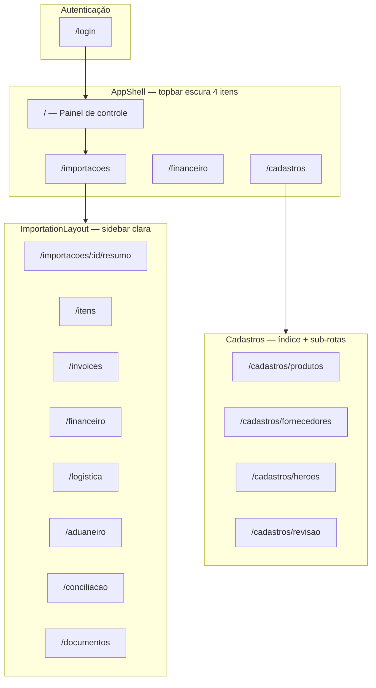

# Entrega — Redesign Frontend Epic Importações (v2)

Documento de referência da entrega **v2** do frontend React: elevação visual conforme `mock-redesign-v2.html`, navegação global reduzida a 4 itens, painel parametrizável com KPIs, filtros e widgets configuráveis.

> **Escopo:** apenas `frontend/`. Backend (`app/`) **não foi alterado**. Contratos de API preservados.

**Mock visual canônico:** [`mock-redesign-v2.html`](../mock-redesign-v2.html) (raiz do projeto)  
**Entrega anterior (v1 — router + design system base):** [`docs/ENTREGA-REDESIGN-FRONTEND.md`](./ENTREGA-REDESIGN-FRONTEND.md)

---

## 1. Resumo executivo

| Fase | O que mudou |
|------|-------------|
| **v1** | `react-router-dom`, topbar 7 itens, sidebar no detalhe, design system inicial, dashboard simples em cards |
| **v2 (esta entrega)** | Visual alinhado ao mock v2, topbar **4 itens**, `/cadastros` agrupador, painel com KPI strip + filtros + grid de widgets + gaveta Personalizar, tokens Inter/tnum, badges com ponto colorido |

### Validação final

| Check | Resultado |
|-------|-----------|
| `npm run build` | 0 errors |
| `pytest tests/ -v` | 81 passed |
| Arquivos alterados em `app/` | **0** (somente leitura durante implementação) |

---

## 2. Mapa de navegação completo

### 2.1 Hierarquia de layouts



### 2.2 Rotas (tabela completa)

| Rota | Página / componente | Topbar ativa |
|------|---------------------|--------------|
| `/login` | `LoginPage` | — (público) |
| `/` | `DashboardPage` (Painel de controle) | Painel |
| `/importacoes` | `ImportationsPage` | Importações |
| `/importacoes/:id` | redirect → `/importacoes/:id/resumo` | Importações |
| `/importacoes/:id/resumo` | `ImportationSectionPage` | Importações |
| `/importacoes/:id/itens` | idem | Importações |
| `/importacoes/:id/invoices` | idem | Importações |
| `/importacoes/:id/financeiro` | idem | Importações |
| `/importacoes/:id/documentos` | idem | Importações |
| `/importacoes/:id/logistica` | idem | Importações |
| `/importacoes/:id/aduaneiro` | idem | Importações |
| `/importacoes/:id/conciliacao` | idem | Importações |
| `/financeiro` | `FinancePage` | Financeiro |
| `/cadastros` | `CadastrosPage` (índice com cards) | Cadastros |
| `/cadastros/produtos` | `ProductsPage` | Cadastros |
| `/cadastros/fornecedores` | `SuppliersPage` | Cadastros |
| `/cadastros/heroes` | `HeroesUploadPage` | Cadastros |
| `/cadastros/revisao` | `ReviewQueuePage` | Cadastros |
| `/documentos` | `DocumentsPage` (global, fora de cadastros) | — |

### 2.3 Redirects de compatibilidade (URLs antigas)

| URL antiga | Redireciona para |
|------------|------------------|
| `/skus` | `/cadastros/produtos` |
| `/revisao` | `/cadastros/revisao` |
| `/heroes` | `/cadastros/heroes` |

### 2.4 Topbar global — exatamente 4 destinos

Definidos em [`frontend/src/layouts/AppShell.tsx`](../frontend/src/layouts/AppShell.tsx):

| # | Rótulo UI | Rota | Ícone SVG |
|---|-----------|------|-----------|
| 1 | **Painel** | `/` | Grid 2×2 |
| 2 | **Importações** | `/importacoes` | Cubo / package |
| 3 | **Financeiro** | `/financeiro` | Cifrão |
| 4 | **Cadastros** | `/cadastros` | Usuários / people |

**Lado direito (placeholders visuais):**

- Botão busca (lupa) — sem lógica ainda
- Botão notificações (sino + dot vermelho) — sem lógica ainda
- Avatar com iniciais + nome + role
- Botão Sair

**Estilo ativo:** borda inferior `#2f5fec` (`.topbar__link--active`), fundo `#0f1729`.

### 2.5 Sidebar do detalhe da importação (8 seções)

Grupos em [`frontend/src/pages/importation/types.ts`](../frontend/src/pages/importation/types.ts):

| Grupo | Itens | Rota |
|-------|-------|------|
| **Visão geral** | Resumo, Itens, Invoices, Financeiro | `/importacoes/:id/{secao}` |
| **Operação** | Logística, Aduaneiro | idem |
| **Fechamento** | Conciliação, Documentos | idem |

**Estilo ativo:** borda esquerda primary + fundo `--color-primary-soft`.

### 2.6 Cadastros — índice

[`frontend/src/pages/CadastrosPage.tsx`](../frontend/src/pages/CadastrosPage.tsx) em `/cadastros` mostra 4 cards:

| Card | Rota | Página reaproveitada |
|------|------|----------------------|
| Produtos | `/cadastros/produtos` | `ProductsPage` |
| Fornecedores | `/cadastros/fornecedores` | `SuppliersPage` (nova) |
| Importar Heroes | `/cadastros/heroes` | `HeroesUploadPage` |
| Fila de revisão | `/cadastros/revisao` | `ReviewQueuePage` |

**Renomeação UI:** "SKUs" → **Produtos** em rótulos; campo técnico `sku_code` mantido na API.

---

## 3. Sistema visual (design tokens)

Fonte: [`frontend/src/index.css`](../frontend/src/index.css) + [`frontend/index.html`](../frontend/index.html) (Google Fonts Inter).

### 3.1 Paleta de cores

| Token CSS | Valor | Uso |
|-----------|-------|-----|
| `--color-primary` | `#2f5fec` | Botões primary, links, pipeline “done” |
| `--color-primary-soft` | `#eaf0fe` | Fundo sidebar ativa, chip ativo, badge count |
| `--color-primary-deep` | `#1b3fb0` | Hover primary, texto badge info |
| `--color-text` | `#0f1729` | Texto principal (ink) |
| `--color-text-secondary` | `#475569` | Subtítulos, labels |
| `--color-ink-3` | `#94a3b8` | Meta, cabeçalhos de tabela |
| `--color-bg` | `#f6f8fc` | Fundo da aplicação |
| `--color-surface` | `#ffffff` | Cards, widgets, filterbar |
| `--color-border` | `#e6eaf2` | Bordas de cards |
| `--color-border-soft` | `#eef2f8` | Separadores internos |
| `--color-topbar-bg` | `#0f1729` | Topbar (nav-bg do mock) |
| `--color-topbar-text` | `#e2e8f0` | Texto topbar |
| `--color-topbar-muted` | `#7c89a0` | Links inativos topbar |

### 3.2 Badges (fundo + texto + ponto)

| Tom | BG | Texto | Classe |
|-----|-----|-------|--------|
| neutral | `#eef1f6` | `#475569` | `.ui-badge--neutral` |
| info | `#e7eefe` | `#1b3fb0` | `.ui-badge--info` |
| warning | `#fdf3d9` | `#9a6a00` | `.ui-badge--warning` |
| success | `#e7f7ee` | `#11824a` | `.ui-badge--success` |
| danger | `#fde8e8` | `#b91c1c` | `.ui-badge--danger` |

**Ponto colorido:** todo `.ui-badge` usa `::before` (6×6px, `border-radius: 50%`, `background: currentColor`).

Mapeamento automático de status da API: `statusToTone()` em [`Badge.tsx`](../frontend/src/components/Badge.tsx).

### 3.3 Accents (KPI / gráficos)

| Token | Valor | Uso |
|-------|-------|-----|
| `--accent-blue` | `#2f5fec` | KPI “Valor em aberto”, barra pipeline done |
| `--accent-green` | `#10b981` | KPI estoque |
| `--accent-amber` | `#f59e0b` | KPI pagamentos, pipeline “now” |
| `--accent-red` | `#ef4444` | KPI divergências |
| `--accent-purple` | `#7c3aed` | Modal aéreo, funil aduana |

### 3.4 Espaçamento, raios e sombras

| Escala | Valores |
|--------|---------|
| Espaço | 4 / 8 / 12 / 16 / 20 / 28 / 40 px (`--space-1` … `--space-7`) |
| Raio | 7 / 10 / 14 / 18 px (`--radius-sm` … `--radius-xl`) + pill 999px |
| Sombra | `--shadow-1` (cards), `--shadow-2` (topbar), `--shadow-3` (drawer/modal) |

### 3.5 Tipografia

- **Fonte:** `"Inter"` (CDN) → fallback Segoe UI / system-ui
- **Feature settings:** `"tnum" 1` (números tabulares em KPIs e tabelas)
- **Tamanhos:** sm 0.85rem, base 1rem, lg 1.1rem, xl 1.5rem (page title)

### 3.6 Largura do conteúdo

- `.app-main`: `max-width: 1320px`, padding `--space-6` (28px) — alinhado ao `.wrap` do mock.

---

## 4. Catálogo de componentes UI

Export barrel: [`frontend/src/components/index.ts`](../frontend/src/components/index.ts).

### 4.1 Button (`.ui-btn`)

Arquivo: [`Button.tsx`](../frontend/src/components/Button.tsx)

| Variante | Classe | Visual |
|----------|--------|--------|
| primary | `.ui-btn--primary` | Fundo `#2f5fec`, texto branco, `--shadow-1` |
| secondary | `.ui-btn--secondary` | Fundo branco, borda `--color-border` |
| ghost | `.ui-btn--ghost` | Igual secondary (lista, paginação) |
| danger | `.ui-btn--danger` | Fundo `#b91c1c` |
| sm | `.ui-btn--sm` | Padding reduzido (0.82rem) |

Props: `variant`, `loading` (mostra `Spinner`), `type` (`submit` suportado), demais attrs HTML.

**Onde aparece:** Nova importação (ghost), Entrar (login), Detalhe (ghost sm), forms de cadastro, fechamento/reabertura.

### 4.2 Badge (`.ui-badge`)

Arquivo: [`Badge.tsx`](../frontend/src/components/Badge.tsx)

```tsx
<Badge status="IN_TRANSIT">IN_TRANSIT</Badge>
<Badge tone="danger">DI/DUIMP</Badge>
```

Status da API permanecem em **inglês** na UI; cor via `statusToTone`.

### 4.3 Card (`.ui-card`)

Arquivo: [`Card.tsx`](../frontend/src/components/Card.tsx)

- Borda `1px solid --color-border`, raio `--radius-lg`, sombra `--shadow-1`
- Título opcional com borda inferior suave (`.ui-card__title`)
- Modo `compact` para headers de importação

### 4.4 Table (`.ui-table`)

Arquivo: [`Table.tsx`](../frontend/src/components/Table.tsx)

- Cabeçalho: uppercase 0.74rem, cor `--color-ink-3`
- Linhas: zebra leve + hover `--color-primary-soft`
- Densidade aumentada vs. v1 (padding ~0.7rem)

### 4.5 PageHeader (`.ui-page-header`)

Título xl + subtitle secondary + slot `actions`.

### 4.6 KpiStat (`.kpi`) — **novo v2**

Arquivo: [`KpiStat.tsx`](../frontend/src/components/KpiStat.tsx)

| Prop | Descrição |
|------|-----------|
| `accent` | `blue` \| `green` \| `amber` \| `red` — barra lateral 3px |
| `label` | Rótulo superior |
| `icon` | SVG em quadrado `.kpi__icon` |
| `value` | Número grande (font-weight 800) |
| `unit` | Sufixo em `<small>` |
| `footer` | Linha de contexto / trend |

### 4.7 Spinner / LoadingState

Estados de carregamento em login, listas, dashboard, detalhe.

### 4.8 Toast (ToastProvider)

Feedback de ações (create, upload, erros) — canto inferior direito.

### 4.9 Widget shell (`.w`) — dashboard

Arquivo: [`pages/dashboard/widgets/Widget.tsx`](../frontend/src/pages/dashboard/widgets/Widget.tsx)

| Parte | Classe | Conteúdo |
|-------|--------|----------|
| Cabeçalho | `.w-head` | Título + `.w-count` (badge numérico) + grip decorativo |
| Corpo | `.w-body` | Conteúdo do widget |
| Grid | `.col-4` … `.col-12` | Span no grid de 12 colunas |

---

## 5. Painel de controle (Dashboard)

Arquivo principal: [`DashboardPage.tsx`](../frontend/src/pages/DashboardPage.tsx).

### 5.1 Estrutura visual (de cima para baixo)

```
┌─────────────────────────────────────────────────────────────┐
│ page-head: "Painel de controle" + data + [Nova importação]  │
├─────────────────────────────────────────────────────────────┤
│ filterbar: chips Ver | seg modal | seg período | Personalizar│
├─────────────────────────────────────────────────────────────┤
│ kpis: [Valor aberto][Pagamentos 7d][Estoque][Divergências]  │
├─────────────────────────────────────────────────────────────┤
│ grid 12 cols: widgets ligados (col-7, col-5, col-4, col-8…) │
└─────────────────────────────────────────────────────────────┘
                              │
                    ConfigDrawer (lateral direita)
```

Referência visual: seções equivalentes em `mock-redesign-v2.html`.

### 5.2 KPI strip — 4 indicadores

| KPI | Accent | Fonte de dados | Observação |
|-----|--------|----------------|------------|
| Valor em aberto | blue | `financeApi.summary` → `consolidated_balance` | Soma nas 8 imps abertas (cap) |
| Pagamentos a vencer (7d) | amber | — | **`—`** — sem campo vencimento na API (`// dado-pendente`) |
| Em estoque (amostra) | green | `stockApi.quantityChain` → `quantity_stocked` | Trend “vs. mês” = **`—`** |
| Divergências abertas | red | `reconciliationApi.list` | Count `DIVERGENT` ou `BLOCKING` |

Hook de dados: [`useDashboardMetrics.ts`](../frontend/src/hooks/useDashboardMetrics.ts) — **METRICS_CAP = 8** importações abertas mais recentes.

### 5.3 Barra de filtros

Arquivos: [`DashboardFilters.tsx`](../frontend/src/pages/dashboard/DashboardFilters.tsx), [`useDashboardFilters.ts`](../frontend/src/hooks/useDashboardFilters.ts).

| Controle | Tipo CSS | Valores | Efeito |
|----------|----------|---------|--------|
| Visão rápida | `.chip` / `.chip--on` | Tudo, Em trânsito, Em estoque, Aguardando pagamento, Com divergência | Filtro client-side |
| Modal | `.seg button.on` | Marítimo, Todos, Aéreo | Filtra por `Shipment.modal` |
| Período | `.seg button.on` | 7d, 30d, Trimestre | Filtra por `created_at` |

**Sem reload:** estado React; widgets reagem via `filterRows()`.

### 5.4 Widgets parametrizáveis

| ID | Nome UI | Col span | Default | Arquivo |
|----|---------|----------|---------|---------|
| `in_transit` | Em trânsito | 7 | on | `InTransitWidget.tsx` |
| `payments` | Próximos pagamentos | 5 | on | `UpcomingPaymentsWidget.tsx` |
| `landed_cost` | Landed cost est. vs real | 5 | on | `LandedCostWidget.tsx` |
| `needs_action` | Precisa de ação | 4 | on | `NeedsActionWidget.tsx` |
| `stages` | Importações por etapa | 8 | on | `StageDistributionWidget.tsx` |
| `timeline` | Timeline recente | 12 | **off** | `RecentTimelineWidget.tsx` |

**Registry:** [`useDashboardConfig.ts`](../frontend/src/hooks/useDashboardConfig.ts) → `WIDGET_REGISTRY`.

Elementos visuais por widget:

- **Em trânsito:** linhas `.row`, ícone modal (`.modal-ico.m-ocean` / `.m-air`), pipeline `.pipe` (5 segmentos), badge status, valor à direita
- **Pagamentos:** cards `.pay` com data **`—`** (vencimento pendente), link para financeiro da importação
- **Landed cost:** mini-bar chart `.bars` (estimado `#c7d6fb` vs realizado `#2f5fec`)
- **Precisa de ação:** badges danger/warning + link conciliação
- **Por etapa:** funil `.funnel` (Pedido → Aduana, 6 colunas)
- **Timeline:** eventos de `closureApi.timeline` (lazy load ao montar)

### 5.5 Gaveta “Personalizar”

Arquivo: [`ConfigDrawer.tsx`](../frontend/src/pages/dashboard/ConfigDrawer.tsx)

| Elemento | Classe | Comportamento |
|----------|--------|---------------|
| Overlay | `.drawer-back--show` | Clique fecha |
| Painel | `.drawer--show` | 340px à direita, slide-in |
| Toggle | `.sw` / `.sw--on` | Switch por widget |
| Aplicar | `Button` primary full-width | Fecha drawer |

**Persistência (somente layout):**

```
Chave: epic.dash.<userId>
Exemplo: epic.dash.1
Valor: {"in_transit":false,"payments":true,"landed_cost":true,"needs_action":true,"stages":false,"timeline":false}
```

- **Não** armazena dados de negócio
- Widget desligado **não quebra** o grid (CSS Grid reflow)
- Posição fixa por ID (sem drag-and-drop nesta fase)

### 5.6 Botões e ações no painel

| Botão | Classe | Ação |
|-------|--------|------|
| Nova importação | `.ui-btn--ghost` + ícone Plus | `navigate("/importacoes")` |
| Chips / segmentos | `.chip`, `.seg button` | Atualiza filtros |
| Personalizar | `.cfgbtn` (borda tracejada) | Abre drawer |
| Aplicar (drawer) | `.ui-btn--primary` | Fecha drawer |

---

## 6. Telas internas (v2)

### 6.1 Lista de Importações

[`ImportationsPage.tsx`](../frontend/src/pages/ImportationsPage.tsx)

| Elemento | Detalhe visual |
|----------|----------------|
| Busca | `.search-bar` — PO ou fornecedor |
| Tabela | Colunas: PO (+ incoterm sub), Fornecedor, Status (Badge ponto), Valor estimado (direita), Detalhe (ghost sm) |
| Paginação | `.pagination` — 10 itens/página |

### 6.2 Detalhe da importação

[`ImportationLayout.tsx`](../frontend/src/pages/importation/ImportationLayout.tsx)

- Header: Voltar (secondary), H1 PO, Badge status, moeda · incoterm
- Sidebar + Card conteúdo (tokens v2)
- Seções empilhadas em Aduaneiro (`#di-duimp`, `#impostos`, …) e Conciliação (`#conciliacao`, `#fechamento`, `#timeline`) — herdado da v1, visual atualizado

### 6.3 Cadastros

- Índice: grid `.cadastros__grid` com cards clicáveis
- Subpáginas: `Card` + `PageHeader` + `Table` + forms `.inline-form`

### 6.4 Login

[`LoginPage.tsx`](../frontend/src/LoginPage.tsx) — `.login-card`, `Button` com loading.

---

## 7. Ícones SVG inline

Arquivo central: [`pages/dashboard/icons.tsx`](../frontend/src/pages/dashboard/icons.tsx)

Ícones reutilizados: Dollar, Calendar, Warehouse, Alert, Truck, Ship, Plane, Bars, Clock, Gear, Dots, Plus, Export.

Topbar e Cadastros usam SVG inline próprios em `AppShell.tsx` e `CadastrosPage.tsx`.

**Convenção:** `stroke="currentColor"`, `fill="none"`, classe `.ico` (17–18px).

---

## 8. Dados derivados vs. pendências

Regra: **nunca inventar número** — usar `—` e comentário `// dado-pendente` no código.

| Métrica / campo | Derivável? | Implementação |
|-----------------|------------|---------------|
| Valor em aberto | Sim | `financeApi.summary` |
| Divergências | Sim | `reconciliationApi.list` |
| Estoque (amostra) | Sim | `stockApi.quantityChain` |
| Landed cost chart | Sim | `landedCostApi` + `estimated_total` |
| Pagamentos 7d | **Não** | KPI = `—` |
| Data vencimento pagamento | **Não** | Widget mostra saldo; data = `—` |
| ETA embarque | **Não** | Texto "ETA —" |
| Trend estoque vs mês | **Não** | Footer `vs. mês —` |
| Modal na lista global | **Não** (N+1) | Ícone só no widget Em trânsito (cap 8) |

APIs usadas (existentes, sem alteração de contrato): `importationsApi`, `financeApi`, `reconciliationApi`, `closureApi`, `customsApi`, `landedCostApi`, `shipmentsApi`, `stockApi`, `suppliersApi`, `importsApi`.

---

## 9. Mapa de arquivos

### 9.1 Criados na v2

```
frontend/src/
├── components/KpiStat.tsx
├── hooks/useDashboardFilters.ts
├── hooks/useDashboardConfig.ts
├── pages/CadastrosPage.tsx
├── pages/SuppliersPage.tsx
└── pages/dashboard/
    ├── ConfigDrawer.tsx
    ├── DashboardFilters.tsx
    ├── format.ts
    ├── icons.tsx
    └── widgets/
        ├── Widget.tsx
        ├── InTransitWidget.tsx
        ├── UpcomingPaymentsWidget.tsx
        ├── LandedCostWidget.tsx
        ├── NeedsActionWidget.tsx
        ├── StageDistributionWidget.tsx
        └── RecentTimelineWidget.tsx
```

### 9.2 Alterados na v2 (principais)

```
frontend/index.html          (+ Inter font)
frontend/src/index.css       (tokens v2 + dashboard + topbar v2)
frontend/src/layouts/AppShell.tsx
frontend/src/router.tsx
frontend/src/pages/DashboardPage.tsx
frontend/src/pages/ImportationsPage.tsx
frontend/src/pages/ProductsPage.tsx
frontend/src/hooks/useDashboardMetrics.ts  (reescrito)
frontend/src/components/index.ts
```

### 9.3 Herdados da v1 (inalterados em estrutura)

```
frontend/src/router.tsx              (rotas detalhe)
frontend/src/pages/importation/*     (layout + seções)
frontend/src/pages/ReconciliationClosurePanel.tsx
frontend/src/pages/CustomsStockPanel.tsx
frontend/src/context/AuthContext.tsx
```

---

## 10. Etapas de execução (v2)

| Etapa | Entrega | Checkpoint |
|-------|---------|------------|
| **1** | Topbar 4 itens, `/cadastros`, Produtos, redirects | build OK |
| **2** | Tokens mock v2, Badge ponto, Button/Card/Table | build OK |
| **3** | `KpiStat` + faixa KPI | — |
| **4** | `DashboardFilters` + `useDashboardFilters` | — |
| **5** | Widgets + `ConfigDrawer` + localStorage | build OK |
| **6** | Lista importações + detalhe tokens + cadastros | build + pytest 81 |

---

## 11. Como testar manualmente

```bash
# Build
cd frontend && npm run build

# Backend (exemplo)
uvicorn app.main:app --port 8082

# Seed demo
curl -X POST http://127.0.0.1:8082/api/demo/seed -b cookies.txt

# Login: admin@epic.com.br / admin123
```

| # | Fluxo | Esperado |
|---|-------|----------|
| 1 | Login → `/` | Painel com KPIs + widgets |
| 2 | Topbar | 4 itens apenas |
| 3 | Filtro "Em trânsito" + "Aéreo" | Widgets filtram sem reload |
| 4 | Personalizar → desligar widget → reload | Preferência persiste (`epic.dash.<id>`) |
| 5 | `/cadastros` | 4 cards de sub-cadastro |
| 6 | `/importacoes/4/resumo` | DEMO-04-3INV, sidebar, badge ARRIVED |
| 7 | `/importacoes/4/aduaneiro` | Cards empilhados + anchor-nav |

---

## 12. Fora de escopo (v2)

- Drag-and-drop para reordenar widgets
- Busca e notificações funcionais (placeholders OK)
- Permissões escondendo menu por role
- Tradução de status API (permanecem EN)
- Novos endpoints ou alterações em `app/`

---

## 13. Referência cruzada mock ↔ implementação

| Mock (`mock-redesign-v2.html`) | Implementação React |
|--------------------------------|---------------------|
| `.topbar` + 4 links | `AppShell` + `.topbar__link` |
| `.filterbar` + `.chip` + `.seg` | `DashboardFilters` |
| `.kpis` + `.kpi.blue/amber/green/red` | `KpiStat` |
| `.grid` + `.w.col-*` | `Widget` + widgets |
| `.drawer` + `.sw.on` | `ConfigDrawer` + `useDashboardConfig` |
| `.badge::before` | `.ui-badge::before` |
| `.btn--primary/ghost` | `Button` variants |

Para comparar visualmente, abra [`mock-redesign-v2.html`](../mock-redesign-v2.html) no browser lado a lado com a app buildada.

---

*Documento gerado em referência à entrega Redesign Frontend v2 — Epic Importações. Backend e contratos de API permanecem estáveis.*
