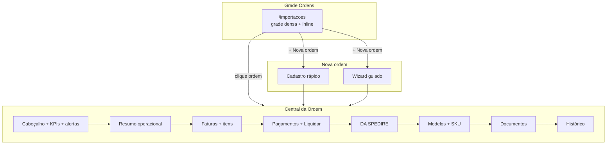

# Entrega — UX operacional estilo planilha (pós-MVP 6)

Documento de referência da **auditoria UI** e da implementação da **Fase pós-MVP 6**: transformar o Epic Importações em ferramenta de trabalho estilo planilha, com a **Ordem** como tela central, edição inline e menos navegação por abas.

> **Contexto:** evolução da Central da Ordem ([`docs/ENTREGA-CENTRAL-DA-ORDEM.md`](./ENTREGA-CENTRAL-DA-ORDEM.md)), da régua de status honesta (checklist v2.6) e da persistência Heroes 5.3 (checklist v2.5).

**Checklist vivo:** [`CHECKLIST_MVP_IMPORTACAO_EPIC.md`](../CHECKLIST_MVP_IMPORTACAO_EPIC.md) — seção *Fase pós-MVP 6* (v2.7)

---

## 1. Resumo executivo

| Item | Valor |
|------|-------|
| **Veredito produto** | **PASS** |
| **Veredito técnico** | **PASS** |
| **Data** | 2026-06-22 |
| **Escopo** | Auditoria UI (Etapa A) + plano P0/P1/P2 (Etapa B) + implementação Etapas C–K |
| **pytest** | **199 passed** (+11 em `tests/test_postmvp6_ux.py`) |
| **npm run build** | OK |
| **Playwright E2E** | **35 passed**, 2 skip condicional (`--retries=0`) |
| **Alembic head** | **010** |

### O que mudou em uma frase

A lista `/importacoes` virou **grade densa editável**; a **Central da Ordem** concentra faturas, pagamentos, DA SPEDIRE, modelos, documentos e histórico **na primeira tela**; criar ordem ganhou **cadastro rápido**; financeiro ficou **acionável na célula**; Heroes ganhou **stepper guiado**; campos operacionais Brasil passaram a **persistir no banco** com auditoria.

---

## 2. Objetivo de produto

Critérios que definem **PASS** para esta fase:

1. Criar ordem manual simples em **menos de 2 minutos** (caminho rápido).
2. Entender uma ordem **sem sair da primeira tela** (Central empilhada).
3. Editar inline: observação, prioridade, responsável, previsão interna, SKU, categoria, vencimento de pagamento, comprovante.
4. Grade `/importacoes` com comportamento de planilha (header fixo, densidade, totais, feedback de save).
5. Heroes com fluxo guiado (não técnico).
6. Mensagens operacionais (sem *staging*, *commit*, *profiling* na UI).
7. Ordine 758 / demo Heroes continuam funcionais.
8. Testes verdes com `retries=0`.

---

## 3. Etapa A — Auditoria UI (estado *antes*)

### 3.1 Percepção geral

| Antes | Depois |
|-------|--------|
| ERP técnico por abas | Planilha operacional + ordem como hub |
| Sem edição na lista | Células editáveis na grade |
| Central fragmentada | Seções empilhadas na Visão Geral |
| Sem cadastro rápido | Modal com 2 caminhos |
| Heroes sem orientação visual | Stepper de 4 passos |

### 3.2 Contagem de cliques — ações principais

| Ação | Antes | Depois | Observação |
|------|-------|--------|------------|
| Criar ordem manual simples | Sem caminho direto (só fluxo por abas) | **2** | `+ Nova ordem` → `Criar e abrir ordem` |
| Adicionar fatura/item | Ordem → aba Faturas → formulário | Ainda via aba ou wizard | Item básico no cadastro rápido |
| Registrar pagamento planejado | Ordem → aba Financeiro → form | **1–2** na Central | `+ Pagamento planejado` na mesma tela |
| Liquidar pagamento | Ordem → Financeiro → form | **1** na Central | Botão **Liquidar** na grade |
| Ver DA SPEDIRE | Ordem → aba Logística | **0** extras | Seção na Visão Geral |
| Entender pendência de fechamento | Ordem → Conciliação | **0** extras | KPIs + alertas no cabeçalho |
| Editar prioridade / responsável / observação | Impossível (campos inexistentes) | **1** | Clique na célula ou campo do cabeçalho |

### 3.3 Problemas observados na auditoria

- Lista de ordens era fila visual, não planilha de trabalho.
- Campos operacionais Brasil (prioridade, responsável, previsão) não existiam no modelo.
- Pagamentos exigiam troca de aba para ações simples.
- Labels técnicos em Heroes (*profiling*, *staging*, *commit*).
- Central já tinha blocos A/B, mas pagamentos, documentos e histórico ficavam em outras abas.

---

## 4. Etapa B — Plano técnico (P0 / P1 / P2)

| Prioridade | Problema | Correção | Etapa |
|------------|----------|----------|-------|
| **P0** | Lista não-planilha, sem edição | Grade densa + `EditableCell` + totais | C |
| **P0** | Ordem fragmentada em abas | `OrderCentralOverview` em seções empilhadas | D |
| **P0** | Campos operacionais inexistentes | Migração 010 + PATCH + queue enriquecido | I |
| **P1** | Sem cadastro rápido | `NovaOrdemModal` (rápido + wizard) | E |
| **P1** | Financeiro pouco acionável | Inline + Liquidar na ordem e global | F |
| **P2** | Heroes sem guia | Stepper 4 passos | H |
| **P2** | Jargão técnico | Varredura de terminologia | K |

---

## 5. Etapas C–K — O que foi implementado

### Etapa C — Grade `/importacoes` estilo planilha

**Arquivo principal:** [`frontend/src/pages/ImportationsPage.tsx`](../frontend/src/pages/ImportationsPage.tsx)

- Tabela densa `.sheet-grid` com header fixo e primeira coluna fixa (`.sticky-col`).
- Colunas: ordem, fornecedor, status, prioridade, responsável, previsão interna, valores financeiros, quantidades, docs pendentes, pendências, observação, atualização.
- Ordenação por clique no header; filtros rápidos (saldo, vencidos, a despachar, pendências, pronto para fechamento).
- Busca por ordem, fornecedor ou responsável.
- Rodapé com **totais por moeda** (faturado, pago, saldo).
- Export CSV da visão filtrada.
- Ações: `+ Nova ordem`, `Importar Heroes`, `Exportar`.
- Edição inline via `EditableCell` para prioridade, responsável, previsão interna e observação.

### Etapa D.1 — Faturas como etapas (antecipo → chegada → saldo 30/60d)

**Motivação (regra de negócio Epic):** uma ordem costuma ter **3 faturas**, cada uma é uma etapa do fluxo:

1. **Antecipo / acconto** — na confirmação do pedido.
2. **Na chegada** — quando o produto chega (saldo).
3. **Saldo / complementar** — ~30/60 dias depois.

Antes, a grade de faturas só mostrava o número da nota na primeira linha do item, sem deixar claro que a ordem tem várias faturas em estágios. Agora a estrutura está explícita.

**Arquivos:**

- [`frontend/src/pages/importation/OrderCentralOverview.tsx`](../frontend/src/pages/importation/OrderCentralOverview.tsx)
- [`frontend/src/pages/ImportationsPage.tsx`](../frontend/src/pages/ImportationsPage.tsx)
- [`app/services/order_central.py`](../app/services/order_central.py) · [`app/schemas_order_central.py`](../app/schemas_order_central.py)

**Na Central da Ordem (seção Faturas):**

- **Faixa de etapas** (cards `.inv-stage`), uma por fatura, ordenadas por data: número da etapa (Fatura 1, 2, 3...), papel (Antecipo / Na chegada / Saldo 30/60d), nº da nota, data, valor, pago e saldo, com badge de situação (Quitada / Parcial / Em aberto) e barra colorida por estado.
- **Legenda** explicando o fluxo típico das 3 faturas.
- **Coluna "Etapa"** na grade detalhada: cada bloco de itens passa a mostrar "Fatura N" + tipo, separando visualmente as faturas.

**Na grade `/importacoes`:**

- Nova coluna **"Faturas"** com contador `quitadas/total` (ex.: `1/3`), verde quando todas quitadas, âmbar quando há pendência. Incluída no export CSV.

**Backend:**

- `OrderQueueRow` ganhou `invoices_count` e `invoices_settled_count`.
- `build_order_queue` calcula esses números em **lote** (`_invoice_counts_for_queue`), com somatórios agrupados de descontos e pagamentos liquidados — evitando N+1 e mantendo a fila rápida (~3s para 23 ordens, mesmo com ordens de muitas faturas).
- "Quitada" = `valor − descontos − pagamentos liquidados == 0` (planejado não conta).

### Etapa D — Central da Ordem em seções empilhadas

**Arquivos principais:**

- [`frontend/src/pages/importation/OrderCentralOverview.tsx`](../frontend/src/pages/importation/OrderCentralOverview.tsx)
- [`frontend/src/pages/importation/ImportationLayout.tsx`](../frontend/src/pages/importation/ImportationLayout.tsx)

**Ordem visual na primeira tela (Visão Geral):**

1. Cabeçalho compacto + régua de status + KPIs financeiros + alertas (layout existente, aprimorado).
2. Campos Brasil editáveis no cabeçalho: status operacional, prioridade, responsável, previsão interna, observação.
3. **Resumo operacional** — qtd pedida, faturada, despachada, a despachar, produtos.
4. **Faturas · acconto · crédito por produto/modelo** — grade com campos Itália bloqueados (`IT`) e override auditado.
5. **Pagamentos** — planejados e liquidados; inline vencimento/comprovante; `+ Pagamento planejado`; **Liquidar**.
6. **DA SPEDIRE / Despacho** — quando há dados Heroes (flag `H`).
7. **Por produto/modelo** — SKU mapeado e categoria editáveis; progresso de despacho.
8. **Documentos** — lista + upload.
9. **Histórico recente** — timeline resumida.

### Etapa E — Nova ordem em dois caminhos

**Arquivo:** [`frontend/src/pages/importation/NovaOrdemModal.tsx`](../frontend/src/pages/importation/NovaOrdemModal.tsx)

| Caminho | Uso | Passos |
|---------|-----|--------|
| **Cadastro rápido** | Ordem mínima em segundos | PO + fornecedor + item opcional + fatura/pagamento opcionais → abre Central |
| **Wizard guiado** | Ordem completa | Dados → Itens → Faturas → Pagamentos → Revisar |

### Etapa F — Financeiro acionável

**Arquivos:**

- [`frontend/src/pages/importation/OrderCentralOverview.tsx`](../frontend/src/pages/importation/OrderCentralOverview.tsx) — pagamentos na Central.
- [`frontend/src/pages/FinancePage.tsx`](../frontend/src/pages/FinancePage.tsx) — fila global.

- Edição inline de **vencimento** (pagamento planejado) e **comprovante/referência** (liquidado).
- Botão **Liquidar** na linha (define data de pagamento e referência).
- Banner operacional: *Planejado não reduz saldo*.

### Etapa G — Dashboard como painel de trabalho

**Arquivo:** [`frontend/src/pages/DashboardPage.tsx`](../frontend/src/pages/DashboardPage.tsx)

- Filas de ação (pagamentos vencidos, pendências) já roteiam para o bloco correto da ordem (`/financeiro`, `/resumo`, etc.).
- Sem alteração estrutural grande — validado como atendendo o critério de “abrir no bloco certo”.

### Etapa H — Heroes Upload guiado

**Arquivo:** [`frontend/src/pages/HeroesUploadPage.tsx`](../frontend/src/pages/HeroesUploadPage.tsx)

- Título: **Importar planilha Heroes**.
- Stepper `.ux-steps` com 4 passos: Carregar planilha → Selecionar a aba → Revisar preview → Importar.
- Botões e mensagens em linguagem operacional.

### Etapa I — Backend: persistência e API

**Migração:** [`alembic/versions/010_order_operational_fields.py`](../alembic/versions/010_order_operational_fields.py)

Novas colunas em `importation_orders`:

| Coluna | Tipo | Uso |
|--------|------|-----|
| `priority` | `String(16)` | Alta / Média / Baixa |
| `responsible` | `String(128)` | Responsável operacional |
| `internal_forecast_date` | `Date` | Previsão interna Brasil |

**Endpoints:**

| Método | Rota | Função |
|--------|------|--------|
| `PATCH` | `/api/importations/{id}/brazil-fields` | Update parcial (`exclude_unset`); AuditLog **por campo** (`update_brazil_field`) |
| `PATCH` | `/api/importations/{id}/items/{item_id}` | Mapeamento SKU, descrição, `product_id`; AuditLog `update_item_mapping` |
| `GET` | `/api/importations/order-queue` | Fila enriquecida com qty, produtos, docs, vencimentos, campos operacionais |

**Schemas:** [`app/schemas_import.py`](../app/schemas_import.py) — `BrazilOperationalNotesUpdate`, `ImportationItemMappingUpdate`.

**Serviço:** [`app/services/order_central.py`](../app/services/order_central.py) — `build_order_queue` e `_build_models` enriquecidos.

**Mensagem API amigável:** duplicata de PO → *"Já existe uma ordem com esse número."*

### Etapa J — Componente de edição inline

**Arquivo:** [`frontend/src/components/EditableCell.tsx`](../frontend/src/components/EditableCell.tsx)

| Comportamento | Implementação |
|---------------|---------------|
| Entrar em edição | Clique ou Enter na célula |
| Salvar | Enter ou blur |
| Cancelar | Esc |
| Feedback | Estados `saving` / `saved` (✓) / `error` (!) |
| Tipos | `text`, `number`, `date`, `select` |
| Bloqueado | Tooltip humano + flag `IT` quando aplicável |

**CSS:** regras em [`frontend/src/index.css`](../frontend/src/index.css) — `.sheet-grid`, `.editable-cell`, `.prio-badge`, `.ux-modal`, `.oc-section`.

### Etapa K — Terminologia operacional

| Antes (técnico) | Depois (operacional) |
|-----------------|----------------------|
| Analisar planilha (profiling) | Analisar planilha **(sem gravar)** |
| CSV legado (staging) | CSV legado **(vai para a fila de revisão)** |
| Importar ordem (commit) | **Importar ordem** |
| Erro no profiling | Não foi possível **analisar a planilha** |
| CSV importado … para staging | CSV recebido … **enviadas para revisão** |
| PO já existe | **Já existe uma ordem com esse número** |

---

## 6. Campos editáveis vs bloqueados

### Editáveis inline (Brasil / operação)

| Local | Campos |
|-------|--------|
| Grade `/importacoes` | Prioridade, responsável, previsão interna, observação operacional |
| Cabeçalho Central | Status operacional (transição permitida), prioridade, responsável, previsão, observação |
| Central — Pagamentos | Vencimento (planejado), comprovante (liquidado), ação Liquidar |
| Central — Modelos | SKU mapeado, categoria (se produto mapeado) |

### Bloqueados (origem Itália)

- Nº fatura, quantidade, acconto, acconto rimasto, preços Heroes.
- Alteração somente via **override auditado** (`ItalyOverrideModal`): motivo + anexo obrigatório.
- UI: badge `IT`, tooltip *Campo origem Itália — use override auditado*.

### Fora do escopo desta fase

- Copiar/colar em massa entre células.
- Tab automático para próxima célula editável (recomendado como próximo passo).
- Data prevista de embarque (endpoint dedicado pendente).

---

## 7. Mapa de arquivos alterados

### Backend

| Arquivo | Alteração |
|---------|-----------|
| `alembic/versions/010_order_operational_fields.py` | Nova migração |
| `app/models.py` | `priority`, `responsible`, `internal_forecast_date` em `ImportationOrder` |
| `app/schemas_import.py` | Schemas de update parcial e mapeamento de item |
| `app/schemas_order_central.py` | `OrderQueueRow` e `OrderCentralModel` enriquecidos |
| `app/api/importations.py` | PATCH brazil-fields, PATCH item mapping, mensagem 409 |
| `app/services/order_central.py` | Queue e modelos com métricas operacionais |

### Frontend

| Arquivo | Alteração |
|---------|-----------|
| `frontend/src/components/EditableCell.tsx` | **Novo** — célula editável reutilizável |
| `frontend/src/components/index.ts` | Export `EditableCell` |
| `frontend/src/index.css` | Estilos planilha + modal + seções Central |
| `frontend/src/api.ts` | Tipos e métodos `updateBrazilFields`, `updateItemMapping`, `addItem` |
| `frontend/src/pages/ImportationsPage.tsx` | Reescrita — grade densa |
| `frontend/src/pages/importation/OrderCentralOverview.tsx` | Reescrita — seções empilhadas |
| `frontend/src/pages/importation/ImportationLayout.tsx` | Campos Brasil no cabeçalho |
| `frontend/src/pages/importation/NovaOrdemModal.tsx` | **Novo** — cadastro rápido + wizard |
| `frontend/src/pages/FinancePage.tsx` | Inline + Liquidar |
| `frontend/src/pages/HeroesUploadPage.tsx` | Stepper + terminologia |

### Testes

| Arquivo | Conteúdo |
|---------|----------|
| `tests/test_postmvp6_ux.py` | **Novo** — 11 casos (queue, contagem de faturas, PATCH, audit, 409) |
| `tests/test_status_rail_integrity.py` | Ajuste audit action `update_brazil_field` |
| `frontend/e2e/ux-postmvp6-planilha.spec.ts` | **Novo** — 8 fluxos de usuário real |
| `frontend/e2e/smoke.spec.ts` | Seletores atualizados (grade, título Ordens) |
| `frontend/e2e/central-ordem-checkpoint.spec.ts` | Seletores e headings atualizados |
| `frontend/e2e/ux-postmvp3.spec.ts` | Headings Central atualizados |
| `frontend/e2e/heroes-import.spec.ts` | Título Heroes + headings Central |

---

## 8. Testes e validação

### Backend (pytest)

```
198 passed
```

Novos casos em `tests/test_postmvp6_ux.py`:

- Colunas operacionais na `order-queue`
- Consistência `qty_ordered` vs itens
- PATCH parcial de prioridade/responsável/previsão
- AuditLog por campo alterado
- PATCH mapeamento de item + 404
- `order-central` com categoria/SKU
- Mensagem amigável em PO duplicado

### Frontend

```
npm run build → OK
```

### E2E (Playwright, retries=0)

```
35 passed, 2 skipped (condicionais pré-existentes)
```

Fluxos novos em `ux-postmvp6-planilha.spec.ts`:

1. Grade densa com header fixo e totais
2. Edição de prioridade persiste após reload
3. Cadastro rápido cria ordem e abre Central
4. Seções empilhadas na Visão Geral
5. Faturas aparecem como etapas (antecipo / chegada / saldo)
6. Grade de ordens mostra contador de faturas (quitadas/total)
7. Responsável no cabeçalho persiste
8. Adicionar pagamento planejado + liquidar na Central
9. Financeiro global com fila acionável
10. Heroes com stepper guiado

### Como reproduzir localmente

```powershell
# Backend
.\.venv\Scripts\pytest tests/ -q

# Frontend
cd frontend
npm run build
$env:E2E_BASE_URL = "http://127.0.0.1:8082"
npm run test:e2e

# Validação completa (com servidor em :8082)
powershell -File scripts\validate-local.ps1
```

---

## 9. Veredito final

### Produto — PASS

| Critério | Atendido? |
|----------|-----------|
| Ordem como tela central de trabalho | Sim |
| Grade estilo planilha em `/importacoes` | Sim |
| Edição inline nos campos mínimos | Sim |
| Cadastro rápido < 2 min | Sim (2 cliques + poucos campos) |
| DA SPEDIRE e pendências na 1ª tela | Sim |
| Heroes guiado | Sim |
| Mensagens não técnicas | Sim (varredura principal) |
| Ordine 758 / demo | Sim (E2E heroes-import mantido) |

### Técnico — PASS

| Critério | Atendido? |
|----------|-----------|
| Migração 010 aplicada | Sim |
| AuditLog em alterações Brasil | Sim (por campo) |
| pytest verde | 198 |
| E2E retries=0 | 33 passed |
| Build produção | OK |

---

## 10. Escopo explicitamente NÃO incluído

- Importação em massa
- Nova conciliação automática
- Integração externa
- Copiar/colar em massa na grade
- Drag-and-drop
- Permissões avançadas por campo
- Reescrita total do design system
- Tab entre células editáveis (futuro)

---

## 11. Lacunas e próximos passos

1. **Tab para próxima célula editável** — navegação tipo Excel entre células da grade.
2. **Endpoint para data prevista de embarque** — campo operacional ainda sem persistência dedicada.
3. **Modelagem crédito/unidade** — aguarda política contábil Epic (F0-007).
4. **Acessibilidade Heroes** — labels em alguns inputs do upload (warnings de linter pré-existentes).

---

## 12. Diagrama — fluxo do operador após a entrega



---

## 13. Referências cruzadas

| Documento | Relação |
|-----------|---------|
| [`ENTREGA-CENTRAL-DA-ORDEM.md`](./ENTREGA-CENTRAL-DA-ORDEM.md) | Base da Central e fila (pós-MVP 4) |
| [`ENTREGA-REDESIGN-FRONTEND-V2.md`](./ENTREGA-REDESIGN-FRONTEND-V2.md) | Redesign visual original |
| [`CHECKLIST_MVP_IMPORTACAO_EPIC.md`](../CHECKLIST_MVP_IMPORTACAO_EPIC.md) | Status DONE e evidências (v2.7) |
| [`CURSOR_RULES_IMPORTACAO_EPIC.md`](../CURSOR_RULES_IMPORTACAO_EPIC.md) | Regras de negócio (audit log, soft delete, campos vazios) |

---

*Documento gerado em 2026-06-22 — Fase pós-MVP 6 (+6.1 faturas como etapas), checklist v2.8.*
