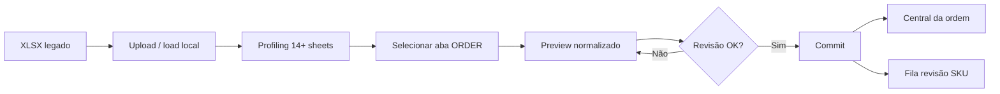

# Guia — Tela de Importação Heroes (XLSX)

Documento de referência para **operadores e desenvolvedores**. Descreve o que existe hoje na tela de importação (`/cadastros/heroes`), como o fluxo funciona de ponta a ponta, **por que importações costumam sair erradas** quando a planilha está desorganizada, e **o que deveria mudar** para tornar o processo mais eficiente e confiável.

**URL principal:** `/cadastros/heroes`  
**Menu:** Cadastros → **Importar Heroes**  
**Fluxo complementar:** após criar/vincular uma ordem, a Central da ordem pode exibir o painel `HeroesImportPanel` (revisão financeira + commit merge).

**Planilha de referência no ambiente local:** `CONTI ITALIA-BRASILE.xlsx` (raiz do projeto ou `data/raw/`).

---

## 1. Visão geral do fluxo

A tela segue um assistente em **4 passos** (barra `ux-steps` no topo):

| Passo | Nome | O que acontece |
|---|---|---|
| 0 | Carregar planilha | Upload ou leitura do XLSX legado; gera profiling read-only |
| 1 | Selecionar a aba | Escolha de uma sheet `ORDER` (ex.: `ordine 132`, `Ordine 759`) |
| 2 | Revisar preview | Parser normaliza faturas + DA SPEDIRE; usuário confere antes de gravar |
| 3 | Importar | Commit cria/atualiza ordem e redireciona para `/importacoes/{id}/resumo` |

**Princípio de governança:** nada é gravado como dado oficial antes do commit explícito. Preview e profiling ficam em `heroes_import_runs` / staging até confirmação.

---

## 2. O que tem na tela hoje (seção por seção)

### 2.1 Cabeçalho

- **Título:** Importar planilha Heroes  
- **Subtítulo:** orienta a carregar a planilha legada, revisar o entendimento do sistema e só então importar.  
- **Mensagem automática:** ao abrir a página, o sistema tenta localizar `CONTI ITALIA-BRASILE.xlsx` e mostra o caminho resolvido ou os diretórios pesquisados.

### 2.2 Seção 1 — Planilha legada (diagnóstico)

| Controle | Função |
|---|---|
| **Carregar da raiz / data/raw** | `POST /api/imports/heroes/xlsx/load-local` — lê o arquivo fixo sem upload manual |
| **Analisar planilha (sem gravar)** | `POST /api/imports/heroes/workbook-profile` — só profiling, não cria run |
| **Input file `.xlsx/.xlsm`** | `POST /api/imports/heroes/xlsx/upload` — upload manual |

**Nota exibida:** a planilha real **não é input oficial direto**; o sistema a trata como fonte bruta e produz um preview normalizado (Heroes Order v1).

### 2.3 CSV legado (paralelo)

- Input `.csv` separado → `POST /api/imports/heroes`  
- Vai para **fila de revisão** (`/cadastros/revisao`), não passa pelo fluxo XLSX descrito aqui.  
- É um caminho legado/alternativo; na prática o fluxo principal é o XLSX.

### 2.4 Seção 2 — Profiling da workbook

Aparece após carregar/upload. Tabela com **todas as abas** da planilha (ex.: 14 sheets no arquivo local).

| Coluna | Significado |
|---|---|
| **Sheet** | Nome da aba |
| **Tipo** | `ORDER`, `LOGISTICS`, `FINANCIAL_ANNUAL`, `RECEIPT_AGGREGATE`, etc. |
| **Ordem (nome)** | Número extraído do nome da aba (`ordine 132` → `132`) |
| **Ordem (conteúdo)** | Número lido do corpo da planilha |
| **Conf.** | Confiança do parser (0–1) |
| **Merges** | Quantidade de células mescladas (indica layout irregular) |
| **Recomendação** | Sugestão automática (importar, ignorar, revisar) |

Linhas com **divergência** entre nome da aba e conteúdo ficam destacadas (`heroes-upload__row-warn`). Exemplo real: `Ordine 759` com ⚠ no dropdown.

### 2.5 Seção 3 — Selecionar sheet para preview

| Controle | Função |
|---|---|
| **Dropdown** | Lista sheets com tipo e hint de ordem; começa em “— Selecione a aba —” (sem pré-seleção) |
| **Fonte** | Caminho do arquivo carregado |
| **Gerar preview normalizado** | `POST /api/imports/heroes/xlsx/preview` — dispara o parser da aba escolhida |

Ao trocar de aba, o preview anterior é descartado na UI e o número da ordem é recalculado a partir da sheet.

### 2.6 Seção 4 — Preview Heroes Order v1

É a etapa crítica de revisão. Contém:

#### Alertas

- **Divergência de ordem:** nome da sheet ≠ número no conteúdo (exige confirmação manual).  
- **Warnings** (amarelo/meta): avisos do parser (data ambígua, fatura herdada, cabeçalho DA SPEDIRE ausente, etc.).  
- **Errors** (vermelho): bloqueiam o commit (`canCommit` exige `errors.length === 0`).

#### Campo “Confirmar número da ordem”

- Input editável; pré-preenchido com ordem do conteúdo, sheet ou preview.  
- Obrigatório para importar.

#### Resumo numérico

Texto do tipo: `28 itens fatura · 0 linhas DA SPEDIRE · 8 produtos`  
— conta `invoice_items`, `da_spedire` e `new_products` do JSON de preview.

#### Tabela “Categorias sugeridas (Produto / Modelo)”

Só para **produtos novos** (nomes que ainda não existem no catálogo):

| Coluna | Conteúdo |
|---|---|
| Produto / Modelo | Texto bruto da planilha (`product_name_raw`) |
| Sugestão | Categoria inferida (Raquete, Bola, etc.) |
| Confiança | Score 0–1 |
| Ajustar | Dropdown para override antes do commit |

Overrides vão em `category_overrides` no commit.

#### Tabela de itens de fatura (parcial)

| Coluna | Conteúdo |
|---|---|
| Fatura | Número normalizado |
| Data | ISO |
| Produto / Modelo | Nome bruto |
| Qtd | Quantidade |
| Acconto | Valor acconto da linha |

**Limitação importante:** a UI mostra **no máximo 50 linhas** (`invoiceItems.slice(0, 50)`). Ordens grandes aparecem truncadas sem aviso explícito de “há mais linhas”.

#### Rodapé do preview

| Controle | Função |
|---|---|
| **Baixar preview XLSX (v1)** | Export normalizado para conferência offline |
| **Exportar CSVs (ZIP)** | Pacote CSV do preview |
| **Câmbio provisionado (EUR→BRL)** | Obrigatório; pré-preenchido com cotação de referência do sistema |
| **Importar ordem** | `POST /api/imports/heroes/xlsx/commit` → navega para a Central |

**O que NÃO aparece nesta tela (mas existe no backend):**

- Tabela **DA SPEDIRE** (quantidades a despachar, listino, preço fatura) — só o contador no resumo.  
- **Revisão financeira** (versato, acconti por fatura, rimasto) — só no `HeroesImportPanel` na Central.  
- **Vínculo SKU → produto cadastrado** — vai para `/cadastros/revisao` após staging, não antes do commit inicial.  
- **Edição linha a linha** (corrigir produto, qtd, fatura errada) — inexistente.  
- **Visualização de `raw_values`** por linha — parser guarda, UI não mostra.

---

## 3. Fluxo complementar — Central da ordem

Depois do commit (ou ao anexar planilha a ordem existente), em `/importacoes/{id}/resumo` pode aparecer o **HeroesImportPanel**:

| Bloco | Conteúdo |
|---|---|
| Status | `COMMITTED`, `REVIEW_REQUIRED`, SKUs pendentes |
| Revisão financeira | Versato, tabela acconti editável por fatura, rimasto, avisos |
| Invoice blocks | Agrupamento fatura → itens + pagamentos acconto |
| Commit merge | Confirmações financeiras, overrides de acconto/versato |

Esse painel é **mais completo** que o preview de Cadastros para a parte financeira, mas chega **tarde** se o usuário já importou com dados errados na primeira tela.

---

## 4. O que o parser espera vs. planilha real

A planilha Heroes (`CONTI ITALIA-BRASILE.xlsx`) mistura, na mesma aba `ORDER`:

1. **Bloco de faturas** — cabeçalho com data, fattura, quantità, racchetta/articolo, acconto, crediti…  
2. **Bloco DA SPEDIRE** — produtos com quantidades a enviar, listino, preço fatura, sconto…  
3. Linhas **irregulares**: células mescladas, linhas só de acconto sem produto, faturas herdadas de linhas acima, nomes abreviados (`bull`, `coch`, `ison`).

O parser (`heroes_xlsx_parser.py`) tenta:

- Achar cabeçalho de faturas por heurística (`data + fattura + quantità`).  
- Parar no marcador `DA SPEDIRE`.  
- Parsear DA SPEDIRE com cabeçalho próprio; se falhar → warning **“Cabeçalho DA SPEDIRE não encontrado”** e **0 linhas** (observado no preview de `ordine 132`).  
- Sugerir categoria por nome (`suggest_product_category`).  
- Deduplicar linhas DA SPEDIRE pelo nome do produto.

**Consequência:** se a planilha está desorganizada (colunas deslocadas, bloco DA SPEDIRE renomeado, linhas intercaladas), o sistema importa **só o bloco de faturas** e perde a conferência logística — um dos principais motivos de “importação errada”.

---

## 5. Por que a importação costuma ficar errada

Síntese dos problemas observados no browser e no código:

| # | Sintoma | Causa provável |
|---|---|---|
| 1 | Preview com `0 linhas DA SPEDIRE` e warning de cabeçalho | Layout da aba não bate com heurística do parser; merges/colunas extras |
| 2 | Produtos com nomes curtos (`bull`, `show`) não batem no catálogo | Match exato/alias falha → fila de revisão **depois** do commit |
| 3 | Mesmo produto em várias linhas/faturas sem consolidação visível | Parser lista flat; UI não agrupa por SKU nem mostra totais |
| 4 | Tabela de preview cortada em 50 linhas | Usuário confirma sem ver o restante |
| 5 | Sem edição de linha errada | Erro de OCR/layout exige reexportar planilha ou corrigir no Excel |
| 6 | Revisão financeira só na Central | Acconti/versato errados passam no passo 4 de Cadastros |
| 7 | Divergência ordem (sheet vs conteúdo) | Usuário pode confirmar número errado se não ler o alerta |
| 8 | Categorias com confiança baixa (0.55) | `coch`, `harley`, `mjolnir` sugeridos como Raquete sem revisão obrigatória na UI |
| 9 | Reimportação de ordem anulada | Já corrigido no backend (runs stale, ordem inativa), mas UX ainda confusa se ordem “sumiu” da fila |
| 10 | Dois caminhos (CSV vs XLSX) | Operador pode usar fluxo errado para o tipo de arquivo |

---

## 6. O que deveria mudar — proposta para importação mais eficiente

Priorização sugerida para discussão e implementação.

### P0 — Corrigir confiança antes do commit

1. **Mostrar os dois blocos no preview**  
   - Aba ou seções: **Faturas** e **DA SPEDIRE** lado a lado.  
   - Destacar divergências: SKU na fatura sem linha em DA SPEDIRE e vice-versa.

2. **Remover limite silencioso de 50 linhas**  
   - Paginação ou scroll com contador “mostrando X de Y”.  
   - Bloquear commit se houver linhas com `needs_review: true` sem checkbox de confirmação.

3. **Trazer revisão financeira para o preview de Cadastros**  
   - Reutilizar `financial_review` / `invoice_blocks` já calculados no backend (como no `HeroesImportPanel`).  
   - Exigir confirmação quando `requires_manual_review`.

4. **Resolver SKU antes do commit (ou bloquear)**  
   - Embutir mini–fila de revisão na etapa 4: combobox de produto por `product_name_raw`.  
   - Alternativa: commit em estado `REVIEW_REQUIRED` **sem** criar itens oficiais até resolver SKUs.

5. **Feedback claro quando DA SPEDIRE falha**  
   - Banner vermelho: “Bloco logístico não lido — importação incompleta”.  
   - Opção “Importar só faturas” com confirmação explícita (hoje é implícito).

### P1 — Lidar com planilha desorganizada

6. **Editor de linhas no preview**  
   - Corrigir produto, qtd, fatura, data, acconto inline.  
   - Persistir correções no `preview_json` antes do commit (staging editável).

7. **Modo “linha bruta”**  
   - Expandir linha → mostrar `raw_values` e número da linha Excel (`row_number`).  
   - Ajuda quando colunas estão deslocadas.

8. **Re-detecção de cabeçalho assistida**  
   - Se parser falhar: usuário clica na linha do cabeçalho real na grade preview.  
   - Reprocessa só aquela aba com mapeamento manual de colunas.

9. **Consolidação por produto**  
   - Painel “Totais por SKU”: soma qtd faturada vs DA SPEDIRE vs catálogo.  
   - Alerta para duplicatas (`rebel` 50 + 300 na mesma fatura).

10. **Profiling acionável**  
    - Na tabela de sheets: botão “Preview” direto na linha, filtro “só ORDER”, ordenar por confiança.

### P2 — Eficiência operacional

11. **Importação em lote de abas**  
    - Selecionar várias `ordine N` e enfileirar (uma ordem por sheet).

12. **Memória de layout por versão de planilha**  
    - Salvar mapeamento de colunas quando operador corrige cabeçalho (por hash/versão do template).

13. **Diff com importação anterior**  
    - Se reimportar mesma ordem: mostrar o que mudou (itens novos/removidos).

14. **Unificar CSV e XLSX na mesma UX**  
    - Um único wizard; CSV vira “modo simplificado”.

15. **Pós-commit**  
    - Não redirecionar imediatamente se há SKUs pendentes; ir para revisão com deep-link (já existe parcialmente em `?heroes_run_id=`).

---

## 7. Regras de habilitação do botão “Importar ordem” (hoje)

No frontend (`HeroesUploadPage.tsx`), `canCommit` exige:

- `confirmedOrder` preenchido  
- `provisionRate` (câmbio) preenchido  
- `preview.errors` vazio  
- Se `order_number_divergence`: ordem confirmada coerente  

**Não exige:** warnings zerados, DA SPEDIRE presente, SKUs resolvidos, revisão financeira, nem revisão de linhas com baixa confiança.

---

## 8. Mapa de arquivos

### Frontend

| Arquivo | Função |
|---|---|
| `frontend/src/pages/HeroesUploadPage.tsx` | Tela principal `/cadastros/heroes` |
| `frontend/src/pages/importation/HeroesImportPanel.tsx` | Revisão financeira + commit na Central |
| `frontend/src/pages/ReviewQueuePage.tsx` | Fila de vínculo SKU (`/cadastros/revisao`) |
| `frontend/src/api.ts` → `importsApi` | Cliente HTTP (upload, preview, commit, export) |

### Backend

| Arquivo | Função |
|---|---|
| `app/api/imports.py` | Endpoints REST Heroes XLSX |
| `app/services/heroes_xlsx_parser.py` | Parse faturas + DA SPEDIRE + sheets auxiliares |
| `app/services/heroes_xlsx_import.py` | Upload, preview run, idempotência |
| `app/services/heroes_xlsx_commit.py` | Commit → `ImportationOrder`, invoices, itens |
| `app/services/heroes_xlsx_staging.py` | Staging + fila SKU |
| `app/services/heroes_product_match.py` | Match nome → produto cadastrado |
| `app/services/heroes_invoice_blocks.py` | Agrupa itens flat em blocos por fatura |
| `app/services/heroes_product_aliases.py` | Aliases persistidos para match |

### Endpoints principais

| Método | Rota | Uso na tela |
|---|---|---|
| GET | `/api/imports/heroes/locate-workbook` | Mensagem de planilha encontrada |
| POST | `/api/imports/heroes/xlsx/load-local` | Carregar da raiz |
| POST | `/api/imports/heroes/workbook-profile` | Analisar sem gravar |
| POST | `/api/imports/heroes/xlsx/upload` | Upload manual |
| POST | `/api/imports/heroes/xlsx/preview` | Gerar preview |
| POST | `/api/imports/heroes/xlsx/commit` | Importar ordem |
| POST | `/api/imports/heroes/xlsx/export` | Baixar XLSX/ZIP normalizado |

---

## 9. Checklist rápido para o operador (até melhorias existirem)

Antes de clicar **Importar ordem**:

- [ ] Sheet correta selecionada (tipo `ORDER`, sem ⚠ se possível)  
- [ ] Número da ordem conferido (sheet vs conteúdo)  
- [ ] Warning de DA SPEDIRE ausente — **investigar** (importação pode estar incompleta)  
- [ ] Percorrer **todas** as linhas (lembrar limite de 50 na UI)  
- [ ] Ajustar categorias de produtos novos com confiança &lt; 0.7  
- [ ] Câmbio provisionado conferido  
- [ ] Após importar: abrir **Fila de revisão** se houver SKUs pendentes  
- [ ] Na Central: conferir **revisão financeira** antes do commit merge final  

---

## 10. Evidência visual (ambiente local, jul/2026)

Inspeção em `/cadastros/heroes` com `CONTI ITALIA-BRASILE.xlsx`:

- **14 sheets** no profiling (`RITIRI HK`, `RACCHETTE DA RICEVERE`, anos financeiros, `Ordine 759` com divergência, `ordine 132`, etc.).  
- Preview `ordine 132`: **28 itens fatura**, **0 DA SPEDIRE**, **8 produtos** novos, warning *Cabeçalho DA SPEDIRE não encontrado*.  
- Produtos no preview: `bull`, `coch`, `harley`, `ison`, `mjolnir`, `rebel`, `show`, `starlight` — vários com confiança 0.55–0.85.  
- Botões de export e campo de câmbio visíveis no rodapé do preview; passo 4 do wizard ativo após preview.

---

*Documento gerado para apoiar redesign da importação Heroes. Atualizar quando a tela ou o parser mudar.*
