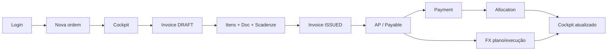

# Guia AS-IS — Telas, UI e Fluxos (V2)

> Companheiro das capturas em `docs/evidence/ux-1-audit/`.
> Descreve o que a interface **mostra e faz hoje** (Inc-5), não o redesign UX-1.
> Auditoria de referência: plano `ux-1-professional-ui.plan.md` (2026-07-24).
> Dados nas fotos são sintéticos (`UX1-AUDIT-*`); sem conteúdo operacional.

---

## 1. Como usar este guia

| Pasta | Conteúdo |
|---|---|
| `1366/` e `1920/` | Capturas por viewport; `*-annotated.png` marcam achados numerados |
| `flows/` | Passos do Order-to-Pay completo |
| `errors-states/` | Vazios, erro de API, formulário inválido, scroll longo |

Para cada tela abaixo: **rota → o que aparece → ações → estados → evidência**.

---

## 2. Mapa do produto (shell)

Depois do login, tudo vive dentro do **AppShell**: sidebar à esquerda + conteúdo à direita.

```text
┌─────────────────┬──────────────────────────────────────┐
│ Epic Controle   │  (página ativa)                       │
│ nome · role     │                                      │
│                 │                                      │
│ Ordens          │                                      │
│  · Fila         │                                      │
│  · Nova         │                                      │
│                 │                                      │
│ Financeiro      │                                      │
│  · Contas a     │                                      │
│    pagar /      │                                      │
│    Payables     │                                      │
│  · Faturas      │                                      │
│  · Pagamentos   │                                      │
│                 │                                      │
│ EUR/BRL quote   │                                      │
│ [Sair]          │                                      │
└─────────────────┴──────────────────────────────────────┘
```

### O que a sidebar mostra

| Elemento | Comportamento |
|---|---|
| Marca `Epic Controle` | Identidade do produto (pequena) |
| `nome · role` | Usuário logado; pode truncar se o nome for longo |
| Grupo **Ordens** | `Fila` → `/orders`; `Nova` → `/orders/new` (só com `orders:write`) |
| Grupo **Financeiro** | Links conforme permissão |
| Label do payable | Com `reporting:read` (ou admin): **Contas a pagar**. Sem: **Payables** |
| Cotação EUR/BRL | Strip no rodapé da sidebar (`FxQuoteStrip`) |
| Sair | Logout e volta ao login |

**Observação de UX:** a página inteira rola; sidebar e cabeçalhos de tabela **não ficam sticky**. Em listas longas, navegação e filtros saem da tela.

---

## 3. Inventário de telas

### 3.1 Login — `/login`

**Propósito:** autenticar e entrar na fila de ordens.

**O que aparece**
- Título `Epic Controle V2`
- Subtítulo `Acesso à fundação técnica.`
- Campos E-mail e Senha (pré-preenchidos no ambiente de dev)
- Botão `Entrar` / `Entrando…`
- Mensagem de erro em vermelho se falhar

**Ações:** submit → cookie de sessão → redireciona para `/orders`.

**Evidência:** `1366/01-login-as-is.png`, `1920/01-login-as-is.png`

---

### 3.2 Fila de ordens — `/orders`

**Propósito:** listar ordens comerciais e abrir detalhe/cockpit.

**O que aparece**
- Título `Ordens`
- Botão `Nova ordem` (se tiver escrita)
- Tabela: Código · Data · Fornecedor · Status · Total comercial · Atualizado  
  - **Fornecedor** hoje é o **ID numérico**, não o nome
  - Código é link para `/orders/:id`
- Vazio: `Nenhuma ordem — criar ou importar Ordine`
- Loading: `Carregando ordens…`

**O que não tem:** busca, filtros, ordenação indicada, paginação visual, contagem total, sticky header.

**Evidência**
- Vazio: `02-orders-empty-as-is.png`
- Escala (~36 linhas): `10-orders-scale-full.png` / `10-orders-scale-annotated.png`
- Shell anotado: `02-shell-annotated.png`

---

### 3.3 Nova ordem — `/orders/new`

**Propósito:** criar ordem DRAFT ou DRAFT+CONFIRMED com itens.

**O que aparece**
- Título `Nova ordem`
- Campo **Código / Nº ordem**
- Select **Fornecedor** (ou campo **Novo fornecedor**)
- Bloco **Itens:** SKU (datalist), Qtd, Preço (`vazio = null`), `Adicionar linha`, `Criar SKU`
- Tabela das linhas + **Total comercial** (pode marcar incompleto se faltar preço)
- Ações: `Salvar DRAFT` · `Salvar e confirmar`
- Erros em alerta vermelho (fornecedor, código, SKU, qtd…)

**Fluxo interno:** cria ordem → adiciona itens um a um → opcionalmente confirma → navega para `/orders/:id`.

**Evidência:** `03-new-order-as-is.png`, `flows/01-order-two-items.png`, `errors-states/07-order-invalid-form.png`

---

### 3.4 Cockpit da ordem — `/orders/:id` (com `reporting:read`)

**Propósito:** visão operacional única da ordem (comercial + financeiro + tesouraria + docs/audit).

**O que aparece**
1. Breadcrumb `Ordens › {código}`
2. Header `Cockpit · {código}` + subtítulo com nome do fornecedor
3. Botão `Comercial / edição` (embute o detalhe comercial abaixo)
4. Badge de status + data de atualização
5. **KPIs:** Pedido · Faturado · Pago (alloc) · Saldo · Próx. venc. · FX exposição · FX realizado
6. Alertas (ou `Sem alertas`)
7. Grade em três colunas:
   - **Financeiro:** lista de invoices e payables (com link FX)
   - **Tesouraria:** pago via allocations, payments, candidatos unallocated
   - **Documentos / Audit:** arquivos e últimos eventos

**Fallback sem reporting:** a mesma rota renderiza só `OrderDetailPage` (detalhe comercial, sem KPIs/reporting).

**Evidência**
- Vazio/só comercial: `04-cockpit-empty-finance-as-is.png`
- Populada: `09-cockpit-populated-as-is.png` / `09-cockpit-populated-annotated.png`
- Fim do fluxo: `flows/05-completed-cockpit.png`
- Comprador (fallback): `16-buyer-order-fallback.png`

---

### 3.5 Lista de faturas — `/invoices`

**Propósito:** inventário simples de invoices.

**O que aparece**
- Título `Faturas`
- Filtro de status (Todas / DRAFT / ISSUED / CANCELLED)
- Lista de links no formato: `{número} · ordem # {id} · {status} · {valor}`

**Evidência:** `11-invoices-list-sample.png`

---

### 3.6 Detalhe da fatura — `/invoices/:id`

**Propósito:** montar/emitir a invoice (itens, documento, scadenze/payables).

**O que aparece (topo)**
- Título com número + metadados técnicos tipo `FINAL · DRAFT · EUR · v1`
- Aviso readonly se já emitida
- Lista de **bloqueios** (ex.: falta documento) quando emissão está impedida

**Seções**
1. **Itens** — tabela editável (qtd, preço, tipo de desconto, unidade/%); botão `Salvar itens`; líquido
2. **Documento** — upload/anexo obrigatório para emitir
3. **Scadenze** — modo de termos, datas, % ou valor, preview; `Salvar termos`
4. **Payables** — preview antes de emitir / lista após emitir
5. Botão **Emitir** (ou motivo do bloqueio)

**UX típica:** três salvamentos separados (itens → documento → scadenze) antes de emitir.

**Evidência:** `05-invoice-draft-as-is.png` / `05-invoice-draft-annotated.png`, `errors-states/01-invoice-without-document.png`

---

### 3.7 Contas a pagar (AP) — `/payables` com reporting

**Propósito:** fila operacional de payables (vencidos primeiro).

**O que aparece**
- Breadcrumb `Financeiro › Contas a pagar`
- Header + botão `Atualizar`
- **KPIs:** Vencido · Hoje · Próx. 7d · Saldo aberto · Candidatos unalloc.
- **Filtros:** Status, Pendência, Moeda, Ordem
- **Tabela densa:** Vencimento · Atraso · Invoice · Ordem · Moeda · Valor · Alocado · Saldo · FX proj. · BRL proj. · Status · Pendências · Ações (FX)
- Rodapé: `{total} no filtro · offset/limit · sort`
- **Drawer** ao clicar na linha: status, saldo, fornecedor, links `Abrir invoice` · `Cockpit ordem` · `FX` · `Registrar payment`

**Vazio de filtro:** `Nada a pagar no filtro`  
**Erro API:** mensagem técnica (pode aparecer JSON cru)

**Evidência:** `06-ap-queue-as-is.png` / `06-ap-queue-annotated.png`, `flows/02-ap-payable-drawer.png`, `errors-states/02-ap-no-results.png`, `04-ap-35-rows.png`, `05-ap-scroll-lost-context.png`, `06-ap-api-failure.png`

---

### 3.8 Payables fallback — `/payables` sem reporting

**Propósito:** mesma rota, UI bem mais pobre para quem não tem `reporting:read`.

**O que aparece:** título tipo **Payables**, tabela básica com IDs (sem KPIs, drawer nem filtros ricos).  
A troca é **silenciosa** — o usuário não vê mensagem de “sem permissão de reporting”.

**Evidência:** `15-buyer-basic-payables.png`

---

### 3.9 FX do payable — `/payables/:id/fx`

**Propósito:** planejar/executar câmbio e ver valuation/PnL do título.

**O que aparece**
- Título `Payable #{id}`
- Blocos de plano FX, cotação, execução, freeze/PnL (conforme estado)
- Estados: missing, planejado, online; códigos técnicos tipo `MISSING_FX` podem aparecer nas filas/cockpit

**Evidência:** `13-payable-fx-sample.png`, `flows/04-fx-execution-pnl.png`

---

### 3.10 Lista de pagamentos — `/payments`

**Propósito:** inventário de payments.

**O que aparece**
- Título `Pagamentos`
- Link `Novo` / registrar
- Lista com ids, valores, residual etc.

**Evidência:** `12-payments-list-sample.png`

---

### 3.11 Registrar pagamento — `/payments/new`

**Propósito:** criar payment REGISTERED.

**O que aparece**
- Título `Registrar pagamento`
- Campos: Fornecedor · Data · Valor · Referência · Documento
- Botão salvar

**Gap crítico de fluxo:** o link `Registrar payment` no drawer da AP **não propaga** supplier, payable nem valor — o formulário abre genérico e o operador precisa lembrar/reconferir os dados.

**Evidência:** `07-payment-new-as-is.png`

---

### 3.12 Detalhe do pagamento — `/payments/:id`

**Propósito:** ver residual e alocar o payment a payables elegíveis.

**O que aparece**
- Título com id/status/valores
- **Comprovantes**
- **Alocações** já feitas
- Tabela **Payables elegíveis** + campos de valor + botão alocar

**Evidência:** `08-payment-detail-as-is.png`, `flows/03-payment-allocated.png`

---

## 4. Fluxos ponta a ponta

### 4.1 Order-to-Pay (jornada completa auditada)



| Passo | Tela | O operador faz | Evidência tipica |
|---:|---|---|---|
| 1 | Login | Entra | `01-login-as-is` |
| 2 | Nova ordem | Código, fornecedor, 1–N itens | `03-new-order`, `flows/01-order-two-items` |
| 3 | Cockpit | Confere KPIs (ainda sem fatura) | `04-cockpit-empty` |
| 4 | Invoice | Cria draft, salva itens | `05-invoice-draft` |
| 5 | Invoice | Anexa documento | `errors-states/01` se faltar |
| 6 | Invoice | Define scadenze e emite | — |
| 7 | AP | Localiza payable na fila / drawer | `06-ap-queue`, `flows/02` |
| 8 | Payment new | Registra pagamento (dados manuais) | `07-payment-new` |
| 9 | Payment detail | Aloca residual | `flows/03-payment-allocated` |
| 10 | FX | Plano → quote → execução → PnL | `flows/04-fx-execution-pnl` |
| 11 | Cockpit | Confere saldo, docs, audit | `flows/05-completed-cockpit` |

**Métricas da auditoria (aprox.):** ~39 ações · 10 telas · ~25 decisões · alto risco de repetir/errar fornecedor-valor no payment.

### 4.2 Fluxo só comercial (comprador sem reporting)

1. Login → Fila de ordens  
2. Nova ordem (se tiver write)  
3. Abre `/orders/:id` → **Order detail** (sem KPIs/reporting)  
4. Payables mostra **fallback** básico  
5. Não vê AP com KPIs/drawer

**Evidência:** `14-buyer-orders-persona.png`, `15-buyer-basic-payables.png`, `16-buyer-order-fallback.png`

### 4.3 Fluxo AP → Payment → Allocation

1. Em Contas a pagar, clica na linha → drawer  
2. Lê saldo / invoice / ordem  
3. Clica `Registrar payment` → formulário **sem contexto pré-preenchido**  
4. Preenche fornecedor/valor/data  
5. No detalhe, aloca ao payable elegível  

**Risco:** pagamento no fornecedor ou valor errado por memória.

### 4.4 Fluxo FX

1. Da AP (ação FX) ou do cockpit (link FX no payable)  
2. Tela do payable FX: plano / cotação / execução  
3. PnL/freeze só após passos e, em parte, navegação manual de volta ao cockpit  

---

## 5. Estados especiais (o que a UI diz)

| Situação | Mensagem / comportamento | Onde |
|---|---|---|
| Lista de ordens vazia | `Nenhuma ordem — criar ou importar Ordine` | `/orders` |
| Filtro AP sem resultado | `Nada a pagar no filtro` | AP |
| Loading | `Carregando…` / `Carregando ordens…` | várias |
| Form nova ordem inválido | alertas pontuais (fornecedor, código…) | `/orders/new` |
| Invoice sem documento | bloqueio explícito na lista de blockers | invoice |
| Erro API na AP | texto/JSON de erro; dados antigos podem permanecer | AP |
| Sem reporting | UI “pobre” sem aviso de 403 | payables / ordem |
| Null / sem preço | `—` (vazio ≠ 0) | totais e listas |
| Cotação ausente | traço ou botão disabled no strip | shell |

---

## 6. Personas vs. o que cada uma vê

| Persona | Validação | Shell / telas |
|---|---|---|
| **Admin** | Browser | Todas as rotas; Cockpit Reporting + Contas a pagar |
| **Comprador** | Browser | Ordens + listas; Order detail e Payables **fallback** |
| Financeiro / Gestor / Logística | Código ou Blueprint | Não seedados na auditoria; alvo de produto |

O gap não é só RBAC: **a mesma rota muda de produto visual** conforme a permissão, sem explicar o motivo.

---

## 7. Linguagem e densidade (AS-IS)

Elementos que aparecem nas telas e soam técnicos ou mistos:

| Na UI | Observação |
|---|---|
| `OPEN`, `PARTIALLY_PAID`, `DRAFT`, `ISSUED` | Status em inglês/código |
| `MISSING_FX`, `Candidatos unalloc.` | Jargão interno |
| `Scadenze` | Italiano; operador BR espera “prazos/parcelas” |
| `Ordine` no empty state | Mistura IT/PT |
| IDs de fornecedor/payable | Reconhecimento difícil sem nome |
| `FINAL · DRAFT · EUR · v1` | Metadado técnico no título da invoice |

---

## 8. Índice rápido evidência ↔ tela

| Arquivo (base) | Tela / momento |
|---|---|
| `01-login-as-is` | Login |
| `02-shell-annotated` | Shell + fila |
| `02-orders-empty-as-is` | Ordens vazia |
| `03-new-order-as-is` | Nova ordem |
| `04-cockpit-empty-finance-as-is` | Cockpit sem fatura |
| `05-invoice-draft-*` | Invoice draft |
| `06-ap-queue-*` | Contas a pagar |
| `07-payment-new-as-is` | Novo payment |
| `08-payment-detail-as-is` | Detalhe payment |
| `09-cockpit-populated-*` | Cockpit completo |
| `10-orders-scale-*` | Ordens com escala |
| `11-invoices-list-sample` | Lista faturas |
| `12-payments-list-sample` | Lista pagamentos |
| `13-payable-fx-sample` | FX do payable |
| `14/15/16-buyer-*` | Persona comprador |
| `flows/01…05` | Jornada Order-to-Pay |
| `errors-states/*` | Negativos / escala / erro |

---

## 9. Onde está o diagnóstico e a proposta

Este arquivo **explica** telas e fluxos. Não substitui:

- **Diagnóstico + gaps + TO-BE:** `C:\Users\ricar\.cursor\plans\ux-1-professional-ui.plan.md`
- **Roadmap / Blueprint:** não foram alterados pela auditoria; Inc-5.5 / UX-1 só após revisão humana

---

*Gerado a partir da auditoria UX-1 AS-IS (2026-07-24). Atualizar se a UI Inc-5 mudar materialmente.*
