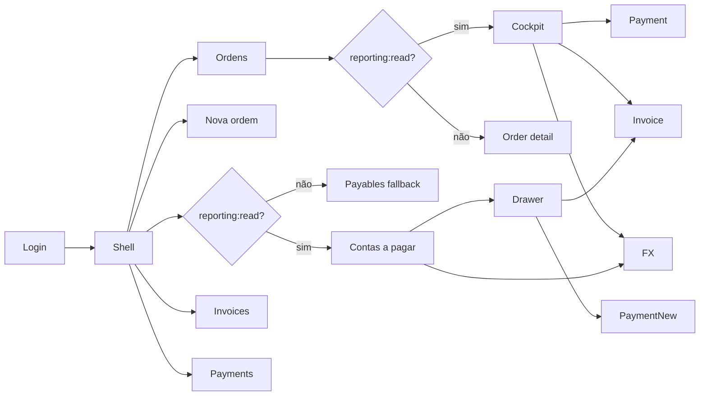
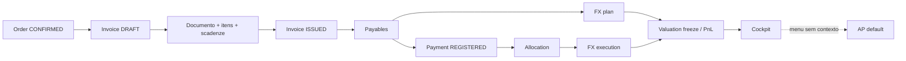
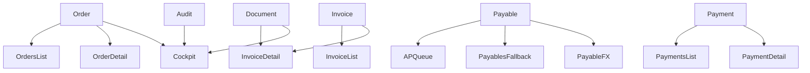
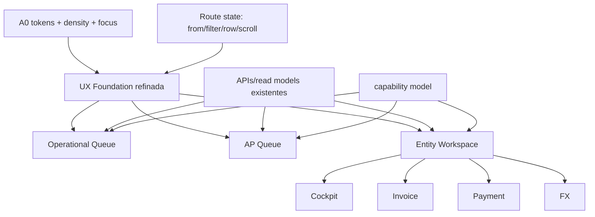

# UX-1 Professional UI — artefato de auditoria

> Auditoria executada em 2026-07-24. Este documento separa fatos AS-IS de hipóteses TO-BE. Não autoriza implementação, alteração do Roadmap nem início do Inc-6.

## PARTE A — DIAGNÓSTICO

### 1. Status e baseline

**Status da auditoria:** DONE.

| Item | Baseline auditado |
|---|---|
| Branch / HEAD | `main` / `f9a83ed1a5c655374b96a4edc817fcb2053ef447` |
| Último commit | `f9a83ed` — 2026-07-23 — “Remove deprecated files and update .gitignore for improved project structure” |
| Working tree inicial | 37 entradas em `git status --short`; WIP preexistente preservado |
| Working tree final | mesmas 23 alterações tracked; evidências UX-1 adicionadas; nenhum source de produto alterado pela auditoria |
| Alembic operacional | `epic_v2`: `006 (head)` |
| Alembic auditoria | `epic_v2_test`: reset controlado e `006 (head)` |
| OpenAPI gerado | OpenAPI `3.1.0`; `info.version=0.1.0` |
| Blueprint | `docs/v2/BLUEPRINT_SISTEMA_EPIC_V2.md` v0.2.8 |
| Roadmap | `ROADMAP_V2_EPIC.md` v0.5.10; Inc-1…5 DONE; Inc-6 NOT_STARTED |
| Runtime operacional | `127.0.0.1:8081`, PID 446784, health/database OK antes e depois |
| Runtime auditoria | `127.0.0.1:8082`, PID 399792, `epic_v2_test`, health/database OK |
| Build usado | build Inc-5 existente de 2026-07-24 17:47:20Z; nenhum rebuild |
| Hash CSS | `E9E9E7D1051A071C7D104A07CB9CF381B5BFFD2EF798D08E832478D107539B37` |
| Hash JS | `376BDD8CCE41561471443509B93B6D6F0CD531954E1B661481665F4A777000BA` |
| Hash index | `991080E875D3C0433FA186B46BA3F8D3ED7EFC272799A0D9054C085B7B5FB023` |
| Attachments auditoria | `v2/data/e2e-attachments`, exclusivo; três arquivos sintéticos removidos ao encerrar |
| Attachments operacionais | `v2/data/attachments`, sem escrita da auditoria; timestamps operacionais permaneceram anteriores ao walkthrough |
| Viewports | 1366×768 e 1920×1080 |

Massa criada apenas em `epic_v2_test`: `UX1-AUDIT-001`, `UX1-AUDIT-INV-001`, `UX1-AUDIT-PAY-001`, dois SKUs, dois documentos sintéticos, 35 ordens auxiliares e 33 payables auxiliares para escala. Nenhum dado pessoal ou operacional foi usado.

### 2. Metodologia e isolamento

- Inspeção code-only antecedeu o runtime.
- Walkthrough manual percorreu Order-to-Pay, Payment e FX.
- Cinco superfícies receberam avaliação completa de 11 heurísticas; oito receberam amostra de quatro critérios e checklist estrutural.
- Estados negativos foram produzidos por massa de teste, permissões reais ou interceptação local segura.
- Evidências: `docs/evidence/ux-1-audit/{1366,1920,flows,errors-states}/`.
- Screenshots full têm cópias `*-annotated.png`; os números são explicados em §5.
- Nenhuma credencial, cookie, header, token ou conteúdo operacional foi registrado nos screenshots.

### 3. Eixo estrutural front-end

#### 3.1 Tokens e CSS

Há apenas seis tokens globais: `--bg`, `--panel`, `--text`, `--muted`, `--accent`, `--border`. Faltam escalas semânticas de spacing, tipografia, densidade, estados, foco, elevação, largura e z-index. Cores literais reaparecem nos componentes novos.

O shell mantém estilos legados e estilos de sidebar no mesmo arquivo. `shell-side-nav` usa `display:grid; gap:1rem; flex:1`, o que distribui grupos e links verticalmente e gera áreas ativas desproporcionais. A página inteira rola; sidebar e headers de tabela não são sticky. Em 35 linhas, o usuário perde navegação, filtros e cabeçalhos.

#### 3.2 Adoção da UX Foundation

| Superfície | Foundation | Veredito |
|---|---|---|
| AP | Usa PageHeader, KPIs, badges, money/FX, filtros, drawer e estados | Melhor adoção; REFINE |
| Cockpit | Usa header, breadcrumb, KPIs, badges, money/FX e estados | Boa base; REFINE |
| Ordens | Tabela e estados locais | Migrar em A1 |
| Nova ordem | Formulário/tabela locais | Manter fluxo; alinhar em UX-1B |
| Invoice | Markup e estados locais | Redesign posterior; não decompor nesta fatia |
| Payments | Três telas em `PaymentsPages.tsx`, markup local | Redesign posterior |
| FX | Markup próprio em `FxPanels.tsx` | Redesign posterior |
| Payables fallback | Segunda fila, sem Foundation | Consolidar experiência; preservar RBAC |

#### 3.3 Duplicação de filas

AP e Payables fallback exibem a mesma entidade com vocabulário, colunas, filtros e ações diferentes. Admin vê “Contas a pagar”, KPIs, pendências e drawer; comprador vê “Payables”, tabela básica e IDs. A diferença deriva de `reporting:read`, mas é percebida como dois produtos. Ordens e Payments repetem tabela, loading, erro, valor e status sem compartilhar os padrões já disponíveis.

#### 3.4 LOC versus Blueprint §3.3

| Arquivo | LOC | Avaliação |
|---|---:|---|
| `InvoiceDetailPage.tsx` | 519 | acima do guia; ADR candidate |
| `FxPanels.tsx` | 353 | acima do guia; ADR candidate |
| `PaymentsPages.tsx` | 297 | limite; três telas acopladas |
| `ApQueuePage.tsx` | 274 | dentro, próximo do limite |
| `OrderCreatePage.tsx` | 239 | dentro |
| `OrderCockpitPage.tsx` | 186 | dentro |
| `OrderDetailPage.tsx` | 176 | dentro |
| `InvoicesListPage.tsx` | 92 | dentro |
| `OrdersListPage.tsx` | 78 | dentro |

#### 3.5 Regra de negócio no FE

`invoiceMath.ts` (59 LOC) e `orderTotals.ts` (40 LOC) calculam totais/validações no cliente. São ADR candidates por risco de divergência e não entram na implementação UX-1. `StatusBadge` não contém regra financeira crítica: veredito **REFINE**, com mapeamento semântico central e fallback explícito, em vez de OUT_OF_SCOPE.

### 4. Inventário de rotas

| Rota | Estado | Persona | Evidência / observação |
|---|---|---|---|
| `/login` | OPENED_IN_BROWSER | admin, comprador | 1366/1920 |
| `/orders` | OPENED_IN_BROWSER | admin, comprador | vazio, 1 linha e 36 linhas |
| `/orders/new` | OPENED_IN_BROWSER | admin | vazio, inválido, dois itens |
| `/orders/:id` | OPENED_IN_BROWSER | admin | cockpit Reporting |
| `/orders/:id` | FALLBACK_PATH | comprador | OrderDetail sem cockpit |
| `/invoices` | OPENED_IN_BROWSER | admin | lista simples |
| `/invoices/:id` | OPENED_IN_BROWSER | admin | draft bloqueado e issued |
| `/payables` | OPENED_IN_BROWSER | admin | AP Reporting |
| `/payables` | FALLBACK_PATH | comprador | tabela básica |
| `/payables/:id/fx` | OPENED_IN_BROWSER | admin, comprador | missing, planejado e online |
| `/payments` | OPENED_IN_BROWSER | admin | lista |
| `/payments/new` | OPENED_IN_BROWSER | admin | contexto não propagado |
| `/payments/:id` | OPENED_IN_BROWSER | admin, comprador | unallocated, allocated e FX |

CODE_ONLY: nenhum. INACCESSIBLE: nenhum. A API Reporting foi validada como 403 para comprador.

### 5. Screenshots full anotados

#### 5.1 Shell — `02-shell-annotated.png`

1. Identidade do produto pequena; nome/role truncam no comprador.
2. Navegação cresce verticalmente e cria alvos ativos gigantes.
3. Conteúdo usa uma fração do viewport; composição parece protótipo.
4. Cotação e logout ficam presos ao fundo visual, mas a sidebar rola com a página.

#### 5.2 Fila de ordens — `10-orders-scale-annotated.png`

1. Estado ativo ocupa área muito maior que o rótulo.
2. Não há filtros, busca, ordenação indicada, paginação ou contagem.
3. Fornecedor aparece como ID cru.
4. Data de atualização mistura locale inglês com data ISO.
5. Com 36 linhas, não há header/sidebar sticky nem retorno de scroll.

#### 5.3 Cockpit — `09-cockpit-populated-annotated.png`

1. Breadcrumb funciona, mas a volta não preserva contexto de AP.
2. KPIs são a hierarquia mais madura da V2.
3. Financeiro dá rastreabilidade, porém IDs e precisão são técnicos.
4. Tesouraria separa allocation de “candidatos”, mas o texto exige conhecimento interno.
5. Documentos/Audit são visíveis; datas cruas quebram escaneabilidade.

#### 5.4 AP — `06-ap-queue-annotated.png`

1. KPIs sustentam decisão, mas não explicitam moeda.
2. Filtros são úteis; faltam limpar, persistência e indicação de aplicação.
3. Muitas colunas técnicas comprimem saldo/FX.
4. Pendências e “FX” expõem códigos e ações pouco descritivas.
5. “Candidatos unalloc.” não explica escopo; drawer corta conteúdo em 1366.

#### 5.5 Invoice detail — `05-invoice-draft-annotated.png`

1. `FINAL · DRAFT · EUR · v1` é metadado técnico, não estado operacional.
2. Bloqueios são claros, porém sem links/foco para corrigir.
3. Edição em tabela não oferece navegação eficiente ou labels suficientes.
4. Botões brancos são inconsistentes com a aplicação e hierarquia de ação.
5. Documento e scadenze exigem scroll; “scadenze” não é linguagem operacional em português.

### 6. Walkthrough Order-to-Pay

| Faixa | Resultado | Fricção observada |
|---|---|---|
| 1–7 Login→cockpit | concluído | 11 ações principais; criação de SKU é ação separada sem confirmação |
| 8–11 Invoice | concluído | 9 decisões; desconto `NONE`, documento e scadenze exigem três salvamentos |
| 12–15 AP/drawer | concluído | boa leitura da fila; row clicável não é foco de teclado; drawer corta links |
| 16–19 Payment/alocação | concluído | “Registrar payment” não propaga supplier, payable nem valor; dado precisa ser lembrado |
| 20–23 FX | concluído | plano, quote, execução e freeze em telas distintas; PnL aparece só após navegação manual |
| 24–27 cockpit/retorno | concluído | documentos/audit encontrados; retorno à AP perde filtro, linha, drawer e scroll |

Métricas resumidas:

| Jornada | Cliques/ações | Telas | Decisões | Dados repetidos | Trocas de contexto | Risco | Avaliação |
|---|---:|---:|---:|---:|---:|---|---|
| Ordem→Invoice emitida | 20 | 4 | 12 | 4 | 3 | médio | funcional, lenta |
| AP→Payment→allocation | 10 | 3 | 6 | 3 | 2 | alto | contexto não preservado |
| FX plano→execução→PnL | 9 | 3 | 7 | 3 | 3 | alto | técnica e fragmentada |
| Fluxo completo | ~39 | 10 | ~25 | 10 | 8 | alto | funcional básica |

Principais riscos: preencher pagamento para fornecedor/payable errado; repetir valor por memória; interpretar saldo zero do cockpit antes de faturar; confundir missing/current/online FX; perder o item ao retornar.

### 7. Teclado, foco e escala

| Jornada | Mouse obrigatório | Teclado | Foco | Repetição | Gap |
|---|---|---|---|---|---|
| Shell→conteúdo | sim na prática | links nativos | começa pela nav | 7 alvos antes do conteúdo | falta skip-link |
| Nova ordem multi-item | sim | inputs acessíveis | não avança automaticamente | SKU/qtd/preço repetidos | sem grid/atalho/copy-paste |
| Invoice | sim | inputs/selects | vários inputs sem nome acessível | três salvamentos | não há foco no bloqueio |
| AP drawer | sim | row não é botão/link | Escape não fecha; foco volta ao body | abre por mouse | P1 acessibilidade |
| Tabelas longas | sim | links internos | header não sticky | contexto se perde | sem seleção/atalhos |

Em 36 ordens e 35 payables, `thead` é `position: static`; após scroll 1200, header e sidebar estavam fora do viewport. AP mostra cinco linhas em 1366; não há paginação visual apesar do texto `limit 50`.

### 8. Estados negativos

| Estado | Tela | Feedback atual | Problema | Evidência |
|---|---|---|---|---|
| Lista vazia | Ordens | “Nenhuma ordem — criar ou importar Ordine” | mistura idioma e não orienta importação | `02-orders-empty-as-is` |
| Filtro vazio | AP | “Nada a pagar no filtro” | sem limpar filtro/explicar | `02-ap-no-results` |
| Loading | várias | texto `Carregando…` | Invoices mostra vazio antes do dado; layout salta | browser |
| Erro API 500 simulado | AP | JSON cru em vermelho; dados antigos permanecem | não explica recuperação/estado stale | `06-ap-api-failure` |
| 403 | Reporting comprador | API retorna 403; UI troca silenciosamente para fallback | usuário não sabe por que a tela mudou | validação HTTP |
| Form inválido | Nova ordem | “Informe ou crie um fornecedor” | código obrigatório também inválido, sem resumo/foco | `07-order-invalid-form` |
| Invoice sem documento | Invoice | bloqueio explícito | bom gate; correção não é acionável | `01-invoice-without-document` |
| Payment unallocated | Payment | residual e payables elegíveis | bom dado, mas sem CTA contextual da AP | `08-payment-detail-as-is` |
| Payable sem FX | Cockpit/AP | `MISSING_FX` / alerta | código técnico, não ação orientada | AP/cockpit |
| FX stale/missing | Shell/FX | traço ou disabled; “fresh” quando presente | sem idade/última atualização/recuperação | FX |
| Null | totais/listas | `—` | adequado isoladamente; sem legenda de vazio≠0 | filas |
| Muitas linhas | Ordens/AP | scroll de página | perde header/sidebar/filtros | `03`, `04`, `05` |
| Sem relacionados | Cockpit | headings vazios | ocupa área sem CTA | `04-cockpit-empty` |

### 9. Auditoria heurística full

Escala: 1 crítico/protótipo, 3 funcional, 5 profissional.

| Tela | Critério | Nota | Evidência | Justificativa |
|---|---|---:|---|---|
| Shell | Clareza | 3 | shell | grupos claros, identidade fraca |
| Shell | Linguagem | 3 | shell | labels simples; perfil truncado |
| Shell | Consistência | 3 | todas | padrão estável, dois nomes para Payables |
| Shell | Prevenção | 3 | RBAC | oculta rotas sem permissão |
| Shell | Reconhecimento | 3 | nav | destinos visíveis |
| Shell | Eficiência | 2 | nav | grandes vazios; sem atalhos |
| Shell | Densidade | 1 | 1366/1920 | distribuição vertical desperdiça espaço |
| Shell | Feedback | 3 | active/quote | active claro; refresh sem confirmação |
| Shell | Recuperação | 2 | quote/logout | falhas pouco explicadas |
| Shell | Acessibilidade | 2 | DOM | sem skip-link; foco não otimizado |
| Shell | Aparência | 2 | screenshots | shell de protótipo |
| Ordens | Clareza | 3 | 36 linhas | entidade clara, capacidades não |
| Ordens | Linguagem | 2 | tabela | fornecedor ID e locale inglês |
| Ordens | Consistência | 2 | AP | não usa foundation/badges |
| Ordens | Prevenção | 2 | lista | sem filtros/escopo |
| Ordens | Reconhecimento | 2 | tabela | falta nome fornecedor e ações |
| Ordens | Eficiência | 2 | escala | sem busca, sort, paginação |
| Ordens | Densidade | 2 | escala | usa pouco espaço e perde contexto |
| Ordens | Feedback | 2 | loading/empty | estados locais e salto de layout |
| Ordens | Recuperação | 2 | empty/error | sem retry ou limpar |
| Ordens | Acessibilidade | 3 | links/table | semântica base existe |
| Ordens | Aparência | 2 | screenshot | CRUD cru |
| Cockpit | Clareza | 4 | KPIs | estado e saldo em 2–3s |
| Cockpit | Linguagem | 4 | KPIs | vocabulário operacional predominante |
| Cockpit | Consistência | 4 | foundation | padrão coeso |
| Cockpit | Prevenção | 3 | alertas | alerta existe, não orienta sempre |
| Cockpit | Reconhecimento | 4 | relações | invoice/payable/payment visíveis |
| Cockpit | Eficiência | 4 | uma tela | reduz consultas cruzadas |
| Cockpit | Densidade | 4 | 1366 | boa hierarquia |
| Cockpit | Feedback | 3 | refresh | timestamp cru, sem refresh explícito |
| Cockpit | Recuperação | 2 | erro | pouco caminho de recuperação |
| Cockpit | Acessibilidade | 3 | links/headings | estrutura adequada, datas cruas |
| Cockpit | Aparência | 4 | screenshot | mais próxima de produto maduro |
| AP | Clareza | 4 | KPIs/filtros | prioridade de vencidos evidente |
| AP | Linguagem | 3 | pendências | códigos `MISSING_FX`/unalloc |
| AP | Consistência | 4 | foundation | melhor padrão compartilhado |
| AP | Prevenção | 4 | saldo/pendências | reduz pagamento incorreto |
| AP | Reconhecimento | 4 | dados/links | contexto suficiente na linha |
| AP | Eficiência | 3 | filtros/drawer | retorno perde contexto |
| AP | Densidade | 3 | tabela | útil, mas colunas comprimidas |
| AP | Feedback | 3 | refresh/error | loading bom; erro cru |
| AP | Recuperação | 2 | 500/filtro | sem retry/clear |
| AP | Acessibilidade | 2 | drawer | row mouse-only; Escape falha |
| AP | Aparência | 4 | screenshot | ferramenta operacional básica |
| Invoice | Clareza | 3 | bloqueios | estado técnico, bloqueios visíveis |
| Invoice | Linguagem | 2 | scadenze/status | mistura italiano/inglês/códigos |
| Invoice | Consistência | 2 | botões | não usa foundation |
| Invoice | Prevenção | 4 | issue gate | documento/itens/terms bloqueiam emissão |
| Invoice | Reconhecimento | 3 | tabela | valores visíveis, correção dispersa |
| Invoice | Eficiência | 2 | três saves | excessos de foco/scroll |
| Invoice | Densidade | 2 | 1366/1920 | formulário longo e pouco agrupado |
| Invoice | Feedback | 3 | blockers/version | sucesso é só mudança de versão |
| Invoice | Recuperação | 3 | blockers | lista problemas, sem links |
| Invoice | Acessibilidade | 2 | snapshot | inputs de data sem nomes; foco fraco |
| Invoice | Aparência | 2 | screenshot | CRUD técnico |

Médias: Shell 2,55; Ordens 2,18; Cockpit 3,55; AP 3,27; Invoice 2,55. Melhor: Cockpit. Pior: Ordens. Maturidade geral: **FUNCIONAL BÁSICA**, com Cockpit/AP em faixa OPERACIONAL.

### 10. Auditoria amostrada

| Tela | Clareza | Consistência | Feedback | Aparência | Foundation | Testids | LOC |
|---|---:|---:|---:|---:|---|---|---|
| Login | 3 | 3 | 2 | 2 | não | parcial | 61 OK |
| Nova ordem | 3 | 2 | 2 | 2 | não | sim | 239 OK |
| Invoices list | 2 | 2 | 2 | 1 | não | parcial | 92 OK |
| Payments list | 3 | 2 | 2 | 2 | não | parcial | agregado 297 |
| Payments create | 2 | 2 | 2 | 1 | não | sim | agregado 297 |
| Payments detail | 3 | 2 | 2 | 2 | não | sim | agregado 297 |
| FX | 3 | 2 | 2 | 2 | não | sim | 353 acima |
| Payables fallback | 3 | 2 | 2 | 2 | não | parcial | agregado |

### 11. Personas e permissões

| Persona | Evidência | Rotas visíveis | Bloqueios/fallback | Estado atual | Produto-alvo |
|---|---|---|---|---|---|
| Administrador | BROWSER_VALIDATED | todas; cockpit/AP Reporting | nenhum | experiência mais rica | supervisão e exceções |
| Comprador | BROWSER_VALIDATED | ordens, invoices, payables, payments, FX | Reporting 403; OrderDetail/Payables fallback | produto visual diferente | compra e acompanhamento |
| Financeiro | CODE_OR_CONFIG_DERIVED | billing/treasury conforme permissões | seed não disponível | não validado no browser | AP, emissão, pagamento |
| Gestor | BLUEPRINT_TARGET | cockpit/reporting | não há role seed específica | alvo | visão consolidada |
| Logística | BLUEPRINT_TARGET | documentos/ordens | não há superfície dedicada | alvo | execução/documentos |

Não se propõe ampliar RBAC em UX-1. O gap é apresentar capacidade/limitação sem criar dois padrões visuais.

### 12. Mapas AS-IS







Navegação cruzada: links existem entre AP→Invoice/Cockpit/FX/Payment e Cockpit→entidades. Não há memória de filtro, drawer, linha, scroll ou caminho de retorno. O link “Registrar payment” abre formulário vazio/default em vez de carregar o payable.

### 13. Higiene E2E

Contagem nas seis specs: 175 `getByTestId`, 48 `getByRole`, 16 `getByLabel`, 8 `locator`. Há cinco asserts `getByRole(link, /ordens/i)` incompatíveis com o shell atual (`Fila`/`Nova`) e quatro usos de `getByLabel("Principal")` incompatíveis com `aria-label="Navegação"`. Existem seletores estruturais `tbody tr` e `.error`.

**Veredito:** P0 de gate, não P0 de usuário. Higiene é pré-requisito independente do Inc-6. Preservar testids de domínio, trocar asserções obsoletas por papéis/nomes atuais e criar testids somente onde identidade operacional é estável. Suite verde sobre seletores quebrados não é evidência válida.

### 14. Hipóteses — vereditos

**Confirmadas**
- A aparência pouco profissional deriva mais de hierarquia, densidade e inconsistência do que da paleta escura.
- Cockpit e AP provam que a Foundation melhora compreensão sem exigir design system amplo.
- As filas CRUD restantes e telas Invoice/Payment/FX parecem protótipos.
- Há duplicação de experiência por permissão e perda de contexto na navegação cruzada.
- A higiene E2E precisa anteceder Inc-6.
- A0 é baixo risco antes do Inc-6; redesign profundo de markup não é.

**Ajustadas**
- “Central Financeira” não deve ser criada como nova rota agora; AP pode ser o hub inicial, validado por uso.
- `StatusBadge` é REFINE, não regra financeira OUT_OF_SCOPE.
- A1 é útil antes do Inc-6, mas sua obrigatoriedade permanece decisão humana.
- Tema escuro pode permanecer; o problema é ausência de tokens semânticos e contraste de hierarquia.

**Refutadas**
- “O problema é falta de cards”: Cockpit funciona por agrupamento; cards adicionais aumentariam ruído.
- “Todos os cliques são desperdício”: confirmações de emissão/alocação/FX são justificadas; o desperdício é repetir dados e perder contexto.
- “Admin e comprador veem a mesma experiência”: rotas iguais resolvem para componentes diferentes.

### 15. Matriz de gaps

| ID | Sev. | Gap | Evidência | Classificação | Destino |
|---|---|---|---|---|---|
| G01 | P0 gate | seletores E2E obsoletos | specs Inc-1…4 | UI_ONLY | higiene pré-Inc-6 |
| G02 | P1 | AP→Payment não propaga contexto | walkthrough | API_AVAILABLE_NOT_USED | UX-1D |
| G03 | P1 | retorno não preserva filtro/drawer/scroll | walkthrough | UI_ONLY | UX-1C/D |
| G04 | P1 | row do drawer mouse-only; Escape falha | teclado | UI_ONLY | UX-1C |
| G05 | P1 | Invoice longa, técnica e três salvamentos | screenshot | UI_ONLY | pós-Inc-6 |
| G06 | P1 | 35–36 linhas perdem header/sidebar | escala | UI_ONLY | A1 |
| G07 | P1 | fallback comprador é outro produto | personas | PERMISSION_REQUIRED + UI_ONLY | A1 |
| G08 | P1 | pagamento pode usar payable/valor memorizado | walkthrough | API_AVAILABLE_NOT_USED | UX-1D |
| G09 | P2 | fornecedor exibido como ID | listas | API_AVAILABLE_NOT_USED | A1 |
| G10 | P2 | datas/precisão/códigos técnicos | todas | UI_ONLY | A0/A1 |
| G11 | P2 | erro API mostra JSON e mantém dado stale | AP | UI_ONLY | A1 |
| G12 | P2 | quote refresh sem feedback/idade | shell/FX | API_EXTENSION_REQUIRED | UX-1D |
| G13 | P2 | Order empty mistura “Ordine” | vazio | UI_ONLY | A1 |
| G14 | P2 | sem busca/sort/paginação em Ordens | escala | API_EXTENSION_REQUIRED | UX-1B |
| G15 | P2 | KPI/AP não explicita moeda em todos valores | AP | UI_ONLY | UX-1C |
| G16 | P2 | audit timestamps crus | cockpit | UI_ONLY | UX-1B |
| G17 | P3 | login parece fundação técnica | login | UI_ONLY | UX-1A |
| G18 | P3 | identidade/perfil truncados | shell | UI_ONLY | UX-1A |

Dependências técnicas:

- UI_ONLY: tokens, layout, labels, foco, drawer, badges, erros, sticky header, contexto local.
- API_AVAILABLE_NOT_USED: supplier name, payable/supplier/amount no Payment, dados do cockpit.
- API_EXTENSION_REQUIRED: paginação/sort robustos em Ordens; quote age/metadata se ausente.
- NEW_READ_MODEL_REQUIRED: nenhum obrigatório para A0/A1; avaliar apenas se Central Financeira virar produto.
- PERMISSION_REQUIRED: Reporting rico para comprador não deve ser concedido sem decisão RBAC.
- OUT_OF_SCOPE: decompor god-components, mover `invoiceMath`/`orderTotals`, expandir RBAC, Inc-6.

ADR candidates: `InvoiceDetailPage`, `FxPanels`, `PaymentsPages`, `invoiceMath`, `orderTotals`, contrato de contexto AP→Payment, unificação visual AP/fallback.

---

## PARTE B — SPEC PROPOSTA

> Proposta derivada da auditoria. Todas as decisões abaixo são hipóteses para revisão humana.

### 16. Princípios TO-BE

1. Uma entidade, uma linguagem visual, mesmo quando a permissão limita dados.
2. Contexto acompanha navegação: origem, filtros, linha e ação.
3. Exceção e decisão primeiro; metadado técnico sob demanda.
4. Vazio nunca é zero; estado de dado deve permanecer explícito.
5. Ações financeiras mantêm confirmação, preview e evidência.
6. Foundation pequena e concreta; sem DataTable universal prematura.
7. Teclado para repetição, sem transformar valores financeiros em edição insegura.

### 17. Arquitetura TO-BE



### 18. Prioridade visual

| Superfície | Primário 2–3s | Secundário | Terciário | Ação principal | Ocultar/remover |
|---|---|---|---|---|---|
| Shell | produto, área, persona | navegação | quote/profile | destino atual | vazios e alvos gigantes |
| Ordens | código, fornecedor, estado, risco | total/data | versão/audit | abrir/criar | ID cru |
| Cockpit | status, saldo, próxima ação | invoice/payment/FX | audit/docs | resolver alerta | timestamps crus |
| AP | vencimento, saldo, pendência | fornecedor/order/FX | IDs | abrir ação | códigos técnicos |
| Invoice | bloqueios e líquido | itens/terms/doc | versão | corrigir/emitir | três CTAs iguais |
| Payment | residual e alocação | elegíveis/FX | comprovantes | alocar | defaults sem contexto |
| FX | exposure, referência, online, PnL | planos/executions | IDs | registrar visão | termos sem explicação |
| Nova ordem | fornecedor, código, itens, total | SKU detail | metadado | salvar/confirmar | ações paralelas sem feedback |

### 19. Wireframes TO-BE

#### Shell

```text
EPIC CONTROLE       [Ordens] [Financeiro]                     [EUR/BRL · 5,7826] [Admin]
Área atual / breadcrumb
---------------------------------------------------------------------------------------
conteúdo com max-width operacional; skip-link; nav compacta; sidebar sticky opcional
```

#### Fila de ordens

```text
Ordens                                      [Buscar] [Status] [Fornecedor] [+ Nova]
36 ordens · atualizado agora
Código       Fornecedor        Status       Total EUR      Atualizado      Próxima ação
UX1-...      Heroes            Confirmada   € 1.100,00    24 jul 17:18   Abrir cockpit
[paginação / densidade]       header sticky; filtros persistidos na URL
```

#### Cockpit

```text
UX1-AUDIT-001 · Heroes                         CONFIRMADA       [Editar comercial]
Pedido 1.100 | Faturado 1.100 | Pago 330 | Saldo 770 | Próx 23 ago | FX -66
[alerta acionável ou “Sem pendências”]
Financeiro                 Tesouraria                   Evidências
Invoice + payables         payment + FX                 docs + audit resumido
```

#### AP

```text
Contas a pagar                              [Hoje] [7 dias] [Abertos] [Buscar]
Vencidos €25.812 | Hoje €3.168 | Saldo €127.937
☐ Venc.  Fornecedor  Invoice  Ordem  Saldo  FX      Pendência        Ação
  13 jul Heroes      INV-001  001    1.661  ausente FX não definida [Resolver]
drawer acessível, Escape fecha, foco preso/restaurado, retorno preserva linha
```

#### Invoice

```text
Fatura INV-001 · RASCUNHO · EUR                           [Salvar] [Emitir]
Bloqueios 2: [Ir para itens] [Anexar documento]
[Itens] [Vencimentos] [Documento] [Histórico]
Tabela editável com labels, total sticky e validação por linha
```

#### Payment

```text
Registrar pagamento — originado do Payable #1
Heroes | INV-001 | venc. 24 jul | saldo €330
Valor [330]  Data [24/07]  Referência [...]  Comprovante [...]
Prévia: €330 será alocado ao Payable #1; residual €0             [Registrar]
```

#### FX

```text
FX do Payable #2 · aberto €770
Referência 6,0000 | Online 5,7826 (agora) | Execução — | Exposição R$4.620
Impacto online vs plano: +R$167,40
[Planejamento] [Cotação] [Execução] [Valuation]
```

#### Nova ordem

```text
Nova ordem                         Código [...]  Fornecedor [Heroes]
Itens
SKU/descrição        Qtd       Preço EUR       Total            [remover]
[Adicionar item]                           Total €1.100
[Salvar rascunho]                                      [Revisar e confirmar]
```

### 20. Design specification proposta

Tokens mínimos A0:

```text
color: canvas/surface/surface-raised/text/muted/border/accent/success/warning/danger
space: 4/8/12/16/24/32
type: 12/14/16/20/28; numeric tabular
density: compact 32px, standard 40px
radius: 4/6/8 (sem pill genérico; badge de estado é exceção)
focus: 2px high-contrast + offset
layout: sidebar 208–224; content 1200–1440; sticky header/filter
z: dropdown/drawer/dialog/toast
```

Manter tema escuro, Segoe UI e baixo uso de sombras nesta etapa; profissionalização virá de hierarquia, densidade e estados, não de decoração.

| Componente | Atual | Veredito | Mudança |
|---|---|---|---|
| PageHeader | bom | REUSE | subtitle/actions responsivos |
| ContextBreadcrumb | bom | REUSE | suportar `from` |
| KpiStrip | útil | REFINE | moeda/unidade e overflow |
| StatusBadge | útil | REFINE | mapa semântico/fallback |
| Money/FxDisplay | útil | REFINE | locale, precisão, vazio≠0 |
| Empty/Error/Loading | básicos | REFINE | ação, retry, stale |
| FilterBar | útil | REFINE | clear, URL, count |
| DetailDrawer | incompleto | REPLACE | dialog semantics, focus trap, Escape, largura |
| OperationalTable | ausente | CREATE restrito | sticky, numeric, row action, density |
| Toast/inline success | ausente | CREATE | confirmação não financeira |
| Tabs/sections | ad hoc | CREATE restrito | Invoice/FX pós-Inc-6 |

### 21. Sub-fatias e sequência

#### A0 — pré-Inc-6

- Introduzir tokens semânticos e escala de spacing/densidade/foco.
- Corrigir shell/grid/sidebar, max-width e sticky behavior.
- Normalizar tipografia, precisão, datas, botões e estados sem renomear testids.
- Aceite: screenshots 1366/1920; nenhuma mudança de contrato/markup sensível.

#### Higiene E2E — pré-Inc-6 e independente

- Corrigir `Ordens` versus `Fila/Nova` e `Principal` versus `Navegação`.
- Remover dependência de `.error` e `tbody tr` onde houver identidade estável.
- Documentar testids públicos de fluxo e rodar Inc-1…5.
- Aceite: suite corrigida verde em 8082/`epic_v2_test`.

#### A1 — fila CRUD com testids preservados

- OrdersList, InvoicesList, PaymentsList e Payables fallback adotam estados/formatadores/tabela operacional.
- Preservar rotas, labels contratuais e testids.
- Propagar nomes em vez de IDs quando API já fornece.
- **PERGUNTA ABERTA:** A1 é gate obrigatório de §O.5.5/entrada Inc-6 ou permanece opcional após A0+higiene?

#### UX-1A…E

| Fatia | Conteúdo | Momento |
|---|---|---|
| UX-1A | A0 + shell + login | pré-Inc-6 |
| UX-1B | A1 Ordens + cockpit/contexto | A0; gate conforme decisão |
| UX-1C | AP drawer/contexto + Invoice visual | drawer antes; markup profundo pós-Inc-6 |
| UX-1D | Payment contextual + FX workspace | pós-Inc-6 |
| UX-1E | walkthrough, teclado, regressão e evidências | após cada fatia |

Sequência proposta: **A0 → higiene E2E → A1 → Inc-6**, mantendo A1 no gate como pergunta aberta. Redesign profundo de Invoice/Payment/FX ocorre depois do Inc-6.

### 22. Dependências backend

- Orders: query de busca/sort/paginação e supplier name, se não disponível no contrato atual.
- Payment create: aceitar `payable_id`/context token e devolver supplier, saldo, moeda, invoice e sugestão de alocação.
- FX: expor `quoted_at`, stale threshold e origem de maneira consistente.
- Contexto de navegação não requer backend: usar URL/state serializável.
- Central Financeira/read model novo só após validação de uso; não é pré-requisito desta proposta.

### 23. Testes futuros e aceite de implementação

- Visual: 1366 e 1920, empty/1/5/35/50 rows, textos longos, null, valores grandes.
- Acessibilidade: tab order, skip-link, foco visível, drawer com trap/Escape/restore, labels de inputs.
- Fluxo: AP→Payment pré-preenchido→allocation→cockpit→retorno com filtros/linha/scroll.
- Segurança: confirmações financeiras mantidas; documento e RBAC inalterados.
- E2E: testids preservados, asserções obsoletas removidas, Inc-1…5 verdes.
- Performance: sem nova cascata N+1; filas paginadas; nenhuma DataTable genérica antes de dois casos confirmados.

### 24. SECURITY REVIEW

| Controle | Resultado |
|---|---|
| Dados usados | somente `UX1-AUDIT-*` em `epic_v2_test` |
| Credenciais em evidências | não |
| Tokens/cookies/headers | não registrados |
| Attachments | diretório exclusivo; arquivos sintéticos removidos |
| Banco operacional | `epic_v2` permaneceu head 006 e não recebeu massa |
| Runtime operacional | 8081 health OK antes/depois; PID preservado |
| Build operacional | hashes/timestamps preservados; sem rebuild |
| Sources | nenhuma edição de produto pela auditoria |
| RBAC | 403 Reporting comprador confirmado; nenhuma permissão ampliada |

### 25. Relatório final

```text
ETAPA
Auditoria UX/UI profissional — pré UX-1 / Inc-5.5

STATUS
DONE

BASELINE AUDITADO
- Branch / HEAD: main / f9a83ed1a5c655374b96a4edc817fcb2053ef447
- Git status: WIP preexistente preservado; evidências adicionadas; nenhum source alterado pela auditoria
- Alembic: epic_v2=006; epic_v2_test=006
- Blueprint: 0.2.8
- Roadmap: 0.5.10; Inc-6 NOT_STARTED
- Runtime 8081: health/database OK; PID 446784 preservado
- Runtime 8082: health/database OK durante auditoria
- Banco: epic_v2_test isolado
- Build frontend: Inc-5 existente; hashes preservados
- Attachments de teste: exclusivos; arquivos removidos no encerramento
- Viewports: 1366×768 e 1920×1080

COBERTURA
- Rotas OPENED_IN_BROWSER: 11/11
- Rotas CODE_ONLY: 0
- Rotas INACCESSIBLE: 0
- FALLBACK_PATHS: OrderDetail e PayablesList para comprador
- Personas BROWSER_VALIDATED: admin, comprador
- Personas CODE_OR_CONFIG_DERIVED: financeiro
- Personas BLUEPRINT_TARGET: gestor, logística
- Estados negativos auditados: vazio, filtro vazio, loading, 500, 403, inválido, bloqueio sem documento, unallocated, missing FX, null, escala, sem relacionados
- Eixo estrutural FE: tokens, foundation, duplicação, LOC, regras FE e ADR candidates
- Heurística full / amostra: 5×11 / 8×4 + checklist

WALKTHROUGH
- Fluxo executado: 27 passos Order-to-Pay + FX
- Massa criada: UX1-AUDIT-* e escala sintética
- IDs principais: order 1; invoice 1; payables 1–35; payment 1; FX exec 1
- Cliques/telas: ~39 ações / 10 telas
- Principais trocas de contexto: AP→Payment; Payment→FX; FX→Cockpit; Cockpit→AP
- Principais riscos: pagamento sem contexto, memória de valor, retorno sem estado, códigos FX técnicos

AUDITORIA HEURÍSTICA
- Melhor tela: Cockpit (3,55)
- Pior tela: Fila de ordens (2,18)
- Maturidade geral: FUNCIONAL BÁSICA
- Principais problemas de consistência: foundation parcial, fallbacks distintos, botões/status/datas divergentes
- Principais problemas operacionais: perda de contexto, escala sem sticky/paginação, Payment não pré-preenchido

PRINCIPAIS GAPS
P0
- Higiene E2E como gate técnico pré-Inc-6
P1
- Contexto AP→Payment/retorno; drawer teclado; escala; Invoice; fallbacks
P2
- IDs/datas/códigos, erros crus, quote age, filtros/sort
P3
- login e identidade visual

CLASSIFICAÇÃO TÉCNICA
UI_ONLY
- shell, foco, drawer, sticky, labels, erros e contexto local
API_AVAILABLE_NOT_USED
- supplier name e contexto de payable/payment
API_EXTENSION_REQUIRED
- paginação/sort de Orders e metadata temporal FX
NEW_READ_MODEL_REQUIRED
- nenhum obrigatório; Central Financeira depende de validação
PERMISSION_REQUIRED
- reporting rico para comprador exige decisão RBAC
OUT_OF_SCOPE
- god-components, regra financeira FE, ampliar RBAC e Inc-6

ADR CANDIDATES (estrutural)
- InvoiceDetailPage, FxPanels, PaymentsPages, invoiceMath, orderTotals, contrato AP→Payment

HIPÓTESES
CONFIRMADAS
- problema é hierarquia/densidade/consistência; Foundation funciona; contexto se perde
AJUSTADAS
- AP como hub antes de Central Financeira; StatusBadge=REFINE; A1 gate em aberto
REFUTADAS
- cards/tema claro resolvem; todo clique é desperdício; personas veem o mesmo produto

ORGANOGRAMAS
- Sitemap AS-IS: §12
- Jornada Order-to-Pay AS-IS: §12
- Entidade → tela: §12
- Navegação cruzada: §12
- Personas/permissões: §11
- Arquitetura TO-BE: §17

WIREFRAMES TO-BE
- Shell: §19
- Fila de ordens: §19
- Cockpit: §19
- AP: §19
- Invoice: §19
- Payment: §19
- FX: §19
- Nova ordem: §19

PROPOSTA UX-1 / Inc-5.5
- A0: tokens/CSS/densidade/foco/shell
- Higiene E2E: gate independente pré-Inc-6
- A1: filas CRUD com testids preservados; obrigatoriedade aberta
- UX-1A…E: §21
- Sequência vs Inc-6: A0 → higiene → A1 → Inc-6

DEPENDÊNCIAS BACKEND
- search/sort/paginação Orders; contexto Payment; metadata FX

EVIDÊNCIAS
- Diretório: docs/evidence/ux-1-audit/
- Screenshots 1366: full anotados + amostra
- Screenshots 1920: full anotados + amostra
- Flows: 5
- Error states: 7

SEGURANÇA E ISOLAMENTO
- epic_v2 intacto: sim
- 8081 intacto: sim
- Attachments operacionais intactos: sim
- Build operacional intacto: sim
- Segredos nas evidências: nenhum
- Git status após auditoria: apenas evidências/plano além do WIP preexistente

PENDÊNCIAS
- Registro Roadmap Inc-5.5 / §O.5.5 / §L (após revisão humana)
- Decidir se A1 é gate obrigatório do Inc-6

PRÓXIMA ETAPA LÓGICA
Revisão humana do plano UX-1 (artefato Partes A/B).
Não implementar redesign e não iniciar Inc-6 sem autorização.
Não escrever Roadmap sem autorização.
```

```text
DOC_DELTA
- Blueprint: NONE
- Roadmap: NONE
- Cursor Rules: NONE
- UX-1 professional plan: CREATED

MATERIALIDADE
- PLANNING_ONLY

UPLOAD_RECOMMENDATION
- UPLOAD_UX1_PLAN
```
