STATUS: ARQUIVADO — REFERÊNCIA HISTÓRICA DA V1
NÃO UTILIZAR COMO ESPECIFICAÇÃO OU DoD DA V2

# Documentação Técnica — EPIC Controle

> **Base da análise.** Documento produzido por inspeção do workspace em 21/07/2026. “Confirmado” significa observado na implementação atual; “inferência” identifica interpretação sustentada pelo código; “não confirmado” significa que a inspeção estática ou as validações não permitiram comprovar o comportamento em execução. O workspace já possuía modificações locais antes desta análise, portanto esta documentação descreve o código presente, inclusive arquivos não rastreados relevantes, e não somente o commit `008fb49`.

<a id="como-usar"></a>
## Como usar este documento

Este arquivo serve a quatro públicos, com caminhos distintos de leitura:

- **Gestor e responsável de negócio** — comece pelo resumo executivo, escopo e funcionamento (Parte I) e pelo estado atual / aderência (Parte V) para cobertura, riscos e pendências externas.
- **Usuário operacional** — use o runbook, o catálogo de scripts e a inicialização (Parte IV) para instalar, operar, validar e recuperar o sistema.
- **Desenvolvedor e mantenedor** — siga arquitetura, frontend/backend, banco, mapa de módulos e regras/fluxos (Partes II e III); inventários completos estão nos Apêndices A e B.
- **Auditor ou responsável por validação** — consulte testes, estado atual, aderência, matriz de evidências, limites e a matriz completa F0–F12 no Apêndice C.

<a id="atalhos"></a>
## Atalhos por perfil

- [Visão executiva e funcional](#parte-1)
- [Arquitetura e código](#parte-2)
- [Operação e recuperação](#parte-4)
- [Qualidade, riscos e evidências](#parte-5)
- [Inventários técnicos completos](#apendices)

<a id="sumario"></a>
## Sumário

- [Parte I — Visão geral e funcionamento](#parte-1)
  - [1. Resumo executivo](#sec-1)
  - [2. Escopo funcional](#sec-2)
  - [3. Visão do usuário](#sec-3)
  - [4. Funcionamento geral do sistema](#sec-4)
- [Parte II — Arquitetura e implementação](#parte-2)
  - [5. Arquitetura geral](#sec-5)
  - [6. Desenho visual completo do sistema](#sec-6)
  - [7. Estrutura de diretórios](#sec-7)
  - [8. Tecnologias e dependências](#sec-8)
  - [9. Configuração e ambiente](#sec-9)
  - [10. Frontend e interface do usuário](#sec-10)
  - [11. Backend e APIs](#sec-11)
  - [12. Banco de dados](#sec-12)
  - [13. Mapa de módulos e dependências internas](#sec-13)
- [Parte III — Regras e fluxos de negócio](#parte-3)
  - [14. Regras de negócio](#sec-14)
  - [15. Fluxos end-to-end](#sec-15)
  - [16. Importações e integrações](#sec-16)
  - [17. Autenticação, autorização e segurança](#sec-17)
  - [18. Auditoria, logs e tratamento de erros](#sec-18)
- [Parte IV — Operação e manutenção](#parte-4)
  - [19. Inicialização e execução](#sec-19)
  - [20. Runbook operacional](#sec-20)
  - [21. Catálogo operacional de scripts](#sec-21)
  - [22. Guia de manutenção](#sec-22)
- [Parte V — Qualidade, estado atual e auditoria](#parte-5)
  - [23. Testes e validações](#sec-23)
  - [24. Estado atual do sistema](#sec-24)
  - [25. Aderência ao Checklist MVP](#sec-25)
  - [26. Matriz de evidências](#sec-26)
  - [27. Limites da documentação](#sec-27)
  - [28. Glossário](#sec-28)
  - [29. Índice de referências do código](#sec-29)
- [Apêndices](#apendices)
  - [Apêndice A — Inventário endpoint a endpoint](#apendice-a)
  - [Apêndice B — Dicionário completo de entidades ORM](#apendice-b)
  - [Apêndice C — Matriz completa de aderência ao checklist](#apendice-c)
  - [Apêndice D — Convenções e classificações](#apendice-d)

<a id="parte-1"></a>
# Parte I — Visão geral e funcionamento

<a id="sec-1"></a>
## 1. Resumo executivo

O EPIC Controle é uma aplicação web local para acompanhar compras internacionais desde a ordem de importação até estoque, custo final, conciliação e fechamento. Centraliza ordens/POs, produtos, fornecedores, planilhas legadas Heroes, faturas, pagamentos, câmbio, créditos, documentos, embarques, despacho aduaneiro, entreposto, nacionalização, estoque e landed cost. O público inferido é a equipe interna da Epic nas funções de administração, gestão, compras, financeiro e logística; isso é sustentado pelos papéis e permissões em `app/core/permissions.py`, pelo menu em `frontend/src/layouts/AppShell.tsx` e pelos módulos registrados em `app/main.py`.

O sistema é implantado como um monólito local: uma SPA React é compilada e servida pelo FastAPI, que expõe REST sob `/api` e persiste em PostgreSQL via SQLAlchemy. A inicialização oficial compila o frontend, aplica Alembic e inicia Uvicorn na rede local (`start.bat`, `scripts/start.ps1`, `app/main.py`).

<a id="sec-2"></a>
## 2. Escopo funcional

Capacidades confirmadas:

- autenticação por sessão e administração de usuários/papéis (`app/api/auth.py`, `app/api/users.py`, `app/services/auth.py`, `app/services/user_admin.py`);
- dashboard operacional e financeiro, sem fabricar valores ausentes (`app/api/dashboard.py`, `app/services/dashboard.py`, `frontend/src/pages/DashboardPage.tsx`);
- catálogo de produtos, rascunhos, importação CSV/XLSX, ações em lote, fotos, histórico de custos e auditoria (`app/api/products.py`, `app/services/product_catalog.py`, `app/services/product_import.py`, `frontend/src/pages/ProductsPage.tsx`);
- fornecedores e ordens de importação, incluindo “Central da Ordem” (`app/api/suppliers.py`, `app/api/importations.py`, `app/services/order_central.py`);
- importação da planilha Heroes em CSV e XLSX, profiling, preview, triagem de SKU, conflito, commit idempotente, exportação normalizada e rastreio da origem (`app/api/imports.py`, família `app/services/heroes_*.py`, `frontend/src/pages/HeroesUploadPage.tsx`);
- faturas, pagamentos previstos/realizados, descontos, câmbio, créditos, conta corrente Brasil, despesas, fila de contas a pagar e PnL cambial (`app/api/invoices.py`, `app/api/finance.py`, `app/services/finance*.py`, `app/services/fx_pnl.py`);
- documentos versionados e download (`app/api/documents.py`, `app/services/attachments.py`);
- embarques, troca de modal, aduaneiro, impostos, entreposto, nacionalização, estoque e divergências quantitativas (`app/api/shipments.py`, `customs.py`, `stock.py`; serviços `logistics.py`, `customs.py`, `entreposto.py`, `nationalization.py`);
- landed cost versionado e rateado, reconciliação, fechamento, reabertura e timeline (`app/services/landed_cost.py`, `reconciliation.py`, `closure.py`);
- massa demo, limpeza controlada, backup/restore e scripts operacionais (`app/api/demo.py`, `app/services/cleanup_cancelled.py`, `scripts/*.ps1`).

<a id="sec-3"></a>
## 3. Visão do usuário

O usuário abre `/login`, informa e-mail e senha e recebe um cookie HttpOnly. `ProtectedRoute` impede acesso sem usuário; `AppShell` apresenta navegação conforme permissões (`frontend/src/LoginPage.tsx`, `context/AuthContext.tsx`, `layouts/ProtectedRoute.tsx`, `layouts/AppShell.tsx`). Após login, o dashboard resume ordens abertas, etapas, divergências, pagamentos, estoque e ações.

<a id="sec-4"></a>
## 4. Funcionamento geral do sistema

O fluxo operacional típico é: cadastrar/selecionar fornecedor e produtos; criar uma ordem manualmente ou importar Heroes; revisar SKUs e dados financeiros; acompanhar a Central da Ordem; lançar faturas, pagamentos e documentos; registrar embarques e despacho; nacionalizar/entrar no estoque; gerar landed cost; executar conciliações; fechar a importação. Cadastros, financeiro e logística são telas especializadas, enquanto `/importacoes/:id/*` agrega a visão completa de uma ordem (`frontend/src/router.tsx`, `pages/importation/ImportationLayout.tsx`).

A interação típica entre camadas segue o diagrama da seção 5: o browser consome a SPA React, que chama a API FastAPI sob `/api`; serviços aplicam regras e persistem via SQLAlchemy/PostgreSQL, com anexos e imports no filesystem. Detalhes de arquitetura, desenhos e fluxos end-to-end estão nas seções 5, 6 e 15.

[Voltar ao sumário](#sumario)

<a id="parte-2"></a>
# Parte II — Arquitetura e implementação

<a id="sec-5"></a>
## 5. Arquitetura geral

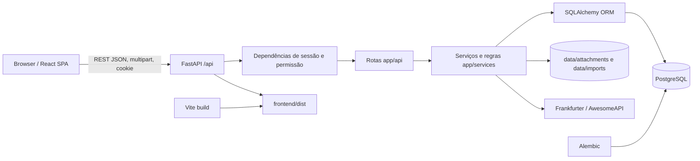

- **Frontend:** React 18 + TypeScript, React Router e cliente `fetch` central (`frontend/src/main.tsx`, `router.tsx`, `api.ts`). Estado é local por hooks/contextos; não há Redux. `AuthContext` e `FxRateContext` são estados globais.
- **Backend:** FastAPI reúne 18 routers em `app/main.py`. Rotas validam com Pydantic, injetam `Session` e usuário/permissão, chamam serviços e serializam respostas.
- **Persistência:** SQLAlchemy 2 e PostgreSQL (`app/database.py`, `app/models.py`); Alembic possui revisões `001`–`014`.
- **Arquivos:** anexos e imports são gravados nos caminhos configurados; metadados e hashes ficam no banco (`app/services/attachments.py`, `heroes_xlsx_import.py`).
- **Transações:** não existe Unit of Work central. Commits aparecem em rotas e serviços; `get_db` faz rollback em exceção (`app/database.py`). O commit Heroes contém rollback explícito (`app/services/heroes_xlsx_commit.py:591`, especialmente bloco próximo à linha 714).

<a id="sec-6"></a>
## 6. Desenho visual completo do sistema

Os diagramas representam o snapshot observado. Portas alternativas e condições externas são rotuladas; não constituem prova de implantação ativa.

<a id="sec-6-1"></a>
### 6.1 Topologia de implantação

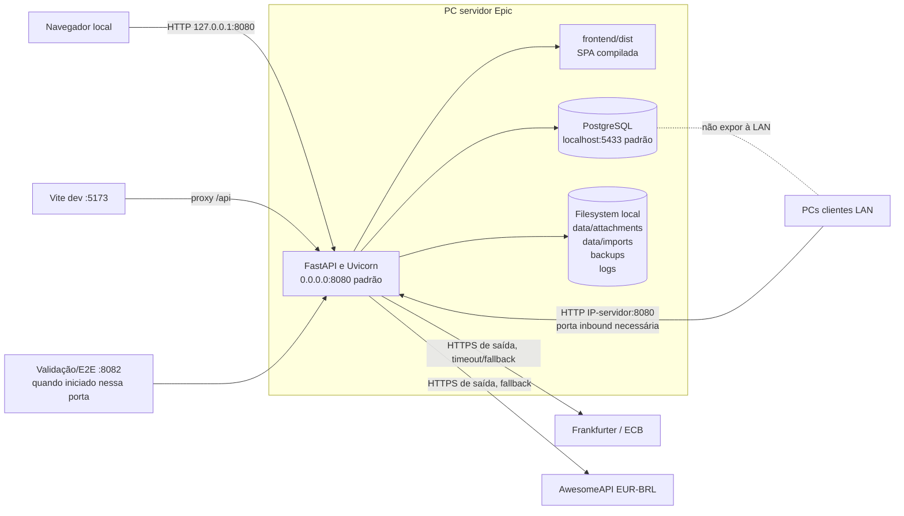

Limites confirmados: Uvicorn aceita LAN quando iniciado em `0.0.0.0`; PostgreSQL deve permanecer local conforme `start_server.bat`; firewall, IP fixo e acesso por outro PC não foram validados nesta auditoria.

<a id="sec-6-2"></a>
### 6.2 Mapa de módulos

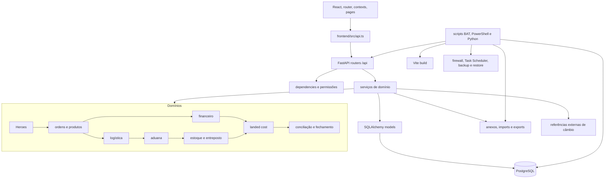

<a id="sec-6-3"></a>
### 6.3 Mapa de navegação da UI

```mermaid
flowchart TD
  LOGIN[/login/] --> ROOT[AppShell protegido]
  ROOT --> DASH[/ dashboard]
  ROOT --> ORDERS[/importacoes]
  ORDERS --> ORDER[/importacoes/:id]
  ORDER --> RES[resumo]
  ORDER --> ITEMS[itens]
  ORDER --> INV[invoices]
  ORDER --> OFIN[financeiro]
  ORDER --> DOC[documentos]
  ORDER --> LOG[logistica]
  ORDER --> CUS[aduaneiro]
  ORDER --> REC[conciliacao]
  ORDER --> HIST[historico]
  ROOT --> GFIN[/financeiro]
  ROOT --> GDOC[/documentos]
  ROOT --> DEMO[/demo]
  ROOT --> CAD[/cadastros]
  CAD --> PROD[produtos]
  CAD --> DRAFT[produtos-pendentes]
  PROD --> PDET[produtos/:productId]
  CAD --> SUP[fornecedores]
  CAD --> USERS[usuarios]
  CAD --> HERO[heroes]
  CAD --> CLEAN[limpeza]
  CAD --> REVIEW[revisao]
  CAD --> GLOSS[glossario]
  ROOT --> REDIR[aliases /skus, /heroes, /revisao]
```

<a id="sec-6-4"></a>
### 6.4 Ciclo de vida da ordem

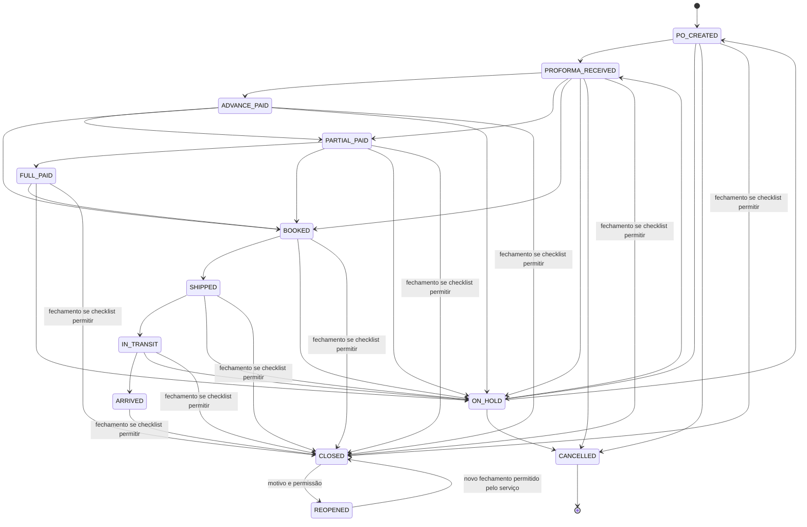

As transições ordinárias vêm de `app/core/enums.py:45-56` e `app/services/status.py:17-36`. `CLOSED` e `REOPENED` são controlados separadamente em `app/services/closure.py:36-37, 167-336`; o serviço de fechamento valida checklist, não restringe o status de origem a uma lista única.

<a id="sec-6-5"></a>
### 6.5 Matriz perfil × módulo × ação

A matriz deriva de `ROLE_PERMISSIONS` em `app/core/permissions.py:35-122` e das dependencies documentadas endpoint a endpoint. “Cancelar” exige a permissão de escrita usada pela rota; não existe uma permissão global de cancelamento. Scripts de restore não chamam a API e não aplicam `ROLE_PERMISSIONS`.

| Perfil | Módulo | Visualizar | Criar/editar | Aprovar | Cancelar | Fechar | Reabrir | Ações administrativas |
|---|---|---|---|---|---|---|---|---|
| admin | todos | sim | sim | sim | sim | sim | sim | migrations/demo/purge e permissões críticas; restore existe como constante, mas script é externo à API |
| gestor | usuários | sim | não | não | não | não aplicável | não aplicável | não |
| gestor | ordens, produtos e fornecedores | sim | sim | por `importation:write` quando a rota usa essa guarda | sim | sim | sim | não executa migration/restore |
| gestor | Heroes e documentos | sim | sim | sim, `imports:approve` | conforme rota de escrita | não aplicável | não aplicável | não |
| gestor | financeiro | sim | sim | pagamento sem comprovante e mudança de câmbio | sim, via `finance:write` | não aplicável | não aplicável | não |
| gestor | logística, aduana, estoque e landed cost | sim | sim | mudança modal e aprovações da rota | conforme rota de escrita | não aplicável | não aplicável | não |
| financeiro | ordens | sim | não | não | não | não | não | não |
| financeiro | financeiro | sim | sim | câmbio e pagamento sem comprovante | sim, via `finance:write` | não | não | não |
| financeiro | aduana, estoque e landed cost | somente leitura | não | não | não | não | não | não |
| operador | ordens, documentos, imports, aduana, estoque e landed cost | somente leitura | não | não | não | não | não | não |
| operador | financeiro, logística e usuários administrativos | não, salvo `users:read` para consulta de usuários | não | não | não | não | não | não |
| comprador | ordens, produtos e fornecedores | sim | sim | ações protegidas apenas por `importation:write` | sim | não | não | não |
| comprador | documentos e imports | sim | sim | não possui `imports:approve` | conforme escrita disponível | não | não | não |
| comprador | financeiro, logística, aduana, estoque e landed cost | não | não | não | não | não | não | não |
| logistica | ordens | sim | não | não | não | não | não | não |
| logistica | logística | sim | sim | mudança modal | conforme endpoints disponíveis | não | não | não |
| logistica | aduana e estoque | sim | sim | aprovações protegidas pelas permissões de escrita correspondentes | conforme rota | não | não | não |
| logistica | documentos | somente leitura | não | não | não | não | não | não |
| logistica | financeiro e landed cost | não | não | não | não | não | não | não |

Limitação: a UI não é a autoridade final; a decisão efetiva ocorre em `require_permission()` (`app/dependencies.py:31-42`). Algumas rotas usam permissão genérica de escrita do domínio, razão pela qual a granularidade permanece parcial conforme F2-005.

<a id="sec-7"></a>
## 7. Estrutura de diretórios

| Caminho | Responsabilidade confirmada |
|---|---|
| `app/main.py` | composição FastAPI, lifespan, routers e entrega da SPA |
| `app/api/` | controllers REST por domínio |
| `app/services/` | regras, consultas, importação, cálculo e persistência |
| `app/core/` | enums, permissões, segurança, parsing e moeda |
| `app/models.py` | 44 mapeamentos ORM |
| `app/schemas*.py` | contratos Pydantic por domínio |
| `alembic/versions/` | evolução do esquema `001` a `014` |
| `frontend/src/pages/` | páginas e fluxos de UI |
| `frontend/src/components/` | componentes reutilizáveis e design system local |
| `frontend/src/api.ts` | tipos e métodos HTTP do frontend |
| `frontend/e2e/` | Playwright com setup autenticado e seed |
| `tests/` | 326 testes pytest coletados e fixtures reais/sintéticas |
| `scripts/` | start, validação, demo, backup, restore, reset e diagnósticos |
| `data/`, `backups/`, `logs/` | dados operacionais locais; conteúdo não é parte da arquitetura de código |
| `mock-*.html` e documentos de blueprint/relatórios | referências históricas; não são pontos de entrada da aplicação atual |

<a id="sec-8"></a>
## 8. Tecnologias e dependências

Versões declaradas: Python/FastAPI `>=0.115`, Uvicorn `>=0.32`, SQLAlchemy `>=2.0.36`, Alembic `>=1.14`, PostgreSQL/psycopg2 `>=2.9.10`, Pydantic `>=2.10`, openpyxl `>=3.1.5`, bcrypt `>=4.2`, httpx `>=0.28`, pytest `>=8.3` (`requirements.txt`). Instalado e observado: Python 3.10.11, FastAPI 0.138.0, SQLAlchemy 2.0.51, Alembic 1.18.4, Pydantic 2.13.4, openpyxl 3.1.5 e pytest 9.1.1.

Frontend declarado: React/React DOM `^18.3.1`, React Router `^6.30.4`, TypeScript `~5.6.3`, Vite `^5.4.11`, Vitest `^2.1.9`, Playwright `^1.49.1` (`frontend/package.json`). Ambiente observado: Node 22.18.0 e npm 11.6.2. Lockfile não foi usado para afirmar as versões efetivamente resolvidas: **não confirmado**.

Serviços externos confirmados: PostgreSQL; Frankfurter e AwesomeAPI como fontes sucessivas de EUR/BRL (`app/services/fx_reference.py:11`). Não há serviço de e-mail, nuvem ou SSO implementado.

<a id="sec-9"></a>
## 9. Configuração e ambiente

Parâmetros em `.env.example`/`app/config.py`: `APP_NAME`, `APP_ENV`, `SECRET_KEY`, `HOST`, `PORT`, `DATABASE_URL`, `ATTACHMENTS_PATH`, `IMPORTS_PATH`, `BACKUPS_DB_PATH`, `BACKUPS_ATTACHMENTS_PATH`, `LOGS_PATH`, `SESSION_COOKIE_NAME`, `SESSION_MAX_AGE_SECONDS`, `SEED_ADMIN_EMAIL`, `SEED_ADMIN_PASSWORD`, `SEED_ADMIN_NAME`. Extras observados: `SQL_ECHO`, `TEST_DATABASE_URL`, `E2E_BASE_URL`, `RESET_EPIC_TEST_DATA`.

O `.env` real foi identificado, mas seus valores não são reproduzidos para não revelar segredos. Diretórios runtime são criados no lifespan (`config.ensure_runtime_dirs`). O primeiro start executa `run_initial_seed` e cria papéis, reason codes e admin se ausentes (`main.py`, `services/seed.py`). Backup usa `pg_dump`; restore usa utilitários PostgreSQL (`scripts/backup-db.ps1`, `restore.ps1`). Agendamento Windows está em `register-backup-task.ps1`.

<a id="sec-10"></a>
## 10. Frontend e interface do usuário

O CSS global e os componentes locais (`frontend/src/index.css`, `components/*`) implementam cards, tabelas, badges, botões, toast, estados vazios e carregamento. Formulários usam estado React e validação HTML/condicional; erros HTTP são transformados por `request()` em `frontend/src/api.ts`. Há fallbacks frequentes `.catch(() => [])`, `.catch(() => undefined)` e exibição `—`, que evitam quebra visual, mas podem ocultar indisponibilidade parcial.

| Tela | Rota | Arquivo principal | Componentes | APIs utilizadas | Função de negócio |
|---|---|---|---|---|---|
| Login | `/login` | `frontend/src/LoginPage.tsx` | `AuthContext` | `POST /api/auth/login`, `GET /auth/me` | abrir sessão |
| Dashboard | `/` | `pages/DashboardPage.tsx` | widgets em `pages/dashboard/widgets/` | `/dashboard/summary`, `/dashboard/importations` | visão executiva e pendências |
| Ordens | `/importacoes` | `pages/ImportationsPage.tsx` | `NovaOrdemModal`, tabela editável | `/importations/order-queue`, dashboard fallback, create/cancel/brazil-fields | fila operacional |
| Central/resumo | `/importacoes/:id/resumo` | `importation/OrderCentralOverview.tsx` | header, rail, hub | order-central, documentos, timeline, pagamentos, faturas | visão consolidada da PO |
| Faturas | `/importacoes/:id/invoices` | `ImportationSectionPage.tsx` | formulário/lista | invoices e payments | faturamento e vencimentos |
| Itens | `/importacoes/:id/itens` | `OrderCentralItemsSection.tsx` | grid/modelos, combobox | items, products, update mapping | quantidades, SKU, preço e categoria |
| Financeiro da ordem | `/importacoes/:id/financeiro` | `ImportationFinanceSection.tsx` | painéis financeiros | finance summary/payments/discounts/credits/accounts/expenses | liquidação e ajustes |
| Documentos da ordem | `/importacoes/:id/documentos` | `ImportationSectionPage.tsx` | `DocumentsPage`/upload | documents list/upload/download | evidências versionadas |
| Logística | `/importacoes/:id/logistica` | `logistics/LogisticsWorkflowPage.tsx` | rail e seções Shipment/Transit/Customs/Entreposto/Nationalization/Stock | shipments, customs, stock, landed-cost | cadeia física completa |
| Aduaneiro | `/importacoes/:id/aduaneiro` | `ImportationSectionPage.tsx` | seção logística correspondente | customs documents/taxes | DI/DUIMP e tributos |
| Conciliação | `/importacoes/:id/conciliacao` | `ReconciliationClosurePanel.tsx` | checklist/timeline | reconciliation e closure | validar e fechar ordem |
| Histórico | `/importacoes/:id/historico` | `ImportationSectionPage.tsx` | timeline | closure timeline | rastreabilidade |
| Financeiro global | `/financeiro` | `pages/FinancePage.tsx` | `finance/FinancePanels.tsx`, `FxPnlPanel` | payables queue e finance APIs | contas a pagar e PnL |
| Produtos | `/cadastros/produtos` | `pages/ProductsPage.tsx` | picker, bulk bar/modal, quick drawer/import modal | products catalog/groups/import/bulk/export | catálogo mestre |
| Produto | `/cadastros/produtos/:productId` | `products/ProductDetailPage.tsx` | 9 abas em `ProductDetailTabs/` | detail/orders/audit/cost/documents/suppliers | ficha completa |
| Produtos pendentes | `/cadastros/produtos-pendentes` | `products/PendingProductsPage.tsx` | `DraftCompleteDrawer` | products draft/complete/link | resolver rascunhos Heroes |
| Fornecedores | `/cadastros/fornecedores` | `SuppliersPage.tsx` | `SupplierDetailDrawer` | suppliers CRUD lógico | cadastro de parceiros |
| Usuários | `/cadastros/usuarios` | `users/UsersPage.tsx` | `UserDetailDrawer` | users/roles/reason-codes | administração de acesso |
| Importar Heroes | `/cadastros/heroes` | `HeroesUploadPage.tsx` | step 4, triagem, revisão financeira | imports heroes XLSX/CSV | ingestão legada |
| Revisão | `/cadastros/revisao` | `ReviewQueuePage.tsx` | triagem e produto | review-queue/resolve/create-draft | resolver ambiguidades |
| Limpeza | `/cadastros/limpeza` | `CleanupPage.tsx` | confirmações | cancelled-summary/purge | expurgo controlado |
| Glossário | `/cadastros/glossario` | `GlossaryPage.tsx` | dados `i18n/glossario.ts` | nenhuma | explicar termos |
| Demo | `/demo` | `DemoGuidePage.tsx` | cenários | importations e `POST /demo/seed` | criar massa demonstrativa |
| Documentos global | `/documentos` | `DocumentsPage.tsx` | upload/lista | documents/importations | anexos por ordem |

Compatibilidade: `/skus`, `/revisao` e `/heroes` redirecionam para novas rotas (`frontend/src/router.tsx`). `LogisticsPanel.tsx` e `CustomsStockPanel.tsx` existem, mas o roteamento atual usa o workflow consolidado; uso direto é **aparentemente legado**. O ícone de notificações é apenas placeholder (`AppShell.tsx:126`). Preferências de colunas de produto ficam em `localStorage` por usuário (`productColumnPrefs.ts`).

### 10.1 Inventário operacional detalhado das telas

As permissões abaixo são as exigidas pelas APIs; o router protege autenticação globalmente, mas nem toda página oculta previamente cada ação sem permissão. Em alguns casos o bloqueio definitivo ocorre como 403 no backend.

| Tela/rota | Componentes e campos/colunas | Filtros e ações | Validações e estados | APIs | Permissão e pós-ação |
|---|---|---|---|---|---|
| Login `/login` | `LoginPage`; e-mail, senha | Entrar | loading do contexto; erro HTTP visível | auth login/me | pública; sucesso redireciona a `/` |
| Dashboard `/` | `DashboardPage`, filtros e widgets de estágio, vencidos, saldos, trânsito, LC, timeline | busca/filtros, personalizar, abrir ordem | loading, erro com retry, ausência como travessão | dashboard summary/importations | `importation:read`; clique navega ao bloco |
| Ordens `/importacoes` | `ImportationsPage`; PO, fornecedor, status, prioridade, responsável, previsão, notas, qty, faturas e saldos | busca, status/prioridade, sort, inline edit, nova/cancelar/exportar | spinner, fallback dashboard, vazio, toast/erro | order-queue, dashboard fallback, create, brazil-fields, cancel | read/write; recarrega grade ou atualiza linha |
| Central `/importacoes/:id/resumo` | `ImportationLayout`, `OrderCentralOverview`; rail, KPIs, faturas, pagamentos, DA SPEDIRE, modelos, docs, timeline | transição, liquidar, upload, overrides, edição Brasil | loading/error geral; fallbacks locais; ações desabilitadas em lock | order-central, order/items, invoices, finance, docs, timeline | permissões por API; recarrega central |
| Itens `.../itens` | `OrderCentralItemsSection`, grid; SKU, categoria, descrição, qty, listino/fattura, desconto | filtrar, mapear SKU, editar/adicionar | Heroes bloqueia campos manuais; produto draft sinalizado; vazio/erro | items, product list/update | importation write; refresh do contexto |
| Faturas `.../invoices` | `InvoicesSection`; tipo, número, data, valor, moeda | criar/listar | valor pode ser vazio; erro de schema/lock | invoices list/create/items | importation R/W; lista recarregada |
| Financeiro da ordem `.../financeiro` | `ImportationFinanceSection` e painéis; pagamentos, descontos, créditos, contas, despesas | criar/liquidar/aplicar/filtrar | valores e evidências; loading por painel; erros locais | finance e invoices | finance R/W; painéis recarregam |
| Documentos `.../documentos` e `/documentos` | `DocumentsPage`; arquivo, ordem, tipo e lista | selecionar ordem, upload/download | arquivo obrigatório; empty/list/error | documents + importations | documents R/W; upload recarrega versões |
| Logística `.../logistica` | `LogisticsWorkflowPage`, rail e 7 seções; shipment, datas, modal, docs, taxes, qty | criar/editar shipment, modal, entreposto, nacionalizar, estoque, LC | loading agregado; limites quantitativos e erros por seção | shipments/customs/stock/LC | permissões logistics/customs/stock/LC; `reload()` |
| Aduaneiro `.../aduaneiro` | mesma fonte logística, DI/DUIMP e impostos | staging, aprovar, tributo | documento/evidência obrigatórios | customs docs/taxes | customs R/W; recarrega |
| Conciliação `.../conciliacao` | `ReconciliationClosurePanel`; pares, checklist, histórico, timeline | executar, aprovar, fechar, reabrir | loading, reason code/justificativa, bloqueios clicáveis | reconciliation, closure, reason codes | importation write/close/reopen; reload integral |
| Histórico `.../historico` | timeline humanizada | navegar por eventos | vazio e erro | closure timeline | importation read |
| Financeiro global `/financeiro` | `FinancePage`, `FinancePanels`; KPIs, accordion por ordem/fatura/pagamento | filtro de status, taxa prevista, liquidar e CRUD financeiro | loading, vazio, erro; BRL estimado rotulado | payables, FX, finance CRUD | finance R/W; refetch |
| Produtos `/cadastros/produtos` | catálogo; SKU, nome, grupo/subgrupo, tamanho, cor, NCM, fornecedor, qty e custo | busca, chips, visibilidade, grupo, sort, colunas, bulk, import/export | loading/error/empty; eligibility em lote | products catalog/groups/bulk/import/export | importation R/W; refresh e toast |
| Produto `.../produtos/:productId` | detalhe em abas consolidadas; identificação/comercial, fiscal/logística, fornecedor, ordens/custos, fotos/audit | salvar, arquivar/restaurar/anular, upload | readiness, motivo NCM/arquivo, loading/error | product detail/update/actions/orders/cost/audit/docs | importation/documents R/W; refetch |
| Rascunhos `/cadastros/produtos-pendentes` | lista/drawer; SKU draft, descrição, origem, referências | completar ou vincular | seleção obrigatória; vazio/error | draft/list/complete/link | importation R/W; remove resolvido |
| Heroes `/cadastros/heroes` | stepper; arquivo, sheet, ordem confirmada, categorias, revisão SKU/financeira | localizar/upload/profile/preview/resolver/export/commit | loading por etapa, warnings/errors, confirmações e bloqueio SKU | todos `imports/heroes*` | imports read/write/approve; sucesso abre ordem |
| Revisão `/cadastros/revisao` | queue; raw row, motivo, prioridade, candidatos/aliases | filtrar, resolver SKU, criar draft | loading/error/empty e produto obrigatório | review queue/products/resolve/draft | imports read/approve; remove item resolvido |
| Fornecedores `/cadastros/fornecedores` | lista/drawer; nome, país, fiscal, contato, moeda | criar/editar/anular | nome obrigatório, erro/vazio | suppliers CRUD | importation R/W; refetch |
| Usuários `/cadastros/usuarios` | lista/drawer; nome, e-mail, papel, senha, status | visibilidade, criar/editar/reset/anular | e-mail/senha/papel/motivo; último admin; loading/error | users/roles | users R/W; refetch |
| Limpeza `/cadastros/limpeza` | resumos e seleções canceladas | purge seletivo/órfãos/todos | confirmação forte e env gate; loading/error | cancelled-summary/purge | admin run migration; refetch |
| Demo `/demo` | guia de cenários | seed/abrir ordem | loading/error | demo seed/importations | admin run migration; refetch |

<a id="sec-11"></a>
## 11. Backend e APIs

Todas as rotas abaixo têm prefixo `/api`. “R” e “W” significam a permissão indicada em `app/core/permissions.py`; login e health são públicos, logout/me exigem sessão.

| Método | Endpoint | Arquivo | Entrada | Saída | Regra de negócio | Permissão |
|---|---|---|---|---|---|---|
| POST/GET | `/auth/login`, `/auth/logout`, `/auth/me` | `api/auth.py` | credenciais/cookie | usuário/mensagem | bcrypt, token hash, expiração/revogação | público/sessão |
| GET/POST/PATCH | `/users`, `/users/{id}`, `/users/{id}/cancel`, `/users/roles`, `/users/reason-codes` | `api/users.py` | schemas de usuário | usuário/papéis | último admin, sessões, auditoria | `users:read/write` |
| GET/POST/PATCH | `/suppliers[/{id}]`, `/{id}/cancel` | `api/suppliers.py` | `SupplierCreate/Update`, motivo | fornecedor | soft delete | `importation:read/write` |
| GET/POST/PATCH | `/products`, `/products/{id}`, `/catalog`, `/groups`, `/draft`, `/{id}/detail`, `/{id}/orders`, `/{id}/audit`, `/{id}/cost-history`, `/{id}/readiness` | `api/products.py` | filtros/schemas | produto/listas | prontidão, uso e histórico | `importation:read/write` |
| POST | `/products/import/preview`, `/products/import/commit`, `/bulk/archive`, `/bulk/restore`, `/bulk/status`, `/bulk/cancel`, `/{id}/complete`, `/{id}/link`, `/{id}/archive`, `/{id}/restore`, `/{id}/cancel` | `api/products.py` | arquivo/IDs/confirmação | preview/resultado | validação, rascunho, lifecycle | `importation:write` |
| GET/POST/PATCH | `/importations`, `/order-queue`, `/{id}`, `/{id}/items`, `/{id}/order-central`, `/{id}/brazil-fields` | `api/importations.py` | PO/itens/filtros | ordem/central | unicidade, prontidão, auditoria | `importation:read/write` |
| POST | `/importations/{id}/transition`, `/importations/{id}/cancel`, `/importations/{id}/italy-overrides`, `/importations/{id}/link-heroes-raw` | `api/importations.py` | status/motivo/anexo/raw | ordem/override/run | transição, lock, supersessão | `importation:write` |
| GET/POST | `/importations/{id}/heroes-import/preview`, `/importations/{id}/heroes-import/commit` | `api/importations.py` | confirmações/overrides | preview/commit | merge em ordem existente | R/W |
| GET/POST/PATCH | `/invoices`, `/invoices/{id}`, `/{id}/items`, `/{id}/cancel` | `api/invoices.py` | `InvoiceCreate/Update` | fatura/itens | valores opcionais, saldo, histórico | R/W importação |
| GET/POST/PATCH | `/finance/payments`, `/exchange-rates`, `/discounts`, `/credits`, `/brazil-accounts`, `/expenses` | `api/finance.py` | schemas financeiros | registros/resumos | liquidação, crédito, evidência | `finance:read/write` (expenses GET usa importation read) |
| GET | `/finance/payables-queue`, `/fx-reference`, `/fx-pnl/summary`, `/importations/{id}/fx-pnl`, `/importations/{id}/summary` | `api/finance.py` | filtros | KPIs/blocos | exposição e PnL | finance/importation read |
| GET/POST | `/documents`, `/upload`, `/{id}/download`, `/key/{key}/versions` | `api/documents.py` | multipart/metadados | documento/arquivo | hash, versão corrente | `documents:read/write` |
| GET/POST/PATCH | `/imports/mappings`, `/heroes/upload`, `/heroes/xlsx/*`, `/raw`, `/staging`, `/review-queue`, `/staging/{id}/*` | `api/imports.py` | arquivos, run, overrides | profiling/preview/run | pipeline Heroes e triagem | `imports:read/write/approve` |
| POST/GET | `/imports/reset-operational`, `/cancelled-summary`, `/purge-cancelled` | `api/imports.py` | flags/IDs | contagens | exige variável de ambiente | migration/admin ou imports read |
| GET/POST/PATCH | `/shipments`, `/{id}`, `/{id}/items`, `/{id}/change-modal`, `/{id}/modal-history`, `/importations/{id}/quantity-summary` | `api/shipments.py` | embarque/itens/motivo | embarque/resumo | limite e histórico modal | `logistics:read/write` |
| GET/POST | `/customs/documents`, `/documents/{id}/approve`, `/taxes` | `api/customs.py` | DI/DUIMP/imposto | documento/tributo | staging → official | `customs:read/write` |
| GET/POST | `/stock/nationalizations`, `/entries`, `/entreposto-movements`, `/discrepancies`, `/importations/{id}/quantity-chain` | `api/stock.py` | quantidades/motivos | eventos/cadeia | não exceder etapa anterior | `stock:read/write` |
| GET/POST | `/landed-cost/importations/{id}/versions`, `/versions` | `api/landed_cost.py` | tipo/rateio | versão/componentes | versionamento e alocação | `landed_cost:read/write` |
| GET/POST | `/reconciliation/importations/{id}`, `/run`, `/{id}/approve` | `api/reconciliation.py` | justificativa | divergências | tolerâncias/aprovação | importation R/W |
| GET/POST | `/closure/importations/{id}/checklist`, `/closure/importations/{id}/close`, `/closure/importations/{id}/reopen`, `/closure/importations/{id}/history`, `/closure/importations/{id}/timeline` | `api/closure.py` | versão/motivo | checklist/closure | bloqueios, snapshot, lock | read/close/reopen |
| GET | `/dashboard/summary`, `/dashboard/importations` | `api/dashboard.py` | limite | KPIs/ordens | agregação real | `importation:read` |
| POST | `/demo/seed` | `api/demo.py` | nenhum | mensagem | seed idempotente pretendido | `admin:run_migration` |
| GET | `/health` | `api/health.py` | nenhum | app/database/time | `SELECT 1` | público |

Schemas ficam em `app/schemas.py`, `schemas_import.py`, `schemas_docs.py`, `schemas_dashboard.py`, `schemas_order_central.py`, `schemas_phase789.py` e `schemas_phase101112.py`. Erros de domínio são convertidos em HTTP 400/404/409 nas rotas; o comportamento exato por endpoint deve ser consultado no decorator/função citado. Não há middleware global customizado de erro. Logs de negócio são entidades ORM, não logging estruturado global.

Consulte o [Apêndice A](#apendice-a) para o inventário endpoint a endpoint.

<a id="sec-12"></a>
## 12. Banco de dados

PostgreSQL é obrigatório na configuração observada (`DATABASE_URL`, `app/database.py`). A conexão usa `pool_pre_ping`; SQL é ecoado somente em development com `SQL_ECHO=1`. Migrações: `001_initial_schema.py`; `002_importation_finance.py`; `003_documents_logistics.py`; `004_customs_stock_landed_cost.py`; `005_reconciliation_closure.py`; `006_payment_due_date.py`; `007_product_category_heroes_xlsx.py`; `008_normalize_usd_to_eur.py`; `009_heroes_legacy_dispatch.py`; `010_order_operational_fields.py`; `011_product_master_fields.py`; `012_entreposto.py`; `013_entreposto_soft_delete.py`; `014_product_size_color.py`. A revisão `014` está não rastreada no Git, mas presente no workspace.

Principais grupos de tabelas (colunas completas em `app/models.py`):

- acesso/auditoria: `roles`, `users`, `user_sessions`, `reason_codes`, `audit_log`, `technical_log`, `status_transition_log`;
- mestre/importação: `suppliers`, `products`, `importation_orders`, `importation_items`;
- financeiro: `invoices`, `invoice_items`, `payments`, `exchange_rates`, `discounts`, `credits`, `credit_usages`, `brazil_current_accounts`, `expenses`;
- documentos/Heroes: `document_attachments`, `raw_import_files`, `staging_import_rows`, `review_queue`, `heroes_import_mappings`, `heroes_import_runs`, `heroes_legacy_sheet_summaries`, `heroes_dispatch_pending_items`;
- logística/custos: `shipments`, `shipment_items`, `modal_change_log`, `customs_documents`, `taxes`, `nationalizations`, `nationalization_items`, `stock_entries`, `entreposto_movements`, `quantity_discrepancies`, `landed_cost_versions`, `landed_cost_components`, `landed_cost_sku_allocations`, `landed_cost_variances`;
- controle final: `reconciliations`, `importation_closures`.

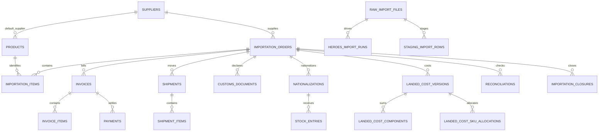

Chaves únicas confirmadas incluem `roles.name`, `users.email`, `user_sessions.token_hash`, `reason_codes.code`, `products.sku_code`, `importation_orders.po_number` e `heroes_import_runs.idempotency_key`. A maioria das remoções é lógica via `is_active/cancelled_at`; constraints de quantidade e regras cruzadas são principalmente de serviço, não CHECKs SQL.

<a id="sec-12-erd"></a>
### ERD completo por domínio

Os diagramas abaixo complementam o dicionário existente. Eles mostram FKs confirmadas nos modelos/migrations e permanecem separados para legibilidade.

#### Autenticação e auditoria

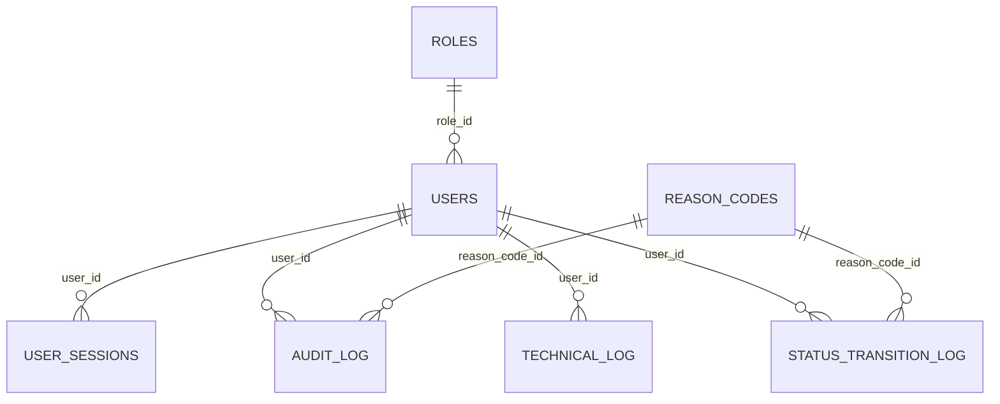

#### Importações e produtos

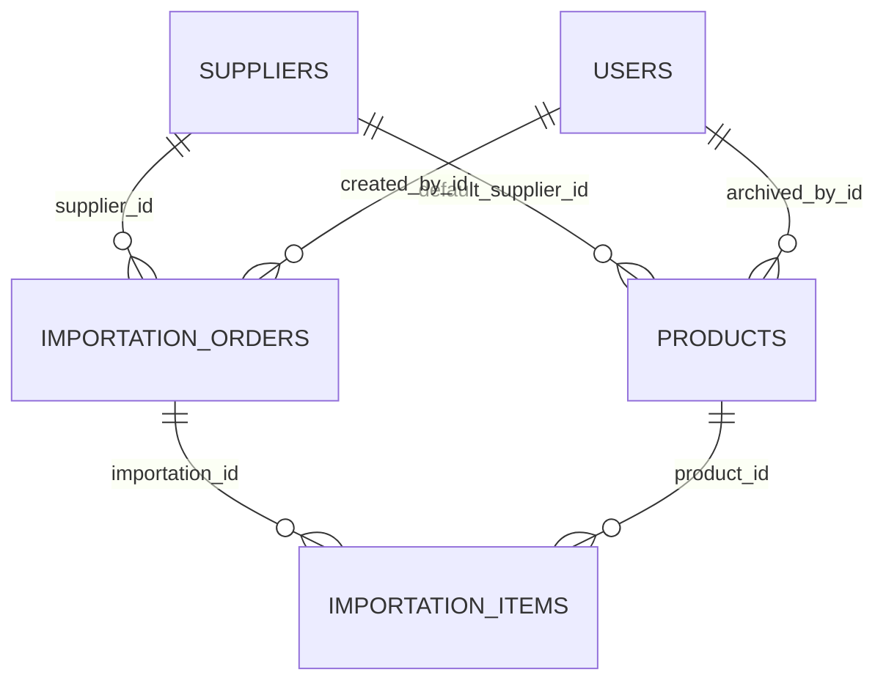

#### Financeiro

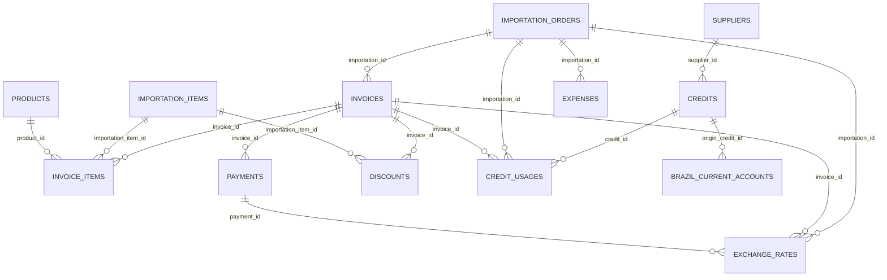

#### ERD — Heroes

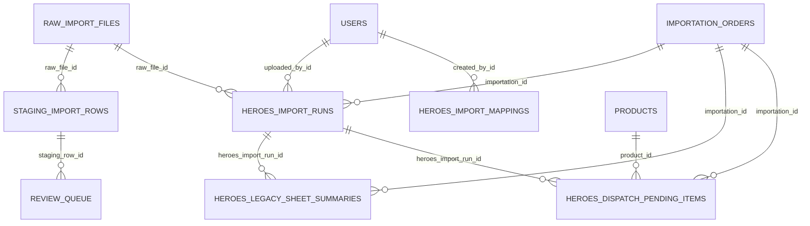

#### Logística e aduana

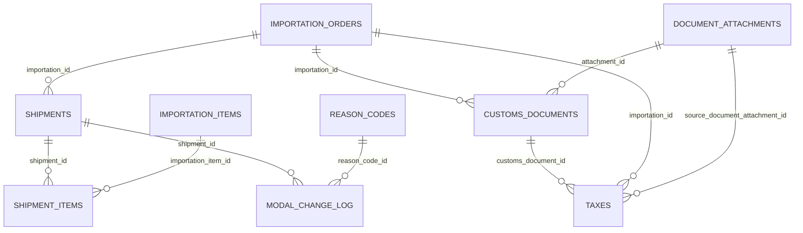

#### Estoque e entreposto

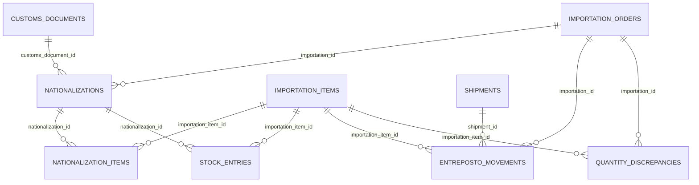

#### ERD — Landed cost

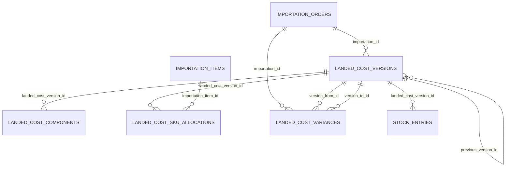

#### Conciliação e fechamento

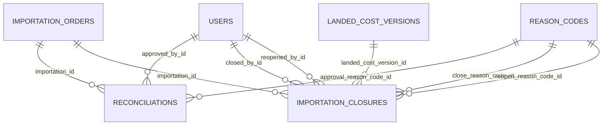

Consulte o [Apêndice B](#apendice-b) para o dicionário completo de entidades ORM.

<a id="sec-13"></a>
## 13. Mapa de módulos e dependências internas

### Runtime, núcleo e routers

| Módulo/arquivo | Responsabilidade | Entradas | Saídas | Dependências chamadas | Chamado por | Efeitos colaterais | Transação/commit | Logs/auditoria | Testes relacionados |
|---|---|---|---|---|---|---|---|---|---|
| `app/main.py` | compor app, routers, lifespan e SPA | settings, startup HTTP | aplicação ASGI/arquivos | config, database, seed, routers | Uvicorn/scripts | cria dirs e seed inicial | seed controla commits | seed/audit | health, auth, rotas |
| `app/config.py` | carregar `.env` e paths | ambiente/.env | `Settings` cacheado | pydantic-settings, filesystem | app e serviços | `ensure_runtime_dirs` cria diretórios | não aplicável | nenhum | testes de configuração indiretos |
| `app/database.py` | engine, sessions e dependency DB | `DATABASE_URL` | `engine`, `SessionLocal`, `get_db` | SQLAlchemy | routers, serviços, CLIs | conexão; rollback em exceção | rollback automático; commit explícito nos serviços/rotas | SQL opcional via `SQL_ECHO=1` | `tests/conftest.py` e suíte backend |
| `app/dependencies.py` | sessão atual e autorização | cookie/request, permissão | User ou HTTP 401/403 | auth service, permissions, DB | routers | consulta sessão | somente leitura | falhas HTTP; login técnico no serviço | auth/permissions |
| `app/core/permissions.py` | constantes e matriz de papéis | role permissions | decisão booleana | nenhuma | dependencies, routers, seed | nenhum | não | não | `tests/test_permissions.py` |
| `app/core/enums.py` | enums, estados, docs e tolerâncias | constantes | contratos de domínio | nenhuma | schemas, serviços e routers | nenhum | não | não | testes de domínio |
| `app/core/security.py` | hash/verificação e token | senha/token | hashes/tokens | passlib/segredos | auth, seed/user admin | aleatoriedade de token | não | não | auth |
| `app/core/currency.py`, `parse.py`, `parse_it.py` | normalização monetária e parsing | strings/células | Decimal/datas/identificadores | stdlib | finance e Heroes | nenhum | não | não | parser/finance |
| `app/api/auth.py` | login/logout/me | schemas e cookie | User/mensagem/cookie | auth, DB | frontend AuthContext | cria/revoga sessão | commits no serviço/rota | login, falha e sessão | `tests/test_auth.py` |
| `app/api/users.py` | CRUD lógico de usuários/roles/reasons | schemas e IDs | usuários/listas | user_admin, auth | UsersPage/api.ts | usuário, sessões, audit | commits por operação | audit log | permissions/user admin |
| `app/api/suppliers.py` | CRUD lógico de fornecedores | schemas e IDs | fornecedores | models, auth | SuppliersPage | grava/cancela supplier | commit por mutação | audit | importations finance |
| `app/api/products.py` | catálogo, detalhe, import/bulk/draft | filtros, upload, schemas | produtos, arquivos, readiness | product_catalog/draft/import, auth | páginas de produtos | grava produtos; exporta arquivo | commit conforme ação | audit | product catalog/import/draft |
| `app/api/importations.py` | ordens, itens, transições, Heroes vinculado | PO, itens, overrides, IDs | ordem/central/preview | guards, lifecycle, status, order_central, Heroes | Central/ImportationsPage | grava ordens/itens/status | commits nas mutações | audit/status log | importations, Heroes, closure |
| `app/api/invoices.py` | CRUD lógico de invoices/itens | schemas, IDs | invoice com saldo | finance, auth | telas invoices/finance | grava/cancela invoices | commit por mutação | audit e FX | importations_finance |
| `app/api/finance.py` | pagamentos, câmbio, descontos, créditos, contas, despesas e resumos | schemas/filtros | registros/KPIs | finance, fx_pnl/reference, payables, customs | FinancePage/Central | grava domínio financeiro; consulta externa FX | commits por mutação | audit/technical conforme serviço | finance, FX, payables |
| `app/api/documents.py` | upload/list/download/versionar | multipart, metadados, IDs | attachment/arquivo | attachments | DocumentsPage | grava arquivo e metadado | commit no upload | audit | documents/attachments |
| `app/api/imports.py` | pipeline CSV/XLSX, staging, revisão e limpeza | arquivos, mappings, confirmação | profiles/runs/staging | família Heroes, reset/cleanup, product_draft | Heroes/Review/Cleanup | arquivos, staging, ordens, purge/reset | commits conforme endpoint | audit/technical via serviços | Heroes parser/staging/commit/reset |
| `app/api/shipments.py` | embarques, itens e modal | schemas/IDs | shipment/histórico | logistics | workflow logística | grava shipments/modal log | commit por mutação | audit | logistics |
| `app/api/customs.py` | documentos aduaneiros e impostos | schemas/IDs | customs/taxes | customs service | seção aduaneira | grava/aprova/taxa | commit por mutação | audit | customs_stock_landed |
| `app/api/stock.py` | nacionalização, estoque, entreposto e divergência | quantidades/IDs | eventos/cadeia | nationalization, entreposto | workflow logística | grava eventos físicos | commit por mutação | audit quando serviço implementa | stock/entreposto |
| `app/api/landed_cost.py` | listar/criar versões LC | tipo/componentes/rateio | versão LC | landed_cost | painel LC | grava versões/componentes | commit no serviço/rota | audit | landed cost |
| `app/api/reconciliation.py` | executar/listar/aprovar conciliações | ordem/justificativa | reconciliation rows | reconciliation | painel fechamento | upsert/aprovação | commit por ação | aprovação registrada | reconciliation/closure |
| `app/api/closure.py` | checklist, fechar, reabrir, history/timeline | ordem, razão, versão | closure/status/timeline | closure | painel fechamento | lock/snapshot/reopen | commit no serviço | audit e status log | closure |
| `app/api/dashboard.py`, `demo.py`, `health.py` | agregados, seed demo e saúde | filtros ou nenhum | KPIs/mensagem/health | dashboard, demo_seed, DB | Dashboard/Demo/monitor | demo grava massa; health consulta DB | demo commita | seed/audit conforme serviços | dashboard/demo/health |

### Serviços de domínio

| Módulo/arquivo | Responsabilidade | Entradas | Saídas | Dependências chamadas | Chamado por | Efeitos colaterais | Transação/commit | Logs/auditoria | Testes relacionados |
|---|---|---|---|---|---|---|---|---|---|
| `app/services/auth.py`, `user_admin.py` | autenticação, sessões, audit e invariantes de admin | credenciais/User | sessão/logs/User | models, security | auth/users/dependencies/seed | grava sessão, audit, technical log | commits conforme chamador | entidades de log | auth/permissions/users |
| `attachments.py` | persistir/versionar anexos e backup ZIP | upload/entity/document key | attachment/path/listas | models, auth, filesystem | documents router | escreve/copia arquivos e metadados | commit de metadado | audit | documents/backup attachments |
| `status.py` | validar/transicionar ordem e documentos | status, ordem, usuário | ImportationOrder | enums, models, auth | importations router | status e transition log | commit interno/fluxo | status log/audit | status transitions |
| `importation_guard.py`, `importation_lifecycle.py` | lock, campos manuais, cancelamento e supersessão Heroes | order/run | decisão/objetos mutados | models | importations, Heroes commit | libera PO e muda runs | commit pelo chamador | não direto | lifecycle/locks |
| `italy_override.py` | aplicar override de campo italiano | ordem/campo/motivo | override | models, auth | importations router | altera dado e audit | commit pelo chamador | audit | importation updates |
| `order_central.py`, `order_status_rail.py` | montar visão consolidada e rail | importation_id | dict/response central | finance, dashboard, stock, FX, Heroes, products | importations API | consulta externa FX por dependência possível | predominantemente leitura | sem audit | order central e utilitários UI |
| `finance.py` | saldos, pagamentos, câmbio e resumo | invoice/payment/order | Decimal/resumos/records | models, auth, fx_pnl | finance/invoices/dashboard/reconciliation | grava exchange/audit em funções de mutação | algumas funções commitam; outras pelo chamador | audit | importations_finance, due date, BRL |
| `finance_display.py`, `finance_payables_queue.py` | converter/exibir e montar fila global | payments/orders/rates | blocos/KPIs | finance, fx_pnl, order_central | finance API/dashboard | leitura | não | não | payables queue |
| `fx_pnl.py` | calcular PnL/exposição cambial | ordem/pagamentos/rates | PnL por ordem/agregado | models, finance_display | finance/order_central | leitura | não | não | `tests/test_fx_pnl.py` |
| `fx_reference.py` | buscar cotação EUR/BRL com fallback | nenhuma/HTTP | referência ou indisponível | httpx, Frankfurter, AwesomeAPI | finance/order_central | chamadas HTTPS externas | não | erro tratado/fallback | FX reference |
| `customs.py` | validar/gravar customs e tributos | documentos/tax/expense | models | auth | customs API/demo | grava official data/tax | commit conforme função/chamador | audit | customs_stock_landed |
| `logistics.py` | shipment, item, modal e limites | order/item/modal | shipment/log | auth, landed_cost | shipments/demo/stock | grava shipment/modal e pode criar LC revisado | commit nas operações | audit/modal log | logistics |
| `entreposto.py`, `nationalization.py` | saldos físicos, nacionalização e estoque | qty/events | eventos/cadeia | logistics, auth, models | stock/dashboard/closure | grava movimentos, discrepancies e stock | commit nas operações | audit parcial conforme funções | entreposto/customs_stock |
| `landed_cost.py` | componentes, rateio e versões | order, tipo, allocations | versão LC | models, auth | API/logistics/demo | grava versões/componentes/alocações | commit na criação | audit | landed cost |
| `reconciliation.py` | gerar/aprovar pares e bloqueios | importation/tolerâncias | reconciliations | finance, nationalization | API/closure/dashboard | upsert/aprovação | commit por run/approve | approval fields | reconciliation/closure |
| `closure.py` | checklist, snapshot, close/reopen e timeline | ordem, razão, usuário | closure/status/events | finance, stock, reconciliation, auth | closure API | lock, snapshot, versões e logs | commit nas ações | audit/status log | closure |
| `dashboard.py` | agregação executiva | filtros/DB | summary/importations | finance, stock, reconciliation | dashboard API | leitura | não | não | dashboard |
| `demo_seed.py` | criar 16 cenários demo coerentes | DB/user | contagem/massa | customs, LC, logistics, stock | demo API/seed | grava amplo conjunto de tabelas | commit no fluxo | dados demo/audit variável | demo seed |
| `product_catalog.py` | readiness, filtros, uso e bulk | filtros/Product | listas/flags/resultados | models, logistics, stock | products, Heroes match/draft/import | bulk altera lifecycle | commit conforme chamador | audit via router | product catalog |
| `product_draft.py` | criar/completar/vincular drafts | staging/product | Product/listas | aliases, catalog, Heroes staging | products/imports | grava produtos e vínculos | commit conforme função | notas de origem | product draft/Heroes |
| `product_import.py`, `product_name_normalize.py` | parse CSV/XLSX e normalizar produtos | arquivo/rows/DB | preview/resultados | catalog/models | products API/CLI | import e normalização atualizam produtos | commit na normalização/commit import | audit conforme API | product import/catalog |
| `product_category.py` | sugerir/rotular categoria | descrição | categoria/label | nenhuma | parser/draft/UI contracts | nenhum | não | não | parser/categories |
| `catalog_purge.py`, `importation_purge.py`, `cleanup_cancelled.py` | descobrir blockers e expurgar cancelados/órfãos | flags/IDs | contagens | models/reset | imports cleanup | DELETE físico em cascata controlada | commit pelo orquestrador | retorno de contagens | cleanup/reset |
| `reset_operational_data.py` | guard, backup e reset de massa operacional | env/DB/skip backup | contagens | subprocess, purge | API e CLIs reset | dump e DELETEs | commit após exclusões | console pelo chamador | reset operational |
| `seed.py`, `seed_data.py` | roles, reason codes e admin inicial | settings/DB | registros seed | models/security | lifespan | grava seeds; `seed_data.py` vazio | commits no seed | não confirmado | permissions/seed |

### Pipeline Heroes e frontend

| Módulo/arquivo | Responsabilidade | Entradas | Saídas | Dependências chamadas | Chamado por | Efeitos colaterais | Transação/commit | Logs/auditoria | Testes relacionados |
|---|---|---|---|---|---|---|---|---|---|
| `heroes_workbook_paths.py`, `heroes_workbook_profiler.py` | localizar e perfilar workbook | path/XLSX | path/report | parser, merged cells | imports API/CLI | leitura de arquivo | não | warnings no relatório | workbook profiler |
| `heroes_xlsx_parser.py`, `heroes_merged_cells.py` | ler sheets, datas, grids e merges | bytes/sheet | preview normalizado | openpyxl, categories, invoice/financial preview | profiler/import | leitura/CPU | não | warnings no payload | Heroes parser |
| `heroes_xlsx_import.py` | registrar raw/run, profile e link | arquivo/local path/order | run/profile | auth, conflict, staging, parser | imports/importations APIs | grava raw file/run e filesystem | commit conforme operação | audit | Heroes upload/idempotency |
| `heroes_xlsx_guard.py`, `heroes_conflict.py` | impedir vínculo/commit conflitante | run/raw/order | decisão/review state | models/staging | imports/commit | pode alterar estado de review | commit pelo chamador | motivo no run | Heroes guards |
| `heroes_xlsx_staging.py` | sincronizar linhas e triagem SKU | preview/run | staging/review queue | product match/aliases/catalog | import/commit/review APIs | upsert staging/review | commit pelo chamador | status/reason | staging/product match |
| `heroes_xlsx_commit.py` | materializar ordem, itens, invoices, pagamentos e provisão | run, confirmações, overrides | ImportationOrder/run | amplo pipeline Heroes, finance, lifecycle | imports/importations APIs | grava domínio e supersede runs | transação/commit do fluxo | audit e run status | Heroes commit/E2E |
| `heroes_import.py` | ingestão CSV legada e aprovação staging | CSV/mapping/row | raw/staging/entity | models/auth | imports API | arquivo e rows | commit conforme fluxo | audit | Heroes CSV |
| `heroes_order_format_v1.py`, `heroes_invoice_blocks.py`, `heroes_financial_preview.py` | formato canônico e revisão financeira | preview/rows/overrides | blocos/CSV/review | funções puras | parser/commit/UI API | nenhum, salvo mutação de payload em memória | não | warnings no payload | parser/financial review |
| `heroes_legacy_persist.py` | persistir resumo legado e pendências dispatch | run/order/preview | summaries/items | finance/models | commit/order central | grava tabelas legado e backfill invoices | commit pelo chamador | não direto | Heroes legacy/Ordine |
| `heroes_product_match.py`, `heroes_product_aliases.py`, `heroes_racchetta_key.py` | matching, aliases e chave de raquete | descrição/produtos | candidatos/chaves | catalog/models | staging/draft/UI API | aliases podem gravar notes | commit pelo chamador | não direto | product match/staging |
| `frontend/src/api.ts` | cliente HTTP tipado e catálogo de chamadas | payloads/cookie | Promises/tipos/Blob | `fetch` | contexts e páginas | requests e downloads | não aplicável | converte erros HTTP | testes UI indiretos |
| `frontend/src/router.tsx` | hierarquia de rotas e redirects | URL/auth | elemento React | React Router, páginas, layouts | `App.tsx` | navegação | não | não | E2E/router indireto |
| `frontend/src/context/AuthContext.tsx` | sessão e login/logout | API auth | user/loading/actions | api.ts | ProtectedRoute/App | cookie via backend e estado React | não | erro de auth na UI | auth E2E |
| `frontend/src/context/FxRateContext.tsx` | referência cambial compartilhada | API FX | rate/loading/error | api.ts | App/pages financeiras | chamada HTTP | não | estado de erro/fallback | FX UI indireto |
| `frontend/src/layouts/ProtectedRoute.tsx`, `AppShell.tsx` | guarda visual e chrome/navegação | auth/route | Outlet/layout | contexts/router | router | redirects e estado UI | não | não | E2E navegação |
| `DashboardPage.tsx`, `ImportationsPage.tsx`, `FinancePage.tsx` | dashboards e filas globais | filtros/API | tabelas/widgets | api.ts, componentes | router | requests; mutações autorizadas nas telas | backend controla transação | toast/erro | Vitest/E2E/pytest de APIs |
| `ImportationLayout.tsx`, `ImportationSectionPage.tsx`, `OrderCentralContext.tsx`, `OrderCentralOverview.tsx` | shell e estado da Central | route id/APIs | subseções/context | api.ts e painéis | router | múltiplas consultas e ações | backend | loading/error/toast | order central UI tests/E2E |
| `LogisticsWorkflowPage.tsx`, `useLogisticsData.ts`, `sections/*` | fluxo físico por fases | order id/forms | rail/matrizes/eventos | shipment/customs/stock/LC APIs | seção logística | mutações via API | backend | erros por seção | logistics utils/E2E |
| `ProductsPage.tsx`, `ProductDetailPage.tsx`, `PendingProductsPage.tsx` | catálogo, ficha e drafts | filtros/forms/files | tabelas/drawers/abas | product/document APIs | router/Heroes links | CRUD/bulk/import/upload via API | backend | toast/readiness/errors | product Vitest/pytest/E2E |
| `HeroesUploadPage.tsx`, `ReviewQueuePage.tsx`, painéis `Heroes*` | upload, profile, triagem, revisão e commit | workbook/confirmações | stepper/queue/ordem | imports/products APIs | router/Central | upload/export/commit/resolve | backend | warnings/errors de run | Heroes E2E/Vitest/pytest |
| `DocumentsPage.tsx`, `SuppliersPage.tsx`, `UsersPage.tsx`, `CleanupPage.tsx`, `ReconciliationClosurePanel.tsx` | operações administrativas e fechamento | forms/IDs/files | listas/painéis | APIs correspondentes | router/Central | mutações de domínio e downloads | backend | toast/erros/checklist | testes de cada API e E2E |

Total do mapa: 70 entradas lógicas. Algumas entradas agrupam arquivos de uma mesma unidade funcional, mas todos os routers e todos os serviços de domínio presentes foram cobertos; componentes puramente visuais sem lógica foram omitidos conforme solicitado.

[Voltar ao sumário](#sumario)

<a id="parte-3"></a>
# Parte III — Regras e fluxos de negócio

<a id="sec-14"></a>
## 14. Regras de negócio

### Ordens e status

- **Ordens/status:** transições permitidas estão em `app/core/enums.py:IMPORTATION_TRANSITIONS`; `status.validate_transition`, `check_required_documents` e `transition_importation_status` bloqueiam saltos e exigem PROFORMA/BL/AWB. Ordens fechadas são bloqueadas por `importation_guard.assert_importation_editable`.

### Produtos

- **Produtos:** `product_catalog.compute_product_readiness` exige campos conforme contexto; NCM alterado em produto usado exige motivo; descontinuado exige override; rascunhos não entram no combobox (`product_catalog.py`, `product_draft.py`, `api/products.py`).

### Faturas, pagamentos e vencimentos

- **Faturas/pagamentos:** saldo efetivo desconta apenas pagamentos liquidados; pagamentos previstos não reduzem saldo (`finance.invoice_paid_total`, `_payment_is_settled`, `invoice_balance`). Fatura pode ter valor nulo; vazio não vira zero.
- **Vencimento/comprovante:** criação sem vencimento precisa de comprovante segundo `api/finance.py:create_payment`; `approved_without_receipt` é exceção auditável e permissionada no modelo de permissões.

### Câmbio e PnL

- **Câmbio/PnL:** provisão, taxa de marcação e liquidação são separadas; `fx_pnl.compute_fx_pnl` calcula realizado, planejado e não realizado. `fx_reference.fetch_fx_reference` tenta Frankfurter e depois AwesomeAPI; falhas retornam erros/disclaimer em vez de taxa inventada.

### Descontos, créditos e conta corrente

- **Descontos/créditos:** descontos podem ser de item ou globais; `finance.apply_credit` impede uso acima do disponível e atualiza `amount_used/available/status`. Conta corrente Brasil preserva impactos estimados (`api/finance.py`, `models.py`).

### Heroes

- **Heroes:** parser preserva vazios, detecta tipo/ordem/divergência e datas Excel (`heroes_xlsx_parser.py`). `make_idempotency_key` e `heroes_conflict.validate_commit_allowed` impedem commit duplicado/conflitante. SKUs ambíguos passam por staging/review; até sugestão de alta confiança requer confirmação (`heroes_xlsx_staging.py`, `heroes_product_match.py`). Commit exige confirmações de planilha, importação e revisão financeira conforme o caso (`heroes_xlsx_commit.py`, `heroes_conflict.py`).
- **Merge Heroes:** `_merge_preview_into_importation` soma/mescla itens, faturas e pagamentos e enfileira conflitos; `commit_heroes_import_run` usa rollback em falha (`heroes_xlsx_commit.py`). Reimportação após cancelamento supersede run e libera PO (`importation_lifecycle.py`).

### Documentos

- **Documentos:** `attachments.upload_document` calcula SHA, incrementa versão por `document_key`, marca anterior como não corrente e preserva arquivo/metadados.

### Logística e mudança modal

- **Embarques:** `logistics.validate_shipment_quantity` impede embarcar acima do pedido; troca de modal exige reason code/comentário e gera `ModalChangeLog` (`change_shipment_modal`).

### Aduana

- **Aduaneiro:** imposto exige documento; DI/DUIMP nasce STAGING e aprovação o torna OFFICIAL (`customs.create_tax`, `approve_customs_document`). Despesa de despachante exige evidência (`validate_customs_agent_expense`).

### Entreposto, nacionalização e estoque

- **Entreposto/estoque:** recebimento não excede disponível e consumo não excede saldo (`entreposto.create_entreposto_movement`). Nacionalização não excede embarcado e estoque não excede nacionalizado (`nationalization.create_nationalization`, `create_stock_entry`).

### Landed cost

- **Landed cost:** `landed_cost.gather_components` agrega FOB, descontos, frete, impostos e despesas; `_allocation_weights` suporta VALUE, QUANTITY, WEIGHT, VOLUME, EQUAL e MANUAL; manual exige motivo/justificativa. Versão anterior é preservada.

### Conciliação, fechamento e reabertura

- **Conciliação:** `reconciliation.run_reconciliations` produz pares financeiros, quantitativos e de custo. Tolerâncias atuais são R$10, 1% e câmbio 0,05, explicitamente marcadas “revisar com financeiro” (`app/core/enums.py`).

- **Fechamento:** `closure.get_close_checklist` exige landed cost final e ausência de divergências não aprovadas; `close_importation` captura snapshot imutável e bloqueia edição; `reopen_importation` exige motivo e mantém histórico.

- **Auditoria/permissões:** alterações críticas escrevem `AuditLog`/`StatusTransitionLog`; porém cobertura não é uniforme em toda mutação. Papéis e permissões são semeados em `services/seed.py` a partir de `core/permissions.py`.


<a id="sec-15"></a>
## 15. Fluxos end-to-end

<a id="sec-15-1"></a>
### 15.1 Login

1. Usuário envia formulário em `LoginPage.tsx`; 2. `AuthContext` chama `authApi.login`; 3. `POST /api/auth/login`; 4. `LoginRequest` valida e `authenticate_user` verifica bcrypt; 5. `create_session` cria token e hash; 6. persiste `user_sessions`/`audit_log`; 7. resposta define cookie HttpOnly/SameSite; 8. router navega ao dashboard; 9. credencial inválida retorna 401 e `log_login_failure` registra log técnico (`api/auth.py`, `services/auth.py`).

<a id="sec-15-2"></a>
### 15.2 Produto e produto rascunho

1. Ação: criar/importar/editar produto ou resolver draft. 2. UI: `ProductsPage`, `ProductImportModal`, `PendingProductsPage`, `DraftCompleteDrawer`. 3. API: products create/import/complete/link. 4. Validação: SKU único, linha válida, readiness e NCM com motivo. 5. Regra: `product_catalog.py:52-134`, `product_draft.py:79-242`, `product_import.py:150-259`. 6. Banco: `products` e referências de `importation_items`. 7. Resposta: produto/resultado. 8. UI: refetch e remove draft resolvido. 9. Erros: 400/409/422, draft/target inexistente ou uso bloqueado.

<a id="sec-15-3"></a>
### 15.3 Nova ordem manual

1. Usuário abre `NovaOrdemModal`; 2. seleciona fornecedor, itens, quantidades, fatura/pagamento opcionais; 3. chama `POST /importations`; 4. Pydantic e rota validam PO/produtos/prontidão; 5. ordem e itens são criados, taxa de abertura pode ser registrada; 6. `importation_orders`, `importation_items`, possivelmente `exchange_rates`; 7. UI pode criar fatura/pagamento em chamadas seguintes; 8. lista/central recarrega; 9. PO duplicada, produto bloqueado ou dado inválido gera 4xx (`NovaOrdemModal.tsx`, `api/importations.py:create_importation`, `product_catalog.validate_importation_products_readiness`).

<a id="sec-15-4"></a>
### 15.4 Importação Heroes XLSX

1. Usuário envia arquivo em `HeroesUploadPage`; 2. upload/profiling mostra planilhas; 3. `/imports/heroes/xlsx/upload` e `/preview`; 4. guardas validam hash, planilha, ordem e vínculo; 5. parser normaliza blocos, financeiro e logística, staging cria grupos de SKU; 6. grava raw/run/staging apenas nas fases correspondentes; preview não cria ordem; 7. resposta contém warnings/errors/review; 8. triagem resolve SKU ou cria draft e commit chama `/commit`; 9. commit é bloqueado por SKU aberto, divergência/financeiro não confirmado, raw anexado ou idempotência (`heroes_xlsx_import.py`, `heroes_xlsx_staging.py`, `heroes_xlsx_commit.py`).

<a id="sec-15-5"></a>
### 15.5 Revisão Heroes

1. Ação: selecionar candidato, salvar aliases ou criar draft. 2. UI: `HeroesSkuTriagePanel`/`ReviewQueuePage`. 3. API: resolve-sku/create-draft. 4. Validação: staging aberto e produto elegível. 5. Regra: `heroes_xlsx_staging.py:345-509`, `heroes_product_match.py:81-206`. 6. Banco: staging, review_queue, products. 7. Resposta: staging/produto. 8. UI: grupo sai da fila e commit pode habilitar. 9. Erros: staging ausente/resolvido, candidato inválido.

<a id="sec-15-6"></a>
### 15.6 Fatura e pagamento

1. Usuário lança fatura/pagamento na Central/Financeiro; 2. `OrderCentralOverview` ou `FinancePanels`; 3. `POST /invoices`, depois `POST /finance/payments`; 4. schema, moeda, vencimento/comprovante e lock; 5. `finance.ensure_settlement_exchange_rate` e cálculos de saldo; 6. grava `invoices`, `invoice_items`, `payments`, possivelmente `exchange_rates`; 7. retorna entidades; 8. recarrega central, fila e PnL; 9. valor/taxa inválidos, ausência de evidência ou ordem fechada geram erro.

<a id="sec-15-7"></a>
### 15.7 Crédito

1. Ação: criar crédito e aplicar saldo. 2. UI: `FinancePanels.tsx`. 3. API: POST credits e credits/{id}/apply. 4. Validação: fornecedor/importação/moeda/valor. 5. Regra: `finance.apply_credit` em `app/services/finance.py:271-326`. 6. Banco: credits e credit_usages. 7. Resposta: crédito/uso. 8. UI: recarrega saldo/status. 9. Erros: crédito inexistente, saldo insuficiente, uso duplicado ou moeda incompatível.

<a id="sec-15-8"></a>
### 15.8 Documento versionado

1. Ação: selecionar arquivo e upload. 2. UI: `DocumentsPage` ou `PhotosDocumentsTab`. 3. API: POST documents/upload. 4. Validação: arquivo não vazio, entidade/chave. 5. Regra: `attachments.upload_document` (`app/services/attachments.py:31-95`). 6. Banco/filesystem: nova versão, hash e arquivo único; anterior deixa de ser current. 7. Resposta: DocumentResponse. 8. UI: recarrega lista/download. 9. Erros: arquivo vazio, caminho ausente, 401/403/422.

<a id="sec-15-9"></a>
### 15.9 Logística até estoque

1. Usuário cria shipment e quantidades; 2. `LogisticsWorkflowPage`; 3. shipments → customs → stock APIs; 4. cada etapa compara totais anteriores; 5. `logistics`, `customs`, `entreposto`, `nationalization`; 6. grava shipment/items, DI/DUIMP/taxes, movements, nationalizations e stock entries; 7. retorna eventos; 8. `useLogisticsData` recarrega cadeia; 9. excesso, documento inválido, transição de status/modal sem motivo ou estoque sem nacionalização são bloqueados.

<a id="sec-15-10"></a>
### 15.10 Mudança de modal

1. Ação: trocar AIR/OCEAN/OTHER. 2. UI: `TransitSection` via `LogisticsWorkflowPage`. 3. API: POST shipments/{id}/change-modal. 4. Validação: shipment, modal diferente, reason/comment. 5. Regra: `logistics.change_shipment_modal` (`app/services/logistics.py:149-219`). 6. Banco: shipment.modal/modal_previous e modal_change_log. 7. Resposta: shipment. 8. UI: reload e histórico. 9. Erros: 404, motivo/modal inválido; criação automática de nova LC não é confirmada.

<a id="sec-15-11"></a>
### 15.11 Entreposto e nacionalização

1. Ação: registrar RECEIPT/CONSUMPTION e nacionalizar. 2. UI: `EntrepostoSection`/`NationalizationSection`. 3. API: stock entreposto e nationalizations. 4. Validação: saldo/embarque, documento aduaneiro válido e quantidades. 5. Regra: `entreposto.py:84-159`, `nationalization.py:71-115`. 6. Banco: entreposto_movements, nationalizations/items. 7. Resposta: evento. 8. UI: quantity chain recarrega. 9. Erros: consumo/recebimento excedente, DI/DUIMP inválida, item ausente.

<a id="sec-15-12"></a>
### 15.12 Custo, conciliação e fechamento

1. Usuário gera landed cost e executa reconciliação; 2. seções Stock e `ReconciliationClosurePanel`; 3. `/landed-cost/versions`, `/reconciliation/.../run`, `/closure/.../close`; 4. exige versão/tipo/rateio e checklist; 5. agrega componentes, aloca por SKU e compara pares; 6. grava versões/componentes/alocações/reconciliações/closure snapshot; 7. retorna checklist/closure; 8. UI mostra status/timeline; 9. divergência não aprovada ou falta de versão final bloqueia fechamento.

<a id="sec-15-13"></a>
### 15.13 Aprovação de divergência, fechamento e reabertura

1. Ação: executar, aprovar com motivo, fechar ou reabrir. 2. UI: `ReconciliationClosurePanel`. 3. API: reconciliation run/approve; closure close/reopen. 4. Validação: reason code, justificativa, checklist, permissão e LC. 5. Regra: `reconciliation.py:107-482`, `closure.py:40-342`. 6. Banco: reconciliations, closures, order/status logs. 7. Resposta: pares/closure. 8. UI: refetch de quatro painéis. 9. Erros: divergência bloqueante, reason inválido, versão LC ausente ou ordem em estado incompatível.

<a id="sec-15-14"></a>
### 15.14 Cancelamento e reimportação

1. Ação: cancelar PO e importar novamente. 2. UI: `ImportationsPage`/Heroes. 3. API: POST importations/{id}/cancel e fluxo Heroes. 4. Validação: motivo e ordem ativa. 5. Regra: `importation_lifecycle.release_po_number_on_cancel`, `release_heroes_runs_on_cancel` (`app/services/importation_lifecycle.py:11-81`). 6. Banco: ordem inativa/CANCELLED, run SUPERSEDED; histórico preservado. 7. Resposta: ordem; novo preview/commit cria nova ativa. 8. UI: linha sai/novo registro entra. 9. Erros: ordem ausente, run stale/conflito/idempotência.

<a id="sec-15-15"></a>
### 15.15 Usuários e permissões

1. Ação: criar, mudar papel/senha ou anular. 2. UI: UsersPage/UserDetailDrawer. 3. API: users CRUD lógico. 4. Validação: e-mail, papel, motivo e proteção do último admin. 5. Regra: `user_admin.py:22-106`, `auth.soft_cancel_user`. 6. Banco: users, sessions, audit_log. 7. Resposta: UserResponse. 8. UI: refetch. 9. Erros: duplicidade, autoanulação, último admin, papel/reason inválido, 403.

<a id="sec-15-16"></a>
### 15.16 Backup e restore

1. Ação: operador executa scripts, fora da UI. 2. Componente: `scripts/backup-db.ps1`, `backup-attachments.ps1`, `restore.ps1`, `test-restore.ps1`. 3. API: nenhuma. 4. Validação: lê DATABASE_URL, paths e confirma alvo. 5. Regra: pg_dump/ZIP e restore PostgreSQL/filesystem. 6. Estado: arquivos em backups e banco-alvo. 7. Resultado: logs/exit code. 8. UI: nenhuma atualização. 9. Erros: utilitário ausente, credencial/path/permissão, backup inválido. Execução atual não realizada; apenas evidência histórica no checklist.


<a id="sec-16"></a>
## 16. Importações e integrações

Heroes CSV usa mapeamento de colunas configurável e cria raw/staging/review (`heroes_import.import_heroes_csv`). XLSX aceita `.xlsx` via openpyxl; profiling é somente leitura e classifica ORDER, FINANCIAL_ANNUAL, LOGISTICS, RECEIPT_AGGREGATE, FUTURE_PLANNING ou UNKNOWN (`heroes_workbook_profiler.py`, `heroes_xlsx_parser.py`). O arquivo pode ser enviado ou localizado em caminhos predefinidos por `heroes_workbook_paths.py`; o caminho exato local depende do ambiente e é **não confirmado**.

Normalização: números/datas italianos em `core/parse_it.py`; moedas em `core/currency.py`; células mescladas em `heroes_merged_cells.py`; aliases de produto em `heroes_product_aliases.py`; categorias sugeridas em `product_category.py`. Rastreabilidade usa SHA, raw file, run, parser version, staging row/source row e idempotency key. Exportação normalizada gera XLSX ou ZIP/CSV (`heroes_order_format_v1.py`).

Importação de produtos aceita CSV e XLSX, reconhece cabeçalhos canônicos/alternativos, faz preview por linha e só comita linhas confirmadas (`product_import.parse_product_file`, `preview_product_import`, `commit_product_import`). Não foi encontrada integração automática com ERP externo: **não confirmado**.

<a id="sec-17"></a>
## 17. Autenticação, autorização e segurança

Senha com bcrypt; sessão aleatória armazenada apenas como SHA-256; cookie HttpOnly, SameSite Lax e `secure` fora de development (`app/services/auth.py`, `api/auth.py`). Sessões expiram e podem ser revogadas. RBAC verifica a lista JSON de permissões do papel em cada dependency (`dependencies.require_permission`). Papéis: `admin`, `gestor`, `financeiro`, `operador`, `comprador`, `logistica` (`core/permissions.py`).

Riscos: `.env.example` traz credencial administrativa inicial conhecida e `Settings` possui segredo default de desenvolvimento; devem ser trocados. Não foram observados CSRF token, rate limiting, política de senha, MFA, TLS ou criptografia de anexos: **não implementado/confirmado**. SameSite reduz, mas não elimina, risco CSRF. CORS não é configurado; em desenvolvimento o proxy Vite evita origem cruzada.

<a id="sec-18"></a>
## 18. Auditoria, logs e tratamento de erros

`AuditLog` registra ator, entidade, ação, campo, valores, motivo, justificativa, anexo, impacto e máquina; `StatusTransitionLog` registra mudanças de estágio; `TechnicalLog` cobre falhas técnicas/login (`app/models.py`, `services/auth.write_audit_log`, `write_technical_log`). Timeline combina closures, transições e auditoria (`closure.get_timeline`). Logs de backup ficam em `logs/` pelos scripts.

Há comportamentos silenciosos: `health.py` captura exceção do banco; fontes cambiais acumulam erros e usam fallback; parser ignora falhas pontuais de normalização; dashboard/order central/product catalog possuem `pass` ou `except Exception`; vários componentes frontend suprimem falha com `.catch(() => ...)`. Isso melhora disponibilidade parcial, mas reduz observabilidade. Não há handler global nem logger estruturado abrangente: **não confirmado**.

[Voltar ao sumário](#sumario)

<a id="parte-4"></a>
# Parte IV — Operação e manutenção

<a id="sec-19"></a>
## 19. Inicialização e execução

Pré-requisitos confirmados: Python, Node/npm, PostgreSQL e utilitários PostgreSQL para backup/restore. Instalação automatizada está em `install.bat`; ela é operacionalmente relevante, mas não foi executada nesta análise.

1. Copiar `.env.example` para `.env` e ajustar conexão/segredo.
2. Preparar o banco com `\.venv\Scripts\alembic upgrade head` (altera o banco; não executado na investigação).
3. Desenvolvimento separado: backend `\.venv\Scripts\python -m uvicorn app.main:app --host 0.0.0.0 --port 8080`; frontend, em `frontend`, `npm run dev`. Vite fica em `5173` e encaminha `/api` a `127.0.0.1:8080` (`frontend/vite.config.ts`).
4. Sistema completo: `start.bat` ou `powershell -File scripts/start.ps1`; ambos compilam a SPA, aplicam migrações e iniciam Uvicorn. `start_server.bat` é uma variante operacional; conferir seu texto antes de uso.
5. Produção/local integrado: FastAPI serve `frontend/dist`; se o diretório não existir, a SPA não é registrada (`app/main.py`).
6. Rede local: o host padrão é `0.0.0.0`; acessar `http://<IP-DO-SERVIDOR>:<PORT>` após liberar firewall. A obtenção automática do IP e a regra de firewall são **não confirmadas**.

Portas: backend padrão `8080` no `.env.example` e configuração; Vite `5173`; validação/E2E esperam servidor integrado em `8082` (`scripts/validate-local.ps1`, `frontend/playwright.config.ts`). Essa divergência exige escolha explícita da porta.

### 19.1 Proveniência dos comandos operacionais

| Categoria | Comandos/evidência | Situação nesta auditoria |
|---|---|---|
| Encontrados nos scripts atuais | `start.bat`; `scripts/start.ps1`; `scripts/validate-local.ps1`; `scripts/backup-db.ps1`; `scripts/backup-attachments.ps1`; `scripts/restore.ps1`; comandos `uvicorn`, `npm run build` e `alembic upgrade head` embutidos | conteúdo inspecionado; não executado quando alteraria banco, build, backup ou serviços |
| Historicamente declarados | `pytest`, Vitest, Playwright, builds Vite, Alembic, backup/restore e acesso LAN citados no checklist/QA | evidência histórica somente; não promovida a validação atual |
| Executados nesta investigação | inventário com `rg`/PowerShell/Python AST; `git status --short`; `pytest --collect-only -q`; `npx tsc -p tsconfig.app.json --noEmit`; tentativa Vitest | coleta pytest: 326; typecheck falhou; Vitest não iniciou por `spawn EPERM` |
| Não validados atualmente | `npm run build`, Playwright, pytest completo, `alembic upgrade head`, start integrado, acesso LAN, firewall, backup e restore | build reescreveria `frontend/dist`; pytest completo usa fixture destrutiva sobre `TEST_DATABASE_URL`; demais dependem de banco/serviço/infraestrutura |

<a id="sec-20"></a>
## 20. Runbook operacional

Nenhum procedimento abaixo foi executado nesta expansão. Faça backup e confirme o alvo de banco antes de qualquer ação de escrita.

<a id="sec-20-1"></a>
### 20.1 Instalação e início do sistema

| Procedimento | Pré-condição | Passos e comando | Resultado esperado | Risco | Rollback ou recuperação |
|---|---|---|---|---|---|
| Primeira instalação | Windows, Python, Node/npm, PostgreSQL e utilitários no PATH; `.env.example` revisado | 1. Na raiz, executar `install.bat`.<br>2. Ajustar `.env` sem divulgar segredos.<br>3. Confirmar mensagens de build e Alembic.<br>4. Iniciar com `start_server.bat` ou `start.bat`. | venv, dependências, SPA e schema preparados | downloads, build e migration; cria credencial seed conforme configuração | corrigir pré-requisito; remover apenas artefatos de instalação identificados; restaurar DB se migration causar incidente |
| Início diário | instalação concluída; PostgreSQL iniciado | 1. No servidor, executar `start_server.bat`.<br>2. Usar `rebuild` somente se novo frontend precisar ser compilado.<br>3. Confirmar health/UI e URL exibida. | Uvicorn no foreground e URL LAN | aplica migrations em todo start; pode alterar firewall como admin | Ctrl+C; corrigir DB/build/firewall; restore se necessário |
| Encerramento | console do Uvicorn identificado | 1. Impedir novas operações.<br>2. Pressionar Ctrl+C na janela do servidor.<br>3. Confirmar processo encerrado. | listener HTTP parado | operações em curso podem falhar | reiniciar servidor; revisar logs/consistência da operação interrompida |
| Restart após reboot | serviços PostgreSQL disponíveis; instalação preservada | 1. Abrir raiz.<br>2. Executar `start_server.bat`.<br>3. Conferir IP/porta e acesso local.<br>4. Testar LAN separadamente. | serviço restabelecido | migrations automáticas; IP DHCP pode mudar | usar IP novo/atualizar `epic_server_ip.txt`; corrigir firewall |
| Atualizar código | pacote/branch aprovado e backup atual; processo de obtenção não está automatizado | 1. Parar servidor.<br>2. Criar backup DB/anexos.<br>3. Obter a versão pelo processo organizacional, **não confirmado**.<br>4. Executar `install.bat` ou etapas aprovadas de dependências/build/migration.<br>5. Validar antes de liberar LAN. | versão atualizada | não existe script de update/rollback de código | restaurar versão anterior pelo processo de distribuição; restaurar DB e anexos compatíveis |
| Aplicar migration | backup confirmado; `.env` aponta para alvo correto; PostgreSQL ativo | 1. Ativar `.venv`.<br>2. Conferir `DATABASE_URL` sem exibi-la.<br>3. Executar `alembic upgrade head`.<br>4. Confirmar head por comando Alembic somente em janela de manutenção. | schema no head disponível | altera banco; downgrade pode não ser seguro | seguir migration `downgrade` apenas após revisão ou restaurar backup |

<a id="sec-20-2"></a>
### 20.2 Validação

| Procedimento | Pré-condição | Passos e comando | Resultado esperado | Risco | Rollback ou recuperação |
|---|---|---|---|---|---|
| Validar sistema | `TEST_DATABASE_URL` confirmado como isolado; dependências instaladas; servidor opcional em 8082 | 1. Revisar fixture de teste.<br>2. Executar `powershell -File scripts/validate-local.ps1`.<br>3. Se avisado, iniciar Uvicorn em 8082 e repetir para E2E/health. | backend/build e, quando disponível, E2E/health avaliados | pytest recria DB de teste; build reescreve dist | nunca apontar teste ao operacional; recriar ambiente de teste e restaurar dist por novo build |
| Preparar demo | backup; DB correto; servidor disponível para seed | 1. Executar `powershell -File scripts/prepare-demo.ps1`.<br>2. Usar `-ForceReseed` somente após revisar POs `DEMO-*`.<br>3. Confirmar seed ou aviso de etapa pulada.<br>4. Alterar credenciais seed antes de produção. | migrations/build e massa demo | altera DB/build e usa credenciais de desenvolvimento configuradas | remover massa demo por limpeza autorizada ou restaurar backup |

<a id="sec-20-3"></a>
### 20.3 Backup e recuperação

| Procedimento | Pré-condição | Passos e comando | Resultado esperado | Risco | Rollback ou recuperação |
|---|---|---|---|---|---|
| Criar backup manual | `pg_dump`, filesystem e DB disponíveis | 1. Executar `powershell -File scripts/backup-daily.ps1`.<br>2. Conferir dois SUCCESS nos logs.<br>3. Preservar cópia fora da retenção quando necessário. | SQL e ZIP timestampados | retenção remove arquivos com mais de 30 dias | repetir etapa que falhou; copiar backups válidos para mídia protegida |
| Confirmar backup | backup recém-criado | 1. Conferir existência/tamanho de `backups/db/*.sql` e `backups/attachments/*.zip`.<br>2. Ler `logs/backup-db.log` e `backup-attachments.log`.<br>3. Para prova real, usar restore descartável. | artefatos e logs coerentes | existência não prova restaurabilidade | executar procedimento de teste de restore em alvo isolado |
| Restaurar em ambiente descartável | `TEST_DATABASE_URL` confirmado exatamente como banco de teste; privilégio drop/create | 1. Revisar o alvo do script.<br>2. Executar `powershell -File scripts/test-restore.ps1`.<br>3. Confirmar mensagem OK.<br>4. Descartar/recriar o banco de teste após uso. | último dump restaurado em `epic_importacao_test` | DROP/CREATE destrutivo; substituição textual do alvo é rígida | parar se URL não for de teste; recriar somente teste |
| Restaurar após incidente | incidente autorizado; sistema parado; dump escolhido; plano de anexos separado | 1. Preservar estado atual.<br>2. Confirmar alvo e backup.<br>3. Executar `powershell -File scripts/restore.ps1 -BackupFile caminho.sql`.<br>4. Restaurar ZIP de anexos manualmente, pois o script não o faz.<br>5. Validar schema/health e liberar usuários. | DB recuperado; anexos exigem procedimento manual | alto risco, SQL aplicado no alvo configurado | restaurar dump anterior em banco limpo; escalar se versões DB/anexos divergirem |
| Configurar tarefa automática | PowerShell como administrador; backups manuais funcionam | 1. Executar `powershell -File scripts/register-backup-task.ps1` ou informar `-TaskName` e `-RunTime`.<br>2. Conferir tarefa no Task Scheduler.<br>3. Rodar `backup-daily.ps1` manualmente.<br>4. Conferir logs no dia seguinte. | tarefa diária registrada/atualizada | altera Task Scheduler; retenção futura | desabilitar/remover tarefa e registrar novamente |

<a id="sec-20-4"></a>
### 20.4 Rede e acesso

| Procedimento | Pré-condição | Passos e comando | Resultado esperado | Risco | Rollback ou recuperação |
|---|---|---|---|---|---|
| Liberar firewall | janela administrativa; porta definida em `.env` | 1. Executar `start_server.bat` como administrador.<br>2. Confirmar criação/existência de `Epic Importacoes HTTP PORT`.<br>3. Testar de cliente LAN.<br>4. Não liberar PostgreSQL. | HTTP acessível na porta; PG continua local | exposição LAN do HTTP | remover/desabilitar regra pelo Firewall Windows se indevida |
| Descobrir IP do servidor | adaptador LAN conectado | 1. Executar `ipconfig`.<br>2. Selecionar IPv4 não loopback e não `169.254.*`.<br>3. Comparar com o IP mostrado por `start_server.bat`. | IPv4 utilizável na LAN | múltiplos adaptadores podem induzir escolha errada | testar local/cliente; solicitar reserva DHCP, condição externa não confirmada |
| Acessar por outro PC | servidor ativo, mesma rede e firewall liberado | 1. Executar/copiar `abrir_epic_importacoes.bat` no cliente.<br>2. Informar IP do servidor.<br>3. Opcionalmente salvar em `epic_server_ip.txt`.<br>4. Confirmar login. | navegador abre `http://IP:8080` | porta do BAT é fixa em 8080; IP salvo pode envelhecer | editar/apagar arquivo de IP; usar URL/porta efetivas manualmente |

<a id="sec-20-5"></a>
### 20.5 Diagnóstico

| Procedimento | Pré-condição | Passos e comando | Resultado esperado | Risco | Rollback ou recuperação |
|---|---|---|---|---|---|
| Diagnosticar servidor indisponível | acesso ao PC servidor | 1. Verificar janela/processo Uvicorn.<br>2. Executar start e ler erro.<br>3. Consultar `/api/health` local.<br>4. Conferir porta/firewall/IP.<br>5. Separar falha local de falha LAN. | causa localizada em processo, porta ou rede | restart pode aplicar migration | não repetir start cegamente; corrigir causa e restaurar DB se migration falhou |
| Diagnosticar banco indisponível | acesso local ao servidor; credenciais protegidas | 1. Conferir serviço PostgreSQL.<br>2. Conferir host/porta/database de `.env` sem revelar senha.<br>3. Consultar `/api/health`.<br>4. Ver logs do console.<br>5. Testar ferramentas PostgreSQL com alvo confirmado. | conexão restabelecida ou erro isolado | comandos no banco podem alterar estado se escolhidos incorretamente | limitar-se a diagnóstico; usar backup/restore somente com autorização |
| Diagnosticar frontend sem carregar | backend possivelmente ativo | 1. Conferir `frontend/dist/index.html`.<br>2. Testar `/api/health` separadamente.<br>3. Inspecionar console/rede do navegador.<br>4. Executar rebuild autorizado com `start_server.bat rebuild`.<br>5. Limpar cache do navegador se assets antigos. | SPA servida e API separadamente saudável | rebuild reescreve dist | repetir build da versão aprovada; preservar logs de erro |
| Diagnosticar erro de login | UI/API acessíveis | 1. Confirmar horário e cookie.<br>2. Verificar usuário ativo/role sem expor hash.<br>3. Consultar logs de falha de login e resposta 401/403.<br>4. Admin pode corrigir usuário pela UI/API.<br>5. Não reutilizar credencial seed em produção. | causa identificada: credencial, sessão, usuário ou permissão | alteração de usuário/role afeta acesso | revogar sessões e aplicar role correta; preservar último admin |

<a id="sec-21"></a>
## 21. Catálogo operacional de scripts

Legenda de efeitos (derivada das colunas do catálogo; não altera classificações):
- **somente leitura:** consulta/relatório sem escrita persistente;
- **escrita local:** cria ou altera arquivos no filesystem;
- **altera build:** reescreve `frontend/dist` ou dependências de build;
- **altera banco:** migration, seed, reset, restore ou atualização em massa;
- **destrutivo:** potencial de perda/substituição de dados ou artefatos (conforme coluna `Destrutivo?`);
- **altera rede/firewall:** listener LAN ou regra de firewall;
- **requer administrador:** elevação Windows/Task Scheduler.

Este catálogo é derivado da leitura integral dos 20 scripts presentes. `Destrutivo?` descreve potencial do comando, não uma execução feita nesta auditoria.

| Script | Objetivo | Onde executar | Comando de uso | Parâmetros | Variáveis utilizadas | Pré-condições | Arquivos alterados | Banco afetado | Rede afetada | Resultado esperado | Logs | Risco | Destrutivo? | Recuperação em caso de falha |
|---|---|---|---|---|---|---|---|---|---|---|---|---|---|---|
| `install.bat` | instalar ambiente, buildar SPA e migrar banco | raiz, Prompt de Comando | `install.bat` | nenhum | valores de `.env` consumidos por Alembic/app | Python, Node/npm e PostgreSQL disponíveis | cria `.env`, `.venv`, `frontend/node_modules`, reescreve `frontend/dist` | aplica `alembic upgrade head` no `DATABASE_URL` | downloads pip/npm; não abre porta | instalação concluída | console | escrita local, altera build e banco | sim, por migration; não apaga explicitamente | corrigir dependência/conexão; restaurar backup se migration causar incidente |
| `start.bat` | buildar, migrar, iniciar Uvicorn e abrir navegador | raiz, Prompt de Comando | `start.bat` | nenhum | `PORT` de `.env` | instalação concluída; banco disponível | pode criar `.env`; reescreve `frontend/dist` | aplica migrations | escuta `0.0.0.0:PORT`; abre URL local | janela do servidor e SPA acessível | console/janela Uvicorn | altera build e banco | potencialmente, por migration | fechar janela; corrigir build/banco; restaurar DB se necessário |
| `start_server.bat` | iniciar PC servidor LAN e opcionalmente configurar firewall | raiz; como admin para firewall | `start_server.bat` ou `start_server.bat rebuild` | `rebuild` opcional | `PORT`; `DATABASE_URL` via Alembic | `.venv`; PostgreSQL local; frontend buildado ou Node | cria `.env`; opcionalmente `node_modules` e `dist` | aplica migrations | escuta LAN; adiciona regra inbound `Epic Importacoes HTTP PORT` quando admin | Uvicorn em `0.0.0.0:PORT`, IP exibido | console/Uvicorn | altera build, banco e firewall; pode requerer administrador | potencialmente | Ctrl+C; revisar regra com Firewall Windows; restaurar DB se incidente de migration |
| `abrir_epic_importacoes.bat` | abrir cliente LAN no navegador | PC cliente, diretório contendo o BAT | `abrir_epic_importacoes.bat` | entrada interativa de IP e confirmação de persistência | `SERVER_IP`, `PORT=8080`, `epic_server_ip.txt` | servidor acessível e porta liberada | pode criar `epic_server_ip.txt` | nenhum | acessa `http://IP:8080` | navegador aberto | console | escrita local mínima; usa rede | não | corrigir/apagar `epic_server_ip.txt` e informar IP correto |
| `scripts/start.ps1` | instalar dependências, buildar, migrar e iniciar Uvicorn | raiz, PowerShell | `powershell -File scripts/start.ps1` | nenhum | `.env`, `PORT` | Python, Node/npm, PostgreSQL; execução PowerShell permitida | cria `.env`, `.venv`, `node_modules`; reescreve `dist` | aplica migrations | downloads e listener `0.0.0.0:PORT` | servidor no foreground | console/Uvicorn | escrita local, altera build e banco | potencialmente | Ctrl+C; corrigir etapa; restore se migration causar incidente |
| `scripts/validate-local.ps1` | executar validação backend, build, E2E e health | raiz, PowerShell | `powershell -File scripts/validate-local.ps1` | nenhum | define `E2E_BASE_URL=http://127.0.0.1:8082` | `.venv`; dependências; configuração de testes isolada; servidor opcional em 8082 | reescreve `frontend/dist`; testes/E2E podem criar artefatos próprios | pytest pode recriar banco de teste conforme fixture | consulta localhost:8082 | `VALIDACAO LOCAL: OK` ou falha; pula E2E sem servidor | console e relatórios dos frameworks | altera build; testes têm efeitos próprios | sim no banco de teste; não usar sem confirmar `TEST_DATABASE_URL` | corrigir falha; recriar somente ambiente de teste; não apontar para banco operacional |
| `scripts/prepare-demo.ps1` | migrar, buildar e chamar seed demo autenticado | raiz, PowerShell | `powershell -File scripts/prepare-demo.ps1 [-ForceReseed]` | switch `ForceReseed` apenas informa intenção | `PORT` de `.env`; credenciais dev literais no script | servidor para seed; venv, Node e DB | reescreve `frontend/dist` | migrations e criação/atualização de massa `DEMO-*` via API | localhost na porta configurada | ambiente demo preparado ou seed pulado | console | altera build e banco; credencial dev | sim, por migration/seed, embora declare não apagar dados reais | remover massa demo por procedimento autorizado ou restaurar backup |
| `scripts/backup-db.ps1` | gerar dump SQL e aplicar retenção de 30 dias | raiz, PowerShell | `powershell -File scripts/backup-db.ps1` | nenhum | `DATABASE_URL` de `.env` ou fallback local | `pg_dump`; acesso ao banco; diretórios graváveis | cria `backups/db/*.sql`, atualiza log, remove dumps com mais de 30 dias | somente leitura do DB | conexão PostgreSQL local/configurada | dump SQL timestampado | `logs/backup-db.log` | escrita local; retenção destrói backups antigos | sim, apenas arquivos antigos | preservar/copiar dump; corrigir `pg_dump`/URL e executar novamente |
| `scripts/backup-attachments.ps1` | compactar anexos e aplicar retenção de 30 dias | raiz, PowerShell | `powershell -File scripts/backup-attachments.ps1` | nenhum | caminhos fixos relativos | permissão de leitura/escrita; `Compress-Archive` | cria pasta de anexos se ausente, ZIP e log; remove ZIPs antigos | nenhum | nenhuma | ZIP timestampado | `logs/backup-attachments.log` | escrita local; retenção destrói backups antigos | sim, apenas arquivos antigos | preservar ZIP; corrigir arquivos bloqueados e repetir |
| `scripts/backup-daily.ps1` | orquestrar backup DB e anexos | raiz, PowerShell | `powershell -File scripts/backup-daily.ps1` | nenhum | herdadas dos scripts chamados | pré-condições dos dois backups | efeitos combinados em backups/logs | leitura via `pg_dump` | conexão DB | dois backups concluídos | logs individuais | escrita local; retenção | sim, pelos expurgos de retenção | verificar qual etapa falhou e reexecutá-la isoladamente |
| `scripts/register-backup-task.ps1` | registrar/atualizar tarefa diária Windows | raiz, PowerShell como administrador | `powershell -File scripts/register-backup-task.ps1 [-TaskName nome] [-RunTime HH:mm]` | `TaskName`, default `EpicImportacao-BackupDiario`; `RunTime`, default `02:00` | parâmetros PowerShell | privilégios administrativos; `backup-daily.ps1` presente | cria `logs`; altera Task Scheduler | indiretamente, quando a tarefa roda | agenda tarefa local | tarefa diária registrada | console; execução futura usa logs dos backups | requer administrador; altera agendamento | não no ato; tarefa futura aplica retenção | remover/corrigir tarefa no Task Scheduler; registrar novamente |
| `scripts/restore.ps1` | aplicar dump SQL a um banco | raiz, PowerShell | `powershell -File scripts/restore.ps1 -BackupFile caminho.sql` | `BackupFile` obrigatório | `DATABASE_URL` ou fallback | `psql`; dump válido; alvo confirmado; backup prévio | nenhum arquivo intencional | executa SQL no banco alvo | conexão PostgreSQL | restore concluído | console | altera banco; alto risco | sim | interromper acesso, restaurar dump anterior em alvo limpo conforme plano de incidente |
| `scripts/test-restore.ps1` | testar dump em banco de teste recriado | raiz, PowerShell | `powershell -File scripts/test-restore.ps1` | nenhum | `TEST_DATABASE_URL` ou fallback `epic_importacao_test` | `pg_dump`, `psql`; usuário capaz de drop/create | cria novo dump/log via backup-db | faz DROP/CREATE de `epic_importacao_test` e restaura último dump | PostgreSQL local/configurado | mensagem `test-restore OK` | console e `backup-db.log` | destrutivo; alvo é inferido parcialmente por substituição textual | sim | confirmar que alvo é teste; recriar teste; banco operacional não deve ser usado |
| `scripts/reset_operational_test_data.ps1` | backup, reset operacional e testes rápidos | raiz, PowerShell | `$env:RESET_EPIC_TEST_DATA='1'; powershell -File scripts/reset_operational_test_data.ps1` | nenhum | `RESET_EPIC_TEST_DATA`; `DATABASE_URL` | confirmação env; venv; DB; backup funcional | cria dump/log; testes podem criar cache | exclui dados operacionais conforme serviço, preservando cadastros definidos | conexão DB | reset concluído e dois testes executados | console e backup DB | destrutivo, altera banco | sim | restaurar dump criado antes do reset |
| `app/scripts/clean_product_descriptions.py` | normalizar descrições de produtos existentes | raiz, venv | `python -m app.scripts.clean_product_descriptions` | nenhum | `DATABASE_URL` | ambiente Python e banco | nenhum arquivo | atualiza produtos e faz commit via `normalize_existing_products` | conexão DB | contagem verificada/atualizada | stdout | altera banco | sim, atualização em massa | restaurar backup ou reverter por dados auditáveis; script não oferece dry-run |
| `app/scripts/profile_heroes_workbook.py` | perfilar XLSX Heroes sem banco | raiz, venv | `python -m app.scripts.profile_heroes_workbook [workbook] [--json]` | caminho opcional; `--json` | busca filename padrão na raiz ou `data/raw` | workbook legível e dependências | nenhum | nenhum | nenhuma | relatório por sheet/checksum | stdout/stderr | somente leitura | não | corrigir caminho/arquivo e repetir |
| `app/scripts/reset_operational_test_data.py` | CLI de reset operacional | raiz, venv | `$env:RESET_EPIC_TEST_DATA='1'; python -m app.scripts.reset_operational_test_data [--skip-backup]` | `--skip-backup` | `RESET_EPIC_TEST_DATA`, `DATABASE_URL` | confirmação env; DB; ferramentas de backup quando não skip | pode criar backup; nenhum quando skip | remove dados operacionais e faz commit | conexão DB | resumo de contagens removidas | stdout/stderr | destrutivo; `--skip-backup` aumenta risco | sim | restaurar backup; sem backup não há recuperação automatizada |
| `scripts/backfill_provision_fx.py` | preencher câmbio provisionado e opcionalmente normalizar números de invoice | raiz, venv | `python scripts/backfill_provision_fx.py --po PO --rate TAXA [--normalize-invoice-numbers] [--dry-run]` | `--po`, `--rate` obrigatórios; dois switches | `DATABASE_URL` | ordem ativa; taxa positiva | nenhum | cria exchange rates, atualiza invoices e audit log; `--dry-run` não grava | conexão DB | provisão e totais reportados | stdout e audit log quando grava | altera banco; dry-run disponível | não com `--dry-run`; sim sem ele | backup/rollback de dados; auditoria registra normalização; corrigir por nova atualização autorizada |
| `scripts/diagnose_heroes_132.py` | diagnosticar ordem HEROES-132 | raiz, venv | `python scripts/diagnose_heroes_132.py` | nenhum | `DATABASE_URL` | banco acessível | nenhum | consultas somente | conexão DB | relatório de ordens, qty, pagamentos e cabeçalho | stdout | somente leitura | não | corrigir conexão e repetir |
| `scripts/fix_heroes_132_payment.py` | corrigir pagamento e total específicos da HEROES-132 | raiz, venv | `python scripts/fix_heroes_132_payment.py` | nenhum; PO, invoice, referência e valores são fixos no código | `DATABASE_URL` | alvo exato existente; backup prévio | nenhum | atualiza Payment e ImportationOrder, escreve audit e commit | conexão DB | valores 48000 e 198500 e diagnóstico pós-correção | stdout e audit log | destrutivo/escrita específica; sem dry-run | sim | restaurar backup ou usar valores anteriores do audit log em correção autorizada |

<a id="sec-22"></a>
## 22. Guia de manutenção

- **Adicionar tela:** criar página em `frontend/src/pages`, registrar em `frontend/src/router.tsx`, adicionar navegação/permission gate em `layouts/AppShell.tsx` e método/tipo em `api.ts`; criar testes Vitest/E2E.
- **Adicionar endpoint:** criar/alterar router em `app/api`, schema em `schemas*.py`, regra em `services`, aplicar `Depends(require_permission(...))` e incluir novo router em `app/main.py` se necessário.
- **Criar tabela/campo:** alterar `app/models.py`, criar nova revisão Alembic encadeada a `014`, atualizar schemas, serviços, API e tipos frontend. Nunca usar `Base.metadata.create_all` como migração operacional.
- **Alterar regra:** localizar função de serviço citada na seção 14; manter a rota fina, auditoria, lock e transação; adicionar teste no arquivo de domínio correspondente.
- **Adicionar campo end-to-end:** migration → ORM → schema de entrada/saída → serviço/rota → tipo `frontend/src/api.ts` → formulário/tabela → teste.
- **Criar migration:** `alembic revision -m "..."`, implementar upgrade/downgrade, revisar constraints/índices e testar em banco descartável; `alembic upgrade head` altera banco.
- **Adicionar teste:** pytest em `tests/test_<dominio>.py`, usando fixtures de `conftest.py` somente com DB de teste isolado; frontend unit em `src/**/*.test.ts`; E2E em `frontend/e2e`.
- **Operação:** antes de upgrade, executar `scripts/backup-db.ps1` e `backup-attachments.ps1`; validar restore com base explicitamente descartável (`test-restore.ps1`).

[Voltar ao sumário](#sumario)

<a id="parte-5"></a>
# Parte V — Qualidade, estado atual e auditoria

<a id="sec-23"></a>
## 23. Testes e validações

- Backend: pytest/pytest-asyncio, `tests/`; unitários, serviços, API via TestClient, integração PostgreSQL e planilhas reais/sintéticas. Em 21/07/2026, `pytest --collect-only -q` coletou **326 testes** em 0,33 s, com um aviso de depreciação Starlette/httpx.
- Frontend unitário: Vitest, arquivos `frontend/src/**/*.test.ts` (totais, catálogo, colunas, usuários e utilitários da ordem/logística).
- E2E: Playwright, `frontend/e2e/*.spec.ts`; `global-setup.ts` faz login, grava `e2e/.auth/admin.json`, cria XLSX e chama demo seed.

Comandos documentados: `\.venv\Scripts\pytest tests/ -v --tb=short`; em `frontend`, `npm test`, `npm run test:e2e`; validação integrada `powershell -File scripts/validate-local.ps1`.

Resultados desta investigação:

- coleta pytest: sucesso, 326;
- suíte pytest integral: **não executada**, pois `tests/conftest.py:engine` faz `Base.metadata.drop_all/create_all` e altera `epic_importacao_test`;
- Vitest: não iniciou; Vite/esbuild recebeu `spawn EPERM` no sandbox;
- `npx tsc -p tsconfig.app.json --noEmit`: falhou com erros atuais, entre eles imports incorretos `../api` em `pages/importation/types.ts` e `pages/products/productCatalogUtils.ts`, campos ausentes nos tipos (`expected_exchange_rate`, `approved_without_receipt`, contadores SKU), assinatura de upload divergente e fixtures de teste incompletas;
- E2E: não executado por gravar arquivos, semear dados e exigir servidor/browser;
- build: não executado porque `emptyOutDir: true` apagaria/recriaria `frontend/dist`.

Lacunas aparentes: ausência de teste executado neste ambiente para migração real; falha de typecheck; cobertura visual/acessibilidade não confirmada; fontes FX dependem da rede e seus testes usam mock em `tests/test_fx_reference.py`.

<a id="sec-24"></a>
## 24. Estado atual do sistema

### Implementado e confirmado

Arquitetura full-stack, RBAC, todos os domínios das seções 2 e 14, 44 modelos, 14 migrações, rotas SPA/REST, scripts de operação e ampla suíte de testes estão presentes no código.

### Parcialmente implementado

- status rail pode marcar `todo` ou `declared_without_data` (`order_status_rail.py`);
- fonte de câmbio tem fallback e pode retornar sem taxa (`fx_reference.py`);
- auditoria existe, mas não envolve uniformemente todas as alterações;
- frontend atual não passa no TypeScript;
- notificações no shell são placeholder.

### Legado ou aparentemente não utilizado

`mock-central-ordem.html`, `mock-redesign-v2.html`, blueprints/prompts/relatórios antigos; redirects `/skus`, `/heroes`, `/revisao`; `LogisticsPanel.tsx` e `CustomsStockPanel.tsx` fora do roteamento atual; `app/services/seed_data.py` vazio. Não se pode afirmar que documentos históricos sejam descartáveis.

### Não confirmado

Execução integral com banco atual; revisão Alembic aplicada no banco; build frontend bem-sucedido; E2E; firewall/LAN; políticas operacionais externas; comportamento em produção/TLS; restauração real; lock/concurrency multiusuário.

### Riscos e fragilidades observadas

- TypeScript quebrado e Vitest não validado;
- credenciais/defaults inseguros para produção;
- commits distribuídos e capturas genéricas podem causar consistência/diagnóstico desigual;
- tolerâncias financeiras ainda marcadas para validação;
- limpeza/reset são destrutivos quando a env flag é habilitada;
- testes backend destroem o banco apontado por `TEST_DATABASE_URL`; configuração errada é risco grave;
- código modificado/não rastreado no workspace, inclusive migration 014, reduz reprodutibilidade;
- caminhos e textos exibem sinais de mojibake em saídas lidas, possivelmente encoding do terminal; impacto real na UI é **não confirmado**.

<a id="sec-25"></a>
## 25. Aderência ao Checklist MVP

O checklist é uma baseline de requisitos, decisões e histórico de execução. Pela hierarquia desta auditoria, implementação e validação atuais determinam o estado técnico; marcações `DONE` e contagens históricas não provam o snapshot atual. Foram reconciliados os 120 itens formais F0–F12, além de lacunas, critérios globais e fases pós-MVP.

A matriz completa dos 120 itens formais F0–F12 está no [Apêndice C](#apendice-c).

### Requisitos confirmados no código atual

A autenticação, o núcleo de ordens/invoices, pagamentos/câmbio, documentos versionados, staging e revisão Heroes, embarques, aduana, nacionalização, estoque, landed cost, conciliação e fechamento possuem implementação localizável. `CONFIRMADO` significa presença coerente no código inspecionado; não equivale a afirmar que toda a suíte passa hoje.

### Requisitos parcialmente implementados

Os principais parciais são tolerâncias configuráveis (F0-005/F10-009), guardas granulares (F2-005), proibição global de exclusão física (F2-014), impacto fiscal da conta corrente (F4-010), auditoria completa (F4-013/F8-005), obrigação documental ampla (F5-010), recálculo automático após modal (F6-006), staging aduaneiro (F7-006), versionamento automático de landed cost (F9-005) e matrizes completas de conciliação (F10-003 a F10-005).

### Requisitos ainda não implementados

F7-004 (LI/LPCO/anuências) e F11-009 (PDF/exportação da importação fechada) não foram localizados. Identificadores órfãos F3-019 e F4-028 não possuem seção formal própria no checklist e, portanto, são inconsistência documental, não requisitos adicionais confirmados.

### Dependências externas e decisões de negócio pendentes

F0-007 depende de decisão financeiro/fiscal; F0-008, F0-009, F1-006, F1-007 e F2-012 dependem de validação organizacional, máquina servidora, firewall, LAN ou Task Scheduler. O código não pode confirmar essas condições externas.

### Itens marcados DONE sem validação atual suficiente

Build/frontend, execução do servidor, banco/migration aplicada, restore, suíte pytest completa, browser/Playwright e demo E2E permanecem `NÃO VALIDADO` quando a única prova é histórica. O `pytest --collect-only` confirma coleta, não aprovação. O typecheck atual falha e impede reutilizar builds históricos como prova presente.

### Funcionalidades presentes no código e ausentes ou desatualizadas no checklist

A amostra `CONTI ITALIA-BRASILE.xlsx`, o parser XLSX e o fluxo Ordine 758 tornam F0-006/L-002 historicamente desatualizados. O seed está em `app/services/seed.py`, não no `seed_data.py` vazio citado. O workspace possui migrations até 014, além dos heads 005–010 citados em snapshots antigos.

### Inconsistências internas do checklist

A capa declara atualização em 2026-06-22, mas o histórico contém entradas de 2026-06-27. F12-007 declara todos os P0 prontos enquanto há P0 `PARTIAL`, `TODO` e dependências externas. As contagens históricas de testes variam sem representar um único snapshot. F3-019 e F4-028 são referidos sem seção formal.

### Regressões ou divergências entre snapshots históricos e o estado atual

Builds e execuções Vitest/Playwright/pytest historicamente aprovados não foram reproduzidos. No snapshot atual, TypeScript apresenta erros, Vitest não iniciou por `spawn EPERM`, e a suíte pytest completa não foi executada porque a fixture derruba/recria o banco definido em `TEST_DATABASE_URL`. O head disponível é 014; não foi consultado nem alterado banco operacional.

### Lacunas L-* e critérios globais de pronto

| ID/critério | Declaração histórica | Situação atual |
|---|---|---|
| L-001 | tolerâncias por conciliação | PARCIAL; constantes/regras existem, configuração integral não confirmada |
| L-002 | amostra Heroes ausente | CHECKLIST DESATUALIZADO; arquivo real e parser XLSX presentes |
| L-003 | política conta corrente Brasil | BLOQUEADO EXTERNAMENTE; decisão fiscal não confirmada |
| L-004 | IP/firewall/servidor | BLOQUEADO EXTERNAMENTE |
| L-005 | matriz de permissões | PARCIAL; permissões existem, cobertura crítica não é uniforme |
| L-006 | backup agendado | BLOQUEADO EXTERNAMENTE; scripts presentes, agendamento não confirmado |
| L-007 | restore periódico | NÃO VALIDADO no snapshot atual |
| L-008 | documentos mínimos por fase | PARCIAL; mapa atual é menor que a lista histórica |
| L-UX / QA visual | ajustes e evidências de UI | histórico disponível; validação visual atual não executada |
| Critério global: P0 concluído/bloqueado justificado | declarado DONE em F12-007 | INCONSISTÊNCIA DOCUMENTAL |
| Critério global: testes automatizados e E2E aprovados | snapshots históricos | NÃO VALIDADO atualmente |
| Critério global: operação LAN, backup e restore | decisões/scripts históricos | BLOQUEADO EXTERNAMENTE ou NÃO VALIDADO |

### Fases pós-MVP relevantes

Os planos pós-MVP citam automações bancárias/Portal Único, WMS/ERP, motor tributário, cloud/SaaS, relatórios avançados e hardening operacional. Não foram promovidos a funcionalidade atual sem evidência de código; permanecem requisitos futuros ou `não confirmado` conforme cada caso.

### Contagem consolidada dos 120 itens formais

Após a segunda auditoria, a contagem canônica das 120 linhas únicas é: `CONFIRMADO` 77; `PARCIAL` 20; `NÃO IMPLEMENTADO` 2; `NÃO VALIDADO` 12; `BLOQUEADO EXTERNAMENTE` 6; `CHECKLIST DESATUALIZADO` 2; `INCONSISTÊNCIA DOCUMENTAL` 1.

<a id="sec-26"></a>
## 26. Matriz de evidências

| Afirmação ou requisito | Origem | Arquivo | Linhas | Evidência histórica | Validação atual | Status | Observação |
|---|---|---|---|---|---|---|---|
| Aplicação FastAPI serve API e SPA | código | `app/main.py` | 1-75 | F1-001/F1-003 DONE | inspeção | confirmado | execução do servidor não repetida |
| Sessão em cookie httpOnly | código | `app/api/auth.py`; `app/services/auth.py` | conforme tabela de endpoints | testes históricos de auth | inspeção | confirmado | segurança de produção depende do ambiente |
| Rotas exigem permissões | código | `app/core/permissions.py`; `app/api/*.py` | conforme tabela de APIs | F2-005 PARTIAL | inspeção | parcial | algumas ações usam permissão genérica |
| Persistência PostgreSQL/Alembic | configuração | `app/config.py`; `alembic.ini`; `alembic/versions/` | configuração atual; migrations 001-014 | heads antigos 005-010 | inspeção | não validado | banco operacional não consultado |
| Heroes XLSX real | código | `app/services/heroes_xlsx_parser.py`; `CONTI ITALIA-BRASILE.xlsx` | parser atual | F0-006/L-002 BLOCKED | inspeção | checklist desatualizado | conteúdo sensível não reproduzido |
| Idempotência Heroes | código | `app/api/heroes_xlsx.py`; modelos de import run | conforme tabela de APIs/ORM | F5 e QA histórico | inspeção | confirmado | execução não repetida |
| Documentos versionados | código | `app/services/attachments.py`; `app/api/documents.py` | conforme tabela de APIs | F5-001/F5-002 DONE | inspeção | confirmado | arquivos físicos não alterados |
| Documentos obrigatórios por transição | código | `app/services/importations.py` | `TRANSITION_REQUIRED_DOCUMENTS` | lista ampla em F5-010 | inspeção | parcial | implementação atual cobre subconjunto |
| Modal change preserva anterior | teste | `tests/test_logistics.py`; `app/services/logistics.py` | símbolos citados no checklist | teste historicamente aprovado | coletado, não executado | parcial | recálculo LC automático não confirmado |
| LI/LPCO | checklist | `CHECKLIST_MVP_IMPORTACAO_EPIC.md` | 967-977 | F7-004 TODO | busca no código | não implementado | não localizado |
| Fechamento e reabertura versionados | código | `app/services/closure.py`; `app/api/closure.py` | conforme tabela de APIs | testes históricos F11 | inspeção | confirmado | suíte não executada |
| Export/PDF de fechamento | checklist | `CHECKLIST_MVP_IMPORTACAO_EPIC.md` | 1327-1339 | F11-009 TODO | busca no código | não implementado | history JSON não equivale a export/PDF |
| 326 testes Python coletáveis | teste | `tests/` | coleção pytest | contagens históricas variadas | `pytest --collect-only -q` | confirmado | não significa 326 aprovados |
| Typecheck frontend | teste | `frontend/tsconfig.app.json`; fontes TS/TSX | saída do comando | builds históricos aprovados | falhou atualmente | divergente | erros atuais prevalecem |
| Vitest | teste | `frontend/vitest.config.ts`; testes frontend | configuração atual | execuções históricas | falhou ao iniciar (`spawn EPERM`) | não validado | falha ambiental/execução |
| Playwright | QA histórico | `frontend/playwright.config.ts`; `frontend/e2e/` | configuração/testes atuais | rodadas QA declaradas | não executado | não validado | fixtures escrevem artefatos/seed |
| Backup/restore | configuração | `scripts/backup-db.ps1`; `scripts/backup-attachments.ps1`; `scripts/restore.ps1` | scripts atuais | execuções históricas declaradas | inspeção somente | não validado | scheduler e restore atual externos |
| Operação pela LAN | checklist | `CHECKLIST_MVP_IMPORTACAO_EPIC.md`; scripts start | F0/F1 | IP/testes históricos | não executado | bloqueado externamente | requer PC/rede/firewall reais |
| ER apresentado | migration | `app/models*.py`; `alembic/versions/` | tabelas da seção 12 | não aplicável | inspeção | parcial | diagrama é explicitamente simplificado e parcial |
| Conclusões sem prova direta | inferência | este documento | seções marcadas | documentos históricos | não confirmado | não confirmado | inferências estão rotuladas |

<a id="sec-27"></a>
## 27. Limites da documentação

### Limites herdados do runbook

- **Observado no código:** conteúdo dos scripts, relações, rotas, permissões, estados e dependências descritos acima.
- **Historicamente validado:** execuções citadas no checklist/QA continuam sendo snapshots históricos.
- **Executado nesta auditoria:** somente leitura de arquivos e verificações estruturais do Markdown; nenhum runbook foi executado.
- **Não validado:** implantação LAN, firewall real, Task Scheduler, backups/restores atuais, migrations aplicadas, build e testes operacionais.

### Documentação versus certificação

Esta documentação descreve o código inspecionado e não certifica, por si só, implantação, execução operacional, aprovação de suíte ou conformidade externa. Marcações históricas `DONE` e contagens de QA permanecem snapshots; o estado técnico atual é o das seções analíticas e da matriz de evidências.

<a id="sec-28"></a>
## 28. Glossário

| Termo | Significado no código |
|---|---|
| PO/Ordine | número único de `importation_orders.po_number` |
| Heroes | planilha/sistema legado importado como raw/run/staging |
| Versato | valor pago indicado pela planilha Heroes, mantido também em resumo legado |
| Acconto | adiantamento associado a bloco/fatura Heroes |
| Da spedire | quantidade pendente de despacho na planilha |
| Fattura/Listino | preço faturado/preço de lista |
| Proforma | documento/fatura preliminar exigido em transição |
| DI/DUIMP | documentos aduaneiros suportados |
| Entreposto | saldo recebido/consumido antes da nacionalização/estoque |
| Landed cost | custo total posto, versionado e alocado por SKU |
| PnL cambial | ganho/perda entre taxa provisionada, marcada e liquidada |
| Staging | linha importada ainda não oficial/resolvida |
| Review queue | fila de ambiguidades da importação |
| Draft product | produto temporário pendente de completar/vincular |
| Soft delete | cancelamento lógico preservando histórico |
| Closure snapshot | fotografia JSON da ordem no fechamento |

<a id="sec-29"></a>
## 29. Índice de referências do código

| Área | Arquivo | Principais símbolos | Responsabilidade |
|---|---|---|---|
| Bootstrap | `app/main.py` | `lifespan`, `app`, `spa_fallback`, `main` | iniciar API/SPA/seed |
| Config/DB | `app/config.py`, `app/database.py` | `Settings`, `engine`, `get_db` | ambiente e sessões |
| Domínio | `app/models.py` | 44 classes ORM | esquema conceitual |
| Segurança | `app/dependencies.py`, `core/security.py`, `core/permissions.py` | `get_current_user`, `require_permission`, `ROLE_PERMISSIONS` | autenticação/RBAC |
| API | `app/api/*.py` | routers/endpoints da seção 11 / Apêndice A | interface REST |
| Financeiro | `services/finance.py`, `finance_display.py`, `finance_payables_queue.py`, `fx_pnl.py` | `invoice_balance`, `build_payables_queue`, `compute_fx_pnl` | cálculos financeiros |
| Heroes | `services/heroes_xlsx_parser.py`, `heroes_xlsx_import.py`, `heroes_xlsx_commit.py`, `heroes_xlsx_staging.py` | `parse_xlsx_sheet`, `preview_xlsx_sheet`, `commit_heroes_import_run`, `sync_heroes_xlsx_staging` | ingestão completa |
| Produto | `services/product_catalog.py`, `product_draft.py`, `product_import.py` | `compute_product_readiness`, `complete_draft_product`, `preview_product_import` | catálogo mestre |
| Central | `services/order_central.py`, `order_status_rail.py` | `build_order_central`, `build_order_queue`, `build_status_rail` | visão agregada |
| Logística | `services/logistics.py`, `customs.py`, `entreposto.py`, `nationalization.py` | `create_shipment`, `create_customs_document`, `create_entreposto_movement`, `create_stock_entry` | cadeia física |
| Fechamento | `services/landed_cost.py`, `reconciliation.py`, `closure.py` | `create_landed_cost_version`, `run_reconciliations`, `close_importation` | custo e encerramento |
| Frontend base | `frontend/src/main.tsx`, `router.tsx`, `api.ts` | `AppRouter`, objetos `*Api` | SPA, rotas e HTTP |
| Layout/estado | `frontend/src/layouts/AppShell.tsx`, `context/AuthContext.tsx`, `context/FxRateContext.tsx` | `AppShell`, `AuthProvider`, `FxRateProvider` | navegação e estado global |
| Ordem UI | `frontend/src/pages/importation/` | `ImportationLayout`, `OrderCentralOverview`, `NovaOrdemModal`, `LogisticsWorkflowPage` | operação da PO |
| Cadastros UI | `frontend/src/pages/ProductsPage.tsx`, `SuppliersPage.tsx`, `users/UsersPage.tsx`, `HeroesUploadPage.tsx` | páginas e drawers | cadastros/importação |
| Migrações | `alembic/versions/001_*.py` … `014_*.py` | `upgrade`, `downgrade` | evolução PostgreSQL |
| Testes | `tests/conftest.py`, `tests/test_*.py`, `frontend/e2e/`, `frontend/src/**/*.test.ts` | fixtures e 326 testes coletados | validação automatizada |
| Operação | `start.bat`, `scripts/start.ps1`, `scripts/validate-local.ps1`, `scripts/backup-db.ps1`, `scripts/restore.ps1` | scripts PowerShell/batch | execução, validação e recuperação |

[Voltar ao sumário](#sumario)

<a id="apendices"></a>
# Apêndices

<a id="apendice-a"></a>
## Apêndice A — Inventário endpoint a endpoint

Uma linha por método/rota. `Não declarado` significa decorator sem `response_model`. 401/403 vêm de sessão/permissão; 422, do FastAPI/Pydantic. Tabelas indicam o conjunto principal.

### Endpoints — Autenticação

| Método | Rota | Função | Arquivo:linhas | Entrada | Saída | Permissão | Tabelas | Erros principais |
|---|---|---|---|---|---|---|---|---|
| POST | `/api/auth/login` | `login` | `app/api/auth.py:34-67` | payload: LoginRequest | `UserResponse` | público | users, user_sessions, audit_log, technical_log | 422, 401_UNAUTHORIZED Credenciais inválidas |
| POST | `/api/auth/logout` | `logout` | `app/api/auth.py:71-87` | nenhum parâmetro | `MessageResponse` | sessão | users, user_sessions, audit_log, technical_log | 401, 403, 422 |
| GET | `/api/auth/me` | `me` | `app/api/auth.py:91-92` | nenhum parâmetro | `UserResponse` | sessão | users, user_sessions, audit_log, technical_log | 401, 403, 422 |

### Endpoints — Usuários

| Método | Rota | Função | Arquivo:linhas | Entrada | Saída | Permissão | Tabelas | Erros principais |
|---|---|---|---|---|---|---|---|---|
| GET | `/api/users/reason-codes` | `list_reason_codes` | `app/api/users.py:56-66` | nenhum parâmetro | `list[ReasonCodeResponse]` | sessão | users, roles, sessions, audit | 401, 403, 422 |
| GET | `/api/users/roles` | `list_roles` | `app/api/users.py:47-52` | nenhum parâmetro | `list[RoleResponse]` | users_read | users, roles, sessions, audit | 401, 403, 422 |
| POST | `/api/users/{user_id}/cancel` | `cancel_user` | `app/api/users.py:169-204` | user_id: int; payload: UserCancelRequest | `UserResponse` | users_write | users, roles, sessions, audit | 401, 403, 422, 404 Usuário não encontrado, 400 Não é possível anular o próprio usuário, 400 Reason code inválido, 400 Comentário obrigatório para este motivo, 400 |
| GET | `/api/users/{user_id}` | `get_user` | `app/api/users.py:120-128` | user_id: int | `UserResponse` | users_read | users, roles, sessions, audit | 401, 403, 422, 404 Usuário não encontrado |
| PATCH | `/api/users/{user_id}` | `patch_user` | `app/api/users.py:132-165` | user_id: int; payload: UserUpdateRequest | `UserResponse` | users_write | users, roles, sessions, audit | 401, 403, 422, 404 Usuário não encontrado, 400 Nenhum campo para atualizar, 400 Papel inválido, 400 |
| GET | `/api/users` | `list_users` | `app/api/users.py:70-81` | visibility: str | `list[UserResponse]` | users_read | users, roles, sessions, audit | 401, 403, 422 |
| POST | `/api/users` | `create_user` | `app/api/users.py:85-116` | payload: UserCreateRequest | `UserResponse` | users_write | users, roles, sessions, audit | 401, 403, 422, 400 E-mail já cadastrado, 400 Papel inválido |

### Endpoints — Fornecedores

| Método | Rota | Função | Arquivo:linhas | Entrada | Saída | Permissão | Tabelas | Erros principais |
|---|---|---|---|---|---|---|---|---|
| POST | `/api/suppliers/{supplier_id}/cancel` | `cancel_supplier` | `app/api/suppliers.py:85-111` | supplier_id: int; payload: CancelRequest | `SupplierResponse` | importation_write | suppliers, audit | 401, 403, 422, 404 Fornecedor não encontrado |
| GET | `/api/suppliers/{supplier_id}` | `get_supplier` | `app/api/suppliers.py:49-57` | supplier_id: int | `SupplierResponse` | importation_read | suppliers, audit | 401, 403, 422, 404 Fornecedor não encontrado |
| PATCH | `/api/suppliers/{supplier_id}` | `update_supplier` | `app/api/suppliers.py:61-81` | supplier_id: int; payload: SupplierUpdate | `SupplierResponse` | importation_write | suppliers, audit | 401, 403, 422, 404 Fornecedor não encontrado |
| GET | `/api/suppliers` | `list_suppliers` | `app/api/suppliers.py:17-25` | include_inactive: bool | `list[SupplierResponse]` | importation_read | suppliers, audit | 401, 403, 422 |
| POST | `/api/suppliers` | `create_supplier` | `app/api/suppliers.py:29-45` | payload: SupplierCreate | `SupplierResponse` | importation_write | suppliers, audit | 401, 403, 422 |

### Endpoints — Produtos

| Método | Rota | Função | Arquivo:linhas | Entrada | Saída | Permissão | Tabelas | Erros principais |
|---|---|---|---|---|---|---|---|---|
| POST | `/api/products/bulk/archive` | `bulk_archive` | `app/api/products.py:168-186` | payload: ProductBulkArchiveRequest | `ProductBulkActionResponse` | importation_write | products, items, attachments/audit | 401, 403, 422 |
| POST | `/api/products/bulk/cancel` | `bulk_cancel` | `app/api/products.py:231-249` | payload: ProductBulkCancelRequest | `ProductBulkActionResponse` | importation_write | products, items, attachments/audit | 401, 403, 422 |
| POST | `/api/products/bulk/restore` | `bulk_restore` | `app/api/products.py:190-205` | payload: ProductBulkIdsRequest | `ProductBulkActionResponse` | importation_write | products, items, attachments/audit | 401, 403, 422 |
| POST | `/api/products/bulk/status` | `bulk_status` | `app/api/products.py:209-227` | payload: ProductBulkStatusRequest | `ProductBulkActionResponse` | importation_write | products, items, attachments/audit | 401, 403, 422 |
| GET | `/api/products/catalog` | `catalog_products` | `app/api/products.py:77-102` | q: str / None; visibility: str; lifecycle_status: str / None; product_group: str / None; quick_filter: str / None; sort: str; sort_dir: str; limit: int; offset: int | `ProductCatalogResponse` | importation_read | products, items, attachments/audit | 401, 403, 422 |
| GET | `/api/products/draft` | `list_draft_products_endpoint` | `app/api/products.py:268-276` | nenhum parâmetro | `ProductDraftListResponse` | importation_read | products, items, attachments/audit | 401, 403, 422 |
| GET | `/api/products/export` | `export_products` | `app/api/products.py:106-134` | format: str; visibility: str | `não declarado` | importation_read | products, items, attachments/audit | 401, 403, 422 |
| GET | `/api/products/groups` | `product_groups` | `app/api/products.py:68-73` | visibility: str | `list[str]` | importation_read | products, items, attachments/audit | 401, 403, 422 |
| POST | `/api/products/import/commit` | `import_commit` | `app/api/products.py:153-164` | payload: ProductImportCommitRequest | `não declarado` | importation_write | products, items, attachments/audit | 401, 403, 422, 400 |
| POST | `/api/products/import/preview` | `import_preview` | `app/api/products.py:138-149` | nenhum parâmetro | `ProductImportPreviewResponse` | importation_write | products, items, attachments/audit | 401, 403, 422 |
| POST | `/api/products/{product_id}/archive` | `archive_product_endpoint` | `app/api/products.py:448-468` | product_id: int; payload: CancelRequest | `ProductDetailResponse` | importation_write | products, items, attachments/audit | 401, 403, 422, 404 SKU não encontrado |
| GET | `/api/products/{product_id}/audit` | `product_audit` | `app/api/products.py:328-353` | product_id: int | `list[ProductAuditRow]` | importation_read | products, items, attachments/audit | 401, 403, 422 |
| POST | `/api/products/{product_id}/cancel` | `cancel_product` | `app/api/products.py:494-514` | product_id: int; payload: CancelRequest | `ProductResponse` | importation_write | products, items, attachments/audit | 401, 403, 422, 404 SKU não encontrado |
| POST | `/api/products/{product_id}/complete` | `complete_draft_product_endpoint` | `app/api/products.py:387-415` | product_id: int; payload: ProductCompleteDraftRequest | `ProductResponse` | importation_write | products, items, attachments/audit | 401, 403, 422, 400 |
| GET | `/api/products/{product_id}/cost-history` | `product_cost_history` | `app/api/products.py:376-383` | product_id: int; limit: int | `ProductCostHistoryResponse` | importation_read | products, items, attachments/audit | 401, 403, 422 |
| GET | `/api/products/{product_id}/detail` | `product_detail` | `app/api/products.py:302-310` | product_id: int | `ProductDetailResponse` | importation_read | products, items, attachments/audit | 401, 403, 422, 404 SKU não encontrado |
| POST | `/api/products/{product_id}/link` | `link_draft_product_endpoint` | `app/api/products.py:419-444` | product_id: int; payload: ProductLinkDraftRequest | `ProductResponse` | importation_write | products, items, attachments/audit | 401, 403, 422, 400 |
| GET | `/api/products/{product_id}/orders` | `product_orders` | `app/api/products.py:357-372` | product_id: int; q: str / None; status_filter: str / None; limit: int; offset: int | `ProductOrdersResponse` | importation_read | products, items, attachments/audit | 401, 403, 422 |
| GET | `/api/products/{product_id}/readiness` | `product_readiness` | `app/api/products.py:314-324` | product_id: int; context: str | `ProductReadinessResponse` | importation_read | products, items, attachments/audit | 401, 403, 422, 404 SKU não encontrado |
| POST | `/api/products/{product_id}/restore` | `restore_product_endpoint` | `app/api/products.py:472-490` | product_id: int | `ProductDetailResponse` | importation_write | products, items, attachments/audit | 401, 403, 422, 404 SKU não encontrado |
| GET | `/api/products/{product_id}` | `get_product` | `app/api/products.py:518-526` | product_id: int | `ProductResponse` | importation_read | products, items, attachments/audit | 401, 403, 422, 404 SKU não encontrado |
| PATCH | `/api/products/{product_id}` | `update_product` | `app/api/products.py:530-577` | product_id: int; payload: ProductUpdate | `ProductResponse` | importation_write | products, items, attachments/audit | 401, 403, 422, 404 SKU não encontrado, 422 Alteração de NCM em produto já usado exige ncm_change_reason (mín. 3 caracteres). |
| GET | `/api/products` | `list_products` | `app/api/products.py:253-264` | include_inactive: bool; for_combobox: bool | `list[ProductResponse]` | importation_read | products, items, attachments/audit | 401, 403, 422 |
| POST | `/api/products` | `create_product` | `app/api/products.py:280-298` | payload: ProductCreate | `ProductResponse` | importation_write | products, items, attachments/audit | 401, 403, 422, 409 SKU já existe |

### Endpoints — Importações

| Método | Rota | Função | Arquivo:linhas | Entrada | Saída | Permissão | Tabelas | Erros principais |
|---|---|---|---|---|---|---|---|---|
| GET | `/api/importations/order-queue` | `get_order_queue` | `app/api/importations.py:85-90` | limit: int | `OrderQueueResponse` | importation_read | orders/items, FX, Heroes runs, audit/status | 401, 403, 422 |
| GET | `/api/importations/{importation_id}/allowed-transitions` | `get_allowed_transitions` | `app/api/importations.py:221-238` | importation_id: int | `AllowedTransitionsResponse` | importation_read | orders/items, FX, Heroes runs, audit/status | 401, 403, 422, 404 Importação não encontrada |
| PATCH | `/api/importations/{importation_id}/brazil-fields` | `update_brazil_fields` | `app/api/importations.py:266-301` | importation_id: int; payload: BrazilOperationalNotesUpdate | `ImportationResponse` | importation_write | orders/items, FX, Heroes runs, audit/status | 401, 403, 422, 404 Importação não encontrada |
| POST | `/api/importations/{importation_id}/cancel` | `cancel_importation` | `app/api/importations.py:511-538` | importation_id: int; payload: CancelRequest | `ImportationResponse` | importation_write | orders/items, FX, Heroes runs, audit/status | 401, 403, 422, 404 Importação não encontrada |
| POST | `/api/importations/{importation_id}/heroes-import/commit` | `commit_heroes_import_for_order` | `app/api/importations.py:389-425` | importation_id: int; payload: HeroesImportCommitRequest | `HeroesImportRunResponse` | importation_write | orders/items, FX, Heroes runs, audit/status | 401, 403, 422, 404 Importação não encontrada, 404 Vínculo Heroes não encontrado, 400 erro de domínio com mensagem variável |
| GET | `/api/importations/{importation_id}/heroes-import/preview` | `preview_heroes_import_for_order` | `app/api/importations.py:362-382` | importation_id: int; sheet_name: str / None | `HeroesImportRunResponse` | importation_read | orders/items, FX, Heroes runs, audit/status | 401, 403, 422, 404 Importação não encontrada, 400 |
| POST | `/api/importations/{importation_id}/italy-overrides` | `italy_field_override` | `app/api/importations.py:478-507` | importation_id: int; payload: ItalyFieldOverrideRequest | `ItalyFieldOverrideResponse` | importation_write | orders/items, FX, Heroes runs, audit/status | 401, 403, 422, 404 Importação não encontrada, 400 |
| PATCH | `/api/importations/{importation_id}/items/{item_id}` | `update_item_mapping` | `app/api/importations.py:429-474` | importation_id: int; item_id: int; payload: ImportationItemMappingUpdate | `ImportationItemResponse` | importation_write | orders/items, FX, Heroes runs, audit/status | 401, 403, 422, 404 Importação não encontrada, 404 Item da ordem não encontrado, 400 |
| GET | `/api/importations/{importation_id}/items` | `list_items` | `app/api/importations.py:174-183` | importation_id: int | `list[ImportationItemResponse]` | importation_read | orders/items, FX, Heroes runs, audit/status | 401, 403, 422 |
| POST | `/api/importations/{importation_id}/items` | `add_item` | `app/api/importations.py:187-217` | importation_id: int; payload: ImportationItemCreate | `ImportationItemResponse` | importation_write | orders/items, FX, Heroes runs, audit/status | 401, 403, 422, 404 Importação não encontrada |
| POST | `/api/importations/{importation_id}/link-heroes-raw` | `link_heroes_raw_to_importation` | `app/api/importations.py:309-338` | importation_id: int; payload: LinkHeroesRawRequest | `LinkHeroesRawResponse` | importation_write | orders/items, FX, Heroes runs, audit/status | 401, 403, 422, 404 Importação não encontrada, 400 |
| GET | `/api/importations/{importation_id}/order-central` | `get_order_central` | `app/api/importations.py:162-170` | importation_id: int | `OrderCentralResponse` | importation_read | orders/items, FX, Heroes runs, audit/status | 401, 403, 422, 404 |
| POST | `/api/importations/{importation_id}/transition` | `transition_status` | `app/api/importations.py:242-262` | importation_id: int; payload: StatusTransitionRequest | `ImportationResponse` | importation_write | orders/items, FX, Heroes runs, audit/status | 401, 403, 422, 404 Importação não encontrada, 400 |
| GET | `/api/importations/{importation_id}` | `get_importation` | `app/api/importations.py:150-158` | importation_id: int | `ImportationResponse` | importation_read | orders/items, FX, Heroes runs, audit/status | 401, 403, 422, 404 Importação não encontrada |
| GET | `/api/importations` | `list_importations` | `app/api/importations.py:73-81` | include_inactive: bool | `list[ImportationResponse]` | importation_read | orders/items, FX, Heroes runs, audit/status | 401, 403, 422 |
| POST | `/api/importations` | `create_importation` | `app/api/importations.py:94-146` | payload: ImportationCreate | `ImportationResponse` | importation_write | orders/items, FX, Heroes runs, audit/status | 401, 403, 422, 404 Fornecedor não encontrado, 409 Já existe uma ordem ativa com esse número. |

### Endpoints — Heroes e staging

| Método | Rota | Função | Arquivo:linhas | Entrada | Saída | Permissão | Tabelas | Erros principais |
|---|---|---|---|---|---|---|---|---|
| GET | `/api/imports/cancelled-summary` | `get_cancelled_summary` | `app/api/imports.py:310-323` | nenhum parâmetro | `CancelledSummaryResponse` | imports_read | raw, runs/mappings, staging, review; domínio no commit | 401, 403, 422 |
| POST | `/api/imports/heroes/upload` | `upload_heroes_csv` | `app/api/imports.py:92-112` | column_mapping_json: str / None; mapping_id: int / None | `RawImportFileResponse` | imports_write | raw, runs/mappings, staging, review; domínio no commit | 401, 403, 422, 400 |
| POST | `/api/imports/heroes/xlsx/commit` | `commit_heroes_xlsx` | `app/api/imports.py:238-269` | payload: HeroesXlsxCommitRequest | `HeroesXlsxCommitResponse` | imports_approve | raw, runs/mappings, staging, review; domínio no commit | 401, 403, 422, 404 Import run não encontrado, 400, 409 |
| POST | `/api/imports/heroes/xlsx/export` | `export_heroes_normalized` | `app/api/imports.py:273-295` | payload: HeroesXlsxExportRequest | `não declarado` | imports_read | raw, runs/mappings, staging, review; domínio no commit | 401, 403, 422, 404 Import run não encontrado |
| POST | `/api/imports/heroes/xlsx/load-local` | `load_heroes_workbook_local` | `app/api/imports.py:135-150` | nenhum parâmetro | `HeroesXlsxUploadResponse` | imports_write | raw, runs/mappings, staging, review; domínio no commit | 401, 403, 422, 404 |
| GET | `/api/imports/heroes/xlsx/locate` | `locate_heroes_workbook` | `app/api/imports.py:116-122` | nenhum parâmetro | `HeroesWorkbookLocateResponse` | imports_read | raw, runs/mappings, staging, review; domínio no commit | 401, 403, 422 |
| POST | `/api/imports/heroes/xlsx/preview` | `preview_heroes_xlsx` | `app/api/imports.py:178-234` | payload: HeroesXlsxPreviewRequest | `HeroesXlsxPreviewResponse` | imports_read | raw, runs/mappings, staging, review; domínio no commit | 401, 403, 422, 404 Arquivo não encontrado, 409, 400 |
| POST | `/api/imports/heroes/xlsx/profile` | `profile_heroes_workbook` | `app/api/imports.py:126-131` | nenhum parâmetro | `HeroesWorkbookProfileResponse` | imports_read | raw, runs/mappings, staging, review; domínio no commit | 401, 403, 422, 404 |
| POST | `/api/imports/heroes/xlsx/upload` | `upload_heroes_xlsx` | `app/api/imports.py:154-174` | nenhum parâmetro | `HeroesXlsxUploadResponse` | imports_write | raw, runs/mappings, staging, review; domínio no commit | 401, 403, 422, 400 Apenas arquivos .xlsx são suportados neste endpoint, 400 erro de domínio com mensagem variável |
| GET | `/api/imports/mappings/default` | `default_mapping` | `app/api/imports.py:57-60` | nenhum parâmetro | `não declarado` | imports_read | raw, runs/mappings, staging, review; domínio no commit | 401, 403, 422 |
| GET | `/api/imports/mappings` | `list_mappings` | `app/api/imports.py:84-88` | nenhum parâmetro | `list[HeroesMappingResponse]` | imports_read | raw, runs/mappings, staging, review; domínio no commit | 401, 403, 422 |
| POST | `/api/imports/mappings` | `create_mapping` | `app/api/imports.py:64-80` | payload: HeroesMappingCreate | `HeroesMappingResponse` | imports_write | raw, runs/mappings, staging, review; domínio no commit | 401, 403, 422 |
| POST | `/api/imports/purge-cancelled` | `purge_cancelled` | `app/api/imports.py:327-363` | payload: PurgeCancelledRequest | `PurgeCancelledResponse` | run_migration | raw, runs/mappings, staging, review; domínio no commit | 401, 403, 422, 400 Selecione ao menos um registro ou artefato para excluir, 403 ou 400 com mensagem variável |
| GET | `/api/imports/raw` | `list_raw_files` | `app/api/imports.py:367-373` | nenhum parâmetro | `list[RawImportFileResponse]` | imports_read | raw, runs/mappings, staging, review; domínio no commit | 401, 403, 422 |
| POST | `/api/imports/reset-operational` | `reset_operational` | `app/api/imports.py:299-306` | nenhum parâmetro | `não declarado` | run_migration | raw, runs/mappings, staging, review; domínio no commit | 401, 403, 422 |
| GET | `/api/imports/review-queue` | `list_review_queue` | `app/api/imports.py:392-415` | status: str / None | `list[ReviewQueueResponse]` | imports_read | raw, runs/mappings, staging, review; domínio no commit | 401, 403, 422 |
| POST | `/api/imports/staging/{staging_id}/approve` | `approve_staging` | `app/api/imports.py:419-427` | staging_id: int | `StagingRowResponse` | imports_approve | raw, runs/mappings, staging, review; domínio no commit | 401, 403, 422, 400 |
| POST | `/api/imports/staging/{staging_id}/create-draft` | `create_draft_from_staging_endpoint` | `app/api/imports.py:465-487` | staging_id: int | `ProductResponse` | imports_approve | raw, runs/mappings, staging, review; domínio no commit | 401, 403, 422, 400 |
| PATCH | `/api/imports/staging/{staging_id}/resolve-sku` | `resolve_staging_sku_endpoint` | `app/api/imports.py:431-461` | staging_id: int; payload: ResolveStagingSkuRequest | `StagingRowResponse` | imports_approve | raw, runs/mappings, staging, review; domínio no commit | 401, 403, 422, 400 |
| GET | `/api/imports/staging` | `list_staging` | `app/api/imports.py:377-388` | raw_file_id: int / None; status: str / None | `list[StagingRowResponse]` | imports_read | raw, runs/mappings, staging, review; domínio no commit | 401, 403, 422 |

### Endpoints — Faturas

| Método | Rota | Função | Arquivo:linhas | Entrada | Saída | Permissão | Tabelas | Erros principais |
|---|---|---|---|---|---|---|---|---|
| POST | `/api/invoices/{invoice_id}/cancel` | `cancel_invoice` | `app/api/invoices.py:184-210` | invoice_id: int; payload: CancelRequest | `InvoiceResponse` | importation_write | invoices/items, audit | 401, 403, 422, 404 Invoice não encontrada |
| GET | `/api/invoices/{invoice_id}/items` | `list_invoice_items` | `app/api/invoices.py:214-223` | invoice_id: int | `list[InvoiceItemResponse]` | importation_read | invoices/items, audit | 401, 403, 422 |
| GET | `/api/invoices/{invoice_id}` | `get_invoice` | `app/api/invoices.py:111-119` | invoice_id: int | `InvoiceResponse` | importation_read | invoices/items, audit | 401, 403, 422, 404 Invoice não encontrada |
| PATCH | `/api/invoices/{invoice_id}` | `update_invoice` | `app/api/invoices.py:123-180` | invoice_id: int; payload: InvoiceUpdate | `InvoiceResponse` | importation_write | invoices/items, audit | 401, 403, 422, 404 Invoice não encontrada, 400 Informe rate_change_reason ao alterar câmbio previsto da fatura |
| GET | `/api/invoices` | `list_invoices` | `app/api/invoices.py:40-52` | importation_id: int / None; include_inactive: bool | `list[InvoiceResponse]` | importation_read | invoices/items, audit | 401, 403, 422 |
| POST | `/api/invoices` | `create_invoice` | `app/api/invoices.py:56-107` | payload: InvoiceCreate | `InvoiceResponse` | importation_write | invoices/items, audit | 401, 403, 422, 404 Importação não encontrada |

### Endpoints — Financeiro

| Método | Rota | Função | Arquivo:linhas | Entrada | Saída | Permissão | Tabelas | Erros principais |
|---|---|---|---|---|---|---|---|---|
| GET | `/api/finance/brazil-accounts` | `list_brazil_accounts` | `app/api/finance.py:506-514` | supplier_id: int / None | `list[BrazilAccountResponse]` | finance_read | invoices, payments, exchange_rates, discounts, credits/usages, accounts, expenses, audit | 401, 403, 422 |
| POST | `/api/finance/brazil-accounts` | `create_brazil_account` | `app/api/finance.py:473-502` | payload: BrazilAccountCreate | `BrazilAccountResponse` | finance_write | invoices, payments, exchange_rates, discounts, credits/usages, accounts, expenses, audit | 401, 403, 422 |
| POST | `/api/finance/credits/{credit_id}/apply` | `apply_credit_to_importation` | `app/api/finance.py:449-469` | credit_id: int; payload: CreditApplyRequest | `não declarado` | finance_write | invoices, payments, exchange_rates, discounts, credits/usages, accounts, expenses, audit | 401, 403, 422, 404 Crédito não encontrado, 400 |
| GET | `/api/finance/credits` | `list_credits` | `app/api/finance.py:437-445` | supplier_id: int / None | `list[CreditResponse]` | finance_read | invoices, payments, exchange_rates, discounts, credits/usages, accounts, expenses, audit | 401, 403, 422 |
| POST | `/api/finance/credits` | `create_credit` | `app/api/finance.py:407-433` | payload: CreditCreate | `CreditResponse` | finance_write | invoices, payments, exchange_rates, discounts, credits/usages, accounts, expenses, audit | 401, 403, 422 |
| GET | `/api/finance/discounts` | `list_discounts` | `app/api/finance.py:384-403` | invoice_id: int / None; importation_id: int / None | `list[DiscountResponse]` | finance_read | invoices, payments, exchange_rates, discounts, credits/usages, accounts, expenses, audit | 401, 403, 422 |
| POST | `/api/finance/discounts` | `create_discount` | `app/api/finance.py:360-380` | payload: DiscountCreate | `DiscountResponse` | finance_write | invoices, payments, exchange_rates, discounts, credits/usages, accounts, expenses, audit | 401, 403, 422, 404 Invoice não encontrada |
| GET | `/api/finance/exchange-rates` | `list_exchange_rates` | `app/api/finance.py:345-356` | importation_id: int / None; invoice_id: int / None | `list[ExchangeRateResponse]` | finance_read | invoices, payments, exchange_rates, discounts, credits/usages, accounts, expenses, audit | 401, 403, 422 |
| POST | `/api/finance/exchange-rates` | `create_exchange_rate` | `app/api/finance.py:325-341` | payload: ExchangeRateCreate | `ExchangeRateResponse` | finance_write | invoices, payments, exchange_rates, discounts, credits/usages, accounts, expenses, audit | 401, 403, 422 |
| GET | `/api/finance/expenses` | `list_expenses` | `app/api/finance.py:547-555` | importation_id: int / None | `list[ExpenseResponse]` | importation_read | invoices, payments, exchange_rates, discounts, credits/usages, accounts, expenses, audit | 401, 403, 422 |
| POST | `/api/finance/expenses` | `create_expense` | `app/api/finance.py:518-543` | payload: ExpenseCreate | `ExpenseResponse` | finance_write | invoices, payments, exchange_rates, discounts, credits/usages, accounts, expenses, audit | 401, 403, 422, 404 Importação não encontrada, 400 |
| GET | `/api/finance/fx-pnl/summary` | `fx_pnl_summary` | `app/api/finance.py:92-102` | nenhum parâmetro | `FxPnlSummaryResponse` | finance_read | invoices, payments, exchange_rates, discounts, credits/usages, accounts, expenses, audit | 401, 403, 422 |
| GET | `/api/finance/fx-reference` | `fx_reference` | `app/api/finance.py:82-88` | currency_from: str; currency_to: str | `FxReferenceResponse` | importation_read | invoices, payments, exchange_rates, discounts, credits/usages, accounts, expenses, audit | 401, 403, 422 |
| GET | `/api/finance/importations/{importation_id}/fx-pnl` | `fx_pnl_for_importation` | `app/api/finance.py:134-146` | importation_id: int | `FxPnlSummaryResponse` | finance_read | invoices, payments, exchange_rates, discounts, credits/usages, accounts, expenses, audit | 401, 403, 422, 404 Importação não encontrada |
| GET | `/api/finance/importations/{importation_id}/summary` | `financial_summary` | `app/api/finance.py:150-158` | importation_id: int | `FinancialSummaryResponse` | finance_read | invoices, payments, exchange_rates, discounts, credits/usages, accounts, expenses, audit | 401, 403, 422, 404 Importação não encontrada |
| GET | `/api/finance/payables-queue` | `payables_queue` | `app/api/finance.py:106-130` | supplier_id: int / None; importation_id: int / None; status: str / None; invoice_type: str / None; date_from: date / None; date_to: date / None | `PayablesQueueResponse` | finance_read | invoices, payments, exchange_rates, discounts, credits/usages, accounts, expenses, audit | 401, 403, 422 |
| POST | `/api/finance/payments/{payment_id}/cancel` | `cancel_payment` | `app/api/finance.py:298-321` | payment_id: int; payload: CancelRequest | `PaymentResponse` | finance_write | invoices, payments, exchange_rates, discounts, credits/usages, accounts, expenses, audit | 401, 403, 422, 404 Pagamento não encontrado |
| PATCH | `/api/finance/payments/{payment_id}` | `update_payment` | `app/api/finance.py:255-294` | payment_id: int; payload: PaymentUpdate | `PaymentResponse` | finance_write | invoices, payments, exchange_rates, discounts, credits/usages, accounts, expenses, audit | 401, 403, 422, 404 Pagamento não encontrado |
| GET | `/api/finance/payments` | `list_payments` | `app/api/finance.py:162-170` | invoice_id: int / None | `list[PaymentResponse]` | finance_read | invoices, payments, exchange_rates, discounts, credits/usages, accounts, expenses, audit | 401, 403, 422 |
| POST | `/api/finance/payments` | `create_payment` | `app/api/finance.py:174-251` | payload: PaymentCreate | `PaymentResponse` | finance_write | invoices, payments, exchange_rates, discounts, credits/usages, accounts, expenses, audit | 401, 403, 422, 404 Invoice não encontrada |

### Endpoints — Documentos

| Método | Rota | Função | Arquivo:linhas | Entrada | Saída | Permissão | Tabelas | Erros principais |
|---|---|---|---|---|---|---|---|---|
| GET | `/api/documents/key/{document_key}/versions` | `document_versions` | `app/api/documents.py:85-90` | document_key: str | `list[DocumentResponse]` | documents_read | document_attachments + filesystem | 401, 403, 422 |
| POST | `/api/documents/upload` | `upload_doc` | `app/api/documents.py:41-64` | entity_type: str; entity_id: str; document_type: str / None; document_key: str / None; notes: str / None | `DocumentResponse` | documents_write | document_attachments + filesystem | 401, 403, 422, 400 Arquivo vazio |
| GET | `/api/documents/{attachment_id}/download` | `download_document` | `app/api/documents.py:68-81` | attachment_id: int | `não declarado` | documents_read | document_attachments + filesystem | 401, 403, 422, 404 Documento não encontrado, 404 Arquivo não encontrado no disco |
| GET | `/api/documents` | `list_documents` | `app/api/documents.py:23-37` | entity_type: str / None; entity_id: str / None; current_only: bool | `list[DocumentResponse]` | documents_read | document_attachments + filesystem | 401, 403, 422 |

### Endpoints — Embarques

| Método | Rota | Função | Arquivo:linhas | Entrada | Saída | Permissão | Tabelas | Erros principais |
|---|---|---|---|---|---|---|---|---|
| GET | `/api/shipments/importations/{importation_id}/quantity-summary` | `qty_summary` | `app/api/shipments.py:193-198` | importation_id: int | `list[QuantitySummaryResponse]` | logistics_read | shipments/items, modal log | 401, 403, 422 |
| POST | `/api/shipments/{shipment_id}/change-modal` | `change_modal` | `app/api/shipments.py:150-175` | shipment_id: int; payload: ModalChangeRequest | `ShipmentResponse` | logistics_write | shipments/items, modal log | 401, 403, 422, 404 Embarque não encontrado, 400 |
| GET | `/api/shipments/{shipment_id}/items` | `get_shipment_items` | `app/api/shipments.py:89-97` | shipment_id: int | `list[ShipmentItemDetailResponse]` | logistics_read | shipments/items, modal log | 401, 403, 422, 404 Embarque não encontrado |
| POST | `/api/shipments/{shipment_id}/items` | `add_item` | `app/api/shipments.py:122-146` | shipment_id: int; payload: ShipmentItemCreate | `ShipmentItemResponse` | logistics_write | shipments/items, modal log | 401, 403, 422, 404 Embarque não encontrado, 400 |
| GET | `/api/shipments/{shipment_id}/modal-history` | `modal_history` | `app/api/shipments.py:179-189` | shipment_id: int | `list[ModalChangeLogResponse]` | logistics_read | shipments/items, modal log | 401, 403, 422 |
| GET | `/api/shipments/{shipment_id}` | `get_shipment` | `app/api/shipments.py:77-85` | shipment_id: int | `ShipmentResponse` | logistics_read | shipments/items, modal log | 401, 403, 422, 404 Embarque não encontrado |
| PATCH | `/api/shipments/{shipment_id}` | `patch_shipment` | `app/api/shipments.py:101-118` | shipment_id: int; payload: ShipmentUpdate | `ShipmentResponse` | logistics_write | shipments/items, modal log | 401, 403, 422, 404 Embarque não encontrado, 400 |
| GET | `/api/shipments` | `list_shipments` | `app/api/shipments.py:35-46` | importation_id: int | `list[ShipmentResponse]` | logistics_read | shipments/items, modal log | 401, 403, 422 |
| POST | `/api/shipments` | `create_shipment_endpoint` | `app/api/shipments.py:50-73` | payload: ShipmentCreate | `ShipmentResponse` | logistics_write | shipments/items, modal log | 401, 403, 422, 404 Importação não encontrada |

### Endpoints — Aduana

| Método | Rota | Função | Arquivo:linhas | Entrada | Saída | Permissão | Tabelas | Erros principais |
|---|---|---|---|---|---|---|---|---|
| POST | `/api/customs/documents/{document_id}/approve` | `approve_document` | `app/api/customs.py:50-59` | document_id: int; payload: CustomsDocumentApprove | `CustomsDocumentResponse` | customs_write | customs_documents, taxes | 401, 403, 422, 404 Documento não encontrado |
| GET | `/api/customs/documents` | `list_documents` | `app/api/customs.py:21-29` | importation_id: int / None | `list[CustomsDocumentResponse]` | customs_read | customs_documents, taxes | 401, 403, 422 |
| POST | `/api/customs/documents` | `create_document` | `app/api/customs.py:33-46` | payload: CustomsDocumentCreate | `CustomsDocumentResponse` | customs_write | customs_documents, taxes | 401, 403, 422 |
| GET | `/api/customs/taxes` | `list_taxes` | `app/api/customs.py:63-71` | importation_id: int / None | `list[TaxResponse]` | customs_read | customs_documents, taxes | 401, 403, 422 |
| POST | `/api/customs/taxes` | `create_tax_endpoint` | `app/api/customs.py:75-93` | payload: TaxCreate | `TaxResponse` | customs_write | customs_documents, taxes | 401, 403, 422, 400 |

### Endpoints — Estoque e entreposto

| Método | Rota | Função | Arquivo:linhas | Entrada | Saída | Permissão | Tabelas | Erros principais |
|---|---|---|---|---|---|---|---|---|
| POST | `/api/stock/discrepancies` | `record_discrepancy` | `app/api/stock.py:135-151` | payload: QuantityDiscrepancyCreate | `não declarado` | stock_write | nationalizations/items, stock, entreposto, discrepancies | 401, 403, 422 |
| POST | `/api/stock/entreposto-movements` | `post_entreposto_movement` | `app/api/stock.py:108-131` | payload: EntrepostoMovementCreate | `EntrepostoMovementResponse` | stock_write | nationalizations/items, stock, entreposto, discrepancies | 401, 403, 422, 400 |
| POST | `/api/stock/entries` | `stock_entry` | `app/api/stock.py:64-86` | payload: StockEntryCreate | `StockEntryResponse` | stock_write | nationalizations/items, stock, entreposto, discrepancies | 401, 403, 422, 400 |
| GET | `/api/stock/importations/{importation_id}/entreposto-movements` | `get_entreposto_movements` | `app/api/stock.py:99-104` | importation_id: int | `list[EntrepostoMovementResponse]` | stock_read | nationalizations/items, stock, entreposto, discrepancies | 401, 403, 422 |
| GET | `/api/stock/importations/{importation_id}/quantity-chain` | `get_quantity_chain` | `app/api/stock.py:90-95` | importation_id: int | `list[QuantityChainResponse]` | stock_read | nationalizations/items, stock, entreposto, discrepancies | 401, 403, 422 |
| GET | `/api/stock/nationalizations` | `list_nationalizations` | `app/api/stock.py:52-60` | importation_id: int / None | `list[NationalizationResponse]` | stock_read | nationalizations/items, stock, entreposto, discrepancies | 401, 403, 422 |
| POST | `/api/stock/nationalizations` | `nationalize` | `app/api/stock.py:32-48` | payload: NationalizationCreate | `NationalizationResponse` | stock_write | nationalizations/items, stock, entreposto, discrepancies | 401, 403, 422, 400 |

### Endpoints — Landed cost

| Método | Rota | Função | Arquivo:linhas | Entrada | Saída | Permissão | Tabelas | Erros principais |
|---|---|---|---|---|---|---|---|---|
| GET | `/api/landed-cost/importations/{importation_id}/versions` | `list_versions` | `app/api/landed_cost.py:39-50` | importation_id: int | `list[LandedCostVersionResponse]` | landed_cost_read | LC versions/components/allocations/variances | 401, 403, 422 |
| POST | `/api/landed-cost/versions` | `create_version` | `app/api/landed_cost.py:54-78` | payload: LandedCostCreate | `LandedCostVersionResponse` | landed_cost_write | LC versions/components/allocations/variances | 401, 403, 422, 400 |

### Endpoints — Conciliação

| Método | Rota | Função | Arquivo:linhas | Entrada | Saída | Permissão | Tabelas | Erros principais |
|---|---|---|---|---|---|---|---|---|
| POST | `/api/reconciliation/importations/{importation_id}/run` | `run_importation_reconciliations` | `app/api/reconciliation.py:29-37` | importation_id: int | `list[ReconciliationResponse]` | importation_write | reconciliations | 401, 403, 422, 400 |
| GET | `/api/reconciliation/importations/{importation_id}` | `list_reconciliations` | `app/api/reconciliation.py:15-25` | importation_id: int | `list[ReconciliationResponse]` | importation_read | reconciliations | 401, 403, 422 |
| POST | `/api/reconciliation/{reconciliation_id}/approve` | `approve_reconciliation_endpoint` | `app/api/reconciliation.py:41-63` | reconciliation_id: int; payload: ReconciliationApprove | `ReconciliationResponse` | importation_write | reconciliations | 401, 403, 422, 404 Conciliação não encontrada, 400 |

### Endpoints — Fechamento

| Método | Rota | Função | Arquivo:linhas | Entrada | Saída | Permissão | Tabelas | Erros principais |
|---|---|---|---|---|---|---|---|---|
| GET | `/api/closure/importations/{importation_id}/checklist` | `close_checklist` | `app/api/closure.py:21-29` | importation_id: int | `list[CloseChecklistItem]` | importation_read | importation_orders, closures, reconciliations, status logs | 401, 403, 422, 400 |
| POST | `/api/closure/importations/{importation_id}/close` | `close_importation_endpoint` | `app/api/closure.py:33-54` | importation_id: int; payload: CloseImportationRequest | `ClosureResponse` | close_importation | importation_orders, closures, reconciliations, status logs | 401, 403, 422, 400 |
| GET | `/api/closure/importations/{importation_id}/history` | `closure_history` | `app/api/closure.py:81-91` | importation_id: int | `list[ClosureResponse]` | importation_read | importation_orders, closures, reconciliations, status logs | 401, 403, 422 |
| POST | `/api/closure/importations/{importation_id}/reopen` | `reopen_importation_endpoint` | `app/api/closure.py:58-77` | importation_id: int; payload: ReopenImportationRequest | `dict` | reopen_importation | importation_orders, closures, reconciliations, status logs | 401, 403, 422, 400 Reason code inválido, 400 |
| GET | `/api/closure/importations/{importation_id}/timeline` | `timeline` | `app/api/closure.py:95-100` | importation_id: int | `list[TimelineEvent]` | importation_read | importation_orders, closures, reconciliations, status logs | 401, 403, 422 |

### Endpoints — Dashboard, demo e health

| Método | Rota | Função | Arquivo:linhas | Entrada | Saída | Permissão | Tabelas | Erros principais |
|---|---|---|---|---|---|---|---|---|
| GET | `/api/dashboard/importations` | `dashboard_importations` | `app/api/dashboard.py:23-28` | limit: int | `DashboardImportationsResponse` | importation_read | agregados (sem escrita) | 401, 403, 422 |
| GET | `/api/dashboard/summary` | `dashboard_summary` | `app/api/dashboard.py:15-19` | nenhum parâmetro | `DashboardSummaryResponse` | importation_read | agregados (sem escrita) | 401, 403, 422 |
| POST | `/api/demo/seed` | `seed_demo` | `app/api/demo.py:14-18` | nenhum parâmetro | `não declarado` | run_migration | múltiplas tabelas | 401, 403, 422 |
| GET | `/api/health` | `health_check` | `app/api/health.py:16-27` | nenhum parâmetro | `HealthResponse` | público | SELECT 1 | 422 |

[Voltar ao sumário](#sumario)

<a id="apendice-b"></a>
## Apêndice B — Dicionário completo de entidades ORM

Nulabilidade: `N` = não nulo; `S` = anulável; `I` = inferida pelo default do ORM. Índices incluem apenas os declarados no modelo; migrations podem criar índices adicionais. `Origem` é a primeira migration localizada que cria a tabela.

### Entidades — Autenticação e auditoria

| Tabela | Classe ORM | Colunas relevantes (nulabilidade) | PK | FKs | Unique | Índices | Relacionamentos ORM | Migration de origem |
|---|---|---|---|---|---|---|---|---|
| `roles` | `Role` (`app/models.py:34-42`) | id:N, name:N, description:S, permissions:N | id | não identificado | name | não identificado | users | `alembic/versions/001_initial_schema.py` |
| `users` | `User` (`app/models.py:45-56`) | id:N, email:N, name:N, password_hash:N, role_id:N, last_login:S | id | role_id → roles.id | email | email | role, sessions | `alembic/versions/001_initial_schema.py` |
| `user_sessions` | `UserSession` (`app/models.py:59-73`) | id:N, user_id:N, token_hash:N, created_at:N, expires_at:N, revoked_at:S, ip_address:S, user_agent:S | id | user_id → users.id | token_hash | user_id, token_hash | user | `alembic/versions/001_initial_schema.py` |
| `reason_codes` | `ReasonCode` (`app/models.py:76-85`) | id:N, code:N, category:N, label:N, description:S, is_active:N, requires_comment:N | id | não identificado | code | não identificado | não identificado | `alembic/versions/001_initial_schema.py` |
| `audit_log` | `AuditLog` (`app/models.py:88-106`) | id:N, user_id:S, timestamp:N, entity_type:N, entity_id:N, action:N, field_changed:S, old_value:S, new_value:S, reason_code_id:S, justification:S, attachment_id:S, impact_estimate:S, ip_or_machine_info:S | id | user_id → users.id, reason_code_id → reason_codes.id | não identificado | timestamp, entity_type | não identificado | `alembic/versions/001_initial_schema.py` |
| `technical_log` | `TechnicalLog` (`app/models.py:109-120`) | id:N, timestamp:N, level:N, category:N, message:N, details:S, user_id:S | id | user_id → users.id | não identificado | timestamp, category | não identificado | `alembic/versions/001_initial_schema.py` |
| `status_transition_log` | `StatusTransitionLog` (`app/models.py:123-138`) | id:N, importation_id:S, from_status:S, to_status:N, action:N, user_id:S, timestamp:N, reason_code_id:S, comment:S, blocking_checks:S, attachment_id:S | id | user_id → users.id, reason_code_id → reason_codes.id | não identificado | importation_id | não identificado | `alembic/versions/001_initial_schema.py` |

### Entidades — Cadastros, produtos e importações

| Tabela | Classe ORM | Colunas relevantes (nulabilidade) | PK | FKs | Unique | Índices | Relacionamentos ORM | Migration de origem |
|---|---|---|---|---|---|---|---|---|
| `suppliers` | `Supplier` (`app/models.py:141-153`) | id:N, name:N, country:S, tax_id:S, contact_name:S, contact_email:S, currency_default:S | id | não identificado | não identificado | não identificado | importations, credits | `alembic/versions/002_importation_finance.py` |
| `products` | `Product` (`app/models.py:156-183`) | id:N, sku_code:N, description:N, ncm:S, weight_kg:S, volume_m3:S, category:N, lifecycle_status:N, product_group:N, product_subgroup:S, size:S, color:S, supplier_code:S, default_supplier_id:S, country_of_origin:S, unit_of_measure:S, fiscal_description:S, fiscal_review_required:N, launch_date:S, commercial_notes:S, archived_at:S, archived_by_id:S, archive_reason:S | id | default_supplier_id → suppliers.id, archived_by_id → users.id | sku_code | sku_code | default_supplier | `alembic/versions/002_importation_finance.py` |
| `importation_orders` | `ImportationOrder` (`app/models.py:186-215`) | id:N, po_number:N, supplier_id:N, currency:N, incoterm:S, estimated_total:S, current_status:N, brazil_operational_notes:S, priority:S, responsible:S, internal_forecast_date:S, created_by_id:S, closed_at:S, reopened_at:S | id | supplier_id → suppliers.id, created_by_id → users.id | po_number | po_number | supplier, items, invoices, expenses, shipments, customs_documents, taxes, nationalizations, entreposto_movements, landed_cost_versions, reconciliations, closures | `alembic/versions/002_importation_finance.py` |
| `importation_items` | `ImportationItem` (`app/models.py:218-231`) | id:N, importation_id:N, product_id:S, supplier_sku:S, description:S, quantity_ordered:S, unit_price_foreign:S, discount_amount_foreign:S | id | importation_id → importation_orders.id, product_id → products.id | não identificado | importation_id | importation, product | `alembic/versions/002_importation_finance.py` |

### Entidades — Financeiro

| Tabela | Classe ORM | Colunas relevantes (nulabilidade) | PK | FKs | Unique | Índices | Relacionamentos ORM | Migration de origem |
|---|---|---|---|---|---|---|---|---|
| `invoices` | `Invoice` (`app/models.py:234-252`) | id:N, importation_id:N, invoice_type:N, invoice_number:N, invoice_date:S, amount:S, currency:N, discount_amount:S, payment_status:S, expected_exchange_rate:S, notes:S | id | importation_id → importation_orders.id | não identificado | importation_id | importation, items, payments, discounts | `alembic/versions/002_importation_finance.py` |
| `invoice_items` | `InvoiceItem` (`app/models.py:255-266`) | id:N, invoice_id:N, importation_item_id:S, product_id:S, quantity:S, unit_price:S, amount:S | id | invoice_id → invoices.id, importation_item_id → importation_items.id, product_id → products.id | não identificado | invoice_id | invoice | `alembic/versions/002_importation_finance.py` |
| `payments` | `Payment` (`app/models.py:269-289`) | id:N, invoice_id:N, payment_type:N, payment_date:S, due_date:S, amount_foreign:S, amount_local:S, currency_foreign:S, currency_local:S, exchange_rate:S, exchange_contract_number:S, settlement_date:S, bank_name:S, receipt_reference:S, approved_without_receipt:N, created_by_id:S | id | invoice_id → invoices.id, created_by_id → users.id | não identificado | invoice_id | invoice | `alembic/versions/002_importation_finance.py` |
| `exchange_rates` | `ExchangeRate` (`app/models.py:292-307`) | id:N, currency_from:N, currency_to:N, rate_date:S, rate_type:N, rate_value:S, source:S, importation_id:S, invoice_id:S, payment_id:S, registered_by_id:S, reason_code_id:S, comment:S | id | importation_id → importation_orders.id, invoice_id → invoices.id, payment_id → payments.id, registered_by_id → users.id, reason_code_id → reason_codes.id | não identificado | não identificado | não identificado | `alembic/versions/002_importation_finance.py` |
| `discounts` | `Discount` (`app/models.py:310-323`) | id:N, invoice_id:N, importation_item_id:S, discount_type:N, amount:S, currency:N, reason:S, source_document_ref:S, created_by_id:S | id | invoice_id → invoices.id, importation_item_id → importation_items.id, created_by_id → users.id | não identificado | invoice_id | invoice | `alembic/versions/002_importation_finance.py` |
| `credits` | `Credit` (`app/models.py:326-343`) | id:N, supplier_id:N, origin_importation_id:S, credit_type:S, amount:N, currency:N, amount_used:N, amount_available:N, status:N, used_in_importation_id:S, source_document_ref:S, created_by_id:S | id | supplier_id → suppliers.id, origin_importation_id → importation_orders.id, used_in_importation_id → importation_orders.id, created_by_id → users.id | não identificado | não identificado | supplier, usages | `alembic/versions/002_importation_finance.py` |
| `credit_usages` | `CreditUsage` (`app/models.py:346-358`) | id:N, credit_id:N, importation_id:N, invoice_id:S, amount_used:N, used_at:N, used_by_id:S | id | credit_id → credits.id, importation_id → importation_orders.id, invoice_id → invoices.id, used_by_id → users.id | não identificado | credit_id | credit | `alembic/versions/002_importation_finance.py` |
| `brazil_current_accounts` | `BrazilCurrentAccount` (`app/models.py:361-377`) | id:N, supplier_id:N, origin_credit_id:S, origin_importation_id:S, description:N, amount:N, currency:N, amount_used:N, amount_available:N, financial_impact_estimated:S, fiscal_impact_estimated:S, status:N, source_document_ref:S, created_by_id:S | id | supplier_id → suppliers.id, origin_credit_id → credits.id, origin_importation_id → importation_orders.id, created_by_id → users.id | não identificado | não identificado | não identificado | `alembic/versions/002_importation_finance.py` |
| `expenses` | `Expense` (`app/models.py:380-396`) | id:N, importation_id:N, expense_type:N, description:S, amount:S, currency:N, exchange_rate:S, amount_local:S, supplier_id:S, source_document_ref:S, is_included_in_landed_cost:N, created_by_id:S | id | importation_id → importation_orders.id, supplier_id → suppliers.id, created_by_id → users.id | não identificado | importation_id | importation | `alembic/versions/002_importation_finance.py` |

### Entidades — Documentos e Heroes

| Tabela | Classe ORM | Colunas relevantes (nulabilidade) | PK | FKs | Unique | Índices | Relacionamentos ORM | Migration de origem |
|---|---|---|---|---|---|---|---|---|
| `document_attachments` | `DocumentAttachment` (`app/models.py:399-415`) | id:N, document_key:N, version:N, is_current_version:N, file_hash:N, storage_path:N, original_filename:N, mime_type:S, size_bytes:N, entity_type:N, entity_id:N, document_type:S, uploaded_by_id:S, notes:S | id | uploaded_by_id → users.id | não identificado | document_key, file_hash, entity_type, entity_id | não identificado | `alembic/versions/003_documents_logistics.py` |
| `raw_import_files` | `RawImportFile` (`app/models.py:418-428`) | id:N, file_hash:N, storage_path:N, original_filename:N, source_system:N, row_count:S, imported_by_id:S, is_archived:N | id | imported_by_id → users.id | não identificado | file_hash | não identificado | `alembic/versions/003_documents_logistics.py` |
| `staging_import_rows` | `StagingImportRow` (`app/models.py:431-443`) | id:N, raw_file_id:N, row_number:N, parsed_data_json:N, status:N, review_reason:S, merged_entity_type:S, merged_entity_id:S, reviewed_by_id:S, reviewed_at:S | id | raw_file_id → raw_import_files.id, reviewed_by_id → users.id | não identificado | raw_file_id | não identificado | `alembic/versions/003_documents_logistics.py` |
| `review_queue` | `ReviewQueueItem` (`app/models.py:446-457`) | id:N, staging_row_id:N, status:N, reason:N, priority:N, assigned_to_id:S, resolved_by_id:S, resolved_at:S, resolution_notes:S | id | staging_row_id → staging_import_rows.id, assigned_to_id → users.id, resolved_by_id → users.id | não identificado | staging_row_id | não identificado | `alembic/versions/003_documents_logistics.py` |
| `heroes_import_mappings` | `HeroesImportMapping` (`app/models.py:460-467`) | id:N, name:N, column_mapping:N, is_default:N, created_by_id:S | id | created_by_id → users.id | não identificado | não identificado | não identificado | `alembic/versions/003_documents_logistics.py` |
| `heroes_import_runs` | `HeroesImportRun` (`app/models.py:470-491`) | id:N, raw_file_id:S, file_checksum:N, original_filename:N, sheet_name:N, sheet_type:N, parser_version:N, order_number:S, idempotency_key:N, status:N, preview_json:N, normalized_json:S, warnings_json:S, errors_json:S, importation_id:S, uploaded_by_id:S, committed_at:S, confirmed_order_number:S, review_required:N | id | raw_file_id → raw_import_files.id, importation_id → importation_orders.id, uploaded_by_id → users.id | idempotency_key | file_checksum | não identificado | `alembic/versions/007_product_category_heroes_xlsx.py` |
| `heroes_legacy_sheet_summaries` | `HeroesLegacySheetSummary` (`app/models.py:494-508`) | id:N, importation_id:N, heroes_import_run_id:N, sheet_name:N, versato_amount:S, versato_currency:N, versato_source_row:S, versato_source_cell:S, versato_raw_value:S, versato_confidence:S, parser_version:N, is_active:N | id | importation_id → importation_orders.id, heroes_import_run_id → heroes_import_runs.id | não identificado | importation_id, heroes_import_run_id | não identificado | `alembic/versions/009_heroes_legacy_dispatch.py` |
| `heroes_dispatch_pending_items` | `HeroesDispatchPendingItem` (`app/models.py:511-532`) | id:N, importation_id:N, heroes_import_run_id:N, product_name_raw:N, product_id:S, product_category_suggested:S, quantity_to_dispatch:S, price_listino:S, price_fattura:S, discount_unit:S, acconto_amount:S, credit_remaining:S, currency:N, source_sheet:N, source_row:S, parser_confidence:S, needs_review:N, raw_values:S, is_active:N | id | importation_id → importation_orders.id, heroes_import_run_id → heroes_import_runs.id, product_id → products.id | não identificado | importation_id, heroes_import_run_id | não identificado | `alembic/versions/009_heroes_legacy_dispatch.py` |

### Entidades — Logística e aduana

| Tabela | Classe ORM | Colunas relevantes (nulabilidade) | PK | FKs | Unique | Índices | Relacionamentos ORM | Migration de origem |
|---|---|---|---|---|---|---|---|---|
| `shipments` | `Shipment` (`app/models.py:535-557`) | id:N, importation_id:N, shipment_number:N, modal:N, modal_previous:S, bl_number:S, awb_number:S, container_number:S, etd_planned:S, eta_planned:S, etd_actual:S, eta_actual:S, freight_amount:S, freight_currency:S, status:N, created_by_id:S | id | importation_id → importation_orders.id, created_by_id → users.id | não identificado | importation_id | importation, items, modal_changes | `alembic/versions/003_documents_logistics.py` |
| `shipment_items` | `ShipmentItem` (`app/models.py:560-571`) | id:N, shipment_id:N, importation_item_id:N, quantity_shipped:S, quantity_override_reason_code_id:S, quantity_override_justification:S | id | shipment_id → shipments.id, importation_item_id → importation_items.id, quantity_override_reason_code_id → reason_codes.id | não identificado | shipment_id, importation_item_id | shipment, importation_item | `alembic/versions/003_documents_logistics.py` |
| `modal_change_log` | `ModalChangeLog` (`app/models.py:574-590`) | id:N, shipment_id:N, from_modal:N, to_modal:N, reason_code_id:S, comment:S, user_id:S, estimated_cost_impact:S, estimated_time_impact_days:S, timestamp:N | id | shipment_id → shipments.id, reason_code_id → reason_codes.id, user_id → users.id | não identificado | shipment_id | shipment | `alembic/versions/003_documents_logistics.py` |
| `customs_documents` | `CustomsDocument` (`app/models.py:593-610`) | id:N, importation_id:N, document_type:N, document_number:N, document_data_json:S, official_data_json:S, status:N, is_valid:N, attachment_id:S, approved_at:S, approved_by_id:S, created_by_id:S | id | importation_id → importation_orders.id, attachment_id → document_attachments.id, approved_by_id → users.id, created_by_id → users.id | não identificado | importation_id | importation, taxes | `alembic/versions/004_customs_stock_landed_cost.py` |
| `taxes` | `Tax` (`app/models.py:613-629`) | id:N, importation_id:N, customs_document_id:N, tax_type:N, amount:N, currency:N, source_document_attachment_id:N, notes:S, created_by_id:S | id | importation_id → importation_orders.id, customs_document_id → customs_documents.id, source_document_attachment_id → document_attachments.id, created_by_id → users.id | não identificado | importation_id | importation, customs_document | `alembic/versions/004_customs_stock_landed_cost.py` |

### Entidades — Estoque e entreposto

| Tabela | Classe ORM | Colunas relevantes (nulabilidade) | PK | FKs | Unique | Índices | Relacionamentos ORM | Migration de origem |
|---|---|---|---|---|---|---|---|---|
| `nationalizations` | `Nationalization` (`app/models.py:632-644`) | id:N, importation_id:N, customs_document_id:N, event_date:S, notes:S, created_by_id:S | id | importation_id → importation_orders.id, customs_document_id → customs_documents.id, created_by_id → users.id | não identificado | importation_id | importation, items, stock_entries | `alembic/versions/004_customs_stock_landed_cost.py` |
| `nationalization_items` | `NationalizationItem` (`app/models.py:647-655`) | id:N, nationalization_id:N, importation_item_id:N, quantity_nationalized:N | id | nationalization_id → nationalizations.id, importation_item_id → importation_items.id | não identificado | nationalization_id | nationalization | `alembic/versions/004_customs_stock_landed_cost.py` |
| `stock_entries` | `StockEntry` (`app/models.py:658-671`) | id:N, nationalization_id:N, importation_item_id:N, quantity_received:N, unit_cost_approved:S, landed_cost_version_id:S, override_reason_code_id:S, override_justification:S, created_by_id:S | id | nationalization_id → nationalizations.id, importation_item_id → importation_items.id, landed_cost_version_id → landed_cost_versions.id, override_reason_code_id → reason_codes.id, created_by_id → users.id | não identificado | nationalization_id | nationalization | `alembic/versions/004_customs_stock_landed_cost.py` |
| `entreposto_movements` | `EntrepostoMovement` (`app/models.py:674-690`) | id:N, importation_id:N, importation_item_id:N, movement_type:N, quantity:N, event_date:S, shipment_id:S, notes:S, reason_code_id:S, created_by_id:S | id | importation_id → importation_orders.id, importation_item_id → importation_items.id, shipment_id → shipments.id, reason_code_id → reason_codes.id, created_by_id → users.id | não identificado | importation_id, importation_item_id | importation, importation_item, shipment | `alembic/versions/012_entreposto.py` |
| `quantity_discrepancies` | `QuantityDiscrepancy` (`app/models.py:693-705`) | id:N, importation_id:N, importation_item_id:S, stage_from:N, stage_to:N, expected_quantity:S, actual_quantity:S, difference:S, reason:S, recorded_by_id:S | id | importation_id → importation_orders.id, importation_item_id → importation_items.id, recorded_by_id → users.id | não identificado | importation_id | não identificado | `alembic/versions/004_customs_stock_landed_cost.py` |

### Entidades — Landed cost

| Tabela | Classe ORM | Colunas relevantes (nulabilidade) | PK | FKs | Unique | Índices | Relacionamentos ORM | Migration de origem |
|---|---|---|---|---|---|---|---|---|
| `landed_cost_versions` | `LandedCostVersion` (`app/models.py:708-724`) | id:N, importation_id:N, version_number:N, version_type:N, is_current_version:N, previous_version_id:S, trigger_event:S, trigger_notes:S, total_cost:S, created_by_id:S | id | importation_id → importation_orders.id, previous_version_id → landed_cost_versions.id, created_by_id → users.id | não identificado | importation_id | importation, components, allocations | `alembic/versions/004_customs_stock_landed_cost.py` |
| `landed_cost_components` | `LandedCostComponent` (`app/models.py:727-737`) | id:N, landed_cost_version_id:N, component_type:N, amount:N, currency:N, source_ref:S | id | landed_cost_version_id → landed_cost_versions.id | não identificado | landed_cost_version_id | version | `alembic/versions/004_customs_stock_landed_cost.py` |
| `landed_cost_sku_allocations` | `LandedCostSkuAllocation` (`app/models.py:740-753`) | id:N, landed_cost_version_id:N, importation_item_id:N, allocation_method:N, allocated_amount:N, unit_cost:S, quantity_basis:S, manual_reason_code_id:S, manual_justification:S | id | landed_cost_version_id → landed_cost_versions.id, importation_item_id → importation_items.id, manual_reason_code_id → reason_codes.id | não identificado | landed_cost_version_id | version | `alembic/versions/004_customs_stock_landed_cost.py` |
| `landed_cost_variances` | `LandedCostVariance` (`app/models.py:756-764`) | id:N, importation_id:N, version_from_id:N, version_to_id:N, variance_type:N, amount:N | id | importation_id → importation_orders.id, version_from_id → landed_cost_versions.id, version_to_id → landed_cost_versions.id | não identificado | importation_id | não identificado | `alembic/versions/004_customs_stock_landed_cost.py` |

### Entidades — Conciliação e fechamento

| Tabela | Classe ORM | Colunas relevantes (nulabilidade) | PK | FKs | Unique | Índices | Relacionamentos ORM | Migration de origem |
|---|---|---|---|---|---|---|---|---|
| `reconciliations` | `Reconciliation` (`app/models.py:767-789`) | id:N, importation_id:N, pair_type:N, label:N, source_a_label:S, source_a_value:S, source_b_label:S, source_b_value:S, variance_value:S, tolerance_value:S, status:N, severity:N, details_json:S, entity_ref:S, approved_by_id:S, approved_at:S, approval_reason_code_id:S, approval_justification:S | id | importation_id → importation_orders.id, approved_by_id → users.id, approval_reason_code_id → reason_codes.id | não identificado | importation_id | importation | `alembic/versions/005_reconciliation_closure.py` |
| `importation_closures` | `ImportationClosure` (`app/models.py:792-812`) | id:N, importation_id:N, closure_version:N, landed_cost_version_id:S, snapshot_json:N, closure_type:N, status:N, closed_by_id:S, closed_at:N, close_reason_code_id:S, close_justification:S, approved_reconciliation_ids:S, reopened_by_id:S, reopened_at:S, reopen_reason_code_id:S, reopen_justification:S | id | importation_id → importation_orders.id, landed_cost_version_id → landed_cost_versions.id, closed_by_id → users.id, close_reason_code_id → reason_codes.id, reopened_by_id → users.id, reopen_reason_code_id → reason_codes.id | não identificado | importation_id | importation | `alembic/versions/005_reconciliation_closure.py` |

[Voltar ao sumário](#sumario)

<a id="apendice-c"></a>
## Apêndice C — Matriz completa de aderência ao checklist

Tabela completa dos 120 itens formais F0–F12. A interpretação metodológica e as subseções analíticas estão na [seção 25](#sec-25).

### Fase 0

| ID | Fase | Requisito resumido | Prioridade | Status no checklist | Data/evidência histórica | Evidência atual no código | Validação atual | Divergência | Veredito atual |
|---|---|---|---|---|---|---|---|---|---|
| F0-001 | 0 | MVP cobre controle financeiro, invoices, pagamentos, logística, aduana, nacionalização, estoque mínimo, conciliação e landed cost — não ERP completo | P0 | DONE | `CHECKLIST_MVP_IMPORTACAO_EPIC.md:105-115` —; teste: Revisão documental | `app/core/enums.py`; `app/core/permissions.py`; árvore atual | inspeção atual; teste apenas coletado | não identificada | CONFIRMADO |
| F0-002 | 0 | Excluir contabilidade/fiscal/WMS completos, integração bancária automática, Portal Único, motor tributário, multiempresa, microservices, cloud/SaaS | P0 | DONE | `CHECKLIST_MVP_IMPORTACAO_EPIC.md:115-125` —; teste: Revisão documental | `app/core/enums.py`; `app/core/permissions.py`; árvore atual | inspeção atual; teste apenas coletado | não identificada | CONFIRMADO |
| F0-003 | 0 | Backend Python + FastAPI; SQLAlchemy + Alembic; Pydantic; PostgreSQL local; React + TS + Vite; frontend servido pelo FastAPI em porta única; auth cook | P0 | DONE | `CHECKLIST_MVP_IMPORTACAO_EPIC.md:125-135` —; teste: Revisão documental | `app/core/enums.py`; `app/core/permissions.py`; árvore atual | inspeção atual; teste apenas coletado | não identificada | CONFIRMADO |
| F0-004 | 0 | Proibido Docker, Next.js, Electron, SQLite/Access/Excel como base oficial no MVP | P0 | DONE | `CHECKLIST_MVP_IMPORTACAO_EPIC.md:135-145` —; teste: Revisão documental | `app/core/enums.py`; `app/core/permissions.py`; árvore atual | inspeção atual; teste apenas coletado | não identificada | CONFIRMADO |
| F0-005 | 0 | Definir tolerâncias numéricas (valor absoluto e/ou percentual) por par de conciliação antes de implementar fechamento | P0 | PARTIAL | `CHECKLIST_MVP_IMPORTACAO_EPIC.md:145-155` —; teste: `test_invoice_payment_reconciliation`; fechamento bloqueante em `test_close_blocked_with_divergence` | `app/core/enums.py`; `app/core/permissions.py`; árvore atual | inspeção atual; teste apenas coletado | cobertura atual menor que o requisito/declaração | PARCIAL |
| F0-006 | 0 | Obter pelo menos um exemplo real anonimizado da planilha Heroes (colunas, variações, campos vazios) | P0 | BLOCKED | `CHECKLIST_MVP_IMPORTACAO_EPIC.md:155-165` —; teste: — | `app/core/enums.py`; `app/core/permissions.py`; árvore atual | inspeção atual; teste apenas coletado | evidência/status histórico contradiz o workspace atual | CHECKLIST DESATUALIZADO |
| F0-007 | 0 | Definir política de classificação de impacto financeiro/fiscal quando crédito europeu vira conta corrente Brasil | P1 | BLOCKED | `CHECKLIST_MVP_IMPORTACAO_EPIC.md:165-175` —; teste: — | `app/core/enums.py`; `app/core/permissions.py`; árvore atual | inspeção atual; teste apenas coletado | depende de decisão/infra externa | BLOQUEADO EXTERNAMENTE |
| F0-008 | 0 | Confirmar PC servidor, IP fixo/reserva, porta HTTP e regras de firewall Windows | P0 | TODO | `CHECKLIST_MVP_IMPORTACAO_EPIC.md:175-185` —; teste: Acesso de outro PC na rede | `app/core/enums.py`; `app/core/permissions.py`; árvore atual | inspeção atual; teste apenas coletado | depende de decisão/infra externa | BLOQUEADO EXTERNAMENTE |
| F0-009 | 0 | Validar matriz de papéis (admin, comprador, financeiro, logística, gestor) × ações críticas | P1 | TODO | `CHECKLIST_MVP_IMPORTACAO_EPIC.md:185-195` —; teste: — | `app/core/enums.py`; `app/core/permissions.py`; árvore atual | inspeção atual; teste apenas coletado | depende de decisão/infra externa | BLOQUEADO EXTERNAMENTE |
| F0-010 | 0 | Seed inicial de reason_codes conforme blueprint §11.2 (reabertura, cancelamento, divergência, logística, custo, documento) | P1 | DONE | `CHECKLIST_MVP_IMPORTACAO_EPIC.md:195-207` —; teste: `pytest tests/test_permissions.py::test_reason_codes_seeded` | `app/core/enums.py`; `app/core/permissions.py`; árvore atual | inspeção atual; teste apenas coletado | evidência/status histórico contradiz o workspace atual | CHECKLIST DESATUALIZADO |

### Fase 1

| ID | Fase | Requisito resumido | Prioridade | Status no checklist | Data/evidência histórica | Evidência atual no código | Validação atual | Divergência | Veredito atual |
|---|---|---|---|---|---|---|---|---|---|
| F1-001 | 1 | App web local em rede interna; sem Docker; PostgreSQL no PC servidor; acesso só via navegador | P0 | DONE | `CHECKLIST_MVP_IMPORTACAO_EPIC.md:216-226` —; teste: `httpx GET /` → 200; `pytest tests/test_health.py` | `app/main.py:1-75`; `app/config.py:10-56`; scripts de start | inspeção atual; teste apenas coletado | não identificada | CONFIRMADO |
| F1-002 | 1 | Monorepo ou repo único com `app/` (FastAPI), `frontend/` (Vite), `scripts/`, `data/attachments/`, `backups/`, `logs/` | P0 | DONE | `CHECKLIST_MVP_IMPORTACAO_EPIC.md:226-236` —; teste: Inspeção estrutural + scaffold | `app/main.py:1-75`; `app/config.py:10-56`; scripts de start | inspeção atual; teste apenas coletado | não identificada | CONFIRMADO |
| F1-003 | 1 | FastAPI com roteamento API, static files para frontend build, config via variáveis de ambiente (.env) | P0 | DONE | `CHECKLIST_MVP_IMPORTACAO_EPIC.md:236-246` —; teste: `pytest tests/test_health.py`; `httpx GET /api/health` | `app/main.py:1-75`; `app/config.py:10-56`; scripts de start | inspeção atual; teste apenas coletado | não identificada | CONFIRMADO |
| F1-004 | 1 | React + TypeScript + Vite; build produz assets servidos pelo FastAPI | P0 | DONE | `CHECKLIST_MVP_IMPORTACAO_EPIC.md:246-256` —; teste: `npm run build`; `httpx GET /` → HTML SPA | `app/main.py:1-75`; `app/config.py:10-56`; scripts de start | inspeção atual; teste apenas coletado | evidência histórica; execução atual insuficiente | NÃO VALIDADO |
| F1-005 | 1 | Script PowerShell (ou .bat) para iniciar backend + servir frontend buildado; instrução de restart após reboot | P0 | DONE | `CHECKLIST_MVP_IMPORTACAO_EPIC.md:256-266` —; teste: Servidor iniciado via `uvicorn app.main:app --host 0.0.0.0 --port 8080`; `start_server.bat` validado 2026-06-27 (alembic OK, IP `172.16.1.114`, aviso firewall sem admin) | `app/main.py:1-75`; `app/config.py:10-56`; scripts de start | inspeção atual; teste apenas coletado | evidência histórica; execução atual insuficiente | NÃO VALIDADO |
| F1-006 | 1 | Documentar acesso `http://IP:porta` ou hostname; testar de outro PC na LAN | P0 | PARTIAL | `CHECKLIST_MVP_IMPORTACAO_EPIC.md:266-276` —; teste: Local OK (`127.0.0.1:8080`); `abrir_epic_importacoes.bat` abre `http://<IP>:8080` (validado com IP em arquivo); **acesso LAN de outro PC na rede Epic ainda pendente** | `app/main.py:1-75`; `app/config.py:10-56`; scripts de start | inspeção atual; teste apenas coletado | depende de decisão/infra externa | BLOQUEADO EXTERNAMENTE |
| F1-007 | 1 | Regra firewall Windows inbound na porta; IP fixo ou reserva DHCP documentados | P0 | PARTIAL | `CHECKLIST_MVP_IMPORTACAO_EPIC.md:276-286` —; teste: Sem admin → aviso exibido (validado 2026-06-27); regra firewall + teste LAN aguardam execução como Admin no PC servidor Epic | `app/main.py:1-75`; `app/config.py:10-56`; scripts de start | inspeção atual; teste apenas coletado | depende de decisão/infra externa | BLOQUEADO EXTERNAMENTE |
| F1-008 | 1 | Criar pasta local controlada para anexos (`data/attachments/`); path configurável via .env | P0 | DONE | `CHECKLIST_MVP_IMPORTACAO_EPIC.md:286-296` —; teste: `scripts/backup-attachments.ps1` executado com sucesso | `app/main.py:1-75`; `app/config.py:10-56`; scripts de start | inspeção atual; teste apenas coletado | não identificada | CONFIRMADO |
| F1-009 | 1 | Instruções no checklist: Python, Node, PostgreSQL, dependências pip/npm, primeiro start | P0 | DONE | `CHECKLIST_MVP_IMPORTACAO_EPIC.md:296-308` —; teste: Setup executado neste ambiente (Python 3.10, PG 18 porta 5433) | `app/main.py:1-75`; `app/config.py:10-56`; scripts de start | inspeção atual; teste apenas coletado | evidência histórica; execução atual insuficiente | NÃO VALIDADO |

### Fase 2

| ID | Fase | Requisito resumido | Prioridade | Status no checklist | Data/evidência histórica | Evidência atual no código | Validação atual | Divergência | Veredito atual |
|---|---|---|---|---|---|---|---|---|---|
| F2-001 | 2 | PostgreSQL local instalado; conexão SQLAlchemy; Alembic configurado; migração inicial | P0 | DONE | `CHECKLIST_MVP_IMPORTACAO_EPIC.md:317-327` —; teste: `pytest tests/test_health.py`; PG 18 porta 5433; `POST /api/demo/seed` OK após fix migração | `app/models.py:34-138`; `app/services/auth.py`; `app/core/permissions.py` | inspeção atual; teste apenas coletado | evidência histórica; execução atual insuficiente | NÃO VALIDADO |
| F2-002 | 2 | Tabela `users`; CRUD admin; senha com hash (bcrypt/argon2); login individual | P0 | DONE | `CHECKLIST_MVP_IMPORTACAO_EPIC.md:327-337` —; teste: `pytest tests/test_auth.py`; `test_admin_creates_user_writes_audit_log` | `app/models.py:34-138`; `app/services/auth.py`; `app/core/permissions.py` | inspeção atual; teste apenas coletado | não identificada | CONFIRMADO |
| F2-003 | 2 | Sessão/cookie httpOnly; logout; `last_login`; toda ação autenticada registra user_id | P0 | DONE | `CHECKLIST_MVP_IMPORTACAO_EPIC.md:337-347` —; teste: `pytest tests/test_auth.py` (cookie, me, logout) | `app/models.py:34-138`; `app/services/auth.py`; `app/core/permissions.py` | inspeção atual; teste apenas coletado | não identificada | CONFIRMADO |
| F2-004 | 2 | Tabelas `roles`; `permissions_json` ou tabela de permissões; roles básicos (admin, operador, financeiro, gestor) | P0 | DONE | `CHECKLIST_MVP_IMPORTACAO_EPIC.md:347-357` —; teste: `pytest tests/test_permissions.py::test_operador_cannot_create_user` | `app/models.py:34-138`; `app/services/auth.py`; `app/core/permissions.py` | inspeção atual; teste apenas coletado | não identificada | CONFIRMADO |
| F2-005 | 2 | Guardas para: fechar/reabrir importação, alterar modal/câmbio, aprovar pagamento sem comprovante, restaurar backup, etc. | P0 | PARTIAL | `CHECKLIST_MVP_IMPORTACAO_EPIC.md:357-367` —; teste: `pytest tests/test_permissions.py::test_operador_cannot_create_user` | `app/models.py:34-138`; `app/services/auth.py`; `app/core/permissions.py` | inspeção atual; teste apenas coletado | cobertura atual menor que o requisito/declaração | PARCIAL |
| F2-006 | 2 | Tabela `audit_log`; gravação em alterações críticas; campos mínimos definidos | P0 | DONE | `CHECKLIST_MVP_IMPORTACAO_EPIC.md:367-377` —; teste: `pytest tests/test_permissions.py::test_admin_creates_user_writes_audit_log` | `app/models.py:34-138`; `app/services/auth.py`; `app/core/permissions.py` | inspeção atual; teste apenas coletado | não identificada | CONFIRMADO |
| F2-007 | 2 | Tabela `status_transition_log` com from/to, action, reason_code, blocking_checks_json | P0 | PARTIAL | `CHECKLIST_MVP_IMPORTACAO_EPIC.md:377-387` —; teste: Schema via `alembic upgrade head` | `app/models.py:34-138`; `app/services/auth.py`; `app/core/permissions.py` | inspeção atual; teste apenas coletado | não identificada | CONFIRMADO |
| F2-008 | 2 | Log de falhas: login, importação, backup, DB, permissão, cálculo, upload | P0 | DONE | `CHECKLIST_MVP_IMPORTACAO_EPIC.md:387-397` —; teste: `pytest tests/test_auth.py::test_login_invalid_credentials` | `app/models.py:34-138`; `app/services/auth.py`; `app/core/permissions.py` | inspeção atual; teste apenas coletado | cobertura atual menor que o requisito/declaração | PARCIAL |
| F2-009 | 2 | Tabela `reason_code`; seed F0-010; bloqueio de ação crítica sem motivo quando exigido | P0 | DONE | `CHECKLIST_MVP_IMPORTACAO_EPIC.md:397-407` —; teste: `pytest tests/test_permissions.py::test_cancel_user_requires_reason` | `app/models.py:34-138`; `app/services/auth.py`; `app/core/permissions.py` | inspeção atual; teste apenas coletado | não identificada | CONFIRMADO |
| F2-010 | 2 | Script PowerShell `pg_dump` diário; retenção ≥ 30 dias; log sucesso/falha | P0 | DONE | `CHECKLIST_MVP_IMPORTACAO_EPIC.md:407-417` —; teste: Execução manual OK | `app/models.py:34-138`; `app/services/auth.py`; `app/core/permissions.py` | inspeção atual; teste apenas coletado | não identificada | CONFIRMADO |
| F2-011 | 2 | Script cópia/compactação pasta anexos; mesma retenção; pasta separada | P0 | DONE | `CHECKLIST_MVP_IMPORTACAO_EPIC.md:417-427` —; teste: Execução manual OK | `app/models.py:34-138`; `app/services/auth.py`; `app/core/permissions.py` | inspeção atual; teste apenas coletado | não identificada | CONFIRMADO |
| F2-012 | 2 | Windows Task Scheduler para backup diário banco + anexos | P0 | PARTIAL | `CHECKLIST_MVP_IMPORTACAO_EPIC.md:427-437` —; teste: Pendente configuração Task Scheduler no PC servidor | `app/models.py:34-138`; `app/services/auth.py`; `app/core/permissions.py` | inspeção atual; teste apenas coletado | depende de decisão/infra externa | BLOQUEADO EXTERNAMENTE |
| F2-013 | 2 | Script/procedimento restore DB + anexos; teste de restauração documentado | P0 | DONE | `CHECKLIST_MVP_IMPORTACAO_EPIC.md:437-447` —; teste: `test-restore.ps1` executado com sucesso | `app/models.py:34-138`; `app/services/auth.py`; `app/core/permissions.py` | inspeção atual; teste apenas coletado | evidência histórica; execução atual insuficiente | NÃO VALIDADO |
| F2-014 | 2 | Política global: soft delete / status cancelled; proibir DELETE físico em dados oficiais | P0 | DONE | `CHECKLIST_MVP_IMPORTACAO_EPIC.md:447-457` —; teste: `pytest tests/test_permissions.py::test_cancel_user_requires_reason` | `app/models.py:34-138`; `app/services/auth.py`; `app/core/permissions.py` | inspeção atual; teste apenas coletado | cobertura atual menor que o requisito/declaração | PARCIAL |
| F2-015 | 2 | Login; gestão usuários/perfis (admin) | P1 | DONE | `CHECKLIST_MVP_IMPORTACAO_EPIC.md:457-469` —; teste: `pytest tests/test_permissions.py -q`; browser Cadastros → Usuários (admin) | `app/models.py:34-138`; `app/services/auth.py`; `app/core/permissions.py` | inspeção atual; teste apenas coletado | não identificada | CONFIRMADO |

### Fase 3

| ID | Fase | Requisito resumido | Prioridade | Status no checklist | Data/evidência histórica | Evidência atual no código | Validação atual | Divergência | Veredito atual |
|---|---|---|---|---|---|---|---|---|---|
| F3-001 | 3 | CRUD `suppliers`; inativação preserva histórico | P0 | DONE | `CHECKLIST_MVP_IMPORTACAO_EPIC.md:477-487` —; teste: `tests/test_importations_finance.py` (fixtures supplier); browser cria importação com fornecedor | `app/api/importations.py`; `app/api/invoices.py`; modelos order/item/invoice | inspeção atual; teste apenas coletado | não identificada | CONFIRMADO |
| F3-002 | 3 | CRUD `products`/SKUs; campos NCM recomendados; inativação preserva histórico | P0 | DONE | `CHECKLIST_MVP_IMPORTACAO_EPIC.md:487-497` —; teste: `tests/test_importations_finance.py::test_importation_with_three_invoices_including_antecipo` (fixture product); browser aba SKUs | `app/api/importations.py`; `app/api/invoices.py`; modelos order/item/invoice | inspeção atual; teste apenas coletado | não identificada | CONFIRMADO |
| F3-003 | 3 | CRUD `importation_order`; PO, fornecedor, moeda, Incoterm, status inicial | P0 | DONE | `CHECKLIST_MVP_IMPORTACAO_EPIC.md:497-507` —; teste: `test_importation_with_three_invoices_including_antecipo`; browser PO-UI-001 criado | `app/api/importations.py`; `app/api/invoices.py`; modelos order/item/invoice | inspeção atual; teste apenas coletado | não identificada | CONFIRMADO |
| F3-004 | 3 | CRUD `importation_item`; qty pedida, preço, desconto; vínculo SKU | P0 | DONE | `CHECKLIST_MVP_IMPORTACAO_EPIC.md:507-517` —; teste: fixture importation com item; browser aba Itens no detalhe | `app/api/importations.py`; `app/api/invoices.py`; modelos order/item/invoice | inspeção atual; teste apenas coletado | não identificada | CONFIRMADO |
| F3-005 | 3 | CRUD `invoice`; tipos: ANTECIPO, PROFORMA, SALDO, COMPLEMENTAR, AJUSTE, CREDITO, OUTRA | P0 | DONE | `CHECKLIST_MVP_IMPORTACAO_EPIC.md:517-527` —; teste: `test_importation_with_three_invoices_including_antecipo` | `app/api/importations.py`; `app/api/invoices.py`; modelos order/item/invoice | inspeção atual; teste apenas coletado | não identificada | CONFIRMADO |
| F3-006 | 3 | Invoice tipo ANTECIPO pode existir sem embarque; até ~1 ano antes chegada; impacta saldo | P0 | DONE | `CHECKLIST_MVP_IMPORTACAO_EPIC.md:527-537` —; teste: `test_importation_with_three_invoices_including_antecipo` | `app/api/importations.py`; `app/api/invoices.py`; modelos order/item/invoice | inspeção atual; teste apenas coletado | não identificada | CONFIRMADO |
| F3-007 | 3 | 1 importação : N invoices (3+) | P0 | DONE | `CHECKLIST_MVP_IMPORTACAO_EPIC.md:537-547` —; teste: `test_importation_with_three_invoices_including_antecipo`, `test_importation_with_more_than_three_invoices` | `app/api/importations.py`; `app/api/invoices.py`; modelos order/item/invoice | inspeção atual; teste apenas coletado | não identificada | CONFIRMADO |
| F3-008 | 3 | Máquina de estados básica; transições bloqueantes iniciais; status não editável direto | P0 | DONE | `CHECKLIST_MVP_IMPORTACAO_EPIC.md:547-557` —; teste: `test_invalid_status_transition_blocked`; browser botão 'Receber proforma' | `app/api/importations.py`; `app/api/invoices.py`; modelos order/item/invoice | inspeção atual; teste apenas coletado | não identificada | CONFIRMADO |
| F3-009 | 3 | Lista importações; detalhe com abas Resumo e Itens; tela invoice; painel pendências simples | P1 | DONE | `CHECKLIST_MVP_IMPORTACAO_EPIC.md:557-567` —; teste: Browser Cursor 2026-06-21 — login; lista 16 DEMO; deep-link DEMO-01-OCEAN resumo; DEMO-04-3INV invoices (ANTECIPO); abas internas OK; `novaOrdemInvoice.test.ts` (10 testes); build frontend OK 2026-06-23 | `app/api/importations.py`; `app/api/invoices.py`; modelos order/item/invoice | inspeção atual; teste apenas coletado | não identificada | CONFIRMADO |
| F3-010 | 3 | Alteração valor/data/tipo invoice gera audit_log; anulação preserva registro | P0 | DONE | `CHECKLIST_MVP_IMPORTACAO_EPIC.md:567-579` —; teste: `test_invoice_update_generates_audit_log`, `test_invoice_cancel_preserves_history` | `app/api/importations.py`; `app/api/invoices.py`; modelos order/item/invoice | inspeção atual; teste apenas coletado | não identificada | CONFIRMADO |

### Fase 4

| ID | Fase | Requisito resumido | Prioridade | Status no checklist | Data/evidência histórica | Evidência atual no código | Validação atual | Divergência | Veredito atual |
|---|---|---|---|---|---|---|---|---|---|
| F4-001 | 4 | CRUD `payment`; tipos ADVANCE, PARTIAL, FINAL, ADJUSTMENT; N pagamentos por invoice | P0 | DONE | `CHECKLIST_MVP_IMPORTACAO_EPIC.md:587-597` —; teste: `test_invoice_multiple_payments`, `test_partial_payment_balance` | `app/api/finance.py:82-555`; `app/services/finance.py`; modelos financeiros | inspeção atual; teste apenas coletado | não identificada | CONFIRMADO |
| F4-002 | 4 | Pagamento exige anexo comprovante ou aprovação excepcional com reason_code | P0 | PARTIAL | `CHECKLIST_MVP_IMPORTACAO_EPIC.md:597-607` —; teste: validação manual via API; pytest dedicado pendente | `app/api/finance.py:82-555`; `app/services/finance.py`; modelos financeiros | inspeção atual; teste apenas coletado | cobertura atual menor que o requisito/declaração | PARCIAL |
| F4-003 | 4 | exchange_rate, contract, settlement por pagamento; histórico imutável | P0 | DONE | `CHECKLIST_MVP_IMPORTACAO_EPIC.md:607-617` —; teste: `test_payment_exchange_differs_from_expected`; `tests/test_finance_payables_queue.py` (5 testes) | `app/api/finance.py:82-555`; `app/services/finance.py`; modelos financeiros | inspeção atual; teste apenas coletado | não identificada | CONFIRMADO |
| F4-004 | 4 | Tabela `exchange_rates`; tipos ESTIMATED, REVISED, SETTLED; vazio ≠ zero | P0 | DONE | `CHECKLIST_MVP_IMPORTACAO_EPIC.md:617-627` —; teste: `test_exchange_rate_change_audit` | `app/api/finance.py:82-555`; `app/services/finance.py`; modelos financeiros | inspeção atual; teste apenas coletado | não identificada | CONFIRMADO |
| F4-005 | 4 | Saldo calculado por invoice (valor − pagamentos − descontos aplicáveis) | P0 | DONE | `CHECKLIST_MVP_IMPORTACAO_EPIC.md:627-637`; testes declarados: `tests/test_importations_finance.py:187-194` (`test_partial_payment_balance`) e `tests/test_importations_finance.py:214-228` (`test_discount_on_invoice`) | `app/services/finance.py:108-157` (`invoice_paid_total`, `invoice_effective_amount`, `invoice_balance`); `app/api/invoices.py:21-35` (`_invoice_response`); `app/schemas_import.py:565` (`balance`) | implementação inspecionada; testes existentes apenas coletados, não executados nesta revisão | checklist marca DONE, mas a validação comportamental atual não foi reexecutada | PARCIAL |
| F4-006 | 4 | Saldo consolidado previsto versus realizado por importação | P0 | DONE | `CHECKLIST_MVP_IMPORTACAO_EPIC.md:637-646` | `app/api/finance.py`; `app/services/fx_pnl.py` | inspeção de código; testes apenas coletados | execução histórica não repetida | CONFIRMADO |
| F4-007 | 4 | CRUD de descontos ITEM/GLOBAL com origem documental | P0 | DONE | `CHECKLIST_MVP_IMPORTACAO_EPIC.md:647-656` | `app/api/finance.py`; modelos financeiros | inspeção de código | sem divergência material | CONFIRMADO |
| F4-008 | 4 | Créditos Heroes com saldo usado/disponível e status | P0 | DONE | `CHECKLIST_MVP_IMPORTACAO_EPIC.md:657-666` | `app/api/finance.py`; `app/models_finance.py` | inspeção de código | sem divergência material | CONFIRMADO |
| F4-009 | 4 | Impedir uso duplicado do mesmo crédito | P0 | DONE | `CHECKLIST_MVP_IMPORTACAO_EPIC.md:667-676` | `app/services/finance.py`; constraint de `credit_usages` | inspeção de código | sem divergência material | CONFIRMADO |
| F4-010 | 4 | Conta corrente Brasil e impacto financeiro/fiscal | P0 | DONE | `CHECKLIST_MVP_IMPORTACAO_EPIC.md:677-686`; F0-007 pendente | `BrazilCurrentAccount`; rotas financeiras | inspeção de código | impacto fiscal definitivo não confirmado | PARCIAL |
| F4-011 | 4 | CRUD de despesas Brasil por tipos definidos | P0 | DONE | `CHECKLIST_MVP_IMPORTACAO_EPIC.md:687-696` | `Expense`; `app/api/finance.py` | inspeção de código | sem divergência material | CONFIRMADO |
| F4-012 | 4 | UI financeira, câmbio, pagamentos e saldos | P1 | DONE | `CHECKLIST_MVP_IMPORTACAO_EPIC.md:697-706` | `frontend/src/pages/FinancePage.tsx`; aba financeira | inspeção; build atual não executado | validação visual atual ausente | NÃO VALIDADO |
| F4-013 | 4 | Auditoria de pagamento, câmbio, desconto e crédito | P0 | DONE | `CHECKLIST_MVP_IMPORTACAO_EPIC.md:707-718` | `app/api/finance.py`; `app/services/audit.py` | inspeção de código | cobertura por operação não reexecutada | PARCIAL |

### Fase 5

| ID | Fase | Requisito resumido | Prioridade | Status no checklist | Data/evidência histórica | Evidência atual no código | Validação atual | Divergência | Veredito atual |
|---|---|---|---|---|---|---|---|---|---|
| F5-001 | 5 | Anexos versionados, hash e metadados no banco | P0 | DONE | `CHECKLIST_MVP_IMPORTACAO_EPIC.md:727-736` | `DocumentAttachment`; `app/services/attachments.py`; `app/api/documents.py` | inspeção de código | sem divergência material | CONFIRMADO |
| F5-002 | 5 | Substituição cria nova versão e preserva arquivo anterior | P0 | DONE | `CHECKLIST_MVP_IMPORTACAO_EPIC.md:737-746` | `app/services/attachments.py` | inspeção de código | sem divergência material | CONFIRMADO |
| F5-003 | 5 | Anexo vinculável a importação, invoice, pagamento e aduana | P0 | DONE | `CHECKLIST_MVP_IMPORTACAO_EPIC.md:747-756` | `DocumentAttachment.entity_type/entity_id` | inspeção de código | integridade polimórfica não garantida por FK | PARCIAL |
| F5-004 | 5 | Arquivo bruto imutável e source HEROES | P0 | DONE | `CHECKLIST_MVP_IMPORTACAO_EPIC.md:757-766` | `RawImportFile`; serviços Heroes | inspeção de código | sem divergência material | CONFIRMADO |
| F5-005 | 5 | Staging com JSON parseado e estados de revisão | P0 | DONE | `CHECKLIST_MVP_IMPORTACAO_EPIC.md:767-776` | `StagingImportRow`; `app/services/heroes_import.py` | inspeção de código | sem divergência material | CONFIRMADO |
| F5-006 | 5 | Fila de revisão; vazio/ambíguo não vira zero | P0 | DONE | `CHECKLIST_MVP_IMPORTACAO_EPIC.md:777-786` | `ReviewQueueItem`; rotas imports/review | inspeção de código | sem divergência material | CONFIRMADO |
| F5-007 | 5 | Parser Heroes e mapeamento de colunas | P0 | DONE | `CHECKLIST_MVP_IMPORTACAO_EPIC.md:787-796`; histórico menciona CSV e depois XLSX real | `app/services/heroes_xlsx_parser.py`; APIs Heroes XLSX | inspeção; testes apenas coletados | evidência histórica mudou de implementação | CONFIRMADO |
| F5-008 | 5 | Aprovação humana do staging antes de oficializar | P0 | DONE | `CHECKLIST_MVP_IMPORTACAO_EPIC.md:797-806` | `app/services/heroes_import.py`; rotas de aprovação/commit | inspeção de código | sem divergência material | CONFIRMADO |
| F5-009 | 5 | UI documentos, revisão e upload Heroes | P1 | DONE | `CHECKLIST_MVP_IMPORTACAO_EPIC.md:807-816` | `DocumentsPage.tsx`; `HeroesUploadPage.tsx`; `HeroesReviewPage.tsx` | inspeção; browser não executado | validação visual atual ausente | NÃO VALIDADO |
| F5-010 | 5 | Documentos obrigatórios por transição | P0 | DONE | `CHECKLIST_MVP_IMPORTACAO_EPIC.md:817-828` | `app/services/importations.py:TRANSITION_REQUIRED_DOCUMENTS` | inspeção de código | mapa atual cobre PROFORMA e BL/AWB, menos que a lista declarada | PARCIAL |

### Fase 6

| ID | Fase | Requisito resumido | Prioridade | Status no checklist | Data/evidência histórica | Evidência atual no código | Validação atual | Divergência | Veredito atual |
|---|---|---|---|---|---|---|---|---|---|
| F6-001 | 6 | CRUD `shipments`; ETD/ETA planned/revised/actual; BL/AWB/container | P0 | DONE | `CHECKLIST_MVP_IMPORTACAO_EPIC.md:837-847` —; teste: `test_simple_ocean_shipment`, `test_simple_air_shipment` | `app/api/shipments.py`; `app/services/logistics.py`; workflow UI | inspeção atual; teste apenas coletado | não identificada | CONFIRMADO |
| F6-002 | 6 | `shipment_items`; qty embarcada por item; não exceder pedida sem reason_code | P0 | DONE | `CHECKLIST_MVP_IMPORTACAO_EPIC.md:847-857` —; teste: `test_quantity_shipped_exceeds_ordered_blocked` | `app/api/shipments.py`; `app/services/logistics.py`; workflow UI | inspeção atual; teste apenas coletado | não identificada | CONFIRMADO |
| F6-003 | 6 | Modal OCEAN; campos BL, container, freight marítimo | P0 | DONE | `CHECKLIST_MVP_IMPORTACAO_EPIC.md:857-867` —; teste: `test_simple_ocean_shipment` | `app/api/shipments.py`; `app/services/logistics.py`; workflow UI | inspeção atual; teste apenas coletado | não identificada | CONFIRMADO |
| F6-004 | 6 | Modal AIR; campos AWB, freight aéreo | P0 | DONE | `CHECKLIST_MVP_IMPORTACAO_EPIC.md:867-877` —; teste: `test_simple_air_shipment` | `app/api/shipments.py`; `app/services/logistics.py`; workflow UI | inspeção atual; teste apenas coletado | não identificada | CONFIRMADO |
| F6-005 | 6 | 1 importação : N shipments; parcial navio + parcial avião | P0 | DONE | `CHECKLIST_MVP_IMPORTACAO_EPIC.md:877-887` —; teste: `test_two_shipments_different_modals` | `app/api/shipments.py`; `app/services/logistics.py`; workflow UI | inspeção atual; teste apenas coletado | não identificada | CONFIRMADO |
| F6-006 | 6 | modal_previous preservado; reason_code obrigatório; recálculo custo/prazo estimado; audit log | P0 | DONE | `CHECKLIST_MVP_IMPORTACAO_EPIC.md:887-897` —; teste: `test_ocean_to_air_modal_change_with_reason`, `test_modal_change_without_reason_blocked`, `test_previous_modal_remains_visible` | `app/api/shipments.py`; `app/services/logistics.py`; workflow UI | inspeção atual; teste apenas coletado | cobertura atual menor que o requisito/declaração | PARCIAL |
| F6-007 | 6 | Página unificada logística → nacionalização → estoque; trilha SKU por fase; embarques com alocação por item; trânsito; entreposto | P1 | DONE | `CHECKLIST_MVP_IMPORTACAO_EPIC.md:897-907` —; teste: pytest `test_get_shipment_items`, `test_patch_shipment_status_and_dates`; build frontend OK | `app/api/shipments.py`; `app/services/logistics.py`; workflow UI | inspeção atual; teste apenas coletado | não identificada | CONFIRMADO |
| F6-008 | 6 | Rastrear qty embarcada vs pedida vs faturada (início trilha F3-019) | P0 | DONE | `CHECKLIST_MVP_IMPORTACAO_EPIC.md:917-929` —; teste: `test_quantity_shipped_exceeds_ordered_blocked` | `app/api/shipments.py`; `app/services/logistics.py`; workflow UI | inspeção atual; teste apenas coletado | não identificada | CONFIRMADO |
| F6-009 | 6 | Movimentos RECEIPT/CONSUMPTION por SKU; saldo entreposto na quantity_chain; não exceder embarcado − nacionalizado | P1 | DONE | `CHECKLIST_MVP_IMPORTACAO_EPIC.md:907-917` —; teste: pytest `tests/test_entreposto.py` — 3 testes PASSED | `app/api/shipments.py`; `app/services/logistics.py`; workflow UI | inspeção atual; teste apenas coletado | não identificada | CONFIRMADO |

### Fase 7

| ID | Fase | Requisito resumido | Prioridade | Status no checklist | Data/evidência histórica | Evidência atual no código | Validação atual | Divergência | Veredito atual |
|---|---|---|---|---|---|---|---|---|---|
| F7-001 | 7 | `customs_document`; document_data_json vs official_data_json; DI e DUIMP | P0 | DONE | `CHECKLIST_MVP_IMPORTACAO_EPIC.md:937-947` —; teste: `tests/test_customs_stock_landed.py::test_di_duimp_registered` — PASSED | `app/api/customs.py`; `app/services/customs.py` | inspeção atual; teste apenas coletado | não identificada | CONFIRMADO |
| F7-002 | 7 | CRUD `taxes`; II, IPI, PIS, COFINS, ICMS, OTHER; exige source_document | P0 | DONE | `CHECKLIST_MVP_IMPORTACAO_EPIC.md:947-957` —; teste: `tests/test_customs_stock_landed.py::test_tax_without_document_blocked` — PASSED | `app/api/customs.py`; `app/services/customs.py` | inspeção atual; teste apenas coletado | não identificada | CONFIRMADO |
| F7-003 | 7 | Despesas tipo CUSTOMS_AGENT; evidência obrigatória; vínculo importação | P0 | DONE | `CHECKLIST_MVP_IMPORTACAO_EPIC.md:957-967` —; teste: `tests/test_customs_stock_landed.py::test_customs_agent_expense_without_evidence_blocked` — PASSED | `app/api/customs.py`; `app/services/customs.py` | inspeção atual; teste apenas coletado | não identificada | CONFIRMADO |
| F7-004 | 7 | Status LI/LPCO quando aplicável; anuências | P1 | TODO | `CHECKLIST_MVP_IMPORTACAO_EPIC.md:967-977` —; teste: pytest LI workflow | `app/api/customs.py`; `app/services/customs.py` | inspeção atual; teste apenas coletado | requisito não localizado no código | NÃO IMPLEMENTADO |
| F7-005 | 7 | Aba Aduaneiro; telas impostos e despesas | P1 | DONE | `CHECKLIST_MVP_IMPORTACAO_EPIC.md:977-987` —; teste: Browser Cursor 2026-06-21 — rota aduaneiro no hub importação; pytest `test_di_duimp_registered` | `app/api/customs.py`; `app/services/customs.py` | inspeção atual; teste apenas coletado | não identificada | CONFIRMADO |
| F7-006 | 7 | Dados brutos despachante (planilha/PDF) → staging antes de official_data_json | P1 | DONE | `CHECKLIST_MVP_IMPORTACAO_EPIC.md:987-999` —; teste: `test_di_duimp_registered` valida staging e official | `app/api/customs.py`; `app/services/customs.py` | inspeção atual; teste apenas coletado | cobertura atual menor que o requisito/declaração | PARCIAL |

### Fase 8

| ID | Fase | Requisito resumido | Prioridade | Status no checklist | Data/evidência histórica | Evidência atual no código | Validação atual | Divergência | Veredito atual |
|---|---|---|---|---|---|---|---|---|---|
| F8-001 | 8 | Evento nacionalização; exige customs_document válido; qty nacionalizada por SKU | P0 | DONE | `CHECKLIST_MVP_IMPORTACAO_EPIC.md:1007-1017` —; teste: `tests/test_customs_stock_landed.py::test_nationalization_with_di` — PASSED | `app/api/stock.py`; `nationalization.py`; `entreposto.py` | inspeção atual; teste apenas coletado | não identificada | CONFIRMADO |
| F8-002 | 8 | Evento entrada estoque; qty recebida; depende nacionalização; custo unitário aprovado (vínculo landed cost) | P0 | DONE | `CHECKLIST_MVP_IMPORTACAO_EPIC.md:1017-1027` —; teste: `tests/test_customs_stock_landed.py::test_stock_entry_after_nationalization` — PASSED | `app/api/stock.py`; `nationalization.py`; `entreposto.py` | inspeção atual; teste apenas coletado | não identificada | CONFIRMADO |
| F8-003 | 8 | qty estoque ≤ qty nacionalizada salvo reason_code | P0 | DONE | `CHECKLIST_MVP_IMPORTACAO_EPIC.md:1027-1037` —; teste: `tests/test_customs_stock_landed.py::test_stock_exceeds_nationalized_blocked` — PASSED | `app/api/stock.py`; `nationalization.py`; `entreposto.py` | inspeção atual; teste apenas coletado | não identificada | CONFIRMADO |
| F8-004 | 8 | Trilha completa: pedida, faturada, embarcada, nacionalizada, estocada, diferença, conciliação | P0 | DONE | `CHECKLIST_MVP_IMPORTACAO_EPIC.md:1037-1047` —; teste: `test_quantity_discrepancy_recorded` + quantity chain na UI; `orderCentralItemsUtils.test.ts`; `test_importation_item_update.py` | `app/api/stock.py`; `nationalization.py`; `entreposto.py` | inspeção atual; teste apenas coletado | não identificada | CONFIRMADO |
| F8-005 | 8 | Nacionalização e entrada estoque geram audit_log | P0 | DONE | `CHECKLIST_MVP_IMPORTACAO_EPIC.md:1047-1059` —; teste: coberto indiretamente por F8-001/F8-002 | `app/api/stock.py`; `nationalization.py`; `entreposto.py` | inspeção atual; teste apenas coletado | cobertura atual menor que o requisito/declaração | PARCIAL |

### Fase 9

| ID | Fase | Requisito resumido | Prioridade | Status no checklist | Data/evidência histórica | Evidência atual no código | Validação atual | Divergência | Veredito atual |
|---|---|---|---|---|---|---|---|---|---|
| F9-001 | 9 | `landed_cost_record`; estimated, revised, actual; por importação e SKU | P0 | DONE | `CHECKLIST_MVP_IMPORTACAO_EPIC.md:1067-1077` —; teste: `tests/test_customs_stock_landed.py::test_landed_cost_initial` — PASSED | `app/services/landed_cost.py`; modelos landed cost | inspeção atual; teste apenas coletado | não identificada | CONFIRMADO |
| F9-002 | 9 | Versões: inicial, revisada, preliminar, final, final reaberta; nova versão não apaga anterior | P0 | DONE | `CHECKLIST_MVP_IMPORTACAO_EPIC.md:1077-1087` —; teste: `test_landed_cost_previous_version_preserved`, `test_landed_cost_final` — PASSED | `app/services/landed_cost.py`; modelos landed cost | inspeção atual; teste apenas coletado | não identificada | CONFIRMADO |
| F9-003 | 9 | FOB, descontos, frete, seguro, impostos, despesas BR, despachante, FX, outros | P0 | DONE | `CHECKLIST_MVP_IMPORTACAO_EPIC.md:1087-1097` —; teste: `test_landed_cost_initial` valida total > 0 e componentes FOB | `app/services/landed_cost.py`; modelos landed cost | inspeção atual; teste apenas coletado | não identificada | CONFIRMADO |
| F9-004 | 9 | Métodos: valor, qty, peso, volume, igual, manual auditado | P0 | DONE | `CHECKLIST_MVP_IMPORTACAO_EPIC.md:1097-1107` —; teste: `test_allocation_by_value`, `test_allocation_by_quantity`, `test_manual_allocation_without_reason_blocked` — PASSED | `app/services/landed_cost.py`; modelos landed cost | inspeção atual; teste apenas coletado | não identificada | CONFIRMADO |
| F9-005 | 9 | Mudança modal/câmbio/imposto/despesa/crédito gera nova versão LC, não recálculo silencioso | P0 | PARTIAL | `CHECKLIST_MVP_IMPORTACAO_EPIC.md:1107-1117` —; teste: `test_landed_cost_revised_after_modal_change` — PASSED | `app/services/landed_cost.py`; modelos landed cost | inspeção atual; teste apenas coletado | cobertura atual menor que o requisito/declaração | PARCIAL |
| F9-006 | 9 | Aba Landed Cost; comparativo estimado/revisado/realizado; custo unitário SKU | P1 | DONE | `CHECKLIST_MVP_IMPORTACAO_EPIC.md:1117-1127` —; teste: Browser 2026-06-21 — widget painel; pytest landed cost F9 | `app/services/landed_cost.py`; modelos landed cost | inspeção atual; teste apenas coletado | cobertura atual menor que o requisito/declaração | PARCIAL |
| F9-007 | 9 | variance_estimated_vs_revised, revised_vs_actual, estimated_vs_actual registradas | P1 | PARTIAL | `CHECKLIST_MVP_IMPORTACAO_EPIC.md:1127-1139` —; teste: implícito em `test_landed_cost_revised_after_modal_change` | `app/services/landed_cost.py`; modelos landed cost | inspeção atual; teste apenas coletado | cobertura atual menor que o requisito/declaração | PARCIAL |

### Fase 10

| ID | Fase | Requisito resumido | Prioridade | Status no checklist | Data/evidência histórica | Evidência atual no código | Validação atual | Divergência | Veredito atual |
|---|---|---|---|---|---|---|---|---|---|
| F10-001 | 10 | Tabela `reconciliations`; pares source_a/b, variance, tolerance, status | P0 | DONE | `CHECKLIST_MVP_IMPORTACAO_EPIC.md:1147-1157` —; teste: `test_reconciliation_record` — PASSED | `app/services/reconciliation.py`; enums de tolerância | inspeção atual; teste apenas coletado | não identificada | CONFIRMADO |
| F10-002 | 10 | Invoice vs pagamento; pagamento vs câmbio; previsto vs realizado | P0 | DONE | `CHECKLIST_MVP_IMPORTACAO_EPIC.md:1157-1167` —; teste: `test_invoice_payment_reconciliation` — PASSED | `app/services/reconciliation.py`; enums de tolerância | inspeção atual; teste apenas coletado | não identificada | CONFIRMADO |
| F10-003 | 10 | Planilha Heroes vs invoice | P0 | PARTIAL | `CHECKLIST_MVP_IMPORTACAO_EPIC.md:1167-1177` —; teste: coberto em demo seed; parser real depende L-002 | `app/services/reconciliation.py`; enums de tolerância | inspeção atual; teste apenas coletado | cobertura atual menor que o requisito/declaração | PARCIAL |
| F10-004 | 10 | Desconto informado vs aplicado; crédito informado vs usado; conta corrente vs origem | P0 | PARTIAL | `CHECKLIST_MVP_IMPORTACAO_EPIC.md:1177-1187` —; teste: demo `credit`, `brazil_account` — PASSED | `app/services/reconciliation.py`; enums de tolerância | inspeção atual; teste apenas coletado | cobertura atual menor que o requisito/declaração | PARCIAL |
| F10-005 | 10 | Embarque vs docs; despachante vs despesas; imposto calc vs pago | P0 | DONE | `CHECKLIST_MVP_IMPORTACAO_EPIC.md:1187-1197` —; teste: `test_reconciliation_record` — PASSED | `app/services/reconciliation.py`; enums de tolerância | inspeção atual; teste apenas coletado | cobertura atual menor que o requisito/declaração | PARCIAL |
| F10-006 | 10 | Pedida vs faturada vs embarcada vs nacionalizada vs estocada | P0 | DONE | `CHECKLIST_MVP_IMPORTACAO_EPIC.md:1197-1207` —; teste: `test_qty_reconciliation` — PASSED | `app/services/reconciliation.py`; enums de tolerância | inspeção atual; teste apenas coletado | não identificada | CONFIRMADO |
| F10-007 | 10 | Custo estimado vs realizado; LC preliminar vs final | P0 | DONE | `CHECKLIST_MVP_IMPORTACAO_EPIC.md:1207-1217` —; teste: `test_close_clean` valida LC final no fechamento — PASSED | `app/services/reconciliation.py`; enums de tolerância | inspeção atual; teste apenas coletado | não identificada | CONFIRMADO |
| F10-008 | 10 | Aba Conciliação; divergências abertas; links para objetos | P1 | DONE | `CHECKLIST_MVP_IMPORTACAO_EPIC.md:1217-1227` —; teste: Browser 2026-06-21 — DEMO-15-REOPEN: checklist fechamento, botão Reabrir, Executar conciliações; pytest conciliação/fechamento (suite F10/F11) | `app/services/reconciliation.py`; enums de tolerância | inspeção atual; teste apenas coletado | não identificada | CONFIRMADO |
| F10-009 | 10 | Implementar tolerance_amount configurável por par; warning vs bloqueante | P0 | PARTIAL | `CHECKLIST_MVP_IMPORTACAO_EPIC.md:1227-1239` —; teste: `test_invoice_payment_reconciliation` (OK/WARNING) — PASSED | `app/services/reconciliation.py`; enums de tolerância | inspeção atual; teste apenas coletado | cobertura atual menor que o requisito/declaração | PARCIAL |

### Fase 11

| ID | Fase | Requisito resumido | Prioridade | Status no checklist | Data/evidência histórica | Evidência atual no código | Validação atual | Divergência | Veredito atual |
|---|---|---|---|---|---|---|---|---|---|
| F11-001 | 11 | 11 itens blueprint §11.4; bloqueio se pendência documental/financeira/LC | P0 | DONE | `CHECKLIST_MVP_IMPORTACAO_EPIC.md:1247-1257` —; teste: `test_close_blocked_with_divergence` — PASSED | `app/services/closure.py`; `ReconciliationClosurePanel.tsx` | inspeção atual; teste apenas coletado | não identificada | CONFIRMADO |
| F11-002 | 11 | CLOSED quando todas conciliações OK e docs mínimos | P0 | DONE | `CHECKLIST_MVP_IMPORTACAO_EPIC.md:1257-1267` —; teste: `test_close_clean` — PASSED | `app/services/closure.py`; `ReconciliationClosurePanel.tsx` | inspeção atual; teste apenas coletado | não identificada | CONFIRMADO |
| F11-003 | 11 | Fechar com divergência via aprovação formal + reason_code + log | P0 | DONE | `CHECKLIST_MVP_IMPORTACAO_EPIC.md:1267-1277` —; teste: `test_close_with_approved_variance` — PASSED | `app/services/closure.py`; `ReconciliationClosurePanel.tsx` | inspeção atual; teste apenas coletado | não identificada | CONFIRMADO |
| F11-004 | 11 | Preservar snapshot dados críticos e versão LC aprovada no fechamento | P0 | DONE | `CHECKLIST_MVP_IMPORTACAO_EPIC.md:1277-1287` —; teste: `test_snapshot_preserved` — PASSED | `app/services/closure.py`; `ReconciliationClosurePanel.tsx` | inspeção atual; teste apenas coletado | não identificada | CONFIRMADO |
| F11-005 | 11 | Permissão gestor; reason_code; fechamento anterior preservado; novo fechamento = nova versão | P0 | DONE | `CHECKLIST_MVP_IMPORTACAO_EPIC.md:1287-1297` —; teste: `test_reopen_with_reason`, `test_reopen_blocked_without_reason` — PASSED | `app/services/closure.py`; `ReconciliationClosurePanel.tsx` | inspeção atual; teste apenas coletado | não identificada | CONFIRMADO |
| F11-006 | 11 | Importação CLOSED não editável diretamente | P0 | DONE | `CHECKLIST_MVP_IMPORTACAO_EPIC.md:1297-1307` —; teste: `test_edit_blocked_when_closed` — PASSED | `app/services/closure.py`; `ReconciliationClosurePanel.tsx` | inspeção atual; teste apenas coletado | não identificada | CONFIRMADO |
| F11-007 | 11 | UI timeline legível a partir audit_log + status_transition_log | P1 | DONE | `CHECKLIST_MVP_IMPORTACAO_EPIC.md:1307-1317` —; teste: Browser 2026-06-21 — DEMO-15-REOPEN timeline com audit create visível | `app/services/closure.py`; `ReconciliationClosurePanel.tsx` | inspeção atual; teste apenas coletado | não identificada | CONFIRMADO |
| F11-008 | 11 | Lista objetiva de pendências ao bloquear transição; links clicáveis | P1 | DONE | `CHECKLIST_MVP_IMPORTACAO_EPIC.md:1317-1327` —; teste: Browser/E2E 2026-06-21 — checklist com links para invoices, financeiro, documentos, aduaneiro (DI/LC/nacionalização), conciliação; Playwright smoke | `app/services/closure.py`; `ReconciliationClosurePanel.tsx` | inspeção atual; teste apenas coletado | não identificada | CONFIRMADO |
| F11-009 | 11 | Relatório/PDF ou export por importação fechada | P2 | TODO | `CHECKLIST_MVP_IMPORTACAO_EPIC.md:1327-1339` —; teste: export manual via `/api/closure/.../history` | `app/services/closure.py`; `ReconciliationClosurePanel.tsx` | inspeção atual; teste apenas coletado | requisito não localizado no código | NÃO IMPLEMENTADO |

### Fase 12

| ID | Fase | Requisito resumido | Prioridade | Status no checklist | Data/evidência histórica | Evidência atual no código | Validação atual | Divergência | Veredito atual |
|---|---|---|---|---|---|---|---|---|---|
| F12-001 | 12 | Seed 16 cenários: marítima, aérea, modal change, 3+ invoices ANTECIPO, pag parcial, FX diff, desconto, crédito, conta corrente, qty diverge, cost dive | P0 | DONE | `CHECKLIST_MVP_IMPORTACAO_EPIC.md:1347-1357` —; teste: `test_demo_seed_16_scenarios` — PASSED | `tests/conftest.py`; 326 testes coletados; configs frontend | inspeção atual; teste apenas coletado | não identificada | CONFIRMADO |
| F12-002 | 12 | Suite pytest cobrindo regras críticas: vazio≠zero, audit, permissões, conciliação, LC, fechamento | P0 | DONE | `CHECKLIST_MVP_IMPORTACAO_EPIC.md:1357-1367` —; teste: `pytest tests/ -q` — **81 passed** | `tests/conftest.py`; 326 testes coletados; configs frontend | inspeção atual; teste apenas coletado | evidência histórica; execução atual insuficiente | NÃO VALIDADO |
| F12-003 | 12 | Fluxos principais testados no browser interno Cursor após start servidor | P0 | DONE | `CHECKLIST_MVP_IMPORTACAO_EPIC.md:1367-1377` —; teste: E2E 2026-06-21 — login, dashboard, topbar 4 itens, drawer Personalizar, lista/detalle demo, conciliação, aduaneiro/LC; anti-fake mock | `tests/conftest.py`; 326 testes coletados; configs frontend | inspeção atual; teste apenas coletado | evidência histórica; execução atual insuficiente | NÃO VALIDADO |
| F12-004 | 12 | Backup diário testado; logs visíveis; anexos incluídos | P0 | DONE | `CHECKLIST_MVP_IMPORTACAO_EPIC.md:1377-1387` —; teste: `backup-db.ps1`, `backup-attachments.ps1`, `test_backup_attachments` — OK (hardening 2026-06-20) | `tests/conftest.py`; 326 testes coletados; configs frontend | inspeção atual; teste apenas coletado | evidência histórica; execução atual insuficiente | NÃO VALIDADO |
| F12-005 | 12 | Procedimento restore executado em ambiente teste; documentado no checklist | P0 | DONE | `CHECKLIST_MVP_IMPORTACAO_EPIC.md:1387-1397` —; teste: `test-restore OK usando epic_importacao_20260620_232518.sql` (hardening 2026-06-20) | `tests/conftest.py`; 326 testes coletados; configs frontend | inspeção atual; teste apenas coletado | evidência histórica; execução atual insuficiente | NÃO VALIDADO |
| F12-006 | 12 | Demo end-to-end: Heroes → staging → importação → pagamento → embarque → aduana → LC → conciliação → fechamento | P0 | DONE | `CHECKLIST_MVP_IMPORTACAO_EPIC.md:1397-1407` —; teste: `frontend/e2e/qa-rodada3-e2e-completo.spec.ts` **13 passed**; pytest reconciliação + QA rodada2 **18 passed** | `tests/conftest.py`; 326 testes coletados; configs frontend | inspeção atual; teste apenas coletado | evidência histórica; execução atual insuficiente | NÃO VALIDADO |
| F12-007 | 12 | Todos P0 DONE ou BLOCKED documentado; evidência e teste em cada DONE | P0 | DONE | `CHECKLIST_MVP_IMPORTACAO_EPIC.md:1407-1417` —; teste: Revisão final checklist 2026-06-20 | `tests/conftest.py`; 326 testes coletados; configs frontend | inspeção atual; teste apenas coletado | status conflita com outros itens/critério | INCONSISTÊNCIA DOCUMENTAL |
| F12-008 | 12 | Seção lacunas/riscos atualizada ao final de cada fase | P1 | DONE | `CHECKLIST_MVP_IMPORTACAO_EPIC.md:1417-1429` —; teste: Revisão documental | `tests/conftest.py`; 326 testes coletados; configs frontend | inspeção atual; teste apenas coletado | não identificada | CONFIRMADO |

[Voltar ao sumário](#sumario)

<a id="apendice-d"></a>
## Apêndice D — Convenções e classificações

Referência de rótulos usados neste documento (sem novas classificações):

| Rótulo | Uso no documento |
|---|---|
| confirmado | observado na implementação atual |
| parcial | implementação incompleta ou cobertura menor que o requisito |
| não validado | evidência histórica ou inspeção sem prova de execução atual |
| não implementado | requisito não localizado no código |
| bloqueado externamente | depende de decisão, infra ou validação organizacional externa |
| checklist desatualizado | marcação histórica do checklist contradiz o workspace atual |
| inconsistência documental | conflito interno entre declarações do checklist/documentos |
| inferência | interpretação sustentada pelo código, rotulada como tal |
| N / S / I | nulabilidade ORM: não nulo / anulável / inferida pelo default |
| R / W | permissão de leitura / escrita indicada em `permissions.py` |

[Voltar ao sumário](#sumario)
