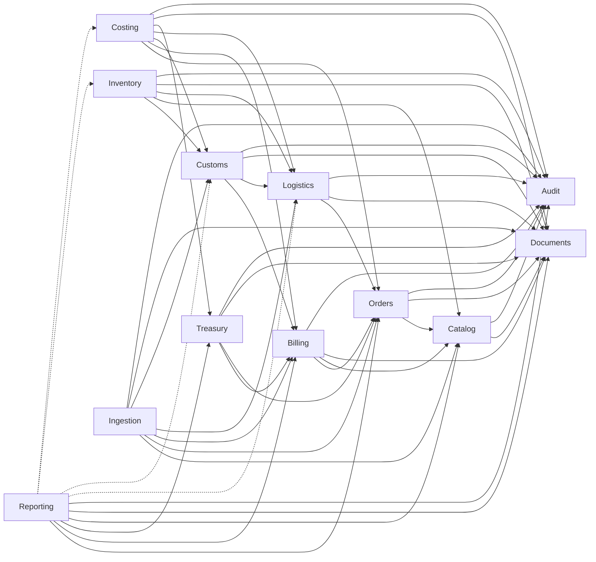

# Blueprint do Sistema Epic Controle — V2

## 1. Identidade, escopo e autoridade documental

| Campo | Valor |
|---|---|
| **Título** | Blueprint do Sistema Epic Controle V2 |
| **Versão** | 0.2.25 |
| **Status** | Aprovado — baseline funcional e arquitetural da V2 |
| **Data** | 2026-08-18 |
| **Objetivo** | Definir o **destino** do sistema V2 (produto, módulos, regras, telas, NFR, aceite) sem status de execução |

### 1.1 Documentos relacionados

| Documento | Papel |
|---|---|
| [`ROADMAP_V2_EPIC.md`](../../ROADMAP_V2_EPIC.md) | Estado, sequência, gates, ADRs, bloqueios, resumo e links de evidência |
| [`docs/v2/etapa-*`](./) | Comandos, logs, testes, screenshots, relatórios e evidências reproduzíveis |
| [`docs/README.md`](../README.md) | Índice e ciclo de vida documental |
| [`.cursor/rules/epic-v2.mdc`](../../.cursor/rules/epic-v2.mdc) | Método operacional V2 + política Git + guarda do legado V1 |
| Documentação V1 (`docs/v1/`) | Referência legada — ver [`docs/v1/README.md`](../v1/README.md); canônicos históricos: `BLUEPRINT_SISTEMA_EPIC_V1.md`, `DOCUMENTACAO_TECNICA_EPIC_V1.md`, `CHECKLIST_MVP_IMPORTACAO_EPIC_V1.md` |

### 1.2 Autoridade documental por assunto

Não há precedência linear única. O canônico depende do assunto:

| Assunto | Documento canônico |
|---|---|
| Comportamento, produto, arquitetura-alvo, telas, fluxos, critérios de aceite | **Este Blueprint** |
| Fases, status, gates, ADRs vigentes, bloqueios abertos, resumo e links de evidência | **Roadmap V2** |
| Evidências detalhadas e reproduzíveis de execução | **`docs/v2/etapa-*`** |
| Índice e ciclo de vida documental | **[`docs/README.md`](../README.md)** |
| Método de investigação e implementação no código/docs V2 | **[`.cursor/rules/epic-v2.mdc`](../../.cursor/rules/epic-v2.mdc)** |
| Histórico V1, checklist de evidências passadas, as-built | **Documentação V1** |
| Estado implementado durante investigação | **Código real** (inspecionado) |

Em conflito **no mesmo assunto**: registrar a divergência no Roadmap e atualizar o documento canônico correspondente. Em conflito estrutural V1↔V2, prevalece este Blueprint + ADRs do Roadmap.

**Checklist V1 nunca é DoD da V2.**

**Não pertence a este Blueprint:** resultados de comandos, status de testes, evidências de execução detalhadas, plano de move e changelog operacional detalhado → `docs/v2/etapa-*`; estado, resumo e links → Roadmap; checkpoint Git somente quando explicitamente autorizado e documentado no artefato apropriado.

### 1.3 Escopo deste documento

Cobertura §§2–17: visão, princípios, personas, mapa modular, modelo, fluxos, telas, regras, documentos, permissões, relatórios, NFR, releases, cenários, glossário, rastreabilidade.

---

## 2. Visão do produto

### 2.1 Problema

A Epic controla importações (Heroes / China / despachante BR) com planilhas, e-mails e conferência manual. Isso gera risco de custo final errado, perda de rastreabilidade, divergências entre fontes e dificuldade de fechamento auditável.

### 2.2 Contexto Epic / Heroes

| Elemento | Definição |
|---|---|
| Empresa | Epic (Brasil) |
| Parceira comercial | Heroes (Itália) — Ordine, Fattura, Packing List, etc. |
| Fabricação | China |
| Despacho | Despachante brasileiro (DUIMP, Numerário, etc.) |
| Operação do sistema | App web local em LAN; PostgreSQL local; sem Docker nesta fase |
| Fornecedor operacional atual | **Heroes** — único fornecedor usado pela Epic na operação corrente |
| Arquitetura multi-supplier | `Supplier` permanece entidade própria; modelo e APIs suportam múltiplos fornecedores futuros **sem** impor complexidade multi-supplier à UX atual e **sem** hardcode financeiro por `supplier_id` |

### 2.3 Usuários

Admin, gestor, comprador, financeiro, logística/operador, (futuro) despachante/estoque com papéis restritos. Matriz detalhada na §4.

### 2.4 Objetivos

1. Visibilidade operacional e financeira do ciclo de importação.
2. Rastreabilidade documental de ponta a ponta.
3. Liquidação correta (scadenze, antecipos, alocações, câmbio).
4. Embarques e aduana modelados sem forçar a ordem como hub universal.
5. Landed cost versionado por SKU; conciliação e fechamento auditáveis.
6. Base modular manutenível (Alt. B — reconstrução seletiva).

### 2.5 Resultado esperado

Operadores enxergam filas de ação; financeiro liquida por obrigação (Payable); logística e aduana avançam com estados próprios; gestor fecha com trilha; dashboard deriva dos fluxos — não inventa dados.

### 2.6 Limites do sistema

Controle de importação **operacional e financeiro**, com estoque mínimo (entreposto/nacionalização), não ERP.

### 2.7 Fora de escopo

ERP completo; contabilidade/fiscal/WMS completos; integração bancária automática complexa; Portal Único; motor tributário sofisticado; multiempresa avançado; microservices; cloud/SaaS; Docker nesta fase; Next.js/Electron; Excel/Access/SQLite como base oficial; migração de dados V1→V2.

---

## 3. Princípios funcionais

### 3.1 Princípios de negócio (portáveis)

1. **Vazio não vira zero** — campo ausente → `null` / `pending_review`.
2. **Documento integra a evidência** — custo, desconto, imposto, pagamento e transição crítica exigem origem documental.
3. **Estados independentes** — cada agregado persiste só o seu ciclo; status cruzados são read models.
4. **Ordem não é contêiner universal** — Order, Shipment e ImportProcess/DUIMP são agregados distintos.
5. **Cockpit resume e direciona** — não reimplementa Billing, Logistics, Customs etc.
6. **Módulos possuem ownership** — dados e regras pertencem a um owner; outros consomem contratos.
7. **Movimentos são fonte do estoque** — `StockBalance` é derivado.
8. **Alterações críticas são auditadas** — soft-annul; reason codes; sem hard delete de oficial.
9. **Falhas são explícitas** — divergência vira fila/conciliação; nunca some.
10. **Dashboard deriva dos fluxos operacionais** — última fatia de UI; só leitura agregada.

### 3.2 Princípios de modularidade e manutenibilidade

1. **Monólito modular não significa só pastas separadas** — significa fronteiras de ownership e contratos.
2. Cada módulo possui **dados, regras e internals próprios**.
3. Integração entre módulos ocorre por **contratos públicos** (comandos, consultas, facades) — não por imports de internals.
4. Dependências são **direcionais e sem ciclos** (ex.: Orders ← Billing ← Treasury).
5. **Cockpit e Reporting são read models** — não agregadores que recriam domínios (`order_central` é anti-padrão).
6. **Routers/controllers e páginas são finos**.
7. Regras de negócio **não** ficam em HTTP, componentes React ou código de apresentação.
8. Evitar **god files, god services, god components** e arquivos genéricos sem ownership (`models.py` / `services.py` / `utils.py` / `api.ts` globais multi-domínio).
9. Preferir **coesão e responsabilidade única**.
10. **Não fragmentar artificialmente** só para cumprir métrica de linhas.

### 3.3 Gatilhos de revisão de tamanho (referência, não limite cego)

| Gatilho | Ação |
|---|---|
| Arquivo manual ≈ **400** linhas | Revisar se há mais de uma responsabilidade |
| Arquivo ≈ **600** linhas | Justificar explicitamente no PR/Roadmap **ou** decompor |
| Função/método ≈ **50–60** linhas | Revisar |
| Componente React ≈ **250–300** linhas | Revisar |
| Router com regra de negócio | **Corrigir** independente do tamanho |
| Service/classe com mais de um domínio | Decompor |

**Excluir destas métricas automáticas:** código gerado; migrations; fixtures; arquivos declarativos; schemas extensos justificáveis; testes parametrizados.

---

## 4. Personas e matriz de responsabilidades

> Lacuna **L-005 / F0-009**: matriz completa papéis × ações críticas ainda pendente de validação operacional Epic. Abaixo = intent V2 a partir do as-built V1 + visão de produto.

### 4.1 Admin

| Aspecto | Conteúdo |
|---|---|
| Objetivo | Operar Identity, backup/restore, configuração |
| Informações | Usuários, papéis, saúde do sistema, auditoria |
| Ações | CRUD usuários/papéis; restore; migrações controladas |
| Aprovações | Overrides excepcionais |
| Restrições | Não “corrigir” saldos manuais sem documento |
| Telas | Usuários e permissões; auditoria; health |

### 4.2 Gestor

| Aspecto | Conteúdo |
|---|---|
| Objetivo | Visão executiva; fechamento; destravar bloqueios |
| Informações | Filas, KPIs, divergências, landed cost, PnL |
| Ações | Fechar/reabrir; aprovar overrides; ver dashboard |
| Aprovações | Fechamento, reabertura, tolerâncias (quando L-001 destravar) |
| Restrições | Não liquidar pagamento sem papel financeiro |
| Telas | Dashboard; cockpit; conciliação; auditoria |

### 4.3 Comprador

| Aspecto | Conteúdo |
|---|---|
| Objetivo | Ordens, catálogo, ingestão Ordine/Heroes |
| Informações | Ordens, itens, fornecedores, SKUs, status comercial |
| Ações | Criar/editar ordem; triagem de ingestão; catálogo |
| Aprovações | Confirmar ordem (conforme política) |
| Restrições | Não alterar alocações de pagamento |
| Telas | Fila de ordens; nova ordem; produtos; fornecedores; ingestão |

### 4.4 Financeiro

| Aspecto | Conteúdo |
|---|---|
| Objetivo | Invoices, payables, pagamentos, FX, créditos |
| Informações | Saldos, scadenze, alocações, câmbio, PnL |
| Ações | Registrar invoice/payable/payment/allocation/FX/crédito/desconto |
| Aprovações | Compensação de antecipo; aplicação de crédito |
| Restrições | Não mudar qty embarcada/nacionalizada |
| Telas | Central financeira; AP; invoices; pagamentos; câmbio; créditos |

### 4.5 Logística / operador

| Aspecto | Conteúdo |
|---|---|
| Objetivo | Embarques, documentos de transporte, chegada |
| Informações | Shipments, packing list, modal, datas |
| Ações | Criar/atualizar shipment e itens; anexar docs |
| Aprovações | Troca de modal (com reason code) |
| Restrições | Não liquidar financeiro; não CLEARED (Customs) |
| Telas | Embarques; cockpit (aba logística); documentos |

### 4.6 Despachante / aduana (perfil operacional)

| Aspecto | Conteúdo |
|---|---|
| Objetivo | ImportProcess/DUIMP, impostos, nacionalização |
| Informações | Invoices vinculadas, numerário, taxes |
| Ações | Registrar processo; vincular invoices; nacionalizar parcial |
| Aprovações | Conforme permissão |
| Restrições | Não criar Payment |
| Telas | Processo aduaneiro; documentos; estoque/entreposto |

---

## 5. Mapa funcional do sistema

### 5.0 Template de módulo (campos obrigatórios)

Para cada módulo abaixo:

| Campo | Significado |
|---|---|
| Objetivo | Por que existe |
| Owner | Time/papel responsável pelo domínio |
| Entidades | Agregados/entidades que possui |
| Funcionalidades | Capacidades |
| Comandos principais | Escritas |
| Consultas | Leituras |
| Dependências permitidas | Módulos que pode consumir (contratos públicos) |
| Imports / deps proibidos | O que não pode |
| Proibições de negócio | Regras “nunca” |
| Alertas | Sinais operacionais |
| Entregas de UI | Telas/partes |
| **API pública** | Facade / exports estáveis |
| **Internals privados** | Pacotes/arquivos não importáveis por outros módulos |
| **Casos de uso** | Orquestrações de domínio |
| **Ownership de persistência** | Tabelas/ORM sob responsabilidade do módulo |
| **Responsabilidade de transação** | Onde a UoW inicia/commit |
| **Estrutura interna recomendada** | Proporcional ao tamanho — **sem camadas vazias obrigatórias** |
| **Critérios de decomposição** | Quando quebrar arquivos/pacotes |
| **Testes** | Unitários, integração, arquitetura |

Hipótese de pastas internas (`domain` / `application` / `infrastructure` / `api`): **opcional**. Preferir package-by-domain com estrutura mínima coerente; o agente pode propor outra organização **com justificativa**.

### 5.1 Foundation

| Campo | Conteúdo |
|---|---|
| Objetivo | Bootstrap do monólito modular: config, health, error handler, OpenAPI, Alembic baseline, wiring |
| Owner | Engenharia |
| Entidades | Nenhuma de domínio |
| Funcionalidades | App factory; middleware; geração OpenAPI; settings |
| Comandos | — |
| Consultas | `/health` |
| Deps permitidas | stdlib / framework |
| Proibido | Regra de negócio; **qualquer** import de `v1/**` |
| API pública | `create_app`, settings, error types compartilhados mínimos |
| Internals | wiring interno |
| Transação | Não possui domínio |
| UI | — |
| Testes | health; OpenAPI schema freeze; arch imports |

### 5.2 Identity

| Campo | Conteúdo |
|---|---|
| Objetivo | Usuários, autenticação, papéis, permissões |
| Owner | Admin |
| Entidades | User, Role, Session |
| Funcionalidades | Login/logout; CRUD usuários; RBAC |
| Comandos | create_user, update_user, set_user_password, login, logout |
| Consultas | me, list_users |
| **Deps permitidas** | Nenhuma (módulo raiz de identidade) |
| Proibido | Importar Audit ou Documents; regras de Order/Payment; editor de `permissions_json`; auto-desativar; e-mail/token de senha |
| Orquestração | Foundation HTTP (`/api/users*`) chama Identity public e grava Audit na **mesma** UoW; `actor_id` opaco |
| UI | Login; Usuários (grupo Administração; item omitido sem `users:read` — nunca 403 de nav) |
| Persistência | users, roles, sessions |
| Transação | Nos use cases de Identity |
| Permissões | `users:read` / `users:write`; senha só pelo admin; último admin ativo protegido |

### 5.3 Audit

| Campo | Conteúdo |
|---|---|
| Objetivo | Trilha imutável de ações críticas e mudanças |
| Owner | Engenharia / Gestor |
| Entidades | AuditLog, (opcional) TechnicalLog |
| Funcionalidades | append-only; consulta por entidade/ator |
| Comandos | record_event(actor_id, …) |
| Consultas | history_by_entity |
| **Deps permitidas** | Nenhuma |
| Proibido | Depender de Identity; update/delete de eventos; resolver usuário internamente |
| Contrato | `actor_id` é identificador **opaco** (UUID/string); Audit não importa User/ORM de Identity |
| UI | Auditoria |
| Persistência | audit_log |

### 5.4 Documents

| Campo | Conteúdo |
|---|---|
| Objetivo | Anexos imutáveis, hash, versão, `document_links` |
| Owner | Operação transversal |
| Entidades | Document, DocumentVersion, DocumentLink |
| Funcionalidades | upload; supersede; link a entidade; download |
| Comandos | store_document(actor_id, …), link_document, supersede |
| Consultas | list_by_entity |
| **Deps permitidas** | Nenhuma |
| Proibido | Depender de Identity; mutar bytes após commit; apagar oficial sem supersede; conhecer regras de Billing |
| Contrato | Ator/contexto entram pela **API pública** (parâmetros); Documents não importa Identity |
| UI | Documentos; anexos nas telas de domínio |
| Persistência | documents, document_links; arquivos em pasta controlada |

### 5.5 Catalog

| Campo | Conteúdo |
|---|---|
| Objetivo | Fornecedores e produtos/SKUs |
| Owner | Comprador |
| Entidades | Supplier, Product (**um SKU = um Product**; sem família/variante) |
| Funcionalidades | CRUD mestre; busca; filtro incompleto (NCM ou EAN ausentes); List Report paginado. **Import CSV = FUTURO** |
| Comandos | create_product, patch_product, create_supplier, patch_supplier — **não** há `upsert_*` |
| Consultas | search_products; `GET /api/catalog/product-list` e `supplier-list` (`{items,total,limit,offset}`). `GET /api/products` e `/api/suppliers` permanecem **array** (sem `oneOf`) |
| **Deps permitidas** | Documents, Audit |
| Proibido | Quantidades de ordem/estoque aqui; importar Orders (normalização em `catalog.normalization`) |
| UI | Grupo **Produtos**: Produtos + Fornecedores (`catalog:read`); fichas de objeto; pickers operacionais buscam com `q` |
| L-006 | **PARTIAL** — ean, size, color, ncm (8 dígitos), country_of_origin, unit, net_weight_kg (`> 0`); Supplier.tax_id opcional (unique parcial país+id). CAP-006 (processo de qualidade) **não** implementado; incompleto **não** bloqueia pedido/estoque |
| Match | Ingestion casa por `Product.sku`. Código de documento sem Product = COMMITMENT |

### 5.6 Orders

| Campo | Conteúdo |
|---|---|
| Objetivo | Pedido comercial e itens |
| Owner | Comprador |
| Entidades | Order, OrderItem, OrderPaymentScheduleLine |
| Funcionalidades | Criar/confirmar/cancelar/fechar ordem; itens; `order_date`/`notes`; upload Documents (`entity_type=order`); cronograma de pagamento (planejamento); bind COMMITMENT→PRODUCT |
| Comandos | create_order, confirm_order, add_item, close_order, set_payment_schedule, bind_product |
| Consultas | order_summary (comercial); payment_schedule_view; fila |
| **Deps permitidas** | Catalog, Documents, Audit |
| **Proibido depender de** | Billing, Treasury, Logistics, Customs, Costing, Identity (ator via API/app) |
| Proibições | Persistir PARTIALLY_SHIPPED/SHIPPED na Order; campos fiscais italianos genéricos (N3.1/ART 8) em Orders; criar Payment/Payable/Allocation a partir do cronograma |
| Alertas | Ordem sem itens; confirmada sem documento |
| UI | Fila; nova ordem; cockpit (resumo + cronograma leitura); comercial com data/notes/docs/cronograma |
| Persistência | orders, order_items, order_payment_schedule_lines |
| Transação | Use cases de Orders |

**Snapshots documentais (Document Readiness A2):** `OrderItem.unit` (String≤16, opcional, normalizado UPPER — ex. PZ/SET/CTNS/UN) é snapshot da UM do documento, **não** módulo UoM de Catalog. `Order.order_date` (date, sem timezone) e `Order.notes` (texto; vazio→null) expostos na API/UI. Documentos oficiais do pedido via Documents + `DocumentLink` (`entity_type=order`). Dados fiscais do Ordine permanecem no PDF / domínio fiscal futuro — fronteira J#5/J#3 preservada.

**Linha mista PRODUCT + COMMITMENT:** `OrderItem.line_kind` ∈ {`PRODUCT`,`COMMITMENT`}. COMMITMENT = compromisso comercial sem Product de catálogo (código de documento em `external_code`, ex. I.V.). Pedido **misto** é válido. Em CONFIRMED, `bind_product` troca COMMITMENT→PRODUCT **sem** alterar qty/preço; qty já faturada ISSUED bloqueia o bind. Qty “disponível” em compromisso não é número operacional até o Product existir.

**Cronograma de pagamento (planejamento):** `OrderPaymentScheduleLine` é **previsão comercial**, não fato financeiro. Cada linha: `due_date` e/ou `condition_text` (texto livre; sem enum de marco); exatamente um de `percent`/`amount`. Um cronograma = um modo (PERCENT ou AMOUNT), inferido das linhas. PERCENT persiste com total comercial incompleto (`Σ%=100`; valor derivado `null` se a base for `null` — ausência **não** é zero). AMOUNT na moeda do Order; DRAFT pode divergir; `confirm_order` e set em CONFIRMED exigem Σ=total **quando** o total for calculável. Mudar itens **não** muta o cronograma. CONFIRMED exige `reason_code` + audit before/after na mesma UoW. Fattura/Payables **não** cobrem nem substituem o cronograma. Sem `FxPlanRate` na linha prevista. Sem parser Ordine→cronograma.

### 5.7 Billing

| Campo | Conteúdo |
|---|---|
| Objetivo | Proforma/Invoice/Acconto documental, scadenze → Payables |
| Owner | Financeiro |
| Entidades | Invoice, InvoiceItem, PaymentTerms, Payable |
| Tipos documentais de Invoice | **Implementados (Inc-2):** `PROFORMA` \| `FINAL`. **Alvo de produto:** `PROFORMA` \| `ACCONTO` \| `FINAL` — ver **DEC-ACCONTO-INVOICE** (pendente) |
| Funcionalidades | Emitir invoice; gerar N payables; cancelar DRAFT; `invoice_date`; unit snapshot por linha |
| Comandos | create_invoice, update_*, set_terms, issue_invoice, cancel_draft |
| Consultas | invoice_balance (= Σ payable balances); payables_queue |
| **Deps permitidas** | Orders, Catalog, Documents, Audit |
| **Proibido** | Treasury, Logistics, Customs |
| Proibições | Liquidar sem Payable; criar Payment a partir da emissão da Invoice; cancelar ISSUED no Inc-2 (SC-08); misturar terms %/valor; inventar domínio fiscal N3.1/ART 8 em Billing |
| UI | Invoices; Payables; formulário scadenze |
| Persistência | invoices, invoice_items, payment_terms, payables |
| Inc-2 | ISSUED imutável; doc obrigatório na emissão (ou override auditado); supplier/moeda da Order; tipos persistidos só `FINAL`\|`PROFORMA` |
| Inc-3 saldo | `Payable.amount` original imutável; `balance` só via `billing.public.apply_payable_allocations`; `allocated=amount−balance` derivado; status `OPEN\|PARTIALLY_PAID\|PAID\|CANCELLED`; Invoice balance = Σ balances |

**Snapshots documentais (Document Readiness A2):** `InvoiceItem.unit` opcional — na criação da Invoice copia `OrderItem.unit`; em `replace_items`, ausência da chave herda do OrderItem; presença = override explícito (incl. null). Após ISSUED o snapshot permanece imutável. Upload oficial da Invoice inalterado. Fatos fiscais da Fattura (IVA/ART 8) ficam no PDF / futuro domínio próprio — não em campos genéricos “temporários”.

**Invoice ACCONTO vs Payment antecipado `[DECISÃO / princípio]`:**

| Conceito | Módulo | Papel |
|---|---|---|
| Invoice `ACCONTO` (se/quando tipada) | **Billing** | Documento de cobrança/formalização do adiantamento; **pode** gerar Payable via scadenze; **não** comprova pagamento |
| Payment antecipado (acconto pago) | **Treasury** | Dinheiro efetivamente pago (comprovante); pode ficar **sem** allocation; só reduz saldo ao alocar em Payable |

Criar/emitir Invoice (qualquer tipo) **não** cria Payment. Payment só existe com evidência financeira em Treasury. A operação **admite** Payment antecipado sem Invoice de acconto (SC-04 / §7.4).

**DEC-ACCONTO-INVOICE `[PENDENTE]`:** tipar `ACCONTO` como `invoice_type` em Billing. Evidência 2026-07-22: fixture `Fattura_181-con acconti.pdf` é **FATTURA** com cláusula *BONIFICO ANTICIPATO 50%* + scadenze — **não** é documento intitulado *Fattura di acconto*. V1 tinha `invoice_type=ANTECIPO` (legado); Heroes XLSX `acconto_amount` mapeia a **pagamentos**, não a tipo de fatura. Formalizar `ACCONTO` no código/migration só após exemplar documental claro ou confirmação de negócio.

### 5.8 Treasury

| Campo | Conteúdo |
|---|---|
| Objetivo | Pagamentos, alocações, FX (três visões), créditos, descontos, conta corrente BR |
| Owner | Financeiro |
| Entidades | Payment (`purpose` ADVANCE\|SETTLEMENT), PaymentAllocation, **FxPlanRate**, **FxMarketQuote**, **FxExecution**, **FxExecutionAllocation**, **FxAllocationValuation**; Credit/Discount/CC BR (futuro) |
| Funcionalidades | Registrar pagamento; registrar **adiantamento no pedido** (ADVANCE, sem Payable prévio); alocar em Payable; FX projetado/online/realizado |
| Comandos | register_payment, register_order_advance, allocate; register_plan_rate; register_execution; link execution↔allocation; refresh_quote |
| Consultas | unallocated_payments; order advances; payable/payment fx-view (benchmarks nomeados) |
| **Deps permitidas** | Billing, **Orders** (Payment.order_id / ADVANCE no pedido), Documents, Audit |
| **Proibido** | Logistics; Customs; internals de Orders |
| Proibições | Allocation → Invoice sem Payable; Expense como entidade Treasury; cotação online como versão de taxa projetada |
| Lacuna | L-003 política conta corrente BR |
| UI | Pagamentos; painel FX três visões; créditos/descontos (futuro) |
| Persistência | payments, payment_allocations, fx_* |
| Inc-4 FX | Ownership **só Treasury**; plan→Payable; quote→par; execution→Payment 1:N; N:M via FxExecutionAllocation; PnL histórico em valuation; Billing ↛ Treasury |

**`Payment.purpose`:** `ADVANCE` nasce só no registro de adiantamento do pedido (`POST /orders/{id}/advances`). `SETTLEMENT` é pagamento de obrigação (mesmo com `order_id`). ADVANCE **permanece** ADVANCE depois de alocar. O cronograma do pedido **não** reclassifica purpose nem cria Payment.

**Três visões FX `[DECISÃO]`:**

| Visão | Fonte | Notas |
|---|---|---|
| Projetada | `FxPlanRate` INITIAL/REFORECAST/CORRECTION | 1 current por Payable |
| Online | `FxMarketQuote` (par) | fresh/stale/missing; null≠0; provider abstrato |
| Realizada | `FxExecution` + links + valuation | snapshots não mudam com reforecast |

Convenção: `rate` = BRL por 1 foreign. Positivo = favorável.

### 5.9 Ingestion

| Campo | Conteúdo |
|---|---|
| Objetivo | Pipeline bruto → adapter → staging → revisão → commit idempotente |
| Owner | Comprador / operação |
| Entidades | **Fundação (I0):** `IngestionBatch`, `IngestionBlob`, `IngestionOccurrence`. **Staging IR (I1):** `IngestionDocument`, `IngestionSection`, `IngestionField`, `IngestionRow`, `IngestionIssue`, `IngestionReviewChange`, relação `IngestionDocumentSet` (+ members). Posteriores: AdapterResult real; CommitAttempt/ledger (I3+) |
| Funcionalidades | Upload em quarantine; hash SHA-256; deduplicação física / reidratação; validação segura PDF/XLSX; abandon; purge de bytes; **staging IR versionado**; revisão por campo/linha/seção; issues; lock/optimistic concurrency; agrupamento mínimo; depois: adapters reais; triage UI; commit |
| Comandos | I0: create_batch, upload_files, abandon_occurrence, purge_quarantine. **I1:** seed_document_from_occurrence, correct_field/row, restore_field, review_section, lock/unlock, issues, document_set. Posteriores: adapters reais, approve_staging, commit_batch |
| Consultas | I0: get batch/occurrence. **I1:** get_document_detail, staging_queue, list_review_changes, get_document_set |
| **Deps permitidas** | Audit (I0/I1); Documents + Catalog + Orders + Billing + Logistics + Customs nas etapas de promote/commit (APIs públicas). **I0/I1 não dependem de Documents** até existir promote |
| Proibido | Escrever Document/DocumentLink no upload; escrever direto em tabelas oficiais sem commit; **qualquer** import V1; path físico baseado em filename do usuário |
| UI | Ingestão e revisão (SCR-037…039 — I2+) |
| Nota | Quarantine ≠ Document oficial; occurrence ≠ hash ≠ Document. Parser Heroes = lógica portada/reimplementada em V2; golden sem import V1. **Ordem:** owners com API estável **antes** da automação completa de `commit_batch` (J#4 → J#5 → J#3). Plano canônico da fase: `docs/v2/etapa-j3/J3_EXECUTION_PLAN.md`. **Fattura:** o match de linha liga InvoiceItem a OrderItem (PRODUCT billable; COMMITMENT não fatura qty até bind). Commit Policy A exige `order_id` explícito; Ingestion sugere Orders por filtros determinísticos (fornecedor único do catálogo, cobertura G4 das linhas, residual ISSUED, moeda como evidência fraca) — **nunca** `supplier + invoice_number`. 0 candidatos bloqueia; 1 = sugestão forte + confirmação humana; N = lista + escolha. `candidate_count == 1` pode casar sozinho; `candidate_count > 1` bloqueia até `line_choices` explícitas (proibido `fitting[0]`). Divergência de preço não é ambiguidade de identidade — a fatura segue o documento. O commit cria a **mesma** Invoice DRAFT do Billing; não há segunda jornada. Ingestão de Ordine **não** gera cronograma de pagamento. Emissão de Fattura **não** cobre/consome o cronograma do pedido. **Packing List Detail:** identidade de Order **nunca** é `supplier + document_number` (DEC-C6-IDENTITY); Fattura **não** é pré-requisito (DEC-C6-INVOICE-OPTIONAL). Cartons agregam por descrição+NCM; 4819 = embalagem sem qty embarcada; COMMITMENT não embarca qty até bind PRODUCT (DEC-C6-LINE-MATCH / COMMITMENT). Commit exige `order_id` explícito (0/1/N como Fattura). Alvo de Shipment: 0 cria PLANNED; 1 compatível reutiliza; N escolha humana; documento já SUCCEEDED não duplica (DEC-C6-SHIPMENT-TARGET). Modal permanece `null` em PLANNED (DEC-C6-PLANNED-ONLY). Detail é SoT dos volumes; Grouped é aviso (DEC-C6-DETAIL-SOT). Orquestração só via APIs públicas de Logistics/Documents. |

### 5.10 Logistics

| Campo | Conteúdo |
|---|---|
| Objetivo | Embarques comerciais e estrutura física (packages); refs documentais tipadas; prestadores logísticos mestres |
| Owner | Logística |
| Entidades | Shipment, ShipmentItem, ShipmentPackage, ShipmentPackageContent, ShipmentReference, ShipmentDocumentSummary, LogisticsProvider |
| Funcionalidades | Planejar/booking/trânsito/chegada; parcial; multi-embarque; packages homogêneos (`package_count`); intervalo/batch de packages; embalagem sem item comercial (ex. NCM 4819); snapshots documentais de linha PL em PackageContent (NCM produto, units/package, pesos unitários/linha); totais derivados × declarados por documento com `declared_provenance`; modal controlado; prestador via FK; upload Documents no Shipment |
| Comandos | create/update/advance/annul/delete shipment; add/update/remove item/package/reference; add_shipment_packages_batch; update_shipment_packages_batch; set_package_contents; upsert_document_summary; create/update logistics_provider |
| Consultas | shipped_qty_by_order_item; residuals_for_order; physical_totals_derived; declared_totals_by_document; physical_divergences; allocation_bases (fatos); order_item_candidates; get_shipment_by_code; list_logistics_providers |
| **Deps permitidas** | Orders, Documents, Audit |
| **Proibido** | Billing, Treasury, Costing; `order_id` no Shipment; invoices como propriedade Logistics |
| Proibições | Persistir CLEARED no Shipment; matching SKU isolado; Product/OrderItem artificial para embalagem; transportador como texto livre no write |
| UI | `/shipments` lista + create + detalhe; `/logistics-providers` cadastro mestre |
| DECs | DEC-SHIP-CODE; DEC-SHIP-PACK-LINE; DEC-DDT-KEY; DEC-SHIP-DECLARED-TOTALS; DEC-SHIP-MULTI-ORDER; DEC-SHIP-PROVIDER; DEC-SHIP-CANCEL (**aberta** para BOOKED+) |

**Modelo:** Shipment 1:N Item/Package/Reference/DocumentSummary; Package N:M Item via Content; Document via DocumentLink. `Shipment.code` = código interno EPIC (não BL/AWB/PL). Pesos/dims em Package são **por unidade**; totais derivados = unit × `package_count`. Tolerância de divergência física: provisória L-001 em `logistics/divergence.py` (não política final de Reconciliation).

**Snapshots documentais (J4-UX2 / Document Readiness A1):** `ShipmentPackageContent` pode armazenar `source_ncm` (NCM **produto**), `source_description`, `units_per_package`, `unit_net_weight_kg` / `unit_gross_weight_kg`, `source_total_*` — distintos de `ShipmentPackage.packaging_ncm` (NCM embalagem) e dos pesos físicos do package. `ShipmentDocumentSummary.declared_provenance` ∈ {PACKING_LIST, FATTURA_DOGANALE, MANUAL, OTHER}. Valores com provenance `FATTURA_DOGANALE` são **snapshot declarado por documento**, não verdade canônica de Logistics nem substituto de Customs/J#5. PDFs do corpus (Ordine/Fattura/PL/Doganale/Numerário/PrintDeclaration) são requisitos de modelagem e massa de teste; ingestão automática = J#3 após J#5.

**DEC-SHIP-PROVIDER (J4-UX1):** `Shipment.modal` ∈ {SEA,AIR,ROAD,COURIER,MULTIMODAL,OTHER} ou null (só PLANNED). Prestador = `LogisticsProvider` (legal_name, trade_name, provider_type, active). SoT = `logistics_provider_id`; `carrier_name_snapshot` derivado no servidor. Tipos elegíveis no embarque: TRANSPORTADOR, ARMADOR, FREIGHT_FORWARDER, OPERADOR_LOGISTICO (DESPACHANTE fora do formulário de Shipment). BOOKED exige modal + prestador (+ ≥1 item). Sem seed hardcoded de prestador.

**Commit de Packing List Detail (Ingestion → Logistics):** preenche Shipment PLANNED existente (criar ou reutilizar) via `create_shipment` / `add_shipment_item` / `add_shipment_packages_batch` / `set_package_contents` / `add_shipment_reference` / `upsert_document_summary`. Header do Shipment **sem** `order_id`. Packing **não** avança para BOOKED. Esses comandos públicos auditam o Shipment na mesma UoW.

### 5.11 Customs

| Campo | Conteúdo |
|---|---|
| Objetivo | ImportProcess/DUIMP, Doganale canônica, Numerário, taxes, nacionalização, provenance para J#3 |
| Owner | Aduana / despachante |
| Entidades | ImportProcess; ImportProcessInvoice / InvoiceItem / Shipment / ShipmentItem (joins); CustomsDoganale + Version + Line; CustomsFundingRequest (Numerário); CustomsPayee; CustomsValueBasis; CustomsTaxLine; CustomsExpenseLine; FundingPayableLink; Nationalization (+ Item); CustomsDivergence; CustomsProvenance |
| Funcionalidades | 1 DUIMP → N invoices; 1 DUIMP → N shipments; alocação por item; Doganale versionada **preenchida pelo PDF** (DEC-E7-DOGANALE-FILL); Numerário com cabeçalho **a partir do PDF que contém os tributos** (não da Doganale); Payee ≠ Supplier; nacionalização parcial; handoff de fatos a Billing (Payable CUSTOMS_FUNDING **OPEN** = registrar, não pagar); provenance para J#3 |
| Comandos | create_import_process; link/unlink invoice/shipment; allocate invoice_item/shipment_item; upsert_doganale_version; upsert_funding_request + bases/tax/expense; confirm_funding → payables (via Billing public); nationalize; register_divergence; attach_provenance |
| Consultas | process_by_id/list; clearance_residuals; divergences; funding_by_process |
| **Deps permitidas** | Billing, Logistics, Documents, Audit |
| **Proibido** | Treasury (Customs ↛ Treasury); criar Payment/Allocation; rateio landed cost (J#6); staging de ingestão (J#3); derivar II/IPI/PIS/COFINS/AFRMM/ICMS da Fattura Doganale |
| Pendências | L-007 **fechada** (referência DUIMP de ensaio digitada; sem PDF DI/DUIMP); settlement CUSTOMS_FUNDING (Treasury); E7-ARRIVAL-GATE (nacionalização sem exigir ARRIVED) |
| UI | SCR-019 / SCR-022 (abas) |
| **DEC-DUIMP-MULTI-SHIP** | **Fechada (I5-0):** ImportProcess **1:N** Shipment; `shipment_id` UNIQUE no join; alocação por ShipmentItem + residual. N:M shipment↔process fora de escopo. |
| **DEC-E7 (pacote)** | Doganale preenche Customs existente (IDENTITY / PROCESS-TARGET 0/1/N; sem associação silenciosa). Print = Documents-only. Impostos só de documento que os contenha (Numerário). REGISTRAR (Elo 7) ≠ PAGAR (Treasury). Fronteira Elo 7 = liberação confirmada; Inventory = Elo 8. ARRIVED demonstrado, **não** gate de domínio. |
| Justificativa | Agregado aduaneiro distinto de Order/Shipment (ADR-03); fixture Numerário prova multi-invoice; Bechtrans≠Heroes exige Payee |

### 5.12 Inventory

| Campo | Conteúdo |
|---|---|
| Objetivo | Movimentos por localização/regime; entreposto bonded; saldo derivado; posição por SKU |
| Owner | Estoque / operação |
| Entidades | StockLocation (`BONDED`\|`DOMESTIC`\|`QUARANTINE`); InventoryMovement; GoodsReceipt (+ Line); StockBalance (read model derivado); SkuPosition (read model composto) |
| Funcionalidades | Receipt bonded (pode preceder nacionalização); receipt/reclass domestic após liberação; ajuste/quarantine; consulta saldo; posição por SKU (buckets ≠ StockBalance); residual recebível **item-level** por processo |
| Comandos | record_receipt; record_adjustment; record_transfer_reclass |
| Consultas | stock_balance / stock_balance_bulk; list_movements; get_sku_position; list_receipt_residuals (por processo, item da liberação confirmada) |
| **Deps permitidas** | Customs, Catalog, Logistics, Documents, Audit |
| **Proibido** | Billing, Treasury, Orders (projeção `future_order_qty` em SkuPosition via Reporting ou parâmetro injetado — Inventory **não** depende de Orders) |
| Proibições | Editar StockBalance; misturar projeção futura em `stock_balances`; exigir nacionalização prévia para **toda** entrada física (bonded permitido pré-nac) |
| UI | SCR-024 / SCR-025 |
| **DEC-E8 (pacote)** | **PATH:** jornada operador após nacionalização = `DOMESTIC_IN` (entreposto na UI = decisão futura). **BIND:** candidatos/qty só do residual item-level da liberação confirmada; sem IDs crus; sem auto-confirm. **COVERAGE:** confirm doméstico/reclass exige `nationalization_item_id`; `product_id` da linha = item da liberação; sem fallback global-por-produto no caminho operador. **STUBS:** `cleared_not_received` = agregado do produto em todos os processos (verificação, não elegibilidade); `in_clearance` / `in_transit` / `future_order` não se apresentam como zero. |
| Justificativa | Catalog identifica SKU; Customs libera qty; Logistics informa shipped/in_transit; entreposto V1 alinhado (RECEIPT antes de nac); ADR-07 |

### 5.13 Costing

| Campo | Conteúdo |
|---|---|
| Objetivo | Expenses + landed cost versionado por SKU |
| Owner | Financeiro / gestor |
| Entidades | Expense, LandedCostVersion, components |
| Funcionalidades | Registrar despesa; ratear; versões estimado/revisado/realizado |
| Comandos | add_expense, compute_landed_cost, publish_version |
| Consultas | landed_cost_by_sku |
| **Deps permitidas** | Orders, Billing, Customs, Logistics, Treasury, Documents, Audit |
| **Proibido** | Reporting (escrita); ser dono de FX (só **lê** taxas públicas de Treasury) |
| UI | Landed cost |
| Justificativa | Logistics → bases de rateio (peso/volume/qty embarcada); Treasury → FX para conversão; Expense permanece em Costing |

### 5.14 Reconciliation

| Campo | Conteúdo |
|---|---|
| Objetivo | Pares de conciliação; divergências; filas |
| Owner | Financeiro / gestor |
| Entidades | ReconciliationCase, ReconciliationPair |
| Funcionalidades | Abrir caso; resolver; bloquear fechamento se aberto |
| Comandos | open_case, resolve_case |
| Consultas | open_divergences |
| **Deps permitidas** | Leitura das APIs públicas de Orders, Billing, Treasury, Logistics, Customs, Costing, Inventory; Documents; Audit |
| Proibido | Escrever entidades de domínio alheias |
| Lacuna | **L-001** tolerâncias — não inventar política definitiva |
| UI | Conciliação |

### 5.15 Reporting

| Campo | Conteúdo |
|---|---|
| Objetivo | Read models, dashboard, exportações |
| Owner | Gestor |
| Entidades | Projeções / materializações de leitura |
| Funcionalidades | KPIs; filas; exports; **order cockpit**; **AP queue enriquecida** |
| Comandos | — (não escreve domínio) |
| Consultas | `order_cockpit`; `ap_queue`; (futuro) dashboard |
| **Deps permitidas (Inc-5 atual)** | APIs públicas de **Orders, Billing, Treasury, Catalog, Documents, Audit** — só as arestas usadas no código; Logistics/Customs/Inventory/Costing entram quando houver seções reais |
| Proibido | Escrever em tabelas de domínio; N+1 de FX (usar bulk); tratar payment unallocated como relação ordem↔pagamento |
| HTTP | `GET /api/reporting/ap-queue`; `GET /api/orders/{id}/summary` (**handler em `reporting/routes`**, path UX sob `/orders`) |
| UI | Contas a pagar; cockpit da ordem; Dashboard (fase tardia) |

### 5.16 Grafo canônico de dependências

**Semântica única:** `A --> B` significa que **A pode depender da API pública de B**.  
A não importa internals de B. O grafo é **acíclico** e é a base do teste arquitetural.

#### Plataforma (sem ciclos)

| Aresta | Motivo |
|---|---|
| Identity sem deps | Raiz de autenticação |
| Audit sem deps | `actor_id` opaco |
| Documents sem deps | ator/contexto por parâmetro de API |
| Módulos → Audit / Documents | Facades públicas; Identity **não** depende deles |

Orquestração Identity→Audit: **Foundation/application** chama `Audit.record` após o use case de Identity — não há aresta Identity→Audit no grafo de pacotes (evita acoplamento e ciclo potencial).

#### Domínio



Arestas **sólidas** = Inc-5 implementadas. Arestas **tracejadas** = destino quando o módulo existir / seção do cockpit for ligada.  
Reconciliation (omitido no diagrama por densidade): mesmas leituras que Reporting + Documents + Audit; **sem escrita** em domínio alheio.

**Proibido no grafo:** qualquer aresta inversa às listadas; ciclos; V2→V1.

## 6. Modelo operacional

### 6.1 Entidades e significados

| Entidade | Significado | Owner |
|---|---|---|
| Order / OrderItem | Pedido comercial e linhas (`line_kind` PRODUCT\|COMMITMENT; `external_code` snapshot) | Orders |
| OrderPaymentScheduleLine | Planejamento de pagamento do pedido (data e/ou condição; % ou valor) | Orders |
| Invoice / InvoiceItem / Payable | Fatura e obrigações por scadenza | Billing |
| Payment / PaymentAllocation | Dinheiro e liquidação de Payable; `purpose` ADVANCE\|SETTLEMENT | Treasury |
| FxPlanRate / FxMarketQuote / FxExecution / FxExecutionAllocation / FxAllocationValuation | Câmbio projetado, online e realizado | Treasury |
| Credit / Discount | Crédito e desconto documentados | Treasury |
| Shipment / ShipmentItem / ShipmentPackage / ShipmentPackageContent / ShipmentReference / ShipmentDocumentSummary | Embarque: alocação comercial, volumes físicos, refs tipadas, totais declarados por doc | Logistics |
| ImportProcess | Processo aduaneiro (DUIMP etc.) | Customs |
| CustomsDoganale (+ Version/Line) | Fattura Doganale canônica versionada | Customs |
| CustomsFundingRequest | Numerário (cabeçalho da solicitação financeira aduaneira) | Customs |
| CustomsPayee | Favorecido de liquidação Customs (≠ Supplier obrigatório) | Customs |
| CustomsValueBasis / TaxLine / ExpenseLine | Fatos de valor/tributo/despesa aduaneira | Customs |
| FundingPayableLink | Elo FundingRequest → Payable (Billing) | Customs (link) + Billing (Payable) |
| Nationalization (+ Item) | Liberação aduaneira de qty | Customs |
| CustomsProvenance | Origem documental/adapter para handoff J#3 | Customs |
| Expense / LandedCostVersion | Custo e rateio | Costing |
| StockLocation | Local com regime BONDED / DOMESTIC / QUARANTINE | Inventory |
| InventoryMovement / GoodsReceipt | Movimento / recebimento físico | Inventory |
| StockBalance | Saldo **derivado** por (product, location) | Inventory (read) |
| SkuPosition | Posição composta (disponível, bonded, clearance, trânsito, futuro) | Inventory (read; fontes multi-módulo via public) |
| Document / DocumentLink | Evidência imutável | Documents |

### 6.2 Cardinalidades canônicas

- Order **1:N** Invoice  
- Order **1:N** OrderPaymentScheduleLine (planejamento; ≠ PaymentTerm da Invoice)  
- Invoice **1:N** Payable (scadenze / payment terms)  
- Payment **N:M** Payable via PaymentAllocation  
- OrderItem **N:M** Shipment via ShipmentItem (**Shipment sem `order_id`**)  
- ShipmentPackage **N:M** ShipmentItem via ShipmentPackageContent  
- Shipment **1:N** ShipmentReference / ShipmentDocumentSummary  
- ImportProcess **1:N** Invoice (`invoice_id` UNIQUE no join) + alocação opcional/complementar por **InvoiceItem** (`UNIQUE(process_id, invoice_item_id)`)  
- ImportProcess **1:N** Shipment (`shipment_id` UNIQUE no join; **DEC-DUIMP-MULTI-SHIP**) + alocação por **ShipmentItem** (`UNIQUE(process_id, shipment_item_id)`; Σ ≤ qty embarcada)  
- ImportProcess **1:1** CustomsDoganale lógico → **1:N** CustomsDoganaleVersion (`is_current`; retificação = supersede)  
- ImportProcess **1:N** CustomsFundingRequest → **1:N** ValueBasis / TaxLine / ExpenseLine  
- CustomsFundingRequest **N:M** Payable via FundingPayableLink (agrupamento default por payee/due_date/currency + `sequence`)  
- CustomsPayee **1:N** CustomsFundingRequest  
- Nationalization **1:N** NationalizationItem; GoodsReceiptLine pode referenciar NationalizationItem  
- Document **N:M** entidades via DocumentLink  

### 6.3 Unidade de liquidação

**Payable.** `PaymentAllocation` liquida somente Payable. Saldo da Invoice = Σ saldos dos Payables. Antecipo **não alocado** não reduz saldo. O cronograma do pedido **não** é Payable e **não** entra na unidade de liquidação.  
Payables de origem Customs nascem de `CustomsFundingRequest` confirmado (via Billing public + `FundingPayableLink`), **não** de linhas órfãs de imposto/despesa. Uniqueness de origem customs: `UNIQUE(source_type, source_id, sequence)` — **não** `UNIQUE(source_type, source_id)` sozinho. Payables comerciais de scadenze permanecem `UNIQUE(invoice_id, sequence)`.

**Payable `CUSTOMS_FUNDING` (DEC-J5-CLOSE-ALT-B):** obrigação **registrada** a partir do Numerário. **Não** é liquidável pelo módulo Treasury atual (`Payment`/`Allocation` exigem Invoice/Supplier; `list_eligible_payables` exclui origem Customs). Liquidação Customs é backlog explícito **`Treasury settlement for CUSTOMS_FUNDING`**. Navegação AP→Numerário resolve via `source_id` + GET público Customs (`/api/customs/funding-requests/{id}`) — Billing/Reporting **não** importam Customs.

### 6.4 Estados persistidos vs derivados

| Agregado | Persistidos | Não persistir (derivado / outro agregado) |
|---|---|---|
| Order | DRAFT → CONFIRMED → CLOSED / CANCELLED | PARTIALLY_SHIPPED, SHIPPED, PAID… |
| Shipment | PLANNED → BOOKED → IN_TRANSIT → ARRIVED | CLEARED |
| ImportProcess | DRAFT → SUBMITTED → IN_CLEARANCE → PARTIALLY_CLEARED → CLEARED → CLOSED; CANCELLED | progresso fino de liberação/recebimento se residual derivado for suficiente |
| CustomsFundingRequest | DRAFT → ISSUED → CONFIRMED → PARTIALLY_SETTLED → SETTLED; CANCELLED | — |
| CustomsDoganaleVersion | DRAFT / ACTIVE / SUPERSEDED / CANCELLED (`is_current`) | — |
| Invoice / Payable / Payment | conforme máquina do domínio | “status global da importação” |
| Reconciliation / Closure | estados próprios | — |

**Dimensões separadas (não colapsar num único status):** lifecycle do ImportProcess; situação documental (Documents + DoganaleVersion); residuals de liberação; residuals de recebimento (bonded/domestic); status financeiro do FundingRequest / Payables.

### 6.5 Documentos, valores, versionamento, rastreabilidade

- Documentos imutáveis; substituição = nova versão + supersede + histórico.  
- Valores oficiais têm origem documental (`CustomsProvenance` + `document_id` onde aplicável).  
- Doganale canônica versionada em Customs (Logistics `FATTURA_DOGANALE` = snapshot não-SoT).  
- Landed cost versionado (planejado / revisado / realizado) — Costing / J#6.  
- FX (Inc-4): projeções (`FxPlanRate`) versionadas; cotações online (`FxMarketQuote`) append-only com `source` e timestamps; valuations realizadas (`FxAllocationValuation`) preservam snapshots históricos; **reforecast não altera** resultado realizado congelado. Taxa contratada/hedge/spread = capacidades futuras.  
- AuditLog + reason codes em exceções, cancelamentos, reaberturas, overrides.

### 6.6 Decisões abertas (não inventar)

| ID | Tema |
|---|---|
| L-001 | Tolerâncias de conciliação |
| L-003 | Conta corrente BR / impacto fiscal |
| DEC-ENDERECO | Modelo de endereços |

**DEC-DUIMP-MULTI-SHIP `[DECISÃO]` (fechada I5-0 / 2026-08-03):** ImportProcess **1:N** Shipment com `shipment_id` UNIQUE no join; alocação quantitativa por ShipmentItem + residual. Um shipment não participa de dois processos no V2. Reabrir N:M só com evidência operacional + nova DEC.

**DEC-SCONTO-ITEM `[DECISÃO]` (fechada 2026-07-22):** Sconto comercial de linha ∈ **InvoiceItem** (não OrderItem). Representação: `discount_type` ∈ {`NONE`,`UNIT_AMOUNT`,`PERCENT`} com xor de `discount_unit_amount` / `discount_percent`. Fattura_202 tem coluna `% Sc` (vazia neste exemplar); Heroes/V1 usam valor unitário — modelo dual evita perda na ingestão. Payable e Costing futuro usam **líquido**. Desconto global/documental (Treasury) fora do slice Order-to-Pay Billing; proibida dupla aplicação. Arredondamento comercial: `ROUND_HALF_UP` **2 casas**; residual de scadenze % na última parcela.

---

## 7. Fluxos ponta a ponta

Cada fluxo: pré-condições → passos → regras → exceções → resultado. Sem status de execução.

### 7.1 Criação manual de ordem

- **Pré:** usuário comprador autenticado; supplier/SKU existentes ou criáveis.  
- **Passos:** nova ordem → itens → cronograma opcional (data e/ou condição) → DRAFT → confirmar.  
- **Regras:** vazio ≠ zero; confirmação auditada; cronograma AMOUNT com total calculável deve somar o total (senão 422); PERCENT com base incompleta não bloqueia.  
- **Exceção:** SKU incompleto → pending_review.  
- **Resultado:** Order CONFIRMED; cronograma intacto (não vira Payment/Payable).

### 7.2 Importação de Ordine

- **Pré:** PDF/arquivo Ordine; Documents disponível.  
- **Passos:** ingest → adapter → staging → revisão → commit Orders (+ Catalog se necessário).  
- **Regras:** hash imutável; commit idempotente; linhas podem nascer COMMITMENT (`external_code`); **não** gera cronograma de pagamento.  
- **Exceção:** conflito de identificador → fila.  
- **Resultado:** Order oficial + documento linkado.

### 7.3 Invoice com múltiplas scadenze

- **Pré:** Order; documento Fattura.  
- **Passos:** Invoice → PaymentTerms → N Payables.  
- **Regras:** saldo Invoice = Σ Payables.  
- **Resultado:** obrigações distintas por vencimento.

### 7.4 Antecipo não alocado e compensação posterior

- **Pré:** Payment com `purpose=ADVANCE` no pedido (evidência financeira). Payable **não** é pré-condição — o adiantamento pode existir antes da Fattura.  
- **Passos:** registrar ADVANCE no pedido **sem** allocation → depois allocate em Payable(s) do mesmo pedido.  
- **Regras:** sem allocation, saldo Payable/Invoice **não** cai; purpose permanece ADVANCE após alocar; SETTLEMENT ≠ ADVANCE mesmo com o mesmo `order_id`; Invoice ACCONTO (se existir) **não** substitui nem cria o Payment; o cronograma do pedido **não** cria nem consome o ADVANCE.  
- **Resultado:** crédito do pedido visível; saldo correto pós-alocação.

### 7.5 Pagamento parcial

- **Pré:** Payable aberto.  
- **Passos:** Payment + Allocation parcial.  
- **Regras:** saldo residual explícito.  
- **Resultado:** Payable parcialmente liquidado.

### 7.6 Crédito aplicado em obrigação diferente

- **Pré:** Credit com origem documental (invoice/order A).  
- **Passos:** apply_credit em Payable B.  
- **Regras:** origem ≠ uso permitido e auditado; ≠ desconto ≠ conta corrente BR (L-003).  
- **Resultado:** B liquidado parcialmente/total via crédito.

### 7.7 Embarque parcial

- **Pré:** OrderItem com qty.  
- **Passos:** Shipment + ShipmentItem com qty &lt; pedida.  
- **Regras:** qty embarcada derivada; Order não muda para SHIPPED.  
- **Resultado:** residual a embarcar visível.

### 7.8 Item em múltiplos embarques

- **Pré:** mesmo OrderItem.  
- **Passos:** N ShipmentItems somando ≤ qty permitida.  
- **Regras:** sem `order_id` no Shipment; vínculo só via item.  
- **Resultado:** rastreio por embarque.

### 7.9 DUIMP com múltiplas invoices

- **Pré:** Numerário / docs; N invoices (fixture: INV 181/202/203/244/245/246).  
- **Passos:** ImportProcess linka N invoices (1:N, `invoice_id` UNIQUE); aloca InvoiceItems quando parcialidade exigir.  
- **Regras:** não subordinar DUIMP a uma única Order como contêiner; uma invoice ∈ ≤1 processo.  
- **Resultado:** processo aduaneiro coerente com fixture Numerário.

### 7.10 Nacionalização parcial

- **Pré:** ImportProcess; qty alocada (Doganale / shipment / invoice item) com residual. ARRIVED na jornada Logistics é demonstrado; **não** é precondição de domínio (E7-ARRIVAL-GATE).  
- **Passos:** nationalize qty parcial.  
- **Regras:** residual explícito; over-nationalization bloqueada; **não** cria StockBalance sozinho (Elo 8 / GoodsReceipt).  
- **Resultado:** qty nacionalizada &lt; total; status PARTIALLY_CLEARED ou CLEARED.

### 7.11 Entrada e consumo em entreposto

- **Pré:** política de entreposto aplicável; qty embarcada residual.  
- **Passos:** receipt em location BONDED (pode preceder nacionalização) → após liberação, `RECLASS` pareado (`RECLASS_OUT` em BONDED + `RECLASS_IN` em DOMESTIC) → QUARANTINE conforme caso. `DOMESTIC_IN` puro permanece para entrada doméstica **sem** estoque bonded prévio.  
- **Regras:** não editar StockBalance; conservação física só na dimensão física (`available + bonded + quarantine` = Σ StockBalance); SkuPosition separa dimensões (física / aduaneira / logística) e **não** soma entre dimensões; stubs (`in_clearance`, `in_transit`, `future_order`) não se apresentam como medição zero. **PATH:** a jornada de operador após nacionalização é `DOMESTIC_IN` (entreposto na UI = decisão futura, não mistura neste fluxo). **BIND:** candidatos e qty do residual **item-level** da liberação confirmada; sem IDs crus; sem auto-confirm. **COVERAGE:** `nationalization_item_id` obrigatório no confirm doméstico; `product_id` da linha = item da liberação; sem fallback global-por-produto no caminho operador. **STUBS:** `cleared_not_received` é agregado do produto em **todos** os processos (verificação, não elegibilidade do receipt).  
- **Resultado:** saldo = Σ movimentos por (product, location); reclass não infla o total físico.

### 7.12 Landed cost por SKU

- **Pré:** Expenses + Taxes + itens.  
- **Passos:** rateio → LandedCostVersion.  
- **Regras:** versões estimado/revisado/realizado; Expense em Costing.  
- **Resultado:** custo por SKU auditável.

### 7.13 Retificação de invoice

- **Pré:** Invoice oficial.  
- **Passos:** nova versão / retificação; payables recalculados conforme regra; histórico.  
- **Regras:** não hard-delete; impacto em alocações → conciliação se divergir.  
- **Resultado:** versão atual + histórico.

### 7.14 Substituição de documento

- **Pré:** Document linkado.  
- **Passos:** upload nova versão → supersede → links atualizam versão atual.  
- **Regras:** bytes antigos preservados.  
- **Resultado:** trilha completa.

### 7.15 Conciliação

- **Pré:** par com diferença.  
- **Passos:** abrir caso → analisar → resolver ou manter aberto.  
- **Regras:** L-001 — tolerâncias provisórias isoladas; sem sumir divergência.  
- **Resultado:** caso resolvido ou bloqueio de fechamento.

### 7.16 Fechamento e reabertura

- **Pré:** permissões; sem divergências bloqueantes.  
- **Passos:** close snapshot → reopen com reason + permissão.  
- **Regras:** reabertura auditada; não edição silenciosa.  
- **Resultado:** CLOSED ou REOPENED controlado.

### 7.17 Cronograma de pagamento no pedido

- **Pré:** Order DRAFT ou CONFIRMED; `orders:write`.  
- **Passos:** replace-set das linhas (`due_date` e/ou `condition_text`; PERCENT ou AMOUNT) → leitura no comercial e no cockpit.  
- **Regras:** planejamento ≠ Payment ≠ Allocation ≠ Payable; um modo por cronograma; Σ percent = 100; derivado `null` se total comercial `null`; confirm/CONFIRMED AMOUNT exige Σ=total quando calculável; itens não mutam o cronograma; CONFIRMED exige reason+audit; Fattura não cobre; sem FxPlanRate; KPIs paid / advanced_credit / fx_exposure **intocados**.  
- **Resultado:** previsão visível e coerência/delta honestos; fatos financeiros intactos.

### 7.18 Fattura assistida até Invoice DRAFT

- **Pré:** Fattura em revisão; Orders e Billing via contratos públicos; Order CONFIRMED já existente (não inventar).
- **Passos:** extração → candidatos de Order (0 / 1 / N) → operador confirma `order_id` → revisão de linhas → preview → commit → **a mesma** Invoice DRAFT → `set_terms` / `issue_invoice` já existentes.
- **Regras:** **DEC-A0-ORDER-CANDIDATES** — filtros determinísticos; nunca `supplier + invoice_number`; 0 = bloquear e explicar; 1 = sugestão forte + confirmação (sem auto-commit); N = lista + escolha explícita. **DEC-A0-AMBIGUOUS** — uma candidata de linha pode casar; mais de uma bloqueia até `line_choices`; commit não resolve com `fitting[0]`; preço divergente ≠ identidade. Qty/preço da Fattura prevalecem (FIN-3B). Issue cria Payables e **não** cria Payment. Documento IR já SUCCEEDED é idempotente (não duplica Invoice). `review_status` DRAFT da extração **não** significa fatura pendente.
- **Exceção:** COMMITMENT permanece não faturável até bind PRODUCT; G4 `external_code` preservado.
- **Resultado:** Invoice DRAFT no Order escolhido; jornada Billing inalterada a partir daí.

### 7.19 Packing List Detail até Shipment PLANNED

- **Pré:** Packing List Detail em revisão; Order CONFIRMED já existente (não inventar); Logistics via contratos públicos.
- **Passos:** extração de cartons (layout) → candidatos de Order (0 / 1 / N) → operador confirma `order_id` → casamento de linhas (agregado desc+NCM) → alvo de Shipment (0 criar / 1 reutilizar / N escolher) → preview → commit → **o mesmo** Shipment PLANNED (detalhe Logistics existente).
- **Regras:** **DEC-C6-IDENTITY** — nunca `supplier + document_number`. **DEC-C6-INVOICE-OPTIONAL** — Fattura não é pré-condição. **DEC-C6-LINE-MATCH** — 4819 embalagem; 1 residual PRODUCT casa; >1 exige escolha. **DEC-C6-COMMITMENT** — COMMITMENT não embarca qty. **DEC-C6-PLANNED-ONLY** — `modal=null`; não BOOKED. **DEC-C6-DETAIL-SOT** — Detail preenche volumes; Grouped não é SoT. **DEC-C6-SHIPMENT-TARGET** — 0/1/N; documento já SUCCEEDED é idempotente (não duplica volumes). **IR `review_status` (DRAFT/IN_REVIEW/READY/REJECTED)** descreve a extração ainda editável; o commit **não** muda esse ciclo — packing processado = `IngestionCommitAttempt` SUCCEEDED + Shipment. **Audit:** comandos públicos Logistics (`create_shipment`, item, packages, contents, reference, summary) gravam `AuditEvent` no Shipment na mesma UoW (HTTP e Ingestion compartilham a trilha). Palete declarado no cabeçalho do packing ≠ volume do tipo PALLET (aviso factual, não bloqueia).
- **Resultado:** Shipment PLANNED com itens, packages, conteúdos, referência PACKING_LIST e resumo declarado; jornada Logistics inalterada a partir daí.

---

## 8. Arquitetura funcional das telas

Convenção: cada tela documenta propósito, usuário, header, KPIs, filtros, agrupamentos, tabela/colunas, ações, inline edit, drill-down, alertas, empty, permissões e aceite.
UI une Billing+Treasury na “Central financeira”, mas **ownership** permanece nos módulos. Cockpit é **read model** — não recria domínios.

### 8.0 Arquitetura de interação (shell / IA)

| Campo | Conteúdo |
|---|---|
| Propósito | Continuidade operacional: shell, navegação, estados e composição de telas Order-to-Pay |
| Shell | Sidebar agrupada (**Produtos** · **Compras** · **Financeiro** · **Logística** · **Aduana** · **Administração**); permission-aware (Administração só com `users:read` — omitir, nunca 403); brand + usuário; strip FX de mercado |
| Foundation UI | Componentes lean reutilizados: PageHeader, breadcrumb, KpiStrip, StatusBadge, Money/FxDisplay, Empty/Error/Loading, FilterBar, DetailDrawer — **sem** DataTable genérico excessivo |
| Tipos de tela | Fila (lista+KPI+filtro URL); Cockpit (resumo+drill); Formulário/detalhe de domínio; Drawer de contexto |
| Navegação | Deep link preserva filtros na URL; item sem permissão omitido; API 403 + UI gated |
| Tema | Dark operacional densificado (contraste/legibilidade); **validável** — não irrevogável |
| Permissões | **Produto-alvo:** financeiro/gestor com `reporting:read`. **Implementação atual:** admin only até validação **L-005**. Demais módulos por `*:read`/`*:write` |
| Aceite | Shell não escreve domínio; Reporting não vira `order_central`; FE só consome HTTP público |

### 8.1 Login

| Campo | Conteúdo |
|---|---|
| Propósito | Autenticar usuário |
| Usuário | Todos |
| Header | Marca Epic; sem nav autenticada |
| KPIs / filtros / tabela | — |
| Ações | Login; logout após sessão |
| Inline / drill | — |
| Alertas / empty | Credencial inválida explícita |
| Permissões | Público (não autenticado) |
| Aceite | Cookie httpOnly; sessão registrada; falha sem vazar detalhes internos |

### 8.2 Dashboard

| Campo | Conteúdo |
|---|---|
| Propósito | Visão executiva e filas derivadas dos fluxos |
| Usuário | Gestor (e perfis com leitura) |
| Header | Período; atalhos para filas críticas |
| KPIs | Exposição FX; total a pagar; ordens com pendência; shipments em trânsito; divergências abertas; unallocated |
| Filtros | Período; fornecedor; responsável |
| Agrupamentos | Por domínio (financeiro / logística / aduana / ingestão) |
| Tabela | Top N itens por fila (ordem, payable, shipment, caso) |
| Ações | Navegar para fila/cockpit; export resumido |
| Inline | Não |
| Drill-down | Widget → fila ou entidade |
| Alertas | Filas acima de limiar; casos L-001 |
| Empty | “Sem pendências no período” |
| Permissões | reporting:read |
| Aceite | Somente leitura; dados de Reporting; **última** fatia de UI; não grava domínio |

### 8.3 Fila de ordens

| Campo | Conteúdo |
|---|---|
| Propósito | Trabalhar ordens comerciais e enxergar saúde financeira/logística **derivada** |
| Usuário | Comprador; gestor |
| Header | Título; CTA Nova ordem; busca rápida |
| KPIs | Abertas; confirmadas; com saldo; com qty a despachar; com pendências |
| Filtros | Status comercial; ano; fornecedor; responsável; pendência; faixa de saldo |
| Agrupamentos | Opcional por fornecedor ou ano |
| **Colunas** | Ordem; ano; fornecedor; status comercial; valor faturado; pago; saldo; próximo vencimento; qtd a despachar; crédito; pendências; responsável; última atualização |
| Ações | Abrir cockpit; nova ordem; export |
| Inline | Não (valores financeiros são read models) |
| Drill-down | Linha → cockpit; saldo → AP filtrado; vencimento → payable |
| Alertas | Doc faltante; unallocated ligado; divergência; atraso de scadenza |
| Empty | “Nenhuma ordem — criar ou importar Ordine” |
| Permissões | orders:read; orders:write para criar |
| Aceite | Status comercial só Order; shipping/aduana como badges derivados; sem `order_central` |

### 8.4 Cockpit da ordem

| Campo | Conteúdo |
|---|---|
| Propósito | Resumir e direcionar: comercial + links aos domínios |
| Usuário | Comprador; financeiro; logística; gestor |
| Header | Código ordem; fornecedor; status comercial; ações contextuais |
| KPIs | Pedido; faturado; **pago = Σ allocations**; **adiantado = residual REGISTERED com purpose ADVANCE**; saldo; próximo venc.; FX exposição/realizado; (futuro) embarcado/nacionalizado/LC |
| Filtros | — (contexto = uma ordem) |
| Agrupamentos | Seções: Comercial; **Cronograma (planejamento, não KPI financeiro)**; Financeiro; Tesouraria; FX; Documentos; Auditoria; (futuro Logística/Aduana) |
| Tabelas | Resumos truncados (limites explícitos); invoices/payables; payments; docs/audit recentes |
| Ações | Toggle comercial/edição (Orders); atalhos “ir para” Invoice/Payable/FX/Payment |
| Inline | Campos comerciais permitidos em DRAFT; demais via módulos |
| Drill-down | Cada linha → tela dona do agregado |
| Alertas | Pendências por seção; unallocated **candidatos** (nunca como relação) |
| Empty | Seção sem dados com CTA do módulo dono |
| Permissões | `reporting:read` + `orders:read` para summary; escritas por permissão do módulo |
| Fonte HTTP | `GET /api/orders/{id}/summary` → **Reporting** (`order_cockpit`) |
| Aceite | Zero mega-aggregator; `paid` só via allocations; `advanced_credit` só ADVANCE; cronograma não entra em paid/adiantado/fx_exposure; payload limitado; Orders ↛ Billing/Treasury |

### 8.5 Nova ordem

| Campo | Conteúdo |
|---|---|
| Propósito | Criar Order + itens manualmente |
| Usuário | Comprador |
| Header | Formulário; salvar rascunho |
| KPIs | Total estimado itens (null se preço vazio) |
| Filtros | Busca SKU/supplier com `q` (não tratar os primeiros 50 como o catálogo inteiro) |
| Agrupamentos | Cabeçalho vs linhas |
| Tabela | SKU; descrição; qty; preço; moeda; NCM (se houver) |
| Ações | Salvar DRAFT; confirmar; cancelar |
| Inline | Sim nas linhas (qty/preço) com validação |
| Drill-down | SKU → ficha Catalog |
| Alertas | SKU incompleto → pending_review; vazio ≠ zero |
| Empty | Grade vazia com “adicionar item” |
| Permissões | orders:write |
| Aceite | DRAFT→CONFIRMED auditada; sem criar Invoice automaticamente; criar SKU na hora exige descrição (não copiar sku→description) |

### 8.6 Produtos / 8.7 Fornecedores

Cadastro mestre Catalog. Lista via List Report (paginação 50; total no envelope); busca; filtros ativo / dados incompletos / sem NCM (produto) ou sem identificador fiscal (fornecedor). Ficha de objeto com PATCH (L-006 PARTIAL + `tax_id`). Sem qty operacional. Permissões `catalog:read`/`catalog:write`. CSV **FUTURO**. Incompleto é fila, não bloqueio de processo.

### 8.8 Central financeira

| Campo | Conteúdo |
|---|---|
| Propósito | Hub UI Billing+Treasury: obrigações, caixa e FX |
| Usuário | Financeiro; gestor |
| Header | Atalhos AP / Invoices / Pagamentos / FX / Créditos |
| KPIs | A pagar; vencido; unallocated; crédito disponível; PnL período |
| Filtros | Período; fornecedor; moeda; status liquidação |
| Agrupamentos | Por semana de vencimento ou fornecedor |
| Tabela | Resumo de payables + pagamentos recentes |
| Ações | Ir para filas; registrar pagamento (atalho) |
| Inline | Não |
| Drill-down | KPI → fila filtrada |
| Alertas | Unallocated; atraso; comprovante faltando |
| Empty | “Sem obrigações no filtro” |
| Permissões | billing:read; treasury:read/write conforme ação |
| Aceite | Não é dono de Expense (Costing); não liquida sem Payable |

### 8.9 Fila de contas a pagar

| Campo | Conteúdo |
|---|---|
| Propósito | Trabalhar Payables (unidade de liquidação) com projeção FX |
| Usuário | Financeiro; gestor (**produto-alvo** com `reporting:read`; **implementação atual** admin only até L-005) |
| Header | Título; atualizar; filtros na **URL**; contexto de fornecedor **uma vez** se a página for mono-supplier (ex. Heroes) |
| KPIs | Do **conjunto filtrado** (não da página): vencido; hoje; próx. 7d; saldo aberto; candidatos unallocated |
| Filtros | Status; pendência; moeda; ordem; invoice; vencimento (server-side). Filtro `supplier_id` permanece na **API**; **não** é eixo principal da UX com um único fornecedor operacional |
| Ordenação | Vencidos primeiro; depois `due_date ASC`, `id ASC` |
| Agrupamentos | — (lista plana paginada) |
| **Colunas** | Vencimento; atraso; invoice; ordem; moeda; valor; alocado; saldo; FX proj.; BRL proj.; status; pendências; ações — **Supplier** no drawer/contexto, não coluna principal |
| Ações | Abrir drawer; navegar invoice/ordem/FX/payment (sem escrever na fila) |
| Inline | Não para saldos |
| Drill-down | Drawer → invoice / cockpit / FX / novo payment (+ fornecedor como metadado) |
| Alertas | Atraso; saldo aberto; candidatos unallocated ≠ relação |
| Empty | “Nada a pagar no filtro” |
| Permissões | `reporting:read` + `billing:read` (fila rica); `GET /api/payables` Billing core sem FX |
| Fonte HTTP | `GET /api/reporting/ap-queue` (Reporting + `billing.public.payables_queue` + FX bulk + **Supplier bulk**) |
| Aceite | Paginação/sort/KPIs server-side; sem N+1 FX/Supplier; linha = Payable |

### 8.10 Invoices

| Campo | Conteúdo |
|---|---|
| Propósito | Gerir invoices/proformas e scadenze |
| Usuário | Financeiro; comprador (leitura) |
| Header | Nova invoice; filtro tipo (**Proforma** / **Acconto** / **Final**) — Acconto reservado até DEC-ACCONTO-INVOICE |
| KPIs | Abertas; retificadas; saldo agregado |
| Filtros | Ordem; fornecedor; tipo; período |
| Agrupamentos | Por ordem |
| Colunas | Número; tipo; ordem; data; moeda; total; saldo; #payables; status; doc |
| Ações | Criar; retificar; gerar payables; anexar; abrir |
| Inline | Não em totais oficiais |
| Drill-down | Payables da invoice; itens; documento |
| Alertas | Sem payable; retificação pendente; doc ausente |
| Empty | CTA criar ou ingerir Fattura |
| Permissões | billing:\* |
| Aceite | N payables por scadenze; retificação versionada |

### 8.11 Pagamentos e alocações

| Campo | Conteúdo |
|---|---|
| Propósito | Registrar Payments e PaymentAllocations |
| Usuário | Financeiro |
| Header | Novo pagamento; toggle “somente unallocated” |
| KPIs | Unallocated total; alocado no período |
| Filtros | Período; moeda; fornecedor; status alocação |
| Agrupamentos | Por payment |
| Colunas | Data; valor; moeda; alocado; residual; FX; comprovante; refs |
| Ações | Registrar; alocar em Payable(s); compensar antecipo |
| Inline | Valor de allocation com validação ≤ residual |
| Drill-down | Payable; invoice |
| Alertas | Residual unallocated; dupla contagem bloqueada |
| Empty | “Sem pagamentos” |
| Permissões | treasury:write |
| Aceite | Allocation só → Payable; SC-04 |

### 8.12 Câmbio / PnL

| Campo | Conteúdo |
|---|---|
| Propósito | Três visões FX (projetada / online / realizada) e resultados nomeados por benchmark |
| Usuário | Financeiro; gestor |
| Header | Payable / Payment; par (ex. EUR/BRL) |
| KPIs | Open foreign; BRL projetado; BRL online; BRL realizado; totais vs current / vs initial |
| Filtros | Payable; payment; par |
| Agrupamentos | Por payable / payment |
| Colunas / blocos | Taxa original (INITIAL); current forecast; online (source, observed_at, stale); realizada/avg; exposição aberta; resultado realizado vs referência congelada; online vs projeção atual; online vs initial; totais vs current e vs initial |
| Ações | Registrar plano; refresh cotação; registrar execução + link + freeze valuation |
| Inline | Não sobrescrever histórico — reforecast cria nova current; valuation congelada permanece |
| Drill-down | Payment / Payable |
| Alertas | Cotação missing/stale; sem taxa projetada current no freeze; sem taxa realizada em settlement FX |
| Empty | “—” para online missing (nunca 0); “Sem movimentos FX” |
| Permissões | treasury:fx_read / fx_write / fx_quote_refresh / … |
| Aceite | Benchmarks nomeados; Costing futuro apenas **lê** taxas públicas Treasury |
| Nota | Taxa contratada, hedge e spread são capacidades futuras, fora do Inc-4. |

### 8.13 Créditos e descontos

Lista origem/uso; ações apply_credit; distinção desconto≠crédito≠CC BR (L-003); aceite audit+documento.

### 8.14 Ingestão e revisão

| Campo | Conteúdo |
|---|---|
| Propósito | Staging → revisão → commit idempotente |
| Usuário | Comprador; operação |
| Header | Upload; fila staging |
| KPIs | Pendentes; conflitos; commitados |
| Filtros | Tipo doc; status staging; batch |
| Agrupamentos | Por batch / tipo |
| Colunas | Arquivo; tipo; hash; status; conflitos; destino módulo |
| Ações | Upload; aprovar; rejeitar; commit; abrir diff |
| Inline | Correção de campos staging permitidos |
| Drill-down | Linha staging → preview; após commit → entidade |
| Alertas | Conflito de identificador; parse incompleto; 0 ou N pedidos candidatos; linha de Fattura ambígua |
| Empty | “Envie Ordine/Fattura/…” |
| Permissões | ingestion:\* |
| Aceite | Raw imutável; commit idempotente; sem import V1; Fattura: `order_id` explícito no commit; sem auto-pick de pedido ou de linha ambígua; após commit abre a Invoice DRAFT existente. Packing Detail: `order_id` explícito; modal nulo; Detail é SoT; após commit abre o Shipment PLANNED existente |

### 8.15 Embarques

| Campo | Conteúdo |
|---|---|
| Propósito | Shipments e itens (parcial / multi) |
| Usuário | Logística |
| Header | Novo embarque; filtro modal/status |
| KPIs | Em trânsito; chegados; qty parcial |
| Filtros | Status; modal; período; SKU; ordem (via item) |
| Agrupamentos | Por status |
| Colunas | Código; modal; status; origem/destino; datas; #itens; docs |
| Ações | Criar; avançar status; add item; anexar BL/AWB/PL |
| Inline | Datas/booking com validação |
| Drill-down | Itens → OrderItem; docs |
| Alertas | Qty > residual; doc faltante |
| Empty | CTA criar shipment |
| Permissões | logistics:\* |
| Aceite | Sem `order_id` no header; vínculo só ShipmentItem |

### 8.16 Processo aduaneiro / DUIMP

| Campo | Conteúdo |
|---|---|
| Propósito | ImportProcess; invoices 1:N; taxes; nacionalização |
| Usuário | Aduana / despachante; gestor |
| Header | Novo processo; busca DUIMP |
| KPIs | Em andamento; cleared; nacionalização parcial |
| Filtros | Status; período; invoice |
| Colunas | Ref DUIMP; status; #invoices; taxes; qty nac.; docs |
| Ações | Criar; link invoices; registrar tax; nacionalizar parcial |
| Inline | Não em taxes oficiais sem doc |
| Drill-down | Invoice; nationalization → Inventory |
| Alertas | Invoice sem link; Numerário incompleto |
| Empty | CTA + fixture Numerário na ingestão |
| Permissões | customs:\* |
| Aceite | 1 DUIMP → N invoices; SC-07 |

### 8.17 Estoque / entreposto

| Campo | Conteúdo |
|---|---|
| Propósito | Movimentos e saldo derivado |
| Usuário | Estoque; operação |
| Header | Filtro SKU/local |
| KPIs | Saldo total; entradas; consumos |
| Filtros | SKU; tipo movimento; período |
| Agrupamentos | Por SKU |
| Colunas | Data; tipo; SKU; qty; ref Customs; saldo após (derivado) |
| Ações | Registrar movimento (se manual permitido); ver saldo |
| Inline | Não no saldo |
| Drill-down | Movimento → nationalization/doc |
| Alertas | Consumo > saldo |
| Empty | “Sem movimentos” |
| Permissões | inventory:\* |
| Aceite | StockBalance read-only; Inventory→Catalog+Customs |

### 8.18 Landed cost

| Campo | Conteúdo |
|---|---|
| Propósito | Expenses + versões LC por SKU |
| Usuário | Financeiro; gestor |
| Header | Seleção ordem/processo; versão |
| KPIs | Estimado; revisado; realizado; delta |
| Filtros | Versão; SKU; componente |
| Agrupamentos | Por SKU |
| Colunas | SKU; bases rateio; mercadoria; frete; seguro; tax; outros; total unit |
| Ações | Add expense; recalcular; publicar versão |
| Inline | Não em totais publicados |
| Drill-down | Expense; tax; shipment bases |
| Alertas | Sem base de rateio; FX ausente |
| Empty | CTA despesas/taxes |
| Permissões | costing:\* |
| Aceite | Expense∈Costing; lê Logistics+Treasury; SC-12 |

### 8.19 Conciliação

| Campo | Conteúdo |
|---|---|
| Propósito | Casos e pares de divergência |
| Usuário | Financeiro; gestor |
| Header | Abertos / resolvidos |
| KPIs | Abertos; bloqueantes; resolvidos período |
| Filtros | Tipo par; status; entidade |
| Agrupamentos | Por tipo de par |
| Colunas | Par; esquerdo; direito; delta; status; L-001; responsável |
| Ações | Abrir; resolver; anexar; reason code |
| Inline | Comentário; não “sumir” delta |
| Drill-down | Entidades do par |
| Alertas | Bloqueio de fechamento |
| Empty | “Sem divergências” |
| Permissões | reconciliation:\* |
| Aceite | L-001 explícito; SC-17 |

### 8.20 Documentos

Biblioteca + links; supersede; filtro por entidade; aceite histórico de versões.

### 8.21 Usuários e permissões

CRUD Identity via Foundation HTTP (`users:read`/`users:write`). Admin define senha. Sem editor de `permissions_json`, sem auto-desativar, último admin ativo protegido. Audit na mesma UoW. Aceite: pacote Identity não depende de Documents.

### 8.22 Auditoria

Consulta Audit por entidade/ator; append-only; aceite `actor_id` opaco.

---

## 9. Regras de negócio e cálculos

### 9.1 Valores e saldos

- Previsto / pago / saldo por Payable; Invoice agrega.  
- Pagamentos não alocados: lista explícita; **não** reduzem saldo.  

### 9.2 Câmbio e PnL (Inc-4)

Convenção: `rate` = BRL / 1 foreign. Benchmarks **nomeados** (não misturar):

```text
realized_result_vs_reference = settled × (frozen_plan − realized)
realized_result_vs_initial   = settled × (initial − realized)
online_result_vs_current     = open × (current_forecast − market)
online_result_vs_initial     = open × (initial − market)
total_vs_current = realized_result_vs_reference + online_result_vs_current
total_vs_initial = realized_result_vs_initial + online_result_vs_initial
```

Positivo = favorável. Cotação ausente → `null` (nunca zero). Reforecast **não** altera valuation congelada. Cotação online via `FxQuoteProvider` (Manual/Fixture/HTTP); domínio sem HTTP concreto.

**Provider HTTP (borda):** Frankfurter canônico `https://api.frankfurter.dev/v1/latest` (BRL por 1 EUR); AwesomeAPI somente fallback; sem usar plan/realized como mercado. Redirect HTTP só aceito se Location permanecer em host `frankfurter.*`.

**Integridade:** no máximo uma `FxPlanRate` com `is_current=true` por Payable (unique parcial + lock via `billing.public.get_payable_for_update`). Links execution↔allocation: schema N:M; Inc-4 operacional 1:1 com `FOR UPDATE` e Σ foreign ≤ limites.
### 9.3 Descontos, créditos, despesas, impostos

- Desconto ≠ crédito ≠ conta corrente BR (**L-003**).  
- Expense ∈ Costing. Tax ∈ Customs.  
- **DEC-SCONTO-ITEM `[DECISÃO]`:** linha de InvoiceItem com `discount_type` NONE|UNIT_AMOUNT|PERCENT; derivados bruto/desconto/líquido; emissão exige tipo definido; Payable = net Invoice; Costing consome líquido; global Treasury fora do Inc-2 Billing. Arredondamento: HALF_UP 2 casas (Fattura Heroes).

**Contexto V1:** DA SPEDIRE `discount_unit` (€/un); Nova Ordem €/un; Fattura coluna `% Sc`; entidade `Discount` documental separada.  

### 9.4 Quantidades

Pedida (OrderItem) → faturada (InvoiceItem) → embarcada (Σ ShipmentItem) → nacionalizada → disponível (movimentos). Divergência → Reconciliation.

### 9.5 Landed cost e rateio

Critérios de rateio documentados por versão; componentes rastreáveis.

### 9.6 Divergências, tolerâncias, fechamento

- Divergência nunca some.  
- **L-001:** tolerâncias oficiais pendentes — qualquer default é provisório e isolado.  
- Fechamento bloqueado com casos abertos bloqueantes; reabertura com reason + permissão.  
- Reason codes padronizados para exceções.

---

## 10. Documentos e ingestão

| Tipo | Finalidade | Módulo destino | Extração | Revisão | Fixture representativa |
|---|---|---|---|---|---|
| Ordine | Pedido Heroes | Orders | Sim | Sim | Ordine PDF |
| Fattura / Fattura di acconto | Invoice, scadenze e eventual cobrança de acconto | Billing | Sim | Sim | `Fattura_181-con acconti.pdf` (FATTURA + BONIFICO ANTICIPATO; ver DEC-ACCONTO-INVOICE) |
| FatturaDoganale | Aduana (linhas/NCM; **não** tributos BR) | Customs | Sim | Sim | FatturaDoganale_* |
| Packing List | Embarque | Logistics | Sim | Sim | PackingList_* |
| PrintDeclaration | Evidência | Documents only | Não | — | PrintDeclaration_* |
| Solicitação de Numerário | Tributos BR + despesas + funding (DUIMP 1:N invoices) | Customs | Sim | Sim | Numerário |
| Heroes XLSX | Ordens/Billing via adapter | Ingestion → Orders/Billing | Sim | Sim | ordine*.xlsx |

**Campos:** identificadores do documento; hash; versionamento; conflitos → staging/fila; resultado esperado documentado junto à fixture ou evidência da fase (`docs/v2/etapa-*`); gate e status resumidos no Roadmap. PDFs atuais = fixtures, não produção (ADR-10).

**Regra Fattura → dinheiro:** a ingestão/emissão de Fattura (incl. menção a acconto já pago ou *BONIFICO ANTICIPATO*) **não** cria Payment automaticamente. Eventual pagamento antecipado é registrado **separadamente** em Treasury, somente com evidência financeira. Se o PDF apenas mencionar acconto já pago, registrar referência documental para revisão/conciliação — sem assumir que o Payment existe no sistema. Associação ao Order: sugestão determinística + confirmação humana (0/1/N); nunca chave `supplier + invoice_number`. Match de linha: InvoiceItem → OrderItem; uma candidata pode casar; várias exigem escolha explícita; COMMITMENT não fatura quantidade até bind PRODUCT. A Fattura **não** cobre nem substitui o cronograma do pedido.

**Regra Doganale / Numerário:** a Fattura Doganale **não** contém II/IPI/PIS/COFINS/AFRMM/ICMS. Não derivar esses fatos dela. Tributos vêm de documento que os contenha (Solicitação de Numerário). Print Declaration anexa-se ao processo (Documents) sem criar declaração. Confirmar Numerário **registra** Payable CUSTOMS_FUNDING OPEN; **não** cria Payment.

---

## 11. Permissões e auditoria

### 11.1 Papéis (baseline)

admin, gestor, financeiro, comprador, operador/logistica — refinar com L-005.

**Reporting (`reporting:read`):** produto-alvo = financeiro e gestor. **Estado implementado** = admin only até validar matriz L-005. Não ampliar automaticamente.

### 11.2 Ações críticas (exigem permissão + audit ± documento ± reason)

Criar/liquidar pagamento; aplicar crédito; retificar invoice; troca modal; nacionalizar; fechar/reabrir; supersede documento; restore backup; override de bloqueio; definir senha; inativar usuário.

### 11.3 Overrides e anexos

Override com reason code + ator + timestamp; anexo obrigatório quando a regra do domínio exigir origem documental.

### 11.4 Histórico

AuditLog append-only; consulta por entidade; fechamento/reabertura com snapshot.

---

## 12. Relatórios, alertas e dashboards

| Tipo | Exemplos |
|---|---|
| Executivo | Exposição FX; total em aberto; ordens bloqueadas |
| Operacional | Filas staging; scadenze; shipments em trânsito; DUIMP pendente |
| Alertas | Unallocated; divergência; doc faltante; qty residual |
| Exportações | CSV/XLSX de filas e LC (Excel = export, não base) |
| Por entidade | Ordem, Invoice, Shipment, DUIMP, SKU |

Dashboard = Reporting; não grava domínio.

---

## 13. Requisitos não funcionais

### 13.1 Operação e plataforma

LAN; PostgreSQL local; sem Docker nesta fase; backup/restore testáveis; porta distinta V1/V2 na transição; `.env` isolado.

### 13.2 Segurança e integridade

Auth individual; RBAC; cookie httpOnly; soft-annul; transações explícitas nos use cases; ingestão idempotente.

### 13.3 Observabilidade, performance, API

Logs técnicos; audit de negócio; OpenAPI + **client TS gerado** (não editar manualmente); erros explícitos e estáveis; a11y básica; exports controlados.

### 13.4 Manutenibilidade e arquitetura modular

1. **Ausência de ciclos** entre módulos (grafo §5.16).  
2. **Dependências verificáveis** automaticamente (§13.5).  
3. Arquivos e componentes **coesos** — coesão/responsabilidade são **revisão humana**, não garantia só de AST.  
4. Código **gerado** claramente separado (ex.: `generated/`).  
5. **Proibição absoluta V2→V1:** nenhum arquivo em `v2/**` pode importar código de `v1/**`, **inclusive testes V2**.  
6. **Caracterização:** processo/ambiente V1 separado → input determinístico → **golden output versionado**; V2 executa sua implementação e compara com o golden — sem importar V1.  
7. **Backend:** package-by-domain; routers finos; repos no owner; contratos públicos; sem dumps globais multi-domínio.  
8. **Frontend:** por feature; páginas coordenadas; OpenAPI client gerado; domínio não vive só no UI.  
9. **Gatilhos de revisão** (§3.3): relatório obrigatório na Fundação; relatório detalhado em `docs/v2/etapa-*`; resumo/link no Roadmap se houver exceção ou pendência material.

### 13.5 Teste automático vs revisão arquitetural

#### Verificações automáticas (`v2/tests/architecture/test_import_boundaries.py`)

O AST/pytest **deve falhar** se detectar:

- imports proibidos (incl. qualquer `v2` → `v1`);
- dependências fora do grafo §5.16;
- ciclos no grafo de pacotes;
- acesso a internals de outro módulo;
- Reporting (ou equivalente) **escrevendo** em pacotes de domínio.

#### Relatório / revisão obrigatória (não automatizada por AST “cego”)

Na Fundação e em PRs relevantes, registrar o relatório detalhado em `docs/v2/etapa-*` (tamanho, routers, componentes, god services, ownership, exceções justificadas: gerado, migrations, fixtures, schemas extensos). No Roadmap: apenas resumo e link quando houver resultado material, exceção ou pendência.

AST sozinho **não** prova coesão ou responsabilidade única sem heurística confiável — por isso a revisão manual é gate explícito.

---

## 14. Escopo e releases

| Release | Conteúdo |
|---|---|
| **Fundação** | Layout repo; Identity/Audit/Documents; OpenAPI; arch tests; regra Cursor V2; `epic_v2` vazio |
| **MVP operacional** | Order-to-Pay (Order→Invoice→Payable→Payment→FX→Docs→Audit→fila→cockpit) |
| **V2 completa** | Ordem de execução: Logistics (J#4) → Customs+Inventory (J#5) → Ingestão (J#3) → Costing+Reconciliation → Dashboard → aceite + arquivar V1 (IDs J# preservados) |
| **Pós-V2** | Integrações fiscais/WMS/BI; refinamentos L-* |
| **Fora** | ERP completo; cloud; Docker nesta fase; migração de linhas V1 |

---

## 15. Cenários canônicos e critérios de aceite

Mapeamento dos cenários canônicos deste Blueprint e dos fluxos da §7. **Sem status de execução.**

| ID | Cenário | Aceite principal |
|---|---|---|
| SC-01 | Ordem com várias invoices | N invoices sob 1 Order; saldos independentes |
| SC-02 | Invoice com vários vencimentos | N Payables; saldo Invoice = Σ |
| SC-03 | Vários pagamentos → allocations | Liquidação só via Payable |
| SC-04 | Antecipo não alocado depois compensado | Sem dupla contagem; saldo só após allocate |
| SC-05 | Ordem em vários embarques | Só via ShipmentItem; sem order_id no Shipment |
| SC-06 | Item embarcado parcialmente | Residual explícito |
| SC-07 | 1 DUIMP → N invoices | Join 1:N; fixture Numerário |
| SC-08 | Fatura retificada | Histórico; sem hard-delete |
| SC-09 | Nacionalização parcial | Qty parcial + movimento |
| SC-10 | Entrada/consumo entreposto | Saldo derivado |
| SC-11 | Crédito origem ≠ uso | Audit + documento |
| SC-12 | Landed cost por SKU | Expenses+Taxes rateados; versões |
| SC-13 | Documento supersedido | Versão atual + histórico |
| SC-14 | Fechamento e reabertura | Permissão + reason + audit |
| SC-15 | Criação manual de ordem | §7.1 |
| SC-16 | Importação Ordine | §7.2 |
| SC-17 | Conciliação | §7.15; L-001 explícito |
| SC-18 | Cronograma no pedido | Planejamento visível; ≠ Payment/Payable; KPIs financeiros intactos |

---

## 16. Glossário

| Termo | Significado |
|---|---|
| **Ordine** | Pedido/ordem comercial Heroes (IT) |
| **Fattura** | Invoice / fatura (FINAL ou tipagem documental equivalente) |
| **Acconto (documento)** | Candidato a `invoice_type=ACCONTO` em Billing (DEC pendente); formaliza cobrança de adiantamento; pode gerar Payable; **não** é pagamento |
| **Payment antecipado** | Adiantamento (`purpose=ADVANCE`) pago em Treasury no pedido; pode existir sem Payable; só reduz saldo ao alocar; permanece ADVANCE após alocar |
| **Payment de saldo** | Pagamento com `purpose=SETTLEMENT` — quitação de obrigação, mesmo com `order_id` |
| **Cronograma do pedido** | Planejamento comercial (`OrderPaymentScheduleLine`); data e/ou condição; ≠ Payment ≠ Payable ≠ scadenze da Invoice |
| **COMMITMENT** | Linha de pedido sem Product de catálogo; vira PRODUCT por bind; `external_code` guarda o código do documento |
| **Scadenza** | Vencimento → Payable |
| **Saldo** | Residual a liquidar (por Payable; Invoice agrega) |
| **DDT** | Documento di trasporto |
| **Packing List** | Lista de embarque |
| **BL / AWB** | Bill of Lading / Air Waybill |
| **DUIMP** | Declaração Única de Importação (BR) |
| **Numerário** | Solicitação de numerário ao despachante — agregado `CustomsFundingRequest` |
| **CustomsPayee** | Favorecido de liquidação Customs (snapshot + refs opcionais; não forçar Supplier) |
| **Fattura Doganale** | Declaração canônica em Customs (versionada); ≠ snapshot Logistics |
| **Landed cost** | Custo landed versionado por SKU |
| **Entreposto** | Regime/estoque intermediário (location BONDED) |
| **SkuPosition** | Read model de posição por SKU (não é StockBalance) |
| **CustomsProvenance** | Rastreio de origem de valores/linhas para J#3 |
| **Payable** | Unidade de liquidação |
| **PaymentAllocation** | Elo Payment→Payable |
| **FundingPayableLink** | Elo Numerário → Payable |
| **FxPlanRate** | Taxa FX projetada por Payable (INITIAL / REFORECAST / CORRECTION); uma current |
| **FxMarketQuote** | Cotação online do par (append-only); fresh/stale/missing |
| **FxExecution** | Taxa/BRL realizados vinculados a um Payment |
| **FxAllocationValuation** | Snapshot congelado do resultado realizado vs referência no freeze |
| **ImportProcess** | Agregado aduaneiro V2 |
| **Cockpit** | Read model de navegação da Order |
| **Staging** | Camada pré-oficial da ingestão |
| **Reason code** | Motivo controlado de exceção |
| **Soft-annul** | Anulação lógica sem hard delete |

---

## 17. Rastreabilidade Blueprint ↔ Roadmap

Formato: `REQ-V2-{MOD}-{nnn}`. Sem coluna de status de execução.

A coluna **ID fase** preserva o identificador histórico (J# / fase). A **ordem de execução** vigente no Roadmap é **J#4 → J#5 → J#3 → J#6…** (domain-first). O grafo §5.16 permanece acíclico.

| ID | Módulo | § Blueprint | ID fase | Ordem exec. | Critério de aceite (resumo) |
|---|---|---|---|---|---|
| REQ-V2-FND-001 | Foundation | 5.1, 13 | 1 | 1 | App sobe; health; OpenAPI; sem drift client |
| REQ-V2-ID-001 | Identity | 5.2, 8.1, 8.21, 11 | 1 | 1 | Login/RBAC; CRUD usuários via Foundation |
| REQ-V2-AUD-001 | Audit | 5.3, 8.22 | 1 | 1 | Evento crítico registrado |
| REQ-V2-DOC-001 | Documents | 5.4, 10, 8.20 | 1 | 1 | Upload+link+supersede |
| REQ-V2-CAT-001 | Catalog | 5.5, 8.6–8.7 | 2+ | 2 | CRUD SKU/supplier (PATCH; list-report; L-006 PARTIAL) |
| REQ-V2-ORD-001 | Orders | 5.6, 7.1, 8.3–8.5 | 2 | 2 | Order-to-Pay slice |
| REQ-V2-ORD-002 | Orders | 5.6, 7.17, 8.4 | J4-FIN | 2 | Cronograma de pagamento = planejamento; ≠ Payment/Payable; cockpit sem KPI “Previsto” |
| REQ-V2-BIL-001 | Billing | 5.7, 7.3, 8.10 | 2 | 2 | Invoice+N Payables |
| REQ-V2-TRE-001 | Treasury | 5.8, 7.4–7.6, 8.11–8.13 | 2 | 2 | Allocation só Payable |
| REQ-V2-LOG-001 | Logistics | 5.10, 7.7–7.8, 8.15 | 4 (J#4) | **3** | ShipmentItem; sem order_id |
| REQ-V2-CUS-001 | Customs | 5.11, 7.9–7.10, 8.16 | 5 (J#5) | **4** | DUIMP 1:N invoices |
| REQ-V2-INV-001 | Inventory | 5.12, 7.11, 8.17 | 5 (J#5) | **4** | Saldo derivado |
| REQ-V2-ING-001 | Ingestion | 5.9, 7.2, 8.14, 10 | 3 (J#3) | **5** | Commit idempotente + golden |
| REQ-V2-CST-001 | Costing | 5.13, 7.12, 8.18 | 6 | 6 | LC por SKU + Expense |
| REQ-V2-REC-001 | Reconciliation | 5.14, 7.15, 8.19 | 6 | 6 | Casos; L-001 isolado |
| REQ-V2-REP-001 | Reporting | 5.15, 8.0, 8.4, 8.9 | 2 | 2 | Reporting operacional — AP queue + order cockpit (read-only) |
| REQ-V2-REP-002 | Reporting | 5.15, 8.2, 12 | 7 | 7 | Dashboard executivo read-only |
| REQ-V2-MOD-001 | Transversal | 3.2–3.3, 5.16, 13.4–13.5 | 1 | 1 | Arch test + revisão manual; sem ciclos; V2↛V1; regra Cursor |
| REQ-V2-ACC-001 | Aceite | 15 | 8 | 8 | SC-01…SC-17 + equivalência cálculos |

---

## Apêndice A — Regras de código backend (resumo normativo)

- Organização por domínio (package-by-domain).  
- Router: HTTP + auth + validação + chamada de caso de uso.  
- Domínio independente de FastAPI.  
- Repository no módulo proprietário.  
- Sem import direto de ORM/repository/service **interno** de outro módulo.  
- Comunicação por comandos/consultas/contratos públicos.  
- Transações explícitas nos casos de uso.  
- Reporting só lê.  
- Evitar `models.py` / `services.py` / `utils.py` / `helpers.py` globais multi-domínio.

## Apêndice B — Regras de código frontend (resumo normativo)

- Organização por módulo/feature.  
- Páginas coordenam layout e navegação.  
- Componentes com responsabilidade clara.  
- Não concentrar API + estado + transformação + tabela + modais num único componente.  
- Evitar client manual monolítico; OpenAPI client gerado **não** é editado.  
- Regras de domínio não existem apenas no frontend.  
- Imports entre features respeitam APIs públicas.  
- Estado global somente quando realmente compartilhado.

## Apêndice C — Teste arquitetural previsto (Fundação)

Arquivo alvo: `v2/tests/architecture/test_import_boundaries.py` (pytest + AST; sem import-linter na primeira versão).

**Automático (falha o CI/teste):**

1. Nenhum import `v2/**` → `v1/**` (produção **ou** teste).  
2. Arestas de import entre pacotes de módulo ⊆ grafo §5.16.  
3. Ausência de ciclos.  
4. Sem import de subpacotes/módulos marcados como internals.  
5. Reporting sem escritas em domínio.

**Fora do AST (relatório N.8):** gatilhos de tamanho, god files, routers gordos, exceções justificadas.

---

## Changelog do Blueprint

| Versão | Data | Notas |
|---|---|---|
| 0.2.25 | 2026-08-18 | MDM-UX: PATCH Catalog (sem upsert); List Report; L-006 PARTIAL + tax_id; FLAT/NAV/MIN-CREATE/MATCH-SKU/LIST-CONTRACT; Users HTTP Foundation; CSV FUTURO; §5.2 / §5.5 / §8.0 / §8.6–8.7 / §8.21 |
| 0.2.24 | 2026-08-17 | Elo 8: PATH `DOMESTIC_IN` na jornada operador; BIND residual item-level; COVERAGE sem fallback global; STUBS/`cleared_not_received` agregado; §5.12 / §7.11 |
| 0.2.23 | 2026-08-14 | Elo 7: Doganale PDF preenche Customs; tributos só do Numerário; L-007 digitado; REGISTRAR≠PAGAR; E7-ARRIVAL-GATE; fronteira Elo 7/8; §5.11 / §10 |
| 0.2.22 | 2026-08-14 | C46-HARDEN: IR DRAFT = extração editável ≠ packing/fattura pendente; commit IR SUCCEEDED idempotente; Logistics public commands auditam Shipment; palete declarado ≠ PALLET |
| 0.2.21 | 2026-08-13 | Packing List Detail → Shipment PLANNED: DEC-C6-IDENTITY / INVOICE-OPTIONAL / LINE-MATCH / COMMITMENT / PLANNED-ONLY / DETAIL-SOT / SHIPMENT-TARGET; §5.9 / §5.10 / §7.19 / §8.14 |
| 0.2.20 | 2026-08-13 | A0 Fattura assistida: DEC-A0-ORDER-CANDIDATES / DEC-A0-AMBIGUOUS; mesma Invoice DRAFT; §5.9 / §7.18 / §8.14 / §10 |
| 0.2.19 | 2026-08-13 | FIN-4 cronograma (planejamento Orders); dívida J4-FIN: purpose ADVANCE/SETTLEMENT, Treasury→Orders, COMMITMENT/bind/`external_code`, match Fattura; cockpit adiantado; §5.6/§5.8/§5.16/§7.4/§7.17/§8.4/glossário |
| 0.2.18 | 2026-08-04 | J3-I1: §5.9 staging IR (Document/Section/Field/Row/Issue/Set); review APIs; deps ainda Audit-only |
| 0.2.17 | 2026-08-04 | J3-I0: §5.9 fundação Batch/Blob/Occurrence + quarantine; deps I0=Audit; promote Documents só no commit |
| 0.2.16 | 2026-08-04 | J#5 patch fechamento: Payable CUSTOMS_FUNDING = obrigação registrada (Alt. B; não liquidável pelo Treasury atual); RECLASS pareado §7.11; SkuPosition dimensional; KPIs AP por moeda (sem soma cross-currency) |
| 0.2.15 | 2026-08-03 | J#5 I5-0: Customs/Inventory decisões (ImportProcess, DEC-DUIMP-MULTI-SHIP, item alloc, Doganale versionada, FundingRequest/Payee/FundingPayableLink, bonded/domestic/quarantine, SkuPosition, Provenance, lifecycle multi-dim); §5.11–5.12 / §6.* |
| 0.2.14 | 2026-08-02 | Document Readiness A2: OrderItem/InvoiceItem.unit; order_date/notes/invoice_date UI; DocumentLink order; herança unit Order→Invoice; fronteira fiscal/J#5/J#3 |
| 0.2.13 | 2026-08-02 | J4-UX2 Document Readiness A1: PackageContent snapshots; batch packages; declared_provenance; UI volumes/docs; Doganale=snapshot não SoT |
| 0.2.12 | 2026-07-31 | J4-UX1: LogisticsProvider; modal controlado; DEC-SHIP-PROVIDER; BOOKED exige modal+prestador; carrier_name_snapshot |
| 0.2.11 | 2026-07-31 | J#4 Logistics: §5.10 expandido (packages/refs/summaries/DECs); §6.1–6.2 cardinalidades; DEC-SHIP-* consolidadas; DEC-SHIP-CANCEL aberta; L-001 provisória em divergence.py |
| 0.2.10 | 2026-07-31 | reordenação de execução domain-first J#4→J#5→J#3 (IDs preservados); §5.9/§14/§17; sem mudança de regras de produto ou grafo §5.16 |
| 0.2.9 | 2026-07-31 | alinhamento à governança documental 0.5.46; evidências detalhadas em etapa-*; remoção de referências antigas Roadmap G/M.3; sem mudança de produto ou arquitetura. |
| 0.2.8 | 2026-07-24 | Fechamento Inc-5: Heroes-only operacional (multi-supplier no modelo); Supplier bulk; AP UX sem eixo fornecedor; REQ-V2-REP-001/002; reporting:read admin→L-005 |
| 0.2.7 | 2026-07-23 | Inc-5 / UX-0: §8.0 shell+IA; Reporting AP queue + order cockpit; arestas Catalog/Documents/Audit; §8.4/§8.9 alinhados; `paid`=allocations |
| 0.2.6 | 2026-07-23 | Remediação auditoria Inc-4: Frankfurter URL canônica; unique current plan; locks FX; cleanup órfão alinhado Inc-3 |
| 0.2.5 | 2026-07-23 | Sync pós-Inc-4: §6.1/§6.5/§8.12 alinhados a projetado/online/realizado; glossário FX; taxa contratada/hedge marcada como futura |
| 0.2.4 | 2026-07-23 | Inc-4: três visões FX (plan/quote/execution); ownership Treasury; benchmarks separados; N:M execution↔allocation; §5.8/§9.2 |
| 0.2.3 | 2026-07-22 | Clarificação Invoice ACCONTO vs Payment antecipado; DEC-ACCONTO-INVOICE pendente; §5.7/§8.10/§10/§7.4/glossário; tipos alvo `PROFORMA\|ACCONTO\|FINAL` (código Inc-2 ainda só PROFORMA\|FINAL) |
| 0.2.2 | 2026-07-22 | DEC-SCONTO-ITEM fechada; §5.7 Billing Inc-2 (FINAL/PROFORMA; ISSUED imutável; terms PERCENT\|AMOUNT); **Inc-3:** ownership de saldo Payable (`balance` só via `billing.public.apply_payable_allocations`; status OPEN\|PARTIALLY_PAID\|PAID\|CANCELLED) |
| 0.2 | 2026-07-22 | **Status** atualizado para *Aprovado — baseline funcional e arquitetural da V2* (consolidação documental; sem mudança de regras funcionais) |
