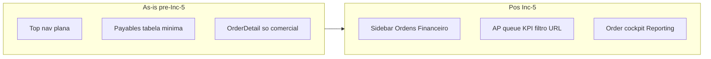

# EPIC Controle — Análise de Reconstrução e Roadmap V2

> **Natureza deste documento.** Fonte operacional da reconstrução V2: fases, status, gates, ADRs, evidências e bloqueios. O **destino** funcional/arquitetural está em [`docs/v2/BLUEPRINT_SISTEMA_EPIC_V2.md`](docs/v2/BLUEPRINT_SISTEMA_EPIC_V2.md). Índice: [`docs/README.md`](docs/README.md).
>
> **Convenção de rótulos.** `[FATO]` = comprovado por execução/leitura. `[INFERÊNCIA]` = interpretação sustentada por evidência. `[HIPÓTESE]` = ainda não validada. `[DECISÃO]` = decisão vigente.

### Cabeçalho de sincronização documental

| Campo | Valor |
|---|---|
| Versão / revisão documental | **0.5.42** — Inc-6 **DONE** · Order-to-Pay **DONE** · visual Horizon A **ACCEPTED_WITH_MINOR_BACKLOG** · Etapa 9/9V **DONE** |
| Última atualização material | **2026-07-30** |
| Fase atual | **Ingestão documental (J#3)** — **TODO** · Order-to-Pay (J#2) **DONE** |
| Última fase concluída | **Inc-6 / Order-to-Pay (J#2)** — E2E/goldens/aceite |
| Próxima fase | **Ingestão documental (J#3)** — sob pedido explícito |
| Working tree relevante | `main` @ `5ccdc5b` + WIP Onda D / Etapa 9V / Inc-6 (sem commit automático) |
| Commit / checkpoint de referência | Tip: `5ccdc5b` · Checkpoint pré-Fundação: `checkpoint/pre-foundation` @ `7d7f398` |
| Blueprint canônico | **v0.2.8** — Heroes-only operacional; Supplier bulk; REQ-V2-REP-001/002 |
| UI/UX candidato | **v3.10** — MCK **v1.1** · Handoff **v1.0** · Etapa 9 **DONE** · visual Horizon A **ACCEPTED_WITH_MINOR_BACKLOG** · Etapa 9V **DONE**; **não canônico** até promoção Blueprint |

# STATUS ATUAL — LEITURA EM 2 MINUTOS

## UI/UX

| Bloco | Status | Próxima ação |
|---|---|---|
| Fundação visual e Horizon A funcional | DONE | — |
| Arquitetura adaptativa A0/A1 | DONE técnico | — |
| Piloto SCR-008 Contas a pagar | APPROVED_FOR_PROGRESSION | Aceite visual externo opcional (não bloqueia Inc-6) |
| Onda C — Pedidos/Faturas/Pagamentos | DONE técnico | — |
| Onda D — detalhes e formulários | DONE | — |
| Gaps funcionais Horizon A | DONE (MINOR_BACKLOG explícito) | Backlog menor só |
| Polish e aceite visual Horizon A | DONE · ACCEPTED_WITH_MINOR_BACKLOG | — |

**Quantidade de blocos visuais Horizon A restantes: 0** (MINOR_BACKLOG / aceite externo SCR-008 não bloqueiam backend).

## Backend / produto completo

| Marco | Status |
|---|---|
| Fundação | DONE |
| Order-to-Pay Inc-1…Inc-6 | **DONE** |
| Ingestão documental | TODO |
| Logística | TODO |
| Aduana + Inventory | TODO |
| Costing + Reconciliation | TODO |
| Dashboard/read models | TODO |
| Aceite final e arquivamento V1 | TODO |

**Quantidade de marcos principais restantes do programa completo: 6**

## Próxima ação autorizada

- Backend: **Ingestão documental (J#3)** — sob pedido explícito;
- UI: apenas MINOR_BACKLOG / aceite externo SCR-008 sob pedido;
- Horizon B1 (artefato externo) permanece **NOT_STARTED** — reconciliar pós-Inc-6 se priorizado.

### Painel executivo de progresso

Visão curta do progresso V2. Detalhes técnicos, gates e comandos: §J / §N / §O.

| Fase / incremento | Objetivo | Status | Última evidência | Próximo passo | Bloqueio relevante |
|---|---|---|---|---|---|
| 0B — Contrato | Roadmap + Blueprint aprovados | **DONE** | 2026-07-22 APPROVED | — | — |
| Fundação | Layout `v1/`+`v2/`; Identity/Audit/Documents; harness | **DONE** | Gates §N verdes (WIP) | — | — |
| Inc-1 Catalog + Orders | Supplier/Product; Order DRAFT→CONFIRM/CANCEL | **DONE** | Gates O.1 (§O.1) | — | — |
| Inc-2 Billing + Payables | Invoice + Terms → Payables; sconto | **DONE** | Gates O.2 (§O.2); DEC-SCONTO-ITEM fechada | — | — |
| Inc-3 Payment + Allocation | Payment; alocação em Payable | **DONE** | Gates O.3 (§O.3) | — | — |
| Inc-4 FX (4A+4B) | Três visões; plan/quote/execution | **DONE** | §O.4 remediação 2026-07-23 (006) | — | — |
| Inc-5 Fila AP + cockpit | Fila AP; cockpit via Reporting; UX Foundation | **DONE** | §O.5 + UX-0; E2E `inc5-ap-cockpit` @8082/`epic_v2_test` | — | — |
| Inc-6 E2E/goldens/aceite | E2E; equivalência `parse_it`; DoD J#2 | **DONE** | §O.6; `docs/v2/etapa-inc-6/` | — | — |
| Ingestão | Adapters + contrato canônico | **TODO** | §J#3 | Após Order-to-Pay | — |
| Logística | Shipment + PackingList | **TODO** | §J#4 | Após Ingestão | — |
| Aduana + Inventory | ImportProcess 1:N; estoque | **TODO** | §J#5 | Após Logística | — |
| Costing/Reconciliation | Landed cost + pares | **TODO** | §J#6 | Após Aduana | — |
| Dashboard | Read models | **TODO** | §J#7 | Após Costing | — |
| Aceite final | SC-* + arquivar V1 | **TODO** | §J#8 | Após Dashboard | — |

### Precedência interna deste Roadmap `[DECISÃO]`

Não há “trecho antigo vence trecho novo”. Em caso de aparente conflito **dentro deste arquivo**, usar esta ordem de autoridade por assunto:

| Assunto | Fonte canônica **neste** Roadmap | Não usar como estado atual |
|---|---|---|
| Produto / arquitetura-alvo / aceite | **Blueprint V2** (fora deste arquivo) | A–E como se fossem destino |
| ADRs vigentes | **§M.1** | Inferências pré-ADR em A–E |
| Fases e status atuais | **§J** | Narrativa de diagnóstico em A–E/B.1–B.2 |
| Próxima ação autorizada | **§L** (+ plano §O) | Gates históricos já superados |
| Evidências da Fundação | **§N** (+ baselines em §M.0) | Qualquer frase pré-Fundação que diga o contrário |
| Diagnóstico / baseline histórico | **§A–E** e **§B.1–B.2** | Como se descrevessem o layout ou status de hoje |

**Regra anti-regressão documental:** texto marcado como pré-Fundação / histórico / diagnóstico **nunca** prevalece sobre §B.0, §I, §J, §L, §M.0 ou §N.

### Autoridade documental por assunto `[DECISÃO]`

| Assunto | Canônico |
|---|---|
| Produto, comportamento, telas, fluxos, aceite, modularidade-alvo | Blueprint V2 |
| Fases, status, gates, ADRs, evidências, bloqueios | Este Roadmap (§J / §M.1 / §N / §L conforme acima) |
| Método de investigação e implementação no código/docs V2 | `.cursor/rules` V2 (+ router global) |
| Legado V1 | `docs/v1/README.md` (histórico arquivado) + monólito em `v1/` |
| Runtime | Código real (inspecionar) |

**Checklist V1 ≠ DoD V2.**

---

## Sumário

- [A. Veredito executivo](#a-veredito-executivo)
- [B. Estado comprovado (atual + baselines históricos)](#b-estado-atual-comprovado)
- [C. Confirmação/refutação das hipóteses](#c-hipoteses)
- [D. Matriz de reaproveitamento](#d-matriz-de-reaproveitamento)
- [E. Matriz comparativa das três estratégias](#e-matriz-comparativa)
- [F. Arquitetura-alvo (canônica)](#f-arquitetura-alvo)
  - [F.1–F.8 Ownership, modelo, telas, slice — detalhe no Blueprint](#f-arquitetura-alvo)
- [G. Arquitetura da nova importação](#g-nova-importacao)
- [H. Estratégia de banco (sem migração de dados)](#h-banco)
- [I. Layout do repositório e transição](#i-transicao)
- [J. Roadmap executável (único)](#j-roadmap)
- [K. Riscos](#k-riscos)
- [L. Próxima etapa lógica](#l-proxima-etapa)
- [M. Governança V2](#m-governanca)
- [N. Fundação técnica (executada)](#n-fundacao)
- [O. Execução Order-to-Pay — Inc-1…Inc-5 concluídos](#o-order-to-pay-plan)
  - [O.1 Inc-1 — Catalog mínimo + Orders](#o-order-to-pay-plan)
  - [O.2 Inc-2 — Billing + Payables](#o-order-to-pay-plan)
  - [O.3 Inc-3 — Payment + PaymentAllocation](#o-order-to-pay-plan)
  - [O.4 Inc-4 — FX mínimo + Documents + Audit](#o-order-to-pay-plan)
  - [O.5 Inc-5 — Fila AP + cockpit via Reporting](#o-order-to-pay-plan)
  - [O.6 Inc-6 — E2E, walkthrough, goldens e aceite](#o-order-to-pay-plan)
- [Apêndice — Evidências](#apendice-evidencias)

---

<a id="a-veredito-executivo"></a>
## A. Veredito executivo

**Recomendação primária: `[DECISÃO]` Alternativa B — Reconstrução modular com reaproveitamento seletivo.** Reescrever modelo, fronteiras, APIs, UI e pipeline de ingestão; **portar com testes** os cálculos validados (financeiro, câmbio/PnL, landed cost, conciliação) e o parser Heroes (como adapter).

**Segunda melhor: Alternativa C.** Viável porque **nenhum dado precisa ser migrado** (premissa definitiva abaixo), mas desperdiça ~4.000 linhas de lógica já testada.

**Alternativa A — evolução — desaconselhada.** O modelo V1 usa a ordem como contêiner (`importation_id` em quase tudo); um Numerário de teste prova **1 DUIMP → N faturas** — o esquema V1 não representa isso.

### Premissa definitiva de dados `[DECISÃO]`

**Todo o conteúdo atual do workspace é exclusivamente de teste e integralmente descartável:**

- banco `epic_importacao` (incluindo registros com aparência operacional);
- backups SQL e de anexos;
- anexos, planilhas, PDFs e ZIPs;
- massa `DEMO-*` / `QA-*` / `E2E*`;
- ordens, faturas, pagamentos e usuários atuais.

**Não há dado produtivo a preservar, migrar, reconciliar ou reconstruir.**

Consequências:

| O quê | Decisão |
|---|---|
| Banco V2 | Começa **vazio** (`epic_v2`) |
| Massa de teste V2 | **Determinística** (seeds/fixtures versionados) |
| PDFs / planilhas atuais | **Fixtures / golden files** — não são fontes oficiais de produção |
| Comparação V1↔V2 | Apenas **comportamento, contratos e cálculos** |
| Migração de linhas V1→V2 | **Nenhuma** |
| Conciliação de registros no “corte” | **Não se aplica** |
| Inspeção de backups SQL para migração | **Não se aplica** |

### Layout de repositório `[DECISÃO]` (ADR-04 / ADR-13)

```text
root/
├── .git/
├── .gitignore
├── .cursor/                 # router + rules V1/V2 (split feito na Fundação)
├── docs/                    # documentação consolidada
├── ROADMAP_V2_EPIC.md       # este arquivo (fonte operacional V2)
├── v1/                      # monólito legado (consulta + goldens)
└── v2/                      # app novo (Fundação+; Order-to-Pay em diante)
```

**Layout-alvo (ADR-04/13) — status de execução:** materializado na Fundação (`DONE` no working tree). Ver estado atual em §B.0 / §I / §N — **não** há pendência de “layout inicial não executado”.

**Política Git:** autoridade única em [`.cursor/rules/epic-project-router.mdc`](.cursor/rules/epic-project-router.mdc) — trabalhar em `main`; commits/branches só com pedido explícito; nunca descartar WIP.

---

<a id="b-estado-atual-comprovado"></a>
## B. Estado comprovado

### Linha do tempo de baselines (ler nesta ordem)

| Marco | Onde | O que descreve |
|---|---|---|
| Diagnóstico / baseline inicial | §B.1–B.2, §A–E | Monólito **na raiz**; motivação da Alt. B — **histórico** |
| Checkpoint pré-move | §M.0 (pré-move) | SHA `7d7f398` antes do move — **histórico** |
| Pós-move V1 | §M.0 (pós-move) + §N.2–N.5 | Monólito em `v1/`; sem regressão de path — **histórico da Fundação** |
| **Estado atual V2** | **§B.0**, §I, §J, §L, §N, painel executivo | Layout `v1/`+`v2/`; Fundação **DONE**; Order-to-Pay **IN_PROGRESS** (Inc-1…Inc-5 DONE; Inc-6 pendente) |

### B.0 Estado atual pós-Inc-6 `[FATO]` (2026-07-30) — **autoridade de “como está hoje”**

| Item | Valor |
|---|---|
| Layout | `root/{.git,.cursor,docs,ROADMAP,README,v1,v2}` — **sem** `app/`/`frontend/` na raiz |
| Branch ativa | **`main`** @ `5ccdc5b` + WIP |
| Checkpoint segurança | `checkpoint/pre-foundation` @ `7d7f398` (preservada) |
| Working tree | Tip + WIP Onda D / 9V / Inc-6 (política: sem commit automático nesta tarefa) |
| V1 | Monólito em `v1/` — porta **8080**, banco `epic_importacao` |
| V2 | App em `v2/` — porta **8081** (ops) / **8082** (E2E), bancos `epic_v2` / `epic_v2_test` · módulos: foundation…treasury + reporting + foothold **ingestion** (`parse_it`) |
| Orders / Billing / Treasury / Reporting | Inc-1…Inc-6 **DONE**; Order-to-Pay J#2 **DONE** |
| Alembic | **`006_fx_integrity` (head)** |
| pytest V2 | **103 passed, 0 xfailed** |
| Docs | Blueprint **v0.2.8**; Roadmap **v0.5.42**; UI/UX candidato **v3.10**; Etapa 9/9V **DONE**; visual **ACCEPTED_WITH_MINOR_BACKLOG**; evidências Inc-6 `docs/v2/etapa-inc-6/` |
| Cursor | Router global + V1 `v1/**,docs/v1/**` + V2 `v2/**,docs/v2/**,ROADMAP,docs/README.md` |
| Harness / goldens | **DONE** — characterization V1 parse + contract V2 + equivalência real |
| Próxima etapa | **Ingestão J#3** (**TODO**) |

### B.1 Baseline histórico pré-Fundação `[FATO]` (diagnóstico — **não é estado atual**)

> Snapshot do monólito **ainda na raiz**, antes do move. Baseline de comparação apenas. Qualquer leitor que precise do layout de hoje deve usar **§B.0**.

- Monólito na raiz (à época): SPA React + FastAPI `/api`, porta **8080**; PostgreSQL `localhost:5433/epic_importacao`.
- `ROOT_DIR` = pai de `app/` (então a raiz do repo) — **obsoleto** após o move; hoje o monólito vive sob `v1/`.
- Python 3.10.11, Node 22.18, Alembic `001`→`014 (head)`.

### B.2 Validações dinâmicas históricas `[FATO]` (pré-Fundação / diagnóstico — **não é gate atual**)

| Verificação | Resultado (pré-Fundação / diagnóstico) |
|---|---|
| `pytest -q` | 31 falharam / 294 passaram / 1 skip (depois alinhado a 30f/294p/2s no checkpoint) |
| `tsc --noEmit` | ~28 erros |
| `vite build` | Passa (sem type-check) |
| Vitest / Playwright | 47p/1f · 27p/18f/11 blocked |
| Alembic | `014 (head)` |

Baselines oficiais pré×pós-move e evidências da Fundação: §M.0 / §N. Status de fase: §J.

### B.3 Dados — inventário e tratamento `[FATO]` + `[DECISÃO]`

Inventário histórico (amostra na época do diagnóstico): usuários, fornecedores, produtos, ordens, faturas, etc. em `epic_importacao`; fixtures sob `v1/tests/` após o move.

**Tratamento `[DECISÃO]`:** tudo descartável. A V2 **não** importa esses registros. Documentos selecionados → `v2/tests/fixtures/source_documents/`.

### B.4–B.7 Arquitetura V1 (histórica)

Ordem-hub, ciclos por import local, `order_central` mega-agregador, FE estruturalmente a reescrever — motivação da Alt. B. Código legado agora em `v1/`.

---

<a id="c-hipoteses"></a>
## C. Confirmação/refutação das hipóteses

| # | Hipótese | Conclusão |
|---|---|---|
| 1–7 | Ordem-contêiner; módulos autônomos; cockpit; FE/BE por tela; ingestão multi-documento | **Confirmadas** `[FATO]` |
| 8 | Reescrever mais simples que evoluir | **Confirmada** `[DECISÃO]` — zero migração de dados + FE descartável + Alt. B para preservar calculadores |

---

<a id="d-matriz-de-reaproveitamento"></a>
## D. Matriz de reaproveitamento

| Componente | Classificação | Destino |
|---|---|---|
| Enums / RBAC | **PORT_WITH_REVIEW** | Identity / vocabulário V2 |
| finance, fx_pnl, landed_cost, reconciliation | **PORT_WITH_TESTS** | Billing / Treasury / Costing / Reconciliation |
| Parser Heroes | **PORT_WITH_TESTS** | Ingestion (adapter) |
| Commit Heroes / ORM / routers / FE / api.ts / order_central | **REWRITE** / **RETIRE** | V2 limpa |
| Attachments / audit | **PORT_WITH_TESTS** | Documents / Audit |
| Scripts start/backup | **PORT_WITH_TESTS** | `v1/scripts` + novos em `v2/scripts` |
| Documentos de teste (PDFs/XLSX selecionados) | **PORT_WITH_TESTS** | Fixtures V2 (cópia seletiva) |
| Adapters PDF | **REWRITE (novo)** | Ingestion |

---

<a id="e-matriz-comparativa"></a>
## E. Matriz comparativa

Totais ponderados: **A ≈ 171 · B ≈ 316 · C ≈ 304**. `[DECISÃO]` **B**. Critério “migração de dados” favorece B e C igualmente (custo zero de dados).

---

<a id="f-arquitetura-alvo"></a>
## F. Arquitetura-alvo (canônica)

`[DECISÃO]` Monólito modular em **`v2/`** (FastAPI + SQLAlchemy + Postgres + React/Vite). Sem Docker/microservices/cloud.

**Detalhe normativo de módulos, entidades, telas, fluxos e manutenibilidade:** Blueprint §§3, 5, 6, 8, 13. Abaixo permanece o resumo operacional vinculado aos ADRs.

### F.1 Ownership e dependências (resumo)

Dependências de pacote (semântica Blueprint §5.16: `A --> B` = A depende da API pública de B): **Billing → Orders → Catalog**; **Treasury → Billing**; agregados **Order** | **Shipment** | **ImportProcess/DUIMP**. UI “Financeiro” une Billing+Treasury.

| Módulo | Possui | Proibido depender de |
|---|---|---|
| Orders | Order, OrderItem, termos comerciais | Billing, Treasury, Logistics, Customs, Costing |
| Billing | Proforma, Invoice, InvoiceItem, PaymentTerms, Payable | Treasury, Logistics, Customs |
| Treasury | Payment, PaymentAllocation, FX, Credit, Discount, BrazilCurrentAccount | Orders (direto), Logistics, Customs |
| Logistics | Shipment, ShipmentItem | Billing, Treasury, Costing |
| Customs | ImportProcess, CustomsDocument, Tax, Nationalization | Treasury |
| Inventory | InventoryMovement, EntrepostoMovement | Billing, Treasury |
| **Costing** | **Expense**, LandedCostVersion, components | Reporting (escrita) |
| Demais | Identity, Audit, Documents, Catalog, Ingestion, Reconciliation, Reporting, Foundation | Reporting não escreve domínio |

**Expense** = Costing. Tax = Customs. Modularidade interna: **ADR-14** + Blueprint §3.2 / §13.4.

### F.2–F.6 Modelo (ponte)

- Liquidação só via Payable; antecipo não alocado não reduz saldo (ADR-06).
- DUIMP → Invoice 1:N; Shipment sem `order_id` (ADR-12).
- Estados por agregado (ADR-09); `StockBalance` derivado (ADR-07); `document_links` em Documents (ADR-08).
- Pendências: DEC-DUIMP-MULTI-SHIP, DEC-ENDERECO; L-001, L-003.
- Especificação completa: Blueprint §6.

### F.7 Telas (ponte)

Financeiro, Ordens/cockpit, Ingestão, Logística, Aduana, Inventory, Costing/Reconciliation, Dashboard por último. Detalhe: Blueprint §8. Cockpit = read model (não `order_central`).

### F.8 Order-to-Pay (1º slice)

Order → Invoice+PaymentTerms → Payable → Payment+Allocation → FX → Document+Audit → fila → cockpit. Fixture: `Fattura_181` (acconti). Ingestão completa não é pré-requisito. Aceite: Blueprint SC-01… e §7 correlatos.

---

<a id="g-nova-importacao"></a>
## G. Arquitetura da nova importação

Pipeline: arquivo → identificação → hash imutável → adapter → contrato canônico → staging → revisão → commit idempotente → objeto operacional.

**Documentos de teste / golden files** (não “fontes de produção”):

| Fixture representativa | Destino de domínio | Extração? |
|---|---|---|
| Ordine PDF | Orders | Sim |
| Fattura / Fattura con acconti | Billing | Sim |
| FatturaDoganale | Customs | Sim |
| PackingList | Logistics | Sim |
| PrintDeclaration | Documents only | Não |
| Solicitação de Numerário | Customs + Costing | Sim (1 DUIMP → N invoices) |
| Heroes XLSX | Orders/Billing via adapter | Sim |

Cada fixture em `v2/tests/fixtures/source_documents/` deve ter **cenário + resultado esperado** documentados. Cópia **seletiva**, não indiscriminada.

---

<a id="h-banco"></a>
## H. Estratégia de banco (sem migração de dados)

`[DECISÃO]`

1. Novo banco **`epic_v2`**, schema novo (Alembic próprio em `v2/`).
2. **V2 começa vazia.**
3. Massa de teste = seeds/fixtures **determinísticos** versionados no repositório.
4. **Nenhum** dado de `epic_importacao`, backups SQL ou anexos V1 é migrado.
5. Comparação V1↔V2 = **comportamento / contratos / cálculos** (caracterização + equivalência), nunca inventário de linhas.
6. Backups SQL V1: podem permanecer arquivados em `v1/backups/` por curiosidade histórica; **não** entram no plano de migração nem exigem inspeção para go-live.
7. Mapeamento mental V1→V2 (só para portar regras): `importation_orders` → Order + ImportProcess; invoices → Billing; payments → Treasury; etc. — **não** script de ETL.

---

<a id="i-transicao"></a>
## I. Layout do repositório (pós-Fundação)

### I.1 Layout atual `[FATO]`

```text
root/
├── .git/
├── .gitignore
├── .cursor/                      # router + rules V1/V2
├── docs/
│   ├── README.md                 # índice canônico
│   ├── v2/BLUEPRINT_SISTEMA_EPIC_V2.md
│   └── v1/                       # histórico: *_V1.md, CURSOR_RULES_*, archive/
├── ROADMAP_V2_EPIC.md
├── README.md
├── v1/                           # monólito legado executável
└── v2/                           # monólito modular (Foundation+)
```

### I.2 Raiz

`.git`, `.gitignore`, `.cursor/`, `docs/`, `ROADMAP_V2_EPIC.md`, `README.md`. Sem `.env`/`.venv` compartilhados.

### I.3 V1 (`v1/`)

Monólito completo executável (app, frontend, alembic, tests, scripts, data, backups, bats, `.env`). Referência de comportamento e goldens.

### I.4 Fixtures

Em `v1/tests/**`; cópias seletivas em `v2/tests/fixtures/source_documents/`.

### I.5 `.env`, `.venv`, Cursor Rules `[DECISÃO]` / `[FATO]`

| Item | Estado atual |
|---|---|
| `.env` | `v1/.env` e `v2/.env` separados |
| Bancos | `epic_importacao` (V1) · `epic_v2` / `epic_v2_test` (V2) |
| Portas | V1 **8080** · V2 **8081** |
| Dependências | Isoladas (`v1/.venv`, `v2/.venv`, node_modules por app) |
| Cursor | Router global; V1 `v1/**,docs/v1/**`; V2 `v2/**,docs/v2/**,ROADMAP,docs/README.md` |
| Git | Política em `epic-project-router.mdc` — `main` default; sem commit automático |

### I.6 Comparação V1↔V2

Caracterização / equivalência de cálculos e contratos — **sem** reconciliação de linhas de banco.

---

<a id="j-roadmap"></a>
## J. Roadmap executável (único)

| # | Fase | Objetivo | Blueprint | Gate de saída |
|---|---|---|---|---|
| 0 | **0B — Contrato** | Roadmap + Blueprint | §§1–17 | **DONE / APPROVED** (2026-07-22) |
| 1 | **Fundação técnica** | Move `v1/`, scaffold `v2/`, Identity/Audit/Documents, OpenAPI+client, `epic_v2` vazio, harness/goldens de caracterização, **modularidade** | §§5.1–5.4, 11, 13.4; REQ-V2-MOD-001 | **DONE no working tree** (código + gates §N; commit **não** exigido) |
| 2 | **Order-to-Pay** | Orders + Billing + Treasury (F.8); equivalência `parse_it` vs golden | §§5.6–5.8, 7.1–7.6, 8.3–8.13 | **DONE** — Inc-1…Inc-6; DoD J#2 (§O.6); evidência `docs/v2/etapa-inc-6/` |
| 3 | **Ingestão documental** | Contrato canônico + adapters + fixtures | §§5.9, 7.2, 10 | Golden files + commit idempotente |
| 4 | **Logística** | Shipment + PackingList | §§5.10, 7.7–7.8 | DoD |
| 5 | **Aduana/DUIMP + Inventory** | ImportProcess 1:N + StockBalance | §§5.11–5.12, 7.9–7.11 | DoD com fixture Numerário |
| 6 | **Costing/Reconciliation** | Expense + landed cost + pares | §§5.13–5.14, 7.12–7.16, 9 | Equivalência de **cálculo** vs V1 |
| 7 | **Dashboard** | Read models | §§5.15, 8.2, 12 | DoD |
| 8 | **Aceite final e arquivamento V1** | Cenários + equivalência + arquivar V1 | §15 SC-* | V2 aceita; V1 arquivada |

> Fase 8 **substitui** “Corte da V1 com conciliação de registros”.

---

<a id="k-riscos"></a>
## K. Riscos

| Risco | Mitigação |
|---|---|
| Regressão ao portar cálculo | Caracterização + equivalência (comportamento) |
| Layout PDF/XLSX instável | Adapters versionados + fixtures + revisão humana |
| Move `v1/` quebrar paths | Mitigado na Fundação (§N): baseline pós-move = pré-move; sem regressão |
| `.venv` com path absoluto | Recriar ambientes |
| Reescrita horizontal | Fatias verticais + DoD |
| L-001 / L-003 | Hipótese provisória; isolar na fase |

---

<a id="l-proxima-etapa"></a>
## L. Próxima etapa lógica

**Próxima etapa:** planejar e executar **Ingestão documental (J#3)** —
contrato canônico + adapters + fixtures (sob pedido explícito).

**Contexto `[FATO]`:** 0B = DONE/APPROVED · Fundação = DONE · Inc-1…Inc-6 = **DONE** · Order-to-Pay = **DONE** · `main` @ `5ccdc5b` + WIP · checkpoint `7d7f398` preservada · política: sem commit/branch/stash automático nesta sync documental.

Gates de Inc-1…Inc-6 e DoD J#2 estão **superados** — não são bloqueios atuais.

---

<a id="m-governanca"></a>
## M. Governança V2

### M.0 Estado

`0B APPROVED · Fundação J#1 DONE · Inc-1…Inc-6 DONE · Order-to-Pay J#2 DONE · Ingestão J#3 TODO · main @ 5ccdc5b + WIP · checkpoint/pre-foundation @ 7d7f398 preservada · Blueprint v0.2.8 · Roadmap v0.5.42 · UI/UX candidato v3.10 · Handoff v1.0 · MCK v1.1 · Etapa 9 DONE · visual Horizon A ACCEPTED_WITH_MINOR_BACKLOG · Etapa 9V DONE · §M.23 SUPERSEDED · SCR-008 APPROVED_FOR_PROGRESSION · Onda C/D DONE · E8-A/E8-B APROVADOS.`

#### Git — normalização pós-Fundação (2026-07-22) `[FATO]`

| Item | Valor |
|---|---|
| Procedimento | `git symbolic-ref HEAD refs/heads/main` + `git reset` (índice); working tree **intacto** |
| Branch **ativa** / HEAD | **`main`** @ `f9a83ed` (= `origin/main`) |
| Checkpoint | `checkpoint/pre-foundation` @ `7d7f398` **preservada** — **não** é o HEAD atual |
| Commits novos nesta sync | **Nenhum** (tarefa só documental) |
| WIP / tip | Inc-1…Inc-4 no tip `f9a83ed` + WIP remediação Inc-4 (`006`/código/docs; sem commit automático) |
| Política | `.cursor/rules/epic-project-router.mdc` — main default; commit só sob pedido |
| Gate de fase | Fundação = **DONE** independentemente de commit |

**Leitura dos diffs (sem alterar estado):** `git diff --stat main` = checkpoint + Fundação + posteriores; `git diff --stat checkpoint/pre-foundation` = Fundação + posteriores.

#### Verificação curta pós-normalização Git `[FATO]`

| Check | Resultado |
|---|---|
| pytest V2 (arch+smoke+golden schema) | **11 passed, 1 xfailed** |
| `npm run check:api-drift` | Regenerado client → **up to date** |
| `npm run build` (v2/frontend) | **OK** |
| GET `/api/health` :8081 | **ok** (servidor já em execução) |

#### Consolidação documental (2026-07-22) `[FATO]`

| Item | Resultado |
|---|---|
| Canônicos V2 | `ROADMAP_V2_EPIC.md` · `docs/v2/BLUEPRINT_SISTEMA_EPIC_V2.md` · `docs/README.md` |
| Blueprint status | **Aprovado** — canônico atual **v0.2.8** (fechamento Inc-5; base UX-0 v0.2.7) |
| V1 histórico | `docs/v1/` + `archive/` |

#### Checkpoint e baseline pré-move (2026-07-22)

| Item | Valor |
|---|---|
| Branch | `checkpoint/pre-foundation` |
| SHA | `7d7f39806a76972895ba60ec162d484eb410d175` |
| Import app | OK (`Epic Importações`) |
| Alembic | `014 (head)` |
| pytest | **30 failed / 294 passed / 2 skipped** (125s) |
| tsc | exit 2 (~28 erros; drift/imports) |
| vite build | OK (467 KB JS) |
| vitest | **1 failed / 47 passed** (`productColumnPrefs`) |
| health | OK |
| login/me | 200 (httpx) |
| backup-db.ps1 | OK → `backups/db/epic_importacao_20260722_142628.sql` |

#### Baseline pós-move V1 (mesmo checkpoint; CWD=`v1/`)

| Item | Valor | vs pré-move |
|---|---|---|
| Import | OK | match |
| Alembic | `014 (head)` | match |
| pytest | **30 failed / 294 passed / 2 skipped** | match (sem falha nova de path) |
| tsc / vite / vitest | mesmo padrão de falhas pré-existentes | match |
| health / login / me | 200 | match |
| backup-db.ps1 | OK → `v1/backups/db/` | path alinhado |

#### Scaffold V2 (2026-07-22)

| Item | Valor |
|---|---|
| Layout | `v2/app/{foundation,identity,audit,documents}` — **sem** stubs Orders/Billing/… |
| Bancos | `epic_v2` + `epic_v2_test` (Postgres `localhost:5433`) |
| Alembic V2 | `001` baseline |
| Porta | **8081** |
| pytest V2 | **11 passed, 1 xfailed** (arch + smoke + golden schema) |
| health/login/docs/audit | 200 (httpx smoke) |
| OpenAPI | `npm run generate:api` + `check:api-drift` OK |
| FE | login + shell autenticado; `vite build` OK |
| Goldens / harness | **DONE** — `parse_it_number` / `parse_it_date` via `v1/scripts/export_characterization_goldens.py --out-dir`; schema/presença verdes |
| Equivalência de cálculo V2↔golden | **Fora do DoD da Fundação** — tracked em §O Inc-6 (Order-to-Pay) |

**DoD:** implementação + teste automatizado + E2E + walkthrough + evidência neste doc + aceite operacional (quando couber) + roadmap atualizado.

### M.1 ADRs

| ADR | Decisão | Status |
|---|---|---|
| ADR-01 | Monólito modular; stack atual | Aceita |
| ADR-02 | Alt. B — portar calculadores com testes | Aceita |
| ADR-03 | Separar Order / Shipment / ImportProcess | Aceita |
| ADR-04 | Layout `root/{docs,ROADMAP,v1,v2}`; bancos e portas separados | Aceita |
| ADR-05 | OpenAPI + client TS gerado | Aceita |
| ADR-06 | Liquidação só via Payable | Aceita |
| ADR-07 | StockBalance derivado | Aceita |
| ADR-08 | `document_links` por Documents | Aceita |
| ADR-09 | Estados por agregado | Aceita |
| **ADR-10** | **Todo conteúdo atual descartável; V2 banco vazio; massa determinística; fixtures ≠ produção; comparação só comportamento/cálculos; zero migração de dados.** Reconfirmada pelo usuário em **2026-07-22**: registros com aparência operacional também pertencem à massa de teste; **inventários nominais / filtros `DEMO`/`QA`/`E2E` não alteram essa decisão** e não são gate de fase. Auditoria de inventário (só leitura, não bloqueante) pode ocorrer à parte, sem excluir dados e sem reclassificar ADR-10 por heurística de nomes. | **Aceita (definitiva)** |
| ADR-11 | Orders ← Billing ← Treasury; Expense em Costing | Aceita |
| ADR-12 | DUIMP→Invoice 1:N; Shipment sem order_id | Aceita |
| ADR-13 | `.env`/deps isolados; recriar venv V2; Cursor Rules revisadas | Aceita |
| **ADR-14** | **Modularidade interna e limites de complexidade** — package-by-domain; ownership; contratos públicos; internals privados; **grafo canônico acíclico** (Blueprint §5.16: `A-->B` = A depende da API pública de B); Identity/Audit/Documents **sem ciclos** (Audit/Documents com actor opaco; Identity orquestrado via Foundation); routers/páginas finos; gatilhos de revisão; testes AST de imports (**inclui falha V2→V1**); revisão manual de coesão/god files; exceções gerado/migrations/fixtures; **proibição absoluta** de import `v2/**`→`v1/**` inclusive testes; caracterização só via golden | **Aceita** |
| **ADR-15** | **Audit atômico** — ação crítica + `Audit.record_event` na **mesma** `UnitOfWork` / commit PostgreSQL; Foundation orquestra Identity/Documents + Audit; proibido commit da entidade + audit “best effort” depois | **Aceita** |
| **ADR-16** | **V1 congelada funcionalmente** desde **2026-07-22**. Não recebe features, redesign de UI, evolução de modelo ou execução de pendências históricas F0–F12. Alterações em `v1/**` só para: manter baseline executável; corrigir geração de goldens; risco crítico de segurança/perda de dados; paths/scripts indispensáveis à caracterização V1→golden. | **Aceita** |

### M.2 GATE-FONTES — resolvido e fechado ✅

- Sem servidor/banco de produção separado.
- **Todo** o workspace (banco, backups, anexos, planilhas, PDFs, usuários, DEMO/QA/E2E) = teste descartável.
- **Não** há repopulação operacional a partir de “fontes”.
- **Não** há conciliação de registros V1↔V2.
- Documentos atuais = candidatos a **fixture/golden file** apenas.

### M.3 Cenários canônicos

Índice operacional; especificação de aceite em **Blueprint §15** (SC-01…SC-17):

1. Ordem multi-invoice · 2. Scadenze → N Payables · 3. Allocations · 4. Antecipo não alocado · 5. Multi-embarque via ShipmentItem · 6. Embarque parcial · 7. DUIMP 1:N invoices · 8. Retificação · 9. Nacionalização parcial · 10. Entreposto · 11. Crédito cruzado · 12. Landed cost SKU · 13. Documento supersedido · 14. Fechamento/reabertura · (+ criação manual, Ordine, conciliação no Blueprint).

### M.4 Rastreabilidade Order-to-Pay

Inalterada em substância (POST /orders, /invoices, /payments, /fx, /payables; `GET /orders/{id}/summary` via **Reporting**; documents; audit). Matriz REQ: Blueprint §17.

### M.5 Bloqueios e decisões abertas

| ID | Status | Bloqueia | Notas |
|---|---|---|---|
| L-001 | Aberto | Fase Conciliação / fechamento com tolerâncias | Não inventar política definitiva |
| L-003 | Aberto | Credit/CC BR avançado | Isolar na fase Treasury |
| DEC-DUIMP-MULTI-SHIP | Aberto | Customs multi-embarque | — |
| DEC-ENDERECO | Aberto | Modelo de endereços | — |
| **DEC-SCONTO-ITEM** | **Fechada** | Inc-2 Billing | `discount_type` NONE\|UNIT_AMOUNT\|PERCENT em InvoiceItem; HALF_UP 2 casas; Payable=net |
| **DEC-ACCONTO-INVOICE** | **Pendente** | Tipagem Billing / ingestão Fattura | Alvo `PROFORMA\|ACCONTO\|FINAL`; código V2 ainda só PROFORMA\|FINAL; ver Blueprint §5.7 |

#### DEC-SCONTO-ITEM — fechada (2026-07-22, Inc-2)

**Decisão:** sconto de linha ∈ **InvoiceItem** com representação dual (Fattura `% Sc` + Heroes €/un). `discount_type` xor; DRAFT pode incompleto; emissão exige tipo definido; derivados bruto/desconto/líquido; residual scadenze % na última parcela; desconto global Treasury fora do Inc-2.

#### Destino de itens históricos V1 (congelamento ADR-16)

| Item | Destino |
|---|---|
| **P1-b / P1-c sconto DA SPEDIRE** | Encerrado como implementação/política V1 (preview + persistência dispatch + não-propagação). Regra de negócio transferida para **DEC-SCONTO-ITEM** na V2. (Código rotula a não-propagação como P1-c; o gap comercial de sconto no preview/custo é o mesmo tema.) |
| **Produtos slug-shell** | Dívida de massa V1 (`is_slug_shell` no match Heroes). **Não migrar** para V2. Catalog V2 começa limpo. |
| **Redesign da fila AP** | **Não** implementar na V1. Já no Blueprint **§8.9**; execução no **Inc-5** Order-to-Pay (fila AP + cockpit read model). |

### M.6 Changelog

- **2026-07-30 — Rev 0.5.42 / Inc-6 Order-to-Pay aceite:** Foothold `app.ingestion.parse_it` + equivalência vs goldens V1; contract goldens V2 (`billing_line`, `scadenze_split`, `fx_canonical`); xfail removido; `npm run e2e:inc-6`; pytest **103p**/0 xfail; `e2e:horizon-a` **18p**; OpenAPI OK. Inc-6 **DONE**; Order-to-Pay J#2 **DONE**; próxima = Ingestão J#3. Evidências `docs/v2/etapa-inc-6/`. §O.6.
- **2026-07-30 — Rev 0.5.41 / Onda D + polish + aceite Horizon A:** D0…D6. `GET /api/payables/{id}`; scan FX eliminado; details RO + CQ; forms + parcial create; cancel/without-doc; idempotency allocate; polish 12 SCR. E2E **18p** (`e2e:horizon-a`); bundle 282648→290180 B; 0 deps. Onda D **DONE**; polish **DONE**; visual **ACCEPTED_WITH_MINOR_BACKLOG**; Etapa 9/9V **DONE**; Inc-6 **TODO** *(supersedido 0.5.42)*; Order-to-Pay **IN_PROGRESS** *(supersedido 0.5.42)*. Evidências `docs/v2/etapa-9v/adaptive-d/`. §M.28.
- **2026-07-30 — Rev 0.5.40 / Onda C filas adaptativas:** SCR-008 → **APPROVED_FOR_PROGRESSION**. Migrados SCR-003/006/010 (`columns` + FilterBar primary). E2E **17p**; bundle +1201 B; 0 deps. HARD STOP removido. Onda D **TODO**. Etapa 9/9V PARTIAL; visual PENDING_EXTERNAL_REVIEW; Inc-6 TODO. Evidências `docs/v2/etapa-9v/adaptive-c/`. §M.27.
- **2026-07-30 — Rev 0.5.39 / Visão executiva “2 minutos”:** Seção **STATUS ATUAL** no topo (UI 5 blocos restantes; backend 7 marcos restantes). Sem mudança de status técnico. Onda C / Inc-6 / visual **inalterados**.
- **2026-07-30 — Rev 0.5.38 / Fechamento piloto SCR-008:** Status **PILOTO_READY_FOR_EXTERNAL_REVIEW**. Matriz 1024…1920 + fixture adversa; rail 56px@1024; nowrap Saldo/Valor; E2E **16p** com build no ciclo; guard `test:e2e-guard`; ASIS/§M.23 sincronizados. Onda C **BLOCKED**. Evidências `docs/v2/etapa-9v/adaptive-b/`. §M.26.
- **2026-07-30 — Rev 0.5.37 / Higiene baseline E2E:** §M.23 **SUPERSEDED** (corrida mediu `frontend/dist` obsoleto; ver §M.25). `npm run e2e` passa a **buildar dist** antes do uvicorn. Cobertura: rail 56px **sem** assert E2E dedicado (viewports tip. 1366/1440 > 1100); unit OT columns **3**; FilterBar adaptativa **0**; rail **0**. Onda C / Etapa 9/9V / visual **inalterados**. §M.25.
- **2026-07-30 — Rev 0.5.36 / Arquitetura adaptativa A0+A1+B:** AS-IS pós C-001…C-021 **confirmado**; após rebuild `dist`, patches **(A)** C-010 Abrir e **(C)** locator pagamento. **A0** tokens/CQ/utils. **A1** OT columns, FilterBar, rail. **B** piloto SCR-008. E2E **16p**; unit **56p**. **HARD STOP** Onda C. §M.24.
- **2026-07-30 — Rev 0.5.35 / Rebaseline E2E pós-campanha estrutural:** **DONE** na época · **SUPERSEDED** por §M.24/§M.25/§M.26. Registro original: **15 passed / 0 failed** · **0 patches** (naquele instante). **Causa:** dist stale sem build no `e2e.mjs`. Log: `docs/v2/etapa-9v/rebaseline-e2e/logs/rebaseline-e2e.txt`. §M.23.
- **2026-07-29 — Rev 0.5.34 / Etapa 9V — VF fechamento:** Checkpoints A–E verdes. Fundação DS + 12 SCR recompostas; 24 screenshots; E2E 15p @ epic_v2_test; unit 49p. V1/V2/V3 tecnicamente DONE; Etapa 9/9V **PARTIAL**; visual **PENDING_EXTERNAL_REVIEW**; veredito interno `READY_FOR_EXTERNAL_REVIEW`. Evidências `docs/v2/etapa-9v/grupo-VF/`. Inc-6=TODO. §M.22.
- **2026-07-29 — Rev 0.5.33 / Etapa 9V — VF abertura + Checkpoint A:** Revisão externa rejeitou V1/V2 DONE (conteúdo OK; composição/hierarquia/acabamento PARTIAL). Governança corrigida: V1 **PARTIAL**, V2 **PARTIAL**, V3 **IN_PROGRESS**, visual **NOT_ACCEPTED**. Fundação DS. §M.21.
- **2026-07-29 — Rev 0.5.32 / Etapa 9V — Grupos V1+V2:** Filas SCR-003/006/008/010 e detalhes SCR-005/007/009/012 com apresentação corporativa (formatadores V0 aplicados; alertas/labels PT; enrichment `order_code`/`supplier_name` aditivo). Gates unit+pytest+build+E2E `epic_v2_test`. Evidências `docs/v2/etapa-9v/grupo-V1-V2/`. Status de V1/V2 **supersedido** pela 0.5.33 (PARTIAL). §M.20.
- **2026-07-29 — Rev 0.5.31 / Etapa 9V — governança + Grupo V0:** Etapa 9 corrigida para **PARTIAL**; implementação funcional Horizon A entregue; aceite visual **NOT_ACCEPTED**; Etapa 9V **PARTIAL**; auditoria 9V **DONE**; Grupo V0 **DONE**. Formatadores, StatusBadge contextual, EntityRef, RowLink, shell densidade, PaymentResponse.supplier_name. Evidências `docs/v2/etapa-9v/grupo-V0/`. V1 NÃO INICIADO. Inc-6=TODO. UI/UX/Handoff/MCK/Sistema preservados. §M.19.
- **2026-07-29 — Rev 0.5.30 / Etapa 9 Horizon A (Grupos A–D):** implementação funcional **entregue** (I9-0…I9-10). Status documental **supersedido** pela 0.5.31 (Etapa 9 = PARTIAL; visual NOT_ACCEPTED). Evidências `docs/v2/etapa-9/`. §M.18.
- **2026-07-29 — Rev 0.5.29 / Etapa 9 Grupo A:** **DONE**. I9-0 fechado (sidebar sem Novo pedido; Compras=Pedidos+Faturas). I9-1 `?next=` + sanitizer. E2E epic_v2_test 3p. Evidências `docs/v2/etapa-9/grupo-A/`. Inc-6=TODO. §M.17.
- **2026-07-29 — Rev 0.5.28 / Etapa 9 — I9-0 fundação visual + App Shell:** **PARTIAL** (supersedido fechamento 0.5.29). Tokens + Shell. §M.16.
- **2026-07-29 — Rev 0.5.27 / Etapa 8B — Handoff consolidado:** **DONE**. E8-A = **APROVADO COM AJUSTES** (ajustes concluídos); E8-B = **APROVADO**. Handoff **v1.0** CONSOLIDADO. DoR Etapa 9 **fechado**. UI/UX **v3.10** · MCK **v1.1** · Sistema **0.2.8** · Inc-6=TODO. Etapa 9 **não** iniciada à época. §M.15.
- **2026-07-29 — Rev 0.5.26 / Etapa 8A — Handoff candidato:** **PARTIAL** (supersedido pela 0.5.27). Artefato Handoff **v0.1** CANDIDATO. E8-A pendente à época. §M.14.
- **2026-07-29 — Rev 0.5.25 / fechamento de governança Etapa 7:** **DONE**. E7-A = **APROVADO COM AJUSTES** (ajustes v3.10 concluídos); E7-B = **APROVADO** (confirmação externa final). UI/UX permanece **v3.10**. MCK **v1.1** / Sistema **0.2.8** / Inc-6=TODO. Etapa 8 **não** iniciada à época. §M.13.
- **2026-07-29 — Rev 0.5.24 / correção de fechamento Etapa 7:** **PARTIAL** de governança (supersedido pela 0.5.25). E7-A = **APROVADO COM AJUSTES**; E7-B pendente à época. UI/UX **v3.10** normativo. §M.13.
- **2026-07-28 — Rev 0.5.23 / Etapa 7B — Design System consolidado:** conteúdo I1/I2 produzido; status de governança E7-A/E7-B **corrigido** na 0.5.24 e fechado na 0.5.25. UI/UX **v3.9** histórico. §M.13.
- **2026-07-28 — Rev 0.5.22 / Etapa 7A — Design System candidato:** **PARTIAL**. E6-B **APROVADO**. UI/UX **v3.8** (§26–§27). Proveniência + C1/C2. §M.13.
- **2026-07-28 — Rev 0.5.21 / Etapa 6B — MCK v1.1:** **DONE**. E6-A **APROVADO COM AJUSTES**. Correções E6-001…006 · 011 · 012 · 018. UI/UX **v3.7**. E6-B sincronizado como **APROVADO** na 7A. Sistema **0.2.8**. Inc-6=TODO. §M.12.
- **2026-07-28 — Rev 0.5.20 / Etapa 6A — auditoria visual consolidada:** **PARTIAL**. Relatório `E6A-visual-audit.md` (17 achados; 0 BLOCKER; 1 MAJOR a11y bordas). MCK **v1.0** inalterado. UI/UX **v3.6** inalterado. Checkpoint **E6-A** pendente revisão externa. 6B/Etapa 7 **não** iniciadas. Inc-6=TODO. §M.12.
- **2026-07-28 — Rev 0.5.19 / Etapa 5 fechamento — MCK v1.0:** **DONE**. Checkpoints A–D **APROVADOS**. UI/UX **v3.6** (§25). Ajustes editoriais finais. Etapa 6 **não** iniciada. Blueprint Sistema **0.2.8**. Inc-6=TODO. §M.11.
- **2026-07-28 — Rev 0.5.18 / Etapa 5 Ciclo 2 remediação — MCK v0.4:** **PARTIAL**. Correções R1–R18 (KPI/temporalidade/linguagem PT/FX/AUX). A/B **APROVADOS**. C/D **pendentes de nova revisão externa**. UI/UX **v3.5**. Etapa 5 **não** DONE. mck-v0.1…v0.3 preservados. Inc-6=TODO. §M.11.
- **2026-07-28 — Rev 0.5.17 / Etapa 5 Ciclo 2 — mockups MCK v0.3:** **PARTIAL**. Checkpoints A/B **APROVADOS** externamente. Produzidos MCK-001…007 + AUX; PDF ciclo 2; ajustes Rascunhos + valor sugerido (sem ID Payment futuro no drawer). C/D **pendentes**. UI/UX **v3.5**. Etapa 5 **não** DONE. Inc-6=TODO. §M.11.
- **2026-07-28 — Rev 0.5.16 / Etapa 5 Ciclo 1 remediação MCK v0.2:** **PARTIAL**. Correções C1–C17 (KPI Hoje, ordenação AP, Sem plano FX, PT, Subtotal precificado, chevron, Admin/Sair, 12 linhas, viewport limpo). Checkpoints A/B **pendentes nova revisão**. UI/UX **v3.5**. Ciclo 2 **não** iniciado. mck-v0.1 preservado. Inc-6=TODO. §M.11 atualizado.
- **2026-07-28 — Rev 0.5.15 / Redesenho UI/UX Etapa 5 Ciclo 1 — mockups prioritários:** **PARTIAL**. MCK **v0.1**: cenário canônico + direção visual + **MCK-001 Pedidos** + **MCK-004 AP** + PDF revisão; Checkpoints **A/B pendentes**. UI/UX permanece **v3.5** (sem §25). Ciclo 2 **não** iniciado. **Sem código/migration/teste.** Inc-6=TODO. Evidências: §M.11.
- **2026-07-28 — Rev 0.5.14 / Redesenho UI/UX Etapa 4 — fluxos ponta a ponta:** **DONE documental**. Candidato UI/UX **v3.5** (§23 mapa mestre + FLW-001…007; §24 matrizes; Data cabeçalho **2026-07-28**). Roteiro Etapa 4 DONE → próxima Etapa 5 (mockups). **Sem código/migration/teste.** Inc-4/5/6 **inalterados** (Inc-6=TODO). Evidências H-E4: §M.10. Histórico v3.3/v3.4 preservado.
- **2026-07-28 — Rev 0.5.13 / Redesenho UI/UX Etapa 3.1 — qualidade Horizon A:** **DONE documental**. Candidato UI/UX **v3.4** (§21.0 estados transversais; filas/forms/ações críticas/RBAC; §21.13 matriz sem INC). Roteiro Etapa 3.1 DONE → próxima Etapa 4. **Sem código/migration/teste.** Inc-4/5/6 **inalterados** (Inc-6=TODO). Evidências H-Q3: §M.9. Histórico v3.3 (arquitetura Etapa 3) preservado.
- **2026-07-27 — Rev 0.5.12 / Redesenho UI/UX Etapa 3 — telas Horizon A:** **DONE documental**. Candidato UI/UX **v3.3** (§21.1–§21.12 + §22; §20.4 larguras por arquétipo; §7 ponte). Roteiro Etapa 3 DONE → próxima Etapa 4 (fluxos). **Sem código/migration/teste.** Inc-4/5/6 **inalterados** (Inc-6=TODO). Evidências H-E3: §M.8.
- **2026-07-27 — Rev 0.5.11 / Redesenho UI/UX Etapa 2 — App Shell profissional:** **DONE documental**. Candidato `BLUEPRINT_UI_UX_EPIC_v3.md` **v3.2** (§20 App Shell; Compras+Faturas; hub Câmbio TARGET+GAP; DS/sequência descongelados). Roteiro Etapa 2 DONE → próxima Etapa 3. `docs/README.md` índice v3.2. **Sem código, migration, teste.** Status Inc-4/Inc-5/Inc-6 **inalterados** (Inc-6 = TODO). Evidências H1–H7: § abaixo “Redesenho UI/UX — evidências Etapa 2”.
- **2026-07-24 — Rev 0.5.10 / fechamento técnico Inc-5:** `catalog.public.get_suppliers_bulk`; AP sem N+1 Supplier; UX Heroes-only (coluna secundária/drawer); `npm run e2e` / `e2e:prepare` (epic_v2_test@8082); reporting:read=admin→L-005; Blueprint **v0.2.8**; sem commit.
- **2026-07-23 — Rev 0.5.9 / UX-0 + Inc-5 DONE:** Reporting `ap_queue`/`order_cockpit`; shell sidebar; FE foundation lean; pytest 88p/1xfail; E2E `inc5-ap-cockpit` @8082/`epic_v2_test`; evidências `docs/evidence/ux-0/`; Blueprint **v0.2.7**; sem commit.
- **2026-07-23 — Rev 0.5.8 (remediação auditoria Inc-4):** PARTIAL→DONE; `006_fx_integrity`; Frankfurter canônico; cleanup órfão; locks/RBAC/concorrência; pytest 84p/1xfail; E2E+refresh live; Blueprint **v0.2.6**; sem commit.
- **2026-07-23 — Rev 0.5.7 (sync pós-Inc-4):** remoção de estados pendentes obsoletos (Inc-4 NOT_STARTED / próxima ação Inc-4); alinhamento projetado/online/realizado; B.0/J/L/M.0/N/O/apêndice; Blueprint **v0.2.5**; tip `f9a83ed`; sem alteração de código.
- **2026-07-23 — Rev 0.5.6 / Inc-4 DONE:** migration `005_fx`; três visões + N:M `FxExecutionAllocation`; HttpFxQuoteProvider (Frankfurter→AwesomeAPI); FE strip+painéis; gates canônicos −40/−90/−130; E2E `inc4-fx`; sem Accconto/Inc-5; sem commit.
- **2026-07-22 — Rev 0.5.4 (sync ACCONTO):** Blueprint **v0.2.3**; refuta tipagem automática ACCONTO sem exemplar; distingue Invoice ACCONTO vs Payment antecipado; corrige frase “ANTECIPO ≠ tipo; Treasury”; apêndice evidências separado Fundação vs pós-Inc-3.
- **2026-07-22 — Rev 0.5.3 (sync docs pós-Inc-3):** TOC §O + M.0 WIP alinhados a Inc-3 DONE; Blueprint changelog 0.2.2 explicitou ownership Inc-3; causa divergência advisor=upload v0.2 antigo.
- **2026-07-22 — Rev 0.5.2 / Inc-3 DONE:** migration `004_treasury`; Payment+Allocation batch idempotente; `billing.public.apply_payable_allocations` + eligible; FE Pagamentos; gates O.3; sem FX/Inc-4; sem commit.
- **2026-07-22 — Rev 0.5.1 (docs):** painel executivo de progresso; sincronização de status (Inc-1/Inc-2 DONE; Inc-3 NOT_STARTED; Order-to-Pay IN_PROGRESS; Blueprint v0.2.2); §L aponta só Inc-3; §O retitulado.
- **2026-07-22 — Revisão arquitetural Inc-2:** blockers/qty → queries; commands mantido; xfail parse_it = O.6; credencial DEV anotada; sem mudança de schema.
- **2026-07-22 — Inc-2 Billing+Payables DONE:** migration 003; DEC-SCONTO-ITEM fechada (NONE|UNIT_AMOUNT|PERCENT); FINAL/PROFORMA; Payables na emissão; FE+Playwright; sem Treasury/Inc-3; sem commit.
- **2026-07-22 — Fechamento técnico Inc-1 `[histórico]`:** RTL `OrdersPages.test.tsx` (8 Vitest); RBAC/audit-rollback; Playwright walkthrough completo; gates O.1 todos DONE (exceto REVIEW LOC routes). *Naquele momento* Inc-2 ainda não iniciado — **superado** (Inc-2 = DONE).
- **2026-07-22 — Inc-1 Catalog+Orders DONE (working tree):** modules catalog/orders; migration 002; FE features; Vitest+Playwright; decisões técnicas em §O.1; sem `/summary`; sem sconto no Inc-1.
- **2026-07-22 — Etapa 0 pré-Inc-1 (docs) `[histórico]`:** `DEC-SCONTO-ITEM` no Blueprint §6.6/§9.3 (v0.2.1); ADR-16 congelamento funcional V1; nota ADR-10; destinos P1-b/c sconto, slug-shell, fila AP. **Sem código Inc-1** *naquele momento* — **superado**.
- **2026-07-22 — §O cockpit ownership (rev 0.3.2):** `GET /api/orders/{id}/summary` mantido; composição financeira movida para `reporting.public.order_cockpit` / `OrderCockpitQuery` (Foundation orquestra). Orders **não** agrega Billing/Treasury (grafo §5.16 / Blueprint §5.6–5.15). Blueprint **não** alterado naquela revisão.
- **2026-07-22 — Consolidação canônica + DOC_DELTA (rev 0.3) `[histórico]`:** precedência interna; cabeçalho; B.0–B.2; Fundação DONE; harness/goldens DONE; equivalência `parse_it` → §O Inc-6; Blueprint **v0.2** *confirmado à época* — **supersedido** (hoje **v0.2.8**).
- **2026-07-22 — Normalização Git + política + Roadmap pós-Fundação `[histórico]`:** branch `main`; WIP Fundação sem commit; checkpoint `7d7f398`; seções B/I/L/M. *Naquele momento* Order-to-Pay ainda não implementado — **superado** (Inc-1/Inc-2 DONE; fase IN_PROGRESS).
- **2026-07-22 — Consolidação documental final:** Blueprint V2 *Aprovado*; Fase 0B DONE/APPROVED; V1 em `docs/v1/` + archive.
- **2026-07-22 — Fundação técnica executada:** checkpoint `7d7f398`; move `v1/`/`docs/v1/`; scaffold `v2/`; gates Fundação **DONE**.
- **2026-07-22 — Contrato pré-Fundação / Blueprint / ADR-14 / premissa de dados / diagnóstico.**

### M.7 Redesenho UI/UX — evidências Etapa 2 (App Shell) `[FATO]` (2026-07-27)

**Registro de conclusão:**

```text
2026-07-27 — Redesenho UI/UX, Etapa 2 — App Shell profissional:
DONE documental. Blueprint UI/UX candidato atualizado para v3.2.
Sem código, migration, teste ou alteração de status dos incrementos técnicos.
Próxima etapa da trilha de design: Etapa 3 — desenho completo das telas.
```

#### Versões confirmadas no repositório (antes da edição)

| Documento | Path | Versão |
|---|---|---|
| Blueprint Sistema | `docs/v2/BLUEPRINT_SISTEMA_EPIC_V2.md` | **0.2.8** (não alterado) |
| Roadmap | `ROADMAP_V2_EPIC.md` | **0.5.10 → 0.5.11** (só registro documental) |
| UI/UX candidato | `docs/v2/blueprint UIUX/BLUEPRINT_UI_UX_EPIC_v3.md` | **3.1 → 3.2** |
| Roteiro | `docs/v2/blueprint UIUX/Roteiro do redesenho UIUX.txt` | Etapa 2 → DONE documental |
| Índice | `docs/README.md` | aponta v3.2 |
| Inc-4 / Inc-5 / Inc-6 | painel executivo | DONE / DONE / **TODO** (inalterados) |

#### Estado AS-IS do shell e rotas

- Rotas: `v2/frontend/src/App.tsx` — `/login`, `/orders`, `/orders/new`, `/orders/:orderId`, `/invoices`, `/invoices/:invoiceId`, `/payables`, `/payables/:payableId/fx`, `/payments`, `/payments/new`, `/payments/:paymentId`.
- Shell: `v2/frontend/src/app-shell/AppShell.tsx` — grupos **Ordens** \| **Financeiro** (Faturas sob Financeiro); FX strip no footer; sem breadcrumbs/header global/busca/notificações.
- Permissões de nav: `orders:read|write`, `billing:read`, `treasury:read`, `reporting:read` (AP queue vs lista; `reporting:read` = admin only).
- Roles seed: `admin` + `comprador` — `v2/app/identity/public.py` (`ADMIN_PERMISSIONS`, `COMPRADOR_PERMISSIONS`).
- Tokens AS-IS: `v2/frontend/src/index.css` (dark operacional; sidebar ~220px) — inventário, não DS aprovado.
- FX API: `GET /api/fx/quotes/latest` e `payable_fx_view` em `v2/app/treasury/fx_routes.py` / `fx_queries.py` — `rate`, `source`, `status`, `stale`, `observed_at`, `retrieved_at`; planos INITIAL/REFORECAST/CORRECTION; execuções em payment fx-view.

#### Hipóteses H1–H7

| ID | Veredito | Evidência |
|---|---|---|
| **H1** Order 1:N Invoice; uma `order_id` por Invoice | **CONFIRMADA** | `v2/app/billing/models.py`; Blueprint Sistema §6; multi-Order = ADR |
| **H2** Nav TARGET Compras(Pedidos+Faturas) / Financeiro(AP+Pagamentos+Câmbio) | **CONFIRMADA** | Blueprint básico; AS-IS Ordens\|Financeiro = técnico |
| **H3** SCR-006/007 órfãs no mapa Compras | **CONFIRMADA** (pré-v3.2) | mapa listava SCR-003…005; corrigido em v3.2 → SCR-003…007 |
| **H4** FX contrato suficiente; hub global = GAP | **CONFIRMADA** | strip+payable FX operacionais; sem rota `/fx` nem read model lista |
| **H5** Roles só admin/comprador; L-005 aberta; divergência comprador×treasury | **CONFIRMADA** | seed; Blueprint básico vs `treasury:write`/`allocate` no comprador — **não resolvido** |
| **H6** UX-1/tokens sem autoridade visual | **CONFIRMADA** | DS definitivo = Etapa 7 Roteiro |
| **H7** Não congelar A0→Inc-6 no design | **CONFIRMADA** | v3.2 §14: Etapas 2–8 design; Etapa 9 plano técnico |

#### Divergências registradas (não corrigidas por UI)

| Assunto | Código / doc A | TARGET / doc B |
|---|---|---|
| Labels nav | Ordens; Faturas em Financeiro | Compras + Faturas; Câmbio em Financeiro |
| Comprador × Payment | `treasury:write` + `allocate` | Blueprint básico: não altera pagamentos — L-005 / negócio |
| Hub Câmbio | inexistente | SCR-028 TARGET; runtime não renderiza nav morta |

#### Arquivos alterados nesta entrega documental

- `docs/v2/blueprint UIUX/BLUEPRINT_UI_UX_EPIC_v3.md` (v3.2 + §20)
- `docs/v2/blueprint UIUX/Roteiro do redesenho UIUX.txt`
- `docs/README.md`
- `ROADMAP_V2_EPIC.md` (este arquivo)

#### Pendências (após Etapa 2; supersedidas em parte pela Etapa 3 / 3.1)

- ~~Etapa 3 — desenho completo das telas~~ → **DONE** (v0.5.12 / UI/UX v3.3).
- ~~Etapa 3.1 — qualidade~~ → **DONE** (v0.5.13 / UI/UX v3.4).
- ~~Etapa 4 — fluxos~~ → **DONE** (v0.5.14 / UI/UX v3.5).
- L-005 / matriz RBAC; hub Câmbio (implementação = Etapa 9).
- Inc-6 técnico permanece **próxima fase** Order-to-Pay (inalterado).

#### Próxima etapa (após Etapa 2; ver §M.10 para estado pós-Etapa 4)

- **Design:** Etapa 5 — mockups prioritários.
- **Técnica Order-to-Pay:** Inc-6 (§O.6), sob pedido explícito.

### M.8 Redesenho UI/UX — evidências Etapa 3 (telas Horizon A) `[FATO]` (2026-07-27)

```text
2026-07-27 — Redesenho UI/UX, Etapa 3 — telas Horizon A:
DONE documental. Blueprint UI/UX candidato atualizado para v3.3 (§21–§22).
Sem código, migration, teste ou alteração de status dos incrementos técnicos.
Próxima etapa da trilha de design: Etapa 4 — fluxos ponta a ponta.
```

#### Versões

| Documento | Antes | Depois |
|---|---|---|
| UI/UX candidato | 3.2 | **3.3** |
| Roadmap | 0.5.11 | **0.5.12** |
| Blueprint Sistema | 0.2.8 | inalterado |
| Inc-6 | TODO | **TODO** (inalterado) |

#### Hipóteses H-E3

| ID | Veredito | Evidência |
|---|---|---|
| **H-E3-1** Order list sem faturado/saldo/próximo vencimento | **CONFIRMADA** | `OrderListItem` / `OrdersListPage`: `commercial_total`, `unpriced_item_count`; sem campos billing — **GAP** read model fila |
| **H-E3-2** Cockpit = summary Reporting + fallback Orders | **CONFIRMADA** | `OrderCockpitPage` + `GET /orders/{id}/summary` |
| **H-E3-3** AP = ap-queue vs `/payables` | **CONFIRMADA** | `App.tsx` `useApQueue` |
| **H-E3-4** Tipos Invoice `FINAL\|PROFORMA` | **CONFIRMADA** | models billing; ACCONTO = DECISAO |
| **H-E3-5** Novo pagamento contextual desde AP | **CONFIRMADA como GAP** | `PaymentCreatePage` sem `useSearchParams`; `ApQueuePage` link `/payments/new` sem query — **G02** |
| **H-E3-6** Hub Câmbio fora do detalhe Etapa 3 | **CONFIRMADA** | só nota TARGET+GAP |
| **H-E3-7** Roles admin/comprador; L-005 | **CONFIRMADA** | `identity/public.py` |

#### Endpoints × SCR `[FATO]`

| SCR | Rota FE | Contratos HTTP principais | Perms |
|---|---|---|---|
| SCR-001 | `/login` | `POST /auth/login` · `GET /auth/me` · `POST /auth/logout` | sessão |
| SCR-003 | `/orders` | `GET /orders` | `orders:read` |
| SCR-004 | `/orders/new` | `POST /orders` · items · confirm | `orders:write` |
| SCR-005 | `/orders/:id` | `GET /orders/{id}/summary` (+ fallback `GET /orders/{id}`) | `reporting:read`+`orders:read` / `orders:read` |
| SCR-006 | `/invoices` | `GET /invoices` | `billing:read` |
| SCR-007 | `/invoices/:id` | `GET/PATCH /invoices/{id}` · items · terms · issue · cancel | billing:* |
| SCR-008 | `/payables` | `GET /reporting/ap-queue` **ou** `GET /payables` | `reporting:read`+`billing:read` / `billing:read` |
| SCR-009 | `/payables/:id/fx` | `GET …/fx-view` · plan · quotes · refresh | `treasury:fx_*` |
| SCR-010 | `/payments` | `GET /payments` | `treasury:read` |
| SCR-011 | `/payments/new` | `POST /payments/with-document` | `treasury:write` |
| SCR-012 | `/payments/:id` | `GET /payments/{id}` · eligible · allocations · cancel · fx-view | treasury:* |

#### Gaps técnicos materializados na spec

| Gap | SCR | Notas |
|---|---|---|
| Read model fila Orders (faturado/saldo/vencimento) | SCR-003 | H-E3-1 |
| G02 Payment context desde AP | SCR-008→011 | H-E3-5 |
| Hub Câmbio SCR-028 | — | TARGET; fora do detalhe Etapa 3 |
| Nome fornecedor / # payables no list Invoice | SCR-006 | list sem `payable_count` / `supplier_name` |

#### Consistência documental

- Referências de **estado corrente** B.0 / M.0 / apêndice alinhadas a **v0.5.14** (Etapa 4).
- Changelog 0.5.10 permanece histórico correto.

#### Arquivos alterados (Etapa 3)

- `docs/v2/blueprint UIUX/BLUEPRINT_UI_UX_EPIC_v3.md`
- `ROADMAP_V2_EPIC.md`
- `docs/v2/blueprint UIUX/Roteiro do redesenho UIUX.txt`
- `docs/README.md`

#### Pendências

- ~~Etapa 4 — fluxos ponta a ponta~~ → **DONE** (§M.10 / v0.5.14 / UI/UX v3.5).
- GAP: read model fila Orders; G02 Payment context; SCR-028 hub FX.
- DECISAO: L-005; comprador×treasury; DEC-ACCONTO.
- Inc-6 técnico (separado).

#### Próxima etapa

- **Design:** Etapa 5 — mockups (após Etapa 4 — ver §M.10).
- **Técnica:** Inc-6, sob pedido explícito.

### M.9 Redesenho UI/UX — Etapa 3.1 qualidade Horizon A `[FATO]` (2026-07-28)

```text
2026-07-28 — Redesenho UI/UX, Etapa 3.1 — fechamento de qualidade:
DONE documental. Blueprint UI/UX candidato atualizado para v3.4 (§21.0–§21.13).
Sem código, migration, teste ou alteração de status dos incrementos técnicos.
Próxima etapa da trilha de design: Etapa 4 — fluxos ponta a ponta.
```

#### Versões

| Documento | Antes | Depois |
|---|---|---|
| UI/UX candidato | 3.3 | **3.4** |
| Roadmap | 0.5.12 | **0.5.13** |
| Blueprint Sistema | 0.2.8 | inalterado |
| Inc-6 | TODO | **TODO** (inalterado) |

#### Hipóteses H-Q3 (qualidade)

| ID | Veredito | Evidência |
|---|---|---|
| **H-Q3-1** Arquitetura preservável | **CONFIRMADA** | v3.3 intacta em ownership/rotas/gaps |
| **H-Q3-2** Template integral inconsistente | **CONFIRMADA** → corrigido em v3.4 | §21.0 + particularidades por tela |
| **H-Q3-3** Estados genéricos/ausentes | **CONFIRMADA** → corrigido | bloco Estados + transversais |
| **H-Q3-4** Loading/empty/error/… incompletos | **CONFIRMADA** → corrigido | §21.0 + declarações por SCR |
| **H-Q3-5** Filas sem volume/retorno | **CONFIRMADA** → corrigido | 003/006/008/010; API limit/offset AS-IS; UI paginação TARGET |
| **H-Q3-6** Forms sem validação/recovery | **CONFIRMADA** → corrigido | 004/011; SKU duplicável AS-IS; G02 GAP |
| **H-Q3-7** Críticas sem confirmação | **CONFIRMADA** → corrigido | Issue só DRAFT cancel; allocate idempotent; FX CORRECTION/rebind (não botão “supersede” genérico) |
| **H-Q3-8** Cabe no §21 | **CONFIRMADA** | sem arquivo novo |

#### Contratos revalidados na execução 3.1

- Order items: unique `(order_id, position)` — **SKU pode repetir**.
- Invoice cancel: **somente DRAFT** (`cancel_draft`).
- `expected_version` / 409: orders, invoices, payments, allocations **AS-IS**.
- Payment allocate: batch + `idempotency_key` **AS-IS**.
- FX: kind CORRECTION + audit `fx.supersede`; HTTP **rebind** valuation + `treasury:fx_supersede`.
- Login: redirect autenticado → `/orders`; **sem** `?next=` (GAP se TARGET).
- Cockpit: um `GET …/summary`; sem loading por bloco; `commercial.updated_at` quando presente.
- PaymentCreate: sem `useSearchParams` (G02).

#### Matriz §21.13

Resultado final: **sem células INC** (OK / NÃO SE APLICA). Detalhe no candidato UI/UX.

#### Arquivos alterados (Etapa 3.1)

- `docs/v2/blueprint UIUX/BLUEPRINT_UI_UX_EPIC_v3.md`
- `ROADMAP_V2_EPIC.md`
- `docs/v2/blueprint UIUX/Roteiro do redesenho UIUX.txt`
- `docs/README.md`

#### Pendências

- ~~Etapa 4 — fluxos ponta a ponta~~ → **DONE** (v0.5.14 / UI/UX v3.5).
- GAPs: read model fila Orders; G02 Payment context; SCR-028; redirect `next`; UI paginação; preservação linha/scroll.
- DECISAO: L-005; comprador×treasury; DEC-ACCONTO.
- Inc-6 técnico (separado).

#### Próxima etapa

- **Design:** Etapa 5 — mockups prioritários.
- **Técnica:** Inc-6, sob pedido explícito.

### M.10 Redesenho UI/UX — Etapa 4 fluxos ponta a ponta `[FATO]` (2026-07-28)

```text
2026-07-28 — Redesenho UI/UX, Etapa 4 — fluxos ponta a ponta:
DONE documental. Blueprint UI/UX candidato atualizado para v3.5 (§23–§24).
Sem código, migration, teste ou alteração de status dos incrementos técnicos.
Próxima etapa da trilha de design: Etapa 5 — mockups prioritários.
```

#### Versões

| Documento | Antes | Depois |
|---|---|---|
| UI/UX candidato | 3.4 | **3.5** |
| Roadmap | 0.5.13 | **0.5.14** |
| Blueprint Sistema | 0.2.8 | inalterado |
| Inc-6 | TODO | **TODO** (inalterado) |

#### Hipóteses H-E4

| ID | Veredito | Evidência |
|---|---|---|
| **H-E4-1** Telas v3.4 bastam como origem/destino | **CONFIRMADA** | §21.1–§21.12; §23 só orquestra |
| **H-E4-2** Etapa 4 = transições/contexto, não rewireframe | **CONFIRMADA** | Roteiro; anti-duplicação §21 |
| **H-E4-3** Sete fluxos obrigatórios | **CONFIRMADA** | FLW-001…007 em §23.1–§23.7 |
| **H-E4-4** AP→Payment TARGET/G02 | **CONFIRMADA** | `ApQueuePage` `to="/payments/new"` sem query; PaymentCreate sem `useSearchParams` |
| **H-E4-5** Payment≠liquidação; só Allocation reduz saldo | **CONFIRMADA** | Sistema §6/§7.4; FLW-003/004 |
| **H-E4-6** Payable nasce na emissão via Terms | **CONFIRMADA** | `issue_invoice` + `_generate_payables`; sem create Payable FE |
| **H-E4-7** Cockpit só encaminha | **CONFIRMADA** | OrderCockpitPage links; FLW-006 |
| **H-E4-8** Retorno query/linha/scroll TARGET, GAP parcial | **CONFIRMADA** | FLW-007 / §24.3 |
| **H-E4-9** Fluxos cobrem perms + 4xx + recovery | **CONFIRMADA** | cada FLW + §21.0 |
| **H-E4-10** Cabe no mesmo UI/UX | **CONFIRMADA** | sem arquivo novo; §23+§24 |

Nenhuma refutada.

#### Entry points reais (AS-IS) revalidados

| Fluxo | Origem AS-IS | Destino |
|---|---|---|
| FLW-001 | `OrderInvoicesPanel` → `POST /orders/{id}/invoices` | `/invoices/{id}` DRAFT (**sem** `/invoices/new`) |
| FLW-002 | Invoice Detail → issue | ISSUED + N Payables (PaymentTerms) |
| FLW-003 | AP `/payments/new` **sem** query (G02) | Payment Detail; saldo Payable **inalterado** |
| FLW-004 | Payment Detail allocate batch + `idempotency_key` | Allocation; Payable↓ |
| FLW-005 | `/payables/:id/fx` | plan/quote/exec/valuation; CORRECTION + **rebind** |
| FLW-006 | Cockpit summary links | Invoice/AP/Payment/FX; docs/audit = lista sem deep link dedicado |
| FLW-007 | links básicos ficha→fila | preservação linha/scroll = GAP |

**Contrato create Invoice:** API herda `supplier_id` + `currency` da Order (`create_invoice`) — documentado em FLW-001 sem inventar outros campos.

#### Gates Etapa 4

| # | Gate | Resultado |
|---|---|---|
| 1 | §23.0 mapa mestre | OK |
| 2 | Sete fluxos completos | OK |
| 3 | Happy path cada FLW | OK |
| 4 | ≥1 exceção concreta por FLW | OK |
| 5 | Origem/contexto/resultado/refresh/retorno | OK |
| 6 | AS-IS/TARGET/GAP separados | OK |
| 7 | Permissões explícitas | OK |
| 8 | 401/403/404/409 quando aplicável | OK |
| 9 | Efeitos domínio corretos (§24.2) | OK |
| 10 | Payment ≠ Allocation | OK |
| 11 | G02 permanece GAP | OK |
| 12 | Preservação contexto especificada | OK |
| 13 | Sem rota/capacidade inventada | OK |
| 14 | Sem duplicação substancial §21 | OK |
| 15 | Etapa 5 não iniciada | OK |
| 16 | Blueprint Sistema intacto | OK |
| 17 | Inc-6 TODO | OK |
| 18 | Data cabeçalho 2026-07-28 | OK |
| 19 | Nenhum arquivo novo (docs permitidos) | OK |

#### Gaps técnicos (design)

- **G02** — AP→Payment sem query/contexto.
- Preservação linha/scroll retorno fila.
- Login `?next=` (FLW-007 / 401).
- Deep link dedicado Documentos/Auditoria a partir do Cockpit.
- Hub SCR-028 Câmbio (fora do FLW-005 operacional).
- Read model enrichment fila Orders (pré-existente).

#### Arquivos alterados (Etapa 4)

- `docs/v2/blueprint UIUX/BLUEPRINT_UI_UX_EPIC_v3.md`
- `ROADMAP_V2_EPIC.md`
- `docs/v2/blueprint UIUX/Roteiro do redesenho UIUX.txt`
- `docs/README.md`

#### Pendências

- ~~Etapa 5 mockups~~ → **DONE** (§M.11 / MCK v1.0 / UI/UX v3.6).
- GAPs de design (G02, enrichment, SCR-028, docs deep link) → Etapa 9.
- Inc-6 técnico (separado).

#### Próxima etapa

- **Design:** Etapa 6 — revisão visual consolidada (§M.11; não iniciada).
- **Técnica:** Inc-6, sob pedido explícito.

### M.11 Redesenho UI/UX — Etapa 5 mockups `[FATO]` (2026-07-28)

```text
2026-07-28 — Etapa 5:
DONE. Mockups prioritários consolidados como MCK v1.0.
Checkpoints A/B/C/D = APROVADOS.
UI/UX v3.6 (§25). Família visual aprovada.
Etapa 6 NÃO iniciada. Inc-6 TODO.
Histórico mck-v0.1 … v0.4 preservado.
```

#### Versões

| Documento | Valor |
|---|---|
| Mockups aprovados | **MCK v1.0** |
| UI/UX | **v3.6** |
| Roadmap | **0.5.19** |
| Blueprint Sistema | **0.2.8** |
| Inc-6 | **TODO** |

#### Checkpoints

| CP | Escopo | Status |
|---|---|---|
| A | MCK-001 | **APROVADO** |
| B | MCK-004 | **APROVADO** |
| C | 002/003/005/006 | **APROVADO** |
| D | 007 | **APROVADO** |

#### Artefatos v1.0

`docs/v2/blueprint UIUX/mockups/mck-v1.0/` — SVG 001–007 + AUX; `review/MCK-v1.0-approved-review.pdf`; cenário + direção + legenda. UI/UX §25.

#### Pendências

- Etapa 6A auditoria produzida (§M.12) — E6-A pendente revisão; 6B não iniciada.
- Gaps técnicos (G02, enrichment, SCR-028, docs deep link) → Etapa 9.
- Inc-6 técnico (trilha separada; prioridade inalterada).

#### Próxima etapa

- **Design:** Etapa 6 — revisão visual consolidada (§M.12).
- **Técnica:** Inc-6, sob pedido explícito.

### M.12 Redesenho UI/UX — Etapa 6 revisão visual `[FATO]` (2026-07-28)

```text
2026-07-28 — Etapa 6:
DONE. 6A auditoria + 6B correções aprovadas.
E6-A = APROVADO COM AJUSTES (autorização externa).
E6-B = APROVADO (sincronizado na Etapa 7A; fato histórico).
MCK v1.1 · UI/UX v3.7 (na época) → DS candidato em v3.8.
E6-012 resolvido visualmente (borda interativa); token formal → Etapa 7.
Etapa 7A produzida (§M.13). Blueprint Sistema 0.2.8. Inc-6 TODO.
```

#### Versões

| Documento | Valor |
|---|---|
| Mockups vigentes | **MCK v1.1** (`mck-v1.0` preservado) |
| UI/UX | **v3.7** (§25) |
| Roadmap | **0.5.21** |
| Blueprint Sistema | **0.2.8** |
| Inc-6 | **TODO** |

#### 6A — Auditoria

`docs/v2/blueprint UIUX/mockups/mck-v1.0/annotations/E6A-visual-audit.md`  
Evidências históricas: `…/review/e6a-evidence/`  
§14: revisão externa E6-A + registro E6-018.

#### 6B — Correções (MCK v1.1)

Pacote: `docs/v2/blueprint UIUX/mockups/mck-v1.1/`  
Changelog: `annotations/E6B-change-log.md`

| ID | Status |
|---|---|
| E6-001…006 | **Resolvidos** (editorial) |
| E6-011 | **Resolvido** (smoke AUX oficial) |
| E6-012 | **Resolvido** (borda interativa `#818C9C`; decorativo preservado) |
| E6-018 | **Resolvido** (AUX 2×4 sem clipping 1366) |
| E6-007…010, 013…017 | **Não autorizados** — preservados |

Destinos futuros: Etapa 7 → E6-013, E6-015, E6-016 + tokens; Etapa 9 → E6-017 + gaps técnicos.

#### Checkpoints

| CP | Status |
|---|---|
| A–D | **APROVADOS** (Etapa 5) |
| E6-A | **APROVADO COM AJUSTES** |
| E6-B | **APROVADO** |

#### Pendências

- ~~Confirmação visual externa final de E6-B~~ → **APROVADO**.
- ~~Etapa 7~~ → **DONE** (§M.13): E7-A aprovado com ajustes (ajustes concluídos); E7-B aprovado.

#### Próxima etapa

- **Design:** Etapa 9 sob autorização (§M.15); Etapa 8 **DONE**.
- **Técnica:** Inc-6, sob pedido explícito (prioridade inalterada).

### M.13 Redesenho UI/UX — Etapa 7 Design System `[FATO]` (2026-07-29)

```text
2026-07-29 — Fechamento de governança Etapa 7:
DONE.
E6-B = APROVADO.
E7-A = APROVADO COM AJUSTES (ajustes v3.10 concluídos).
E7-B = APROVADO (confirmação externa final).
Conteúdo normativo §§26–§27 = UI/UX v3.10 (inalterado nesta sync).
UI/UX v3.10 · Roadmap 0.5.25 (à época do fechamento E7) · MCK v1.1 intacto.
Etapa 8 iniciada em 0.5.26 (§M.14). Blueprint Sistema 0.2.8. Inc-6 TODO.
```

#### Versões

| Documento | Valor |
|---|---|
| Mockups | **MCK v1.1** (inalterado) |
| UI/UX | **v3.10** |
| Roadmap | **0.5.25** |
| Blueprint Sistema | **0.2.8** |
| Inc-6 | **TODO** |

#### Checkpoints

| CP | Status |
|---|---|
| A–D | **APROVADOS** |
| E6-A | **APROVADO COM AJUSTES** |
| E6-B | **APROVADO** |
| E7-A | **APROVADO COM AJUSTES** (ajustes concluídos) |
| E7-B | **APROVADO** |

#### Pendências

- ~~Etapa 8 handoff **não** iniciada~~ → **DONE** (§M.15).
- Inc-6 técnico inalterado.

#### Próxima etapa

- **Design:** Etapa 9 sob autorização (§M.15); **não** iniciar sem pedido.
- **Técnica:** Inc-6, sob pedido explícito.

### M.14 Redesenho UI/UX — Etapa 8A Handoff candidato `[FATO]` (2026-07-29)

```text
2026-07-29 — Etapa 8A:
PARTIAL. Handoff UI/UX EPIC V2 v0.1 CANDIDATO.
Path: docs/v2/blueprint UIUX/HANDOFF_UI_UX_EPIC_V2.md
E8-A = PENDENTE DE REVISÃO EXTERNA.
E8-B = não iniciado. Etapa 8 = PARTIAL. Etapa 9 = não iniciada.
UI/UX v3.10 · MCK v1.1 · Sistema 0.2.8 · Inc-6 TODO.
12 fichas SCR-001…012 · FLW-001…007 · gaps registrados · DoR candidato.
Sem AMBIGUIDADE_MATERIAL. Sem código. Sem novos mockups.
```

#### Versões

| Documento | Valor |
|---|---|
| Mockups | **MCK v1.1** (inalterado) |
| UI/UX | **v3.10** (inalterado normativo) |
| Handoff | **v0.1** CANDIDATO |
| Roadmap | **0.5.26** |
| Blueprint Sistema | **0.2.8** |
| Inc-6 | **TODO** |

#### Checkpoints

| CP | Status |
|---|---|
| A–D · E6 · E7 | **APROVADOS** (E7-A c/ ajustes) |
| E8-A | **PENDENTE DE REVISÃO EXTERNA** |
| E8-B | **não iniciado** |

#### Pendências

- ~~Revisão externa E8-A~~ → **APROVADO COM AJUSTES**; ajustes **concluídos** na 8B (§M.15).
- ~~Etapa 8B~~ → **DONE**.
- Etapa 9 **não** iniciada.
- Inc-6 técnico inalterado.

#### Próxima etapa

- **Design:** Etapa 9 — investigação/planejamento técnico (sob autorização; **não** iniciada).
- **Técnica:** Inc-6, sob pedido explícito.

### M.15 Redesenho UI/UX — Etapa 8B Handoff consolidado `[FATO]` (2026-07-29)

```text
2026-07-29 — Etapa 8B:
DONE. Handoff UI/UX EPIC V2 v1.0 CONSOLIDADO.
Path: docs/v2/blueprint UIUX/HANDOFF_UI_UX_EPIC_V2.md
E8-A = APROVADO COM AJUSTES (ajustes CONCLUÍDOS).
E8-B = APROVADO. Etapa 8 = DONE. Etapa 9 = NÃO INICIADA.
DoR Etapa 9 = FECHADO (libera planejamento, não execução).
UI/UX v3.10 · MCK v1.1 · Sistema 0.2.8 · Inc-6 TODO.
Ajustes: assets paths reais; permissões sem wildcards; taxonomia;
SCR-011 comprovante; evidências com documento; D-DOC-01 ACEITA.
Sem AMBIGUIDADE_MATERIAL. Sem código. Sem novos mockups.
```

#### Versões

| Documento | Valor |
|---|---|
| Mockups | **MCK v1.1** (inalterado) |
| UI/UX | **v3.10** (inalterado normativo) |
| Handoff | **v1.0** CONSOLIDADO |
| Roadmap | **0.5.27** |
| Blueprint Sistema | **0.2.8** |
| Inc-6 | **TODO** |

#### Checkpoints

| CP | Status |
|---|---|
| A–D · E6 · E7 | **APROVADOS** |
| E8-A | **APROVADO COM AJUSTES** (ajustes concluídos) |
| E8-B | **APROVADO** |

#### Pendências

- Etapa 9 **não** iniciada.
- Inc-6 técnico inalterado.
- Gaps/DECs de produto (L-005, ACCONTO, G02, etc.) isolados no Handoff §8.

#### Próxima etapa

- **Design:** Etapa 9 — investigação e planejamento técnico (sob autorização).
- **Técnica:** Inc-6, sob pedido explícito.

### M.16 Redesenho UI/UX — Etapa 9 I9-0 Fundação visual e App Shell `[FATO]` (2026-07-29)

```text
2026-07-29 — Etapa 9 / I9-0:
Etapa 9 = PARTIAL. I9-0 = DONE.
Tokens TARGET (§26) + aliases --bg/--panel/--text/--muted/--accent/--border.
App Shell: Compras (Pedidos, Novo pedido, Faturas) | Financeiro (Contas a pagar, Pagamentos).
Sem item global /fx (SCR-028 fora). Sidebar 220 · #1B2A41 · canvas #F4F6F8.
Primitives: Button, FilterChip, OperationalTable (+ kit Inc-5 fatiado, façade ui/index).
Gates: vitest 19 passed; tsc+build OK; smoke login/orders/AP @1366 e AP @1440.
E2E: specs nav atualizados; suite não reexecutada (epic_v2_test@8082 indisponível).
Sem backend/migrations/seeds. L-005/ACCONTO/comprador×Treasury/G02/?next= intocados.
Inc-6 = TODO. MCK/Sistema inalterados. UI/UX permanece candidato v3.10.
```

#### Versões

| Documento | Valor |
|---|---|
| Mockups | **MCK v1.1** (inalterado) |
| UI/UX | **v3.10** (inalterado normativo) |
| Handoff | **v1.0** CONSOLIDADO (inalterado) |
| Roadmap | **0.5.28** |
| Blueprint Sistema | **0.2.8** |
| Etapa 9 | **PARTIAL** |
| I9-0 | **DONE** |
| Inc-6 | **TODO** |

#### Evidências / arquivos

- `v2/frontend/src/index.css` — tokens + compat
- `v2/frontend/src/app-shell/AppShell.tsx` — nav TARGET
- `v2/frontend/src/ui/*` — façade + primitives
- `v2/frontend/e2e/*.spec.ts` — matchers Pedidos/Novo pedido
- Smoke screenshots (local Temp): `i9-0-shell-orders-1366.png`, `i9-0-shell-ap-1440.png`

#### Pendências

- I9-1 (`?next=`) — somente após revisão externa do I9-0
- E2E suite em `epic_v2_test` quando 8082 disponível
- Dívidas transitórias: copy páginas AS-IS (“Ordens”); breadcrumb Cockpit; CSS órfão `.shell-header`/`.shell-nav`; virtualização; a11y trap/SR

#### Próxima etapa

- **Design/FE:** I9-1 — Login com destino original (após revisão externa I9-0).
- **Técnica:** Inc-6, sob pedido explícito.

### M.17 Redesenho UI/UX — Etapa 9 Grupo A `[FATO]` (2026-07-29)

```text
2026-07-29 — Etapa 9 Grupo A:
DONE. I9-0 fechado + I9-1 DONE.
Shell: Compras (Pedidos, Faturas) | Financeiro (Contas a pagar, Pagamentos).
Sem Novo pedido na sidebar; sem /fx. CTA = fila Pedidos.
I9-1: ?next= interno sanitizado; 401→login?next=; fallback /orders.
E2E epic_v2_test@8082: i9-0-shell + i9-1-login-next (3 passed).
Unit 25p · build OK · smoke 1366/1440.
Evidências: docs/v2/etapa-9/grupo-A/
Inc-6 TODO. Sistema/MCK/Handoff/UIUX inalterados (candidato).
```

#### Versões

| Documento | Valor |
|---|---|
| Roadmap | **0.5.29** |
| Etapa 9 | **PARTIAL** |
| Grupo A | **DONE** |
| I9-0 / I9-1 | **DONE** |
| Inc-6 | **TODO** |

#### Próxima etapa

- **FE:** Grupo B (I9-2…I9-5) sob sequência autorizada.
- **Técnica:** Inc-6, sob pedido explícito.

### M.18 Redesenho UI/UX — Etapa 9 Horizon A completo `[FATO]` (2026-07-29)

```text
2026-07-29 — Etapa 9 Horizon A:
Implementação funcional entregue. Grupos A–D · I9-0…I9-10.
A: shell TARGET + login ?next=
B: Pedidos enrich (Reporting) · Novo pedido DS · Cockpit RO · Faturas enrich + ConfirmationModal
C: AP G02 · Payments split/DS/Allocation preview · FX 3 colunas (sem /fx)
D: returnState + location.state · focus trap/Escape · gates consolidados
E2E epic_v2_test: i9-0/1 + i9-grupo-b/c/d (6 passed). Unit 28p · build OK.
Evidências: docs/v2/etapa-9/
Inc-6 TODO. Sistema 0.2.8 · UI/UX v3.10 · Handoff v1.0 · MCK v1.1 inalterados (candidato).
GOVERNANÇA (0.5.31): Etapa 9 = PARTIAL; aceite visual Horizon A = NOT_ACCEPTED.
Revisão externa confirmou gaps de apresentação → Etapa 9V.
```

#### Versões

| Documento | Valor |
|---|---|
| Roadmap | **0.5.31** (supersede status DONE → PARTIAL) |
| Etapa 9 | **PARTIAL** |
| Implementação funcional Horizon A | **entregue** (sujeita a gaps) |
| Aceite visual Horizon A | **NOT_ACCEPTED** |
| Grupos A–D (implementação) | **DONE** (funcional) |
| I9-0…I9-10 | **DONE** (funcional) |
| Inc-6 | **TODO** |

#### Próxima etapa

- **Design/FE:** Etapa 9V (correção visual) — ver §M.19.
- **Técnica:** Inc-6, sob pedido explícito.

### M.19 Etapa 9V — Correção visual Horizon A · Grupo V0 `[FATO]` (2026-07-29)

```text
2026-07-29 — Etapa 9V Grupo V0:
Auditoria 9V DONE (planning). Governança: Etapa 9 PARTIAL; visual NOT_ACCEPTED.
V0 Fundação real de apresentação: DONE
  formatMoney/formatRate/formatDateOnly/formatDateTime
  StatusBadge contextual (entity) + 5 semânticas
  EntityRef · RowLink
  Shell densidade / PT (sem Payables / sem stale EN)
  PaymentResponse.supplier_name (catalog_public.get_suppliers_bulk, sem N+1 na lista)
  Demo consumers: PaymentsListPage + FxQuoteStrip
Gates: unit 41p · pytest enrichment+arch 5p · build OK · E2E V0+shell+C 3p @ epic_v2_test
Evidências: docs/v2/etapa-9v/grupo-V0/
UI/UX v3.10 · Handoff v1.0 · MCK v1.1 · Sistema 0.2.8 inalterados.
Etapa 9V PARTIAL. V1–V3 NÃO INICIADOS. Inc-6 TODO.
```

#### Versões

| Documento | Valor |
|---|---|
| Roadmap | **0.5.31** |
| Etapa 9 | **PARTIAL** |
| Aceite visual Horizon A | **NOT_ACCEPTED** |
| Etapa 9V | **PARTIAL** |
| Auditoria 9V | **DONE** |
| Grupo V0 | **DONE** |
| Grupo V1 | **DONE** |
| Grupo V2 | **DONE** |
| Grupo V3 | **DONE** |
| Inc-6 | **TODO** |

#### Próxima etapa

- Checkpoint B–E (executados; ver §M.22).
---

### M.20 Etapa 9V — Grupos V1 + V2 `[FATO]` (2026-07-29)

```text
2026-07-29 — Etapa 9V Grupos V1+V2:
V1 filas: SCR-003/006/008/010 — conteúdo DONE; composição supersedida PARTIAL (0.5.33)
V2 detalhes: SCR-005/007/009/012 — conteúdo DONE; composição supersedida PARTIAL (0.5.33)
Cockpit RO; alertas PT; InvoiceResponse.order_code/supplier_name;
AP drawer G02; Payments sem Create≠Allocate; FX três áreas PT;
Payment detail Create≠Allocate por comportamento.
Gates: unit 41p · pytest reporting+arch 13p · build OK · E2E i9v+C+Inc5 @ epic_v2_test
Evidências: docs/v2/etapa-9v/grupo-V1-V2/
UI/UX v3.10 · Handoff v1.0 · MCK v1.1 · Sistema 0.2.8 inalterados.
Etapa 9 PARTIAL · Etapa 9V PARTIAL · visual NOT_ACCEPTED · V3 NÃO INICIADO (à época) · Inc-6 TODO.
```

#### Versões

| Documento | Valor |
|---|---|
| Roadmap | **0.5.32** |
| Etapa 9 | **PARTIAL** |
| Aceite visual Horizon A | **NOT_ACCEPTED** |
| Etapa 9V | **PARTIAL** |
| Grupo V0 | **DONE** |
| Grupo V1 | **DONE** (supersedido → PARTIAL em 0.5.33) |
| Grupo V2 | **DONE** (supersedido → PARTIAL em 0.5.33) |
| Grupo V3 | **NÃO INICIADO** |
| Inc-6 | **TODO** |

#### Próxima etapa

- Supersedido por §M.21 (VF).
---

### M.21 Etapa 9V — VF Checkpoint A `[FATO]` (2026-07-29)

```text
2026-07-29 — Etapa 9V VF abertura + Checkpoint A:
Governança: V1 PARTIAL · V2 PARTIAL · V3 IN_PROGRESS · visual NOT_ACCEPTED
Fundação DS: SectionCard, SummaryGrid, FormField, TextInput, SelectField,
  MoneyInput, RateInput, DateInput, FileUpload, Notice, PaginationSummary,
  RowAction, AuditDocumentsBlock; Button danger; OperationalTable sticky/zebra;
  EmptyState/ErrorState ampliados; roleLabel; sidebar 220; dedup .filter-bar;
  .drawer-body / .page-header-actions; App Shell NavLink Pedidos sem end;
  logout via Button; papel como label.
Gates A: unit foundation · typecheck/build · shell 1366/1440 (em checkpoint E se adiado)
UI/UX v3.10 · Handoff v1.0 · MCK v1.1 · Sistema 0.2.8 inalterados.
Etapa 9 PARTIAL · Etapa 9V PARTIAL · Inc-6 TODO.
```

#### Versões

| Documento | Valor |
|---|---|
| Roadmap | **0.5.33** |
| Etapa 9 | **PARTIAL** |
| Aceite visual Horizon A | **NOT_ACCEPTED** |
| Etapa 9V | **PARTIAL** |
| Grupo V0 | **DONE** |
| Grupo V1 | **PARTIAL** |
| Grupo V2 | **PARTIAL** |
| Grupo V3 | **IN_PROGRESS** |
| Inc-6 | **TODO** |

#### Próxima etapa

- Supersedido por §M.22 (VF fechamento).
---

### M.22 Etapa 9V — VF fechamento Checkpoints A–E `[FATO]` (2026-07-29)

```text
2026-07-29 — Etapa 9V VF fechamento:
Checkpoint A–E VERDES
  A: governança + DS foundation + App Shell (sidebar 220, NavLink sem end)
  B: filas SCR-003/006/008/010 (FilterChip, PaginationSummary, drawer G02)
  C: detalhes SCR-005/007/009/012 (SectionCard, sem ul estrutural, Rate/Money/FileUpload)
  D: forms SCR-001/004/011 + OrderDetail comercial + estados por aplicabilidade
  E: 24 screenshots · suite E2E 15p · evidências grupo-VF
Sem alteração backend neste ciclo.
Gates: unit 49p · build OK · E2E @ epic_v2_test 15p
UI/UX v3.10 · Handoff v1.0 · MCK v1.1 · Sistema 0.2.8 inalterados.
Etapa 9 PARTIAL · Etapa 9V PARTIAL · visual PENDING_EXTERNAL_REVIEW
Veredito interno: READY_FOR_EXTERNAL_REVIEW · Inc-6 TODO
```

#### Versões

| Documento | Valor |
|---|---|
| Roadmap | **0.5.34** |
| Etapa 9 | **PARTIAL** |
| Aceite visual Horizon A | **PENDING_EXTERNAL_REVIEW** |
| Etapa 9V | **PARTIAL** |
| Grupo V0 | **DONE** |
| Grupo V1 | **DONE** |
| Grupo V2 | **DONE** |
| Grupo V3 | **DONE** |
| VF | **READY_FOR_EXTERNAL_REVIEW** |
| Inc-6 | **TODO** |

#### Próxima etapa

- Revisão externa das 24 screenshots + matriz; **não** iniciar Inc-6 neste fechamento.
---

### M.23 Rebaseline E2E pós-campanha estrutural `[FATO]` (2026-07-30)

> **SUPERSEDED** (2026-07-30, §M.24/§M.25): o registro abaixo permanece como histórico da corrida. O resultado **15 passed / 0 failed · 0 patches** mediu o artefato então presente em `v2/frontend/dist`, servido pelo uvicorn **sem** etapa de build no `npm run e2e`. Esse dist estava **obsoleto** face ao source pós C-010 (Payments Abrir/`RowAction`). Por isso o número é tecnicamente correto sobre o binário servido, mas **inválido** como baseline do código-fonte pós-campanha estrutural. Baseline válida pós-rebuild + patches (A)/(C): ver §M.24. Correção de processo (build no ciclo): §M.25.

```text
2026-07-30 — Rebaseline E2E pós-campanha estrutural (C-001…C-021):
STATUS: DONE (histórico) · SUPERSEDED como baseline de source
BASELINE: 15 passed / 0 failed @ epic_v2_test:8082 (43.7s)
Comando: cd v2/frontend && E2E_SPECS=<suíte Horizon A 14 specs> npm run e2e
Specs: i9-0, i9-1 (×2), i9-grupo-b/c/d, i9v-v0, i9v-v1-v2, i9v-vf-12scr,
       inc1-orders, inc1-walkthrough, inc2-billing, inc3-treasury, inc4-fx, inc5-ap-cockpit
Classificação A/B/C: N/A (zero falhas na corrida bruta)
(A) corrigidos: nenhum
(B) sem correção: nenhum
Patches de spec/produto: nenhum
Log: docs/v2/etapa-9v/rebaseline-e2e/logs/rebaseline-e2e.txt
Fora de escopo desta ação: Onda A0–D adaptativa / tokens / OT / FilterBar / rail
Próxima etapa lógica sugerida: Onda A0 (tokens) — somente com baseline mensurável (agora DONE) e sem (B) aberto
Inc-6 permanece TODO
```

#### Versões

| Documento | Valor |
|---|---|
| Roadmap (à época) | **0.5.35** |
| Rebaseline E2E pós-estrutural | **DONE** · **SUPERSEDED** como baseline de source (§M.25) |
| Etapa 9 / 9V / visual | inalterados (§M.22) |
| Inc-6 | **TODO** |

#### Próxima etapa

- Onda A0 adaptativa (tokens) **somente** se desejado; **não** iniciada nesta ação.
---

### M.24 Arquitetura adaptativa — A0 + A1 + piloto B `[FATO]` (2026-07-30)

```text
2026-07-30 — Arquitetura adaptativa (plano aae6533a):
AS-IS: hipótese pós C-001…C-021 CONFIRMADA (C-005 GAP; polish C-017/018/020 residual)
Baseline: §M.23 histórico SUPERSEDED (dist stale); após rebuild + patches (A) C-010 Abrir
         e (C) heading fornecedor no payment-detail — baseline source em §M.24+
A0 DONE: tokens modos/shell; .truncate/.nowrap/.tabular-nums; .queue-shell CQ host;
         FX 1100 inventariado (--fx-columns-stack-viewport-max ≠ shell)
A1 DONE: OT columns opt-in (omit React); FilterBar adaptive; rail 56px Opção A;
         tableColumns.ts; unit; API children preservada
B DONE técnico: ApQueuePage + AP_QUEUE_COLUMNS; drawer P2/P3; e2e adaptive-b;
                screenshots 1024/1280/1366/1440/1920
Gates: unit 56p · tsc · build · E2E 16p @ epic_v2_test · 0 deps novas
HARD STOP: NÃO migrar SCR-003/006/010 sem aprovação externa do piloto
Polish tipográfico: fora desta fatia; obrigatório antes de VISUAL_ACCEPTED
Inc-6 TODO
```

#### Versões

| Documento | Valor |
|---|---|
| Roadmap | **0.5.36** |
| Onda A0 / A1 / B (piloto) | **DONE técnico** |
| Onda C | **BLOCKED** (hard stop) |
| Inc-6 | **TODO** |

#### Próxima etapa

- Revisão externa do piloto SCR-008; só então Onda C (demais filas).
---

### M.25 Higiene baseline E2E + cobertura adaptativa `[FATO]` (2026-07-30)

```text
2026-07-30 — Higiene de baseline / cobertura (sem Onda C, sem UI):
§M.23 SUPERSEDED: 15p mediu dist stale (uvicorn StaticFiles; e2e.mjs sem build)
Diagnóstico confirmado em código: create_app monta frontend/dist; e2e.mjs só prepare+uvicorn+PW
Conserto: npm run e2e agora executa npm run build antes do servidor (E2E_SKIP_BUILD=1 só debug)
Alternativa descartada como default: só “frescor de mtimes” — falha explícita ajuda,
  mas rebuild sempre evita falso verde sem heurística frágil
Rail 56px: MQ max-width 1100px; suíte tip. 1366×768 / 1440×900 → rail NÃO ativa
  adaptive-b @1024: assert rail 56px adicionado no fechamento §M.26
Unit (à época da higiene; sem novos testes na 0.5.37):
  OT columns API: 3; FilterBar adaptativa: 0; rail AppShell: 0
Onda C / Etapa 9 / 9V / aceite visual: INALTERADOS · HARD STOP permanece
```

#### Versões

| Documento | Valor |
|---|---|
| Roadmap | **0.5.37** |
| §M.23 como baseline de source | **SUPERSEDED** |
| Onda C | **BLOCKED** (hard stop — inalterado) |
| Etapa 9 / 9V / visual | inalterados |

#### Próxima etapa lógica

- Revisão externa do piloto SCR-008 (hard stop); ou, em paralelo de higiene, spec E2E do rail em viewport ≤1100 + unit FilterBar/rail — **sem** iniciar Onda C.
---

### M.26 Fechamento piloto adaptativo SCR-008 `[FATO]` (2026-07-30)

```text
2026-07-30 — Fechamento técnico/documental piloto SCR-008:
STATUS: PILOTO_READY_FOR_EXTERNAL_REVIEW (NÃO aprovado externamente)
H1 CONFIRMADA: e2e sem build media dist stale (corrigido: build obrigatório + guard)
H2 CONFIRMADA: §M.23 “0 patches” vs patches A/C — resolvido por supersede + narrativa ASIS
H3 CONFIRMADA: A0/A1/B DONE técnico; Onda C bloqueada até revisão externa
H4 CONFIRMADA: patches A/C alinhamento C-010 / locator mais estrito — sem relaxar
E2E canônico: prepare + npm run build + uvicorn:8082 + PW · epic_v2_test · workers=1
Resultado fechamento: 16 passed (Horizon A 15 + adaptive-B)
Matriz: rail 56@1024; wrap P0 não; drawer OK; 0 API no resize; 1 tabela
Bundle: 273724 → ~281020 B (+2.7%) · 0 deps · 1 RO/host OT columns
Legado children OT preservado (003/006/010 etc.) · nada removido com consumidores
Onda C: BLOCKED · Etapa 9/9V/visual: inalterados
Evidências: docs/v2/etapa-9v/adaptive-b/EVIDENCIAS_FECHAMENTO.md
```

#### Versões

| Documento | Valor |
|---|---|
| Roadmap | **0.5.38** |
| A0 / A1 / B | **DONE técnico** |
| Piloto SCR-008 | **PILOTO_READY_FOR_EXTERNAL_REVIEW** |
| Onda C | **BLOCKED** (hard stop) |
| Etapa 9 / 9V / visual | inalterados |

#### Próxima etapa

- Revisão externa do piloto. **Não** iniciar Onda C.
---

### M.27 Onda C — filas adaptativas SCR-003 / 006 / 010 `[FATO]` (2026-07-30)

```text
2026-07-30 — Onda C filas adaptativas:
STATUS: DONE técnico
SCR-008: APPROVED_FOR_PROGRESSION (não VISUAL_ACCEPTED)
H-C1…H-C6: CONFIRMADAS
C1 Pedidos: createOrdersQueueColumns + FilterBar primary · PASS
C2 Faturas: INVOICES_QUEUE_COLUMNS · PayablesList children intacto · PASS
C3 Pagamentos: PAYMENTS_QUEUE_COLUMNS · C-010 Abrir · Moeda removida ·
               row-highlight deferido (visual) · PASS
Gates: unit 56p · tsc · build · test:e2e-guard 4p · E2E 17p
       (Horizon A 15 + adaptive-B + adaptive-C) @ epic_v2_test:8082
Bundle: 281447 → 282648 B (+1201, ~+0.4%) · 0 deps · 0 API resize
Legado children: cockpit/details/create/PayablesList (+ testes)
Onda D: TODO · Etapa 9/9V: PARTIAL · visual: PENDING_EXTERNAL_REVIEW
Inc-6: TODO · NÃO VISUAL_ACCEPTED · NÃO Order-to-Pay DONE
Evidências: docs/v2/etapa-9v/adaptive-c/
```

#### Versões

| Documento | Valor |
|---|---|
| Roadmap | **0.5.40** |
| SCR-008 | **APPROVED_FOR_PROGRESSION** |
| Onda C | **DONE técnico** |
| Onda D | **TODO** |
| Etapa 9 / 9V / visual | PARTIAL / PENDING_EXTERNAL_REVIEW |
| Inc-6 | **TODO** |

#### Próxima etapa lógica

- Onda D — detalhes e formulários adaptativos (após revisão desta execução).
- Inc-6 somente com pedido explícito.
---

### M.28 Onda D — detalhes/forms + polish + aceite Horizon A `[FATO]` (2026-07-30)

```text
2026-07-30 — Campanha Onda D + polish + aceite:
STATUS: DONE
D0 harness e2e:horizon-a + inventário · PASS
D0.5 GET /api/payables/{id} + getPayable · scan FX eliminado · PASS
D1 details RO + detail-shell/fx-shell CQ · PASS
D2 forms 004/comercial/011/007 + parcial create + 409 dirty · PASS
D3 cancel pay/inv · without-doc · retorno · idempotency allocate · PASS
D4 limpeza + children inventory + suíte · PASS
D5 polish tipografia/ritmo/bordas/forms/tabelas/details/shell · PASS
D6 aceite consolidado · ACCEPTED_WITH_MINOR_BACKLOG
Gates: vitest 58p · pytest payable-by-id · tsc · build ·
       e2e:horizon-a 18p @ epic_v2_test:8082
Bundle: 282648 → 290180 B JS · CSS 22735 → 24230 · 0 deps
MINOR_BACKLOG: InvoiceDetail split LOC; row-highlight; aceite externo SCR-008;
               hub FX SCR-028; virtualização
Onda D: DONE · polish: DONE · Etapa 9/9V: DONE
visual: ACCEPTED_WITH_MINOR_BACKLOG · Inc-6: DONE · Order-to-Pay: DONE
Evidências: docs/v2/etapa-9v/adaptive-d/ · docs/v2/etapa-inc-6/
```

#### Versões

| Documento | Valor |
|---|---|
| Roadmap | **0.5.42** |
| Onda D / polish | **DONE** |
| Etapa 9 / 9V | **DONE** |
| visual Horizon A | **ACCEPTED_WITH_MINOR_BACKLOG** |
| Inc-6 | **DONE** |
| Order-to-Pay | **DONE** |

#### Próxima etapa lógica

- **Ingestão documental (J#3)** — sob pedido explícito.
---

<a id="n-fundacao"></a>
## N. Fundação técnica (executada 2026-07-22)

Status: **DONE no working tree** (código + gates abaixo). Commit **não** é gate. Order-to-Pay: **DONE** (Inc-1…Inc-6) — ver §L / §O. Próxima: Ingestão J#3.

### N.1 Checkpoint — DONE

| Item | Valor |
|---|---|
| Branch | `checkpoint/pre-foundation` |
| SHA | `7d7f39806a76972895ba60ec162d484eb410d175` |

### N.2–N.5 Move + gate V1 — DONE

Docs V1 consolidados em `docs/v1/`; monólito em `v1/`; Cursor V1 `globs: v1/**,docs/v1/**`; `v1/.venv` recriado. Baseline pós-move = pré-move (30f/294p/2s; sem regressão de path). Health/login OK. Layout inicial da Fundação **executado** (não há pendência “não executado nesta tarefa”).

### N.6 Scaffold V2 — DONE

```text
v2/app/foundation/   # create_app, settings, db, UoW, deps, auth/document/audit routes, health
v2/app/identity/     # models, security, public, seed (sem import Audit/Documents/Foundation)
v2/app/audit/        # models, public.record_event
v2/app/documents/    # models, public store/link (attachments_path injetado)
v2/frontend/src/features/auth + app-shell + api/generated/
v2/tests/architecture/test_import_boundaries.py
v2/tests/characterization/goldens/*.json
v2/tests/characterization/test_golden_schema.py
```

**Decisões de scaffold:** package-by-domain proporcional (sem camadas vazias); HTTP de Auth/Documents/Audit orquestrado na Foundation (Identity/Documents não importam Audit); `openapi-typescript` + `openapi-fetch`; porta 8081; bancos isolados.

**Grafo ALLOWED_DEPS agora:** identity→∅, audit→∅, documents→∅. Exceção ORM: `models.py` pode importar `app.foundation.database.Base`.

### N.7 Order-to-Pay

**Critério de saída da Fundação atendido.** Order-to-Pay (J#2) = **IN_PROGRESS**: Inc-1…Inc-5 **DONE**; próxima ação = **Inc-6** (§L / §O).

### N.8 Gate de modularidade — DONE

| Critério | Status | Evidência |
|---|---|---|
| Estrutura modular mínima | DONE | Pacotes sob `v2/app/*` |
| Grafo Blueprint §5.16 | DONE | `module_graph.py` + arch test |
| Cursor rules | DONE | router + V1 escopada + V2 architecture |
| Arch test | DONE | pytest arch verde |
| Sem ciclos; sem V2→V1 | DONE | arch test |
| BE/FE por domínio/feature | DONE | features/auth, app-shell; sem `api.ts` monolítico |
| Sem dump global multi-módulo | DONE | inspeção |
| Relatório §3.3 | DONE | N.9 abaixo |
| Exceções | DONE | gerado OpenAPI; alembic; Base ORM |

### N.9 Relatório manual gatilhos §3.3 / god files `[FATO]`

**V2 (Fundação):** nenhum arquivo manual ≥400 LOC. Maior: `test_import_boundaries.py` (~114), `identity/public.py` (~101). Routers Foundation sem regra de negócio de Orders/Billing. FE: LoginPage ~57, AppShell ~33.

**Exceções justificadas V2:** `frontend/src/api/generated/*` (gerado); `alembic/versions/001_baseline.py` (migration).

**V1 (legado, pós-move — dívida conhecida, não bloqueia Fundação):** god files acima do gatilho 600+ — `frontend/src/api.ts` (~1448), `services/order_central.py` (~1083), `FinancePanels.tsx` (~828), `models.py` (~644), etc. Não portar como monolitos; Order-to-Pay deve nascer modular.

### N.10 Matriz de gates Fundação

| Gate | Status |
|---|---|
| V1 executável pós-move; sem regressão path | DONE |
| V2 8081; `epic_v2` / `epic_v2_test` | DONE |
| Login/RBAC; Documents; Audit mesma UoW | DONE |
| OpenAPI + client + drift check | DONE |
| `test_import_boundaries` | DONE |
| Cursor Rules escopadas | DONE |
| Relatório §3.3 | DONE |
| ROADMAP evidências | DONE |
| Harness + goldens de caracterização (export + schema/presença) | DONE |
| Equivalência de cálculo V2 vs golden (`parse_it`) | **DONE** em §O Inc-6 — comparação real vs `parse_it_*.v1.json`; contract goldens V2 separados |

**Nenhum gate da Fundação BLOCKED ou PARTIAL.** Fundação = **DONE no working tree**.

---

<a id="o-order-to-pay-plan"></a>
## O. Execução Order-to-Pay — Inc-1…Inc-6 concluídos

```text
Inc-1 = DONE
Inc-2 = DONE
Inc-3 = DONE
Inc-4 = DONE
Inc-5 = DONE
Inc-6 = DONE
```

Fase J#2 = **DONE**. Planos e evidências de Inc-1…Inc-6 abaixo são **histórico de execução concluída**, não trabalho pendente. Próxima ação: **Ingestão J#3** (§L).

**Estado Git a registrar `[FATO]`** (não alterar o repositório):

| Item | Valor |
|---|---|
| Branch **ativa** | `main` |
| Tip de `main` / HEAD | `f9a83ed` (= `origin/main`) — **não** confundir com o checkpoint |
| Checkpoint preservado | `checkpoint/pre-foundation` @ `7d7f398` (referência de segurança; **não** é HEAD) |
| Working tree | Tip + WIP Inc-4 remediação + Inc-5/UX-0 (sem commit automático) |
| Política | Sem commits/branches/tags/stashes automáticos (router global) |
| Procedimento que alinhou `main` | `git symbolic-ref HEAD refs/heads/main` + `git reset` (índice); working tree intacto |

```text
git diff --stat main
# = conteúdo do commit checkpoint (vs main) + Fundação + mudanças posteriores no working tree

git diff --stat checkpoint/pre-foundation
# = Fundação + mudanças posteriores apenas

git status --short
# tip atual inclui Inc-1…Inc-4; branch = main
```

**Baseline de partida V2 `[histórico — início Order-to-Pay, pós-Fundação]`:** na saída da Fundação havia só `foundation` / `identity` / `audit` / `documents`; FE auth+shell; goldens `parse_it_*` (schema OK; equivalência = O.6); porta 8081; **ainda sem** Catalog/Orders/Billing/Treasury. **Estado atual (ver §B.0):** Inc-1…Inc-5 **DONE**; Alembic head **`006_fx_integrity`**; Reporting + UX Foundation. *(Nota histórica Inc-4: migration `005_fx` introduzida então; head vigente = 006.)*

#### DEC-CLOSE-ORDER `[DECISÃO]` (provisória)

- Inc-1 (O.1) implementou estados/ações **DRAFT**, **CONFIRMED** e **CANCELLED**.
- `CLOSED` pode existir no vocabulário/modelo, mas a **ação de fechamento fica adiada** até Billing existir e fornecer dados para validar a regra (ex.: ausência de Payable OPEN). *Billing já existe (Inc-2 DONE); fechamento CLOSED permanece fora do escopo até decisão explícita.*
- **Não** inventar fechamento só com dados de Orders.

#### DEC-FX-SCOPE `[FECHADA]`

Treasury possui três visões independentes:
- projetada: FxPlanRate;
- online: FxMarketQuote;
- realizada: FxExecution.

FxExecutionAllocation representa a relação N:M entre execução e allocation.
FxAllocationValuation preserva benchmarks históricos.
Hedge, taxa contratada, spread e múltiplas pernas permanecem fora do Inc-4.

**L-005 / L-006:** não bloqueiam O.1 — papéis baseline (Identity) + Catalog mínimo com campos avançados **nullable**.

**Fora do slice J#2:** SC-08 retificação; Credit/Discount/BrazilCurrentAccount (L-003); landed cost; Logistics/Customs; cadastro mestre Catalog completo.

**Grafo vigente em `module_graph.py` (alinhado ao Blueprint §5.16 + Inc-5):**  
`catalog → {documents, audit}` · `orders → {catalog, documents, audit}` · `billing → {orders, catalog, documents, audit}` · `treasury → {billing, catalog, documents, audit}` · `reporting → {orders, billing, treasury, catalog, documents, audit}` (somente leitura de APIs públicas; **sem** escrita em domínio). Arestas Logistics/Customs/Inventory/Costing no Reporting = destino futuro.

**Proibido no slice:** aresta `orders → billing` ou `orders → treasury` (viola grafo; Orders §5.6). Cockpit financeiro composto = **Reporting** (ou orquestração Foundation → Reporting), não `orders.public`.

### O.1 Inc-1 — Catalog mínimo + Orders

| Campo | Conteúdo |
|---|---|
| **Status** | **DONE** (working tree; sem commit) — fechamento técnico 2026-07-22 |
| **Objetivo** | Supplier/Product mínimos; Order+OrderItem; DRAFT→CONFIRMED/CANCELLED |
| **Entidades** | `Supplier`, `Product`; `Order`, `OrderItem` |
| **Invariantes** | SKU **unique global** (inclui inativos); edição só DRAFT; sem status fin/log/aduana; CLOSED sem comando (DEC-CLOSE-ORDER); `code` de negócio **informado** (não `ORD-seq`); optimistic lock `version` |
| **Migration** | `002_catalog_orders` |
| **Contratos públicos** | `catalog.public` / `orders.public` (fachadas finas → commands/queries) |
| **Endpoints** | suppliers/products CRUD mínimo; orders CRUD DRAFT; confirm/cancel; **`GET /orders/{id}` = detalhe comercial** — **sem** `/summary` (Inc-5) |
| **UI** | Fila; nova ordem; detalhe; Vitest+RTL + Playwright |
| **Testes** | unit; integração; arch; RBAC; Vitest; Playwright; walkthrough |
| **Evidências** | ver matriz de gates abaixo (pytest 27p/1xfail; Vitest 8p incl. RTL; Playwright 2p; alembic 002; browser MCP login→fila) |

#### Decisões técnicas Inc-1 `[DECISÃO]` (plano revisado 2026-07-22)

| Tema | Decisão |
|---|---|
| Numeração | `id` técnico; `code` negócio obrigatório (manual/futuro Ordine); `external_ref` nullable; `source_system` default `MANUAL`; sem geração `ORD-{YYYY}-{seq}`; sem `MAX+1` |
| Ator | `created_by_actor_id: str` (como Audit); obrigatório na criação manual; sem FK Identity |
| Decimal | qty/preço `Numeric(18,4)`; OpenAPI como **string**; sem persistir `line_total`; `commercial_total=null` se `unpriced_item_count>0` + `priced_subtotal` |
| HTTP | `routes.py` no módulo; Foundation só `include_router`; sem `api.py` stub; arch: `routes.py` pode importar foundation+audit |
| SKU | `UNIQUE(sku)` global |
| Seeds | roles/perms idempotentes; **sem** usuário `comprador@…` em `epic_v2` (só role) |
| Audit material | create, confirm, cancel, change supplier, add/remove item, change qty/price |
| Sconto | **fora do Inc-1** — resolvido em **DEC-SCONTO-ITEM** (**fechada**, Inc-2) |
| Status | **DONE** no working tree |

#### Endpoints Inc-1 (implementados)

`POST/GET /api/suppliers`, `GET /api/suppliers/{id}` · `POST/GET /api/products`, `GET /api/products/{id}` · `POST/GET /api/orders`, `GET/PATCH /api/orders/{id}` · `POST/PATCH/DELETE .../items` · `POST .../confirm` · `POST .../cancel` · **sem** `/summary` · **sem** `/close`

#### UI Inc-1

`features/orders` (fila, nova, detalhe) + `features/catalog` (API helpers); shell com nav; client OpenAPI gerado.

#### Gates Inc-1 (fechamento 2026-07-22)

| Gate | Status | Evidência |
|---|---|---|
| Catalog + Orders funcionais | DONE | módulos + API |
| Migration 002 `epic_v2` / `epic_v2_test` | DONE | `alembic current` → `002 (head)` ambos |
| Downgrade só DB descartável | DONE | downgrade **não** executado em `epic_v2` operacional nesta tarefa |
| API + FE | DONE | build + Playwright |
| OpenAPI drift | DONE | `check:api-drift` up to date |
| Arch (sem V2→V1; sem Orders→Billing) | DONE | `test_import_boundaries` |
| pytest V2 completo | DONE | **27 passed, 1 xfailed** |
| Catalog/Orders/RBAC/lock/totais/audit rollback | DONE | `test_catalog_*`, `test_orders_*`, `test_orders_rbac_audit` |
| Vitest + **RTL** | DONE | **8 passed** (`orderTotals` + `OrdersPages` RTL) |
| Playwright Inc-1 | DONE | `inc1-orders` + `inc1-walkthrough` **2 passed** |
| Walkthrough browser | DONE | Playwright walkthrough + MCP login→`/orders` |
| Audit mesma UoW + rollback | DONE | teste `test_audit_rollback_prevents_order_persist` |
| Sem Billing/Treasury / sem `/summary` | DONE | inspeção |
| Gatilho §3.3 | REVIEW | `orders/routes.py` ~407 LOC (HTTP thin; domínio em commands/queries) — justificado, sem god-file de domínio |

#### `DEC-SCONTO-ITEM` — fechada no Inc-2

Decisão e evidências: §M.5 / §O.2. **Não está aberta.** Pacote de decisão pré-Inc-2 foi **consumido**; Inc-2 = **DONE**.

### O.2 Inc-2 — Billing + Payables

| Campo | Conteúdo |
|---|---|
| **Status** | **DONE** (2026-07-22) |
| **Objetivo** | Invoice + items + PaymentTerms → N Payables; saldo Invoice derivado |
| **Entidades** | `Invoice`, `InvoiceItem`, `PaymentTerms`, `Payable` |
| **Invariantes** | Order 1:N Invoice; Invoice 1:N Terms → 1:N Payable; saldo Invoice = Σ Payable; nunca liquidar Invoice direto; ISSUED imutável (sem cancel ISSUED); `order_item_id` obrigatório |
| **DEC-SCONTO-ITEM** | Fechada: `NONE\|UNIT_AMOUNT\|PERCENT`; emissão exige tipo definido; HALF_UP 2 casas |
| **Tipos Invoice (Inc-2 entregue)** | `FINAL` \| `PROFORMA` no código/migration `003` |
| **ACCONTO / Payment antecipado** | `ACCONTO` **pode** ser tipo documental de Invoice em Billing (**DEC-ACCONTO-INVOICE** pendente — sem exemplar *Fattura di acconto* tipado nos PDFs disponíveis). **Pagamento antecipado** = Payment em Treasury. Invoice e Payment são entidades distintas; emitir Invoice **não** cria Payment. Operação admite Payment antecipado sem Invoice ACCONTO (SC-04). Lacuna código: V2 ainda sem `invoice_type=ACCONTO` |
| **Migration** | `003_billing` — aplicada `epic_v2` + `epic_v2_test`; heads=`003` à época; hoje stack em **005** pós-Inc-4 |
| **Contratos públicos** | `billing.public` (create/update/items/terms/issue/cancel_draft/list/balances) |
| **Endpoints** | `POST/GET /api/orders/{id}/invoices`; `GET/PATCH /api/invoices/{id}`; items/terms/issue/cancel; `GET /api/payables`; `GET .../invoiced-quantities` |
| **UI** | Painel na Order; formulário Invoice; listas Invoices/Payables |
| **Testes** | SC-01/02; matriz descontos/terms/qty/RBAC/audit; arch; Vitest/RTL; Playwright `inc2-billing.spec.ts` |
| **Gate** | ≥2 scadenze → ≥2 Payables OPEN; pytest+arch+FE+E2E verdes |
| **Arquivos** | `v2/app/billing/**`; FE `features/billing/**` |
| **REVIEW LOC** | `billing/routes.py` — HTTP/schemas/composição (domínio de blockers/qty movido a `queries`); `commands.py` mantido coeso (agregado Invoice write-side). Justificativa §O.2 revisão arquitetural |

#### Gates O.2

| Gate | Status | Evidência |
|---|---|---|
| Migration 003 | DONE | `alembic upgrade` epic_v2 + epic_v2_test; current/heads=003 |
| Domínio + API | DONE | `test_billing_api.py` |
| Documents + Audit | DONE | doc obrigatório / override; `test_billing_rbac_audit` rollback |
| UI mínima | DONE | Order panel + InvoiceDetail + listas |
| pytest | DONE | 44 passed + 1 xfailed (suite V2) |
| arch | DONE | billing no grafo; orders↛billing; billing↛treasury |
| typecheck/build | DONE | `npm run build` |
| Vitest/RTL | DONE | invoiceMath + BillingPages |
| OpenAPI drift | DONE | `check:api-drift` OK |
| Playwright | DONE | `inc2-billing.spec.ts` passed |
| Walkthrough | DONE | browser: nav Faturas/Payables + E2E fluxo completo |
| Sem Inc-3 | DONE | sem Payment/Allocation/FX |
| Sem commit/branch/stash | DONE | WIP preservado |

#### Cenário manual opcional (demo/teste — não operacional)

```text
URL: http://127.0.0.1:8081
Credencial DEV (somente desenvolvimento local / demo):
  admin@epic.com.br / admin123
  → seed via SEED_ADMIN_* em .env; NÃO é senha operacional.
  → Trocar SEED_ADMIN_PASSWORD antes de uso real em LAN.
  → Não usar esta credencial em massa/produção; ambiente de teste isolado.
Order: criar CONFIRMED 10 × €100 → Criar fatura
Desconto 10% → líquido €900
Scadenze 30%/70% → Payables €270 + €630
Anexar PDF → Emitir → readonly
Reinício: nova Order com código único (não reusa massa operacional)
```

#### Revisão arquitetural pós-Inc-2 (2026-07-22)

| Item | Decisão |
|---|---|
| `routes.py` | Removidas regras de blockers e cálculo de qty disponível → `queries`/`public` |
| `commands.py` | **Manter** — um agregado Invoice (draft→issue→cancel DRAFT); cálculos em `money.py` |
| xfail | `test_v2_parse_equivalence_placeholder` — **fora** DoD Inc-2; tracked §O.6 / Fundação |
| Credencial roadmap | Marcada explicitamente como DEV-only |
| Tipos / ACCONTO | Correção documental 0.5.4: não reabrir Inc-2; tipagem `ACCONTO` = futuro (DEC pendente); código permanece FINAL\|PROFORMA |

### O.3 Inc-3 — Payment + PaymentAllocation

| Campo | Conteúdo |
|---|---|
| **Status** | **DONE** (working tree; sem commit) — fechamento técnico 2026-07-22 |
| **Objetivo** | Payment; unallocated; alocação parcial/múltipla só em Payable |
| **Entidades** | `Payment`, `PaymentAllocation`, `PaymentAllocationBatch`; `Payable.version` + status `PARTIALLY_PAID`/`PAID` |
| **Invariantes** | Allocation → **somente** Payable; `amount_unallocated`; unallocated **não** reduz saldo; saldo Payable só via `billing.public.apply_payable_allocations`; batch all-or-nothing; idempotência lote (mesma chave+payload → replay; payload diferente → 409) |
| **Migration** | `004_treasury` — `epic_v2` + `epic_v2_test` em **004 (head)**; downgrade↔upgrade OK em DB descartável `epic_v2_migtmp` |
| **Contratos públicos** | `treasury.public` (register/allocate/cancel/list); `billing.public.apply_payable_allocations` + `list_eligible_payables` |
| **Endpoints** | `POST /api/payments` (+ `/with-document`); `GET /api/payments`; `GET /api/payments/{id}`; `GET …/eligible-payables`; `POST …/allocations`; `POST …/cancel` |
| **UI** | Nav Pagamentos; lista/registro/detalhe+alocação (`features/treasury/**`) |
| **Testes** | SC-03/04; idempotência/conflito; timeout-retry; concorrência Payments; elegíveis excluem PAID/CANCELLED; orphan doc cleanup; Audit rollback; arch |
| **Gate** | Unallocated → saldo igual; allocate 400+300 → residual 300; over-alloc bloqueado |
| **Evidências** | matriz abaixo + cenário manual |
| **Arquivos** | `v2/app/treasury/**`; `billing/liquidation.py`; FE `features/treasury/**`; `e2e/inc3-treasury.spec.ts` |

#### Decisões técnicas Inc-3 `[DECISÃO]`

| Tema | Decisão |
|---|---|
| Ownership saldo | Billing possui `Payable.balance`/status; Treasury **nunca** escreve `payables` |
| Elegíveis | Query pública Billing; HTTP `GET /api/payments/{id}/eligible-payables` deriva supplier/currency do Payment |
| Idempotência | Nível **lote** (`payment_allocation_batches.idempotency_key` + `payload_hash`) |
| Documento | Multipart `/payments/with-document`: paths rastreados; falha Audit/domínio → `_cleanup_files` (sem órfão silencioso) |
| Fora do Inc-3 | FX, Credit, Discount, Reporting, Inc-4 |

#### Matriz de gates Inc-3 `[FATO]`

| Gate | Status | Evidência |
|---|---|---|
| pytest (suite V2) | DONE | **56 passed, 1 xfailed** |
| arch `test_import_boundaries` | DONE | treasury→billing.public; billing↛treasury |
| alembic current/heads | DONE | `epic_v2` + `epic_v2_test` = **004 (head)** |
| alembic down/up | DONE | DB descartável: `004→003→004` |
| typecheck + build | DONE | `tsc --noEmit` + `vite build` |
| Vitest/RTL | DONE | **15 passed** (incl. treasury list RTL) |
| OpenAPI drift | DONE | `check:api-drift` OK pós `generate:api` |
| Playwright | DONE | `e2e/inc3-treasury.spec.ts` **1 passed** |
| Walkthrough browser | DONE | Payment #4: €400+#11 + €300+#12 → Residual **300.00** |
| Sem FX/Credit/Discount/Inc-4 | DONE | escopo respeitado |
| Sem commit/branch/stash | DONE | WIP preservado |

#### Cenário manual utilizável (DEV)

```text
URL: http://127.0.0.1:8081
Credencial DEV (somente desenvolvimento local / demo):
  admin@epic.com.br / admin123
  → seed SEED_ADMIN_*; NÃO é senha operacional; trocar antes de LAN.

Dados seedados 2026-07-22 (epic_v2) — recriáveis se apagados:
  Fornecedor: INC3 Manual Fornecedor 180845 (id 14)
  Order: INC3-ORD-180845 (id 14) · Invoice: INC3-F-180845 (id 6) · net €1300
  Payable A #11 €600 · Payable B #12 €700
  Payment #4 ref INC3-WALK-180845 · €1000 REGISTERED
  URL direta: http://127.0.0.1:8081/payments/4

Roteiro (≤10 passos) — valores esperados:
  1. Login com credencial DEV acima
  2. Nav → Pagamentos → abrir Payment #4 (ou ref INC3-WALK-180845)
  3. Confirmar Residual 1000.00 e 2 elegíveis (#11 saldo 600, #12 saldo 700)
     (se já alocado neste seed: Residual 300.00 — pular p/ passo recriar)
  4. Alocar 400 no Payable #11 → confirmar → Residual 600.00; #11 PARTIALLY_PAID saldo 200
  5. Alocar 300 no Payable #12 → Residual 300.00; #12 saldo 400; Invoice balance 600
  6. Tentar alocar 9999 → erro (excede residual)
  7. Nav → Payables: #11/#12 com saldos acima
  8. (Opcional) Registrar novo Payment €50 sem doc (override admin) → SC-03: saldos iguais até alocar
  9. (Opcional) Replay: mesma idempotency_key+payload via API → sem double-alloc
 10. Logout

Recriar o cenário do zero:
  - Nova Order CONFIRMED: 13 × €100 = €1300, mesmo fornecedor novo
  - Invoice FINAL + terms AMOUNT 600+700 + emitir (doc ou issue_without_document)
  - Pagamentos → Novo: mesmo supplier, €1000, comprovante PDF → Alocar 400 depois 300
  - Códigos únicos (timestamp) para não colidir
```

**Próxima ação após Inc-3 `[histórico]`:** na época, Inc-4 (O.4). **Superado** — Inc-4 DONE.

### O.4 Inc-4 — FX (três visões) = Inc-4A + Inc-4B

**Regra:** `Inc-4 DONE` ⇔ `Inc-4A DONE` ∧ `Inc-4B DONE`. Inc-5 **não** inicia após só 4A.

#### O.4a Inc-4A — domínio FX

| Campo | Conteúdo |
|---|---|
| **Status** | **DONE** |
| **Objetivo** | Três visões (projetada/online/realizada); valuations; Manual/Fixture provider |
| **Entidades** | FxPlanRate, FxMarketQuote, FxExecution, FxExecutionAllocation, FxAllocationValuation |
| **Migration** | `005_fx` + **`006_fx_integrity`** (head; partial unique current; down/up OK em `epic_v2_test`) |
| **Invariantes** | Billing↛Treasury; reforecast≠altera valuation; null≠0 online; benchmarks nomeados; **1 current/payable** (índice + `FOR UPDATE`); Σ foreign links ≤ exec/alloc (app + locks); operacional 1:1 (schema N:M) |
| **UI/API** | fx-plan, executions, links, quotes manual, fx-view; painéis Payable/Payment |
| **Testes** | `test_fx_money`; `test_fx_api`; `test_fx_integrity` (orphan/concorrência/excesso); `test_fx_rbac`; arch; Vitest; Playwright `inc4-fx` |
| **Evidências** | pytest **84p/1xfail**; arch green; OpenAPI drift OK; E2E canônico −40/−90/−130; orphan cleanup FX; runtime PID pós-restart |

#### O.4b Inc-4B — provider HTTP

| Campo | Conteúdo |
|---|---|
| **Status** | **DONE** |
| **Objetivo** | Frankfurter→AwesomeAPI atrás de FxQuoteProvider; refresh mount/click; stale |
| **Gate** | falha explícita; sem fallback plan/realized; `HttpFxQuoteProvider` só na borda (`fx_routes`) |
| **Endpoint** | Canônico `https://api.frankfurter.dev/v1/latest` (Location do 301 de `api.frankfurter.app`); redirect só se host frankfurter.*; AwesomeAPI fallback |
| **Evidências** | MockTransport (Frankfurter OK / redirect / fallback / ambos falham); smoke real **Frankfurter (ECB) 5.7775**; refresh live 8081 `fx.quote.refresh` |

**Auditoria 2026-07-23:** veredito **PARTIAL** (Frankfurter 301 não seguido; `_cleanup` assinatura errada; E2E não reexecutado). **Remediação** fechou bloqueadores → **Inc-4 DONE** = 4A ∧ 4B.

**Débitos aceitos (não bloqueiam DONE):** N:M operacional completo fora do Inc-4; sem Σ BRL explícito nos links (pro-rata); sem lógica especial de fim de semana no provider; `FxPanels`/`fx_routes` acima gatilho §3.3 (revisão futura).

**Próxima ação:** Inc-6 (§O.6) sob pedido explícito — sem commit automático.

### O.5 Inc-5 — Fila de contas a pagar + cockpit read model (Reporting)

| Campo | Conteúdo |
|---|---|
| **Status** | **DONE** (Inc-5A ∧ Inc-5B ∧ Inc-5C + UX-0) |
| **Objetivo** | Fila AP (Billing+Reporting); cockpit da ordem = **read model transversal**; UX Foundation lean + shell |
| **Entidades** | Nenhuma nova de escrita |
| **Invariantes** | Cockpit **não** escreve domínio; sem `order_central`; **Orders ↛ Billing/Treasury**; Reporting só APIs públicas; `paid` = Σ allocations; unallocated = candidatos |
| **Migration** | Nenhuma |
| **Contratos públicos** | `billing.public.payables_queue`; `reporting.public.ap_queue`; `reporting.public.order_cockpit`; FX bulk `treasury.public.fx.get_current_plans_bulk` |
| **Ownership do HTTP** | `GET /api/orders/{id}/summary` e `GET /api/reporting/ap-queue` em **`reporting/routes.py`**; Foundation só `include_router` |
| **UI** | Sidebar permission-aware; `/payables` = AP queue (admin/`reporting:read`); `/orders/:id` = cockpit + toggle comercial |
| **Testes** | `tests/test_reporting_api.py`; arch boundaries; E2E `e2e/inc5-ap-cockpit.spec.ts` |
| **Gate** | Summary read-only; fila lista obrigações; arch OK; drift OK; E2E em **`epic_v2_test`** (porta 8082) |
| **Evidências** | pytest **88p/1xfail**; Playwright Inc-5 PASS; prints `docs/evidence/ux-0/{as-is,inc-5}/`; Roadmap UX-0 abaixo |
| **Arquivos** | `v2/app/reporting/**`; FE `ui/`, `ApQueuePage`, `OrderCockpitPage`, `AppShell`; sem composition financeira em `orders/public.py` |

#### UX-0 — Auditoria as-is + gaps `[FATO]`



| Gap | Prioridade | Resolução |
|---|---|---|
| Sem shell/sidebar | P0 | Inc-5A `AppShell` sidebar |
| Payables sem KPI/sort/filtro URL | P0 | Inc-5B `ap-queue` server-side |
| Sem cockpit /summary | P0 | Inc-5C Reporting routes |
| Status texto cru | P1 | StatusBadge |
| Tema dark decorativo | P1 | Densificar contraste (validável) |
| `reporting:read` em comprador | P2 | Mantido **admin only** até matriz |

**Tema:** dark operacional densificado — **validável**, não irrevogável.  
**Massa auditoria:** prefixo `UX0-*` / evidências as-is; E2E isolado ≠ ops `epic_v2`.

#### Gates Inc-5 `[FATO]`

| Gate | Resultado |
|---|---|
| pytest V2 | **90 passed, 1 xfailed** (fechamento 0.5.10) |
| arch import boundaries | PASS (reporting → publics) |
| `npm run build` / vitest | OK |
| `check:api-drift` | up to date |
| E2E bootstrap | `npm run e2e:prepare` + `npm run e2e` · DB **`epic_v2_test`** · porta **8082** |
| E2E `inc5-ap-cockpit` | PASS (reproduzível 2×) |
| Runtime ops | uvicorn **8081** · `epic_v2` (intacto) |
| Supplier | `get_suppliers_bulk` · 1 call/página · sem inventar nomes |

**Débito resolvido neste fechamento:** Supplier via `get_suppliers_bulk` (1 call/página); E2E bootstrap `npm run e2e` / `e2e:prepare` (reset controlado só `epic_v2_test`).

**Premissa operacional:** fornecedor atual = Heroes; modelo continua multi-supplier.

**Estado implementado:** `reporting:read` = admin only. **Produto-alvo:** financeiro/gestor. **Pendência:** validar matriz **L-005** antes de ampliar.

```text
ETAPA
Fechamento técnico Inc-5

STATUS
DONE

EVIDÊNCIAS
- Supplier bulk/deduplicado (`catalog.public.get_suppliers_bulk`)
- E2E bootstrap reproduzível (`npm run e2e` → epic_v2_test @ 8082)
- gates pytest/vitest/drift/E2E
- docs Blueprint v0.2.8 / Roadmap v0.5.20 / UI/UX candidato v3.6 / MCK v1.0

PENDÊNCIAS
- reporting:read para financeiro/gestor depende de L-005
- suporte multi-supplier permanece no modelo, sem ênfase UX atual

PRÓXIMA ETAPA LÓGICA
Ingestão J#3 (histórico O.5 apontava Inc-6 — supersedido)
```

**Próxima ação (histórico O.5):** Inc-6 — **DONE** em §O.6.
Ainda em `main`; sem commit automático nesta sync documental.

### O.6 Inc-6 — E2E, walkthrough, goldens e aceite

| Campo | Conteúdo |
|---|---|
| **Status** | **DONE** |
| **Objetivo** | Fluxo vertical completo; OpenAPI drift; goldens finance + equivalência `parse_it` |
| **Entidades** | — (foothold `app.ingestion.parse_it` apenas; sem pipeline J#3) |
| **Invariantes** | V2↛V1; equivalência V2 vs golden V1 parse; contract goldens V2 (não equivalência V1); cockpit via `GET .../summary` |
| **Migration** | — (head permanece `006_fx_integrity`) |
| **Contratos / endpoints / UI** | Fluxo ponta a ponta já exposto nos Inc anteriores (summary = Reporting) |
| **Testes** | `npm run e2e:inc-6`; `e2e:horizon-a` 18p; characterization (parse + contracts); arch; `check:api-drift` |
| **Gate** | DoD J#2: SC-01…04 + E2E + arch + drift + evidência — **PASS** |
| **Evidências** | [`docs/v2/etapa-inc-6/EVIDENCIAS.md`](docs/v2/etapa-inc-6/EVIDENCIAS.md) |
| **Arquivos** | `v2/app/ingestion/**`; `v2/tests/characterization/**`; `v2/frontend/e2e/inc6-order-to-pay.spec.ts`; `e2e/suites/inc-6.txt`; `npm run e2e:inc-6` |

**Fatia de aceite:**

```text
Supplier + Product → Order + items → CONFIRM → Invoice → N Payables
→ Payment unallocated (saldo inalterado) → allocate parcial (residual)
→ FX → Document → fila AP → GET /api/orders/{id}/summary (Reporting/OrderCockpitQuery)
→ Audit (mesma UoW nas ações críticas)
```

**Gates fechamento `[FATO]` 2026-07-30:** pytest **103p**/0 xfail · characterization+arch **15p** · OpenAPI OK · Vitest **58p** · `e2e:horizon-a` **18p** · `e2e:inc-6` **1p**.

**Próxima ação: Ingestão J#3, sob pedido explícito.**
Ainda em `main`; sem commit automático nesta sync documental.

---

<a id="apendice-evidencias"></a>
## Apêndice — Evidências

### Baseline histórico da Fundação `[histórico]`

- Checkpoint `7d7f398` em `checkpoint/pre-foundation`; baselines pré/pós-move em §M.0; Fundação em §N.
- `ROOT_DIR` V1 alinhado a `v1/`; scripts PowerShell sob `v1/scripts/`.
- Scaffold V2 **inicialmente** sem Catalog, Orders, Billing ou Treasury.
- pytest Fundação (revalidado à época): **11 passed, 1 xfailed**; smoke 8081 health/login/documents/audit; OpenAPI drift check OK.
- Premissa de dados e layout: decisão do usuário 2026-07-22.
- Extratos temporários `_tmp_pdfs/`: só leitura histórica; não são fixture canônica.
- Sem `app/`/`frontend/` na raiz; monólito em `v1/`.

### Estado atual pós-Inc-6 `[FATO]`

- Módulos: Catalog, Orders, Billing, Treasury (FX), Reporting + foothold **Ingestion** (`parse_it` only).
- pytest V2: **103 passed**, **0 xfailed**.
- Alembic: **`006_fx_integrity` (head)** em `epic_v2` / `epic_v2_test`.
- Runtime ops: uvicorn **8081**, DB `epic_v2`; E2E: `npm run e2e` → **8082** + `epic_v2_test`.
- E2E: `e2e:horizon-a` **18p**; `e2e:inc-6` **1p**; `e2e_prepare` recusa `epic_v2`.
- Evidências Inc-6: `docs/v2/etapa-inc-6/`.
- Inc-1…Inc-6 = **DONE**; Order-to-Pay J#2 = **DONE**; próxima = Ingestão J#3 **TODO**.
- Blueprint canônico **v0.2.8**; Roadmap **v0.5.42**; UI/UX candidato **v3.10** + Handoff **v1.0** + mockups **MCK v1.1**.

**Limitações abertas (não contradizem Order-to-Pay DONE):** L-001/L-003; **L-005** (ampliar `reporting:read`); **DEC-ACCONTO-INVOICE**; DEC-DUIMP-MULTI-SHIP; DEC-ENDERECO; débitos FX §O.4 (se houver); Horizon B1 externo NOT_STARTED.

**Documentação:** Blueprint V2 **v0.2.8**; `docs/README.md` (DOC_DELTA); `docs/v1/*`; ADR-14/15/16; regra Cursor V1 congelada.
