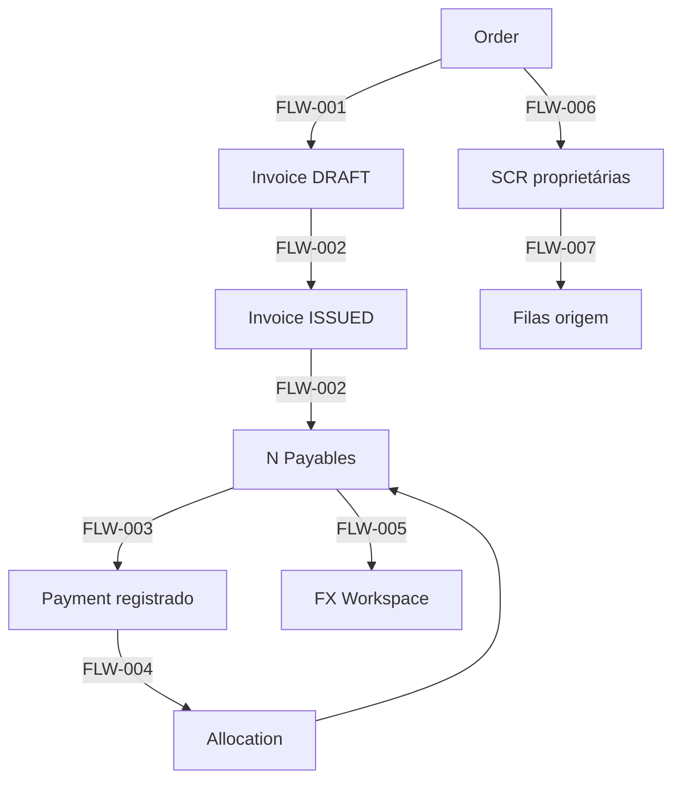

# Epic Controle — Blueprint de Produto (UI/UX)

```text
Status: referência de design (não canônico de domínio)
Versão: 3.10
Data: 2026-07-29
Autoridade: consultiva para arquitetura de informação e UX
Não substitui: Blueprint do Sistema, Roadmap, código ou decisões de domínio
Status de implementação das superfícies: consultar o Roadmap
Segmentação: Horizon A (superfícies já DONE no Roadmap) = baseline documental de UI/UX;
             Horizons B–D e superfícies não implementadas = candidato
Natureza: consolidado Etapas 2–8 (Design System §26–§27; Handoff v1.0).
          Não é especificação integralmente executável nem promoção automática a canônico.
```

**Precedência durante investigação:** o código evidencia o estado implementado. Divergências documentais resolvem-se nos documentos responsáveis. Benchmarks são evidência consultiva, sem autoridade.

**Fontes de consolidação:** Blueprint Sistema V2 · Roadmap V2 · auditoria UX-1 (2026-07-24) · código `v2/` · corpus em `docs/v2/blueprint UIUX/` (benchmark, não canônico). Evidências de investigação e vereditos: **Roadmap**, não este arquivo.

**Legenda de classificação (síntese normativa):**

| Rótulo | Significado |
|---|---|
| `AS-IS` | Implementado no frontend/backend atual |
| `TARGET` | Arquitetura de informação / UX aprovada para desenho |
| `GAP_TECNICO` | TARGET sem superfície, rota ou read model completo |
| `DECISAO_ABERTA` | Negócio, ADR ou RBAC ainda não decidido |

---

## 0. Autoridade por assunto

| Assunto | Autoridade |
|---|---|
| Entidades, cardinalidades e ownership | Blueprint do Sistema |
| Regras e invariantes de domínio | Blueprint do Sistema |
| Arquitetura de informação, interação, design system e aceite de UX | Este documento, **quando aprovado** (hoje: candidato) |
| Fases, status, gates, decisões e evidências | Roadmap |
| Índice e resolução de autoridade | `docs/README.md` |
| Código e runtime na investigação | Código real |
| Benchmark de mercado | Evidência consultiva, sem autoridade |

Enquanto candidato, divergências deste arquivo **não** alteram canônicos.

---

## 1. Fundamentos

**Produto.** Plataforma de controle de importação para varejo esportivo: cadastro, pedido, faturamento, pagamento multimoeda com exposição cambial, embarque, desembaraço (DUIMP), estoque e custo auditável por SKU — conforme Blueprint do Sistema e horizontes abaixo.

**Diretriz visual.** Densidade alta, hierarquia tipográfica e espaçamento, acabamento corporativo. CSS/tokens do frontend atual = inventário `AS-IS`. UX-1 = referência consultiva, **sem autoridade visual**. Decisões visuais definitivas derivam das telas e mockups aprovados; Design System final consolida-se na **Etapa 7** do Roteiro.

**Paradigma de navegação.** Princípio `ADOPT_NOW`: o centro da experiência é a **ação sobre exceções**, não KPI theater. Home orientada a exceções. Workbench transversal completo = `ADOPT_AS_TARGET` (ver §10).

**Nomenclatura.** Nenhuma tela confundível com outra pelo nome. Payable ≠ Payment ≠ Allocation. “A pagar” ≠ “Pagamentos” ≠ “Obrigações liquidadas”.

**Estrutura.** Uma tela existe se responde a uma pergunta que nenhuma outra responde.

**Documents.** Documento tem **origem primária** explícita e pode ter **vínculos N:M** (`DocumentLink`) com outras entidades. Bytes e versões imutáveis; supersede com histórico. Não há ownership exclusivo que impeça evidência transversal.

**Modelo mental.**

- **Por fila de trabalho** — o que precisa de ação agora.
- **Por objeto** — cockpit / fichas de domínio com deep links (sem recriar `order_central`).

**Regra.** Vazio não é zero.

---

## 2. Horizontes de produto

| Horizonte | Significado | Apresentação no UI |
|---|---|---|
| **A** | UX sobre capacidade já implementada | Pode ser DoD de entrega imediata |
| **B** | UX de módulo aprovado no Blueprint Sistema, ainda não implementado | Spec compacta; protótipo não finge runtime |
| **C** | Capacidade dependente de dados ou integração | Target; estado nulo obrigatório; sem fabricar cálculo |
| **D** | Possibilidade futura / North Star | Visão; fora do comprometido |

Não apresentar C ou D como operacional atual.

---

## 3. Arquitetura de informação (alvo)

Oito seções-alvo (Horizonte B+). Shell **TARGET** Horizon A (ver §20): Compras | Financeiro. Shell **AS-IS** (código): Ordens | Financeiro (Faturas sob Financeiro) — técnico, não decisão de produto.

| # | Seção | Pergunta | Perfis | Horizonte dominante |
|---|---|---|---|---|
| 1 | Workbench | O que precisa de ação minha agora? | Todos | Princípio A; superfície B/D conforme §10 |
| 2 | Produtos | O que vendemos e o que falta? | Comprador / Comercial | B (catálogo flat A via API; UI B) |
| 3 | Compras | O que pedimos e em que pé está? | Comprador | A (filas/cockpit) |
| 4 | Importação | Onde está cada processo físico/aduaneiro? | Logística / Aduana | B |
| 5 | Abastecimento | O que tenho, chega e virá? | Executivo / Comercial | B posição/movimentos; C cobertura avançada |
| 6 | Financeiro | Quanto devemos, quando, moeda, FX? | Financeiro / Tesouraria | A (AP/Payments/FX); TF pendente |
| 7 | Custos | Quanto custou de verdade cada SKU? | Financeiro / Gestor | B |
| 8 | Administração | Quem acessa e o que aconteceu? | Admin | B (API Identity/Audit A) |

---

## 4. Inventário exacto de telas (SCR)

Total de superfícies inventariadas: **36**.

### 4.1 Horizonte A — implementadas (código `v2/frontend`)

| ID | Nome | Rota | Entidade / read model | Módulo | Tipo | Nota |
|---|---|---|---|---|---|---|
| SCR-001 | Login | `/login` | Session | identity | full page | Spec própria §7.1 |
| SCR-002 | App Shell | — | Nav + RBAC | foundation FE | chrome | TARGET: Compras \| Financeiro (§20); AS-IS: Ordens \| Financeiro |
| SCR-003 | Pedidos (fila) | `/orders` | Order | orders | search grid | |
| SCR-004 | Novo pedido | `/orders/new` | Order | orders | form | |
| SCR-005 | Pedido — cockpit / detalhe | `/orders/:orderId` | `order_cockpit` + Order | reporting + orders | full page | Variantes por `reporting:read` §7.2 |
| SCR-006 | Faturas (lista) | `/invoices` | Invoice | billing | search grid | |
| SCR-007 | Fatura (detalhe) | `/invoices/:invoiceId` | Invoice | billing | full page | |
| SCR-008 | A pagar | `/payables` | `ap_queue` / Payable | reporting + billing | search grid | Variantes por `reporting:read` §7.3 |
| SCR-009 | Câmbio do payable | `/payables/:payableId/fx` | FxPlanRate, FxMarketQuote, FxExecution… | treasury | workspace | |
| SCR-010 | Pagamentos (lista) | `/payments` | Payment | treasury | search grid | |
| SCR-011 | Novo pagamento | `/payments/new` | Payment | treasury | form | Contexto AP = gap UX-1 G02 |
| SCR-012 | Pagamento (detalhe) | `/payments/:paymentId` | Payment + Allocations | treasury | full page | |

**Subtotal A:** 12 superfícies.

### 4.2 Horizontes B–D — alvo (spec compacta §8)

| ID | Nome | Seção | Horizonte | Dependências |
|---|---|---|---|---|
| SCR-013 | Central de exceções (Workbench) | 1 | B target / D ciclo persistido | Reporting + módulos; ADR se entidade |
| SCR-014 | Calendário de eventos | 1 | B/C | Vencimentos (A) + ETAs (B) |
| SCR-015 | Catálogo | 2 | B | catalog API (A) → UI |
| SCR-016 | Ficha do produto | 2 | B | Catalog enriquecido |
| SCR-017 | Triagem de produtos | 2 | B | Ingestão |
| SCR-018 | Fornecedores e operadores | 2 | B | Supplier A; operador = validação |
| SCR-019 | Pipeline de importação | 4 | B | ImportProcess |
| SCR-020 | Embarques (lista) | 4 | B | Logistics; filtros status/modal/prestador; CTA prestadores |
| SCR-021 | Embarque (detalhe) | 4 | B | Shipment Detail próprio; selects modal + empresa transportadora |
| SCR-021b | Prestadores logísticos | 4 | B | `/logistics-providers` list+create (J4-UX1) |
| SCR-022 | Processo aduaneiro / DUIMP (detalhe) | 4 | B | ImportProcess Detail próprio |
| SCR-023 | Documentos (biblioteca) | 4/8 | B | documents API (A) |
| SCR-024 | Posição de estoque | 5 | B | Inventory |
| SCR-025 | Movimentos de estoque | 5 | B | Inventory movements |
| SCR-026 | Cobertura | 5 | C | Demanda / consumo |
| SCR-027 | Trade Finance | 6 | — | `REQUIRES_BUSINESS_VALIDATION` |
| SCR-028 | Câmbio (workspace tesouraria / hub) | 6 | B TARGET | Extensão do SCR-009; `GAP_TECNICO` — sem rota/read model global; AS-IS = SCR-009 + market strip |
| SCR-029 | Obrigações liquidadas | 6 | B | Payable status PAID (dado A) |
| SCR-030 | Créditos e descontos | 6 | B | Treasury créditos |
| SCR-031 | Landed cost (lote) | 7 | B | Costing |
| SCR-032 | Despesas de importação | 7 | B | Costing |
| SCR-033 | Fechamento / conciliação | 7 | B | Reconciliation |
| SCR-034 | Usuários e permissões | 8 | B | identity |
| SCR-035 | Auditoria | 8 | B | audit API (A) |
| SCR-036 | Dashboard por perfil | 1/6/5 | B/C | Reporting; sem métrica sem fonte |

**Subtotal B–D / pendente:** 24. **Total SCR: 36.**

Mapa de navegação alvo (Horizon B+ completo; Horizon A operacional = Compras + Financeiro apenas):

```text
EPIC CONTROLE
  Workbench          SCR-013, SCR-014 [, SCR-036]     ← não exibir até implementado
  Produtos           SCR-015 … SCR-018                 ← não exibir até implementado
  Compras            SCR-003 … SCR-007                 ← Pedidos + Faturas (TARGET)
  Importação         SCR-019 … SCR-023                 ← não exibir até implementado
  Abastecimento      SCR-024 … SCR-026                 ← não exibir até implementado
  Financeiro         SCR-008 … SCR-012, SCR-027 … SCR-030
                       Contas a pagar · Pagamentos · Câmbio (SCR-028 TARGET/GAP)
  Custos             SCR-031 … SCR-033                 ← não exibir até implementado
  Administração      SCR-034, SCR-035                 ← não exibir até implementado
```

**Síntese Horizon A — navegação TARGET vs AS-IS**

| | Compras | Financeiro |
|---|---|---|
| **TARGET** | Pedidos · Faturas | Contas a pagar · Pagamentos · Câmbio |
| **AS-IS** | Grupo “Ordens” (Fila/Nova); Faturas sob Financeiro | Contas a pagar/Payables · Faturas · Pagamentos; sem item Câmbio |
| **GAP_TECNICO** | — | Hub Câmbio global (SCR-028): sem rota `/fx` nem lista; operacional = `/payables/:id/fx` + strip |
| **Ownership** | Pedidos = orders; Faturas = **billing** (grupo visual Compras) | AP = reporting/billing; Payments/FX = treasury |

Faturas pertencem visualmente a **Compras**; módulo proprietário permanece **Billing**.
---

## 5. Inventário exacto de capacidades materiais (CAP)

Unidade do gatilho de fontes: **somente CAP-***. Telas (SCR) e capacidades não são intercambiáveis.

| ID | Nome | Definição | Tela/domínio | Fonte atual | Caminho aprovado (Blueprint Sistema) | Horizonte | Classificação |
|---|---|---|---|---|---|---|---|
| CAP-001 | Home orientada a exceções | Princípio: usuário começa pelo que precisa de ação | IA global | — | Alinhado anti-KPI-theater / filas | A princípio | `V2_OPERATIONAL_NOW` (princípio) |
| CAP-002 | Workbench read model | Grade transversal de exceções derivadas | SCR-013 | Não | Reporting read-only (extensão) | B target | `V2_APPROVED_NOT_IMPLEMENTED` (padrão Reporting) |
| CAP-003 | Exceção persistida | Entidade de exceção com ciclo de vida próprio | SCR-013 | Não | Não | D | `NORTH_STAR` + `REQUIRES_ADR` |
| CAP-004 | Calendário operacional | Vencimentos + chegadas + fechamentos | SCR-014 | Parcial (due dates Payable) | Parcial | B/C | `V2_APPROVED_NOT_IMPLEMENTED` / C p/ ETAs |
| CAP-005 | Catálogo SKU | Grade e CRUD de produtos | SCR-015 | API catalog | Catalog | A API / B UI | `V2_OPERATIONAL_NOW` (API) |
| CAP-006 | Completude por processo | Lacunas com bloqueio explícito (NCM, peso…) | SCR-016 | Não (Product flat) | Catalog alvo | B/C | `V2_APPROVED_NOT_IMPLEMENTED` / C attrs |
| CAP-007 | Parent / variante / herança | Modelo→variante com herança controlada | SCR-016 | Não | Catalog alvo (parcial) | B | `V2_APPROVED_NOT_IMPLEMENTED`; herança cega `REQUIRES_ADR` |
| CAP-008 | Triagem / matching SKU | Confiança ≠ validade; confirmação humana | SCR-017 | Não | Ingestão | B | `V2_APPROVED_NOT_IMPLEMENTED` |
| CAP-009 | Fornecedor master | Cadastro comercial | SCR-018 | API Supplier | Catalog | A API / B UI | `V2_OPERATIONAL_NOW` (API) |
| CAP-010 | Operador estrangeiro | Fabricante distinto do fornecedor | SCR-018 | Não | Customs / Portal | C | `INTEGRATION_DEPENDENT` + validação negócio |
| CAP-011 | Fila de Orders | Search grid operacional | SCR-003 | Order API | Orders | A | `V2_OPERATIONAL_NOW` |
| CAP-012 | Criação de Order | Form + itens | SCR-004 | Order API | Orders | A | `V2_OPERATIONAL_NOW` |
| CAP-013 | Cockpit da Order | Read model de convergência + deep links | SCR-005 | `order_cockpit` | Reporting | A | `V2_OPERATIONAL_NOW` |
| CAP-014 | Invoice 1 Order | Invoice pertence a uma Order; 1:N Payable | SCR-006/007 | Billing | Order 1:N Invoice | A | `V2_OPERATIONAL_NOW` |
| CAP-015 | Invoice multi-Order | Uma Invoice cobre N Orders | — | Não (FK única) | Conflita modelo vigente | — | `OUT_OF_SCOPE` até ADR (`REQUIRES_ADR`) |
| CAP-016 | Fila A pagar | Payables abertos + KPIs | SCR-008 | `ap_queue` / Payable | Billing + Reporting | A | `V2_OPERATIONAL_NOW` |
| CAP-017 | Payment + Allocation | Movimento e liquidação N:M | SCR-010…012 | Treasury | PaymentAllocation | A | `V2_OPERATIONAL_NOW` |
| CAP-018 | FX plan / quote / execution / PnL | Taxas versionadas e valuation | SCR-009 | Fx* models | Treasury FX | A | `V2_OPERATIONAL_NOW` |
| CAP-019 | Trade Finance (taxonomia) | Contratos ACC/ACE/Finimp/hedge/etc. | SCR-027 | Não | Não formalizado | — | `REQUIRES_BUSINESS_VALIDATION` · `EPIC_NOT_VALIDATED` |
| CAP-020 | Pipeline importação | Milestones previstos vs realizados | SCR-019 | Não | Logistics + Customs | B | `V2_APPROVED_NOT_IMPLEMENTED` |
| CAP-021 | Shipment | Embarque agregado independente | SCR-020/021 | Não | Logistics; sem order_id; modal+prestador (J4-UX1) | B | `AS-IS` |
| CAP-022 | ImportProcess / DUIMP | Processo aduaneiro Detail | SCR-022 | Não | Customs | B | `V2_APPROVED_NOT_IMPLEMENTED` |
| CAP-023 | Documents + links | Bytes imutáveis + DocumentLink N:M | SCR-023 | documents API | Documents | A API / B UI | `V2_OPERATIONAL_NOW` (API) |
| CAP-024 | Posição temporal estoque | Disponível / em trânsito / planejado | SCR-024 | Não | Inventory | B | `V2_APPROVED_NOT_IMPLEMENTED` (defs C) |
| CAP-025 | Movimentos de estoque | Saldo derivado de movimentos | SCR-025 | Não | Inventory | B | `V2_APPROVED_NOT_IMPLEMENTED` |
| CAP-026 | Cobertura (dias) | Dias de estoque vs demanda | SCR-026 | Não | Não (falta demanda) | C | `INTEGRATION_DEPENDENT` / `NORTH_STAR` |
| CAP-027 | ATP / reservado | Fórmula ATP e reservas | SCR-024 | Não | Não formalizado | C | `INTEGRATION_DEPENDENT` |
| CAP-028 | Ruptura / excesso | Projeção de ruptura/excesso | SCR-026 | Não | Não | C | `INTEGRATION_DEPENDENT` |
| CAP-029 | Demanda / forecast | Sinal de demanda | — | Não | Não | C/D | `NORTH_STAR` |
| CAP-030 | Recomendação de compra | Sugestão de reposição | — | Não | Não | C/D | `NORTH_STAR` |
| CAP-031 | Margem / preço de venda | Margem por SKU | SCR-031 | Não | Não | C | `INTEGRATION_DEPENDENT` |
| CAP-032 | Landed cost por lote | Componentes + rateio + accrual/posted | SCR-031 | Não | Costing | B | `V2_APPROVED_NOT_IMPLEMENTED` |
| CAP-033 | Despesas de custo | Expenses com documento | SCR-032 | Não | Costing | B | `V2_APPROVED_NOT_IMPLEMENTED` |
| CAP-034 | Fechamento / reconciliação | Divergências de período | SCR-033 | Não | Reconciliation | B | `V2_APPROVED_NOT_IMPLEMENTED` |
| CAP-035 | Créditos / descontos / CC | Entidades distintas | SCR-030 | Não | Treasury futuro | B | `V2_APPROVED_NOT_IMPLEMENTED` |
| CAP-036 | RBAC UI | Usuários e papéis | SCR-034 | identity seed | Identity | A parcial / B UI | `V2_OPERATIONAL_NOW` (API) |
| CAP-037 | Audit UI | Consulta imutável | SCR-035 | audit API | Audit | A API / B UI | `V2_OPERATIONAL_NOW` (API) |
| CAP-038 | Portal Único integrado | Catálogo/DUIMP/API gov | — | Não | Mencionado como integração | C | `INTEGRATION_DEPENDENT` |
| CAP-039 | Lote / série / validade / recall | Rastreabilidade avançada | SCR-016 | Não | Não detalhado | D | `NORTH_STAR` |
| CAP-040 | Palletização / armazenagem | Logística de armazém | — | Não | Não | D | `OUT_OF_SCOPE` / `NORTH_STAR` |
| CAP-041 | Integração bancária | Extrato / pagamento automático | — | Não | Não | D | `NORTH_STAR` |
| CAP-042 | Automação de compliance | Regras auto sem explicabilidade | — | Não | Não | D | `NORTH_STAR` |
| CAP-043 | Matching assistido por AI | Sugestão com explicabilidade | SCR-017 | Não | Não | D | `NORTH_STAR` |
| CAP-044 | Payment hold / approval rico | Hold, next approver, buckets | SCR-008 | Não | Parcial (status Payable) | C | `INTEGRATION_DEPENDENT` + validação |
| CAP-045 | Views salvas / filtros URL | Persistência de visão | Grades | Parcial (AP URL) | UX-1 / filas | A/B | `V2_OPERATIONAL_NOW` (parcial) |
| CAP-046 | Preservação de contexto | Filtro, linha, scroll no retorno | Global | Parcial | UX-1 | A | `V2_OPERATIONAL_NOW` (gap) |
| CAP-047 | Design Foundation (shell/tokens) | Tokens, sticky, OperationalTable | Global | Parcial Inc-5A | UX-1 consultivo · Etapa 7 DS | A | `V2_OPERATIONAL_NOW` (incompleto; não normativo) |

**Total exacto de capacidades materiais:** 47 (`CAP-001` … `CAP-047`).

### 5.1 Gatilho de fontes (cálculo exacto)

**Sem fonte atual e sem caminho aprovado no Blueprint do Sistema** (numerador):

`CAP-003`, `CAP-015`, `CAP-019`, `CAP-026`, `CAP-027`, `CAP-028`, `CAP-029`, `CAP-030`, `CAP-031`, `CAP-038`, `CAP-039`, `CAP-040`, `CAP-041`, `CAP-042`, `CAP-043`, `CAP-044`

**Numerador:** 16  
**Denominador:** 47  
**Percentual:** 16/47 = **34,0%** (> 1/3 ≈ 33,3%)

**Gatilho acionado.** O documento **não** é especificação integralmente executável. Separação obrigatória:

| Camada | Conteúdo |
|---|---|
| **Produto comprometido** | Horizonte A + B com caminho aprovado (Orders, Billing, Treasury/FX, Reporting AP/cockpit, e módulos aprovados ainda não UI) |
| **Dependente de integração / dados** | Horizonte C (cobertura, ATP, Portal Único, margem, hold rico, operador estrangeiro regulatório) |
| **North Star** | Horizonte D + CAP sem caminho (AI, banco, compliance auto, exceção persistida, etc.) |
| **Pendente negócio / ADR** | CAP-015, CAP-019, CAP-003, herança cega |

---

## 6. Convergência Order — o que a “Ficha do pedido” é e não é

**É (CAP-013 / SCR-005):** read model de convergência — resumo transversal, alertas, KPIs derivados, deep links para superfícies donas.

**Não é:** contêiner estrutural onde se opera Shipment, ImportProcess, Landed Cost, Invoice ou Payment como se fossem sub-recursos da Order.

| Domínio | Superfície proprietária |
|---|---|
| Order comercial | Orders (edição) + cockpit (resumo) |
| Invoice | SCR-007 Invoice Detail |
| Payable | SCR-008 (+ drawer) |
| Payment / Allocation | SCR-012 |
| Shipment | SCR-021 |
| ImportProcess / DUIMP | SCR-022 |
| Landed Cost | SCR-031 |
| Drawer | Preview, histórico, ação curta — não substitui ficha estrutural |

Anti-padrão: `order_central`.

**Cardinalidade Invoice × Order:** modelo vigente e código = **Order 1:N Invoice** (`order_id` obrigatório). Afirmação v3.0 “fatura pode cobrir mais de um pedido” = **não adotada**. Qualquer multi-Order = `REQUIRES_ADR` (CAP-015).

---

## 7. Especificações do slice Order-to-Pay — ponte

A especificação normativa completa das superfícies Horizon A está em **§21** (Etapa 3 + 3.1). Capability modes e RBAC: **§21.12**. Matriz de completude: **§21.13**. Matriz de consistência Etapa 7: **§22**. Estados transversais: **§21.0**. Fluxos ponta a ponta: **§23–§24** (Etapa 4).

### 7.1 Índice SCR → §21

| SCR | Nome | Subseção |
|---|---|---|
| SCR-001 | Login | §21.1 |
| SCR-003 | Pedidos | §21.2 |
| SCR-004 | Novo pedido | §21.3 |
| SCR-005 | Cockpit do pedido | §21.4 |
| SCR-006 | Faturas | §21.5 |
| SCR-007 | Fatura | §21.6 |
| SCR-008 | Contas a pagar | §21.7 |
| SCR-009 | FX Workspace do Payable | §21.8 |
| SCR-010 | Pagamentos | §21.9 |
| SCR-011 | Novo pagamento | §21.10 |
| SCR-012 | Pagamento e alocações | §21.11 |

### 7.2 Variantes (resumo — detalhe em §21)

| Rota | Com `reporting:read` | Sem |
|---|---|---|
| `/orders/:id` | Cockpit Reporting (`GET …/summary`) | Fallback comercial Orders API |
| `/payables` | AP queue enriquecida | Lista Payable básica |

Mesma linguagem visual por entidade; L-005 = `DECISAO_ABERTA`.

### 7.3 Pontos mandatórios de aceite (slice A)

- Linha = entidade correta (Order / Invoice / Payable / Payment).
- Moeda sempre visível; ausência ≠ zero.
- Saldo Payable só via Allocation; UI não edita saldo.
- FX: planejado / mercado / executado separados (contrato real).
- AP → Novo pagamento com contexto = **TARGET**; AS-IS = link sem query (`GAP_TECNICO` G02).
- Retorno preserva filtro/linha/scroll (gap parcial).
- Drawer: só preview/histórico/doc/ação curta; edição estrutural = full page.

## 8. Spec compacta — telas futuras (B–D)

Para SCR-013…036: ID · seção · pergunta · entidade · módulo · perfil · tipo · release/horizonte · dependências · fonte · status · decisões abertas. Sem preencher template com hipótese.

**Exemplos:**

| ID | Pergunta | Módulo | Horizonte | Decisão aberta |
|---|---|---|---|---|
| SCR-013 | O que precisa de ação agora? | Reporting | B read model; D se persistir | CAP-003 ADR |
| SCR-021 | Qual o estado deste embarque? | Logistics | B | Sem order_id |
| SCR-022 | Onde está o processo aduaneiro? | Customs | B | DEC-DUIMP-MULTI-SHIP **fechada** (1:N + UNIQUE shipment) |
| SCR-026 | Qual a urgência de reposição? | Reporting + Inventory | C | Defs demanda |
| SCR-027 | Qual cobertura cambial contratual? | Treasury? | Pendente | CAP-019 |
| SCR-031 | Qual o LC do lote e versão? | Costing | B | Accrual vs posted |

---

## 9. Domínio financeiro e FX

### 9.1 Separação conceitual

| Objeto | Significado | Linha típica |
|---|---|---|
| **Payable** | Obrigação / unidade de liquidação | SCR-008 / SCR-029 |
| **Payment** | Movimento financeiro | SCR-010…012 |
| **PaymentAllocation** | Vínculo Payment→Payable; reduz saldo | Detalhe Payment / auditoria |
| **FxPlanRate** | Taxa planejada versionada (1 current/payable) | SCR-009 |
| **FxMarketQuote** | Cotação online com timestamp | SCR-009 / strip shell |
| **FxExecution** | Taxa/evento de execução no Payment | SCR-009 / Payment |
| **FxAllocationValuation** | PnL histórico por allocation | SCR-009 |

**Liquidados:** não misturar Payment com Payable `PAID` sem explicitar a visão (SCR-029 vs SCR-010).

### 9.2 Trade Finance — pendente

ACC e ACE não serão presumidos como instrumentos aplicáveis à EPIC. A taxonomia de Trade Finance permanece pendente de validação do negócio. O candidato v3.1 não consolida esses instrumentos nem uma taxonomia substituta como decisão definitiva.

**Alternativas para avaliação (não decisão):** Finimp; contrato de câmbio à vista/futuro; NDF/forward; hedge; adiantamento a fornecedor; financiamento do fornecedor; spread/custo financeiro. Qualquer prazo regulatório (ex.: “360 dias”) exige fonte atual e aderência à operação.

**Status:** `EPIC_NOT_VALIDATED` · `REQUIRES_BUSINESS_VALIDATION` · SCR-027 / CAP-019.

### 9.3 Padrões financeiros de mercado (não modelo atual)

Approval status, next approver, payment hold, buckets de vencimento, variâncias (preço/qty/câmbio), fechamento/reabertura: avaliar sob CAP-044 / CAP-034; adotar só com dados e ADR/negócio.

---

## 10. Workbench

| Aspecto | Classificação |
|---|---|
| Home orientada a exceções | `ADOPT_NOW` (princípio) |
| Workbench transversal read model | `ADOPT_AS_TARGET` |
| Entidade persistida de exceção | `REQUIRES_ADR` |
| Owner, SLA, snooze, escalonamento, notificações | Futuro, dependente dos módulos |

**Especificável agora (target):** pergunta (CAP-002); composição visual (grade + filtros por tipo/urgência/seção); origem das exceções = regras nos módulos donos; deep links para SCR dona; filas por perfil (comprador / financeiro / logística).

**Não aprovado:** ciclo de vida persistido (`OPEN`…`DISMISSED`) como sistema de registro.

Workbench é agregador/orquestrador de ação via read model — **não** dono das regras de domínio.

---

## 11. Matching, produto e milestones

**Matching (CAP-008):** nenhuma correspondência silenciosa; confiança ≠ validade do SKU destino; reaplicação só se destino ativo, não duplicado, aprovado, consistente e completo para o processo; regra no backend (Ingestão), não só FE.

**Produto:** runtime atual = Product flat (`sku`, `description`, `is_active`). Parent/variante/NCM/completude = alvo B. Não propagar NCM/origem/peso/GTIN/unidade sem confirmar uniformidade (`REQUIRES_ADR` se herança cega).

**Milestones (CAP-020):** previsto / revisado / realizado / desvio / fonte / responsável / documento. Grade operacional como padrão; Kanban só com tarefa comprovada. Status global artificial evitável se derivável dos milestones.

---

## 12. Design system (orientação provisória — histórico)

> **Supersedido para decisões vigentes por §26–§27** (Etapa 7A).  
> O texto abaixo permanece como **histórico consultivo** (orientação pré-mockup / pré-derivação).  
> Não usar §12 para tokens, dimensões, tipografia, responsividade visual ou anatomia de componentes.

**Não era autoridade visual.** Inventário `AS-IS` (CSS/tokens em `v2/frontend/src/index.css`) e propostas UX-1 = referência consultiva. O Design System candidato deriva das telas e mockups aprovados (**§26–§27**).

**Inventário consultivo histórico (não congelar):** canvas/surface/text/muted/border/accent/success/warning/danger; space 4/8/12/16/24/32; type 12/14/16/20/28 + numeric tabular; density compact 32 / standard 40; radius 4/6/8; focus 2px+offset; sidebar ~208–240; content ~1200–1360; sticky header/filter; z dropdown/drawer/dialog/toast.

**Foundation histórica:** PageHeader/Breadcrumb; KpiStrip/StatusBadge/Money/Fx/Empty/Error/FilterBar; DetailDrawer (a11y); OperationalTable + Toast.

**Drawers / Full page / Modal:** ver §21 (IA) e §27 (anatomia DS).

**A11y / Responsividade / Grades:** ver §26.7–§26.8 e §27.3 (vigentes).

---

## 13. Aceite de UX (verificável)

- Usuário encontra obrigação vencida e chega à ação correta.
- Retorno preserva filtros, linha e scroll.
- Valores financeiros mostram moeda; taxa mostra tipo, fonte e timestamp.
- Ausência ≠ zero.
- Bloqueio mostra causa, impacto e ação.
- Ação crítica mostra preview; custo postado / saldo / FX liquidado não editáveis diretamente.
- Sem permissão ⇒ sem ação proibida.
- Nomenclatura consistente; documentos com origem, versão e vínculos.
- Grades operáveis em volume; teclado nos fluxos frequentes.
- KPI com drill-down; FE não duplica regra de domínio.
- Drawer preserva foco; erro com recuperação; stale identificável; conflito de versão tratável.
- Cenários alinhados aos SC do Blueprint do Sistema (Order-to-Pay).

---

## 14. Sequenciamento

```text
Etapas 2–8  →  TARGET DESIGN aprovado (Roteiro do redesenho UI/UX)
Etapa 9     →  investigação e plano técnico de implementação (Cursor)
```

**Não** congelar sequência técnica `A0 → higiene E2E → A1 → Inc-6` neste documento.

Na **Etapa 9**, o Cursor decide autonomamente, com base no código e no Roadmap, a ordem de:

- higiene E2E;
- testids de domínio;
- Inc-6 (E2E/goldens/aceite J#2);
- refatoração visual;
- componentes globais;
- extensões de API;
- hub global de Câmbio (SCR-028).

| Fatia de design | Conteúdo | Status |
|---|---|---|
| Etapa 2 App Shell | §20 deste candidato | **DONE documental** (v3.2) |
| Etapa 3 telas (arquitetura) | §21–§22 | **DONE documental** (v3.3) |
| Etapa 3.1 qualidade | §21.0–§21.13 | **DONE documental** (v3.4) |
| Etapa 4 fluxos | §23–§24 | **DONE documental** (v3.5) |
| Etapa 5 mockups | §25 · MCK v1.0 | **DONE** (v3.6) |
| Etapa 6 revisão visual | §25 · MCK v1.1 | **DONE** (v3.7); E6-B **APROVADO** |
| Etapa 7 Design System | §26–§27 derivados de MCK v1.1 | **DONE** (v3.10); E7-A/E7-B aprovados |
| Etapa 8 | handoff operacional | **DONE** — [`HANDOFF_UI_UX_EPIC_V2.md`](HANDOFF_UI_UX_EPIC_V2.md) v1.0; E8-A/E8-B aprovados |
| Etapa 9 | Plano técnico de implementação | **próxima** (não iniciada; DoR fechado no Handoff) |

Implementação futura em fatias verticais. Protótipo não finge capacidade inexistente. Runtime **não** renderiza item de navegação quebrado, morto ou desabilitado para hub Câmbio até existir rota/read model.

---

## 15. Anti-benchmark

| Ideia | Origem | Decisão |
|---|---|---|
| ACC/ACE como requisito automático | Benchmark Conexos / v3.0 | Validar com negócio; **não presumir** |
| Exportação como módulo EPIC | Suites comex | Adiar / fora do escopo atual |
| Portal Único como gate atual | Benchmark | Adiar (CAP-038) |
| Recomendação sem demanda | Planners | Rejeitar até CAP-029 |
| Ruptura sem consumo | Planners | Rejeitar até dados |
| Margem sem preço de venda | Benchmark LC | Rejeitar até CAP-031 |
| Kanban universal | Mercado genérico | Rejeitar como padrão |
| “Vinte colunas” como meta | Inferência | Rejeitar |
| Bloquear Packing List só por falta de peso | Inferência | Reformular (completude contextual) |
| “Trava criptográfica” de fechamento | Ruído benchmark | Rejeitar |
| Drawer no lugar de ficha estrutural | UX genérica | Rejeitar |
| Herança cega NCM/peso/GTIN | PIM | `REQUIRES_ADR` / validar |
| ImportProcess contêiner universal | Inferência | Rejeitar |
| Integração bancária sem escopo | Benchmark | North Star |
| Motor tributário amplo | Benchmark | North Star / ownership |
| AI sem explicabilidade | Hype | Rejeitar; CAP-043 só com explicabilidade |

---

## 16. Decisões abertas

### 16.1 `REQUIRES_ADR`

- Invoice cobrindo múltiplas Orders (CAP-015).
- Entidade persistida de exceção (CAP-003).
- `order_id` em Shipment (proibido no Sistema).
- Payment liquidando Payable sem Allocation.
- Herança automática irrestrita de atributos fiscais/logísticos.
- ~~DUIMP 1:1 Shipment (ver DEC-DUIMP-MULTI-SHIP).~~ **Resolvido I5-0:** DUIMP **1:N** Shipment (`shipment_id` UNIQUE); ver Blueprint Sistema §6.6.

### 16.2 `REQUIRES_BUSINESS_VALIDATION`

- Taxonomia Trade Finance (CAP-019); ACC/ACE não presumidos.
- L-005 — quem recebe `reporting:read`; papéis além de `admin` / `comprador` (roles runtime atuais).
- Divergência comprador × pagamentos: Blueprint básico (“não altera pagamentos/alocações”) vs permissões seed (`treasury:write`, `treasury:allocate`) — **não resolver por UI**; ver Roadmap.
- Personas financeiro / gestor / logística = orientação de TARGET DESIGN, **não** roles implementadas.
- DEC-ACCONTO-INVOICE.
- Definições: Disponível, Reservado, ATP, Planejado, Cobertura, Margem.
- Operador estrangeiro vs fornecedor na operação EPIC.
- Payment hold / approval rico (CAP-044).
- (Removido) A1 como gate obrigatório de Inc-6 — sequência técnica fica na Etapa 9.
---

## 17. Benchmark × EPIC (síntese)

| Padrão | Decisão |
|---|---|
| Workbench / exceções (princípio) | `ADOPT_NOW` |
| Workbench read model | `ADOPT_AS_TARGET` |
| Search grids densas + sticky + URL filters | `ADOPT_NOW` (refinar nas Etapas 3–7) |
| Views salvas | `ADOPT_AS_TARGET` |
| Right-drawer vs full page | `ADOPT_NOW` (regra §12) |
| Completude por processo | `ADOPT_AS_TARGET` |
| Matching com confirmação humana | `ADOPT_AS_TARGET` |
| Landed cost por lote + accrual/posted | `ADOPT_AS_TARGET` |
| FX variance explícita | `ADOPT_NOW` (evoluir colunas) |
| Posição temporal estoque | `ADOPT_AS_TARGET` (B) |
| Cobertura / ATP / ruptura | `DEFER_DATA_DEPENDENCY` |
| Portal Único integrado | `DEFER_DATA_DEPENDENCY` |
| Recomendação de compra | `DEFER_DATA_DEPENDENCY` |
| Invoice multi-Order | `REQUIRES_ADR` |
| TF ACC/ACE | `REQUIRES_BUSINESS_VALIDATION` |
| Kanban universal / export module | `REJECT_FOR_EPIC` (escopo atual) |

Evidência de mercado: majoritariamente `OBSERVED_SECONDARY` / `INFERRED`. Só entra como decisão firme se `EPIC_VALIDATED` ou target explícito sujeito a aprovação.

---

## 18. Changelog v3.0 → v3.1

- Status explícito: candidato não canônico, parcialmente consolidado.
- Autoridade por assunto (não hierarquia linear).
- Invoice: Order 1:N; multi-Order = ADR.
- Cockpit = read model; detalhes de domínio em superfícies próprias.
- Documents: origem + vínculos N:M.
- Financeiro/FX alinhados às entidades reais.
- Inventário SCR = **36** (exacto); CAP = **47** (exacto).
- Gatilho fontes: **16/47 = 34,0%** — acionado; documento não integralmente executável.
- Trade Finance pendente; ACC/ACE não presumidos.
- Workbench: quatro classificações distintas.
- Specs proporcionais (Login; variantes cockpit/AP).
- Design system ancorado na UX-1; sequência A0→E2E→A1→Inc-6 *(supersedido em v3.2)*.
- Anti-benchmark e decisões abertas explícitas.
- Removida contagem “22 telas” e claims operacionais sem fonte.

## 18.1 Changelog v3.1 → v3.2

- Legenda `AS-IS` / `TARGET` / `GAP_TECNICO` / `DECISAO_ABERTA`.
- Navegação TARGET: Compras (Pedidos + Faturas) | Financeiro (AP + Pagamentos + Câmbio); Faturas no mapa Compras (SCR-003…007).
- Hub Câmbio (SCR-028) = TARGET + GAP; AS-IS = SCR-009 + strip; implementação sem nav quebrada.
- Design system: orientação provisória; UX-1/CSS sem autoridade; DS final na Etapa 7.
- Sequenciamento: Etapas 2–8 → design; Etapa 9 → plano técnico (sem A0→Inc-6 normativo).
- **§20 App Shell profissional** (Etapa 2 DONE documental).
- Evidências H1–H7 e estado runtime → Roadmap (este arquivo permanece normativo de UX).

---

## 18.2 Changelog v3.2 → v3.3

- Etapa 3: especificações completas Horizon A (§21.1–§21.11) + RBAC transversal (§21.12) + matriz de consistência (§22).
- §7 reduzido a ponte/índice (sem duplicação normativa).
- §20.4: larguras por arquétipo (filas fluidas / detalhes 1440 / forms 1120 / FX fluido).
- Hub Câmbio permanece TARGET+GAP (sem detalhe indevido).
- Evidências H-E3 e gaps → Roadmap §M.8.

## 18.3 Changelog v3.3 → v3.4 (Etapa 3.1 — qualidade)

- **v3.3** permanece registro histórico da arquitetura/spec inicial Horizon A.
- **v3.4** = fechamento de completude operacional: §21.0 estados transversais; filas/forms/ações críticas/RBAC; §21.13 matriz sem INC.
- Evidências H-Q3 e contratos → Roadmap §M.9.

## 18.4 Changelog v3.4 → v3.5 (Etapa 4 — fluxos)

- §23 mapa mestre + FLW-001…FLW-007 (transições, contexto, domínio, retorno, exceções).
- §24 matrizes de rastreabilidade, efeitos de domínio e retorno.
- Data do cabeçalho alinhada a **2026-07-28**.
- Evidências H-E4 → Roadmap §M.10. Sem redesenho de telas (§21 preservado).

## 18.5 Changelog v3.5 → v3.6 (Etapa 5 — mockups)

- **v3.5** permanece registro histórico de fluxos (§23–§24).
- **v3.6** = Etapa 5 DONE: §25 mockups prioritários **MCK v1.0** aprovados (Checkpoints A–D).
- Família visual aprovada. Mockup **não** é implementação. Design System permanece Etapa 7.
- Próxima fatia de design: Etapa 6 — revisão visual consolidada (não iniciada nesta revisão).

## 18.6 Changelog v3.6 → v3.7 (Etapa 6 — revisão visual)

- **v3.6** permanece registro de MCK v1.0 (§25 histórico).
- **v3.7** = Etapa 6 **DONE**: correções 6B → **MCK v1.1**; §25 aponta o pacote vigente.
- E6-012 (borda interativa) resolvido visualmente em MCK v1.1 **antes** da derivação formal de tokens (Etapa 7).
- E6-A aprovado com ajustes; E6-B pendente confirmação externa final *(sincronizado como APROVADO na v3.8)*.
- Próxima fatia de design: **Etapa 7 — Design System derivado**.

## 18.7 Changelog v3.7 → v3.8 (Etapa 7A — DS candidato)

- E6-B registrado como **APROVADO** (fato histórico; não reverter).
- §12 marcado histórico; decisões vigentes em **§26–§27**.
- Autoridade visual formal: sobreposição §20 vs §26–§27 declarada no §26.0.
- Tokens/componentes **candidatos** com classificação de proveniência; Checkpoint **E7-A** pendente.
- Etapa 7 = **PARTIAL**. Etapa 8 **não** iniciada. MCK permanece **v1.1**.

## 18.8 Changelog v3.8 → v3.9 (Etapa 7B — consolidação)

- E7-A tratado como aprovado na autorização da 7B.
- **I1:** tabela de pares de contraste texto/fundo em §26.7 (sem WCAG global); nenhum par AA-normal falhou.
- **I2:** densidades de tabela fechadas — `standard` (40) e `finance` (44) em §27.3.
- Etapa 7 = **DONE**. Etapa 8 registrada apenas como próxima. MCK **v1.1** intacto.

## 18.9 Changelog v3.9 → v3.10 (correção de fechamento Etapa 7)

- E7-A = **APROVADO COM AJUSTES**; E7-B = **PENDENTE DE CONFIRMAÇÃO EXTERNA FINAL** (governança).
- AuditDocumentsBlock promovido a template completo (evidência 002/003/004/007).
- Taxonomia: eliminado `NORMALIZED→TARGET`; chip com classificação única **TARGET**.
- Tokens determinísticos: `button.size.md/lg`, `type.size.id`, `radius.chip`; `detailDrawer.width`.
- Etapa 7 = **PARTIAL** de governança até confirmação E7-B. Etapa 8 **não** iniciada.

## 18.10 Changelog v3.10 — fechamento de governança Etapa 7

- Confirmação externa final: **E7-A = APROVADO COM AJUSTES** (ajustes da v3.10 **concluídos**); **E7-B = APROVADO**.
- Etapa 7 = **DONE**. Conteúdo normativo §§26–§27 **inalterado** nesta sync (somente status).
- UI/UX permanece **v3.10**. Próxima = **Etapa 8 — Handoff** (**não** iniciada). MCK **v1.1** intacto.

## 18.11 Changelog v3.10 — ponteiro Etapa 8A (sem bump)

- Status: Etapa 8 **PARTIAL**; ponteiro para `HANDOFF_UI_UX_EPIC_V2.md` **v0.1**.
- Conteúdo normativo §§20–§27 **inalterado**. E8-A pendente. Etapa 9 não iniciada.

## 18.12 Changelog v3.10 — ponteiro Etapa 8B (sem bump)

- Status: Etapa 8 **DONE**; ponteiro para `HANDOFF_UI_UX_EPIC_V2.md` **v1.0**.
- E8-A APROVADO COM AJUSTES; E8-B APROVADO. Conteúdo normativo §§20–§27 **inalterado**. Etapa 9 não iniciada.

---

## 19. Path canônico deste candidato

Única cópia de trabalho:

`docs/v2/blueprint UIUX/BLUEPRINT_UI_UX_EPIC_v3.md`

A cópia na raiz do repositório foi eliminada por duplicidade byte-idêntica com o v3.0 pré-consolidação.

---

## 20. App Shell profissional (Etapa 2 — TARGET DESIGN)

> **Vigência (Etapa 7A):** §20 permanece a especificação de **arquitetura de informação do shell** (grupos, slots, contratos FX, regras de navegação).  
> Para **tokens, dimensões medidas, anatomia visual, gutters/sticky/z-index, larguras de sidebar/drawer, header/breadcrumb e responsividade por arquétipo**, as decisões vigentes estão em **§26–§27**.  
> Em caso de sobreposição numérica/visual, **§26–§27 prevalecem**; §20 não é reescrito — fica histórico estrutural + ponteiro.

Única proposta concreta. Wireframes abaixo mostram **apenas o chrome** aplicado às rotas; o desenho funcional das telas é **Etapa 3**.

### 20.1 Estrutura global

```text
┌─────────────┬──────────────────────────────────────────────────────┐
│ SIDEBAR     │ HEADER [sticky]                                      │
│ [sticky]    │  breadcrumb · título da página · [ações da página]   │
│ 224px exp.  ├──────────────────────────────────────────────────────┤
│  56px col.  │ MAIN [scroll] — largura por arquétipo (§20.4)        │
│             │  filas fluidas · detalhes ≤1440 · forms ≤1120        │
│ brand       │  (filter bar sticky das filas vive AQUI)             │
│ nav grupos  │                                                      │
│ (slots B+   │                                                      │
│  ocultos)   │                                                      │
│ ─────────   │                                                      │
│ FX strip    │                                                      │
│ user·logout │                                                      │
└─────────────┴──────────────────────────────────────────────────────┘
```

- **Sidebar expandida:** 224px fixa; sticky no viewport; brand no topo; nav com scroll interno se necessário; footer = FX strip + usuário + logout.
- **Sidebar recolhida:** 56px; ícones + tooltip/`title`; brand = monograma “E”; FX strip compacto (par + taxa ou ícone).
- **Brand:** texto **EPIC Controle** como sinal forte do chrome (não apenas eyebrow). Sem asset de logo inventado nesta etapa.
- **Grupos visíveis (Horizon A):** somente **Compras** e **Financeiro**. Slots nomeados (Workbench, Produtos, Importação, Abastecimento, Custos, Administração) existem no mapa §4 para expansão futura e **não são renderizados** até o módulo existir.
- **Header global [sticky]:** breadcrumbs + título/contexto + slot de ações da página (CTAs da feature, não do shell).
- **Busca global:** não no Horizon A — sem read model/API de busca transversal (`DEFER`).
- **Notificações:** não — sem inbox/backend (`DEFER`).
- **Área principal:** `minmax(0,1fr)`; gutters 24px (1366) / 32px (1440+); largura do conteúdo por arquétipo (§20.4) — sem max-width único de 1360px.
- **Estados de item de nav:** default · hover · `:focus-visible` · active · **sem permissão = oculto** (não cinza/disabled para itens sem `*:read`).

### 20.2 Navegação TARGET (tabela normativa)

```text
Compras
- Pedidos
- Faturas

Financeiro
- Contas a pagar
- Pagamentos
- Câmbio
```

| Item | Rota | Entidade / read model | Permissão | Sem permissão | Badge | Classificação |
|---|---|---|---|---|---|---|
| Pedidos | `/orders` | Order | `orders:read` | oculto | sem badge inventado; só se API real existir | `AS-IS` superfície; label grupo TARGET |
| Faturas | `/invoices` | Invoice | `billing:read` | oculto | — | `AS-IS` superfície; grupo visual TARGET = Compras (ownership Billing) |
| Contas a pagar | `/payables` | `ap_queue` ou Payable | `reporting:read` (fila) ou `billing:read` (fallback) | oculto | overdue só via `ap_queue` | `AS-IS` (variante L-005 = `DECISAO_ABERTA`) |
| Pagamentos | `/payments` | Payment | `treasury:read` | oculto | — | `AS-IS` |
| Câmbio | TARGET `/fx` (hub) | quotes + planos agregados | `treasury:fx_read` | oculto | stale no strip | `TARGET` + `GAP_TECNICO` |

**Câmbio — regra específica**

| Camada | Comportamento |
|---|---|
| TARGET DESIGN / protótipo | Item `Financeiro > Câmbio` (SCR-028) com gap explícito |
| AS-IS operacional | Workspace `/payables/:payableId/fx` (SCR-009) + FX market strip |
| Implementação runtime | **Não** renderizar item de nav quebrado, morto ou desabilitado enquanto não houver rota/read model; strip permanece o acesso operacional |
| Etapa 9 | Decide como implementar o hub e o sequenciamento técnico |

Nova ordem (`/orders/new`) e detalhe (`/orders/:id`, invoices, payments) são rotas filhas / deep links — não precisam de item de primeiro nível no shell.

### 20.3 Header, breadcrumbs e ações

- **Breadcrumbs:** `Seção > Objeto > contexto` (ex.: `Compras > Pedidos > PO-123`). Links retornam à fila preservando query quando aplicável.
- **Título:** pergunta da tela / nome do objeto (definido na Etapa 3 por superfície).
- **Slot de ações:** botões da página atual (ex. “Nova ordem”) — o shell só reserva a região à direita do header.
- **Sem** busca global nem sino de notificações no Horizon A.

### 20.4 Largura, gutters e sticky

**Regra de composição (não é Design System final):**

| Arquétipo | Largura do conteúdo |
|---|---|
| Main do App Shell | Ocupa toda a largura disponível após sidebar e gutters; **sem** max-width único global |
| Filas / tabelas operacionais | Fluida; uso integral do espaço; teto ~**1680px** só em monitores muito largos (Pedidos, Faturas, Contas a pagar, Pagamentos) |
| Cockpits e detalhes | max-width ~**1440px** (Cockpit do pedido, Fatura, Pagamento) |
| Formulários focados | max-width ~**1120px** (Novo pedido, Novo pagamento) |
| Workspace FX | Fluida conforme painéis/tabelas; **não** restringir a 1120/1360 |

Em **1366×768**, todas as páginas usam a largura remanescente após sidebar + gutters (24px).

| Elemento | Comportamento |
|---|---|
| Sidebar | sticky viewport; não rola com o main |
| Header | sticky no topo da coluna de conteúdo |
| Filter bar das filas | sticky **dentro** do main |
| FX strip | sticky no footer da sidebar |
| 1366×768 | sidebar expandida por padrão; toggle recolher disponível |
| 1440×900 / 1920×1080 | sidebar expandida; aplicar teto por arquétipo acima |
| Tabelas | sem cardificação automática em viewport estreita |

### 20.5 FX market strip

**Contrato real** (`GET /api/fx/quotes/latest`): `rate`, `source`, `status` (`fresh`\|`stale`\|`missing`), `stale`, `observed_at`, `retrieved_at`. Refresh: `POST /api/fx/quotes/refresh` com `treasury:fx_quote_refresh`.

| Elemento | Spec |
|---|---|
| Par | EUR/BRL (par suportado hoje) |
| Taxa | `rate` ou “—” se missing |
| Fonte | `source` |
| Horário | `observed_at` (exibir local/UTC conforme padrão da Etapa 7) |
| Idade | derivar de timestamps + `status`/`stale` |
| Refresh | botão/clique só com `treasury:fx_quote_refresh`; senão strip read-only |
| Deep link | TARGET → hub Câmbio; até hub existir → sem inventar rota; strip não navega para URL morta |
| Estados | `loading` · `fresh` · `stale` · `missing` · `error` |

Sem `treasury:fx_read`: strip **não renderiza**.

### 20.6 Regras de interação (chrome)

- **Preservação:** retorno a filas restaura query string (filtros), e preferencialmente linha/scroll (CAP-046 — gap parcial `AS-IS`).
- **Full page:** fichas e fluxos longos (Invoice, Payment, Order cockpit, FX payable, hub Câmbio futuro).
- **Drawer:** preview / revisão / histórico / ação curta — não substitui ficha estrutural.
- **Modal:** confirmação destrutiva / busca simples / vínculo curto.
- **401 / sessão expirada:** redirect `/login`; mensagem clara; sem shell autenticado.
- **403 / sem permissão:** item de nav oculto; deep link direto → empty state “Sem permissão” no main (não inventar dados).
- **Loading:** skeleton no main; sidebar permanece.
- **Teclado / a11y:** skip link “Ir para conteúdo”; foco visível 2px+offset; Tab na ordem brand → nav → strip → user → header → main; Escape fecha drawer/modal.
- **Atalhos:** apenas nativos nesta etapa; sem chord inventado.
- **Volume:** scroll no main; sidebar e header sticky.

### 20.7 Roles no shell

| Runtime `AS-IS` | TARGET design |
|---|---|
| `admin`, `comprador` (seed) | Personas financeiro/gestor/logística orientam variantes de tela **depois** de L-005 |
| `reporting:read` = admin only | Ampliação = `DECISAO_ABERTA` (L-005) |
| comprador com `treasury:write`/`allocate` | Conflito com Blueprint básico = `DECISAO_ABERTA` — shell não “corrige” permissão |

### 20.8 Wireframes textuais (shell apenas)

#### W1 — `/orders` (sidebar expandida, 1440)

```text
[224 sticky]              [header sticky · fila fluida §20.4]
EPIC Controle             Compras > Pedidos          [Nova ordem*]
─────────────────         ─────────────────────────────────────────
COMPRAS                   ┌─────────────────────────────────────┐
  Pedidos ●               │ (conteúdo da fila — Etapa 3)        │
  Faturas                 │                                     │
FINANCEIRO                └─────────────────────────────────────┘
  Contas a pagar
  Pagamentos
  Câmbio †
─────────────────
EUR/BRL 6.25 · SRC · 12:01 · fresh
Ana · admin · [Sair]

● = active   † = TARGET no protótipo; runtime omite até hub
* = slot ações (orders:write)
```

#### W2 — `/invoices`

```text
[224]                     Compras > Faturas
EPIC Controle             ─────────────────────────────────────────
COMPRAS                   ┌─ lista faturas (Etapa 3) ─────────────┐
  Pedidos                 └───────────────────────────────────────┘
  Faturas ●
FINANCEIRO
  …
FX strip · user · Sair
```

#### W3 — `/payables`

```text
[224]                     Financeiro > Contas a pagar
…                         [filtros sticky no MAIN — Etapa 3]
FINANCEIRO                ┌─ fila AP / fallback (Etapa 3) ────────┐
  Contas a pagar ●        └───────────────────────────────────────┘
```

#### W4 — `/payments`

```text
[224]                     Financeiro > Pagamentos     [Novo*]
…                         ┌─ lista pagamentos (Etapa 3) ──────────┐
  Pagamentos ●            └───────────────────────────────────────┘
```

#### W5 — hub Câmbio TARGET (`/fx` — GAP)

```text
[224]                     Financeiro > Câmbio
…                         ┌─ hub TARGET (quotes, exposição) ──────┐
  Câmbio ● †              │ GAP_TECNICO: sem rota/read model hoje │
                          │ AS-IS operacional: strip + SCR-009    │
                          └───────────────────────────────────────┘
† protótipo/doc; runtime não mostra item até Etapa 9 implementar
```

#### W6 — sidebar recolhida (56px)

```text
[56 sticky]   [header + main inalterados em estrutura]
[E]
[📋] Pedidos     tooltips nos ícones
[📄] Faturas
[💰] AP
[💸] Pagamentos
[↔]  Câmbio †
─────
[EUR] 6.25       strip compacto
[👤]             menu user/logout
```

#### W7 — sem permissão (`treasury:read` ausente)

```text
[224]                     (deep link /payments bloqueado)
COMPRAS                   ┌─────────────────────────────────────┐
  Pedidos                 │ Sem permissão                       │
  Faturas                 │ Você não pode ver Pagamentos.       │
FINANCEIRO                │ Contate o administrador.            │
  Contas a pagar          └─────────────────────────────────────┘
  (Pagamentos oculto)
  (Câmbio oculto)
(FX strip oculto se sem fx_read)
```

#### W8 — sessão expirada

```text
┌──────────────────────────────┐
│         EPIC Controle        │
│                              │
│  Sessão expirada. Entre      │
│  novamente.                  │
│                              │
│  [ E-mail ]                  │
│  [ Senha  ]                  │
│  [ Entrar ]                  │
│                              │
│  (sem sidebar / sem strip)   │
└──────────────────────────────┘
Rota: /login · shell autenticado não monta
```

### 20.9 Critérios de aceite do App Shell

1. Horizon A exibe só Compras + Financeiro (módulos futuros ocultos).
2. TARGET coloca Faturas em Compras; ownership Billing preservado.
3. Câmbio hub documentado como TARGET+GAP; runtime sem nav morta.
4. FX strip usa contrato real (taxa, fonte, timestamps, status).
5. Roles futuras não apresentadas como implementadas.
6. Wireframes suficientes para avaliação do chrome (Etapa 3 detalha telas).
7. AS-IS / TARGET / GAP / DECISAO separados.
8. Documento permanece **candidato não canônico**.


---

## 21. Especificações completas Horizon A (Etapa 3 / 3.1 — TARGET DESIGN)

Única proposta concreta por superfície. Wireframes = shell (§20) + conteúdo. Hub Câmbio (SCR-028) = TARGET+GAP (sem detalhe). Evidências: Roadmap §M.8 (arquitetura) · §M.9 (qualidade 3.1).

**Convenções:** moeda explícita; ausência ≠ zero; ações sem perm **ocultas**; deep link sem perm → 403; edição estrutural = full page; drawer = preview/doc/ação curta; Payment sem Allocation não reduz saldo.

### 21.0 Estados e comportamentos transversais

Convenção normativa reutilizável. Cada §21.x **declara** quais itens aplica e detalha particularidades. Não substitui a spec da tela.

| Estado / comportamento | Definição UX | Classificação |
|---|---|---|
| Loading inicial | Skeleton/placeholder no main; CTAs mutáveis desabilitados | TARGET (AS-IS parcial por página) |
| Atualização silenciosa | Refresh sem desmontar chrome; indicador discreto | TARGET |
| Empty | Zero registros no universo (sem filtros) | TARGET |
| No-results | Filtros ativos sem match; CTA limpar filtros | TARGET |
| Erro recuperável | Mensagem + retry; não apagar contexto de filtros | TARGET |
| Dados parciais | Campo "—" / "indisponível" + tooltip; nunca `0` inventado | TARGET |
| Stale | Dado cotação/read model marcado stale/fresh quando contrato expõe | AS-IS FX quote; TARGET demais |
| 401 | Redirect `/login`; banner sessão expirada | AS-IS shell; TARGET mensagem |
| 403 | Empty "Sem permissão"; ação oculta na nav | TARGET |
| 404 | Empty "Não encontrado" + voltar à fila | TARGET |
| 409 | Conflito de versão / transição; pedir recarregar | AS-IS API (`expected_version`); TARGET UX |
| Alterações não salvas | Confirmar saída se form dirty | TARGET (`GAP` se FE atual não implementa) |
| Submit duplicado | Desabilitar botão enquanto `busy` | AS-IS em várias pages; TARGET normativo |
| Foco / teclado | Labels; foco no erro; Tab order; Escape fecha drawer/modal | TARGET |
| Preservação query/linha/scroll | Retorno à fila restaura `?…` e âncora de linha | TARGET; AS-IS parcial / `GAP_TECNICO` |

**Não inventar:** inbox global, busca global, timestamp de read model além do contrato, paginação UI onde o FE ainda não a usa (API pode ter `limit`/`offset`).

---

### 21.1 SCR-001 — Login

| Campo | Spec |
|---|---|
| **Pergunta** | Quem sou eu e posso entrar? |
| **Rota** | `/login` (sem App Shell) |
| **AS-IS** | `POST /auth/login` · cookie · `App` redireciona autenticado → `/orders` |
| **Estados transversais** | loading submit · erro · 401/sessão · submit duplicado |

**Particularidades**

| Caso | Comportamento |
|---|---|
| Credencial inválida | Mensagem genérica (sem enumerar usuários); foco no e-mail/senha |
| Erro de rede | Mensagem "Falha de rede" + retry; não limpar campos |
| Sessão já válida | Visitante em `/login` → redirect `/orders` (AS-IS `App.tsx`) |
| Sessão expirada | Banner + form; sem shell |
| Submit duplicado | `busy` desabilita Entrar |
| Redirect seguro | Só paths internos da app |
| Destino original (`?next=`) | **TARGET / GAP_TECNICO** — AS-IS sempre `/orders` |

**Wireframe:** ver v3.3 (página centrada EPIC Controle). **Aceite:** admin/comprador; sem shell; sem credencial em URL; sem `next` inventado como AS-IS.

---

### 21.2 SCR-003 — Pedidos (fila)

| Campo | Spec |
|---|---|
| **Linha** | Order |
| **Rota** | `/orders` |
| **API** | `GET /orders?status&limit&offset` (default limit 50, max 200) — **AS-IS** |
| **Estados transversais** | loading · empty · no-results · erro+retry · parcial · 401 · 403 · preservação (TARGET) |

**Visão inicial:** ordenação implícita do backend (não documentar sort UI inexistente). Coluna fixa sugerida TARGET: **Código** sticky à esquerda.

**Filtros:** AS-IS API = `status`. TARGET UI: status · fornecedor · busca código · período (fornecedor/período = GAP se não houver query).

**Paginação:** contrato `limit`/`offset` **AS-IS**; UI de páginas = TARGET (FE atual carrega uma página sem controles).

**Colunas AS-IS:** Código · Data · Fornecedor (`supplier_id`) · Status · Total comercial · Atualizado.  
**Colunas TARGET (+ GAP):** + nome fornecedor; Faturado · Saldo · Próximo vencimento · Pendências = **GAP** read model (H-E3-1) → "—" + tooltip.

**Volume / 1366:** scroll vertical no main; horizontal se colunas TARGET; header tabela sticky. **Lote: proibido.**

**Ações linha:** abrir cockpit. **Nova:** `orders:write`. Inline edit proibido.

**Retorno:** cockpit→fila restaura query + scroll/linha (**TARGET**; GAP parcial AS-IS).

**Unpriced:** `unpriced_item_count>0` → total "—" / incompleto; clicável → pedido.

**Aceite:** linha=Order; moeda no valor; gaps não fingem dado; lote ausente.

---

### 21.3 SCR-004 — Novo pedido

| Campo | Spec |
|---|---|
| **Rota** | `/orders/new` |
| **Perms** | `orders:write` |
| **Estados transversais** | loading · validação · 403 · 409 · unsaved (TARGET) · submit duplicado |

**Campos**

| Campo | Obrigatório | Notas |
|---|---|---|
| Código | sim | |
| Fornecedor (existente ou criar nome) | sim | |
| Moeda | sim (default operação) | |
| Data | sim | |
| Linhas: SKU existente, qtd>0 | sim ≥1 linha para confirmar | Preço opcional |
| Preço | opcional | Ausente → linha unpriced; total "incompleto" |

**SKU repetido:** contrato **permite** o mesmo SKU em posições distintas (`uq_order_item_position`, não unique SKU). UI **não** bloqueia duplicata de SKU. Remoção de linha no draft FE: antes do create. Após persistir: `DELETE …/items/{id}` + `expected_version` (**AS-IS**).

**Fluxo:** criar Order DRAFT → add items → opcional Confirm (`POST …/confirm` + `expected_version`). Salvar rascunho = create+items sem confirm.

**Validação:** campo e global (fornecedor, qtd); erro no topo + foco. **409:** version mismatch → recarregar. **Unsaved:** TARGET confirm ao sair.

**Wireframe:** form ~1120; sticky [Cancelar][Salvar DRAFT][Confirmar]. **Aceite:** vazio≠0; confirm auditável; sem total falso.

---

### 21.4 SCR-005 — Cockpit do pedido

| Campo | Spec |
|---|---|
| **Rota** | `/orders/:orderId` |
| **AS-IS** | `GET …/summary` se `reporting:read`; senão `OrderDetailPage` |
| **Estados transversais** | loading · erro · 403 · 404 · empty blocos · preservação retorno |

**Loading:** um fetch summary (**AS-IS** — não há loading independente por bloco). TARGET futuro: skeleton por seção **somente se** API fragmentar (hoje = GAP se exigir multi-request).

**Falha Reporting (com `reporting:read`):** AS-IS mostra `ErrorState`; TARGET = oferecer fallback comercial (`OrderDetailPage`) sem fingir KPIs.

**Sem `reporting:read`:** fallback comercial imediato; seções financeiras omitidas.

**Blocos vazios:** "Nenhuma fatura/payable/…" — não zero financeiro inventado.

**Deep links:** AP (`order_id`), invoices, payments, FX payable.

**Docs / Audit:** listas no summary (limites no Reporting); drawer preview TARGET.

**Stale:** `commercial.updated_at` **AS-IS** quando presente; sem timestamp global de read model além disso.

**Retorno:** link Ordens → `/orders` (preservação query TARGET).

**Aceite:** Reporting não escreve; modes sem fingir dados.

---

### 21.5 SCR-006 — Faturas (lista)

| Campo | Spec |
|---|---|
| **Linha** | Invoice |
| **API** | `GET /invoices?order_id&status&limit&offset` **AS-IS** |
| **Estados transversais** | loading · empty · no-results · erro · parcial · 401/403 |

**Filtros AS-IS:** `order_id`, `status`. TARGET UI sticky + URL. **Ordenação UI:** TARGET (não afirmar sort server além do AS-IS). **Paginação:** API limit/offset; UI TARGET.

**Colunas:** Número · Tipo `FINAL\|PROFORMA` · Order · Fornecedor · Data · Moeda · Total · Saldo · # Payables · Status · Doc.  
**GAP:** `supplier_name`, `payable_count` ausentes no `InvoiceListItem` → "—" ou omitir até extensão. **ACCONTO:** não operacional.

**Doc ausente:** indicador na coluna Doc. **Ações linha:** abrir detalhe. **Lote: proibido.** Volume/1366: scroll H/V; Código/Número sticky TARGET.

**Retorno:** detalhe→lista com query TARGET. **Aceite:** linha=Invoice; 1 Order; sem ACCONTO ativo.

---

### 21.6 SCR-007 — Fatura (detalhe)

| Campo | Spec |
|---|---|
| **Rota** | `/invoices/:invoiceId` |
| **Estados domínio** | `DRAFT` editável · `ISSUED` readonly comercial · `CANCELLED` |
| **Estados transversais** | loading · 403 · 404 · 409 · confirmação · docs/audit |

**Blockers:** lista `issue_blockers` (itens/terms/doc…). **Issue:** primary em DRAFT; preview: gerará Payables conforme terms; confirmação modal. **Documento:** obrigatório salvo `billing:issue_without_doc` + confirmação override.

**Cancel:** **somente DRAFT** (**AS-IS** — ISSUED imutável; não oferecer cancel ISSUED). **Terms inválidos:** impedem issue via blockers. **409:** `expected_version`. **Erro/rollback:** mesma UoW; mensagem + manter DRAFT.

**Payables:** criados na emissão; UI mostra preview/lista. **Docs/Audit:** drawer/seção. **Retorno:** lista faturas.

**Wireframe:** header status + blockers sticky + [Salvar][Emitir][Cancelar DRAFT]. **Aceite:** emit só com blockers OK ou override; saldo não editável na UI.

---

### 21.7 SCR-008 — Contas a pagar

| Campo | Spec |
|---|---|
| **Linha** | Payable |
| **Fontes** | `GET /reporting/ap-queue` **ou** `GET /payables` |
| **Estados transversais** | loading · empty · no-results · erro · parcial · 403 |

**Queue vs fallback (mesma linguagem):**

| | Queue (`reporting:read`) | Fallback |
|---|---|---|
| Colunas | vencimento, atraso, supplier name, invoice, order, moeda, amount, allocated, balance, FX planejado, BRL, pendências | subset sem FX/KPI/nome enriquecido |
| KPIs | overdue / open balance — **clique = filtro** | omitidos |

**Filtros API queue:** due_*, supplier, order, invoice, currency, status, pending. UI sticky TARGET. **Paginação:** limit/offset AS-IS; UI TARGET. **Lote: proibido.**

**Buckets vencimento:** overdue / hoje / futuro via `due_date` + `days_overdue` / pending OVERDUE.

**Drawer:** preview payable + atalhos Invoice/Order/FX. **Payment:** TARGET `/payments/new?supplier_id&payable_id&amount&currency` — **AS-IS GAP G02** (link sem query). **FX:** `/payables/:id/fx`.

**Retorno:** preservar filtros URL TARGET. **Aceite:** linha=Payable; variants mesma família; sem inventar FX no fallback.

---

### 21.8 SCR-009 — FX Workspace do Payable

| Campo | Spec |
|---|---|
| **Rota** | `/payables/:payableId/fx` |
| **API** | `fx-view` · `fx-plan` · quotes · refresh · executions/valuations · `POST /fx/valuations/{id}/rebind` |
| **Estados transversais** | loading · erro · 403 · stale/missing quote |

**Planejado:** ausente → CTA INITIAL. Current + `plan_history`. Kinds: `INITIAL` \| `REFORECAST` \| `CORRECTION` (CORRECTION audita `fx.supersede`; campo `supersedes_id`). Confirmar CORRECTION/REFORECAST com reason.

**Mercado:** rate · source · observed_at · retrieved_at · status fresh/stale/missing · error refresh. Refresh: `treasury:fx_quote_refresh`; pending/fail mantém cotação anterior se API preservar.

**Executado / valuation:** ausência = "sem execução"; valuation parcial / PnL null = "—" (nunca 0). **Rebind valuation:** perm `treasury:fx_supersede` — nomenclatura real **rebind**, não inventar botão "supersede" genérico.

**Perms por ação:** fx_read (ver) · fx_write (plan/exec) · fx_quote_refresh · fx_without_document · fx_supersede (rebind).

**Docs/Audit:** evidência execução; eventos audit. **Proibido:** hedge, PTAX, spread, TF, hub SCR-028 detalhado.

**Aceite:** três visões distintas; timestamps; stale visível; perms ocultam ações.

---

### 21.9 SCR-010 — Pagamentos (lista)

| Campo | Spec |
|---|---|
| **Linha** | Payment |
| **API** | `GET /payments?…&unallocated_only&limit&offset` **AS-IS** |
| **Estados transversais** | loading · empty · no-results · erro · parcial · 403 |

**Filtros TARGET UI + AS-IS `unallocated_only`.** Ordenação UI TARGET. Paginação API AS-IS; UI TARGET. **Destacar** `amount_unallocated > 0`.

**Colunas:** Data · Ref · Fornecedor · Moeda · Valor · Alocado · Residual · Status · FX · Doc · Atualizado. **GAP:** FX/doc se ausentes no list → parcial.

**Ações linha:** abrir detalhe. **Novo:** `treasury:write`. **Lote: proibido.** Volume/1366: scroll H/V.

**Retorno:** detalhe→lista com query TARGET. **Aceite:** linha=Payment; residual explícito.

---

### 21.10 SCR-011 — Novo pagamento

| Campo | Spec |
|---|---|
| **Rota** | `/payments/new` |
| **AS-IS** | Form multipart; **sem** `useSearchParams` |
| **Estados transversais** | loading · validação · upload erro · 403 · unsaved TARGET · submit duplicado |

**Campos AS-IS:** supplier (obrig.) · amount (obrig.) · currency (**EUR fixo no FE atual**) · payment_date · external_reference (opc.) · file comprovante (obrig. no FE atual salvo fluxo without_doc).

**Override sem doc:** API `register_without_document` + `treasury:register_without_doc` — TARGET UI explícita; AS-IS FE exige file.

**Query contextual AP:** TARGET `supplier_id|payable_id|amount|currency|order_id`; AS-IS **GAP G02**. Banner se ausente/stale.

```text
Create Payment ≠ Allocate Payment
```

Sucesso → `/payments/{id}` (alocar depois). Idempotency_key API opcional — TARGET anti-duplo submit + chave. **Unsaved:** TARGET. **Aceite:** create não altera saldo Payable.

---

### 21.11 SCR-012 — Pagamento e alocações

| Campo | Spec |
|---|---|
| **Rota** | `/payments/:paymentId` |
| **API** | detail · eligible · `POST …/allocations` (batch + `idempotency_key` + `expected_version`) · cancel · fx-view |
| **Estados transversais** | loading · 403 · 409 · confirmação · docs/audit |

**Eligible:** lista payables compatíveis. **Preview TARGET:** impacto no saldo antes de confirmar. **Valor máx:** ≤ residual Payment e ≤ balance Payable; excesso → erro. Inelegível → não selecionável.

**Batch:** all-or-nothing; **idempotência** por `idempotency_key` (replay seguro). **409** version. Falha → mensagem; saldos inalterados.

**Residual** sempre visível. **Cancel:** `treasury:cancel` + confirmação. **FX / Docs / Audit:** painéis. **Retorno:** lista pagamentos.

**Aceite:** vínculo Payment→Payable explícito; saldo só pós-allocate.

---

### 21.12 Capability modes e RBAC (transversal)

**Roles AS-IS:** `admin`, `comprador`. Personas = orientação.

| Situação | Comportamento UI |
|---|---|
| Somente leitura | Sem CTAs write/allocate/issue/cancel |
| Ação proibida | **Oculta** (não disabled cinza) |
| Deep link sem perm | 403 empty state |
| Sem `reporting:read` | Cockpit fallback; AP lista básica |
| Overrides | Só com perm `*_without_doc` / `fx_without_document` |
| FX refresh | Só `treasury:fx_quote_refresh` |
| Allocate / cancel | Perms dedicadas |

**DECISAO_ABERTA (não resolver na UI):** L-005; comprador×treasury write/allocate vs Blueprint básico; ampliação `reporting:read`; DEC-ACCONTO; personas futuras.

---

### 21.13 Matriz final de completude (Etapa 3.1)

Valores: **OK** | **NÃO SE APLICA**. Sem INC.

| SCR | Estrutura | Dados | Interações | Estados | Permissões | Volume | Retorno | Confirmações | Docs/Audit | Wireframe | Aceite |
|---|---|---|---|---|---|---|---|---|---|---|---|
| 001 Login | OK | OK | OK | OK | NÃO SE APLICA | NÃO SE APLICA | OK | NÃO SE APLICA | NÃO SE APLICA | OK | OK |
| 003 Pedidos | OK | OK | OK | OK | OK | OK | OK | NÃO SE APLICA | NÃO SE APLICA | OK | OK |
| 004 Novo pedido | OK | OK | OK | OK | OK | NÃO SE APLICA | OK | OK | NÃO SE APLICA | OK | OK |
| 005 Cockpit | OK | OK | OK | OK | OK | OK | OK | NÃO SE APLICA | OK | OK | OK |
| 006 Faturas | OK | OK | OK | OK | OK | OK | OK | NÃO SE APLICA | OK | OK | OK |
| 007 Fatura | OK | OK | OK | OK | OK | NÃO SE APLICA | OK | OK | OK | OK | OK |
| 008 AP | OK | OK | OK | OK | OK | OK | OK | NÃO SE APLICA | OK | OK | OK |
| 009 FX | OK | OK | OK | OK | OK | NÃO SE APLICA | OK | OK | OK | OK | OK |
| 010 Pagamentos | OK | OK | OK | OK | OK | OK | OK | NÃO SE APLICA | OK | OK | OK |
| 011 Novo pagamento | OK | OK | OK | OK | OK | NÃO SE APLICA | OK | OK | OK | OK | OK |
| 012 Payment+alloc | OK | OK | OK | OK | OK | NÃO SE APLICA | OK | OK | OK | OK | OK |
| 21.12 RBAC | OK | NÃO SE APLICA | OK | OK | OK | NÃO SE APLICA | OK | NÃO SE APLICA | NÃO SE APLICA | NÃO SE APLICA | OK |

---

## 22. Matriz de consistência (padrões para Etapa 7)

Não é Design System final. Padrões confirmados na Etapa 3.1:

| Padrão | Pedidos | Faturas | AP | Pagamentos | FX |
|---|---|---|---|---|---|
| PageHeader + breadcrumb | sim | sim | sim | sim | sim |
| §21.0 estados transversais | sim | sim | sim | sim | sim |
| Preservação contexto (TARGET) | sim | sim | sim | sim | retorno AP |
| KPI strip | não* | não | sim (queue) | residual | PnL |
| FilterBar sticky + URL | TARGET | TARGET | parcial AS-IS | TARGET | n/a |
| OperationalTable + lote **proibido** | sim | sim | sim | sim | history |
| Confirmação financeira | — | Issue/Cancel DRAFT | — | Allocate/Cancel | CORRECTION/rebind |
| Dados parciais / GAP explícito | enrichment | supplier/#pay | fallback | FX/doc list | PnL null |
| Detail full page | cockpit | SCR-007 | drawer preview | SCR-012 | workspace |
| Document / Audit | via objetos | sim | flag | sim | evidence |
| Money + moeda | sim | sim | sim | sim | foreign+BRL |
| Status badges | comercial | invoice | payable | payment | fresh/stale |

\*Só indicadores acionáveis (unpriced), sem KPI theater.

**SCR-028 Hub Câmbio:** TARGET+GAP — fora do detalhe; strip + SCR-009 operacionais.

---

## 23. Fluxos ponta a ponta (Etapa 4 — TARGET DESIGN)

Orquestra SCR do §21. **Não** redesenha telas; **não** duplica colunas/wireframes. Evidências: Roadmap §M.10.

### 23.0 Mapa mestre da jornada Order-to-Pay

```text
Order (SCR-003/004/005)
  → Invoice DRAFT          [FLW-001]
  → Invoice ISSUED         [FLW-002]
  → N Payables             [FLW-002]
  → Payment registrado     [FLW-003]
  → PaymentAllocation      [FLW-004]
  → saldo/status Payable   [FLW-004]
  → FX plan/quote/exec/val [FLW-005]
```

| Princípio | Implicação UX |
|---|---|
| Create Payment **não** reduz Payable | FLW-003 não mostra saldo caindo |
| PaymentAllocation **reduz** Payable | FLW-004 é a liquidação |
| Issue Invoice cria Payables via PaymentTerms | FLW-002; sem create Payable isolado |
| Cockpit só direciona | FLW-006; sem mutação Billing/Treasury/FX |
| FX ≠ liquidação | FLW-005 não altera balance Payable |
| Retorno às filas | FLW-007 transversal |



---

### 23.1 FLW-001 — Order → Invoice

| Campo | Spec |
|---|---|
| **Pergunta** | Como criar uma fatura a partir do pedido? |
| **Entidades** | Order → Invoice (Billing) |
| **SCR** | §21.4/§21.3 origem · §21.6 destino |

**Origem AS-IS:** Cockpit (`OrderDetailPage` embutido) ou detalhe comercial — painel `OrderInvoicesPanel` (`data-testid=order-invoices`). **Não existe** `/invoices/new` standalone.

**Pré-condições:** `billing:write`; Order existente; número de fatura único por supplier.

**Contexto transportado:** `order_id` na rota de create. API herda `supplier_id` e `currency` da Order (**AS-IS** — validado em `create_invoice`). UI informa `invoice_number`. Itens/qty não são enviados no create inicial; disponibilidade via `GET …/invoiced-quantities` ao montar itens no detalhe (**AS-IS**). Não afirmar herança de campos além dos confirmados no contrato.

**Happy path:** Order → painel faturas → informar número → `POST /orders/{id}/invoices` → navegar `/invoices/{id}` DRAFT → lista de faturas da Order refresh.

```text
OrderInvoicesPanel → POST create → Invoice DRAFT Detail → refresh lista Order
```

**Efeito domínio:** cria Invoice DRAFT; Order 1:N Invoice; Invoice pertence a uma Order; Billing owner; **não** cria Payable; **não** altera saldo.

**Resultado observável:** nova Invoice na lista da Order/Cockpit; Detail em DRAFT.

**Refresh pós-ação:** lista Invoices da Order/Cockpit; Invoice Detail DRAFT.

**Retorno:** Invoice → Order (`/orders/{id}`) ou Faturas (`/invoices`) — links AS-IS no detalhe (preservação query/linha/scroll → FLW-007).

**Erros / recuperação:** 403 `billing:write`; 404 Order; 409 número duplicado (supplier+number) / conflito de versão; qty indisponível ao adicionar itens (fluxo posterior no Detail). Mensagem inline; permanece na origem sem órfã.

**Concorrência / idempotência:** create não é idempotente por número — 409 se duplicar; não recriar silenciosamente.

**Exceção concreta:** supplier+número já existe → 409; permanece na Order; sem Invoice órfã.

**Classificação:** create sob Order = **AS-IS**; preservação scroll retorno = TARGET/GAP (FLW-007).

**Aceite:** Invoice subordinada à Order; Billing owner; sem `/invoices/new`; create ≠ issue; refresh da lista de Invoices da Order.

---

### 23.2 FLW-002 — Invoice → Payable

| Campo | Spec |
|---|---|
| **Pergunta** | Como a emissão gera obrigações? |
| **Entidades** | Invoice + PaymentTerms → N Payables |
| **SCR** | §21.6 |

```text
Payable nasce da emissão da Invoice conforme PaymentTerms.
```

**Origem:** Invoice Detail DRAFT (§21.6). **Pré:** itens; PaymentTerms `PERCENT|AMOUNT`; blockers OK **ou** override `billing:issue_without_doc` + confirmação; `billing:issue`; documento quando exigido.

**Happy path:** DRAFT → revisar itens/terms/blockers → preview emissão (N Payables) TARGET → confirmar → `POST …/issue` → ISSUED + N Payables → readonly comercial → deep links Payables/AP.

```text
Invoice DRAFT → Issue (UoW) → ISSUED + N Payables (PaymentTerms) → refresh saldo/lista
```

**Efeito domínio:** Invoice DRAFT→ISSUED; N Payables OPEN conforme Terms; saldo Invoice = Σ balances; audit+docs. **Sem** create Payable manual independente.

**Resultado:** status ISSUED; blockers removidos; N Payables acessíveis; comercial readonly.

**Refresh pós-ação:** status, blockers, lista Payables, balances; AP/Cockpit ao reabrir ou atualizar.

**Retorno:** permanece no Invoice Detail; atalhos para AP/Payable; cancelamento **somente DRAFT** (AS-IS) — não oferecer cancel ISSUED.

**Erros:** blocker sem override; falha UoW → **rollback** (permanece DRAFT); 409 `expected_version`; 403 issue/override.

**Concorrência:** `expected_version` + 409; issue idempotente se já ISSUED (AS-IS: ensure payables, sem duplicar).

**Exceção concreta:** blocker ou falha de emissão → rollback; mensagem + retry; sem Payables parciais.

**Classificação:** domínio issue/payables = **AS-IS**; preview/confirmação UX = TARGET.

**Aceite:** Payable só pós-issue via Terms; cancel ISSUED ausente; refresh de saldo e obrigações.

---

### 23.3 FLW-003 — AP → Payment

| Campo | Spec |
|---|---|
| **Pergunta** | Como registrar dinheiro a partir de uma obrigação? |
| **Origem principal** | Fila AP / drawer Payable (**não** a lista `/payments` como origem deste FLW) |
| **SCR** | §21.7 → §21.10 → §21.11 |

```text
Create Payment ≠ Allocate Payment
O saldo do Payable NÃO muda neste fluxo.
```

| | AS-IS | TARGET |
|---|---|---|
| Link | `/payments/new` **sem** query (G02) | `/payments/new?payable_id&supplier_id&currency&amount&order_id?` |
| Contexto | preenchimento manual | banner origem + validação stale/inválido |
| Gap | **G02** | wiring query + CTA AP |

**Entry alternativo (fora deste FLW):** lista Pagamentos → Novo = create manual sem Payable — **não** é origem de `AP → Payment`.

**Happy path TARGET:** AP/drawer → `/payments/new?…` → banner origem → revisar valores → multipart create → `/payments/{id}`; residual = amount; **Payable inalterado**.

```text
AP/drawer → PaymentCreate (+query TARGET) → Payment Detail · Payable balance = pré
```

**Efeito domínio:** cria Payment REGISTERED; **não** cria Allocation; **não** reduz Payable.

**Resultado / refresh:** Payment Detail + residual; **não** balance Payable; AP inalterado até FLW-004.

**Retorno:** Payment Detail; atalho AP TARGET; preservação fila → FLW-007.

**Erros:** 403 write/doc; 404 payable stale; validação amount/currency; G02 ausente.

**Concorrência:** create Payment não liquida; sem claim de saldo no Payable.

**Exceção concreta:** contexto G02 ausente/stale → banner “sem contexto — preencha manualmente”; não inventar saldo.

**Classificação:** link sem query = **AS-IS / GAP G02**; query+banner = TARGET.

**Perms:** `treasury:write` (+ doc / `register_without_doc`).

**Aceite:** Payment criado; Payable balance igual ao pré; Create ≠ Allocate.

---

### 23.4 FLW-004 — Payment → Allocation

| Campo | Spec |
|---|---|
| **Pergunta** | Como o pagamento liquida obrigações? |
| **SCR** | §21.11 |

```text
Payment registrado ≠ obrigação liquidada
PaymentAllocation = evento que reduz o saldo do Payable
```

**Origem:** Payment Detail (§21.11). **Pré:** Payment REGISTERED; residual > 0; `treasury:allocate`.

**Contexto:** eligible payables (mesmo supplier/currency conforme regras AS-IS); seleção; valor; `expected_version`; `idempotency_key`.

**Happy path:** eligible → selecionar Payable(s) → valor ≤ residual e ≤ balance → preview impacto TARGET → confirmar → `POST …/allocations` (batch + key + version) → all-or-nothing → residual↓; Payable PARTIALLY_PAID|PAID.

```text
Payment Detail → Allocate batch → Allocations + Payable↓ + Invoice balance
```

**Efeito domínio:** cria Allocation(s); **reduz** Payable.balance; status Payable; Invoice balance agregado; residual Payment ↓.

**Resultado / refresh:** residual Payment; lista Allocations; balance/status Payable; Invoice balance aplicável; Cockpit/AP ao reabrir ou atualizar.

**Retorno:** permanece no Payment Detail; atalhos Payable/AP.

**Erros:** excesso; payable inelegível; 409 version; falha batch (nada aplicado); 403 allocate.

**Concorrência / idempotência:** batch all-or-nothing; replay mesma `idempotency_key` = resultado estável (AS-IS); 409 se versão desatualizada → reload + retry.

**Exceção concreta:** valor > residual ou Payable inelegível → rejeição; saldos inalterados.

**Classificação:** allocate API = **AS-IS**; preview UX = TARGET.

**Aceite:** sem allocation = sem redução de saldo; status PARTIALLY_PAID|PAID coerente.

---

### 23.5 FLW-005 — Payable → FX

| Campo | Spec |
|---|---|
| **Pergunta** | Como acompanhar exposição cambial do Payable? |
| **Origem** | AP row/drawer · Cockpit (`/payables/:id/fx`) |
| **SCR** | §21.8 |

**Não liquida Payable.** Hub SCR-028 operacional = fora (TARGET/GAP).

**Pré / perms:** `treasury:fx_read` para ver; write/refresh/exec/`fx_supersede` conforme ação (§21.8 / §21.12).

**Happy path:** AP/drawer/Cockpit → `/payables/:id/fx` → plano ausente→INITIAL / REFORECAST / CORRECTION (`supersedes_id`; audit `fx.supersede`) → quote fresh|stale|missing|error → refresh → execução → valuation/PnL → **rebind** valuation se necessário → retorno AP/Payable.

```text
AP/Cockpit → FX Workspace → plan/quote/exec/valuation · Payable balance intacto
```

**Efeito domínio:** altera artefatos FX (plan current/history, quote, execution, valuation); **não** reduz Payable; **não** substitui liquidação.

**Resultado / refresh:** painéis plan/quote/exec/valuation/PnL aplicáveis.

**Retorno:** AP (`/payables`) ou Payable via FLW-007.

**Erros:** 403 por ação; quote refresh falho; documentos de evidência ausentes quando exigidos.

**Concorrência:** CORRECTION com `supersedes_id`; rebind com perm `treasury:fx_supersede`; conflitos → mensagem + reload.

**Exceção concreta:** quote stale + refresh falho → status error/stale; mantém cotação anterior se API preservar.

**Nomenclatura UX:** **CORRECTION** + **rebind** — não botão genérico “supersede”.

**Proibido inventar:** hedge, PTAX, spread, Trade Finance, hub SCR-028 operacional.

**Classificação:** workspace payable = **AS-IS**; hub SCR-028 = TARGET/GAP.

**Aceite:** balance Payable inalterado pelo FX; perms ocultam ações.

---

### 23.6 FLW-006 — Cockpit → superfícies proprietárias

| Campo | Spec |
|---|---|
| **Pergunta** | Para onde ir a partir da convergência? |
| **SCR** | §21.4 |

Cockpit **não** cria/edita/emite/aloca/registra FX.

| Destino | Condição AS-IS | Owner | Perm | Contexto | Retorno |
|---|---|---|---|---|---|
| Order comercial | toggle / fallback sem reporting | orders | orders:* | order_id | cockpit |
| Invoice | item summary / lista | billing | billing:read | invoice_id | cockpit |
| AP filtrado | ` /payables?order_id=` | reporting/billing | reporting/billing read | order_id | cockpit |
| Payable FX | link por payable | treasury | fx_read | payable_id | cockpit/AP |
| Payment | link payment_id | treasury | treasury:read | payment_id | cockpit |
| Documentos | lista no summary | documents | — | **sem** deep link página dedicada AS-IS | — |
| Auditoria | lista no summary | audit | — | **sem** deep link página dedicada AS-IS | — |

**Docs/Audit deep link dedicado:** TARGET/GAP (listagem no summary = AS-IS — sem página proprietária linkada).

**Happy path:** Cockpit summary → clicar Invoice/AP/Payment/FX → superfície dona com contexto → trabalhar lá → voltar (FLW-007).

```text
Cockpit (read-only) → deep link → SCR proprietária · sem mutate no cockpit
```

**Efeito domínio:** nenhum. Cockpit não cria, edita, emite, aloca nem registra FX.

**Refresh:** ao retornar ao cockpit, reabrir/atualizar summary para KPIs/listas coerentes.

**Fallback sem `reporting:read`:** `OrderDetailPage` (+ painel faturas); sem KPIs financeiros.

**Exceção concreta:** Reporting indisponível **com** perm → ErrorState AS-IS; TARGET oferecer fallback comercial explícito.

**Classificação:** links Invoice/AP/Payment/FX = **AS-IS**; docs/audit páginas dedicadas = TARGET/GAP.

**Aceite:** nenhum mutate financeiro no cockpit; destinos só com dados/perm reais.

---

### 23.7 FLW-007 — Ficha → fila de origem

| Ficha | Fila padrão | AS-IS retorno | TARGET | GAP |
|---|---|---|---|---|
| Order Cockpit | `/orders` | link Ordens | query+linha+scroll | linha/scroll |
| Invoice Detail | `/invoices` | link Faturas | idem | idem |
| Payment Detail | `/payments` | nav/list | idem | idem |
| FX Workspace | `/payables` | voltar/AP | filtros AP + linha payable | parcial |
| Drawer AP | fila AP | fecha drawer | filtros intactos | — |

**Happy path TARGET:** ficha → Voltar/breadcrumb → fila com query+filtros+ordenação+paginação+linha+scroll restaurados.

```text
Ficha → (histórico | link fila) → fila origem · fallback default se sem histórico
```

**Back browser:** usa histórico real. **Deep link externo / sem histórico:** fila default da seção (Pedidos / Faturas / Pagamentos / AP).

**401 + `?next=`:** TARGET/GAP (AS-IS login autenticado → `/orders` sempre).

**Exceção concreta:** entrada externa sem contexto anterior → fila default; **não** inventar filtros/linha.

**Classificação:** links básicos = **AS-IS**; query+linha+scroll = TARGET; preservação parcial = **GAP_TECNICO**.

**Aceite:** nunca “voltar” para URL inventada; AS-IS/TARGET/GAP separados por ficha.

---

## 24. Matrizes transversais de fluxos (Etapa 4)

### 24.1 Rastreabilidade FLW

| FLW | Origem | Destino | Entidade | Contexto AS-IS | Contexto TARGET | Perms | Confirmação | Retorno | Gap |
|---|---|---|---|---|---|---|---|---|---|
| 001 | OrderInvoicesPanel | Invoice DRAFT | Invoice+ | order_id; supplier/currency herdados API | — | billing:write | — | Order/Invoices | — |
| 002 | Invoice Detail | ISSUED + Payables | Invoice+, Payable+ | issue API | preview emit | billing:issue | sim | Invoice/AP | — |
| 003 | AP/drawer | Payment Detail | Payment+ | `/payments/new` sem query | query+banner | treasury:write | — | Payment | **G02** |
| 004 | Payment Detail | Payment+Payable | Allocation+ | allocate batch | preview impacto | treasury:allocate | sim | Payment/AP | — |
| 005 | AP/Cockpit | FX workspace | Fx* | rota payable/fx | — | fx_* | CORRECTION/rebind | AP | SCR-028 hub |
| 006 | Cockpit | SCR donas | — | links summary | docs/audit pages | conforme destino | — | cockpit | docs/audit deep link |
| 007 | Fichas | Filas | — | links básicos | query+linha+scroll | read | — | fila | preservação parcial |

### 24.2 Efeitos de domínio

| Ação | Cria Invoice | Cria Payable | Cria Payment | Cria Allocation | Reduz Payable | Altera FX | Documento | Audit |
|---|---|---|---|---|---|---|---|---|
| Create Invoice | **sim** | não | não | não | não | não | depois | sim |
| Issue Invoice | — | **sim N** | não | não | não | não | req/override | sim |
| Create Payment | não | não | **sim** | não | **não** | não | req/override | sim |
| Allocate | não | não | — | **sim** | **sim** | não | — | sim |
| FX plan/exec/rebind | não | não | não | não | **não** | **sim** | exec | sim |

### 24.3 Retorno ficha → fila

| Ficha | Fila padrão | AS-IS | TARGET | GAP |
|---|---|---|---|---|
| Cockpit | Pedidos | link | query+linha+scroll | linha/scroll |
| Invoice | Faturas | link | idem | idem |
| Payment | Pagamentos | list/nav | idem | idem |
| FX | Contas a pagar | voltar | filtros+linha | parcial |
| Drawer AP | AP | close | filtros | — |

---

## 25. Mockups prioritários — MCK v1.1 (Etapa 6 DONE)

**Status:** mockups prioritários Horizon A vigentes = **MCK v1.1**.  
**Checkpoints:** A · B · C · D = **APROVADOS** · E6-A = **APROVADO COM AJUSTES** · E6-B = **APROVADO**.  
**Família visual:** aprovada. Design System = **§26–§27** (Etapa 7 **DONE**).  
**Importante:** mockup **não** é implementação. Gaps técnicos → **Etapa 9**.

### 25.1 Artefatos

| Item | Path |
|---|---|
| Diretório vigente | `docs/v2/blueprint UIUX/mockups/mck-v1.1/` |
| Cenário | `CANONICAL_SCENARIO.md` (valores/T0–T3 intactos) |
| Direção visual | `VISUAL_DIRECTION.md` (borda interativa `#818C9C`) |
| SVGs | `source/MCK-001` … `007` + `MCK-AUX-01` |
| PDF consolidado | `review/MCK-v1.1-visual-review.pdf` |
| PNG 1440×900 | `review/MCK-v1.1-1440/` |
| Smoke 1366×768 | `review/smoke-1366/` (8 artboards, incl. AUX) |
| Legenda / changelog | `annotations/MCK-v1.1-legend.md` · `E6B-change-log.md` |
| Auditoria 6A | `mck-v1.0/annotations/E6A-visual-audit.md` (§14 revisão externa) |
| Histórico | `mck-v0.1` … `mck-v0.4` · **`mck-v1.0` preservado** |

### 25.2 Catálogo

| ID | Superfície | SCR | Momento |
|---|---|---|---|
| MCK-001 | Pedidos | 003 | T0 |
| MCK-002 | Cockpit do pedido | 005 | T0 |
| MCK-003 | Fatura (rascunho) | 007 | T0 |
| MCK-004 | Contas a pagar | 008 | T0 |
| MCK-005 | Novo pagamento | 011 | T0 |
| MCK-006 | Pagamento e alocações | 012 | T2 |
| MCK-007 | Câmbio da obrigação | 009 | T0 |
| MCK-AUX-01 | Estados essenciais | vários | T1/T3 + erros |

### 25.3 Perguntas respondidas (matriz curta)

| Tela | Pergunta principal |
|---|---|
| Pedidos | Onde está o pedido e qual o próximo passo? |
| Cockpit | Qual o estado completo deste pedido e para onde ir? |
| Fatura | Esta fatura está pronta para emitir e o que cria? |
| Contas a pagar | O que vence e o que faço agora? |
| Novo pagamento | Como registro um pagamento sem liquidar ainda? |
| Pagamento | O que está registrado vs. o que será alocado? |
| Câmbio | Qual taxa planejada, de mercado e executada? |

### 25.4 Direção visual aprovada

Sidebar navy `#1B2A41` · accent `#1F4E79` · canvas claro · Segoe UI + Cascadia Mono · badges PT · densidade operacional · sem DS definitivo nesta etapa.

**Borda de controle interativo (E6-012):** `#818C9C` (btn-ghost, input, filter-chip, close-hit) — ≈3.41:1 sobre `#FFFFFF`; ≈3.14:1 sobre canvas `#F4F6F8`.  
**Decorativo preservado:** `#D5DCE5` em panel/kpi/card/drawer; hair `#E6EBF1`. Accent `#1F4E79` permanece para foco/edição.

Resoluções validadas: **1440×900** (artboard) · smoke **1366×768** (oito artboards, AUX sem clipping horizontal).

### 25.5 AS-IS / TARGET / GAP (persistentes)

| Tema | Classificação | Destino |
|---|---|---|
| Layout/shell/hierarquia mockados | TARGET visual aprovado (v1.1) | §26–§27 (7A) |
| G02 contexto AP→Payment | TARGET no mock · **GAP** wiring | Etapa 9 |
| Enrichment Orders / reporting | TARGET · **GAP** read model | Etapa 9 |
| Docs/audit deep link | AS-IS listagem · **GAP** páginas | Etapa 9 |
| SCR-028 hub Câmbio | **omitido** | Etapa 9 / ADR |
| Fallback `reporting:read` | legenda | Etapa 9 |
| E6-013 / 015 / 016 | regras candidatas no DS | §26 (7A) |
| E6-017 volume | regras visuais DS; perf | §27.3 / Etapa 9 |

### 25.6 Decisões visuais aprovadas

- Compras / Financeiro no shell; FX strip global; Admin/Sair.
- Subtotal precificado ≠ total comercial completo.
- Registrar Payment ≠ liquidar obrigação; alocação em etapa própria.
- FX: planejado / mercado / executado distintos; ausência ≠ zero.
- Nomenclatura final da superfície FX: **Câmbio da obrigação**.
- Temporalidade T0–T3 sem misturar estados no mesmo artboard principal.
- Labels de fila: **Contas a pagar** (não “Fila AP” ao usuário).
- Coluna cambial: **Câmbio / BRL**; KPI **Sem plano cambial**.

### 25.7 Limitações

- Não cobre Horizon B–D.
- Não é protótipo funcional. Design System em **§26–§27** (Etapa 7 DONE).
- Valores do cenário canônico são fictícios de revisão (não inserir no banco).
- Próxima etapa de design: **Etapa 8 — Handoff** (não iniciada).

---

## 26. Design System derivado (Etapa 7 DONE)

**Status:** consolidado · **E7-A = APROVADO COM AJUSTES** (ajustes concluídos) · **E7-B = APROVADO**.  
**Fonte visual:** MCK v1.1. **Não** é implementação. Sem React/CSS de produção.

### 26.0 Autoridade e precedência (C2)

Precedência de produto:

```text
MCK v1.1 → Etapa 6 → Blueprint UI/UX → §26–§27 (DS) → Etapa 8 → Etapa 9
```

| Tema em sobreposição | Documento histórico | Documento vigente (7A) |
|---|---|---|
| Responsividade / max-width por arquétipo | §20.4 (hipótese estrutural) | **§26.8** |
| Gutters | §20.4 | **§26.5 / §26.8** |
| Sticky / z-index | §20.4 / §12 | **§26.6 / §26.8** |
| Largura sidebar / DetailDrawer | §20 (~224) / §21 | **§26.5** (sidebar **220** DERIVED; **`detailDrawer.width` 460** DERIVED) |
| Anatomia header / breadcrumb | §20.3 | **§27.1** (PageHeader, Breadcrumb) |
| Tokens / tipografia / densidade / bordas | §12 | **§26** |
| Componentes e estados | §12 / §22 | **§27** |

§12 e trechos numéricos de §20 **não são apagados**; ficam históricos. **Não duplicar** a regra vigente nos dois lugares — citar §26–§27.

CSS/React AS-IS (`v2/frontend`) = inventário técnico, **sem autoridade visual**.

### 26.1 Princípios

1. Derivar do MCK; não redesenhar mockups nesta etapa.
2. Três camadas: `primitive` · `semantic` · `component`.
3. Toda regra tem classificação: DERIVED | NORMALIZED | TARGET | DEFERRED_RUNTIME | EXCEPTION.
4. Diferença MCK↔DS é **explícita** (proveniência).
5. Sem declarar conformidade WCAG global; registrar pares medidos.
6. Permissão ausente → controle **oculto** (não `disabled` theater).
7. Ausência ≠ zero (`—`).

### 26.2 Tokens primitivos (candidatos)

| Primitive | Valor | Class. | Nota |
|---|---|---|---|
| `color.navy.sidebar` | `#1B2A41` | DERIVED | 8/8 |
| `color.navy.navActive` | `#243447` | DERIVED | nav + FX strip |
| `color.canvas` | `#F4F6F8` | DERIVED | |
| `color.surface` | `#FFFFFF` | DERIVED | |
| `color.text` | `#1A2332` | DERIVED | |
| `color.muted` | `#5B6B7C` | DERIVED | |
| `color.sidebarText` | `#E8EEF4` | DERIVED | |
| `color.sidebarMuted` | `#9AA8B8` | DERIVED | |
| `color.accent` | `#1F4E79` | DERIVED | |
| `color.accentWash` | `#E8F1F8` | DERIVED | selected / chip-on / banner |
| `color.border.interactive` | `#818C9C` | DERIVED | E6-012; ≈3,41:1/#FFF; ≈3,14:1/canvas |
| `color.border.decorative` | `#D5DCE5` | DERIVED | panel/kpi/drawer |
| `color.border.hair` | `#E6EBF1` | DERIVED | |
| `color.success.bg/fg` | `#E8F5EE` / `#067647` | DERIVED | |
| `color.warning.bg/fg` | `#FEF4E6` / `#B54708` | DERIVED | |
| `color.danger.bg/fg` | `#FCEBEA` / `#B42318` | DERIVED | |
| `color.draft.bg` | `#EEF2F6` | DERIVED | badge draft |
| `font.family.ui.ref` | Segoe UI | DERIVED | referência visual |
| `font.family.ui.stack` | `Segoe UI, system-ui, -apple-system, Calibri, Arial, sans-serif` | TARGET | sem arquivos de fonte |
| `font.family.mono.ref` | Cascadia Mono | DERIVED | |
| `font.family.mono.stack` | `ui-monospace, Cascadia Mono, Consolas, monospace` | TARGET | uso seletivo |

### 26.3 Tokens semânticos (candidatos)

`color.background.{canvas,surface,sidebar,selected,inverse}`  
`color.text.{primary,secondary,inverse,sidebar,sidebarMuted}`  
`color.border.{decorative,interactive,focus,hair}` — focus = accent  
`color.action.primary` / `primaryText`  
`color.status.{success,warning,danger,information,neutral}.{bg,fg}`  
`color.fx.stale` → warning (NORMALIZED)

### 26.4 Tipografia (processo aplicado)

Inventário MCK (contagens): 12(209) · 11(121) · 10.5(112) · 13(73) · 12.5(54) · 11.5(34) · 10(29) · 14(16) · 22(10) · 16(10) · 15(8) · 9(7) · 18(7) · 9.5(1).

| Papel | Escala candidata | Class. | Decisão |
|---|---|---|---|
| page title | **22** | DERIVED | H1 das 8 pranchas |
| section title | **14** (16→14 quando mesma função) | NORMALIZED | |
| body | **12** (13 = ênfase/botão) | NORMALIZED | |
| label | **11** | DERIVED | |
| caption | **10.5** (10/9 agrupados se caption) | NORMALIZED | |
| financial value | **13** tabela; **18** KPI hero | DERIVED | dois papéis, não um token único |
| ID/reference | **`type.size.id` = 12** (+ mono se legibilidade) | NORMALIZED | 11,5 no MCK (células/chips) dobrado em 12; sem variante compacta distinta |

Line-height e legibilidade 1366: validação em implementação (**DEFERRED_RUNTIME**).  
**Sem** rampa fechada 9…22 de valores órfãos.

### 26.5 Espaçamento e dimensões

**Spacing candidatos (recorrentes):** 4 · 8 · 12 · 16 · 20 · 24 · 32. Gutters: **24** @1366 / **32** @1440+ (hipótese §20.4 → NORMALIZED no DS).

| Conceito | Candidato | Class. | Evidência |
|---|---|---|---|
| `sidebar.width` | **220** | DERIVED | 8/8 (não 224 do wire §20) |
| `detailDrawer.width` | **460** | DERIVED | Somente `DetailDrawer` (MCK-004); **não** modal/overlay genérico |
| `badge.visualHeight` | **20** | DERIVED | estável |
| `closeHit.visualHeight` | **32** | DERIVED | |
| `button.size.md.visualHeight` | **32** | NORMALIZED | ghost / secondary / default |
| `button.size.lg.visualHeight` | **36** | NORMALIZED | primary de página; ocorrências MCK em 40 dobradas em lg |
| `input.visualHeight` | **32** formulário; **28** toolbar/edit | NORMALIZED | 001=28; 005=32 — dois contextos nomeados |
| `chip.visualHeight` (MCK) | 28 (001) / 24 (004) | — | evidência divergente (origem) |
| `chip.visualHeight` | **28** | TARGET | decisão DS; origem = normalização 28/24 |
| `chip.hitAreaMin` | **≥32** | TARGET | E6-015; distinto de visualHeight |
| `table.density.standard.rowHeight` | **40** | NORMALIZED | MCK-001 · MCK-006 |
| `table.density.finance.rowHeight` | **44** | NORMALIZED | MCK-004 (fila AP) |
| `radius.control` | **4** | DERIVED | |
| `radius.panel` | **6** | DERIVED | |
| `radius.chip` | **14** | NORMALIZED | pill coerente com chip vh 28; rx 12 (004) dobrado |

**E6-015 (chip):** origem no MCK = alturas 28 (001) e 24 (004). Classificação normativa **única: TARGET**. Decisão: `chip.visualHeight = 28` e `chip.hitAreaMin ≥ 32`. Sem classificação composta.

### 26.6 Bordas, radius e elevação

| Uso | Valor | Class. |
|---|---|---|
| Contorno controle | `#818C9C` | DERIVED |
| Contorno superfície | `#D5DCE5` | DERIVED |
| Hair divider | `#E6EBF1` | DERIVED |
| Focus / edit | `#1F4E79` 1.5px | DERIVED |
| Drawer shade | `#1A2332` @18% | EXCEPTION | overlay |

Z-index mínimo: `base → stickyHeader → stickyFilter → dropdown → drawer → modal → toast`.

### 26.7 Interação e acessibilidade

**Especificar:** focus-visible; ordem teclado; skip link; Escape; labels; erro associado ao campo; não só cor; hitAreaMin ≠ visualHeight; status/alertas.

**DEFERRED_RUNTIME (Etapa 9):** trap de foco real; restore focus; SR; DOM; teclado E2E; touch targets medidos.

Não declarar conformidade WCAG **global**. Permissão → **ocultar**.

#### Pares de contraste calculados (I1 — texto / fundo em uso)

Método: razão de contraste WCAG 2.x relativa (luminância relativa). Referência AA texto normal ≥ **4,5:1** usada só como **sinalização**; **não** afirma conformidade do produto.

| Par | Foreground | Background | Razão | Sinal AA texto normal |
|---|---|---|---:|---|
| body / canvas | `#1A2332` | `#F4F6F8` | **14,57:1** | OK |
| body / surface | `#1A2332` | `#FFFFFF` | **15,78:1** | OK |
| muted / canvas | `#5B6B7C` | `#F4F6F8` | **5,05:1** | OK |
| muted / surface | `#5B6B7C` | `#FFFFFF` | **5,47:1** | OK |
| success fg / bg | `#067647` | `#E8F5EE` | **5,07:1** | OK |
| warning fg / bg | `#B54708` | `#FEF4E6` | **4,99:1** | OK |
| danger fg / bg | `#B42318` | `#FCEBEA` | **5,70:1** | OK |

**Resultado I1:** nenhum dos pares obrigatórios falhou o limiar AA de texto normal. Nenhuma correção de cor do MCK nesta etapa.

Pares de **borda/controle** (identificação, não texto) permanecem em §26.2 / E6-012 (`#818C9C` ≈3,41:1 sobre branco; ≈3,14:1 sobre canvas) — escopo distinto de contraste de texto.
### 26.8 Responsividade por arquétipo

Viewports: **1366×768** · **1440×900** (referência MCK) · **1920×1080** (E6-016).

| Arquétipo | 1366 | 1440 | 1920 |
|---|---|---|---|
| Fila | Largura remanescente; gutters 24; scroll V; H se colunas; sidebar 220 expandida | Igual; gutters 32 | Fluida com **teto ~1680**; alinhada ao início do main (não centralizar fila) |
| Formulário | Largura útil; scroll V | Ref. mock | **max-width ~1120**; bloco alinhado ao início do main |
| Detalhe | Largura útil | Ref. | **max-width ~1440**; início do main |
| Cockpit | Painéis empilháveis se necessário; scroll V | Ref. composição | max ~1440; preservar hierarquia KPI→painéis |
| FX | Três colunas se couber; senão stack V | Ref. 3-col | Fluida; distribuir colunas sem forçar 1120 |
| Drawer (DetailDrawer) | `detailDrawer.width` 460 sobre conteúdo; shade | Idem | Largura **460** fixa do DetailDrawer; não expandir; **não** aplicar a modal |

Critérios verificáveis: sem clipping H em smoke 1366; AUX íntegro (E6-018); tabelas **não** viram cards.

### 26.9 Formatação e conteúdo operacional

- Datas `DD/MM/AAAA`; horário com timezone explícito.
- Moeda sempre visível (EUR / BRL); taxa com precisão do **domínio**.
- Ausência = `—`; nunca zero silencioso.
- `tabular-nums`; IDs sem tradução; UI em português.
- Vocabulário: pedido · fatura · obrigação · pagamento · alocação · **câmbio da obrigação**.
- **E6-013:** preferir termo completo; espaço restrito → label acessível + contexto com termo completo; **não** tooltip como padrão.
- **E6-007:** código de domínio pouco evidente → label/explicação contextual; **tooltip não obrigatório**.
- **E6-008:** “Order-to-Pay” = branding provisório de produto; DS só estiliza subtítulo.

### 26.10 Iconografia mínima

Ícones só se ação comprovada; sem biblioteca nesta etapa; chevron/fechar/voltar consistentes; ícone ≠ label em ações financeiras críticas; nome acessível na implementação; sem set decorativo. Biblioteca = Etapa 9.

### 26.11 Matriz de proveniência (síntese 7A)

| Token/regra | Valor candidato | Fonte MCK | Freq. | Class. | Decisão |
|---|---|---|---|---|---|
| border.interactive | `#818C9C` | E6-012 / CSS SVG | 8 | DERIVED | Adotar |
| border.decorative | `#D5DCE5` | panel/kpi | 8 | DERIVED | Adotar |
| sidebar.width | 220 | rect.sidebar | 8 | DERIVED | Prevalece sobre 224 §20 |
| detailDrawer.width | 460 | MCK-004 DetailDrawer | 1 | DERIVED | Escopo **só** DetailDrawer |
| chip.visualHeight | 28 | 001=28 / 004=24 (origem) | 2 | TARGET | hitAreaMin≥32; class. única |
| button.size.md | 32 | ghost/secondary | ≥5 | NORMALIZED | |
| button.size.lg | 36 | primary página | ≥5 | NORMALIZED | 40 no MCK → lg |
| type.size.id | 12 | IDs/refs | alta | NORMALIZED | 11,5 dobrado |
| radius.chip | 14 | chips 001 (vh28) | 2 | NORMALIZED | rx12@004 dobrado |
| input.vh | 28–32 | 001/005 | ≥2 | NORMALIZED | form 32; toolbar 28 |
| rowHeight standard | 40 | 001/006 | 2 | NORMALIZED | `table.density.standard` |
| rowHeight finance | 44 | 004 | 1 | NORMALIZED | `table.density.finance` (não chamar “compact”) |
| page title | 22 | H1 | 8 | DERIVED | |
| body | 12 | dominante | 8 | DERIVED | |
| focus trap | — | — | — | DEFERRED_RUNTIME | Etapa 9 |
| FX 3-col | layout | 007 | 1 | EXCEPTION | composição |

---

## 27. Componentes e padrões (Etapa 7 DONE)

### 27.0 Critério de documentação (C1)

| Evidência MCK | Template |
|---|---|
| **3+ telas** | **Completo** (propósito · evidência · anatomia · conteúdo · variantes · dimensões · estados · comportamento · responsividade · a11y · uso/antiuso · tokens · gap AS-IS · classificação · dependências · destino Etapa 9) |
| **1–2 telas** | **Compacto** (propósito, evidência, variantes, tokens, gap AS-IS, classificação) |

Todo item exige classificação. Justificativa do limiar: alinha-se à frequência real do MCK (fundação 8/8 vs drawer/FX one-shot) e evita inflar átomos a partir de EXCEPTION.

### 27.1 Fundação — templates completos (≥3)

#### AppShell

- **Propósito:** chrome global sticky com sidebar + main.
- **Evidência:** 001–007 + AUX (8).
- **Anatomia:** Sidebar | MainContentLayout; sem busca global Horizon A.
- **Conteúdo:** brand, nav, FX strip, user/sair, outlet.
- **Variantes:** sidebar expandida (default mock).
- **Dimensões:** sidebar 220; content inset x=244.
- **Estados:** — / permission-hidden em itens.
- **Comportamento:** sidebar sticky; main scroll.
- **Responsividade:** §26.8.
- **A11y:** skip to main (TARGET); landmark nav.
- **Uso / antiuso:** não embutir hub SCR-028.
- **Tokens:** navy, sidebar text, canvas.
- **Gap AS-IS:** shell dark; sidebar 220 CSS fallback.
- **Classificação:** DERIVED.
- **Etapa 9:** teclado/landmarks.

#### Sidebar / SidebarNavGroup / SidebarNavItem / FxMarketStrip

- **Propósito:** navegação Compras|Financeiro + strip EUR/BRL.
- **Evidência:** 8/8.
- **Anatomia:** brand · groups · items (active `#243447` 196×28) · FX 188×52 · Admin/Sair.
- **Variantes:** item active/inactive; FX fresh/stale/missing.
- **Dimensões:** item vh 28; strip h 52.
- **Estados:** active, hidden (sem permissão).
- **Comportamento:** navega; refresh FX se permissão.
- **A11y:** nome do item; stale não só cor.
- **Antiuso:** subtítulo produto não é decisão DS (E6-008).
- **Tokens:** sidebar*, accentWash, warning stale.
- **Gap AS-IS:** labels/grupos diferentes; tema dark.
- **Classificação:** DERIVED (layout); stale = NORMALIZED.

#### PageHeader + Breadcrumb + MainContentLayout

- **Propósito:** orientação + título + ações; largura por arquétipo.
- **Evidência:** 8/8.
- **Anatomia:** breadcrumb 12 muted · H1 22 · meta 12 · actions slot.
- **Variantes:** com/sem primary action.
- **Estados:** —
- **Responsividade:** §26.8.
- **Tokens:** text, muted, accent.
- **Gap AS-IS:** PageHeader/ContextBreadcrumb existem; visual dark.
- **Classificação:** DERIVED.

### 27.2 Navegação e ações

#### Button (completo)

- **Propósito:** ação explícita.
- **Evidência:** ≥7 pranchas + AUX.
- **Anatomia:** label; opcional ícone (não sozinho em ação financeira).
- **Variantes de ênfase:** primary (accent fill) · ghost (stroke interactive) · danger (semântica).
- **Variantes de tamanho (nomeadas):** `size.md` (ghost/secondary/default) · `size.lg` (primary de página). Sem variante `xl`/`compact` inventada.
- **Dimensões:** `button.size.md.visualHeight` = **32**; `button.size.lg.visualHeight` = **36** (ocorrências MCK em 40 dobradas em lg); hitAreaMin ≥32.
- **Estados:** default hover focus-visible active disabled loading (hover/pressed = TARGET doc; runtime Etapa 9).
- **Conteúdo:** verbo + objeto; PT.
- **A11y:** foco visível; disabled≠ocultar permissão.
- **Antiuso:** não usar primary para navegação secundária.
- **Tokens:** action.primary, border.interactive, surface; `button.size.md` / `button.size.lg`.
- **Gap AS-IS:** `.btn` densificado; accent azul diferente.
- **Classificação:** NORMALIZED.
- **Dependências / Etapa 9:** hover/pressed reais; loading; teclado.

#### Link contextual (completo)

- **Propósito:** navegação in-page / retorno / ação de linha.
- **Evidência:** 002, 004, 007 (+ linhas de tabela).
- **Variantes:** back (`‹ …`) · row action.
- **Tokens:** accent text.
- **Classificação:** DERIVED.
- **Antiuso:** não substituir Button primary.

#### FilterChip (compacto — 2 telas)

- **Propósito:** filtro rápido on/off.
- **Evidência:** 001 (vh 28), 004 (vh 24).
- **Variantes:** on/off.
- **Tokens:** `chip.visualHeight` 28 · `chip.hitAreaMin` ≥32 · `radius.chip` 14 · border.interactive · accentWash when on.
- **Gap AS-IS:** filter-bar denso.
- **Classificação:** TARGET (visualHeight/hitAreaMin — E6-015).

### 27.3 Dados e tabelas

#### StatusBadge (completo) — semântica apenas

- **Propósito:** status visual sem embutir enum de domínio.
- **Evidência:** ≥5.
- **Semântica:** success · warning · danger · information · neutral.
- **Dimensões:** vh 20.
- **Classificação:** DERIVED (visual); mapeamento domínio = matriz separada.
- **Antiuso:** não criar `badge-INITIAL` no DS.

**Matriz domínio → label → semântica (parcial 7A):**

| Domínio | Label | Semântica |
|---|---|---|
| CONFIRMED | Confirmado | success |
| DRAFT | Rascunho | neutral |
| OVERDUE / Vencido | Vencido | danger |
| OPEN / Aberto | Aberto | information |
| PARTIALLY_PAID | Parcialmente pago | warning |
| TODAY / Hoje | Hoje | warning |
| FX stale | desatualizado | warning |
| INITIAL (kind) | INITIAL | neutral + explicação contextual (E6-007) |

#### MoneyDisplay / RateDisplay (completo)

- **Propósito:** valor com moeda; taxa com fonte/idade.
- **Evidência:** 8/8 money; rate em strip + 007.
- **Regras:** moeda visível; `—` se ausência; tabular-nums; mono se legibilidade.
- **Classificação:** DERIVED (regras); mono seletivo = NORMALIZED.

#### KpiStrip / KpiCard (completo — 3)

- **Evidência:** 002, 004, 006.
- **Anatomia:** label caption · valor · meta.
- **Classificação:** DERIVED.
- **Antiuso:** KPI theater sem ação.

#### OperationalTable (completo — 3)

- **Evidência:** 001, 004, 006.
- **Anatomia header:** fundo `#F8FAFC`; labels `type.size.label` **11** (ocorrências MCK 10.5 dobradas); sticky TARGET.
- **Anatomia linha:** entidade; zebra `#FAFBFC`; focus `#E8F1F8` + barra accent 3px.
- **Alinhamento:** texto esq.; money/direita tabular; status centro/esq. badge.
- **Estados:** hover ≠ selected ≠ focus; loading; empty; no-results; error; partial.
- **Sticky:** 1ª coluna quando fila larga (TARGET).
- **Scroll H** permitido; sem cardificar.
- **Paginação / contexto:** preservar filtros (TARGET §21).
- **Densidade (I2 — fechada):** dois arquétipos nomeados; **não** adiar à Etapa 9.

| Token | `rowHeight` | Evidência MCK | Quando usar |
|---|---:|---|---|
| **`table.density.standard`** | **40** | MCK-001 Pedidos · MCK-006 Alocação | Filas/listagens operacionais gerais; tabelas de workspace com densidade padrão |
| **`table.density.finance`** | **44** | MCK-004 Contas a pagar | Fila financeira com muitas colunas (saldo, câmbio/BRL, status, ações) e badges — altura maior favorece escaneabilidade |

**Nota de nomenclatura:** não usar o rótulo “compact” para a fila AP: no MCK, **44 > 40**. “Compact” sugeriria linha mais baixa e induziria erro. Virtualização/perf de volume alto permanece Etapa 9 (E6-017).

- **Volume:** regras visuais 50/100; 500+ virtualização = Etapa 9 (E6-017).
- **Lote:** proibido.
- **Classificação:** NORMALIZED (densidades standard/finance); DERIVED (padrões visuais).
- **Gap AS-IS:** `.data-table.dense` dark.

#### EmptyState / ErrorState / Notice (completo)

- **Evidência:** AUX + banners 002/005/006/007.
- **Variantes:** ok/warn/err/info boxes.
- **Classificação:** DERIVED.
- **E6-009:** SCR/FLW só consultivo — não na UI produto.

### 27.4 Formulários

#### Input / Select (completo — ≥3 com edit)

- **Evidência:** 003 edit, 005 inputs, 006 edit amount.
- **Dimensões:** form vh 32; inline edit 28.
- **Estados:** default · focus(edit stroke accent) · error · readonly · disabled.
- **A11y:** label + helper + mensagem associada.
- **Classificação:** NORMALIZED.
- **Gap AS-IS:** inputs dark.

#### MoneyInput / DateInput / File field (compacto)

- **Evidência:** Money/Date ≈005/006; File ≈003.
- **Classificação:** DERIVED (padrão money); File EXCEPTION de tela documento.
- **Gap AS-IS:** parcial.

### 27.5 Feedback e estados

Toast / skeleton / loading: especificar comportamento mínimo; visual MCK limitado → TARGET + DEFERRED_RUNTIME.

### 27.6 Drawers e modais (compacto)

#### DetailDrawer

- **Evidência:** 004 apenas.
- **Variantes:** preview obrigação.
- **Dimensões:** `detailDrawer.width` = **460**; close hit 32. Valor **não** generaliza a modal, painel lateral futuro ou overlay genérico.
- **A11y:** Escape + trap = DEFERRED_RUNTIME.
- **Classificação:** DERIVED (visual); a11y runtime deferred.
- **Gap AS-IS:** DetailDrawer existe (tema dark).

#### ConfirmationModal

- **Evidência:** AUX (emit/allocate).
- **Classificação:** DERIVED (padrão visual); composição de copy = EXCEPTION por fluxo.
- **Nota:** sem token de largura herdado de `detailDrawer.width`.

### 27.7 Padrões compostos e blocos documentais

#### AuditDocumentsBlock (completo — ≥3)

- **Propósito:** seção titulada de documentos / trilha de auditoria ligada ao contexto (pedido, fatura, obrigação, câmbio).
- **Evidência:** MCK-002 (cockpit) · MCK-003 (fatura) · MCK-004 (rodapé do DetailDrawer) · MCK-007 (câmbio) — **mesmo padrão** (bloco com título + linhas arquivo/evento), não quatro componentes distintos.
- **Anatomia:** título de seção · lista de linhas (nome/arquivo ou evento + meta temporal/ator) · eventual ação secundária (abrir/anexar) se presente na prancha.
- **Conteúdo:** labels PT; ausência de arquivo = estado explícito (não inventar zeros); sem IDs técnicos crus como título.
- **Variantes:** embutido em página (002/003/007) · embutido em DetailDrawer (004, densidade maior no rodapé). Variante = **contexto de superfície**, não átomo separado.
- **Dimensões:** tipografia body/caption §26.4; padding de seção alinhado a gutters; sem largura própria (preenche o slot pai).
- **Estados:** com itens · vazio · erro de carga (TARGET doc; runtime Etapa 9).
- **Comportamento:** leitura + navegação para documento quando ação existir; não é fila operacional.
- **Responsividade:** herda do arquétipo pai (§26.8); no drawer permanece dentro de `detailDrawer.width`.
- **A11y:** heading de seção; lista semântica; ações com nome acessível.
- **Uso / antiuso:** usar para evidência documental/auditável; **não** substituir OperationalTable nem misturar com KPI strip.
- **Tokens:** text/muted, border.hair, surface; links = accent.
- **Gap AS-IS:** blocos de documento/audit parciais no frontend; tema dark.
- **Classificação:** DERIVED (padrão visual MCK); estados runtime = DEFERRED_RUNTIME onde aplicável.
- **Dependências:** Documents/Audit read models na Etapa 9; sem inventar CRUD no DS.
- **Destino Etapa 9:** wiring real de anexos/timeline; empty/error; a11y de lista.

### 27.8 Padrões financeiros (composições — não átomos)

| Padrão | MCK | Class. |
|---|---|---|
| Cockpit do pedido | 002 | EXCEPTION / composition |
| Layout edição Fatura | 003 | composition |
| Prévia Allocation | 006 | composition |
| Três visões cambiais | 007 | EXCEPTION |
| Temporalidade T0–T3 | cenário | composition rule |
| Galeria AUX | AUX | consultivo only |

### 27.9 Matriz componente × MCK

| Componente | 001 | 002 | 003 | 004 | 005 | 006 | 007 | AUX | Template |
|---|---|---|---|---|---|---|---|---|---|
| AppShell/Sidebar/Nav/FX | ● | ● | ● | ● | ● | ● | ● | ● | completo |
| PageHeader/Breadcrumb | ● | ● | ● | ● | ● | ● | ● | ● | completo |
| Button | ● | · | ● | ● | ● | ● | ● | ● | completo |
| FilterChip | ● | · | · | ● | · | · | · | · | compacto |
| StatusBadge | ● | ● | ● | ● | · | · | ● | ● | completo |
| Money/Rate | ● | ● | ● | ● | ● | ● | ● | · | completo |
| KpiStrip | · | ● | · | ● | · | ● | · | · | completo |
| OperationalTable | ● | · | · | ● | · | ● | · | · | completo |
| Input/Edit | ● | · | ● | · | ● | ● | · | · | completo |
| DetailDrawer | · | · | · | ● | · | · | · | · | compacto |
| Confirm pattern | · | · | · | · | · | · | · | ● | compacto |
| Notice/Empty/Error | · | ● | ● | · | ● | ● | ● | ● | completo |
| AuditDocumentsBlock | · | ● | ● | ● | · | · | ● | · | completo |

### 27.10 Matriz AS-IS × TARGET × Gap

| Componente | AS-IS | TARGET DS | Gap | Etapa |
|---|---|---|---|---|
| Shell | dark sidebar | light navy MCK | tema + IA labels | 9 |
| PageHeader | sim | §27.1 | visual | 9 |
| Button | `.btn` | size.md 32 / size.lg 36 + ênfase | cor/altura | 9 |
| FilterChip | parcial | vh 28 + hitAreaMin≥32 | E6-015 | 9 |
| StatusBadge | tone ok/bad/warn | 5 semânticas + matriz domínio | mapeamento | 9 |
| MoneyDisplay | sim | + regras `—` | alinhar | 9 |
| KpiStrip | sim | §27.3 | visual | 9 |
| OperationalTable | dense dark | §27.3 | sticky/a11y/volume | 9 |
| DetailDrawer | sim | `detailDrawer.width` 460 + a11y | trap focus | 9 |
| AuditDocumentsBlock | parcial | §27.7 | wiring docs/audit | 9 |
| Tokens CSS | 6 vars dark | §26 | tema light + bordas | 9 |

### 27.11 Achados E6 no DS (resumo)

| ID | Tratamento 7A |
|---|---|
| E6-007 | Explicação contextual; tooltip não obrigatório |
| E6-008 | Branding produto; fora do DS |
| E6-009 | Só consultivo |
| E6-010 | Encerrado |
| E6-013 | Conteúdo/a11y §26.9 |
| E6-015 | visualHeight + hitAreaMin §26.5 |
| E6-016 | §26.8 por arquétipo |
| E6-017 | Regras visuais tabela; perf Etapa 9 |

---

**Fim Etapa 7 (DONE).**  
Governança: **E7-A = APROVADO COM AJUSTES** (ajustes concluídos) · **E7-B = APROVADO**.  
Handoff operacional: [`HANDOFF_UI_UX_EPIC_V2.md`](HANDOFF_UI_UX_EPIC_V2.md) **v1.0** (Etapa 8 **DONE**; E8-B APROVADO; DoR fechado).  
Próxima etapa lógica: **Etapa 9** — investigação/planejamento técnico (**não** iniciada).  
MCK v1.1 preservado. Blueprint Sistema 0.2.8 preservado. Inc-6 = TODO. Sem código.
