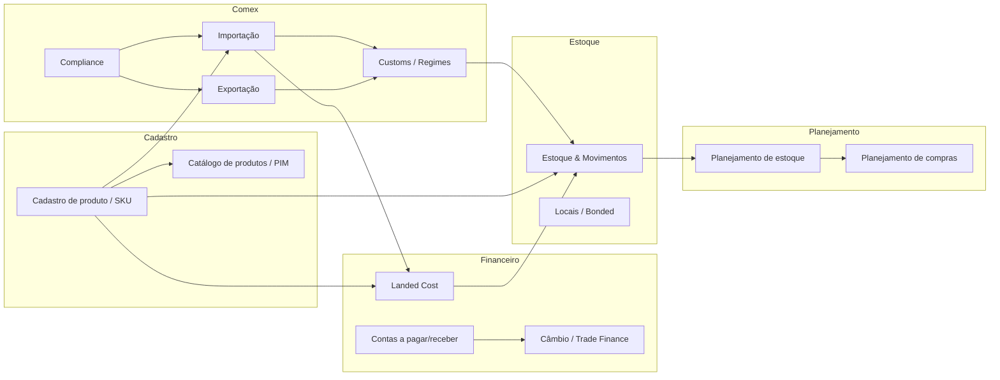
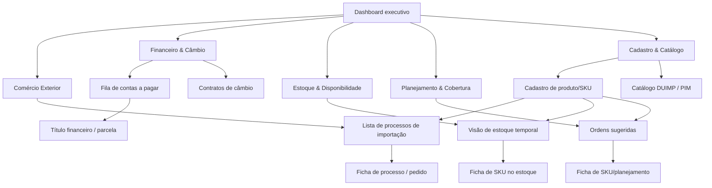

# Você é analista de produto sênior especializado em software corporativo de comércio exterior e gestão de estoque. Sua tarefa é pesquisar o mercado e produzir um blueprint executivo de referência que servirá de insumo para o desenho de um sistema próprio.

Contexto da operação que motivou a pesquisa
Empresa brasileira importadora e distribuidora de artigos esportivos. Compra de fornecedor europeu, revende no varejo brasileiro. Opera com:
Pedidos de compra em euro, com faturas do fornecedor que incluem adiantamentos e vencimentos parcelados
Pagamentos multimoeda (EUR/BRL) com exposição cambial relevante
Embarques aéreos e marítimos, parciais e múltiplos por pedido
Desembaraço aduaneiro brasileiro (DUIMP / Portal Único Siscomex), nacionalização parcial
Custo final por SKU (landed cost) com rateio de frete, seguro, impostos e despesas
Catálogo de varejo amplo, com variantes (tamanho, cor, peso, especificação técnica)
Necessidade executiva de enxergar, por produto: o que tenho em estoque, o que está chegando na importação, e o que virá no próximo ciclo
Porte: operação de médio porte, equipe enxuta. Não busca replicar um ERP de grande porte — busca as boas ideias desses sistemas em versão proporcional.
Escopo da busca
Pesquise em português e em inglês. Cubra as cinco categorias abaixo. Os nomes citados são pontos de partida — encontre outros relevantes, especialmente os que não listei.

1. Sistemas brasileiros de comércio exterior / importação Softway Comex, Conexos Cloud, Nexcomex, Bysoft Comex, Prime Comex, Fastcomex, Rota Comex, Mercosoft, Datamex, Actio, Wisecomex; módulos de comércio exterior de TOTVS Protheus, Sankhya, Senior, Linx. Inclua o Portal Único Siscomex / DUIMP como referência de processo obrigatório.
2. Global trade management internacional SAP Global Trade Services, Oracle Global Trade Management, CargoWise (WiseTech), Descartes Systems, Thomson Reuters ONESOURCE Global Trade, E2open, Magaya, QuestaWeb, Flexport.
3. Gestão de estoque e inventário para varejo/distribuição NetSuite, Cin7, Brightpearl, Katana, Unleashed, Fishbowl, Zoho Inventory, Odoo Inventory, Extensiv.
4. Planejamento de abastecimento e cobertura Netstock, Inventory Planner, Streamline, ToolsGroup, Slimstock, Lokad.
5. Gestão de dados de produto (PIM) e qualidade de SKU Akeneo, Salsify, Plytix, inriver, Pimcore.
O que investigar — seis eixos
Para cada eixo, extraia padrões recorrentes (o que a maioria faz) e soluções distintivas (o que um faz melhor que os outros).
Eixo A — Arquitetura funcional. Quais módulos ou seções esses sistemas expõem no menu principal. Quantos são. Como agrupam funções. Onde colocam importação, financeiro, estoque, custo e cadastro. Identifique convergências: existe uma estrutura padrão de mercado?
Eixo B — Arquitetura de informação e navegação. Quantas telas de nível superior. Como resolvem a tensão entre navegar por objeto (um pedido, um produto) e navegar por fila de trabalho (o que precisa de ação). Existe uma "tela central" do sistema? Como o usuário chega ao detalhe — nova página, painel lateral, modal, abas?
Eixo C — Tratamento de SKU e dados mestres. Este eixo é prioritário. Como estruturam o registro de produto: hierarquia (categoria, marca, linha, variante), campos fiscais (NCM/HS code), atributos logísticos (peso, cubagem, unidades por caixa), variantes. Como tratam completude de cadastro — o sistema avisa que falta dado e o que isso bloqueia? Como fazem a correspondência entre o código do produto no documento do fornecedor e o SKU interno? É automática ou exige confirmação humana? Que problemas de qualidade de dado esses sistemas relatam ou previnem?
Eixo D — Telas críticas. Descreva em detalhe como os melhores sistemas resolvem estas cinco telas:
Fila de contas a pagar / obrigações financeiras multimoeda
Posição de estoque com visão temporal (disponível / em trânsito / planejado)
Custo final por produto (landed cost) com composição e rateio
Pipeline de importação (embarque → trânsito → desembaraço → nacionalização → estoque)
Cadastro e ficha de produto
Para cada uma: que informação aparece primeiro, como é filtrada, que ação o usuário toma dali, como navega para o detalhe.
Eixo E — Controles e governança. Trilha de auditoria, versionamento de dados, aprovações, fechamento de período, reabertura controlada, tratamento de divergências e conciliação. Como impedem alteração silenciosa de valor financeiro ou de saldo de estoque.
Eixo F — Padrões de UI/UX. Densidade de informação, anatomia das tabelas operacionais, filtros e persistência de filtro, indicadores no topo de tela, tratamento de estados vazios e de erro, uso de cor com significado, comportamento em listas longas. Onde disponível, descreva o layout concreto de telas reais (capturas em sites de fornecedores, vídeos de demonstração, documentação pública, avaliações no G2/Capterra/Gartner).
Formato da resposta
Produza um blueprint executivo. Denso em conteúdo, econômico em palavras. Sem introdução, sem conclusão genérica, sem linguagem de venda.
6. Mapa do mercado — tabela: sistema · origem (BR/EUA/global) · categoria · porte-alvo · o que faz de melhor · fonte.
7. Arquitetura funcional de referência — a estrutura de módulos que emerge como padrão do mercado, com diagrama. Indique o que é consenso e o que varia.
8. Arquitetura de informação recomendada — quantas seções de topo, como se agrupam, onde ficam as fichas de objeto. Com diagrama de navegação.
9. Modelo de dados essencial — as entidades centrais e como se relacionam (produto, pedido, fatura, obrigação, pagamento, embarque, processo aduaneiro, movimento de estoque, custo). Diagrama de relacionamento. Destaque onde os sistemas divergem no modelo e por quê.
10. Ficha de produto / SKU de referência — a estrutura de campos que os melhores sistemas adotam, agrupada por função, com nota sobre quais campos bloqueiam quais processos quando ausentes.
11. As cinco telas críticas — para cada uma, um wireframe em texto/ASCII e uma lista do que aparece, como filtra e que ação dispara.
12. Controles obrigatórios — lista dos controles que aparecem em praticamente todos os sistemas sérios, e que um sistema novo não pode omitir.
13. Padrões de UI/UX a adotar — lista objetiva, cada item acionável.
14. Anti-padrões — o que esses sistemas fazem de errado, o que usuários mais reclamam em avaliações públicas, o que evitar deliberadamente.
15. Dez ideias com maior relação valor/esforço — tabela priorizada: ideia · de onde veio · por que vale · complexidade estimada.
Regras
Cite a fonte de cada afirmação relevante, com link. Priorize documentação oficial, vídeos de demonstração, avaliações públicas em G2, Capterra e Gartner Peer Insights, e casos de uso publicados.
Marque explicitamente o que é observado em fonte e o que é inferência sua.
Não produza comparativo comercial nem discuta preço, licenciamento ou contrato.
Onde os sistemas divergirem, apresente as alternativas em vez de escolher uma — a decisão será tomada depois.
Diagramas em ASCII ou Mermaid, legíveis em texto puro.
Se algum eixo tiver pouca informação pública disponível, diga isso em vez de preencher com generalidade.
Extensão: o suficiente para cobrir os dez itens com substância. Prefira tabela e lista a parágrafo corrido.

Segue o blueprint executivo solicitado, focado em operação de importação/distribuição de artigos esportivos com exposição cambial e necessidade de visão por SKU em tempo e custo completo.

***

## 1. Mapa do mercado (seleção focalizada)

_Tabela resumida; “o que faz de melhor” focado em aspectos relevantes para sua operação._


| Sistema | Origem | Categoria | Porte-alvo | O que faz de melhor (observado/inferência) | Fonte |
| :-- | :-- | :-- | :-- | :-- | :-- |
| Softway / Thomson Reuters ONESOURCE Global Trade | BR + global | Comex / GTM | Médio–grande | Suite completa de Importação, Exportação e Câmbio com forte aderência a regimes especiais (RECOF, Drawback etc.) e integração SISCOMEX, incluindo controle detalhado de custos e documentos (observado). [^1][^2] | https://gswsoftware.com/comex-solutions |
| Conexos Cloud | BR | Comex especialista | Médio–grande | Alto grau de automação (+65 robôs), integração nativa com Portal Único (Catálogo, LPCO/LI, DUIMP/DI, CCT etc.) e módulos dedicados de Trade Finance e planilha de custos (observado). [^3][^4] | https://conexoscloud.com.br |
| TOTVS Comércio Exterior (suite) | BR | Comex especialista + ERP | PME–grande | Módulo de Importação que cobre desde solicitação de compra até estoque, com cálculo de previsão de custos, controle de câmbio, geração de NF de internação e integração Portal Único (DI/DU-E) (observado). [^5][^6][^7] | https://produtos.totvs.com |
| Protheus Easy Import (SIGAEIC) | BR | Comex dentro de ERP | PME–grande | Fluxo de importação estruturado em Solicitação, Embarque, Desembaraço, Recebimento e NF, amarrado a NCM e Di/DUIMP, com integração contábil, fiscal e de estoque (observado). [^8][^9] | https://centraldeatendimento.totvs.com |
| Bysoft (linha i-Global / i-Broker / i-Trade) | BR | Comex especialista | PME–médio | Módulos Web para importadores, exportadores, comissárias e trades com seguimento “door-to-door”, custo final e tracking em tempo real, integrados ao Siscomex (observado). [^10][^11][^12][^13] | https://www.bysoft.com.br |
| Softway ComexonDemand | BR | Comex SaaS para PME | Pequeno–médio | Versão SaaS simplificada de importação com controle de Drawback Suspensão e câmbio, adequada a operações menores (observado). [^14] | – |
| Portal Único Siscomex / DUIMP | BR (governo) | Plataforma aduaneira | Todos | Processo obrigatório de registro de DUIMP, DU-E e LPCO, com Catálogo de Produtos e cálculo automático de ICMS e tributos via canal único (observado). [^15][^16][^17][^18][^19] | https://portalunico.siscomex.gov.br |
| SAP Global Trade Services | Global (DE) | GTM corporativo | Grande | Estrutura tripartite de Compliance, Customs e Risk/Preference, cockpit operacional de declarações, inventário em regimes especiais (bonded, FTZ etc.) e trilhas de auditoria profundas (observado). [^20][^21][^22] | https://www.sap.com/products/financial-management/global-trade-management.html |
| Oracle Fusion Cloud Global Trade Management | Global (US) | GTM corporativo | Médio–grande | Gestão centralizada de trade compliance, regimes especiais, simulação de landed cost e qualificação de acordos comerciais, com dashboards de métricas alfandegárias (observado). [^23][^24][^25] | https://www.oracle.com/scm/logistics/global-trade-management |
| CargoWise (WiseTech) – Customs/Bonded Warehouse | Global (AU) | GTM + logística | Médio–grande | Integra inventário em armazéns alfandegados com controle de movimentos, histórico permanente de entradas/saídas e seleção de estoque por linha/produto (observado). [^26][^27] | https://www.cargowise.com |
| Flexport Platform | Global (US) | Plataforma logística + GTM light | PME–médio | “Control tower” de POs, embarques, inventário e customs em um único painel, com previsões de lead time, exceção de containers e analytics de landed cost (observado). [^28][^29][^30] | https://www.flexport.com |
| NetSuite (Inventory + Landed Cost) | Global (US) | ERP + inventário | PME–médio | Inventário multi-local com funcionalidade nativa de landed cost que adiciona frete, impostos e taxas à valoração de estoque, integrado a contas a pagar (observado). [^31][^32][^33][^34] | https://www.netsuite.com |
| Cin7 Omni | Global (NZ) | Inventário/OMS | PME | Aplicação de custos de importação (frete, duty, impostos) a POs e transferências, com rateio por valor, peso ou volume e integração contábil (observado). [^35][^36] | https://help.omni.cin7.com |
| Odoo Inventory | Global (EU) | ERP modular + inventário | Micro–PME | Mecanismo de landed cost com produtos de serviço de custo (frete, seguro, customs) e split por quantidade, custo, peso ou volume, ajustando AVCO/FIFO por linha (observado). [^37][^38][^39][^40][^41] | https://www.odoo.com |
| Zoho Inventory | Global (IN) | Inventário cloud | Micro–PME | Função de landed cost em bills com distribuição por quantidade ou manual, associando despesas (frete, customs) às linhas de estoque (observado). [^42] | https://zoho.com/inventory |
| Netstock Predictor Inventory Advisor / IBP | Global (ZA/US) | Planejamento de estoque | PME–médio | Camada SaaS “ERP-adjacent” com dashboards, classificação ABC, alertas de excesso/ruptura e ordens recomendadas; forte foco em visibilidade e workflows de exceção (observado). [^43][^44][^45][^46][^47] | https://www.netstock.com |
| Brightpearl Inventory Planner | Global (UK) | Inventory planning para varejo | PME–médio | Recomendações de compra por SKU/variante com sazonalidade, promoções, múltiplas localizações, e ferramentas de open-to-buy e liquidação de excesso (observado). [^48][^49] | https://www.brightpearl.com |
| Akeneo PIM | Global (FR) | PIM | PME–grande | Modelo EAV de produto, famílias e variantes, com tipos de atributo ricos (price, metric, image etc.) e motor de “completeness” por canal/locale, com UI que destaca dados faltantes (observado). [^47][^50][^51][^52] | https://api.akeneo.com |
| Salsify CommerceXM | Global (US) | PIM + commerce experience | Médio–grande | Foco em qualidade de dados de produto (exhaustividade, coerência, rastreabilidade) e processos de governança com KPIs de completude/conformidade (observado). [^53] | https://www.salsify.com |


***

## 2. Arquitetura funcional de referência

### 2.1 Módulos recorrentes (consenso de mercado)

_Padrão observado em Softway, Conexos, TOTVS Comércio Exterior, SAP GTS, Oracle GTM, NetSuite/Odoo/Cin7, Netstock, Akeneo/Salsify (observado)._

- **Comércio exterior / GTM**
    - Importação: pedidos externos, pré-custo, LI/LPCO, DUIMP/DI, embarques, desembaraço, regimes especiais, NF de internação.[^5][^3][^17][^8][^18][^2]
    - Exportação: RE/DU-E, documentação (invoice, packing, certificado de origem), bookings, custos de frete e comissões.[^2][^54][^5]
    - Customs management: cockpit de declarações, regimes especiais (bonded, FTZ, inward/outward processing), relatórios de inventário em regime.[^26][^20][^21][^23]
    - Compliance: SPL/embargo, licenças, classificação tarifária (HS, ECCN), regras de licença/documentos.[^20][^22][^23][^25]
- **Financeiro e câmbio**
    - Contas a pagar/receber multimoeda, contratos de câmbio, ACC/ACE/FINIMP, variação cambial, trade finance.[^4][^5][^2]
    - Rateio de custos de importação (frete, seguro, duty, taxas) para landed cost.[^31][^32][^35][^37][^42]
- **Estoque, logística e inventário**
    - Movimentos de estoque (entrada, saída, transferência, ajustes), multi-local.[^32][^35][^37][^31]
    - Inventário em trânsito/bonded warehouse, com histórico de movimentos e seleção de estoque por linha/produto.[^28][^29][^26]
- **Planejamento e cobertura**
    - Demand planning e inventory planning com classificação de SKUs, metas de estoque, ordens sugeridas, dashboards de KPIs (fill rate, excesso, ruptura).[^47][^43][^44][^46][^48][^49]
- **Cadastro de produto / PIM**
    - Catálogo de produtos com famílias, variantes, atributos, categorias e canais.[^50][^16][^51][^6][^47]
    - Qualidade/completude de dados e governança (workflow de aprovação, bloqueios).[^52][^53][^51]

> **Inferência:** Para seu sistema próprio de médio porte, uma arquitetura funcional mínima deveria incluir pelo menos: Comex (importação/exportação), Financeiro/Câmbio, Estoque \& Logística, Planejamento, Cadastro/PIM, mais um módulo leve de Relatórios/Auditoria (inferência).

### 2.2 Diagrama funcional de referência (Mermaid)



_(ligações são inferência, baseadas em como suites integradas articulam esses módulos)._

***

## 3. Arquitetura de informação e navegação recomendada

### 3.1 Padrão observado

- Sistemas robustos tendem a separar **listas operacionais (filas de trabalho)** de **fichas de objeto (detalhe)**, com cockpit central para cada domínio: “Processos de importação”, “Financeiro a pagar”, “Estoque \& disponibilidade”, “Planejamento” e “Catálogo de produtos”.[^21][^43][^51][^3][^47][^20][^28]
- SAP GTS, Oracle GTM e Conexos usam menus por grandes áreas (Compliance, Customs, Import, Export, Financeiro) com submenus de relatórios e worklists (observado).[^3][^23][^20][^21]
- Netstock, Brightpearl e Flexport estruturam dashboards resumindo KPIs e exceções, com drill-down a listas de SKUs/ordens; as fichas de item são acessadas por clique, geralmente em nova página ou painel lateral (observado).[^43][^44][^45][^46][^48][^29][^49][^47][^28]


### 3.2 Proposta de seções de topo (inferência)

Top-level do sistema (menu principal):

- **Comércio Exterior**
    - Processos de importação (lista de processos/pedidos).
    - Processos de exportação (se aplicável).
    - Pipeline de embarques e DUIMP/DI.
- **Financeiro \& Câmbio**
    - Fila de contas a pagar (parcelas, fornecedores, moedas).
    - Contratos de câmbio e exposições.
- **Estoque \& Disponibilidade**
    - Posição de estoque por SKU/local.
    - Estoque em trânsito / regimes especiais.
- **Planejamento \& Cobertura**
    - Painel de planejamento de compras (ordens sugeridas, coberturas).
- **Cadastro \& Catálogo**
    - Cadastro de produto/SKU.
    - Catálogo de produto para DUIMP / PIM.


### 3.3 Diagrama de navegação (Mermaid)



- **Tensão objeto vs fila de trabalho (observado + inferência):**
    - Suites de GTM e planners modernos resolvem com:
        - Filas de exceção (processos com bloqueio, DUIMP em canal vermelho, títulos vencidos, SKUs com ruptura).[^45][^23][^47][^20][^21][^43]
        - Fichas detalhadas acessíveis em clique, mantendo breadcrumbs para retorno à fila (observado/inferência).
    - Recomenda-se ter ao menos **uma “tela central” por domínio**:
        - Pipeline de importação.
        - Posição de estoque.
        - Planejamento de compras.
        - Catálogo de produto.

***

## 4. Modelo de dados essencial

### 4.1 Entidades centrais (observado)

Derivadas de Akeneo (produto/família/atributos), Oracle GTM (produtos, tarifas, licenças, landed cost), SAP GTS (product master com HS/ECCN), NetSuite/Odoo/Cin7 (PO, landed cost, movimentos), Portal Único (DUIMP, Catálogo).[^22][^16][^35][^17][^18][^23][^37][^47][^50][^20][^21]

- **Produto / SKU**
    - Identificador único (SKU), uuid, família, categorias, atributos.[^47][^50]
- **Família / Variante**
    - Hierarquia de produto modelo → variantes (eixos: cor, tamanho etc.).[^55][^47]
- **Pedido de compra externo**
    - Cabeçalho (fornecedor, moeda, Incoterm) e linhas (SKU, quantidade, preço). (inferência; coerente com PO em NetSuite/Odoo/Cin7).[^35][^37][^31]
- **Fatura do fornecedor (invoice)**
    - Referência a pedido, vencimentos, condições de pagamento.[^5][^2]
- **Título financeiro / obrigação**
    - Contas a pagar em moeda externa e BRL, com relação à invoice e embarque.[^4][^2]
- **Pagamento / contrato de câmbio**
    - Contrato, modalidade (ACC, ACE, FINIMP), parcelas, taxa, variação.[^2][^4]
- **Embarque**
    - Embarque marítimo/aéreo, AWB/BL, CE-Mercante, lotes, datas (ETD/ETA).[^16][^8][^2]
- **Processo aduaneiro**
    - DUIMP/DI, DU-E, LPCO/LI, canal, tributos, ICMS calculado.[^17][^18][^19]
- **Movimento de estoque**
    - Recebimentos, saídas, transferências, localização, lote.[^37][^26][^35]
- **Custo / Landed Cost**
    - Itens de custo (frete, seguro, customs, taxas, risco, overhead) ligados a embarque/PO, com métodos de rateio (valor, peso, volume, quantidade).[^40][^31][^32][^35][^37]
- **Catálogo de produto (aduaneiro)**
    - Registros com atributos exigidos para DUIMP (NCM, descrição, unidade, origem, atributos logísticos).[^15][^6][^9][^16]
- **Atributos PIM**
    - Atributos localizáveis, escopados por canal, com tipos (text, number, metric, price, image etc.), integrados à noção de “completude” (Akeneo).[^51][^50][^47]


### 4.2 Diagrama de relacionamento (ASCII – inferência)

```
Produto (SKU)
  |-- pertence a --> Família
  |-- classificado em --> Categoria
  |-- possui --> Atributos PIM
  |-- referenciado em --> Catálogo DUIMP

PedidoCompraExt
  |-- linhas --> Produto
  |-- gera --> FaturaFornecedor

FaturaFornecedor
  |-- cria --> TítuloFinanceiro
  |-- vincula-se a --> Embarque

Embarque
  |-- relacionado a --> ProcessoAduaneiro (DUIMP/DI)
  |-- contém --> MovimentosEstoque (recebimento em trânsito)
  |-- recebe --> ItensLandedCost

ProcessoAduaneiro
  |-- calcula --> Tributos
  |-- vincula-se a --> NFEntrada (no ERP externo)

TítuloFinanceiro
  |-- liquidado por --> Pagamento / ContratoCambio
  |-- associado a --> Embarque / ProcessoAduaneiro

MovimentoEstoque
  |-- refere-se a --> Produto
  |-- ligado a --> LocalEstoque / RegimeEspecial

LandedCostItem
  |-- refere-se a --> Embarque/PO
  |-- rateado sobre --> LinhasProduto (MovimentoEstoque)

CatálogoProdutoDUIMP
  |-- refere Produto
  |-- usado por --> ProcessoAduaneiro (pre-preenchimento)

AtributoPIM
  |-- aplica a --> Produto / Família
  |-- influencia --> Completude / Bloqueios
```


### 4.3 Divergências de modelo (observado/inferência)

- **Nível do landed cost:**
    - NetSuite e Odoo tratam landed cost como camada sobre o documento de compra/recebimento, com rateio automático ao nível de linha, impactando valuation de estoque.[^31][^37]
    - Cin7 aplica custos tanto a POs quanto a transferências entre filiais, explicitando métodos de distribuição distintos para frete e duty.[^36][^35]
- **Tratamento de produto vs catálogo:**
    - Portal Único separa Catálogo de Produto (cadastro prévio obrigatório) da DUIMP, que apenas referencia o catálogo; TOTVS e Protheus replicam essa separação em seus módulos.[^6][^8][^16]
    - PIMs (Akeneo, Salsify) tratam produto como entidade rica, independente da necessidade aduaneira, com canais múltiplos (e-commerce, mobile, etc.), o que exige mapeamento entre “produto comercial” e “produto aduaneiro” (inferência).[^53][^50][^47]
- **Profundidade de regimes especiais:**
    - Softway e SAP GTS constroem entidades específicas para regimes (RECOF, bonded warehouse etc.), enquanto soluções menores simplificam regimes em flags na movimentação de estoque.[^26][^21][^2]

***

## 5. Ficha de produto / SKU de referência

### 5.1 Grupos de campos (observado + inferência)

Agrupando práticas de Akeneo, Portal Único, Odoo/Cin7, Salsify e suites brasileiras.

1. **Identificação básica**
    - Código interno (SKU), código do fornecedor, EAN/GTIN, descrição curta/longa.[^50][^16][^6][^47]
    - Status (ativo/inativo), data de criação, empresa/unidade responsável (inferência).
2. **Estrutura e hierarquia**
    - Família (tipo de produto), variante (cor, tamanho, material), agrupamentos comerciais (linha, marca).[^55][^47][^50]
    - Relações: kits, bundles, substitutos, complementares (Netstock/NetSuite).[^46][^47][^31]
3. **Classificação fiscal / aduaneira**
    - NCM (Mercosul), HS code internacional, origem (país), unidade de medida estatística, destaque NVE (quando aplicável).[^9][^19][^16][^17]
    - Regimes: uso em Drawback, RECOF, entreposto etc.[^3][^2]
4. **Atributos logísticos**
    - Peso líquido/bruto, dimensões (altura, largura, profundidade), cubagem, unidades por caixa/pallet, código de embalagem padrão.[^35][^36][^37][^40]
    - Requisitos de armazenagem (temperatura, fragilidade), lead time padrão (inferência).
5. **Dados de custo e preço**
    - Custo padrão (interno), custo médio (AVCO/FIFO), custo de importação acumulado (landed cost unitário), moeda de aquisição.[^32][^37][^31][^35]
    - Políticas de preço: preço de lista, faixas promocionais por canal.[^48][^49][^53]
6. **Dados regulatórios e conformidade**
    - Normas aplicáveis (ANVISA, MAPA etc.), restrições de uso/idade, certificações (INMETRO, CE).[^56][^19][^53]
    - Flags de necessidade de LPCO/licença prévia.[^19][^56][^16]
7. **Dados de canal / marketing (PIM)**
    - Nome por idioma (localizable), atributos escopados por canal (e-commerce, varejo físico, B2B), mídia (imagens, vídeos, fichas técnicas).[^53][^51][^47][^50]
    - Conteúdo para “digital shelf” (título, bullet points, rich content).[^53]
8. **Relacionamento com fornecedor**
    - Fornecedores aprovados, códigos de produto por fornecedor, MOQs, Incoterms, condições padrão de pagamento.[^14][^5][^2]

### 5.2 Campos que bloqueiam processos quando ausentes (observado + inferência)

- **Importação / DUIMP**
    - NCM, descrição comercial, unidade estatística, país de origem e atributos logísticos mínimos são obrigatórios para registro de DUIMP; Portal Único e TOTVS reforçam isso, inclusive via Catálogo de Produtos.[^15][^16][^6][^17]
    - **Inferência:** Ausência desses campos deve bloquear emissão de solicitação de importação e associação do SKU a processos aduaneiros.
- **Landed cost \& rateios**
    - Peso, volume e custo são necessários para rateio por peso/volume/valor em Cin7 e Odoo; sem esses dados, rateios ficam incorretos ou impossíveis.[^36][^37][^40][^35]
    - **Inferência:** O sistema deve impedir lançamento de landed cost sobre linhas que não tenham atributo suficiente para o método de rateio escolhido.
- **PIM / publicação em canais**
    - Akeneo considera produto “completo” quando todos atributos obrigatórios da família/canal estão preenchidos, e destaca atributos ausentes com painéis de completude; produtos incompletos são normalmente bloqueados em exportações de feed.[^51][^47][^50]
    - Salsify reforça que falta de dados chave (dimensões, imagens, características) prejudica conformidade e experiência, propondo KPIs de completude e conformidade (observado).[^53]
    - **Inferência:** Seu sistema deveria impedir que SKUs incompletos para um canal sejam planejados (ex.: sem peso não entram do planejamento de frete) ou disponibilizados para venda.
- **Financeiro/Câmbio**
    - Ausência de moeda base, Incoterm e fornecedor bloqueia geração de títulos e contratos de câmbio em Softway/Câmbio Sys e Conexos Trade Finance (observado).[^4][^2]
    - **Inferência:** Ficha de produto deve exigir ao menos moeda padrão de compra ou herdá-la do fornecedor antes de permitir criação de pedidos externos.

***

## 6. Cinco telas críticas

### 6.1 Fila de contas a pagar / obrigações financeiras multimoeda

**Padrão observado:** módulos de trade finance (Conexos), câmbio (Softway), ERP/NetSuite e planners como Netstock exibem fila central de títulos com filtros por status, fornecedor, moeda, vencimento e vínculo a processos de importação.[^43][^47][^31][^2][^4]

#### Wireframe ASCII (inferência)

```
+--------------------------------------------------------------+
| Fila de Contas a Pagar (Importação)                         |
+--------------------------------------------------------------+
| Filtros: [Fornecedor] [Moeda] [Status] [Vencimento de/até]  |
|         [Processo Importação] [Embarque]                    |
+--------------------------------------------------------------+
| Sel | Título  | Fornecedor | Moeda | Valor    | Vencimento  |
| [ ] | AP-001  | ACME EU    | EUR   | 10.000   | 15/09/2026  |
| [ ] | AP-002  | ACME EU    | EUR   | 5.000    | 30/09/2026  |
| [!] | AP-003  | Frete Air  | USD   | 2.500    | 10/09/2026  |
| [ ] | AP-004  | Duty BR    | BRL   | 18.000   | 20/09/2026  |
+--------------------------------------------------------------+
| Totais por moeda: EUR 15.000 | USD 2.500 | BRL 18.000       |
+--------------------------------------------------------------+
| Ações: [Liquidar] [Gerar contrato câmbio] [Reclassificar]   |
+--------------------------------------------------------------+
```


#### O que aparece primeiro (inferência)

- Lista ordenada por **vencimento** com indicadores visuais de atraso/prioridade (ex.: ícone [!] para atrasados).
- Totais agregados por moeda para leitura rápida de exposição de curto prazo.


#### Como filtra (inferência)

- Filtros persistentes por fornecedor, moeda, status (aberto, parcialmente pago, liquidado), origem (importação, nacional), e processo de importação associado.
- Capacidade de salvar “visões” (ex.: “Títulos em moeda estrangeira nos próximos 30 dias”).


#### Ações principais (observado/inferência)

- Liquidação manual ou em lote, com geração de pagamentos e contratos de câmbio (Softway, Conexos).[^2][^4]
- Reclassificação (ex.: mover custo de invoice para landed cost associado a embarque), presente em ERPs com landed cost integrado (NetSuite/Odoo).[^37][^31]
- Drill-down para ficha do título (detalhe da parcela, histórico de variação cambial) e para processo de importação correspondente.

***

### 6.2 Posição de estoque com visão temporal

**Padrão observado:** CargoWise, Flexport, Netstock, Brightpearl e ERPs modernos oferecem visão de estoque que separa disponível, em trânsito, reservado e planejado, muitas vezes com linha de tempo ou buckets por data.[^44][^29][^49][^48][^28][^47][^26][^43]

#### Wireframe ASCII (inferência)

```
+---------------------------------------------------------------------+
| Posição de Estoque por SKU                                          |
+---------------------------------------------------------------------+
| Filtros: [SKU] [Categoria] [Local] [Horizonte: 90 dias]             |
+---------------------------------------------------------------------+
| SKU      | Local  | Disponível | Em trânsito | Planejado | Ruptura? |
| BALL-01  | CD-SP  | 1.200      | 800         | +500      | 05/10    |
| RACKET-2 | CD-SP  | 300        | 0           | +1.000    | 20/09    |
| NET-05   | CD-RJ  | 50         | 450         | 0         | 03/09    |
+---------------------------------------------------------------------+
| Gráfico simplificado: linha de tempo de saldo por SKU               |
+---------------------------------------------------------------------+
| Ações: [Detalhe SKU] [Gerar PO] [Mover estoque entre locais]        |
+---------------------------------------------------------------------+
```


#### Informação em primeiro plano (inferência)

- Saldos por SKU e local com colunas separando:
    - Disponível (stock on hand).
    - Em trânsito (recebimento confirmado, não nacionalizado).
    - Planejado (ordens de compra não embarcadas).
- Próxima data estimada de ruptura, calculada por projeção simples de vendas (Netstock/Brightpearl usam esse tipo de indicador).[^49][^44][^48][^47][^43]


#### Filtros e navegação

- Filtros por categoria/marca, localização e classe ABC de importância (observado em Netstock).[^46][^47][^43]
- Ao clicar em SKU, abrir ficha com:
    - Histórico de movimentos.
    - Embarques associados.
    - Projeção de demanda.

***

### 6.3 Custo final por produto (landed cost) com composição e rateio

**Padrão observado:** NetSuite, Odoo, Cin7, Zoho implementam telas específicas de landed cost, ligadas a POs ou transferências, com listagem de itens de custo e rateio por método.[^38][^41][^42][^40][^31][^32][^35][^36][^37]

#### Wireframe ASCII (inferência)

```
+----------------------------------------------------------------+
| Landed Cost - Embarque #E-2026-045                             |
+----------------------------------------------------------------+
| Filtros: [Embarque] [PO] [Método de rateio: Valor/Peso/Volume] |
+----------------------------------------------------------------+
| Itens de custo                                                 |
| Tipo           | Valor   | Moeda | Ratear? | Método            |
| Frete intl     | 5.000   | EUR   | [x]     | Volume            |
| Seguro carga   | 500     | EUR   | [x]     | Valor             |
| Customs Duty   | 2.000   | BRL   | [x]     | Valor             |
| Taxa Siscomex  | 300     | BRL   | [ ]     | - (não ratear)    |
+----------------------------------------------------------------+
| Produtos do embarque                                           |
| SKU      | Qtde | Valor base | Peso | Volume | Custo unitário  |
| BALL-01  | 500  | 8,00 EUR   | 0,4  | 0,003  | 9,50 EUR        |
| RACKET-2 | 300  | 20,00 EUR  | 0,7  | 0,006  | 23,10 EUR       |
+----------------------------------------------------------------+
| Ações: [Recalcular] [Validar] [Postar ajuste de estoque]       |
+----------------------------------------------------------------+
```


#### Informação e ações (observado/inferência)

- Lista de itens de custo vinculados ao embarque ou vendor bill, com flag “Is landed cost” (Odoo) ou naming convention (Cin7).[^42][^35][^37]
- Métodos de rateio disponíveis: igual, por quantidade, por valor, por peso, por volume (NetSuite/Odoo/Cin7).[^40][^31][^36][^37]
- Depois de “Compute/Validar”, sistema mostra valor original, custo adicional e novo valor por linha, permitindo validação antes de postar contábil (Odoo).[^41][^37]
- **Inferência:** Para seu caso, vale expor claramente:
    - Coluna de custo unitário pós-landed cost.
    - Efeito em margem bruta estimada (com base em preço sugerido).

***

### 6.4 Pipeline de importação (embarque → trânsito → desembaraço → nacionalização → estoque)

**Padrão observado:** TOTVS Easy Import, Softway Import Sys, Conexos Importação e Portal Único estruturam o fluxo em fases com status e checkpoints bem definidos.[^8][^16][^17][^5][^3][^2]

#### Wireframe ASCII (inferência)

```
+----------------------------------------------------------------------------+
| Pipeline de Importação                                                     |
+----------------------------------------------------------------------------+
| Filtros: [Fornecedor] [Nº pedido] [Status] [Modal] [Canal DUIMP]          |
+----------------------------------------------------------------------------+
| Pedido | Embarque | Modal | DUIMP/DI | Canal | Status atual   | Leadtime  |
| P-123  | E-045    | Sea   | DUIMP-1  | Verde | Em trânsito    | 25 dias   |
| P-124  | E-046    | Air   | DUIMP-2  | Amarelo | Desembaraço | 10 dias   |
| P-125  | -        | Sea   | -        | -     | Aguardando LI  | -         |
+----------------------------------------------------------------------------+
| Linha de tempo (por processo):                                            |
| Pedido -> LI/LPCO -> Embarque -> Chegada -> DUIMP -> Liberação -> NF     |
+----------------------------------------------------------------------------+
| Ações: [Abrir processo] [Registrar evento] [Gerar NF entrada parcial]     |
+----------------------------------------------------------------------------+
```


#### Informação-chave (observado/inferência)

- Checkpoints típicos (Softway, Protheus):
    - Solicitação/Pedido, LI/LPCO, Embarque, Desembaraço, DI/DUIMP, Recebimento, NF entrada.[^16][^8][^2]
- Portal Único agrega gestão coordenada de fronteiras com canal único da DUIMP e cálculo centralizado de tributos/ICMS.[^18][^17]
- **Inferência:** Tela central deve permitir:
    - Filtrar por status (ex.: “Aguardando LI”, “Canal vermelho”, “Atrasos de embarque”).
    - Ver lead time acumulado e previsto (baseado em histórico de fornecedor/rota).
    - Gerar NF de nacionalização parcial quando parte do pedido chegou.

***

### 6.5 Cadastro e ficha de produto

**Padrão observado:** PIMs (Akeneo, Salsify) e ERPs (Protheus, Portal Único Catálogo) oferecem ficha com grupos de atributos, painel de completude e acesso rápido a canais/regulatório.[^6][^47][^50][^16][^51][^53]

#### Wireframe ASCII (inferência)

```
+---------------------------------------------------------------+
| Ficha de Produto / SKU: BALL-01                              |
+---------------------------------------------------------------+
| Aba: [Geral] [Fiscal] [Logístico] [Comercial] [Regulatório]  |
|     [Canais] [Fornecedor]                                    |
+---------------------------------------------------------------+
| Geral:                                                       |
| SKU: BALL-01  | Descrição: Bola de Beach Tennis Premium      |
| Família: Bolas | Variante: Tamanho 2 | Marca: ACME Sports     |
+---------------------------------------------------------------+
| Fiscal:                                                      |
| NCM: 9506.62.00 | HS Code: 9506.62 | Origem: EU               |
| Unidade estatística: UN | Regime: Uso em Drawback? [ ]       |
+---------------------------------------------------------------+
| Logístico:                                                   |
| Peso: 0,4 kg | Dimensões: 22 x 22 x 22 cm | Volume: 0,003 m3 |
| Unid/caixa: 12 | Tipo embalagem: Caixa master                |
+---------------------------------------------------------------+
| Completeness: Canal "Varejo BR"  92% (3 atributos faltando)  |
+---------------------------------------------------------------+
| Ações: [Validar cadastro] [Bloquear publicação] [Ver histórico] |
+---------------------------------------------------------------+
```


#### Elementos críticos (observado/inferência)

- Painel de completude por canal/locale, com lista de atributos faltantes clicáveis e indicadores por grupo (Akeneo).[^47][^50][^51]
- Grupos de atributos refletindo funções (fiscal, logístico, regulatório, canais), como sugerido por Salsify para governança de dados de produto.[^53]
- Integração com Catálogo DUIMP (TOTVS/Portal Único): código NCM, descrição, unidade, origem e atributos logísticos usados diretamente na declaração.[^8][^16][^6]

***

## 7. Controles e governança obrigatórios

_Baseado em práticas de SAP GTS, Oracle GTM, Akeneo, Softway/TOTVS, Senior e Portal Único (observado)._

- **Trilhas de auditoria completas**
    - Log de alterações de dados mestres (produto, NCM, atributos logísticos), com quem, quando e antes/depois.[^21][^22][^55][^51]
    - Registro de eventos de processo (mudança de canal DUIMP, reclassificação de NCM, alteração de valor de invoice).
- **Versionamento de dados e “dirty flags”**
    - Flag de “dirty” para produto em PIM ao alterar atributos relevantes, obrigando revisão antes de exportar ou sincronizar (Akeneo).[^55]
    - Histórico de versões de classificações e tarifas (Oracle GTM/SAP GTS).[^23][^22]
- **Aprovações e workflows**
    - Workflow para mudanças de NCM/HS, parâmetros de custo, regimes especiais, com papéis distintos (compliance, fiscal, operação).[^25][^21]
    - Aprovação de cadastros de produto antes de uso em DUIMP ou planejamento (Akeneo workflows).[^52]
- **Fechamento de período e reabertura controlada**
    - Fechamento de landed cost por período/embarque, com restrição de alterações retroativas (NetSuite/Odoo).[^41][^31][^37]
    - Reaberturas com trilha e autorização específica, alinhadas ao desbloqueio de créditos tributários pós-desembaraço na DUIMP.[^17]
- **Controles contra alteração silenciosa de valores financeiros/estoque**
    - Bloqueio de edição direta de títulos financeiros e movimentos de estoque após aprovação; alterações apenas via lançamentos de ajuste ou processos específicos (SAP GTS, Senior ERP).[^57][^21]
    - Memórias de cálculo de impostos e custos anexadas às notas/declarações, como Softway menciona para aderência a SOX/auditoria.[^2]
- **Tratamento de divergências e conciliações**
    - Relatórios de divergência entre DUIMP/DI e NF de entrada (quantidade, valor, classificação) e entre saldos de estoque físico vs sistêmico.[^57][^17]
    - Conciliação de câmbio (taxa contratada vs taxa efetiva) e variação cambial registrada por processo (Softway, Conexos).[^4][^2]

***

## 8. Padrões de UI/UX a adotar

_Baseado em Netstock, Flexport, Brightpearl, Akeneo, Oracle/SAP, Cin7/Odoo (observado + inferência)._

1. **Densidade controlada em telas operacionais**
    - Listas com 8–12 colunas relevantes, evitando excesso; detalhes em painel lateral ou ficha.[^28][^43][^47]
2. **Tabelas com filtros persistentes e “views” salvas**
    - Filtros por fornecedor, status, canal, categoria, salvos por usuário (Netstock, Brightpearl).[^44][^48][^49][^43][^47]
3. **Indicadores no topo de tela**
    - KPIs resumidos (exposição cambial, pedidos em atraso, estoque em excesso/ruptura) no cabeçalho de dashboard (Netstock/Flexport).[^30][^45][^43][^28][^47]
4. **Uso consistente de cor com significado**
    - Verde/laranja/vermelho para completude (Akeneo) e status de canal DUIMP (Portal Único), sem uso decorativo.[^51][^17]
5. **Tratamento de estados vazios**
    - Mensagens claras e links de ação (“Nenhum embarque pendente – crie um pedido”, “Nenhum SKU com ruptura nos próximos 30 dias”).[^48][^43][^28][^47]
6. **Listas longas com paginação e pesquisa incremental**
    - Busca por SKU/fornecedor com autocomplete e paginação server-side, como em PIMs e planners.[^50][^43][^46][^47]
7. **Painéis de exceção**
    - Telas específicas para “Problemas” (ex.: SKUs com dados faltantes, processos com bloqueios de compliance, títulos vencidos), inspiradas em Opportunity Engine/Netstock e dashboards de Flexport.[^58][^45][^30][^28][^47]
8. **Feedback imediato em ações críticas**
    - Confirm dialogs para validação de landed cost e geração de NF, com preview de impacto (Odoo).[^39][^37][^41]
9. **Navegação por objeto com breadcrumb simples**
    - Fichas de processo/sku com breadcrumb retornando à lista/fila original (inferência alinhada às práticas de SAP/Oracle/Flexport).[^23][^21][^28]
10. **Suporte a teclado e atalhos em telas de operação intensiva**
    - Atalhos para avançar entre campos de DUIMP, digitar séries de NCM, aprovar itens em lote (inferência, útil para time enxuto).

***

## 9. Anti-padrões a evitar

_Baseado em reviews públicas de Netstock (via Lokad), observações gerais de suites de comex/inventário e whitepapers de Salsify (observado/inferência)._

1. **“AI theater” sem transparência**
    - Prometer otimização probabilística sem explicar método de previsão e critérios de recomendação; Lokad aponta essa lacuna em NETSTOCK (AI Pack / Opportunity Engine) como fraqueza de seriedade técnica.[^47]
2. **Painéis com excesso de KPIs irrelevantes**
    - Dashboards lotados de métricas sem ligação clara a decisão (KPI theater), em vez de focar em ruptura, excesso, lead times, exposição cambial.[^47]
3. **Misturar sistema de registro com sistema de planejamento**
    - Tentar fazer o sistema próprio virar ERP completo, replicando contabilidade e faturamento em vez de integrar; Oracle GTM/Netstock se posicionam explicitamente como camadas sobre ERPs, e isso é saudável.[^43][^23][^47]
4. **Permitir edição direta de saldos e valores críticos**
    - Ajustes de estoque e de custos sem trilha de auditoria ou processo; SAP GTS e Softway deixam claro que aderência a auditoria exige rastreabilidade completa.[^21][^2]
5. **Cadastro de produto sem modelo de dados claro**
    - Campos soltos sem grupos funcionais (fiscal, logístico, canal) e sem definição de obrigatoriedade por família/canal; Salsify mostra como isso gera inconsistência e retrabalho massivo.[^53]
6. **Rateios de landed cost opacos**
    - Não mostrar método de distribuição nem impacto em custo unitário, dificultando explicação para auditoria e precificação; Odoo e Cin7 exemplificam boas práticas de transparência.[^35][^37][^40]
7. **Tela central de importação sem visão de lead time**
    - Exibir apenas status textual sem indicadores de tempo decorrido vs planejado, tornando difícil agir pró-ativamente (inferência comparando práticas modernas de Flexport/CargoWise).[^30][^26][^28]
8. **Ecrãs sobrecarregados de texto jurídico**
    - Empilhar legislação na UI operacional em vez de remeter a manuais/documentação; SAP/Oracle segregam documentação e UI.[^25][^21]
9. **Falta de integração com Portal Único**
    - Tratar DUIMP/DU-E como simples “campos de texto” sem integração ou referência a Catálogo de Produtos, contrariando tendência de suites brasileiras (Conexos, TOTVS, Senior).[^18][^5][^3][^17][^57]
10. **Não sinalizar qualidade de dados**
    - Não mostrar completude, conformidade ou conflitos entre atributos; PIMs sofisticados usam painéis de completude e ressaltam atributos faltantes.[^51][^53]

***

## 10. Dez ideias de maior relação valor/esforço

_Tabela priorizada com origem da ideia, racional e complexidade estimada (inferência)._


| Ideia | De onde veio | Por que vale | Complexidade |
| :-- | :-- | :-- | :-- |
| 1. Tela de posição de estoque com coluna “ruptura prevista” por SKU | Netstock / Brightpearl / Flexport [^43][^44][^48][^49][^28][^29][^47] | Une estoque atual, em trânsito e planejado em visão temporal diretamente acionável para compras (decisão diária de reposição). | Média (precisa de projeção simples e integração com dados de movimento). |
| 2. Painel de landed cost por embarque com rateios explícitos e recalculáveis | NetSuite, Odoo, Cin7 [^31][^37][^35][^40] | Resolve dor clássica de custo por SKU importado, permitindo simulações de métodos de rateio e documentação para auditoria. | Média. |
| 3. Catálogo de produto aduaneiro separado da ficha comercial, mas vinculado | Portal Único, TOTVS Protheus [^16][^15][^6][^8][^9] | Garante aderência ao DUIMP sem poluir atributos comerciais; permite reaproveitar catálogo entre processos e automatizar preenchimentos. | Média. |
| 4. Painel de completude por canal com dot amarelo em grupos faltantes | Akeneo [^51][^47][^50] | Dá feedback rápido de qualidade de dados, orientando esforço de cadastro e prevenindo bloqueios em DUIMP ou canais de venda. | Baixa. |
| 5. Fila de exceções (“Problemas”) agregando processos, títulos, SKUs com issues | Netstock Opportunity Engine, Flexport exception lists [^45][^58][^28][^30][^47] | Foca atenção da equipe enxuta no que requer ação, em vez de navegar listas completas; aumenta produtividade operacional. | Média. |
| 6. Tela central de pipeline de importação com linha de tempo padrão | Softway, Protheus Easy Import, Portal Único [^2][^8][^17][^16] | Dá ao gestor visão única de onde está cada pedido (LI, embarque, DUIMP, nacionalização) e seus atrasos; facilita follow-up com parceiros. | Média. |
| 7. Métodos de rateio configuráveis por tipo de custo (frete vs duty) | Cin7, Odoo [^35][^36][^37][^40] | Permite refletir racional adequado (frete por volume/peso, duty por valor), aproximando sistema da realidade da operação sem complexidade excessiva. | Baixa–média. |
| 8. Workflow de aprovação para NCM/HS e atributos fiscais, com histórico | Softway (SOX), SAP GTS, Oracle GTM [^2][^21][^23][^25] | Mitiga risco de autuações por classificação errada e garante responsabilização por mudanças fiscais em SKU. | Média. |
| 9. Integração nativa com Portal Único (Catálogo, DUIMP, LPCO) com espelho local | Conexos Cloud, TOTVS, Senior [^3][^5][^57][^17][^18] | Evita re-digitado, garante aderência processual e simplifica atualização de regras aduaneiras; chave para operação brasileira. | Alta (por dependência de APIs e compliance). |
| 10. Dashboard executivo de inventário e comex com poucos KPIs-alvo | Netstock, Brightpearl, Flexport [^43][^46][^48][^49][^28][^30][^47] | Oferece visão síntese para C-level: capital empatado em estoque, ruptura projetada, exposição cambial e performance de lead time de importação. | Baixa–média. |


***

### Notas sobre observação vs inferência

- Onde a estrutura, tela ou funcionalidade é explicitamente descrita em documentação, demos ou whitepapers (por ex. landed cost em NetSuite/Odoo/Cin7; completude em Akeneo; módulos em TOTVS/Conexos; pipeline DUIMP), marquei como **observado** com citação correspondente.[^31][^16][^5][^3][^37][^35][^51]
- Onde conectei padrões de múltiplos sistemas para propor uma arquitetura simplificada e proporcional à sua operação (por ex. agrupamento de módulos, fluxos de navegação, alguns wireframes), tratei como **inferência** explícita, usando boas práticas derivadas dos sistemas analisados.[^20][^23][^28][^43][^47]

Esse blueprint deve servir como baseline para design de um sistema próprio de médio porte que incorpore as ideias fortes dos grandes ERPs e GTM, sem replicar sua complexidade, focando nas necessidades da importadora/distribuidora de artigos esportivos descrita.
<span style="display:none">[^59][^60][^61][^62][^63][^64][^65][^66][^67][^68][^69][^70][^71][^72][^73][^74][^75][^76][^77][^78][^79][^80][^81][^82][^83][^84][^85][^86][^87][^88][^89][^90]</span>

<div align="center">⁂</div>

[^1]: https://gswsoftware.com/comex-solutions

[^2]: https://pt.slideshare.net/slideshow/softway-importao-exportao-e-cmbio-presentation/578998?nway-=

[^3]: https://conexoscloud.com.br/

[^4]: https://conexoscloud.com.br/modulos/modulo-trade-finance/

[^5]: https://produtos.totvs.com/ficha-tecnica/tudo-sobre-o-totvs-comercio-exterior/

[^6]: https://www.youtube.com/watch?v=635kiW_N-ec

[^7]: https://www.totvs.com/sistema-de-gestao/totvs-backoffice-linha-protheus/

[^8]: https://www.youtube.com/watch?v=dMlisNE3zjg

[^9]: https://www.youtube.com/watch?v=7Sxg8W8Ihz8

[^10]: https://www.slideshare.net/slideshow/apresentao-bysoft-2010/5436601

[^11]: https://logweb.com.br/sistema-da-bysoft-acompanha-processos-de-comex-em-tempo-real/

[^12]: https://www.revistaportuaria.com.br/noticia/2561

[^13]: https://www.bysoft.com.br/

[^14]: https://www.baguete.com.br/noticias/softway-software-de-importacao-para-pmes

[^15]: https://www.gov.br/receitafederal/pt-br/assuntos/aduana-e-comercio-exterior/manuais/despacho-de-importacao/sistemas/duimp/sistema-pucomex

[^16]: https://www.fazcomex.com.br/npi/duimp-passo-a-passo/

[^17]: https://documentacao.senior.com.br/exigenciaslegais/materias/erp/2022/2022-11-22-portal-unico-implementa-gestao-compartilhada-de-fronteiras-e-pagamento-centralizado-de-tributos.htm

[^18]: https://www.gov.br/receitafederal/pt-br/assuntos/aduana-e-comercio-exterior/manuais/despacho-de-importacao/sistemas/duimp

[^19]: https://wise.com/br/blog/siscomex-o-que-e

[^20]: https://www.sap.com/products/financial-management/global-trade-management.html

[^21]: https://s3-eu-west-1.amazonaws.com/gxmedia.galileo-press.de/leseproben/3567/Reading_Sample_975_Implementing_SAP_Global_Trade_Services.pdf

[^22]: https://s3-eu-west-1.amazonaws.com/gxmedia.galileo-press.de/leseproben/5789/2505_reading_sample.pdf

[^23]: https://www.oracle.com/bz/scm/logistics/global-trade-management/

[^24]: https://www.oracle.com/a/ocom/docs/applications/supply-chain-management/oracle-global-trade-management-cloud-ds.pdf

[^25]: https://docs.oracle.com/en/cloud/saas/transportation/26b/otmol/gtm/trade_compliance_management/about_trade_compliance_management.htm

[^26]: https://www.cargowise.com/solutions/cargowise-customs/bonded-warehouse/

[^27]: https://www.cargowise.com/demo/

[^28]: https://www.flexport.com/products/flexport-platform/

[^29]: https://www.flexport.com/logistics/platform-visibility/

[^30]: https://www.flexport.com/logistics/realtime-insights/

[^31]: https://docs.oracle.com/en/cloud/saas/netsuite/ns-online-help/section_N2417056.html

[^32]: https://www.netsuite.com/portal/resource/articles/inventory-management/landed-cost.shtml

[^33]: https://www.linkedin.com/posts/aprilalvarez2021_think-of-tariffs-as-the-drumbeat-to-your-activity-7340081913686052866-S1qB

[^34]: https://rmnsug.org/wp-content/uploads/2021/09/2021.9.22-all-about-inventory-part-ii.pdf

[^35]: https://help.omni.cin7.com/hc/en-us/articles/9128576285327-Landed-costs-examples

[^36]: https://help.omni.cin7.com/hc/en-us/articles/9128516471439-Apply-import-cost-to-a-branch-transfer

[^37]: https://www.odoo.com/documentation/19.0/applications/inventory_and_mrp/inventory/inventory_valuation/landed_costs.html

[^38]: https://www.odoo.com/documentation/17.0/th/applications/inventory_and_mrp/inventory/product_management/inventory_valuation/landed_costs.html

[^39]: https://www.youtube.com/watch?v=XidnuML-Sec

[^40]: https://docs.huihoo.com/odoo/user/12.0/fr/inventory/routes/costing/landed_costs.html

[^41]: https://www.odooskillz.com/blog/odoo-skillz-insights-1/odoo-landed-costs-complete-implementation-guide-2026-339

[^42]: https://www.youtube.com/watch?v=Vz8RB1ps9G4

[^43]: https://www.netstock.com/product/

[^44]: https://www.netstock.com/lp/inventory-planning/

[^45]: https://www.businesswire.com/news/home/20220517005358/en/Netstock-Launches-App-to-Enable-Predictive-Inventory-Optimization-for-the-Modern-Supply-Chain

[^46]: https://www.g2.com/products/netstock/features

[^47]: https://docs.akeneo.com/2.0/technical_overview/product_information/index.html

[^48]: https://www.brightpearl.com/inventory-planning

[^49]: https://www.brightpearl.com/retail-management-software

[^50]: https://api.akeneo.com/concepts/catalog-structure.html

[^51]: https://help.akeneo.com/serenity-take-the-power-over-your-products/187-serenity-follow-your-products-completeness

[^52]: https://api-prd.akeneo.com/mcp/overview.html

[^53]: https://www.salsify.com/hubfs/Guide_The_Product_Data_Quality.pdf

[^54]: https://www.tecnologistica.com.br/es/noticias/lanzamiento-de-productos/3860/

[^55]: https://deepwiki.com/akeneo/pim-community-dev/2.1-product-and-product-model-core

[^56]: https://www.gov.br/siscomex/pt-br/informacoes/tratamento-administrativos/tratamento-administrativo-na-importacao

[^57]: https://suporte.senior.com.br/hc/pt-br/articles/32938894602004-ERP-Nota-Fiscal-de-Importação-Como-é-possível-realizar-o-processo-de-importação-da-DUIMP-ou-DI-no-ERP-Senior-para-gerar-a-Nota-Fiscal-de-Importação

[^58]: https://finance.yahoo.com/news/netstock-unveils-ai-pack-transforming-140000410.html

[^59]: https://api.akeneo.com/guides/syndication-connection/step2-understand-akeneo-pim.html

[^60]: https://sivertbertelsen.dk/articles/akeneo-pim-system

[^61]: https://www.sitation.com/blog/akeneo-pim-guide-to-data-structures/

[^62]: https://www.youtube.com/watch?v=xrX7aRYm5kE

[^63]: https://help.akeneo.com/fundamentals/akeneo-and-salesforce-data-models

[^64]: https://www.brokenrubik.com/blog/netsuite-landed-cost-guide

[^65]: https://www.gov.br/siscomex/pt-br/programa-portal-unico/cronograma-de-desligamento-di

[^66]: https://zarantech.teachable.com/courses/1422790/lectures/50789609

[^67]: https://help.sap.com/docs/SAP_GLOBAL_TRADE_SERVICES_EDITION_HANA/3e27235faf0442d380b529b89bb82982/a47ef662e84c4bc395c4f9bf72f79255.html

[^68]: https://portalunico.siscomex.gov.br/portal/manutencao.html

[^69]: https://www.api.motion.ac.in/vsogndz/12689RD/qimaginir/74871R794D/sap_gts-configuration__manual.pdf

[^70]: https://www.gov.br/siscomex/pt-br/programa-portal-unico/conheca-o-programa

[^71]: https://docs.portalunico.siscomex.gov.br/api/dimp/sefaz-legada.json

[^72]: https://www1.siscomex.receita.fazenda.gov.br/

[^73]: https://www.scribd.com/doc/201915374/GTS-Brief-Explanation

[^74]: https://kilimanjaro-consulting.com/myob-software/add-on-products/netstock/

[^75]: https://sonary.com/b/netstock/netstock+supply-chain/

[^76]: https://inventorysoftwares.com/netstock

[^77]: https://www.lokad.com/review-of-netstock-com/

[^78]: https://www.g2.com/products/netstock/reviews

[^79]: https://centraldeatendimento.totvs.com/hc/pt-br/sections/1500001538401-Comércio-Exterior-Easy-Import-Control-Solic-de-Importação

[^80]: https://centraldeatendimento.totvs.com/hc/pt-br/sections/1500001549382-Comércio-Exterior-Easy-Import-Control-Cadastros

[^81]: https://www.scribd.com/document/477494903/TOTVS-Comercio-Exterior

[^82]: https://centraldeatendimento.totvs.com/hc/pt-br/sections/1500001549702-Comércio-Exterior-Easy-Import-Control-Miscelanea

[^83]: https://www.gov.br/receitafederal/pt-br/assuntos/aduana-e-comercio-exterior/manuais/despacho-de-importacao/sistemas/duimp-final.pdf

[^84]: https://www.youtube.com/watch?v=u_JhVbCjslA

[^85]: https://www.jpconsulting.com.br/solucoes/softway-comercio-exterior-logistica-internacional.html

[^86]: https://www.tecnologistica.com.br/noticias/evento/511/softway-softcomex-agrega-solucoes/

[^87]: https://pt.slideshare.net/slideshow/softway-importao-exportao-e-cmbio-presentation/578998

[^88]: https://www.youtube.com/watch?v=U8ZMpygRzho

[^89]: https://www.gov.br/siscomex/pt-br

[^90]: https://comexsoft.com/es/solutions

