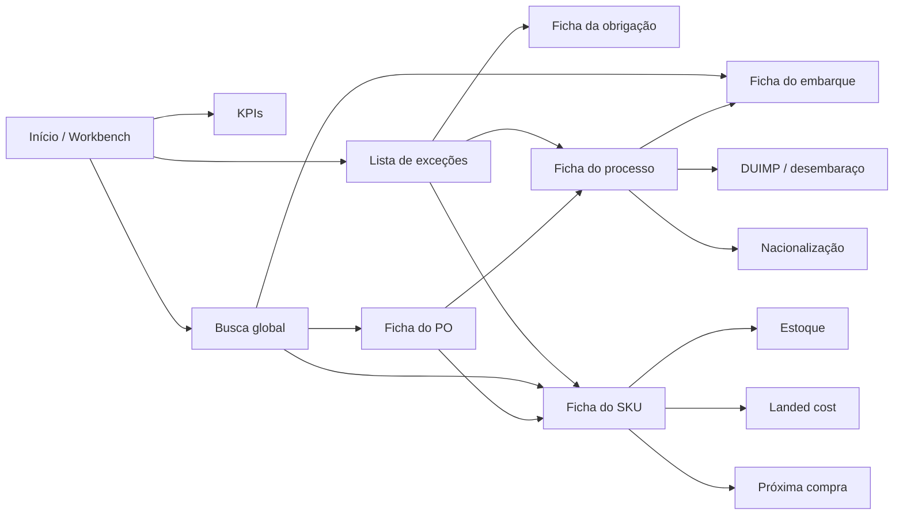
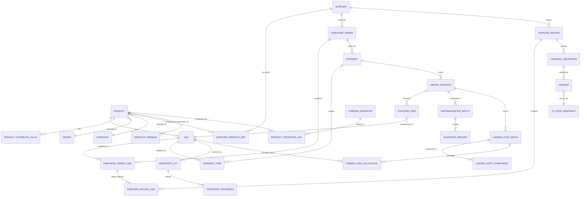

# Blueprint executivo de referência para sistema próprio de importação, landed cost, estoque e SKU

## Mapa do mercado

**Recorte usado abaixo:** soluções com evidência pública suficiente para extrair padrão funcional, informacional ou de dados.  
**Radar sem base pública suficiente nesta pesquisa para extrair arquitetura com segurança:** Softway Comex, Conexos Cloud, Nexcomex, Prime Comex, Fastcomex, Rota Comex, Mercosoft, Datamex, Actio, Wisecomex e Linx Comex.

| Sistema | Origem | Categoria | Porte-alvo | O que faz de melhor na evidência pública | Fonte |
|---|---|---|---|---|---|
| Portal Único Siscomex / DUIMP | BR | Processo regulatório obrigatório | Todo importador | Catálogo de Produtos versionado, vínculo com operador estrangeiro, atributos por NCM, integração por API, relação direta com DUIMP e LPCO | citeturn17view2turn23view0turn38view0turn38view1turn38view2 |
| Gett Pro | BR | Comex + ERP especializado | Pequeno a médio importador/distribuidor | Liga processo de importação a contas a pagar/receber, embarque, NF-e, estoque e custo automático | citeturn17view6 |
| eComex Pulse | BR | Comex / DUIMP / risco / logística | Médio a grande | Menu explícito com Gestão de Comex, DUIMP-Catálogo, OEA, IA e inteligência logística | citeturn30view3 |
| Quick Comex | BR | Automação documental de comex | Despachantes e operações enxutas | Discurso fortemente centrado em poucas telas, lembrete do próximo passo, automação de LI/DI/DU-E e catálogo Portal Único | citeturn30view4 |
| Invent Comex | BR | DUIMP/LPCO/API-first | Médio | Integração direta com APIs governamentais, catálogo, operador estrangeiro e fluxo DUIMP/LPCO | citeturn30view5 |
| TOTVS Protheus SIGAEIC | BR | Módulo ERP de importação | Médio a grande | Desembaraço, recebimento de importação, rateio/complemento de valor e adaptação à DUIMP | citeturn22search0turn22search1turn22search8turn22search13 |
| Sankhya Comércio Exterior | BR | Módulo ERP de importação | Médio | Follow-up por datas previstas e realizadas ao longo de todo o processo, da fabricação à chegada ao estoque | citeturn17view4turn22search14 |
| Senior ERP + integração com comex | BR | ERP com integração a parceiro de comex | Médio a grande | Web services e controle de pendências para sincronizar ERP e solução de comércio exterior | citeturn17view5 |
| Bysoft + CargoWise | BR / Global | Logística/compliance/comex | Médio a grande | Ponte local para ecossistema CargoWise; forte em cadeia logística e despachantes | citeturn30view2turn18view2 |
| SAP Global Trade Services | Global | GTM enterprise | Grande | Repositório central de compliance e classificação/regulação aduaneira | citeturn18view0turn35search3 |
| Oracle Global Trade Management | Global | GTM enterprise | Médio a grande | Conjunto mais amplo e explícito: classificação, landed cost simulation, supplier solicitation, customs, dashboards e screening | citeturn18view1turn39view2 |
| CargoWise | Global | Customs/logistics/accounting | Médio a grande | Cobertura global com expertise local inclusive Brasil; base centralizada de customs; auditoria e controles cambiais no financeiro | citeturn18view2turn37view2 |
| Descartes Visual Compliance / QuestaWeb | Global | Trade compliance / FTZ | Médio a grande | Screening regulatório e FTZ com foco em audit readiness e redução de custo aduaneiro | citeturn35search10turn18view5 |
| Thomson Reuters ONESOURCE Global Trade | Global | Conteúdo regulatório / classificação | Médio a grande | Classificação HS/ECN com conteúdo regulatório amplo e posição “audit ready” | citeturn35search1turn35search5turn35search25 |
| e2open Global Trade | Global | GTM | Médio a grande | Import Cost Calculator e visão de custos/duty por trade lane | citeturn18view3 |
| Flexport Control Tower | Global | Visibility / control tower | Médio a grande | Tracking por SKU e PO, milestones ponta a ponta e dashboards operacionais em “single pane of glass” | citeturn37view0turn37view1 |
| NetSuite | EUA / Global | ERP + inventory | Médio | Item master rico, lot/serial cost, landed cost, lead time, vendor bill variances e approvals/holds | citeturn17view7turn29view0turn29view1turn37view4turn36search1 |
| Cin7 | Global | Inventory / retail ops | SMB a mid-market | “True costs” com tarifas, landed cost e supplier charges; forte em catálogo multicanal | citeturn18view7 |
| Brightpearl + Inventory Planner | Global | Retail ops + planning | Mid-market varejo/distribuição | Forecast-to-PO integrado, automação operacional e visão conectada entre planejamento e execução | citeturn18view8turn27view2turn27view1 |
| Unleashed | Global | Inventory/distribution | SMB a médio | Rastreabilidade lote/série e landed cost médio ponderado | citeturn18view9turn14search1turn14search17 |
| Zoho Inventory | Global | Inventory | SMB | Bills com batch/serial e landed cost alocado por valor ou quantidade | citeturn32view6turn32view7 |
| Odoo Inventory | Global | Inventory | SMB a médio | Landed cost com métodos de rateio explícitos, além de lot/serial | citeturn10search16turn10search3turn10search4turn33search0 |
| Netstock | Global | Planning | Médio | Hierarquias dinâmicas para agrupar demanda e tabela+gráfico de planejamento | citeturn17view9turn27view0 |
| Inventory Planner | Global | Planning | SMB a médio varejo | Recomendação de compra e execução integrada com Brightpearl/Cin7/NetSuite | citeturn27view1turn27view2 |
| ToolsGroup | Global | Planning | Médio a grande | Multi-echelon inventory optimization orientado a nível de serviço | citeturn6search2turn6search21 |
| Lokad | Global | Planning | Médio a grande | Otimização decisória fina de compra/estoque baseada em automação quantitativa/econômica | citeturn6search3turn6search15 |
| Akeneo | Global | PIM | Médio a grande | Completeness, famílias, variantes e catálogo governado por atributos | citeturn17view8turn21search0turn21search2turn21search12 |
| Plytix | Global | PIM | SMB a médio | Product families simples, herança pai-variante e atributos de sistema claros | citeturn20view1turn20view2 |
| Salsify | Global | PXM/PIM | Médio a grande | Fonte única com ênfase em consistência, acurácia e rastreabilidade + automação | citeturn20view3 |
| inriver | Global | PIM | Médio a grande | Workflows/workspaces, modelo elástico e validação/enriquecimento para catálogos complexos | citeturn20view4turn20view5 |
| Pimcore | Global | PIM/MDM | Médio a grande | Modelo de dados customizável, data quality, onboarding/matching e distribuição multicanal | citeturn20view0turn28search2turn28search17 |

## Arquitetura funcional de referência

### Estrutura de módulos que emerge do mercado

**Observado nas fontes:** sistemas sérios convergem para separar explicitamente **cadastros mestres**, **compras**, **processo de trade/importação**, **logística/embarques**, **estoque**, **financeiro/custos** e **planejamento/analytics**. Essa convergência aparece em Gett, eComex, Oracle GTM, Flexport, Brightpearl/Inventory Planner, Netstock e Akeneo. citeturn17view6turn30view3turn39view2turn37view1turn27view2turn27view0turn17view8

**Inferência de desenho:** para a operação descrita, a estrutura mínima proporcional ao porte é de **oito domínios**. O erro mais comum a evitar é espalhar custo, câmbio e inbound em módulos diferentes sem um objeto comum de processo.

| Domínio | Consenso de mercado | O que varia |
|---|---|---|
| Início / Workbench | Quase sempre existe uma landing page, painel ou worklist focado em exceções | Alguns chamam de dashboard; outros de control tower ou landing page de tarefas citeturn37view3turn37view0turn30view4 |
| Produtos e cadastros | Produto/SKU, atributos, categorias/famílias, fabricantes, fornecedores e classificações | Em PIMs vira o centro do sistema; em ERPs fica subordinado a inventory/item master citeturn20view2turn21search0turn29view2turn38view2 |
| Compras | PO, recebimento, fatura do fornecedor | Alguns conectam diretamente a landed cost; outros deixam landed cost numa etapa própria citeturn32view2turn32view6turn27view2 |
| Importação | Processo, embarques, milestones, DUIMP/LPCO, desembaraço, nacionalização | Em GTM enterprise entra documentação, classification e screening; em BR entra fiscal/aduaneiro e integração Siscomex citeturn39view2turn17view2turn30view5turn17view4 |
| Estoque | Saldo, lotes/séries, movimentos, localizações | Uns trabalham por lots/serial at cost; outros por weighted average ou valuation layer | citeturn17view7turn29view1turn18view9turn33search0 |
| Financeiro e custos | AP, pagamentos, moedas, FX, impostos, landed cost | Alguns expõem FX variance e holds; outros escondem isso em backoffice | citeturn37view4turn36search1turn37view2 |
| Cobertura e planejamento | Forecast, reorder, buying recommendations, hierarchy views | Pode ser app separado, embutido no ERP ou inexistente | citeturn27view0turn27view1turn6search2turn6search3 |
| Governança e administração | papéis, integrações, audit trail, versões, período | Em BR com DUIMP/versionamento é mais explícito; em ERPs aparece como controle financeiro/auditoria | citeturn38view1turn31search0turn31search1turn37view2 |

**Arquitetura funcional de referência — inferência**

```mermaid
flowchart TB
    A[Início / Workbench] --> B[Produtos e Cadastros]
    A --> C[Compras]
    A --> D[Importação]
    A --> E[Estoque]
    A --> F[Financeiro e Custos]
    A --> G[Cobertura e Planejamento]
    A --> H[Governança e Administração]

    B --> B1[Produto / SKU]
    B --> B2[Fornecedor]
    B --> B3[Fabricante / Operador Estrangeiro]
    B --> B4[NCM / Atributos / Classificação]

    C --> C1[Pedido de Compra]
    C --> C2[Fatura do Fornecedor]
    C --> C3[Obrigações]

    D --> D1[Embarques]
    D --> D2[DUIMP / LPCO]
    D --> D3[Desembaraço]
    D --> D4[Nacionalização]

    E --> E1[Saldo Atual]
    E --> E2[Em Trânsito]
    E --> E3[Lotes / Séries]
    E --> E4[Movimentos]

    F --> F1[Contas a Pagar]
    F --> F2[Pagamentos EUR/BRL]
    F --> F3[Exposição Cambial]
    F --> F4[Landed Cost]

    G --> G1[Forecast]
    G --> G2[Cobertura]
    G --> G3[Próxima Compra]

    H --> H1[Versões]
    H --> H2[Auditoria]
    H --> H3[Aprovações]
    H --> H4[Integrações]
```



### Onde há consenso e onde o mercado diverge

**Consenso observado:**  
produto precisa existir como objeto forte; processo de importação precisa ser independente de PO e também navegável a partir dela; landed cost precisa puxar custos de frete/seguro/duty/tax; filas de trabalho precisam conviver com fichas de objeto; fechamentos e auditoria não ficam opcionais. citeturn38view0turn38view2turn32view2turn39view2turn37view3turn37view2turn31search0

**Divergência observada:**  
PIMs modelam o produto como núcleo de enriquecimento; ERPs modelam como item transacional; GTMs modelam pelas exigências regulatórias e documentais; planners modelam por agregações hierárquicas e risco. Isso muda o menu principal e também o jeito de navegar. citeturn21search12turn29view2turn39view2turn27view0

## Arquitetura de informação recomendada

### Seções de topo e regra de navegação

**Observado:** há dois paradigmas convivendo.

O primeiro é **navegação por objeto**: item/product record, operator, PO, shipment, bill. Isso aparece de forma explícita em Portal Único, NetSuite, Plytix e Akeneo. citeturn38view2turn29view2turn20view1turn21search22

O segundo é **navegação por fila de trabalho**: invoice landing page com infotiles, control tower, planning table, “próximo passo”, follow-up por data prevista/realizada. Isso aparece em Oracle Payables, Flexport, Netstock, Quick Comex e Sankhya. citeturn37view3turn37view0turn27view0turn30view4turn17view4

**Inferência recomendada:** combinar os dois, com **sete seções de topo**:

| Seção de topo | Conteúdo | Tipo dominante |
|---|---|---|
| Início | Workbench por exceção, KPIs, filas e atalhos | fila |
| Produtos | SKU, famílias, variantes, NCM, fabricante, fornecedor mapping | objeto |
| Compras | PO, faturas do fornecedor, obrigações a pagar | híbrido |
| Importação | embarques, DUIMP, desembaraço, nacionalizações | híbrido |
| Estoque | posição atual, em trânsito, movimentos, lotes | híbrido |
| Custos e financeiro | landed cost, pagamentos, câmbio, variações, fechamento | fila + objeto |
| Governança | auditoria, versionamento, integrações, permissões, relatórios | objeto administrativo |

### Tela central e padrão de detalhe

**Observado:** a melhor “tela central” do mercado não é um dashboard executivo genérico; é uma **workbench operacional**. Oracle mostra isso nas seis infotiles da landing page de faturas; Netstock mostra isso com planning table + graph por hierarquia; Flexport com control tower; Quick Comex com lembrete do próximo passo. citeturn37view3turn27view0turn37view0turn30view4

**Inferência recomendada:** a tela central do sistema próprio deve ser um **Workbench de abastecimento e importação**, com quatro blocos:

- Obrigações financeiras vencendo / em hold / sem matching
- Importações em atraso por milestone
- SKUs com risco de ruptura
- Divergências de custo/nacionalização a resolver

**Padrão de navegação para o detalhe — observado + inferência:**

- **Nova página:** PO, processo de importação, ficha de produto, landed cost batch, pagamento.  
- **Painel lateral:** revisão rápida, aprovação, histórico, divergências, preview de vínculo supplier SKU ↔ internal SKU.  
- **Modal:** buscas e vínculos curtos, como seleção de operador estrangeiro, anexos, confirmação de rateio. Portal Único usa modal para detalhes do operador estrangeiro; Plytix resolve ações curtas em painel lateral. citeturn38view1turn20view1

**Diagrama de navegação — inferência**



## Modelo de dados e ficha de produto

### Modelo de dados essencial

**Observado:**  
o mercado separa pelo menos estes núcleos: produto/item, fornecedor, PO, fatura/bill, embarque/shipment, documento regulatório/customs, estoque e custo. Portal Único ainda separa **produto** de **operador estrangeiro** e trata ambos com **versões**. NetSuite separa item master, vendor list, vendor bill, item receipt e variâncias. Oracle GTM adiciona classificação, country of origin, certificates e landed cost simulation. citeturn38view1turn38view2turn29view1turn37view4turn39view2

**Modelo recomendado — inferência**



### Onde os sistemas divergem no modelo

| Tema | Alternativas observadas | Por quê |
|---|---|---|
| Produto vs variante | **Produto modelo + variantes** em Akeneo; **família + herança** em Plytix; **item master transacional** em NetSuite; **modelo elástico/MDM** em Pimcore/inriver | profundidade de catalogação e governança variam por tipo de sistema citeturn21search2turn28search11turn20view1turn29view2turn20view0turn20view4 |
| Fornecedor vs fabricante | Portal Único separa operador estrangeiro/fabricante do produto; Oracle GTM enfatiza supplier solicitation/certificates; ERPs muitas vezes ficam só com vendor list | compliance e origem exigem granularidade além do fornecedor comercial citeturn38view1turn38view2turn39view2 |
| Custo final | NetSuite/Zoho/Odoo lançam landed cost sobre receipt/bill; Oracle GTM também simula cenários; Unleashed destaca weighted-average landed cost | alguns focam contabilização; outros decisão antecipada | citeturn32view2turn32view6turn33search0turn39view2turn18view9 |
| Planejamento | separado do transacional em Netstock/Inventory Planner/ToolsGroup/Lokad | requer hierarquia agregada, forecast e lógica de recomendação, não só saldo | citeturn27view0turn27view1turn6search2turn6search3 |
| Versionamento | explícito em Portal Único; implícito via system notes/history em NetSuite; workflow/state em PIMs | necessidade regulatória e de auditoria determina o rigor | citeturn38view1turn38view2turn29view1turn20view5turn20view0 |

### Ficha de produto / SKU de referência

**Observado:** os melhores sistemas agrupam o cadastro por **identidade/hierarquia**, **atributos técnicos**, **fiscal/compliance**, **logística**, **abastecimento/custo**, **traceabilidade** e **governança**. Akeneo usa famílias e completeness; Plytix expõe system attributes; Portal Único separa Dados Básicos, Descrição/Atributos, Anexos, Regimes e Histórico; NetSuite coloca campos de custo, lead time, vendor list; Zoho/Odoo ligam tracking e landed cost ao item. citeturn17view8turn20view2turn38view0turn38view2turn29view0turn29view1turn32view6turn32view7

| Grupo | Campos de referência | Quando ausente, o que deve bloquear |
|---|---|---|
| Identidade | SKU interno, nome curto, nome comercial, status, família/categoria, marca, linha, coleção, produto pai, eixos de variante | criar variante, publicar em catálogo, receber mapping externo |
| Cross-reference | código do fornecedor, descrição do fornecedor, GTIN/EAN, código interno Portal Único, fornecedor preferencial | matching automático de invoice/packing list/DUIMP; exige confirmação humana |
| Fiscal/compliance | NCM/HS, descrição técnica, modalidade, país de origem, fabricante/operador estrangeiro, atributos por NCM, regimes/licenças aplicáveis | uso em Catálogo/DUIMP/LPCO, pré-cálculo tributário, emissão fiscal | 
| Logística | UoM compra/venda/estoque, peso líquido/bruto, dimensões, volume/cubagem, unidades por inner/master carton, empilhamento, lead time, modal preferencial | rateio por peso/volume, booking, cubagem, recebimento, armazenagem |
| Custos | método de custeio, flag “track landed cost”, categoria de custo, preço de compra, último preço, custo médio, split method default | posting de landed cost, valuation, margem |
| Traceabilidade | lote/série obrigatório?, validade, fabricação, warranty, recall class | recebimento, venda, pós-venda |
| Governança | completeness score, owner, approval status, versão, motivo de alteração, anexos, histórico | ativação do SKU e avanço de processo |

**Bloqueios mínimos — inferência baseada nas fontes**

- Sem **NCM + atributos obrigatórios por NCM**: não ativar SKU para uso em importação/DUIMP. Portal Único exige item correspondente no catálogo e trabalha com atributos requeridos por NCM. citeturn38view0turn23view0  
- Sem **fabricante/operador estrangeiro ou país de origem**: bloquear avanço do processo aduaneiro quando exigido. citeturn38view1  
- Sem **peso/volume/UoM**: permitir compra, mas bloquear rateio por peso/volume e previsões logísticas. Rateios por peso/volume são padrão explícito em Odoo; package weight depende do campo Weight. citeturn33search0turn28search4  
- Sem **lead time / preferred supplier**: não bloquear operação, mas degradar planning e cobertura. NetSuite mantém lead time no item; planners dependem dessas dimensões. citeturn29view1turn27view0  
- Sem **supplier SKU mapping**: exigir confirmação manual no recebimento documental. **Isto é inferência**, apoiada no campo de código interno do Portal Único e na existência de itemVendorList/vendor context no NetSuite. citeturn38view2turn29view2

## Telas críticas

### Fila de contas a pagar e obrigações financeiras multimoeda

**Observado:** Oracle Payables resolve a entrada com landing page por infotiles; NetSuite expõe approval status, due date, currency, exchange rate, next approver, payment hold e posting period; CargoWise adiciona currency controls e audit trail; Magaya mantém relatórios de ganhos/perdas realizados e não realizados. citeturn37view3turn37view4turn37view2turn36search2turn36search6

**Wireframe — inferência**

```text
┌ Fila Financeira ─ Contas a Pagar / Obrigações ─────────────────────────────┐
│ [Moeda: EUR/BRL] [Vencimento] [Status] [Embarque] [Fornecedor] [Salvar view]│
│ KPIs: Vence 7d | Hold | Sem vínculo PO/Bill | Exposição EUR | FX variação   │
├─────────────────────────────────────────────────────────────────────────────┤
│ Forn. | Doc | Tipo | PO/Emb. | Moeda | Valor | FX data | FX var | Venc. | St│
│ Puma  | INV1| Bill | EMB-023 | EUR   | 18.2k | 12/08   | +1.8%  | 15/08 | AP│
│ DHL   | INV2| Frete| EMB-023 | BRL   | 32.1k | -       |   -    | 16/08 | OP│
│ Seg.  | INV3| Seguro|EMB-023 | EUR   | 0.9k  | 10/08   | +0.6%  | 18/08 | HL│
├─────────────────────────────────────────────────────────────────────────────┤
│ Ações em massa: aprovar | hold | vincular PO/embarque | gerar hedge note   │
└─────────────────────────────────────────────────────────────────────────────┘
```

**O que aparece primeiro**

- Contagens por exceção: vencendo, holds, aprovação pendente, sem vínculo PO/embarque, variação cambial relevante. Isso replica o padrão de infotiles/exception buckets. citeturn37view3turn36search12  
- Na grade: fornecedor, documento, tipo de custo, vínculo importação, moeda, valor original, data/taxa FX, variação vs recebimento, vencimento, status. NetSuite explicita vários desses campos na vendor bill; variações de preço/quantidade/câmbio são objetos próprios. citeturn37view4turn36search1turn36search5  

**Filtros**

Moeda, due date bucket, processo/embarque, fornecedor, tipo de obrigação, approval status, payment hold, divergência cambial, período contábil. citeturn37view4turn31search12

**Ação principal**

aprovar, colocar em hold, vincular custo ao embarque/lote de landed cost, pagar, ou reclassificar obrigação. Oracle e NetSuite deixam approval/hold explícitos; CargoWise/Magaya reforçam o tratamento de FX e audit trail. citeturn37view3turn37view4turn37view2turn36search2

**Navegação recomendada**

clique abre **ficha da obrigação** em nova página; histórico/approval/comments em painel lateral; modal só para quick matching.

### Posição de estoque com visão temporal

**Observado:** Flexport e Control Tower trabalham com PO e tracking por SKU; Netstock permite hierarquias de produto/localização/risco; Brightpearl+Inventory Planner traduz forecast em PO e os empurra ao ERP; Flexport acompanha PO → shipment → clearance → delivery. citeturn37view0turn37view1turn27view0turn27view2

**Wireframe — inferência**

```text
┌ Posição de Estoque Temporal ────────────────────────────────────────────────┐
│ [SKU/Marca/Categoria] [Depósito] [Canal] [Horizonte 90d] [Hierarquia ▼]    │
│ KPIs: Disponível hoje | Em trânsito ETA 30d | Próx. ciclo | Cobertura dias │
├─────────────────────────────────────────────────────────────────────────────┤
│ SKU        | Disp. | Reserv. | ATP | Em trânsito | ETA méd. | Próx compra  │
│ RKT-470-42 |  120  |   35    | 85  |    240      | 18 dias  | +300 em PO    │
│ RKT-470-43 |   48  |   20    | 28  |     80      | 18 dias  | +120 em PO    │
├─────────────────────────────────────────────────────────────────────────────┤
│ Timeline do SKU selecionado                                                │
│ Hoje ─────┬──── saída prevista ──┬──── recepção aérea ──┬──── recepção mar │
│           85 ATP                 +40 ETA 08/08          +200 ETA 22/08     │
└─────────────────────────────────────────────────────────────────────────────┘
```

**O que aparece primeiro**

- Separação explícita entre **saldo disponível agora**, **comprometido**, **em trânsito por ETA**, **planejado no próximo ciclo**.  
- A camada de tempo precisa estar no topo; não enterrada em relatório. Isso é coerente com planners e control towers, não com ERPs puros. citeturn37view0turn27view0turn27view2

**Filtros**

SKU, família, marca, depósito, canal, fornecedor, embarque, janela de ETA, risco de ruptura, cobertura em dias, hierarquia. Netstock mostra que a ordem da hierarquia muda a visualização sem alterar dado base. citeturn27view0

**Ação principal**

abrir o SKU; abrir o embarque; abrir a recomendação de compra; simular cobertura com/sem um embarque.

**Navegação recomendada**

lista com drill-down hierárquico; detalhe do SKU em nova página com subabas **saldo / inbound / demanda / custo / histórico**.

### Custo final por produto com composição e rateio

**Observado:** NetSuite landed cost incorpora shipping, freight, origin/destination charges, taxes, duties e insurance; Oracle GTM tem landed cost simulator; Zoho permite alocar landed cost por valor ou quantidade; Odoo explicita split methods por equal, current cost, quantity, weight e volume; Unleashed destaca weighted average landed costs. citeturn32view2turn39view2turn32view6turn33search0turn18view9

**Wireframe — inferência**

```text
┌ Landed Cost Batch ─ EMB-023 / DUIMP-11892 ─────────────────────────────────┐
│ Base: [Recebimentos vinculados] [Moeda origem] [FX snapshot] [Rascunho/Pos]│
├─────────────────────────────────────────────────────────────────────────────┤
│ Componentes                                                                │
│ Mercadoria  | 148.200 EUR                                                  │
│ Frete       |  18.900 EUR   [rateio: peso]                                 │
│ Seguro      |   1.100 EUR   [rateio: valor]                                │
│ II/IPI/PIS… |  92.400 BRL   [rateio: valor aduaneiro]                      │
│ Desp. nac.  |  27.300 BRL   [rateio: qty]                                  │
├─────────────────────────────────────────────────────────────────────────────┤
│ SKU        | Qtd | FOB unit | Add. rateado | LC unit | Método | Δ margem   │
│ RKT-470-42 | 120 | 42.10    | 11.33        | 53.43   | mix     | -4.2 pp   │
│ ...                                                                         │
├─────────────────────────────────────────────────────────────────────────────┤
│ Ações: recalcular | mudar critério | travar FX | postar | reabrir control. │
└─────────────────────────────────────────────────────────────────────────────┘
```

**O que aparece primeiro**

- Batch de custo por embarque/DUIMP ou nacionalização, não por tela estática de produto.  
- Componentes do custo antes da grade por SKU.  
- Rateio visível por componente, não uma coluna única “outros”. Oracle/NetSuite/Odoo/Zoho deixam claro que landed cost é composto e alocado. citeturn32view2turn39view2turn33search0turn32view6

**Filtros**

embarque, DUIMP, recebimento, período, moeda, status draft/posted, método de rateio, SKU, categoria.

**Ação principal**

recalcular, comparar cenários, postar no valuation, reabrir controladamente, explicar custo unitário.

**Navegação recomendada**

da grade do SKU, abrir “explicar custo” em painel lateral; do batch, abrir detalhe completo em nova página.

### Pipeline de importação

**Observado:** Sankhya modela datas previstas/realizadas por etapa desde fabricação até entrada no estoque; Gett vincula AP/AR, embarque, desembaraço e estoque por processo; Quick enfatiza fluxo guiado com próximo passo; Portal Único e Invent estruturam Catálogo, Operador, DUIMP e LPCO como partes do fluxo obrigatório. citeturn17view4turn17view6turn30view4turn38view0turn30view5

**Wireframe — inferência**

```text
┌ Pipeline de Importação ─────────────────────────────────────────────────────┐
│ [Processo] [Fornecedor] [Modal] [Milestone vencido] [Incoterm] [Analista]  │
│ KPIs: aguardando booking | embarcado | em trânsito | canal aduaneiro | Nac │
├─────────────────────────────────────────────────────────────────────────────┤
│ Processo | PO | Modal | Fabr. | Booking | ETD | ETA | DUIMP | Desemb. | St │
│ IMP-023  | 87 | Mar   | ok    | ok      | 12/07|22/08| reg   | pend    | !  │
│ IMP-024  | 88 | Aéreo | atras  | -       |  -   | -   | -     | -       | !! │
├─────────────────────────────────────────────────────────────────────────────┤
│ Processo selecionado                                                        │
│ [Pedido]─[Fatura]─[Embarques]─[DUIMP/LPCO]─[Desembaraço]─[Nacionalização]  │
│ Previsto x Realizado | Docs faltantes | Custos pendentes | SKUs afetados   │
└─────────────────────────────────────────────────────────────────────────────┘
```

**O que aparece primeiro**

milestones, atraso, ETA, documentação faltante, pendência financeira, pendência aduaneira. Follow-up por data prevista/realizada é padrão forte de importação BR. citeturn17view4turn22search14

**Filtros**

fornecedor, modal, incoterm, embarque parcial, processo com DUIMP pendente, canal/etapa, ETA window, atraso, analista.

**Ação principal**

atualizar milestone, anexar doc, registrar DUIMP/LPCO, gerar obrigação, nacionalizar parcial, avisar impacto em estoque.

**Navegação recomendada**

processo em full page com trilha horizontal de etapas; subetapas por embarque e por item.

### Cadastro e ficha de produto

**Observado:** Portal Único tem abas Dados Básicos, Descrição/Atributos, Anexos, Regimes Especiais e Histórico; Akeneo usa completeness e family/family variant; Plytix mostra family no painel lateral e herança pai-variante; NetSuite expõe item record com landed cost, lead time, cost and vendor context. citeturn38view0turn38view2turn17view8turn21search0turn20view1turn29view0turn29view1

**Wireframe — inferência**

```text
┌ SKU ─ RKT-470-42 ─ Raquete 470 / Azul / 4 1/4 ─────────────────────────────┐
│ Status: Ativo | Completeness: 92% | Uso: Comprar✓ Importar✓ Vender✓         │
│ Chips: NCM OK | Fabricante OK | Peso OK | landed cost OK | série não        │
├─────────────────────────────────────────────────────────────────────────────┤
│ Abas: Identidade | Fiscal/Comex | Logística | Custo | Variantes | Histórico │
├─────────────────────────────────────────────────────────────────────────────┤
│ Identidade: SKU, parent, brand, line, variant axes, supplier refs          │
│ Fiscal/Comex: NCM, atributos, origem, fabricante, operador, docs, regime   │
│ Logística: UoM, peso, cubagem, caixa, lead time, depósito preferencial     │
│ Custo: método, LC flag, preço compra, custo médio, último custo            │
│ Variantes: grade tamanho/cor e heranças                                     │
│ Histórico: versões, diffs, quem mudou, motivo                               │
└─────────────────────────────────────────────────────────────────────────────┘
```

**O que aparece primeiro**

header do SKU com **status + completeness + blockers de processo**. Akeneo prova o valor de completeness visível; Portal Único prova o valor de histórico/versionamento; NetSuite prova que custo e lead time pertencem ao item. citeturn17view8turn38view2turn29view1

**Filtros**

na lista de produtos: completeness, família, variante, NCM, fabricante, uso em importação, missing blockers, status, atualização recente.

**Ação principal**

enriquecer cadastro, corrigir blocker, aprovar versão, vincular supplier code, publicar para uso operacional.

**Navegação recomendada**

lista em grade; ficha em full page; quick-edit de família/atributos leves no side panel; modal só para buscar fabricante/operador.

## Controles, padrões de UI/UX, anti-padrões e ideias prioritárias

### Controles obrigatórios

**Observado em praticamente todos os sistemas sérios**

| Controle | Evidência |
|---|---|
| Versionamento efetivo de produto e operador estrangeiro | Portal Único usa versões, retificação, retroatividade e histórico | citeturn38view1turn38view2 |
| Histórico/audit trail legível | Portal Único histórico; CargoWise full audit trail; NetSuite system notes/history | citeturn38view1turn38view2turn37view2turn29view1 |
| Aprovação explícita antes de pagar | NetSuite vendor bill approval status / next approver | citeturn37view4 |
| Payment hold | NetSuite payment hold impede processamento | citeturn37view4 |
| Fechamento de período e reabertura com justificativa | NetSuite reopen with justification; Brightpearl accounting period lock; Odoo lock dates | citeturn31search0turn31search1turn31search6turn31search17 |
| Variâncias de quantidade, preço e câmbio entre receipt e bill | NetSuite vendor bill variances | citeturn36search1turn36search5 |
| Controle cambial no financeiro | CargoWise currency controls; Magaya gains/losses reports | citeturn37view2turn36search2turn36search6 |
| Estados de rascunho versus ativo | Portal Único usa rascunho/ativado/desativado | citeturn38view0 |
| Bloqueio por dados faltantes/completude | Akeneo completeness; atributos obrigatórios por NCM no Portal Único | citeturn17view8turn23view0 |
| Anexo documental associado ao objeto | Portal Único permite anexos e histórico; Oracle GTM versiona documentação | citeturn38view2turn39view2 |

**Inferência para o sistema novo**

Não permitir:
- alterar silenciosamente custo postado;
- alterar NCM/eixos de variante/UoM de SKU com transação aberta;
- mudar saldo por edição direta sem movimento de ajuste com motivo;
- reabrir landed cost ou período sem justificativa, usuário e diff.

### Padrões de UI/UX a adotar

**Observado + inferência acionável**

- Usar **uma landing page operacional por exceção**, não apenas dashboard de KPI. Oracle e Flexport mostram o padrão correto. citeturn37view3turn37view0  
- Manter **tabelas densas**, com filtros persistentes e views salvas por papel. Quick vende “poucas telas”; Netstock reorganiza a visualização por hierarquia sem mexer no dado base. citeturn30view4turn27view0  
- Exibir **status chips semânticos** no header: Ativo, Rascunho, Hold, Aprovado, FX divergence, ETA risk. Portal Único e NetSuite deixam estados claros. citeturn38view0turn37view4  
- Na lista operacional, fixar colunas-tronco: objeto, status, próximo passo, dono, data crítica, impacto financeiro. **Inferência** sustentada pelos workbenches observados. citeturn37view3turn37view0turn17view4  
- Em telas longas, usar **painel lateral** para revisão rápida; **full page** para edição estrutural; **modal** apenas para busca/vínculo curto. Portal Único e Plytix apontam esse mix. citeturn38view1turn20view1  
- Toda tela financeira deve mostrar **moeda, taxa e data da taxa** no mesmo plano visual do valor. NetSuite torna isso explícito. citeturn37view4  
- Toda tela de custo deve explicar o **caminho do valor**: componente → critério de rateio → custo unitário. Odoo/Zoho/NetSuite/Oracle deixam o modelo de composição claro. citeturn33search0turn32view6turn32view2turn39view2  
- Toda tela de produto deve exibir **completeness e blockers de processo** no topo. Akeneo prova o padrão. citeturn17view8  
- Toda tela de cobertura deve unir **saldo atual + inbound + planned** numa única linha temporal. Flexport + planners apontam isso. citeturn37view1turn27view2turn27view0  
- Estados vazios devem orientar ação: “sem operator link”, “sem weight”, “sem landed cost method”, “sem NCM attribute”. **Inferência** derivada de todos os blockers observados. citeturn23view0turn38view2turn29view1  

### Anti-padrões a evitar

**Observado em avaliações públicas e documentação**

| Anti-padrão | Evidência pública |
|---|---|
| UI densa porém pouco orientada, com sensação de ferramenta “cluttered/outdated” | Reviews públicos de NetSuite destacam UI cluttered/outdated e onboarding pesado | citeturn25search3turn25search11 |
| Curva de aprendizado alta demais para tarefas simples | CargoWise reviewers apontam complexidade; Akeneo reviews citam steep learning curve fora do básico; Odoo reviews também | citeturn25search26turn26search15turn26search6 |
| Suporte e documentação fracos virando gargalo operacional | CargoWise Capterra concentra críticas em suporte/documentação; revisões públicas de Cin7 citam reporting fraco, bugs e sync issues | citeturn25search2turn25search18turn26search16turn26search8 |
| Landed cost/profit escondido do item e da transação | Usuário Zoho relata não ver landed cost/profit no nível do item/estimate/order | citeturn32view3 |
| Integrações que geram divergência de estoque/custo e não mostram confiança do match | críticas públicas a Cin7 falam em inventory syncing errors e instability | citeturn26search8 |
| Misturar operação e governança sem trilha clara | risco mitigado em Portal Único/NetSuite/CargoWise pela ênfase em versão, histórico e audit trail; quando isso falta, o usuário perde confiança | citeturn38view1turn38view2turn29view1turn37view2 |

### Dez ideias com maior relação valor/esforço

| Ideia | De onde veio | Por que vale | Complexidade estimada |
|---|---|---|---|
| Workbench único de abastecimento e importação | Oracle invoice landing page + Flexport control tower + Sankhya follow-up | reduz troca de contexto; concentra exceções reais | Média citeturn37view3turn37view0turn17view4 |
| Linha temporal por SKU com “disponível / em trânsito / próximo ciclo” | Flexport + Netstock + Brightpearl/Inventory Planner | entrega a visão executiva pedida sem virar APS completo | Média citeturn37view1turn27view0turn27view2 |
| Tabela de cross-reference supplier SKU ↔ internal SKU com confiança/status | Portal Único código interno + NetSuite vendor context | elimina matching manual repetitivo e reduz erro documental | Média citeturn38view2turn29view2 |
| Landed cost batch com comparador de critérios | Odoo + Zoho + Oracle GTM + NetSuite | alto impacto em margem; fácil explicar e auditar | Média citeturn33search0turn32view6turn39view2turn32view2 |
| Bloqueios por completude orientados a processo | Akeneo + Portal Único | transforma cadastro em controle operacional, não burocracia | Baixa/Média citeturn17view8turn23view0turn38view2 |
| Milestones previstos x realizados por processo e embarque | Sankhya + Gett + Quick | dá previsibilidade sem complexidade de TMS | Baixa/Média citeturn17view4turn17view6turn30view4 |
| AP multimoeda com FX variance e payment hold nativos | NetSuite + CargoWise + Magaya | controla exposição cambial e disputa financeira no fluxo normal | Média citeturn37view4turn36search1turn37view2turn36search2 |
| Reabertura controlada com justificativa e diff | NetSuite + Brightpearl + Portal Único | governança forte com esforço baixo | Baixa citeturn31search0turn31search1turn38view1turn38view2 |
| Header do SKU com chips de blockers e uso permitido | Akeneo + Portal Único + NetSuite | acelera decisão e reduz erro de processo | Baixa citeturn17view8turn38view2turn29view1 |
| Drill-down “explique meu custo unitário” | Oracle GTM simulator + Unleashed + NetSuite | valor alto para pricing, compras e diretoria; evita planilha paralela | Média citeturn39view2turn18view9turn32view2 |

**Síntese final de desenho — inferência**

Se o objetivo é capturar o melhor dos sistemas grandes sem virar ERP pesado, a espinha dorsal correta é:

1. **Produto forte e governado**  
2. **Processo de importação como objeto de primeira classe**  
3. **Landed cost batch por embarque/nacionalização**  
4. **Fila financeira multimoeda com variâncias explícitas**  
5. **Tela executiva de disponibilidade temporal por SKU**  
6. **Versionamento + auditoria como regra, não add-on**

Essa combinação é a interseção mais consistente entre o que os sistemas de comex, GTM, inventory planning e PIM fazem melhor hoje. citeturn38view2turn39view2turn37view1turn27view0turn20view0turn20view4